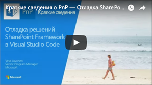
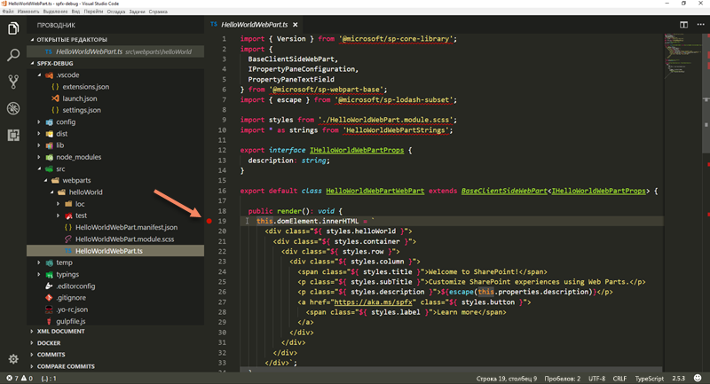
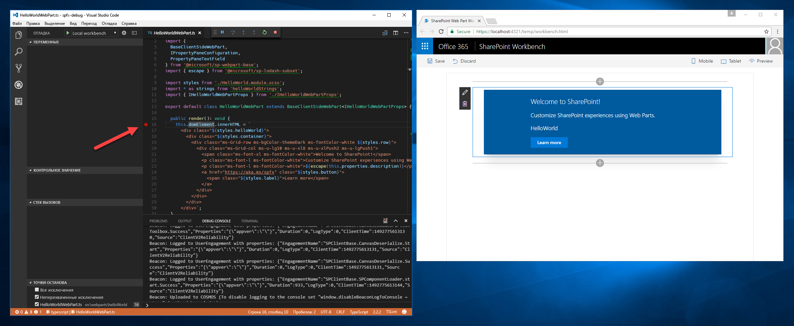
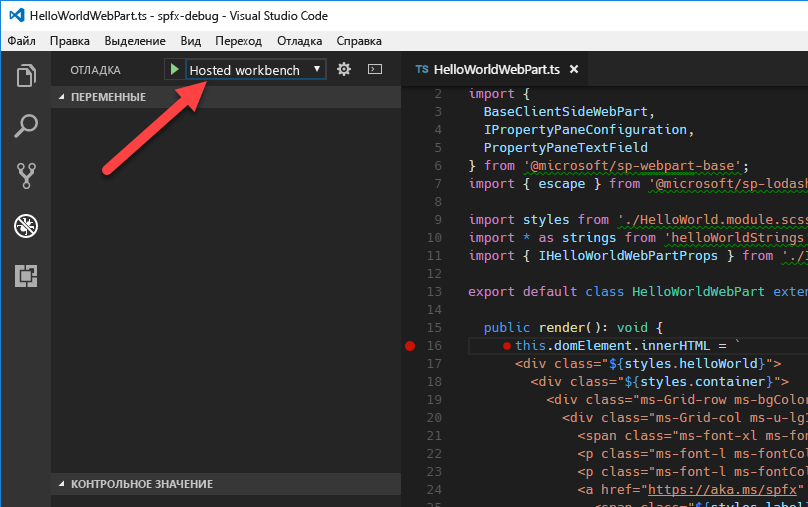
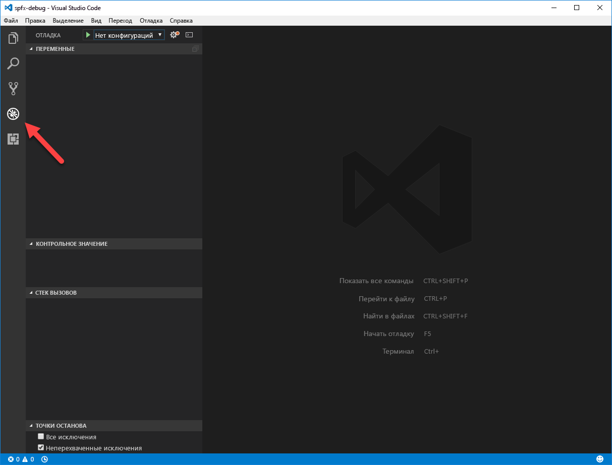

# <a name="debug-sharepoint-framework-solutions-in-visual-studio-code"></a>Отладка решений SharePoint Framework в Visual Studio Code

Visual Studio Code — это популярный редактор кода, часто используемый для создания решений SharePoint Framework. Настроив отладку решения SharePoint Framework в Visual Studio Code, вы можете эффективнее пошагово выполнять код и исправлять ошибки. В этой статье описываются необходимые условия и действия по настройке Visual Studio Code для отладки решений SharePoint Framework.

Шаги по включению отладки в Visual Studio Code также приведены в видео [на канале SharePoint PnP на YouTube](https://www.youtube.com/watch?v=oNChcluMrm8&list=PLR9nK3mnD-OXZbEvTEPxzIOMGXj_aZKJG). 

<a href="https://www.youtube.com/watch?v=oNChcluMrm8&list=PLR9nK3mnD-OXZbEvTEPxzIOMGXj_aZKJG">

</a>

## <a name="prerequisites"></a>Обязательные условия

Настроить Visual Studio Code для отладки решений SharePoint Framework проще всего с помощью Google Chrome и расширения Debugger for Chrome. Начиная с генератора yeoman для SharePoint Framework версии 1.3.4, шаблоны проекта (веб-частей и расширений) по умолчанию будут поставляться с предварительно установленными требуемыми компонентами и будут требовать установку необходимых расширений Visual Studio Code. В этом случае вам будет предложено установить отладчик для расширения Visual Studio Code для Chrome.

Вам также понадобится браузер Google Chrome. Скачайте и установите последнюю версию Google Chrome со страницы [https://www.google.com/chrome/browser/desktop/index.html](https://www.google.com/chrome/browser/desktop/index.html).

Если вы используете генератор yeoman для SharePoint Framework версии раньше за 1.3.4, то вы можете установить расширение отладчика для Chrome для Visual Studio Code из [магазина Visual Studio](https://marketplace.visualstudio.com/items?itemName=msjsdiag.debugger-for-chrome).

## <a name="debug-configurations"></a>Конфигурации отладки

Конфигурация отладки находится в файле launch.json в папке рабочей области Visual Studio Code:

```
project-name\.vscode
```

Launch.json содержит две конфигурации отладки:
* Конфигурация локальной рабочей области
* Конфигурация размещенной рабочей области

## <a name="debug-sharepoint-framework-solution-using-local-workbench"></a>Отладка решения SharePoint Framework с помощью локальной рабочей области

Вы можете использовать локальную рабочую область, чтобы проверить, корректно ли работает веб-часть. Локальная рабочая область хорошо подходит для тестирования всех сценариев, не требующих связи с SharePoint, а также для автономной разработки.

Настроив Visual Studio Code для отладки решений SharePoint Framework с помощью Google Chrome и локальной рабочей области, вы можете проверить, корректно ли все работает.

### <a name="configure-a-breakpoint"></a>Настройка точки останова

В Visual Studio Code откройте основной исходный файл веб-части и добавьте точку останова на первой строке метода **render**. Для этого щелкните слева от номера строки или выделите строку кода в редакторе и нажмите клавишу **F9**.



В Visual Studio Code откройте меню **Вид** и выберите пункт **Интегрированный терминал** или нажмите клавиши **CTRL+`**. В терминале выполните следующую команду:

```sh
gulp serve --nobrowser
```

При этом будет выполнена сборка решения SharePoint Framework и запустится локальный веб-сервер для предоставления выходных файлов. Так как отладчик запустит собственный экземпляр браузера, мы используем аргумент **--nobrowser**, чтобы задача **serve** не открывала окно браузера.


### <a name="start-debugging-in-visual-studio-code"></a>Начало отладки с помощью Visual Studio Code

Когда задача gulp будет выполнена, переместите фокус в область кода Visual Studio Code и нажмите клавишу **F5** (или выберите в меню **Отладка** пункт **Запустить отладку**). Будет запущен режим отладки Visual Studio Code: цвет строки состояния изменится на оранжевый, и откроется новое окно Google Chrome с локальной версией рабочей области SharePoint.


> Обратите внимание, что в этот момент точка останова отключена, так как код веб-части еще не загружен. SharePoint Framework загружает веб-части по запросу только после их добавления на страницу.

### <a name="add-web-part-to-canvas"></a>Добавление веб-части на холст

Чтобы убедиться, что отладка работает, добавьте веб-часть на холст в рабочей области.


Обратите внимание, что после загрузки кода на страницу индикатор точки останова изменился на активный.



Если теперь обновить страницу, в Visual Studio Code будет достигнута точка останова, и вы сможете проверить все свойства и пошагово выполнить код.


## <a name="debug-sharepoint-framework-solution-using-hosted-workbench"></a>Отладка решения SharePoint Framework с помощью размещенной рабочей области

Чтобы проверить взаимодействие решения с SharePoint, можно использовать размещенную версию рабочей области SharePoint, доступную в каждом клиенте Office 365 по адресу **https://yourtenant.sharepoint.com/_layouts/workbench.aspx**. При создании решений SharePoint Framework вы будете регулярно выполнять такие проверки, поэтому рекомендуем создать отдельную конфигурацию отладки для размещенной версии рабочей области SharePoint.

Откройте launch.json и измените свойство *url* в конфигурации *размещенной рабочей области* на URL-адрес вашего сайта SharePoint.

```json
"url": "https://enter-your-SharePoint-site/_layouts/workbench.aspx",
```
В Visual Studio Code откройте панель **Отладка** и в раскрывающемся списке **Конфигурации** выберите новую конфигурацию **Размещенная рабочая область**.



Затем запустите отладку. Для этого нажмите клавишу **F5** или выберите в меню **Отладка** пункт **Запустить отладку**. Visual Studio Code переключится в режим отладки (это будет видно по оранжевой строке состояния), а расширение Debugger for Chrome откроет новое окно Google Chrome со страницей входа в Office 365.


После входа добавьте веб-часть на холст и обновите рабочую область. Как и в случае с локальной рабочей областью, в Visual Studio Code будет достигнута точка останова, и сможете проверить переменные и пошагово выполнить код.


## <a name="for-older-projects"></a>Для более ранних проектов
Если вы используете более раннюю версию генератора yeoman для SharePoint Framework, следуйте инструкциям ниже, чтобы создать файл launch.json вручную.

### <a name="create-debug-configuration-for-local-workbench"></a>Создание конфигурации отладки для локальной рабочей области

Откройте в Visual Studio Code панель **Отладка**.



В верхней части панели откройте раскрывающийся список **Конфигурации** и выберите пункт **Добавить конфигурацию...**


Выберите **Chrome** в списке сред отладки.


Замените содержимое созданного файла **launch.json** на следующее:

```json
{
    "version": "0.2.0",
    "configurations": [
        {
            "name": "Local workbench",
            "type": "chrome",
            "request": "launch",
            "url": "https://localhost:4321/temp/workbench.html",
            "webRoot": "${workspaceRoot}",
            "sourceMaps": true,
            "sourceMapPathOverrides": {
                "webpack:///../../../src/*": "${webRoot}/src/*",
                "webpack:///../../../../src/*": "${webRoot}/src/*",
                "webpack:///../../../../../src/*": "${webRoot}/src/*"
            },
            "runtimeArgs": [
                "--remote-debugging-port=9222"
            ]
        }
    ]
}
```

В этой конфигурации используется отладчик **chrome**, входящий в состав расширения **Debugger for Chrome**. Он указывает на URL-адрес локальной рабочей области в качестве отправной точки. При отладке кода TypeScript важна конфигурация, с помощью которой отладчик сопоставляет код JavaScript, выполняемый в браузере, с исходным кодом TypeScript.

### <a name="create-debug-configuration-for-hosted-workbench"></a>Создание конфигурации отладки для размещенной рабочей области

В Visual Studio Code откройте файл **./.vscode/launch.json**. Скопируйте имеющуюся конфигурацию отладки и укажите URL-адрес размещенной рабочей области:

```json
{
    "version": "0.2.0",
    "configurations": [
        {
            "name": "Local workbench",
            "type": "chrome",
            "request": "launch",
            "url": "https://localhost:4321/temp/workbench.html",
            "webRoot": "${workspaceRoot}",
            "sourceMaps": true,
            "sourceMapPathOverrides": {
                "webpack:///../../../src/*": "${webRoot}/src/*",
                "webpack:///../../../../src/*": "${webRoot}/src/*",
                "webpack:///../../../../../src/*": "${webRoot}/src/*"
            },
            "runtimeArgs": [
                "--remote-debugging-port=9222"
            ]
        },
        {
            "name": "Hosted workbench",
            "type": "chrome",
            "request": "launch",
            "url": "https://contoso.sharepoint.com/_layouts/workbench.aspx",
            "webRoot": "${workspaceRoot}",
            "sourceMaps": true,
            "sourceMapPathOverrides": {
                "webpack:///../../../src/*": "${webRoot}/src/*",
                "webpack:///../../../../src/*": "${webRoot}/src/*",
                "webpack:///../../../../../src/*": "${webRoot}/src/*"
            },
            "runtimeArgs": [
                "--remote-debugging-port=9222"
            ]
        }
    ]
}
```

## <a name="additional-information"></a>Дополнительная информация

- [Отладка веб-части SharePoint Framework (Элио Струйф)](http://www.eliostruyf.com/how-to-debug-your-sharepoint-framework-web-part/)
- [Отладка веб-части SPFx React с помощью Visual Studio Code (Велин Георгиев)](http://blog.velingeorgiev.pro/how-debug-sharepoint-framework-webpart-visual-studio-code)
