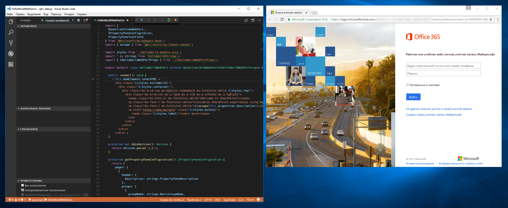

# <a name="debug-sharepoint-framework-solutions-in-visual-studio-code"></a><span data-ttu-id="74af3-103">Отладка решений SharePoint Framework в Visual Studio Code</span><span class="sxs-lookup"><span data-stu-id="74af3-103">Debug SharePoint Framework solutions in Visual Studio Code</span></span>

<span data-ttu-id="74af3-104">Visual Studio Code — это популярный редактор кода, часто используемый для создания решений SharePoint Framework.</span><span class="sxs-lookup"><span data-stu-id="74af3-104">Visual Studio Code is a popular code editor frequently used for building SharePoint Framework solutions.</span></span> <span data-ttu-id="74af3-105">Настроив отладку решения SharePoint Framework в Visual Studio Code, вы можете эффективнее пошагово выполнять код и исправлять ошибки.</span><span class="sxs-lookup"><span data-stu-id="74af3-105">By setting up debugging of your SharePoint Framework solution in Visual Studio Code, you can more efficiently step through your code and fix errors.</span></span> 

<span data-ttu-id="74af3-106">Шаги по включению отладки в Visual Studio Code также приведены в видео [на канале SharePoint PnP на YouTube](https://www.youtube.com/watch?v=oNChcluMrm8&list=PLR9nK3mnD-OXZbEvTEPxzIOMGXj_aZKJG).</span><span class="sxs-lookup"><span data-stu-id="74af3-106">You can also see the required steps to enable debugging in Visaul Studio Code by watching a video on the [SharePoint PnP YouTube Channel](https://www.youtube.com/watch?v=oNChcluMrm8&list=PLR9nK3mnD-OXZbEvTEPxzIOMGXj_aZKJG).</span></span> 

<a href="https://www.youtube.com/watch?v=oNChcluMrm8&list=PLR9nK3mnD-OXZbEvTEPxzIOMGXj_aZKJG">

</a>

## <a name="prerequisites"></a><span data-ttu-id="74af3-107">Предварительные условия</span><span class="sxs-lookup"><span data-stu-id="74af3-107">Prerequisites</span></span>

<span data-ttu-id="74af3-108">Настроить Visual Studio Code для отладки решений SharePoint Framework проще всего с помощью Google Chrome и расширения Debugger for Chrome.</span><span class="sxs-lookup"><span data-stu-id="74af3-108">The easiest way to configure Visual Studio Code to debug SharePoint Framework solutions is by using Google Chrome and the Debugger for Chrome Visual Studio Code extension.</span></span> <span data-ttu-id="74af3-109">Начиная с генератора Yeoman для SharePoint Framework версии 1.3.4, шаблоны проекта (веб-частей и расширений) по умолчанию поставляются с предварительно установленными необходимыми компонентами и требуют установку нужных расширений Visual Studio Code.</span><span class="sxs-lookup"><span data-stu-id="74af3-109">Starting with the SharePoint Framework yeoman generator version 1.3.4, the default project (web parts and extensions) templates will come setup with the pre-requisites and will prompt for the required Visual Studio Code extensions to install.</span></span> <span data-ttu-id="74af3-110">В этом случае вам будет предложено установить отладчик для расширения Visual Studio Code для Chrome.</span><span class="sxs-lookup"><span data-stu-id="74af3-110">In this case, it will prompt to install Debugger for Chrome Visual Studio Code extension.</span></span>

<span data-ttu-id="74af3-111">Также понадобится браузер Google Chrome.</span><span class="sxs-lookup"><span data-stu-id="74af3-111">You will also need Google Chrome browser.</span></span> <span data-ttu-id="74af3-112">[Скачайте и установите последнюю версию Google Chrome](https://www.google.com/chrome/browser/desktop/index.html).</span><span class="sxs-lookup"><span data-stu-id="74af3-112">Download and install the latest version of Google Chrome from [https://www.google.com/chrome/browser/desktop/index.html](https://www.google.com/chrome/browser/desktop/index.html).</span></span>

<span data-ttu-id="74af3-113">Если вы используете генератор Yeoman для SharePoint Framework более старой версии, чем 1.3.4, то можете [установить расширение отладчика для Chrome для Visual Studio Code из магазина Visual Studio Marketplace](https://marketplace.visualstudio.com/items?itemName=msjsdiag.debugger-for-chrome).</span><span class="sxs-lookup"><span data-stu-id="74af3-113">If you are using an older SharePoint Framework yeoman generator, older than 1.3.4, then you can install the Chrome debugger extension for Visual Studio Code from the [Visual Studio Marketplace](https://marketplace.visualstudio.com/items?itemName=msjsdiag.debugger-for-chrome).</span></span>

## <a name="debug-configurations"></a><span data-ttu-id="74af3-114">Конфигурации отладки</span><span class="sxs-lookup"><span data-stu-id="74af3-114">Debug configurations</span></span>

<span data-ttu-id="74af3-115">Конфигурация отладки находится в файле launch.json в папке рабочей области Visual Studio Code:</span><span class="sxs-lookup"><span data-stu-id="74af3-115">You can locate the debug configurations in the launch.json file under the Visua Studio Code workspace folder:</span></span>

```
project-name\.vscode
```

<span data-ttu-id="74af3-116">Launch.json содержит две конфигурации отладки:</span><span class="sxs-lookup"><span data-stu-id="74af3-116">The launch.json contains two debug configurations:</span></span>
* <span data-ttu-id="74af3-117">Конфигурация локальной рабочей области</span><span class="sxs-lookup"><span data-stu-id="74af3-117">Local workbench configuration</span></span>
* <span data-ttu-id="74af3-118">Конфигурация размещенной рабочей области</span><span class="sxs-lookup"><span data-stu-id="74af3-118">Hosted workbench configuration</span></span>

## <a name="debug-solution-using-local-workbench"></a><span data-ttu-id="74af3-119">Отладка решения с помощью локальной рабочей области</span><span class="sxs-lookup"><span data-stu-id="74af3-119">Debug SharePoint Framework solution using local workbench</span></span>

<span data-ttu-id="74af3-p104">Вы можете использовать локальную рабочую область, чтобы проверить, корректно ли работает веб-часть. Локальная рабочая область хорошо подходит для тестирования всех сценариев, не требующих связи с SharePoint, а также для автономной разработки.</span><span class="sxs-lookup"><span data-stu-id="74af3-p104">When building SharePoint Framework solutions, you can use the local workbench to verify that your web part is working correctly. Using local workbench is convenient for testing all scenarios that do not require communicating with SharePoint as well as for offline development.</span></span>

<span data-ttu-id="74af3-122">Настроив Visual Studio Code для отладки решений SharePoint Framework с помощью Google Chrome и локальной рабочей области, вы можете проверить, правильно ли все работает.</span><span class="sxs-lookup"><span data-stu-id="74af3-122">With Visual Studio Code configured for debugging SharePoint Framework solutions using Google Chrome and the local workbench, you can verify that everything is working as expected.</span></span>

### <a name="configure-a-breakpoint"></a><span data-ttu-id="74af3-123">Настройка точки останова</span><span class="sxs-lookup"><span data-stu-id="74af3-123">Configure a breakpoint</span></span>

1. <span data-ttu-id="74af3-124">В Visual Studio Code откройте основной исходный файл веб-части и добавьте точку останова в первой строке метода **render**. Для этого выберите поле слева от номера строки или выделите строку кода в редакторе и нажмите клавишу F9.</span><span class="sxs-lookup"><span data-stu-id="74af3-124">In Visual Studio Code open the main web part source file and add a breakpoint in the first line of the **render** method by either clicking on the margin left to the line number or by highlighting the code line in the editor and pressing the F9 key.</span></span>

    

2. <span data-ttu-id="74af3-126">В Visual Studio Code откройте меню **Вид** и выберите пункт **Интегрированный терминал** или нажмите клавиши **CTRL+\`**.</span><span class="sxs-lookup"><span data-stu-id="74af3-126">In Visual Studio Code, from the **View** menu select the **Integrated Terminal** option or press **CTRL+\`** on the keyboard.</span></span> 

3. <span data-ttu-id="74af3-127">В терминале выполните следующую команду:</span><span class="sxs-lookup"><span data-stu-id="74af3-127">In the terminal run the following command:</span></span>

    ```sh
    gulp serve --nobrowser
    ```

    <span data-ttu-id="74af3-128">При этом будет выполнена сборка решения SharePoint Framework и запустится локальный веб-сервер для предоставления выходных файлов.</span><span class="sxs-lookup"><span data-stu-id="74af3-128">Running this command will build your SharePoint Framework solution and start the local webserver to serve the output files.</span></span> <span data-ttu-id="74af3-129">Так как отладчик запускает собственный экземпляр браузера, мы используем аргумент **--nobrowser**, чтобы задача **serve** не открывала окно браузера.</span><span class="sxs-lookup"><span data-stu-id="74af3-129">Because the debugger will start its own instance of the browser, you use the **--nobrowser** argument to prevent the **serve** task from opening a browser window.</span></span>

    

### <a name="start-debugging-in-visual-studio-code"></a><span data-ttu-id="74af3-131">Начало отладки с помощью Visual Studio Code</span><span class="sxs-lookup"><span data-stu-id="74af3-131">Start debugging in Visual Studio Code</span></span>

<span data-ttu-id="74af3-132">Когда задача gulp будет выполнена, переместите курсор в область кода Visual Studio Code и нажмите клавишу F5 (или выберите в меню **Отладка** пункт **Запустить отладку**).</span><span class="sxs-lookup"><span data-stu-id="74af3-132">Once the gulp task is finished, move the focus to the code area of Visual Studio Code and press F5 (or from the Debug menu select the Start Debugging option).</span></span> 

<span data-ttu-id="74af3-133">Будет запущен режим отладки Visual Studio Code: цвет строки состояния изменится на оранжевый, а также откроется новое окно Google Chrome с локальной версией рабочей области SharePoint.</span><span class="sxs-lookup"><span data-stu-id="74af3-133">The debug mode in Visual Studio Code will start, changing the color of the status bar to orange and a new window of Google Chrome will open showing the local version of the SharePoint workbench.</span></span>

> [!NOTE] 
> <span data-ttu-id="74af3-134">В этот момент точка останова отключена, так как код веб-части еще не загружен.</span><span class="sxs-lookup"><span data-stu-id="74af3-134">At this point the breakpoint is disabled because the web part's code hasn't been loaded yet.</span></span> <span data-ttu-id="74af3-135">SharePoint Framework загружает веб-части по запросу только после их добавления на страницу.</span><span class="sxs-lookup"><span data-stu-id="74af3-135">Note, that at this point the breakpoint is disabled, because the web part's code hasn't been loaded yet. SharePoint Framework loads web parts on demand only after they have been added to the page.</span></span>


### <a name="add-a-web-part-to-the-canvas"></a><span data-ttu-id="74af3-137">Добавление веб-части на холст</span><span class="sxs-lookup"><span data-stu-id="74af3-137">Add web part to canvas</span></span>

<span data-ttu-id="74af3-138">Чтобы убедиться, что отладка работает, добавьте веб-часть на холст в рабочей области.</span><span class="sxs-lookup"><span data-stu-id="74af3-138">To verify that debugging is working, in the workbench add your web part to the canvas.</span></span>


<br/>

<span data-ttu-id="74af3-140">Обратите внимание, что после загрузки кода на страницу индикатор точки останова изменился на активный.</span><span class="sxs-lookup"><span data-stu-id="74af3-140">Notice, that with the code loaded on the page, the breakpoint indicator changed to active.</span></span>


<br/>

<span data-ttu-id="74af3-142">Если теперь обновить страницу, в Visual Studio Code будет достигнута точка останова, и вы сможете проверить все свойства и пошагово выполнить код.</span><span class="sxs-lookup"><span data-stu-id="74af3-142">If you now reload the page, your breakpoint in Visual Studio Code will be hit, and you will be able to inspect all properties and step through the code.</span></span>


## <a name="debug-solution-using-hosted-workbench"></a><span data-ttu-id="74af3-144">Отладка решения с помощью размещенной рабочей области</span><span class="sxs-lookup"><span data-stu-id="74af3-144">Debug SharePoint Framework solution using hosted workbench</span></span>

<span data-ttu-id="74af3-145">Чтобы проверить взаимодействие решения с SharePoint,</span><span class="sxs-lookup"><span data-stu-id="74af3-145">When building SharePoint Framework solutions that communicate with SharePoint you might want to verify the interaction between your solution in SharePoint.</span></span> <span data-ttu-id="74af3-146">можно использовать размещенную версию рабочей области SharePoint, доступную в каждом клиенте Office 365 по адресу `https://yourtenant.sharepoint.com/_layouts/workbench.aspx`.</span><span class="sxs-lookup"><span data-stu-id="74af3-146">To do this easily, you can use the hosted version of the SharePoint workbench which is available on every Office 365 tenant at `https://yourtenant.sharepoint.com/_layouts/workbench.aspx`.</span></span> 

<span data-ttu-id="74af3-147">При создании решений SharePoint Framework вы будете регулярно выполнять такие проверки, поэтому рекомендуем создать отдельную конфигурацию отладки для размещенной версии рабочей области SharePoint.</span><span class="sxs-lookup"><span data-stu-id="74af3-147">When building SharePoint Framework solutions, you will be doing such tests regularly and it is a good idea to create a separate debug configuration for the hosted version of the SharePoint workbench.</span></span>

### <a name="debug-solution-using-hosted-workbench"></a><span data-ttu-id="74af3-148">Отладка решения с помощью размещенной рабочей области</span><span class="sxs-lookup"><span data-stu-id="74af3-148">Debug SharePoint Framework solution using hosted workbench</span></span>

1. <span data-ttu-id="74af3-149">Откройте файл launch.json и измените свойство `url` в конфигурации *размещенной рабочей области* на URL-адрес вашего сайта SharePoint.</span><span class="sxs-lookup"><span data-stu-id="74af3-149">Open launch.json and update the `url` property under *Hosted workbench* configuration to your SharePoint site URL.</span></span>

    ```json
    "url": "https://enter-your-SharePoint-site/_layouts/workbench.aspx",
    ```

2. <span data-ttu-id="74af3-150">В Visual Studio Code откройте панель **Отладка** и в списке **Конфигурации** выберите новую конфигурацию **Размещенная рабочая область**.</span><span class="sxs-lookup"><span data-stu-id="74af3-150">In Visual Studio Code, activate the **Debug** pane and in the **Configurations** drop-down, select the newly added **Hosted workbench** configuration.</span></span>

    

3. <span data-ttu-id="74af3-152">Запустите отладку, нажав клавишу F5 или выбрав в меню **Отладка** пункт **Запустить отладку**.</span><span class="sxs-lookup"><span data-stu-id="74af3-152">Start debugging either by selecting F5 or by selecting the **Start Debugging** option on the **Debug** menu.</span></span> <span data-ttu-id="74af3-153">Visual Studio Code переключится в режим отладки (это будет видно по оранжевой строке состояния), а расширение Debugger for Chrome откроет новое окно Google Chrome со страницей входа в Office 365.</span><span class="sxs-lookup"><span data-stu-id="74af3-153">Visual Studio Code will switch into debug mode, indicated by the orange status bar, and the Debugger for Chrome extension will open a new instance of Google Chrome with the Office 365 login page.</span></span>

    

4. <span data-ttu-id="74af3-155">После входа добавьте веб-часть на холст и обновите рабочую область, как и в случае с локальной рабочей областью.</span><span class="sxs-lookup"><span data-stu-id="74af3-155">After you sign in, add the web part to the canvas and refresh the workbench, just like you did with the local workbench.</span></span> <span data-ttu-id="74af3-156">В Visual Studio Code будет достигнута точка останова, а вы сможете проверить переменные и пошагово выполнить код.</span><span class="sxs-lookup"><span data-stu-id="74af3-156">You will see the breakpoint in Visual Studio Code be hit, and you are able to inspect variables and step through the code.</span></span>

    

## <a name="for-older-projects"></a><span data-ttu-id="74af3-158">Для более ранних проектов</span><span class="sxs-lookup"><span data-stu-id="74af3-158">For older projects</span></span>

<span data-ttu-id="74af3-159">Если вы используете более раннюю версию генератора Yeoman для SharePoint Framework, следуйте инструкциям ниже, чтобы создать файл launch.json вручную.</span><span class="sxs-lookup"><span data-stu-id="74af3-159">If you are using an older version of SharePoint Framework yeoman generator, then follow the steps below to create the launch.json file manually.</span></span>

### <a name="create-debug-configuration-for-local-workbench"></a><span data-ttu-id="74af3-160">Создание конфигурации отладки для локальной рабочей области</span><span class="sxs-lookup"><span data-stu-id="74af3-160">Create debug configuration for local workbench</span></span>

1. <span data-ttu-id="74af3-161">Откройте в Visual Studio Code панель **Отладка**.</span><span class="sxs-lookup"><span data-stu-id="74af3-161">In Visual Studio Code activate the **Debug** pane.</span></span>

    

2. <span data-ttu-id="74af3-163">В верхней части панели откройте список **Конфигурации** и выберите пункт **Добавить конфигурацию**.</span><span class="sxs-lookup"><span data-stu-id="74af3-163">In the top section of the pane, open the **Configurations** drop-down and select the **Add Configuration...** option.</span></span>

    

3. <span data-ttu-id="74af3-165">Выберите **Chrome** в списке сред отладки.</span><span class="sxs-lookup"><span data-stu-id="74af3-165">From the list of debug environments select **Chrome**.</span></span>

    

4. <span data-ttu-id="74af3-167">Замените содержимое созданного файла **launch.json** на следующее:</span><span class="sxs-lookup"><span data-stu-id="74af3-167">Replace the contents of the generated **launch.json** file with:</span></span>

    ```json
    {
        "version": "0.2.0",
        "configurations": [
            {
                "name": "Local workbench",
                "type": "chrome",
                "request": "launch",
                "url": "https://localhost:4321/temp/workbench.html",
                "webRoot": "${workspaceRoot}",
                "sourceMaps": true,
                "sourceMapPathOverrides": {
                    "webpack:///../../../src/*": "${webRoot}/src/*",
                    "webpack:///../../../../src/*": "${webRoot}/src/*",
                    "webpack:///../../../../../src/*": "${webRoot}/src/*"
                },
                "runtimeArgs": [
                    "--remote-debugging-port=9222"
                ]
            }
        ]
    }
    ```

    <span data-ttu-id="74af3-168">В этой конфигурации используется отладчик **Chrome**, который входит в состав расширения **Debugger for Chrome**.</span><span class="sxs-lookup"><span data-stu-id="74af3-168">This configuration uses the **chrome** debugger provided with the **Debugger for Chrome** extension.</span></span> <span data-ttu-id="74af3-169">Он указывает на URL-адрес локальной рабочей области в качестве отправной точки.</span><span class="sxs-lookup"><span data-stu-id="74af3-169">It points to the URL of the local workbench as the starting point.</span></span> <span data-ttu-id="74af3-170">При отладке кода TypeScript важна конфигурация, с помощью которой отладчик сопоставляет код JavaScript, выполняемый в браузере, с исходным кодом TypeScript.</span><span class="sxs-lookup"><span data-stu-id="74af3-170">What is essential in debugging TypeScript code, is the configuration of source maps that the debugger uses to map the JavaScript running in the browser to the original TypeScript code.</span></span>

### <a name="create-debug-configuration-for-hosted-workbench"></a><span data-ttu-id="74af3-171">Создание конфигурации отладки для размещенной рабочей области</span><span class="sxs-lookup"><span data-stu-id="74af3-171">Create debug configuration for hosted workbench</span></span>

1. <span data-ttu-id="74af3-172">В Visual Studio Code откройте файл **./.vscode/launch.json**.</span><span class="sxs-lookup"><span data-stu-id="74af3-172">In Visual Studio Code open the **./.vscode/launch.json** file.</span></span> 

2. <span data-ttu-id="74af3-173">Скопируйте имеющуюся конфигурацию отладки и укажите URL-адрес размещенной рабочей области:</span><span class="sxs-lookup"><span data-stu-id="74af3-173">Copy the existing debug configuration and use the URL of the hosted workbench:</span></span>

    ```json
    {
        "version": "0.2.0",
        "configurations": [
            {
                "name": "Local workbench",
                "type": "chrome",
                "request": "launch",
                "url": "https://localhost:4321/temp/workbench.html",
                "webRoot": "${workspaceRoot}",
                "sourceMaps": true,
                "sourceMapPathOverrides": {
                    "webpack:///../../../src/*": "${webRoot}/src/*",
                    "webpack:///../../../../src/*": "${webRoot}/src/*",
                    "webpack:///../../../../../src/*": "${webRoot}/src/*"
                },
                "runtimeArgs": [
                    "--remote-debugging-port=9222"
                ]
            },
            {
                "name": "Hosted workbench",
                "type": "chrome",
                "request": "launch",
                "url": "https://contoso.sharepoint.com/_layouts/workbench.aspx",
                "webRoot": "${workspaceRoot}",
                "sourceMaps": true,
                "sourceMapPathOverrides": {
                    "webpack:///../../../src/*": "${webRoot}/src/*",
                    "webpack:///../../../../src/*": "${webRoot}/src/*",
                    "webpack:///../../../../../src/*": "${webRoot}/src/*"
                },
                "runtimeArgs": [
                    "--remote-debugging-port=9222"
                ]
            }
        ]
    }
    ```

## <a name="see-also"></a><span data-ttu-id="74af3-174">См. также</span><span class="sxs-lookup"><span data-stu-id="74af3-174">See also</span></span>

- [<span data-ttu-id="74af3-175">Отладка веб-части SharePoint Framework (Элио Струйф)</span><span class="sxs-lookup"><span data-stu-id="74af3-175">How to debug your SharePoint Framework web part (Elio Struyf)</span></span>](https://www.eliostruyf.com/how-to-debug-your-sharepoint-framework-web-part/)
- [<span data-ttu-id="74af3-176">Отладка веб-части SPFx React с помощью Visual Studio Code (Велин Георгиев)</span><span class="sxs-lookup"><span data-stu-id="74af3-176">Debug SPFx React webpart with Visual Studio Code (Velin Georgiev)</span></span>](https://blog.velingeorgiev.com/how-debug-sharepoint-framework-webpart-visual-studio-code)
- [<span data-ttu-id="74af3-177">Скаффолдинг проектов с помощью генератора Yeoman для SharePoint</span><span class="sxs-lookup"><span data-stu-id="74af3-177">Scaffold projects using yeoman SharePoint generator</span></span>](toolchain/scaffolding-projects-using-yeoman-sharepoint-generator.md)
- [<span data-ttu-id="74af3-178">Обзор SharePoint Framework</span><span class="sxs-lookup"><span data-stu-id="74af3-178">SharePoint Framework Extensions Overview</span></span>](sharepoint-framework-overview.md)
