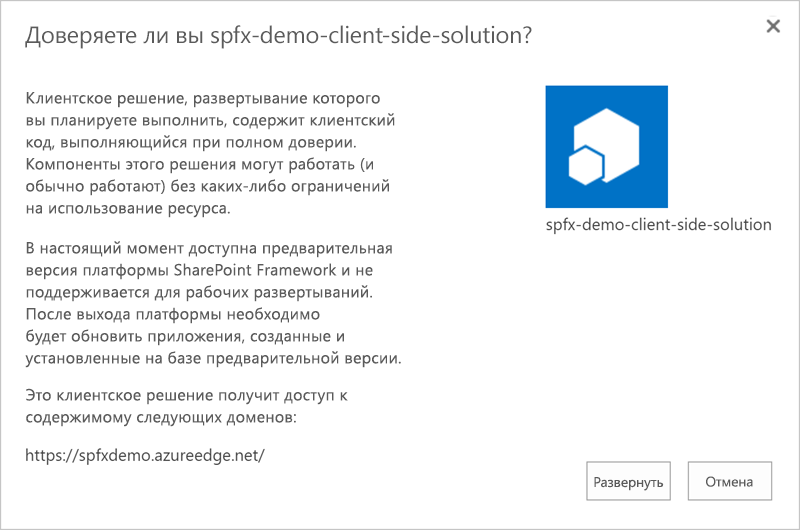

# Руководство по SharePoint Framework (SPFx) для предприятийSharePoint Framework (SPFx) enterprise guidance

SharePoint Framework (или SPFx) — это новая модель разработки для расширения пользовательского интерфейса SharePoint. Она используется как собственными, так и сторонними разработчиками, дополняя существующие модели пользовательского интерфейса, например модель надстроек SharePoint. SharePoint Framework обеспечивает структурированный и поддерживаемый подход к улучшению и расширению пользовательского интерфейса SharePoint, используя клиентские платформы и встроенную поддержку клиентских веб-частей. Основываясь на современных стандартах веб-технологий, эта платформа предлагает уникальный набор функций, благодаря которым настройки SharePoint становятся доступны большему количеству разработчиков и предприятий, но в то же время согласована с предыдущими моделями и шаблонами SharePoint. В этом документе представлены общие сведения, преимущества и другая информация, необходимая администраторам для успешного управления компонентами SharePoint Framework в средах SharePoint.The SharePoint Framework (or SPFx) is a new development model for SharePoint user interface extensibility.  It is used by first and third parties, complementing already existing user interface models such as the SharePoint Add-in model. The SharePoint Framework allows for a structured and supported approach to enrich and extend the user interface of SharePoint, by using client-side frameworks with initial support for client-side web parts. Based on modern web technology standards, it offers a unique set of features to make SharePoint customizations more broadly available for developers and enterprises, but at the same time aligns with previous models and patterns in SharePoint. In this document, we provide administrators with the background, benefits, and knowledge they need to successfully manage SharePoint Framework-based components within their SharePoint environments.

## Общие сведенияBackground

Среда SharePoint долгое время использовалась как платформа для приложений и/или разработки и предоставляла множество наборов параметров для разработки и настройки: от кода с полным доверием, выполняющегося на серверах SharePoint, до изолированных решений, надстроек и настроек интерфейса, созданных с помощью стандартных функций или внедрения JavaScript/CSS.SharePoint has been used as an application and/or development platform for a long time and offered numerous sets of development and customization options ranging from full-trust code executing on the SharePoint servers, to sandboxed solutions, to add-ins, to interface customizations achieved by using out-of-the box features or JavaScript/CSS embedding. 

В мультитенантной среде SharePoint Online код с полным доверием не поддерживался никогда, а служба изолированного кода объявлена устаревшей.Within multi-tenant SharePoint Online, full-trust code has never been supported, and the sandboxed code service has been deprecated. Основные модели настройки SharePoint Online — надстройки, удаленное выполнение кода (из другого расположения, такого как Azure) через стандартные API и внедрение JavaScript.The most common patterns for customizations of SharePoint Online have been either through add-ins, remote-code execution (code executing elsewhere, such as in Azure) through the standard APIs, and JavaScript embedding. Хотя внедрение JavaScript было очень эффективным способом расширения SharePoint, ему стало трудно соответствовать нестареющей модели SharePoint Online.Although JavaScript embedding has been a very powerful way of extending SharePoint, it has also proven difficult to keep up with the evergreen model of SharePoint Online. Платформа SharePoint Framework призвана устранить эти проблемы, предоставляя стандартизированные средства для создания расширений пользовательского интерфейса, а также создания приложений на основе SharePoint Online, использующих поддерживаемые технологии и рассчитанных на долгую работу.The SharePoint Framework aims to solve these issues by providing a standardized framework on how to create custom user interface extensions as well as building applications on top of SharePoint Online in a supported and future prepared way.

Изначально в SharePoint Framework основное внимание уделяется расширению пользовательского интерфейса SharePoint с помощью *клиентских веб-частей*.The SharePoint Framework will initially focus on extending the SharePoint user interface by using *client-side web parts*. Клиентские веб-части основаны на известной парадигме веб-частей, ставшей одним из факторов успеха SharePoint за эти годы. Пользователи могут добавлять их на страницы и независимо настраивать.The client-side web parts uses the well-known paradigm of web parts, which has been one of the success factors of SharePoint over the years, that can be added to pages and independently customized by the end users. Эти клиентские веб-части работают как на современных, так и на классических страницах, а также в мобильном приложении SharePoint.These client-side web parts work on the new modern pages as well as in classic pages and even in the SharePoint mobile app.

Эта новая модель создана с нуля с использованием современных веб-решений на основе TypeScript/JavaScript, HTML и CSS, а все части созданных артефактов выполняются в браузере пользователя.This new model is built from the ground-up by using a modern web stack that uses TypeScript/JavaScript, HTML, and CSS, and all parts of the generated artifacts are executed in the end-user's browser. Кроме того, SharePoint Framework включает совершенно новый набор инструментов.The SharePoint Framework also comes with a completely new set of tooling. Эти новые инструменты не зависят от платформы, работают как на компьютерах с Windows, так и на Mac, и основаны на технологиях с открытым кодом, таких как [Node.js](https://nodejs.org/), [Gulp](http://gulpjs.com/), [Webpack](http://webpack.github.io/) и [Yeoman](http://yeoman.io/).This new tooling is platform-agnostic and works on PC and Mac and is based on open source technologies such as [Node.js](https://nodejs.org/), [Gulp](http://gulpjs.com/), [Webpack](http://webpack.github.io/), and [Yeoman](http://yeoman.io/). Эти платформы и инструменты используются при сборке, помогая разработчику собирать, упаковывать и развертывать приложения. Они не требуются для выполнения кода SharePoint Framework.These frameworks and tools are used at build time to streamline the developer experience for building, packaging, and deploying; they are not required for the actual execution of the SharePoint Framework code.

## Текущее состояние SharePoint FrameworkCurrent status of SharePoint Framework

[Общедоступная версия](https://blogs.office.com/2017/02/23/sharepoint-framework-reaches-general-availability-build-and-deploy-engaging-web-parts-today/) (1.0.0) платформы SharePoint Framework была выпущена в феврале 2017 г.The SharePoint Framework reached the [General Available (GA) milestone](https://blogs.office.com/2017/02/23/sharepoint-framework-reaches-general-availability-build-and-deploy-engaging-web-parts-today/), with version 1.0.0, in February 2017.

## Точка зрения разработчиковFrom a developer's point of view

Платформа SharePoint Framework будет полезна всем — как новичкам, так и опытным разработчикам SharePoint.SharePoint developers, new and seasoned, all have something to gain from the SharePoint Framework. Хотя текущий выпуск предназначен в первую очередь для расширения пользовательского интерфейса, он позволяет разработчикам расширять возможности пользовательского интерфейса SharePoint безопасным и структурированным образом, изначально используя клиентские веб-части.While the current release is focused on the user interface extensibility story, it allows the developer to, in a safe and structured way, extend the user interface capabilities of SharePoint by using, initially, client-side web parts. Эти веб-части выполняются на стороне клиента и могут работать с данными в SharePoint, в Office 365 через [Microsoft Graph](http://graph.microsoft.io) или даже с помощью собственных пользовательских веб-API с использованием стандартных методов OAuth и REST.These web parts are executed client-side and can work with data in SharePoint, in Office 365 via the [Microsoft Graph](http://graph.microsoft.io), or even by using your own custom Web APIs that use standard OAuth and REST methods.

Опытным разработчикам SharePoint знакомы такие понятия, как веб-части и модель данных SharePoint.A seasoned SharePoint developer will be familiar with the concepts, such as web parts and the SharePoint data model. Однако для сборки, упаковки и развертывания клиентских веб-частей используются совершенно новые инструменты.However, the tooling for building, packaging and deploying client-side web parts will be new. В первую очередь разработчикам потребуются навыки программирования на [TypeScript](http://www.typescriptlang.org/) — основном языке для разработки артефактов SharePoint Framework.Developers need to gain skills in specifically [TypeScript](http://www.typescriptlang.org/), which is the primary language for developing SharePoint Framework artifacts. TypeScript имеет ряд преимуществ по сравнению с JavaScript, важных для корпоративной разработки, например строго типизированные объекты, наследование объектов, классы и интерфейсы — понятия, хорошо знакомые разработчикам приложений на .NET, Java и C/C++.TypeScript adds several benefits on top of JavaScript, important for enterprise development, such as strongly typed objects, object inheritance, classes and interfaces, concepts which all should be familiar to current .NET, Java, and C/C++ developers. Что касается сборки и упаковки, Visual Studio больше не является единственным вариантом для создания решений SharePoint. Благодаря применению технологий и проектов с открытым кодом, таких как node.js, [npm](https://www.npmjs.com/) и Gulp, разрабатывать решения для SharePoint Framework можно на любой платформе, используя любой редактор кода или IDE, например Visual Studio Code, Sublime или даже Блокнот.From a building and packaging point of view, developers no longer have Visual Studio as the only option to write SharePoint solutions; thanks to using open source technologies and projects such as node.js, [npm](https://www.npmjs.com/), and Gulp, SharePoint Framework development can be done on any platform with the developers preferred code editor or IDE, for example Visual Studio Code, Sublime, or even Notepad.

Разработчикам, которые никогда раньше не создавали решения для SharePoint, но знакомы с современными веб-технологиями, будет не слишком сложно, а многие разработчики уже перешли на клиентскую или комбинированную разработку.For developers that have never built SharePoint solutions previously, but are familiar with modern web technologies, the threshold is not that high, and many developers have already moved to the client-side of development, or a combination of it. Клиентская разработка позволяет предоставлять пользователям более качественные, динамичные и адаптивные решения, а также упрощает работу разработчиков.Client-side development can provide a better, more dynamic and more responsive experience for users and even an easier experience for developers. Благодаря свободе выбора редактора кода, а также использованию известных и популярных платформ технологий с открытым кодом многим разработчикам (даже тем, которые, возможно, еще не работали с экосистемой корпорации Майкрософт) будет легко приступить к созданию расширений SharePoint.Thanks to the freedom of the code editor, the use of well-known and popular open source frameworks and technologies, many developers that might not have worked within the Microsoft ecosystem can easily get up to speed on building SharePoint extensions.

Одним из распространенных шаблонов расширения SharePoint Online было внедрение JavaScript (или вставка JavaScript).One of the most common patterns in SharePoint Online extensibility has been the usage of JavaScript embedding (also known as JavaScript injection). Этот способ заключается во вставке произвольного кода JavaScript на страницу (например, с помощью веб-части редактора скриптов) и вставке кода HTML, CSS и JavaScript, образующего решение или приложение, с помощью модели DOM браузера.This is a method where you use, for example, the Script Editor web part to insert arbitrary JavaScript on the page, and then use web browser DOM (Document Object Model) manipulation to inject HTML, CSS, and JavaScript to build a solution or application. У этого способа есть множество недостатков. Во многих случаях он даже приводил к тому, что пользователи не могли воспользоваться новыми функциями SharePoint Online в связи с их жесткой зависимостью от структуры HTML и CSS в SharePoint.This method has a lot of disadvantages, and in many cases, even prohibited customers from taking advantage of the new features in SharePoint Online, due to its hard dependencies on how SharePoint built up the HTML and CSS structure. SharePoint Framework предоставляет более надежную (но еще не полную) замену методике внедрения JavaScript.The SharePoint Framework allows a better way, although not yet a complete replacement, for these JavaScript embed customizations. Как упоминалось ранее, SharePoint Framework использует TypeScript, что позволяет с легкостью переносить внедренный код JavaScript в стандартизированные и современные решения.The SharePoint Framework, as said, uses TypeScript, which allows for a fairly easy transition of the JavaScript embeds to something standardized and future proof. Инициатива OfficeDev PnP также включает примеры проектов и рекомендации по такому переходу.The OfficeDev PnP initiative also has example projects and guidelines on how to make this transition.

## В перспективе: SharePoint Framework в рамках общей платформы SharePointIn perspective: SharePoint Framework in the broader SharePoint platform

SharePoint Framework — это новая модель, которая дополняет существующие методы, но в первую очередь призвана усовершенствовать такие настройки пользовательского интерфейса, как клиентские веб-части.The SharePoint Framework is a new model, an addition to already existing methods, but focused on leveraging more value to user interface customizations such as client-side web parts. Эта платформа рассчитана на работу с имеющимися рабочими моделями, а также призвана упростить создание настроек пользовательского интерфейса более поддерживаемым и надежным образом.This framework is designed to work in conjunction with already existing working models and makes it easier to create new user interface customizations in a more supported and sustainable way.

### Сравнение с надстройкамиCompared with add-ins

Надстройки SharePoint (предыдущее название — приложения для SharePoint) появились в SharePoint 2013 и были одним из немногих поддерживаемых и управляемых вариантов добавления настроек в SharePoint Online.SharePoint Add-ins, previously known as SharePoint Apps and introduced in SharePoint 2013, have been one of the only available options of adding customizations to SharePoint Online in a supported and governed way. Однако во многих случаях надстройкам SharePoint требуется слишком много инфраструктуры даже для незначительной настройки пользовательского интерфейса.However, SharePoint Add-ins require a lot more infrastructure than necessary in many cases where a simple user interface customization is needed. 

Есть два типа надстроек SharePoint: с размещением в SharePoint и у поставщика.SharePoint Add-ins come in two flavors: SharePoint-hosted and provider-hosted. Надстройки, размещаемые в SharePoint, были одним из поддерживаемых способов выполнения клиентского кода в SharePoint, но, как упоминалось ранее, даже для добавления простой клиентской веб-части (JavaScript) требовалось неоправданно много усилий.SharePoint-hosted add-ins have been one of the ways of executing client-side code in SharePoint in a supported way, but as said require a lot more effort than necessary to just include a simple client-side (JavaScript) web part. Во многих случаях надстройки, размещаемые в SharePoint, создавались только для развертывания артефактов, например списков и веб-частей, на сайте SharePoint.In many cases SharePoint-hosted add-ins were built just to deploy artifacts, such as lists and web parts, onto a SharePoint site. Надстройка размещается на сайте приложения — специальном сайте с ограниченными функциями.These add-ins live in a "special" site called the App Web, which is a site with limited features. 

С другой стороны, надстройки, размещаемые у поставщика, выполняются удаленно из SharePoint (Online) и могут использовать как серверный, так и клиентский код.Provider-hosted add-ins, on the other hand, are add-ins that are executed remotely from SharePoint (Online) and can leverage server-side code as well as client-side code. Это удобно для независимых поставщиков программного обеспечения, которые хотят защитить свою интеллектуальную собственность, код или логику, и для сценариев, которые невозможно выполнять на стороне клиента с помощью JavaScript. Например, это могут быть продолжительные, сложные вычислительные операции или доступ к удаленным данным, которые недоступны сценариям на стороне клиента.This has a benefit for ISVs that want to protect their intellectual property/code/logic and for scenarios that can't be executed client-side by using JavaScript, such as long-running, calculation-heavy operations or access to remote data that cannot be achieved by using client-side scripting. 

Основное преимущество надстроек — изолированность. Фактический код не выполняется на сайте SharePoint, поэтому защита браузера от межсайтовых сценариев не позволяет надстройке получить тот же уровень доступа, которым обладает пользователь.The primary advantage of add-ins is isolation: because the actual code is not executed in the SharePoint site browser, cross-site scripting protections prevent the add-in from getting the same access as the user has. Надстройкам доступны только те разрешения, которые предоставили им при установке.Add-ins are limited to the permissions that the add-in was granted at install time. По этой причине надстройки являются более безопасным вариантом для тех случаев, когда администратор получает надстройку от стороннего поставщика. Кроме того, благодаря этому корпорация Майкрософт смогла создать Магазин, в котором можно скачивать надстройки.This makes add-ins a safer option for scenarios where an admin acquires an add-in from a third party, and it also allows Microsoft to have a Store from where you can download add-ins.

SharePoint Framework работает параллельно с надстройками, размещаемыми как в SharePoint, так и у поставщика, но ее также можно использовать в качестве альтернативы, когда требуются только сценарии на стороне клиента.The SharePoint Framework works side-by-side with both SharePoint-hosted and provider-hosted add-ins, but can also be used as an alternative in scenarios where only client-side scripting is required. Например, надстройки могут добавлять веб-части приложений на свой сайт.For example, add-ins can add app parts to the site where they are hosted. Эти веб-части приложений во многом аналогичны обычным веб-частям, но выполняются не в контексте страницы, а на собственном домене (сайте приложения или поставщика) в объекте IFrame на странице.These app parts are similar to web parts, but instead of running in the context of the page, they run in their own domain (App Web or provider-hosted web) within an Iframe on the page. Благодаря этому надстройка не может получить контекст пользователя с остальной части страницы.This prevents the add-in from gaining the user context from the rest of the page. 

С другой стороны, SharePoint Framework не выполняется в объекте IFrame.The SharePoint Framework, on the other hand, does not run in an Iframe. Благодаря этому она может лучше внедряться в контекст страницы, приобретая все права пользователя, просматривающего веб-часть.Thanks to this, it can more seamlessly run in the context of the page with the full power of the user viewing the part. Это является ключевым фактором, обеспечивающим широкие возможности таких решений, но в то же время означает более низкий уровень безопасности по сравнению с надстройками. В связи с этим решения SharePoint Framework также называют *клиентскими решениями с полным доверием*.This is the key to enabling it to run with rich functionality, but at the same time this means that it does not have the same level of security controls as add-ins. SharePoint Framework solutions are due to this also being referred to as *full trust client-side solutions*. Недостаток объектов IFrame — отсутствие гибкости. По этой причине веб-страница будет хуже смотреться на мобильном телефоне или на устройстве с другим размером экрана.Iframes suffer from the problem that they are not responsive, which results in the rendered web page not being as fluent on a mobile phone or alternate screen size.

В связи с упомянутым выше аспектом безопасности на момент написания этой статьи не существует магазина, в котором можно скачивать и устанавливать решения SharePoint Framework.The SharePoint Framework solutions do not, at the time of writing, have a store where you can download and install solutions, due to the security aspect mentioned earlier. С другой стороны, во многих случаях требуется использовать контекст пользователя. В таких ситуациях можно использовать SharePoint Framework.On the other hand, in many scenarios, using the user's context is a wanted scenario where SharePoint Framework could be used instead.

### Внедрение JavaScriptJavaScript embeddings

Один из наиболее популярных подходов, используемых разработчиками, — внедрение JavaScript (или вставка JavaScript).One of the more popular approaches used by developers has been to use a method called JavaScript embeddings (also known as JavaScript injections). Это означает, что на сайты и страницы вставляется произвольный код JavaScript, например с помощью дополнительных действий, эталонных страниц, макетов страниц или даже веб-частей редактора скриптов.That means that arbitrary JavaScript has been inserted to the sites and pages by using, for example, Custom Actions, master pages, or page layouts, and even Script Editor web parts. Этот метод оказался проще, чем создание надстроек, размещаемых в SharePoint, а также обеспечивает выполнение кода скрипта в полном контексте пользователя, поэтому он набрал большую популярность.This method has proven simpler than creating SharePoint-hosted add-ins, and allows the script code to run in the full context of the users, and therefore gained a lot of popularity. Недостаток этого подхода заключается в том, что для внедрения часто требуются манипуляции с моделью DOM, а для его выполнения и поддержки необходимы навыки разработчика.The downside with this approach is that many of these embeddings relied on DOM manipulation and required developers' skills to do and maintain. 

Учитывая долговечность среды SharePoint Online, решения, созданные с помощью внедрения JavaScript, могут выходить из строя при каждом обновлении SharePoint Online, так как разработчики могут использовать зависимости (даже случайно) от структуры и стилей страниц SharePoint.Due to the evergreen nature of SharePoint Online, these solutions built by using JavaScript embeddings could potentially break whenever SharePoint Online was updated, because the developers might have taken dependencies (even accidentally) on how the SharePoint pages are structured or styled. Обновления для SharePoint (даже незначительные и незаметные) могут оказывать значительное влияние на эти решения, приводя к неработоспособности кода JavaScript.When updates are done in SharePoint, even minor and subtle, it can have huge impacts on these solutions and cause the embedded JavaScript to break completely.

С выпуском SharePoint Framework появился стандартизированный и поддерживаемый корпорацией Майкрософт способ реализации многих решений, которые ранее создавались с помощью внедрения JavaScript.Now with the SharePoint Framework, there is a Microsoft standardized and supported way to achieve many of these solutions previously built by using JavaScript embeddings.

### Веб-части "Редактор скриптов"Script Editor web parts

Самый распространенный способ вставки произвольного кода HTML, JavaScript или CSS в SharePoint — использование веб-части редактора скриптов или веб-части редактора содержимого.The most common way of inserting arbitrary HTML, JavaScript, or CSS customizations in SharePoint is to use the Script Editor web part or the Content Editor web part. Веб-части редактора скриптов набрали популярность, потому что позволяют с легкостью добавлять пользовательские сценарии на любую страницу.Script Editor web parts have gained popularity due to how easy it is to add custom scripts to any page. Любой редактор сайта может добавить веб-часть редактора скриптов на страницу, скопировать и вставить код JavaScript, а затем предоставить JavaScript выполнение необходимых настроек.Any editor of a site can add a Script Editor web part to a page, copy and paste JavaScript into it, and have that JavaScript perform the necessary customizations. Как и при внедрении JavaScript, администраторам может быть сложно контролировать веб-части редактора скриптов.Just as with JavaScript embeddings, it can be a challenging task for administrators to have control of Script Editor web parts.

Во многих случаях SharePoint Framework может служить непосредственной заменой для конфигураций, использующих эту веб-часть.The SharePoint Framework can in many cases be a direct replacement for these Script Editor web part configurations.

### Управление возможностями написания скриптов в SharePoint OnlineControl of scripting capabilities in SharePoint Online

SharePoint Online позволяет администраторам управлять возможностью добавления пользовательских сценариев на сайты и страницы, повышая безопасность и целостность клиента.SharePoint Online allows the admins to control the ability to add custom scripts to sites and pages to increase the security and integrity of the tenant. Это делается с помощью функции "Специальный скрипт" на сайте администрирования SharePoint Online или отдельно для каждого сайта с использованием PowerShell.This is done by using the "Custom Script" feature in the SharePoint Online admin site, or individually per site by using PowerShell. Специальные скрипты можно отключить на всех или только на личных сайтах.Custom scripts can be disabled on all sites or just on personal sites. По умолчанию для новых клиентов отключены сценарии на личных сайтах, всех самостоятельно созданных сайтах, а также в корневом семействе веб-сайтов клиента.By default, new tenants have scripting disabled on personal sites, all self-service created sites, as well as the root site collection of the tenant. Если специальные скрипты отключены, редакторы сайтов не могут добавлять веб-части, в частности редактор скриптов.When custom scripts are disabled, editors of sites are not allowed to add web parts such as the Script Editor web part. Но решения SharePoint Framework разрешены, так как они считаются безопасными после утверждения администратором в каталоге приложений.However, SharePoint Framework solutions are allowed because they are considered safe after being approved by an administrator in the App Catalog.

## Особенности создания решений SharePoint Framework (и почему они важны)Differences in how SharePoint Framework solutions are created, and why it matters

SharePoint Framework использует новые принципы разработки, создания и развертывания настроек SharePoint, применяя современную технологию веб-решений с упором на клиентских и браузерных настройках.The SharePoint Framework uses a new paradigm to SharePoint developers in how to design, build and deploy SharePoint customizations, by leveraging a modern web stack approach and focusing on client-side/browser based customizations.
Это значительно меняет подход к разработке для SharePoint.This marks an important change in how SharePoint development is being treated. 

Благодаря применению таких технологий и платформ, как TypeScript, Node.js, Yeoman и Gulp, SharePoint Framework наверняка привлечет разработчиков, которые обычно не работали с SharePoint (или какими-либо другими продуктами корпорации Майкрософт). В то же время существующие разработчики SharePoint смогут создавать настройки SharePoint, используя более современный и стандартизированный подход.By using technologies and frameworks such as TypeScript, Node.js, Yeoman, Gulp and more, the SharePoint Framework hopefully will attract developer audiences that traditionally have not been in the SharePoint, or even Microsoft, eco-system, while at the same time, open the doors for existing SharePoint developers to build SharePoint customizations by using a more modern and standardized approach.

### Создание решенийCreating solutions

Из-за необходимости в специализированных инструментах, входящих в состав Visual Studio, разработка для SharePoint обычно проходила исключительно в Visual Studio на компьютере с Windows, где был установлен и запущен экземпляр SharePoint. Это значительно ограничивало выбор оборудования и настройки пользователя, а также повышало расходы на разработку.Because of the need for very specific and targeted tools provided via Visual Studio, SharePoint development was typically solely done via Visual Studio on a Windows machine with an instance of SharePoint installed and running, which severely limited the hardware and user preferences, and increased development costs. С другой стороны, SharePoint Framework использует различные веб-инструменты с открытым кодом для ряда платформ, в том числе MacOS и Linux, обеспечивая большую гибкость разработки.The SharePoint Framework, on the other hand, uses various common open source web tools available for many different platforms, like MacOS and Linux, to allow for more flexibility in development.

Решения SharePoint Framework создаются с помощью инструмента [Yeoman](http://yeoman.io/), а также специального генератора для SharePoint Framework, основанного на Node.js.SharePoint Framework solutions are created by using a tool called [Yeoman](http://yeoman.io/) along with a specific SharePoint Framework generator, which is based on Node.js. Yeoman — это инструмент формирования шаблонов, который поможет вам создать проект и необходимые артефакты, установить необходимые пакеты Node.js и настроить систему сборки.Yeoman is a project scaffolding tool that will create your project and generate the required artifacts, install the needed Node.js packages, and configure the build system. После создания проекта его можно изменить в любой операционной системе, используя любой редактор, например Visual Studio, Visual Studio Code, Sublime или Atom.After the project is generated, it can be edited in any editor on any operating system: Visual Studio, Visual Studio Code, Sublime, or Atom for example. Это предоставляет более широкие возможности использования и оформления как в рамках групп, так и между ними.This allows for a wider usage preference and style, in and between teams. Генератор Yeoman можно запускать несколько раз для одного проекта, чтобы добавлять артефакты, например клиентские веб-части.The Yeoman generator can be run multiple times on the same project to add additional artifacts, such as client-side web parts.

### Разработка и создание решенийDeveloping and building solutions

Система сборки основана на [Gulp](http://gulpjs.com/) — средстве запуска задач, которое собирает, упаковывает и при необходимости развертывает артефакты SharePoint Framework.The build system is based on [Gulp](http://gulpjs.com/), which is a task runner that builds, packages, and optionally deploys the SharePoint Framework artifacts. Как и Yeoman, Gulp также основан на Node.js и позволяет разработчикам собирать и развертывать решения в любой операционной системе.Like Yeoman, Gulp is also based on Node.js and allows developers to build and deploy on any operating system. 

Еще один новый компонент набора инструментов для SharePoint Framework называется *Workbench*.One new part of the build toolset for SharePoint Framework is called the *Workbench*. С его помощью разработчик может разместить и протестировать свое решение SharePoint Framework.The Workbench is a tool where the developer can host and test their SharePoint Framework solution. Workbench автоматически повторно загружает артефакты, когда разработчик сохраняет файл, позволяя быстро просмотреть и протестировать решение.The Workbench is reactive and will automatically reload your artifacts when the developer saves a file so that developers can see and test the solution quickly.

Существует две версии Workbench. Одна из них размещается за пределами SharePoint на локальном компьютере разработчика, не имеющем доступа к среде SharePoint и ее данным.There are two versions of the Workbench, one outside of SharePoint, hosted locally on the development machine that runs offline without SharePoint access and SharePoint data. Это позволяет группам и разработчикам создавать и разрабатывать решения с временными или фиктивными данными, чтобы сосредоточиться на пользовательском интерфейсе.This allows the team and designers to build and design solutions with mock or fake data to focus on the user interface. Вторая версия размещается в SharePoint и используется для тестирования и проверки решения SharePoint Framework с применением настоящих данных и контекста SharePoint.The second version is hosted inside SharePoint and is used when you need to test and verify the SharePoint Framework solution by using real SharePoint data and context.

### Развертывание решений SharePoint FrameworkDeploying SharePoint Framework solutions

Решения SharePoint Framework развертываются в два этапа. Для начала необходимо развернуть артефакты сценариев, упакованные процессом сборки в сети доставки содержимого (CDN).Deploying SharePoint Framework solutions is done in two steps: the first one being deploying the script artifacts packaged by the build process to a CDN (Content Delivery Network) location. Второй этап — добавление пакета решения в каталог приложений и его утверждение для использования в клиенте.The second step is to add the solution package to the App Catalog and approve it for usage in your tenant. Пакет, добавленный в каталог приложений SharePoint, содержит указатель на расположение в CDN.The package added to the SharePoint App Catalog contains a pointer to the CDN location.

Разработчики решения SharePoint Framework могут использовать любую службу CDN, например службу хранилища Azure Storage, Azure CDN или даже саму среду SharePoint, желательно с использованием функций SharePoint CDN (см. ниже в настоящем документе).Developers of the SharePoint Framework solution can choose to use any CDN service, such as Azure Storage, Azure CDN, or even SharePoint itself, preferably  by using the SharePoint CDN features (see later in this document). При использовании общедоступной сети CDN, где ресурсы, развернутые в CDN, доступны всем пользователям в Интернете, решение SharePoint Framework смогут использовать несколько клиентов.Using a public CDN, where the assets deployed to the CDN are publicly available on the Internet, allows for usage of the SharePoint Framework solution to be used by many tenants. В решении SharePoint Framework, развернутом в SharePoint CDN, сценарии и ресурсы доступны только тому клиенту, в котором они развернуты.In a SharePoint CDN-deployed SharePoint Framework solution, the deployed scripts and resources are only available for the tenant it is deployed into.

По умолчанию в состав средств сборки входит встроенная задача для развертывания упакованного решения в хранилище BLOB-объектов Azure.By default, there is a built-in task in the build tools to deploy the packaged solution to Azure Blob storage. Как правило, это делают системные интеграторы и независимые поставщики программного обеспечения, чтобы обеспечить поддержку пользовательских расположений и конфигураций CDN.This is something that is typically extended, by SIs or ISVs, to support custom CDN locations or configurations.

После изменения кода и сборки решения цепочка инструментов SharePoint Framework создает новый пакет решения (.sppkg) и набор файлов сценария.After changing the code and building the solution, the SharePoint Framework toolchain produces a new solution package (.sppkg) and a set of script files. В имена этих файлов сценария включен уникальный хэш, который указывает на то, что содержимое этих файлов отличается от содержимого ранее развернутых версий.These script files include a unique hash in their file name, which indicates that the contents of these files differ from their previously deployed versions. Чтобы использовать новую версию решения, необходимо развернуть новый набор скриптов в сети CDN и обновить пакет решения в каталоге приложений.To use a new version of the solution, you must deploy the new set of scripts to your CDN and update the solution package in the App Catalog. Теоретически вы можете заменить содержимое существующих файлов сценария и не обновлять пакет решения, но этот способ не надежен и не рекомендуется.While theoretically you could replace the contents of the existing script files and avoid upgrading the solution package, it's unreliable and not recommended. В зависимости от того, какова конфигурация сети CDN, ранее скачанные файлы сценария могут долго кэшироваться на клиентских компьютерах, что усложняет выпуск решения для пользователей.Depending on the configuration of your CDN, it could be that the previously downloaded script files are cached for a long time on the client computers, complicating the rollout of the solution to end-users.

Расположение сети CDN имеет значение.The location of the CDN is important. Рекомендуем размещать ресурсы SharePoint Framework в Azure, Akamai или других надежных сетях CDN с высоким уровнем доступности, а также в среде SharePoint.The location where the SharePoint Framework assets are hosted must have high availability, so trusted CDN providers such as Azure, Akamai, or similar, and SharePoint itself, are recommended. С точки зрения безопасности важно знать, какие сети CDN используются развернутыми решениями SharePoint Framework.From a security standpoint, it is important to know what CDNs are in use by the SharePoint Framework solutions deployed. Неисправная сеть CDN также может вывести из строя решения SharePoint Framework, а в худшем случае скомпрометированная сеть CDN может привести к компрометации данных клиента SharePoint (Online).A broken CDN can also break the SharePoint Framework solutions, and in the worst case scenario, a compromised CDN might lead to the data in the SharePoint (Online) tenant also being compromised.

Один из типичных пунктов контрольного списка при утверждении сторонних решений SharePoint Framework — проверка репутации и надежности расположения CDN и всех третьих сторон, у которых могут размещаться эти решения.When approving third-party SharePoint Framework solutions, a typical checklist item is to check the authority and trust of the CDN location and any third parties that might host them. Это вызвано тем, что после установки и использования приложения в семействах веб-сайтов SharePoint эти семейства веб-сайтов также будут зависеть от расположения CDN.This is because after the application is installed and used within SharePoint site collections, these site collections have a dependency on the CDN location. На момент написания этой статьи не существует легкого способа управлять этой конечной точкой.As of this writing, there is no easy way to control that end-point. Сторонний поставщик сети CDN может вносить как необходимые, так и нежелательные изменения без ведома пользователя. Это образует уязвимость, так как SharePoint Framework работает в контексте пользователя и может выполнять все действия, разрешенные пользователю.The third-party provider of the CDN can update with both wanted and unwanted changes without the users' knowledge, opening an attack surface, given that the SharePoint Framework is running under the users' context and can do whatever the users can do.

ИТ-администраторам рекомендуется следить за тем, какие сети CDN используются и какие из них утверждены организацией. Об этом также следует сообщать корпоративным разработчикам.A recommendation is for IT administrators to keep track of what CDNs are used and what CDNs are approved by the organization, which should also be communicated to the enterprise developers.

### Общедоступная сеть CDN Office 365Office 365 Public CDN

[Общедоступная сеть CDN Office 365](https://dev.office.com/blogs/general-availability-of-office-365-cdn) — это новая возможность Office 365 и SharePoint Online, позволяющая администраторам автоматически размещать статические ресурсы, такие как файлы JavaScript, изображения и стили CSS, в сети CDN для повышения производительности.The [Office 365 Public CDN](https://dev.office.com/blogs/general-availability-of-office-365-cdn) is a new capability in Office 365 and SharePoint Online that allows administrators to automatically host static assets such as JavaScript files, images, and CSS styles in a CDN to provide better performance. Общедоступная сеть CDN Office 365 — это функция географически распределенного кэширования, которая хранит статические ресурсы как можно ближе к браузерам пользователей, которые их запрашивают.The Office 365 Public CDN is a geo-distributed caching feature that keeps static assets as close to the end-users' browsers requesting them.

Администраторы могут включить общедоступную сеть CDN Office 365 в одной или нескольких библиотеках документов, которые будут служить источниками статических ресурсов.Administrators can enable the Office 365 Public CDN capability on one or more designated document libraries, which will serve as the origin for the static assets. Для администрирования библиотек и сетей CDN используются командлеты SharePoint Online PowerShell.Administration of the libraries and the CDN are done by using the SharePoint Online PowerShell cmdlets. Ресурсы из библиотеки документов будут реплицированы в сеть CDN Office 365 и станут доступны по созданным URL-адресам общедоступной сети CDN Office 365, связанным с библиотекой документов.The assets in the document library will be replicated to the Office 365 CDN and be accessible through the Office 365 Public CDN URLs generated and associated with the document library. Изменения ресурсов будут отражены в конечных точках CDN в течение 15 минут.Any updates to the assets will be reflected on the CDN end-points within 15 minutes. Обратите внимание, что все ресурсы в библиотеках документов будут доступны анонимным пользователям через конечную точку CDN.Note that any assets within the document libraries will be available for anonymous users, through the CDN end-point.

## SharePoint Framework на предприятииSharePoint Framework in the enterprise

Среда SharePoint всегда была одной из самых успешных платформ для корпоративной совместной работы, а одним из секретов ее успеха была возможность расширения, позволяющая использовать SharePoint в качестве платформы для приложений и интеграции.SharePoint is and has been one of the most successful enterprise collaboration platforms, and one of the reasons for its success has been the possibility to extend SharePoint and consider it as a platform for applications and integrations. SharePoint Framework сделает среду SharePoint еще популярнее, превращая ее в современную платформу для поддерживаемого и стандартизированного создания клиентских настроек.The SharePoint Framework will further expand this success by making SharePoint a more modern platform on which to build client-side customizations in a supported and standardized way.

### Корпоративные разработчикиEnterprise developers

SharePoint Framework позволяет **корпоративным разработчикам** (как правило, это разработчики, создающие приложения для использования в организации) дополнять SharePoint (Online) новыми функциями, используя структурированные и поддерживаемые методики.The SharePoint Framework allows **Enterprise developers**, typically developers that create applications for use within an organization, to extend SharePoint (Online) with new functionality in a structured and supported way. SharePoint Framework предлагает полный набор средств — от платформы разработки и конвейера сборки до инструментов разработки — и предоставляет разработчикам доступ ко всем семействам веб-сайтов с новыми решениями и функциями, которыми можно управлять в каталоге приложений.The SharePoint Framework offers everything from the development framework and build pipeline to the actual deployment, and allows the developers in a short time to reach out to all site collections with new solutions and features, all controlled by the App Catalog. В корпоративном сценарии у вас также есть полный контроль над расположениями CDN (как внешними, так и внутренними для SharePoint), и вы можете с легкостью развертывать исправления и обновления для всей организации.In an enterprise scenario, you also have full control of the CDN locations, external or internal in SharePoint, and you can very easily deploy fixes and updates to your whole organization.

В рамках предприятия администраторы и разработчики должны вместе составить *план* развертывания новых решений SharePoint Framework.Within your enterprise, administrators and developers jointly should create a *blue print* for how SharePoint Framework solutions should be deployed. Этот план должен включать сведения о предпочитаемых клиентских платформах, сетях CDN и т. д. Дополнительные сведения см. ниже в разделе *Составление плана настроек SharePoint Framework*.The blue print should contain details on preferred client-side frameworks, CDN locations, etc. For more details, see the section later on *Building a plan around SharePoint Framework customizations*.

### Разработчики-любителиCitizen developers

Разработчики-любители долгое время использовали SharePoint для создания бизнес-приложений, используя ряд методик и технологий.Citizen developers have for a long time used SharePoint to build business applications by using many methods and techniques.
SharePoint Framework во многом (в частности, в том, что касается внедрения JavaScript и решений с использованием веб-частей редактора скриптов) станет для них шагом в правильном направлении.SharePoint Framework will for certain scenarios, specifically JavaScript embeddings and Script Editor web part solutions, be one good way forward. Это позволит сделать решения более стандартизированными и упростить их поддержку.This to make these solutions more standardized and maintainable over time. Разработчикам-любителям может потребоваться некоторое время, чтобы освоить новый структурированный способ создания решений, но в долгосрочной перспективе их решения станут более стабильными, безопасными и надежными.For citizen developers, there might be a little bit of a learning curve to adjust to this new structured way of building solutions, but will in the long run prove to be more stable, secure, and maintainable.

Учитывая наличие вышеупомянутых методов управления *специального скрипта*, разработчики-любители не смогут добавлять произвольный код JavaScript и веб-части "Редактор скриптов".Given that the above mentioned *Custom Script* control methods are in place, the citizen developers will not be allowed to add arbitrary JavaScript code or Script Editor web parts. Это может сделать вашу среду SharePoint более стабильной и надежной, но в то же время может препятствовать инновациям в компании. Следует убедиться, что разработчики-любители согласуют свои действия с корпоративными разработчиками при дальнейшем использовании SharePoint Framework.This can potentially make your SharePoint environment more stable and maintainable, but at the same time you might prohibit innovation in your company, so you should make sure that your citizen developers align with your enterprise developers on using SharePoint Framework going forward.

### Разработчики интерфейсовUser experience designers and front-end developers

SharePoint Framework представляет огромную ценность для разработчиков пользовательского интерфейса.For web developers or user experience/interface designers, the SharePoint Framework will be very valuable. Система разработки позволяет разработчикам интерфейсов работать с решением SharePoint Framework в любой операционной системе, используя любые средства редактирования, без SharePoint. При этом они применяют фиктивные данные, сосредоточившись на пользовательском интерфейсе.The Workbench allows front-end developers to work with a SharePoint Framework solution on any operating system and by using their preferred editing tools without SharePoint, given that they use mock data, and focus on the user experience. 

SharePoint Framework выпускается параллельно с [Office UI Fabric](https://developer.microsoft.com/ru-RU/fabric) — официальной платформой разработки интерфейса для Office и Office 365. С ее помощью разработчик может создать согласованный интерфейс в Office, Office 365 и собственных решениях.The SharePoint Framework is released in parallel with [Office UI Fabric](https://developer.microsoft.com/ru-RU/fabric), which is the official front-end development framework for Office and Office 365, and allows the user experience designers to create a seamless experience across Office, Office 365, and the custom-built solutions.

### Системные интеграторыSystem Integrators (SI)

Если вы пользуетесь услугами системных интеграторов или консультантов при создании решений для SharePoint и Office 365, следует установить рекомендации (или даже требования) по созданию решений SharePoint Framework, чтобы они были согласованы с корпоративным планом для SharePoint Framework.If you leverage System Integrators (SI) or consultancies to build your SharePoint and Office 365 solutions, you should place recommendations, or even requirements, on how they should build SharePoint Framework solutions so that they are aligned with your enterprise plan for the SharePoint Framework. 

Как правило, у системных интеграторов есть предпочтения по созданию решений, которые не всегда совпадают с вашими, поэтому очень важно обсудить с ними этот вопрос. В конечном итоге это упростит работу обеим сторонам.Typically, System Integrators have a preferred way of building their solutions, which might not always be aligned with your governance, so this discussion with the System Integrators is important and will in the end make it easier for all parties.
Рассмотрим типичный сценарий работы с системными интеграторами: они создают решение для компании, а по завершении проекта техническое обслуживание и обновление решения становятся вашими обязанностями, что лишь обостряет необходимость согласования методик создания и размещения решений SharePoint Framework с системными интеграторами.A typical scenario with System Integrators is that they build the solution for your company, and after the project is complete, it is up to you to maintain, upgrade, and update the solution, which only emphasizes that you need to align with the SI on how the SharePoint Framework solutions are built and hosted.

### Независимые поставщики программного обеспеченияIndependent software vendors (ISV)

Независимые поставщики программного обеспечения — это организации, занимающиеся разработкой сторонних решений для массового рынка. Результат их работы может не соответствовать вашему плану относительно решений SharePoint Framework.Independent software vendors (ISV) are organizations building third-party solutions for the mass market, and they might not always fulfill your plan on SharePoint Framework solutions. Кроме того, такие разработчики обычно оставляют за собой права на свой код и интеллектуальную собственность, поэтому вам будет очень сложно изменить способы реализации и размещения их решений.Also, ISVs typically own their own code and intellectual property, which makes it very hard for you to change the way they implement and host their solutions. 

В случае использования решений SharePoint Framework от сторонних поставщиков необходимо разобраться, как они управляют обновлениями и как размещаются эти решения.In the case of using SharePoint Framework solutions from third-party providers, you need to specifically consider how they manage updates and how their solutions are hosted. Например, разрешаете ли вы обновлять решение без вашего ведома?For example: Do you allow the solution to be updated without your knowledge? Разрешаете ли вы поставщику размещать статические ресурсы в своей сети CDN без вашего контроля?Do you allow the static assets to be hosted on the ISV's CDN without your control? Каковы ваши отношения доверия с этим поставщиком?What is your trust relationship with this ISV? 

Помните, что любой клиентский код в SharePoint Framework выполняется в контексте текущего пользователя, и у вас нет возможности накладывать на него ограничения, как в надстройках SharePoint.Remember that any client-side code in SharePoint Framework executes under the current users' context, and there is no possibility for you to put constraints on that, which you can do with SharePoint Add-ins.

## Составление плана настроек SharePoint FrameworkBuilding a plan around SharePoint Framework customizations

Внедряя SharePoint Framework как одно из средств для расширения экземпляров SharePoint (Online), необходимо составить план.When introducing SharePoint Framework as one of the tools to extend your SharePoint (Online) instances, you need to plan for it. Он должен начинаться с внедрения нового технологического комплекса, используемого при создании решений SharePoint Framework.The plan should start with introducing the new technology stack used when building SharePoint Framework solutions. Разработчикам может потребоваться пройти обучение использованию TypeScript в качестве основного языка для написания кода SharePoint Framework.Developers may need training on using TypeScript as the primary language for writing the SharePoint Framework code. 

Еще один аспект, который следует изучить разработчикам SharePoint Framework, — цепочка инструментов для SharePoint Framework, в том числе node.js, npm и Gulp, а также использование различных задач Gulp для сборки, упаковки и развертывания решений.Another facet of the SharePoint Framework developers may need to learn is the actual toolchain for SharePoint Framework, including node.js, npm, and Gulp, and how you use the different Gulp tasks to build, package, and deploy solutions. Рекомендуем начать с [официальной документации по SharePoint Framework](./sharepoint-framework-overview.md) или [репозиториев Github для SharePoint](https://github.com/SharePoint/).A very good starting resource for this is the [official SharePoint Framework documentation](./sharepoint-framework-overview.md) or the [SharePoint Github repositories](https://github.com/SharePoint/).

Разработчикам желательно остановиться на одной или нескольких стандартных клиентских платформах для организации.Developers might want to standardize on one specific client-side framework for the organization or on different frameworks. В число клиентских платформ входят, помимо прочих, React, Knockout, Angular, Handlebars, jQuery и т. д. Выбор одной стандартной платформы удобен тем, что разработчики могут создавать код, пригодный для повторного использования, а также согласовывать разработку и техническое обслуживание решений.Client-side frameworks include, but are not limited to, React, Knockout, Angular, Handlebars, jQuery etc. There are advantages on standardizing on one framework, since that enables developers to build more reusable code and have better consistency in how they build and maintain their solutions. 

С другой стороны, в использовании нескольких платформ тоже есть свои плюсы, ведь у каждой клиентской платформы есть свои преимущества и недостатки.On the other hand, there are advantages of allowing more than one framework since each client-side framework has its pros and cons and use cases. Но если разрешить использовать любую клиентскую платформу, это может привести к фрагментации корпоративных решений, не говоря уже о том, что при использовании нескольких платформ страница может загружаться дольше, ведь требуется загружать больше внешних библиотек.But allowing any client-side framework may cause fragmentation in your enterprise solutions, not to mention having multiple different frameworks might add to the page load time, since many frameworks require loading of more external libraries.

В стандартную комплектацию генератора Yeoman для SharePoint Framework входят шаблоны для двух клиентских платформ: React и Knockout.Out of the box, the SharePoint Framework Yeoman generator has templates for two client-side frameworks: React and Knockout. Скорее всего, со временем участники сообщества добавят новые генераторы или субгенераторы для использования других клиентских платформ.Over time, one can expect that the community adds more generators or sub-generators to use other client-side frameworks. React хорошо подойдет в качестве предпочитаемой клиентской платформы, так как корпорация Майкрософт создала специальную версию Office UI Fabric для React. Благодаря этому при желании вы сможете придать своей настройке внешний вид и удобство использования Office и Office 365.Choosing React as your preferred client-side framework has an advantage because Microsoft has created a React version of the Office UI Fabric, so you will get the Office and Office 365 look and feel of your customization if that is something your organization prefers.

Четвертый аспект планирования — способ и место развертывания артефактов решения, то есть в какой сети CDN хранятся созданные вами пакеты сценариев и ресурсы.The fourth thing to plan for is how and where you deploy your solution artifacts, that is in what CDN are your generated script bundles and assets stored. В комплект поставки входят задачи Gulp только для хранилища BLOB-объектов Azure и Azure CDN.Out of the box, in the Gulp tasks included in the toolchain, only Azure Blob storage and Azure CDN is supported. Этот вариант хорошо вам подойдет, если вы управляете подпиской Azure и обмениваетесь ресурсами между несколькими клиентами.This might be a very good option if you can manage an Azure subscription and share your assets between multiple tenants. Еще один распространенный подход — использовать среду SharePoint Online и ее функцию CDN в качестве узла для артефактов.Another very common scenario is to use SharePoint Online, and its CDN feature, as a host for the artifacts. Но при этом требуется изменить цепочку инструментов и при необходимости создать задачи Gulp для управления.This, however, requires that you modify the toolchain and optionally create custom Gulp tasks to manage.

Наконец, разработчикам следует задуматься об управлении жизненным циклом приложений (ALM): способе управления исходным кодом и версиями, автоматической сборке, тестировании, развертывании и т. д. Можно использовать наиболее распространенные системы управления версиями исходного кода, например Git, Github или Visual Studio Team Systems.Finally, developers will need to think about application life cycle management (ALM): the way you manage source code and versioning, automatic build, testing, and deployment etc. Most common source code versioning systems can be used such as Git, GitHub, or Visual Studio Team Systems. 

Для непрерывной интеграции нет стандартных средств, и вы можете использовать любой инструмент, поддерживающий node.js, например Visual Studio Team Systems, Travis CI или Jenkins.For continuous integration, there are no default tools, and you can use your tool of preference that supports node.js, such as Visual Studio Team Systems, Travis CI, or Jenkins. С помощью этих инструментов вы можете автоматизировать сборку и тестирование, а в случае успешной и утвержденной сборки вы даже можете автоматически развернуть артефакты в расположении CDN. Тем самым вы автоматизируете все процессы от отправки кода разработчиком до развертывания в рабочей среде.Using these tools, you can automate the build and testing process and in the case of a successful and approved build, you can even automatically deploy the artifacts to the CDN location, and in such a way automate everything from the developer checking in the code to deployment to production.

## Возможности управления в решениях SharePoint FrameworkManagement capabilities of SharePoint Framework solutions

Все решения SharePoint Framework, развернутые в клиенте, должны быть утверждены администратором клиента.All SharePoint Framework solutions deployed into a tenant must be approved by a tenant administrator. Для этого необходимо отправить пакет SharePoint Framework, файл `.sppkg`, в библиотеку *Приложения для SharePoint*.This is done by uploading the SharePoint Framework package, the `.sppkg` file into the *Apps for SharePoint* library. Когда новое решение будет добавлено в библиотеку, администратор увидит диалоговое окно, в котором может согласиться на использование решения в клиенте.When a new solution is added to the library, the administrator gets a dialog that asks for a consent to approve the solution for use in the tenancy. В диалоговом окне поясняется, что это решение использует *клиентский код с полным доверием* без ограничений на ресурсы и выполняется в контексте пользователя.The dialog explains that this is a *full trust client-side code* solution without any resource restrictions and that it executes under users' context. Кроме того, в этом окне показано, с какого домена решение будет в первую очередь получать содержимое. Это расположение CDN для сценариев SharePoint Framework.The dialog also shows from what domain it will primarily get content, that is the CDN location of the SharePoint Framework scripts. Обратите внимание, что любое приложение SharePoint Framework может загружать данные из других расположений после начальной загрузки из CDN.Note that any SharePoint Framework application can load data from other locations, after the initial load from the CDN. Когда решение SharePoint Framework будет утверждено, его можно будет включить в любом семействе веб-сайтов.Once approved, the SharePoint Framework solution can be enabled on any site collection.

Администратор каталога приложений может в любой момент удалить пакет из каталога, удалив пакет решения из библиотеки *Приложения для SharePoint*.An administrator of the App Catalog can at any time remove the package from the App Catalog by removing the solution package from the *Apps for SharePoint* library. При этом решение будет запрещено использовать во всех семействах веб-сайтов.This will prohibit the solution to be used in all site collections. Решение также можно отключить, изменив свойство *Enabled* отправленного пакета.The solution can also be disabled by modifying the *Enabled* property of the uploaded package. При этом решение будет отключено сразу во всех семействах веб-сайтов. Существующие страницы, которые используют клиентские веб-части, не будут отображаться в веб-части. Приложение будет недоступно в семействах веб-сайтов, и его невозможно будет добавить в них.This will immediately disable the solution in all site collections; existing pages that use client-side web parts will not render the web part, and the app will not be available on the site collections or available to add on existing site collections. При удалении решения SharePoint Framework не удаляются данные и сведения, созданные клиентским решением в SharePoint или другом внешнем источнике данных, используемом решением.When removing a SharePoint Framework solution, it will not remove any data or information created by the actual client-side solution either in SharePoint or in any external data source used by the solution.

Администратор также может менять другие свойства пакета в каталоге приложений, чтобы сделать решение более *заметным* в семействах веб-сайтов. Например, можно изменить значок, категорию, описание и статус популярности.The administrator can also modify other properties on the package in the App Catalog to enhance the *visibility* of the solution in the site collections; for example, the icon, category, description, and the featured status can be changed.

Если требуется обновить пакет решения (это необходимо при появлении новых артефактов SharePoint Framework или других изменениях на уровне пакета), администратору достаточно отправить новую версию пакета в библиотеку.If there is a need to update the solution package, which is required if new SharePoint Framework artifacts or other package level changes are made, the administrator only needs to upload a new version of the package to the library.

Кроме того, администратор клиента может отслеживать решения SharePoint Framework так же, как и надстройки SharePoint. В разделе *Приложения* Центра администрирования SharePoint администратор SharePoint может добавлять решения SharePoint Framework и видеть, в скольких расположениях установлено то или иное решение. Это относится как к надстройкам SharePoint, так и к решениям SharePoint Framework.A tenant admin can also monitor the SharePoint Framework solutions, just as with SharePoint Add-ins. In the SharePoint Admin center under *apps*, the SharePoint admin can add the SharePoint Framework solutions and then see how many installed locations there are of a specific solution, for both SharePoint Add-ins as well as SharePoint Framework solutions.

Чтобы включить решение SharePoint Framework в семействе веб-сайтов, администратор этого семейства должен добавить туда это решение.To enable a SharePoint Framework solution on a site collection, the site collection administrator must add it to the site collection. Это делается так же, как и с надстройками SharePoint: щелкните *Добавить новое приложение* в семействе веб-сайтов, а затем выберите решение в списке приложений.This is done in the same way as for SharePoint Add-ins, by selecting to *Add a new app* on the site collection, and then choosing the solution from the list of apps. После добавления приложение станет доступно для использования в семействе веб-сайтов.Once the app is added, it is available for use in the site collection. Администратор семейства веб-сайтов также может удалить SharePoint Framework из семейства веб-сайтов.The site collection administrator can also remove the SharePoint Framework from the site collection. Для этого откройте раздел *Контент сайта* и выберите *Удалить* рядом с приложением.This is done by going into *Site Contents* and then choosing *Remove* on the app.

### Области развертывания SharePoint FrameworkSharePoint Framework deployment scopes

Создавая решения SharePoint Framework, разработчики могут указывать способ развертывания решения — для всего клиента или для каждого сайта отдельно.When building SharePoint Framework solutions, developers can choose whether their solution supports tenant-wide deployment or if it must be deployed on each site separately. Последний вариант требуется, когда решение должно предоставлять дополнительные ресурсы, такие как списки, после развертывания на сайте.The latter is required when the solution needs to provision additional resources, such as lists, after being deployed to a site.

Хотя разработчики, создающие решение, определяют, будет ли оно поддерживать развертывание для всего клиента, администраторы делают окончательный выбор в отношении способа развертывания надстройки.While the developers building the solution decide if the solution supports tenant-wide deployment or not, it's the administrators who make the final decision on how the solution is deployed. Даже если решение может быть развернуто для всех сайтов в клиенте, администраторы могут выполнять его развертывание только для определенных сайтов.Even if a solution could be deployed to all sites in the tenant, administrators can choose to deploy it only to the specific sites. Если решение не поддерживает развертывание для всего клиента, администраторы могут развертывать его только для определенных сайтов.If the solution doesn't support tenant-wide deployment, administrators can deploy it only to specific sites.

> [!IMPORTANT] 
> Развертывание для всего клиента доступно только в SharePoint Online.Tenant-wide deployment is available only in SharePoint Online. В локальной версии SharePoint решения SharePoint Framework можно развертывать только для определенных сайтов.In SharePoint hosted on-premises, SharePoint Framework solutions can be deployed only to specific sites.

В отличие от надстроек SharePoint, у SharePoint Framework нет магазина. По этой причине инициатором развертывания всегда должен выступать администратор клиента. Он должен добавить пакет решения в каталог приложений и утвердить его.The SharePoint Framework does not have a store, which SharePoint Add-ins have. For this reason, any deployments always must be initiated by the tenant admin by adding and approving a solution package to the App Catalog.

### Резервное копирование и восстановление компонентов SharePoint FrameworkBacking up and restoring SharePoint Framework components

Решения SharePoint Framework не поддерживают функции резервного копирования и восстановления.SharePoint Framework solutions do not have any specific backup and restore features. Единственная рекомендация для администраторов — хранить копии всех установленных пакетов решений (`.sppkg`), на тот случай, если пакет решения будет по ошибке удален из каталога приложений.The only thing that is recommended from an administrative perspective is that it might be a good idea to have a copy of all installed solution package files (`.sppkg`), if a solution package is by mistake removed from the App Catalog. Но каталог приложений является библиотекой SharePoint и имеет те же функции, что и любая библиотека документов, в частности систему управления версиями и корзину.However, the App Catalog is a SharePoint library and has the same capabilities as any document library, with major versioning turned on and the recycle bin.

Невозможно создать резервные копии артефактов решений, таких как пакеты сценариев и ресурсы, размещенные в сети CDN.What you cannot back up is the actual solution artifacts such as script bundles and assets that are hosted in a CDN. Но если вы контролируете сеть CDN или она является сайтом SharePoint, вы можете создать их резервные копии.However, if you have control of the CDN or the CDN is a SharePoint site, you can back them up. С другой стороны, если вы используете решения SharePoint Framework от сторонних поставщиков, в вашей организации может быть невозможно создать их резервные копии.On the other hand, if you are using SharePoint Framework solutions provided by a third party, there may be no way for your organization to back them up.

## План развития SharePoint FrameworkSharePoint Framework roadmap

Общедоступная версия платформы SharePoint Framework была выпущена в феврале 2017 г.The SharePoint Framework reached General Availability (GA) in February 2017. Имеется ввиду версия SharePoint Framework, которую ИТ-специалисты и разработчики определенным способом смогут использовать в рабочей среде.General Availability means that IT and developers can use SharePoint Framework in production in a supported manner. Мы ожидаем, что с выходом общедоступной версии пользователи будут создавать и использовать компоненты на основе SharePoint Framework не только в веб-частях, но и для таких задач, как настройка списков и сайтов.Beyond General Availability, we would expect that the set of scenarios where we would see SharePoint Framework-based components built and used will expand beyond web part scenarios, and into areas like list and site customizations. Дополнительные сведения о SharePoint Framework см. в статье [План развития SharePoint Framework](./roadmap.md).For more information about the SharePoint Framework, see the dedicated [SharePoint Framework Roadmap article](./roadmap.md).

Объявления о значительных изменениях и добавлении важных функций будут публиковаться в Центре сообщений Office 365. Администраторам Office 365 следует ежедневно его проверять.Major changes or introductions of new major features will be announced through the Office 365 Message Center, found in your tenant admin, something that an Office 365 administrator already should have on their daily routine to check. Еще один важный ресурс — [блог разработчиков Office](https://dev.office.com/blogs), где вы найдете еще больше информации.Another important resource is the [Office Developer blog](https://dev.office.com/blogs) where you will find even more details and updates.

## СводкаSummary

SharePoint Framework — отличное дополнение и развитие набора инструментов для настройки SharePoint, позволяющее разработчикам расширять SharePoint поддерживаемым и управляемым образом.The SharePoint Framework is a great new addition to and evolution of the SharePoint customization toolbox that allows developers to extend SharePoint in a supported and controllable way. Платформа SharePoint Framework, основанная на современных технологиях с открытым кодом, позволяет расширить аудиторию корпоративных разработчиков SharePoint. Теперь она не ограничивается командой разработчиков SharePoint и включает разноплановых специалистов.SharePoint Framework, based on open source and modern technologies, lets developers extend your SharePoint enterprise development story not only to the SharePoint team, but also to a more diverse set of developers.  Обеспечивая надлежащее управление и поддержку SharePoint Framework в клиенте, администратор поможет разработчикам создавать более качественные решения в более сжатые сроки, повышая общую эффективность работы.As an administrator, providing proper governance and support for SharePoint Framework within your tenancy can empower your developers to build more engaging solutions more quickly, resulting in better efficiency all around.

Так как платформа SharePoint Framework создана и для собственных, и для сторонних разработчиков, а также все чаще используется корпорацией Майкрософт для будущих улучшений SharePoint, она будет удачным выбором и для вашей организации.Since the SharePoint Framework is created for first- and third-party developers, and in growing use by Microsoft for future feature enhancements of SharePoint, it is also a safe bet for your organization. Со временем ожидаются добавочные обновления и дополнения SharePoint Framework, которые заполнят пробел между классической и современной средами SharePoint.We can expect to see incremental updates and additions to the SharePoint Framework over time to close the feature gap between the classic SharePoint and the modern SharePoint experience.
