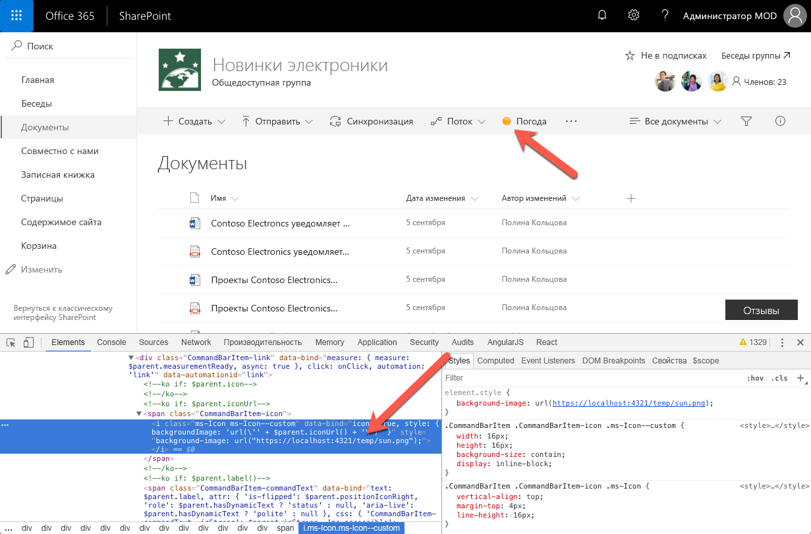
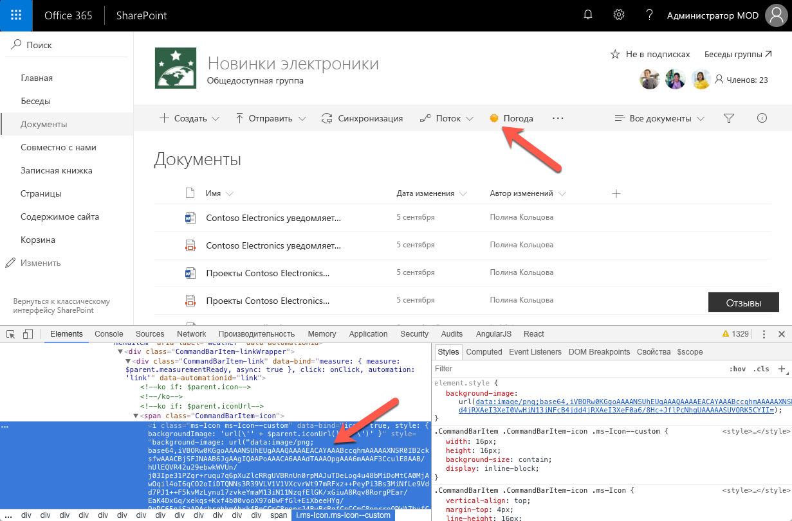

# <a name="configure-extension-icon"></a>Настройка значка расширения

Значок, иллюстрирующий назначение вашей пользовательской команды, поможет пользователям найти ее среди других вариантов на панели инструментов или в контекстном меню. В этой статье описываются различные способы, которыми вы можете настраивать значки для своих команд.

## <a name="extension-types-that-support-icons"></a>Типы расширений, поддерживающие значки

SharePoint Framework поддерживает создание расширений следующих типов:

- настройщик приложений;
- настройщик полей;
- набор команд.

Набор команд — единственный тип расширения SharePoint Framework, для которого можно настраивать значки.

## <a name="defining-command-set-locations"></a>Определение расположений наборов команд

При развертывании наборов команд можно выбрать, должны ли соответствующие команды отображаться на панели команд (`location: ClientSideExtension.ListViewCommandSet.CommandBar`), в контекстном меню (`location: ClientSideExtension.ListViewCommandSet.ContextMenu`) или в обоих местах (`location: ClientSideExtension.ListViewCommandSet`). Значки, определенные для разных команд, будут отображаться только на панели команд.

## <a name="configuring-command-set-icons"></a>Настройка значков набора команд

В SharePoint Framework доступно два способа определения значков для расширений.

### <a name="using-an-external-icon-image"></a>Использование внешнего изображения для значка

При создании наборов команд SharePoint Framework вы можете задать значок для каждой команды, указав абсолютный URL-адрес, указывающий на изображение в манифесте расширения, с помощью свойства **iconImageUrl**.

```json
{
  "$schema": "https://dev.office.com/json-schemas/spfx/command-set-extension-manifest.schema.json",

  "id": "6cdfbff6-714f-4c26-a60c-0b18afe60837",
  "alias": "WeatherCommandSet",
  "componentType": "Extension",
  "extensionType": "ListViewCommandSet",

  // The "*" signifies that the version should be taken from the package.json
  "version": "*",
  "manifestVersion": 2,

  // If true, the component can only be installed on sites where Custom Script is allowed.
  // Components that allow authors to embed arbitrary script code should set this to true.
  // https://support.office.com/en-us/article/Turn-scripting-capabilities-on-or-off-1f2c515f-5d7e-448a-9fd7-835da935584f
  "requiresCustomScript": false,

  "items": {
    "WEATHER": {
      "title": { "default": "Weather" },
      "iconImageUrl": "https://localhost:4321/temp/sun.png",
      "type": "command"
    }
  }
}
```

Размер значка команды, отображаемого на панели команд, составляет 16x16 пикселей. Если указано изображение большего размера, оно будет уменьшено до этого размера с сохранением пропорций.



Использование пользовательских изображений обеспечивает широкие возможности выбора значка для команды, но при этом их требуется развертывать вместе с другими ресурсами расширения. Кроме того, качество изображения может снизиться при использовании высокого разрешения или некоторых специальных возможностей. Во избежание снижения качества можно использовать векторные изображения в формате SVG, которые также поддерживаются на платформе SharePoint Framework.

### <a name="using-a-base64-encoded-image"></a>Использование изображения в кодировке base64

При использовании пользовательского изображения можно не указывать абсолютный URL-адрес файла изображения, размещенного вместе с другими ресурсами расширения, а закодировать изображение в формате base64 и использовать строку base64 вместо URL-адреса.

> В Интернете доступен ряд служб, с помощью которых можно закодировать изображение в формате base64, например [https://www.base64-image.de](https://www.base64-image.de).

После кодирования изображения скопируйте строку base64 и используйте ее в качестве значения свойства **iconImageUrl** в манифесте веб-части.

```json
{
  "$schema": "https://dev.office.com/json-schemas/spfx/command-set-extension-manifest.schema.json",

  "id": "6cdfbff6-714f-4c26-a60c-0b18afe60837",
  "alias": "WeatherCommandSet",
  "componentType": "Extension",
  "extensionType": "ListViewCommandSet",

  // The "*" signifies that the version should be taken from the package.json
  "version": "*",
  "manifestVersion": 2,

  // If true, the component can only be installed on sites where Custom Script is allowed.
  // Components that allow authors to embed arbitrary script code should set this to true.
  // https://support.office.com/en-us/article/Turn-scripting-capabilities-on-or-off-1f2c515f-5d7e-448a-9fd7-835da935584f
  "requiresCustomScript": false,

  "items": {
    "WEATHER": {
      "title": { "default": "Weather" },
      "iconImageUrl": "data:image/png;base64,iVBORw0KGgoAAAANSUhEUgAAAQAAAAEACAYAAABccqhmAAAAAXNSR0IB2cksfwAAACBjSFJNAAB6JgAAgIQAAPoAAACA6AAAdTAAAOpgAAA6mAAAF3CculE8AAB/hUlEQVR42u29ebwkWVUn/j03Ipe31PZqr+ruqu7q6pXuZlcRRgUVBRnUn0rpMAJuTDeLog4u48bMiDoMtCA0MjAwOqil4oI6qCO2oIiDTQ...",
      "type": "command"
    }
  }
}
```



Кодировка base64 подходит как для растровых изображений (например, PNG-файлов), так и для векторных изображений в формате SVG. Значительное преимущество использования изображений в кодировке base64 заключается в том, что изображение значка веб-части необходимо развернуть отдельно.

## <a name="additional-considerations"></a>Дополнительные сведения

Указывать значок для команды необязательно. Если значок не задан, на панели команд будет отображаться только заголовок команды.