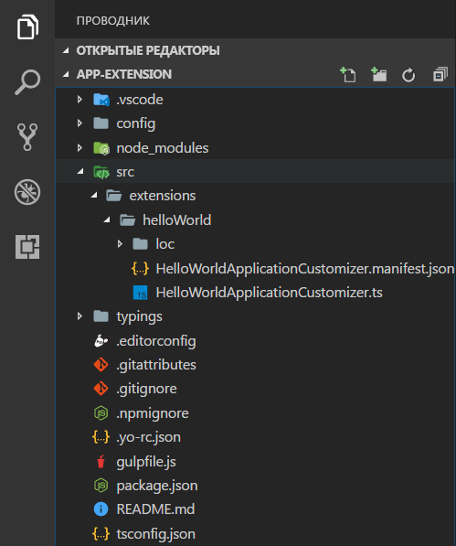
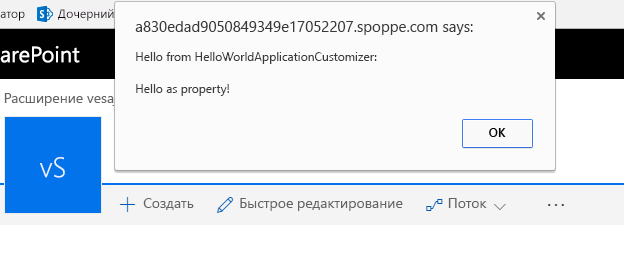

# <a name="build-your-first-sharepoint-framework-extension-hello-world-part-1"></a>Создание первого расширения SharePoint Framework (Hello World, часть 1)

>**Примечание.** Расширения для платформы SharePoint Framework находятся на этапе тестирования и могут меняться. В настоящее время расширения SharePoint Framework невозможно использовать в рабочих средах.

Расширения — это клиентские компоненты, которые запускаются в контексте страницы SharePoint. Расширения можно развертывать в SharePoint Online, а для их создания также можно использовать современные инструменты и библиотеки JavaScript.

>**Примечание.** Прежде чем выполнять действия, описанные в этой статье, [настройте среду разработки](../../set-up-your-development-environment). Обратите внимание, что в настоящее время расширения доступны **ТОЛЬКО** в клиентах разработчиков приложений для Office 365.

## <a name="create-an-extension-project"></a>Создание проекта расширения
Создайте каталог проекта в любом расположении.

```
md app-extension
```

Перейдите к каталогу проекта.

```
cd app-extension
```

Создайте расширение HelloWorld, запустив генератор Yeoman для SharePoint.

```
yo @microsoft/sharepoint
```

Когда появится запрос, выполните указанные ниже действия.

* Оставьте имя решения по умолчанию (**app-extension**) и нажмите клавишу **ВВОД**.
* Выберите для создаваемого клиентского компонента тип **Extension (Preview)**. 
* Выберите для создаваемого расширения тип **Application Customizer (Preview)**.

Далее вам потребуется указать определенные сведения о расширении.

* Оставьте значение по умолчанию (**HelloWorld**) для имени решения и нажмите клавишу **ВВОД**.
* Оставьте значение по умолчанию (**HelloWorld description**) для описания решения и нажмите клавишу **ВВОД**.


> Обратите внимание, что если задать для расширения слишком длинное имя, это может вызвать проблемы. Указанные записи используются для создания записи псевдонима в JSON-файле манифеста для настройщика приложений. Если длина псевдонима превышает 40 символов, то при попытке передать расширение с помощью `gulp serve --nobrowser` возникнет исключение. Вы можете устранить эту проблему, обновив запись псевдонима позже.

После этого Yeoman установит необходимые зависимости и выполнит скаффолдинг файлов решения, а также расширения **HelloWorld**. Это может занять несколько минут. 

После успешного скаффолдинга должно появиться следующее сообщение:


Сведения об устранении неполадок см. в статье [Известные проблемы](../basics/known-issues).

Когда скаффолдинг решения будет завершен, введите в консоли приведенную ниже команду, чтобы запустить Visual Studio Code.

```
code .
```

> Обратите внимание, что клиентское решение SharePoint создано с помощью HTML и TypeScript, поэтому для разработки расширения можно использовать любой редактор кода, который поддерживает клиентское программирование.

Обратите внимание, что стандартная структура решения аналогична структуре клиентских веб-частей. Это базовая структура решения SharePoint Framework, многие параметры которой не зависят от типа решения.



Откройте файл **HelloWorldApplicationCustomizer.manifest.json** в папке src\extensions\helloWorld.

В этом файле определяются тип расширения и уникальный идентификатор **id** для него. Этот идентификатор потребуется позже, при отладке и развертывании расширения в SharePoint.


## <a name="coding-your-application-customizer"></a>Написание кода настройщика приложений 
Откройте файл **HelloWorldApplicationCustomizer.ts** в папке **src\extensions\helloWorld**.

Обратите внимание, что базовый класс для настройщика приложений импортируется из пакета **sp-application-base**, который содержит код платформы SharePoint Framework, необходимый для настройщика приложений.


Логика настройщика приложений содержится в методах **onInit** и **onRender**.

- В методе **onInit()** выполняется вся настройка, необходимая для расширения. Это событие происходит после назначения ```this.context``` и ```this.properties```, но до того, как модель DOM будет готова. Как и в случае с веб-частями, ```onInit()``` возвращает обещание, с помощью которого можно выполнять асинхронные операции. ```onRender()``` не будет вызываться, пока обещание не будет разрешено. Если вам это не нужно, просто верните ```super.onInit()```.
- В методе **onRender()** расширение может взаимодействовать с пользовательским интерфейсом. Это событие может возникать после создания исходной структуры модели DOM для страницы (однако отрисовка некоторых частей пользовательского интерфейса может быть еще не завершена).

> Обратите внимание, что конструктор класса вызывается на раннем этапе, когда ```this.context``` и ```this.properties``` не определены. Пользовательская логика инициализации здесь не поддерживается.

Ниже представлено содержимое методов **onInit()** и **onRender()** в стандартном решении. Оно просто записывает журнал на панель мониторинга для разработчиков, а затем выводит простое предупреждение JavaScript при отрисовке страницы.


>  Если настройщик приложений использует входные данные ClientSideComponentProperties в формате JSON, он будет десериализован в объект BaseExtension.properties. Вы можете определить интерфейс, описывающий его. Шаблон по умолчанию ищет свойство testMessage, а если оно предоставлено, выводит его в качестве предупреждения.

## <a name="debugging-your-application-customizer-using-gulp-serve-and-query-string-parameters"></a>Отладка настройщика приложений с помощью gulp serve и параметров строки запроса
В настоящее время расширения SharePoint Framework невозможно тестировать с помощью локальной среды программирования, поэтому тестировать и разрабатывать их следует непосредственно на активном сайте SharePoint Online. Однако при этом не требуется развертывать решение в каталоге приложений, что делает отладку простой и эффективной. 

Для начала скомпилируйте код и разместите скомпилированные файлы с локального компьютера, выполнив следующую команду:
```
gulp serve --nobrowser
```

>**Примечание.** Если у вас не установлен сертификат разработчика SPFx, среда программирования сообщит вам, что она не загружает сценарии из localhost. Остановите текущий процесс в окне консоли и выполните команду `gulp trust-dev-cert` в консоли каталога проекта, чтобы установить сертификат разработчика, прежде чем еще раз выполнять команду `gulp serve --nobrowser`.

Обратите внимание, что мы использовали параметр ```--nobrowser```, так как локальная отладка расширений сейчас не поддерживается, то есть нет смысла запускать локальную среду программирования.

Когда компиляция кода завершится без ошибок, полученный манифест будет доступен по адресу http://localhost:4321.


Чтобы протестировать расширение, перейдите на современную страницу представления списка в среде SharePoint и добавьте к URL-адресу следующие параметры строки запроса:
```
?loadSPFX=true&debugManifestsFile=https://localhost:4321/temp/manifests.js&customActions={"d03ae0c2-bbbf-4cf5-9ff7-0986904553da":{"location":"ClientSideExtension.ApplicationCustomizer","properties":{"testMessage":"Hello as property!"}}}
```

Дополнительные сведения о параметрах запросов URL-адресов

* **loadSPFX=true:** гарантирует, что платформа SharePoint Framework загружается на странице. Для оптимальной производительности платформа обычно не загружается, если не зарегистрировано хотя бы одно расширение. Так как пока не зарегистрировано ни одного расширения, нам необходимо отдавать явную команду на загрузку платформы.

* **debugManifestsFile:** указывает, что нам требуется загрузить компоненты SPFx, предоставляемые локально. Как правило, загрузчик ищет компоненты только в каталоге приложений (для развернутого решения) и на сервере манифестов SharePoint (для системных библиотек).

* **customActions:** этот параметр запроса URL-адреса имитирует дополнительное действие. Позже (при фактическом развертывании и регистрации этого компонента на сайте) мы создадим объект CustomAction и опишем все свойства, которые можно задать для него. 
    * **Key:** используйте GUID расширения в качестве ключа, связываемого с дополнительным действием.
    * **Location:** тип дополнительного действия. Для настройщика приложений используйте значение ClientSideExtension.ApplicationCustomizer.
    * **Properties:** необязательный объект JSON, содержащий свойства, которые будут доступны через элемент this.properties. В примере HelloWorld он определен как свойство testMessage.


Перейдите ко встроенному современному списку в SharePoint Online. Это может быть список или библиотека для первоначального тестирования. Настройщики приложений также поддерживаются на современных страницах и на странице "Содержимое сайта". 

Добавьте к URL-адресу дополнительные параметры запроса, определенные выше. Обратите внимание, что GUID необходимо обновить в соответствии с идентификатором настройщика приложений, указанным в файле **HelloWorldApplicationCustomizer.manifest.json** из папки src\extensions\helloWorld. 

Полный URL-адрес должен выглядеть примерно так, как показано ниже, но соответствовать URL-адресу клиента.

```
contoso.sharepoint.com/Lists/Contoso/AllItems.aspx?loadSPFX=true&debugManifestsFile=https://localhost:4321/temp/manifests.js&customActions={"5fc73e12-8085-4a4b-8743-f6d02ffe1240":{"location":"ClientSideExtension.ApplicationCustomizer","properties":{"testMessage":"Hello as property!"}}}
```


Нажмите кнопку **Загрузить скрипты отладки**, чтобы продолжить загрузку скриптов с локального узла.

На странице должно появиться предупреждение. 



Это предупреждение вызвано вашим расширением SharePoint Framework. Обратите внимание: так как мы указали свойство testMessage вместе с параметрами запроса отладки, оно включено в предупреждение. Вы можете настроить экземпляры расширения в соответствии со свойствами клиентского компонента, которые также передаются для экземпляра в режиме выполнения. 

> Если у вас возникли проблемы с запуском отладки, проверьте используемые параметры запроса URL-адреса. Некоторые браузеры кодируют параметры, что иногда влияет на поведение запросов. 

## <a name="next-steps"></a>Дальнейшие действия
Поздравляем с успешным запуском вашего первого расширения SharePoint Framework! Теперь, когда расширение запущено, вы можете продолжить его создание, ознакомившись со следующей статьей — [Использование заполнителей страниц в настройщике приложений (Hello World, часть 2)](./using-page-placeholder-with-extensions.md). Вы будете использовать тот же проект и воспользуетесь определенными заполнителями содержимого, чтобы изменить пользовательский интерфейс SharePoint. Обратите внимание, что команда ```gulp serve``` по-прежнему выполняется в окне консоли (или в Visual Studio Code, если вы используете редактор). Вы можете оставить ее, переходя к следующей статье.
