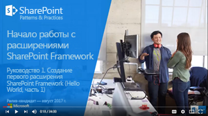

# <a name="build-your-first-sharepoint-framework-extension-hello-world-part-1"></a><span data-ttu-id="3a383-101">Создание первого расширения SharePoint Framework (Hello World, часть 1)</span><span class="sxs-lookup"><span data-stu-id="3a383-101">Build your first SharePoint Framework Extension (Hello World part 1)</span></span>

><span data-ttu-id="3a383-p101">**Примечание.** Расширения для платформы SharePoint Framework находятся на этапе тестирования и могут меняться. В настоящее время расширения SharePoint Framework невозможно использовать в рабочих средах.</span><span class="sxs-lookup"><span data-stu-id="3a383-p101">**Note:** The SharePoint Framework Extensions are currently in preview and are subject to change. SharePoint Framework Extensions are not currently supported for use in production environments.</span></span>

<span data-ttu-id="3a383-p102">Расширения — это клиентские компоненты, которые запускаются в контексте страницы SharePoint. Расширения можно развертывать в SharePoint Online, а для их создания также можно использовать современные инструменты и библиотеки JavaScript.</span><span class="sxs-lookup"><span data-stu-id="3a383-p102">Extensions are client-side components that run inside the context of a SharePoint page. Extensions can be deployed to SharePoint Online, and you can also use modern JavaScript tools and libraries to build them.</span></span>

<span data-ttu-id="3a383-106">Эти действия также показаны в видео на [канале SharePoint PnP в YouTube](https://www.youtube.com/watch?v=0BeS0HukW24&list=PLR9nK3mnD-OXtWO5AIIr7nCR3sWutACpV).</span><span class="sxs-lookup"><span data-stu-id="3a383-106">You can also follow these steps by watching the video on the [SharePoint PnP YouTube Channel](https://www.youtube.com/watch?v=0BeS0HukW24&list=PLR9nK3mnD-OXtWO5AIIr7nCR3sWutACpV).</span></span> 

<a href="https://www.youtube.com/watch?v=0BeS0HukW24&list=PLR9nK3mnD-OXtWO5AIIr7nCR3sWutACpV">

</a>

## <a name="create-an-extension-project"></a><span data-ttu-id="3a383-107">Создание проекта расширения</span><span class="sxs-lookup"><span data-stu-id="3a383-107">Create an extension project</span></span>
<span data-ttu-id="3a383-108">Создайте каталог проекта в любом расположении.</span><span class="sxs-lookup"><span data-stu-id="3a383-108">Create a new project directory in your favorite location.</span></span>

```
md app-extension
```

<span data-ttu-id="3a383-109">Перейдите к каталогу проекта.</span><span class="sxs-lookup"><span data-stu-id="3a383-109">Go to the project directory.</span></span>

```
cd app-extension
```

<span data-ttu-id="3a383-110">Создайте расширение HelloWorld, запустив генератор Yeoman для SharePoint.</span><span class="sxs-lookup"><span data-stu-id="3a383-110">Create a new HelloWorld extension by running the Yeoman SharePoint Generator.</span></span>

```
yo @microsoft/sharepoint
```

<span data-ttu-id="3a383-111">Когда появится запрос, выполните указанные ниже действия.</span><span class="sxs-lookup"><span data-stu-id="3a383-111">When prompted:</span></span>

* <span data-ttu-id="3a383-112">Оставьте имя решения по умолчанию (**app-extension**) и нажмите клавишу **ВВОД**.</span><span class="sxs-lookup"><span data-stu-id="3a383-112">Accept the default **app-extension** as your solution name and press **Enter**.</span></span>
* <span data-ttu-id="3a383-113">Выберите **Use the current folder** (Использовать текущую папку) и нажмите клавишу **ВВОД**.</span><span class="sxs-lookup"><span data-stu-id="3a383-113">Choose **Use the current folder** and press **Enter**</span></span>
* <span data-ttu-id="3a383-114">Выберите **N**, чтобы сделать установку расширения обязательной на каждом сайте при его использовании.</span><span class="sxs-lookup"><span data-stu-id="3a383-114">Choose **N** to require extension to be installed on each site explicitly when it's being used</span></span> 
* <span data-ttu-id="3a383-115">Выберите для создаваемого клиентского компонента тип **Extension (Preview)**.</span><span class="sxs-lookup"><span data-stu-id="3a383-115">Choose **Extension (Preview)** as the client-side component type to be created.</span></span> 
* <span data-ttu-id="3a383-116">Выберите для создаваемого расширения тип **Application Customizer (Preview)**.</span><span class="sxs-lookup"><span data-stu-id="3a383-116">Choose **Application Customizer (Preview)** as the extension type to be created.</span></span>

<span data-ttu-id="3a383-117">Далее вам потребуется указать определенные сведения о расширении.</span><span class="sxs-lookup"><span data-stu-id="3a383-117">The next set of prompts will ask for specific information about your extension:</span></span>

* <span data-ttu-id="3a383-118">Оставьте значение по умолчанию (**HelloWorld**) для имени решения и нажмите клавишу **ВВОД**.</span><span class="sxs-lookup"><span data-stu-id="3a383-118">Accept the default **HelloWorld** as your extension name and press **Enter**.</span></span>
* <span data-ttu-id="3a383-119">Оставьте значение по умолчанию (**HelloWorld description**) для описания решения и нажмите клавишу **ВВОД**.</span><span class="sxs-lookup"><span data-stu-id="3a383-119">Accept the default **HelloWorld description** as your extension description and press **Enter**.</span></span>


> <span data-ttu-id="3a383-p103">Обратите внимание, что если задать для расширения слишком длинное имя, это может вызвать проблемы. Указанные записи используются для создания записи псевдонима в JSON-файле манифеста для настройщика приложений. Если длина псевдонима превышает 40 символов, то при попытке передать расширение с помощью `gulp serve --nobrowser` возникнет исключение. Вы можете устранить эту проблему, обновив запись псевдонима позже.</span><span class="sxs-lookup"><span data-stu-id="3a383-p103">Notice that if you use too long naming for the extension, that can cause issues. Provided entries are used to generate alias entry for the application customizer manifest json file. If alias is longer than 40 characters, you will have an exception when you are trying to serve the extension using `gulp serve --nobrowser`. You can solve this by updating the alias entry also afterwards.</span></span>

<span data-ttu-id="3a383-p104">После этого Yeoman установит необходимые зависимости и выполнит скаффолдинг файлов решения, а также расширения **HelloWorld**. Это может занять несколько минут.</span><span class="sxs-lookup"><span data-stu-id="3a383-p104">At this point, Yeoman will install the required dependencies and scaffold the solution files along with the **HelloWorld** extension. This might take a few minutes.</span></span> 

<span data-ttu-id="3a383-127">После успешного скаффолдинга должно появиться следующее сообщение:</span><span class="sxs-lookup"><span data-stu-id="3a383-127">When the scaffold is complete, you should see the following message indicating a successful scaffold:</span></span>


<span data-ttu-id="3a383-129">Сведения об устранении неполадок см. в статье [Известные проблемы](../basics/known-issues).</span><span class="sxs-lookup"><span data-stu-id="3a383-129">For information about troubleshooting any errors, see [Known issues](../basics/known-issues).</span></span>

<span data-ttu-id="3a383-130">Когда скаффолдинг решения будет завершен, введите в консоли приведенную ниже команду, чтобы запустить Visual Studio Code.</span><span class="sxs-lookup"><span data-stu-id="3a383-130">Once solution scaffolding is completed, type the following into the console to start Visual Studio Code.</span></span>

```
code .
```

> <span data-ttu-id="3a383-131">Обратите внимание, что клиентское решение SharePoint создано с помощью HTML и TypeScript, поэтому для разработки расширения можно использовать любой редактор кода, который поддерживает клиентское программирование.</span><span class="sxs-lookup"><span data-stu-id="3a383-131">Notice that because the SharePoint client-side solution is HTML/TypeScript based, you can use any code editor that supports client-side development to build your extension.</span></span>

<span data-ttu-id="3a383-p105">Обратите внимание, что стандартная структура решения аналогична структуре клиентских веб-частей. Это базовая структура решения SharePoint Framework, многие параметры которой не зависят от типа решения.</span><span class="sxs-lookup"><span data-stu-id="3a383-p105">Notice how the default solution structure is like the solution structure of client-side web parts. This is the basic SharePoint Framework solution structure, with similar configuration options across all solution types.</span></span>


<span data-ttu-id="3a383-135">Откройте файл **HelloWorldApplicationCustomizer.manifest.json** в папке src\extensions\helloWorld.</span><span class="sxs-lookup"><span data-stu-id="3a383-135">Open **HelloWorldApplicationCustomizer.manifest.json** at the src\extensions\helloWorld folder.</span></span>

<span data-ttu-id="3a383-p106">В этом файле определяются тип расширения и уникальный идентификатор **id** для него. Этот идентификатор потребуется позже, при отладке и развертывании расширения в SharePoint.</span><span class="sxs-lookup"><span data-stu-id="3a383-p106">This file defines your extension type and a unique identifier **“id”** for your extension. You’ll need this unique identifier later when debugging and deploying your extension to SharePoint.</span></span>


## <a name="coding-your-application-customizer"></a><span data-ttu-id="3a383-139">Написание кода настройщика приложений</span><span class="sxs-lookup"><span data-stu-id="3a383-139">Coding your Application Customizer</span></span> 
<span data-ttu-id="3a383-140">Откройте файл **HelloWorldApplicationCustomizer.ts** в папке **src\extensions\helloWorld**.</span><span class="sxs-lookup"><span data-stu-id="3a383-140">Open the **HelloWorldApplicationCustomizer.ts** file in the **src\extensions\helloWorld** folder.</span></span>

<span data-ttu-id="3a383-141">Обратите внимание, что базовый класс для настройщика приложений импортируется из пакета **sp-application-base**, который содержит код платформы SharePoint Framework, необходимый для настройщика приложений.</span><span class="sxs-lookup"><span data-stu-id="3a383-141">Notice that base class for the Application Customizer is imported from the **sp-application-base** package, which contains SharePoint framework code required by the Application Customizer.</span></span>


<span data-ttu-id="3a383-143">Логика настройщика приложений содержится в методе **onInit**.</span><span class="sxs-lookup"><span data-stu-id="3a383-143">The logic for your Application Customizer is contained in the two methods onInit and onRender.</span></span>

- <span data-ttu-id="3a383-p107">**onInit()** вызывается, когда клиентское расширение впервые активируется на странице. Это событие происходит после назначения ```this.context``` и ```this.properties```. Как и в случае с веб-частями, ```onInit()``` возвращает обещание, которое можно использовать для выполнения асинхронных операций.</span><span class="sxs-lookup"><span data-stu-id="3a383-p107">**onInit()** is called when the client-side extension is first activated on the page. This event occurs after ```this.context``` and ```this.properties``` are assigned. As with web parts, ```onInit()``` returns a promise that you can use to perform asynchronous operations.</span></span>

> <span data-ttu-id="3a383-p108">Обратите внимание, что конструктор класса вызывается на раннем этапе, когда ```this.context``` и ```this.properties``` не определены. Пользовательская логика инициализации здесь не поддерживается.</span><span class="sxs-lookup"><span data-stu-id="3a383-p108">Notice. The class constructor is called at an early stage, when ```this.context``` and ```this.properties``` are undefined. We do not support including custom initiation logic here.</span></span>

<span data-ttu-id="3a383-p109">Ниже представлено содержимое методов **onInit()** в решении по умолчанию. Оно просто записывает журнал на панель мониторинга для разработчиков, а затем выводит простое предупреждение JavaScript при отрисовке страницы.</span><span class="sxs-lookup"><span data-stu-id="3a383-p109">Below are the contents of **onInit()** and onRender() in the default solution. This default solution simply writes a log to the Dev Dashboard, and then displays a simple JavaScript alert when the page renders.</span></span>


>  <span data-ttu-id="3a383-p110">Если настройщик приложений использует входные данные ClientSideComponentProperties в формате JSON, он будет десериализован в объект BaseExtension.properties. Вы можете определить интерфейс, описывающий его. Шаблон по умолчанию ищет свойство testMessage, а если оно предоставлено, выводит его в качестве предупреждения.</span><span class="sxs-lookup"><span data-stu-id="3a383-p110">If your application customizer uses the ClientSideComponentProperties JSON input, it will be deserialized into the BaseExtension.properties object. You can define an interface to describe it. The default template is looking for a property called testMessage, and if it's provided, outputting it in an alert message.</span></span>

## <a name="debugging-your-application-customizer-using-gulp-serve-and-query-string-parameters"></a><span data-ttu-id="3a383-156">Отладка настройщика приложений с помощью gulp serve и параметров строки запроса</span><span class="sxs-lookup"><span data-stu-id="3a383-156">Debugging your Application Customizer using gulp serve and query string parameters</span></span>
<span data-ttu-id="3a383-p111">В настоящее время расширения SharePoint Framework невозможно тестировать с помощью локальной среды программирования, поэтому тестировать и разрабатывать их следует непосредственно на активном сайте SharePoint Online. Однако при этом не требуется развертывать решение в каталоге приложений, что делает отладку простой и эффективной.</span><span class="sxs-lookup"><span data-stu-id="3a383-p111">SharePoint Framework extensions cannot currently be tested using the local workbench, so you'll need to test and develop them directly against a live SharePoint Online site. You do not, however, need to deploy your customization to the app catalog to do this, which keeps the debugging experience simple and efficient.</span></span> 

<span data-ttu-id="3a383-159">Для начала скомпилируйте код и разместите скомпилированные файлы с локального компьютера, выполнив следующую команду:</span><span class="sxs-lookup"><span data-stu-id="3a383-159">First, compile your code and host the compiled files from your local machine by running this command:</span></span>
```
gulp serve --nobrowser
```

><span data-ttu-id="3a383-p112">**Примечание.** Если у вас не установлен сертификат разработчика SPFx, среда программирования сообщит вам, что она не загружает сценарии из localhost. Остановите текущий процесс в окне консоли и выполните команду `gulp trust-dev-cert` в консоли каталога проекта, чтобы установить сертификат разработчика, прежде чем еще раз выполнять команду `gulp serve --nobrowser`.</span><span class="sxs-lookup"><span data-stu-id="3a383-p112">**Note:** If you do not have the SPFx developer certificate installed, then Workbench will notify you that it is configured not to load scripts from localhost. Stop currently running process in the console window, execute `gulp trust-dev-cert` command in your project directory console to install the developer certificate before running `gulp serve --nobrowser`command again.</span></span>

<span data-ttu-id="3a383-162">Обратите внимание, что мы использовали параметр ```--nobrowser```, так как нет смысла запускать локальную рабочую область — сейчас нельзя отлаживать расширения локально.</span><span class="sxs-lookup"><span data-stu-id="3a383-162">Notice that we used the ```--nobrowser``` option, since there's no value in launching the local workbench since you currently cannot debug extensions locally.</span></span>

<span data-ttu-id="3a383-163">Когда компиляция кода завершится без ошибок, полученный манифест будет доступен по адресу http://localhost:4321.</span><span class="sxs-lookup"><span data-stu-id="3a383-163">Once it compiles the code without errors, it will serve the resulting manifest from http://localhost:4321.</span></span>


<span data-ttu-id="3a383-p113">Чтобы проверить расширение, перейдите на современную страницу представления списка в среде SharePoint и добавьте следующие параметры строки запроса в URL-адрес. Обратите внимание, что вам потребуется обновить идентификатор в соответствии с идентификатором расширения, указанным в файле **HelloWorldApplicationCustomizer.manifest.json**:</span><span class="sxs-lookup"><span data-stu-id="3a383-p113">To test your extension, navigate to a modern list view page in your SharePoint environment and append the following query string parameters to the URL. Notice that you will need to update the id to match your own extension identifier available from the **HelloWorldApplicationCustomizer.manifest.json** file:</span></span>
```
?loadSPFX=true&debugManifestsFile=https://localhost:4321/temp/manifests.js&customActions={"e5625e23-5c5a-4007-a335-e6c2c3afa485":{"location":"ClientSideExtension.ApplicationCustomizer","properties":{"testMessage":"Hello as property!"}}}
```

<span data-ttu-id="3a383-167">Дополнительные сведения о параметрах запроса URL-адресов</span><span class="sxs-lookup"><span data-stu-id="3a383-167">More detail about the URL query parameters:</span></span>

* <span data-ttu-id="3a383-p114">**loadSPFX=true:** гарантирует, что платформа SharePoint Framework загружается на странице. Для оптимальной производительности платформа обычно не загружается, если не зарегистрировано хотя бы одно расширение. Так как пока не зарегистрировано ни одного расширения, нам необходимо отдавать явную команду на загрузку платформы.</span><span class="sxs-lookup"><span data-stu-id="3a383-p114">**loadSPFX=true:**  ensures that the SharePoint Framework is loaded on the page. For performance reasons, the framework is not normally loaded unless at least one extension is registered. Since no components are registered yet, we must explicitly load the framework.</span></span>

* <span data-ttu-id="3a383-p115">**debugManifestsFile:** указывает, что нам требуется загрузить компоненты SPFx, предоставляемые локально. Как правило, загрузчик ищет компоненты только в каталоге приложений (для развернутого решения) и на сервере манифестов SharePoint (для системных библиотек).</span><span class="sxs-lookup"><span data-stu-id="3a383-p115">**debugManifestsFile:**  specifies that we want to load SPFx components that are being locally served. Normally the loader only looks for components in the App Catalog (for your deployed solution) and the SharePoint manifest server (for the system libraries).</span></span>

* <span data-ttu-id="3a383-p116">**customActions:** этот параметр запроса URL-адреса имитирует дополнительное действие. Позже (при фактическом развертывании и регистрации этого компонента на сайте) мы создадим объект CustomAction и опишем все свойства, которые можно задать для него.</span><span class="sxs-lookup"><span data-stu-id="3a383-p116">**customActions:**  this URL query parameter simulates a custom action. When we actually deploy and register this component in a site later in this lab, we’ll create this CustomAction object for real and describe all the different properties you can set on it.</span></span> 
    * <span data-ttu-id="3a383-p117">**Key:** используйте GUID расширения в качестве ключа для связывания с дополнительным действием. Он должен совпадать с идентификатором расширения, указанным в файле manifest.json.</span><span class="sxs-lookup"><span data-stu-id="3a383-p117">**Key:** use the Guid of the extension as the key to associate with the custom action. This has to match on the id value of your extension available from the extension manifest.json.</span></span>
    * <span data-ttu-id="3a383-177">**Location:** тип дополнительного действия. Для настройщика приложений используйте значение ClientSideExtension.ApplicationCustomizer.</span><span class="sxs-lookup"><span data-stu-id="3a383-177">**Location:** the type of custom action, use "ClientSideExtension.ApplicationCustomizer" for the Application Customizer extension</span></span>
    * <span data-ttu-id="3a383-p118">**Properties:** необязательный объект JSON, содержащий свойства, которые будут доступны через элемент this.properties. В примере HelloWorld он определен как свойство testMessage.</span><span class="sxs-lookup"><span data-stu-id="3a383-p118">**Properties:** an optional JSON object containing properties that will be available via the this.properties member. In this HelloWorld example, it defined a ‘testMessage’ property.</span></span>


<span data-ttu-id="3a383-p119">Перейдите ко встроенному современному списку в SharePoint Online. Это может быть список или библиотека для первоначального тестирования. Настройщики приложений также поддерживаются на современных страницах и на странице "Содержимое сайта".</span><span class="sxs-lookup"><span data-stu-id="3a383-p119">Navigate to a out of the box modern list in SharePoint Online. This can be a list or a library for the initial testing. Application customizers are also supported in modern pages and on the Site Contents page.</span></span> 

<span data-ttu-id="3a383-p120">Добавьте к URL-адресу дополнительные параметры запроса, определенные выше. Обратите внимание, что GUID необходимо обновить в соответствии с идентификатором настройщика приложений, указанным в файле **HelloWorldApplicationCustomizer.manifest.json** из папки src\extensions\helloWorld.</span><span class="sxs-lookup"><span data-stu-id="3a383-p120">Extend the URL with the additional query parameters defined above. Notice that you'll need to update the GUID to match the ID of your custom Application Customizer available from  **HelloWorldApplicationCustomizer.manifest.json** at the src\extensions\helloWorld folder.</span></span> 

<span data-ttu-id="3a383-185">Полный URL-адрес должен выглядеть примерно так, как показано ниже, но соответствовать URL-адресу клиента.</span><span class="sxs-lookup"><span data-stu-id="3a383-185">The full URL should look similar to the following depending on your tenant URL:</span></span>

```
contoso.sharepoint.com/Lists/Contoso/AllItems.aspx?loadSPFX=true&debugManifestsFile=https://localhost:4321/temp/manifests.js&customActions={"e5625e23-5c5a-4007-a335-e6c2c3afa485":{"location":"ClientSideExtension.ApplicationCustomizer","properties":{"testMessage":"Hello as property!"}}}
```


<span data-ttu-id="3a383-187">Нажмите кнопку **Загрузить скрипты отладки**, чтобы продолжить загрузку скриптов с локального узла.</span><span class="sxs-lookup"><span data-stu-id="3a383-187">Click the "**Load debug scripts**" button to continue loading scripts from your local host.</span></span>

<span data-ttu-id="3a383-188">На странице должно появиться предупреждение.</span><span class="sxs-lookup"><span data-stu-id="3a383-188">You should now see the alert message on your page.</span></span>


<span data-ttu-id="3a383-p121">Это предупреждение вызвано вашим расширением SharePoint Framework. Обратите внимание: так как мы указали свойство testMessage вместе с параметрами запроса отладки, оно включено в предупреждение. Вы можете настроить экземпляры расширения в соответствии со свойствами клиентского компонента, которые также передаются для экземпляра в режиме выполнения.</span><span class="sxs-lookup"><span data-stu-id="3a383-p121">This alert is thrown by your SharePoint Framework Extension. Notice also that since we provided the testMessage property as part of the debug query parameters, it's included in the alert message. You can configure your extension instances based on the client component properties, which are passed for the instance also in runtime mode.</span></span> 

> <span data-ttu-id="3a383-p122">Если у вас возникли проблемы с запуском отладки, проверьте используемые параметры запроса URL-адреса. Некоторые браузеры кодируют параметры, что иногда влияет на поведение запросов.</span><span class="sxs-lookup"><span data-stu-id="3a383-p122">If you are having challenges in getting debugging to work, double check the URL query parameters used for the query. Some browsers tend to encode the parameters and in some scenarios this will impact the behavior.</span></span> 

## <a name="next-steps"></a><span data-ttu-id="3a383-195">Дальнейшие действия</span><span class="sxs-lookup"><span data-stu-id="3a383-195">Next steps</span></span>
<span data-ttu-id="3a383-p123">Поздравляем с успешным запуском вашего первого расширения SharePoint Framework! Теперь, когда расширение запущено, вы можете продолжить его создание, ознакомившись со следующей статьей — [Использование заполнителей страниц в настройщике приложений (Hello World, часть 2)](./using-page-placeholder-with-extensions.md). Вы будете использовать тот же проект и воспользуетесь определенными заполнителями содержимого, чтобы изменить пользовательский интерфейс SharePoint. Обратите внимание, что команда ```gulp serve``` по-прежнему выполняется в окне консоли (или в Visual Studio Code, если вы используете редактор). Вы можете оставить ее, переходя к следующей статье.</span><span class="sxs-lookup"><span data-stu-id="3a383-p123">Congratulations on getting your first SharePoint Framework Extension running! Now that your extension is running, you can continue building out your extension in the next topic, [Using page placeholders from Application Customizer (Hello World part 2)](./using-page-placeholder-with-extensions.md). You will use the same project and take advantage of specific content placeholders for modifying the UI of SharePoint. Notice that the ```gulp serve``` command is still running in your console window (or in Visual Studio Code if you are using the editor). You can continue to let it run while you go to the next article.</span></span>
