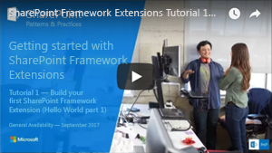
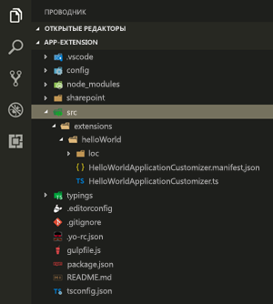
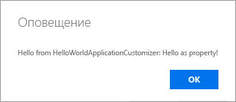

# <a name="build-your-first-sharepoint-framework-extension-hello-world-part-1"></a>Создание первого расширения SharePoint Framework (Hello World, часть 1)

Расширения SharePoint Framework (SPFx) — это клиентские компоненты, которые запускаются в контексте страницы SharePoint. Расширения можно развертывать в SharePoint Online, используя для их создания современные инструменты и библиотеки JavaScript.

В этой статье описано, как создать свое первое расширение SharePoint Framework Hello World. Эти действия также показаны в видео на [канале SharePoint PnP в YouTube](https://www.youtube.com/watch?v=0BeS0HukW24&list=PLR9nK3mnD-OXtWO5AIIr7nCR3sWutACpV). 

<a href="https://www.youtube.com/watch?v=yrFNu6K7iuU">

</a>

## <a name="create-an-extension-project"></a>Создание проекта расширения

1. Создайте каталог проекта в любом расположении.

    ```
    md app-extension
    ```

2. Перейдите к каталогу проекта.

    ```
    cd app-extension
    ```

3. Создайте расширение HelloWorld, запустив генератор Yeoman для SharePoint.

    ```
    yo @microsoft/sharepoint
    ```

4. Когда появится запрос, выполните следующие действия:

    * Оставьте имя решения по умолчанию **app-extension** и нажмите клавишу **ВВОД**.
    * Выберите **Только SharePoint Online (новая версия)** и нажмите клавишу **ВВОД**.
    * Выберите **Использовать текущую папку** и нажмите клавишу **ВВОД**.
    * Выберите **N**, чтобы сделать установку расширения обязательной на каждом сайте при его использовании. 
    * Выберите **Расширение** в качестве типа создаваемого клиентского компонента. 
    * Выберите для создаваемого расширения тип **Настройщик приложения**.

5. Далее вам потребуется указать определенные сведения о расширении. Когда появится запрос, сделайте вот что:

    * Оставьте значение по умолчанию (**HelloWorld**) для имени расширения и нажмите клавишу **ВВОД**.
    * Оставьте значение по умолчанию (**HelloWorld description**) для описания расширения и нажмите клавишу **ВВОД**.

    

    > [!NOTE] 
    > Если использовать слишком длинное имя для расширения, могут возникнуть проблемы. Предоставленные записи используются для создания псевдонима для манифеста настройщика приложений в формате JSON. Если длина псевдонима превышает 40 знаков, система выдаст ошибку исключения при попытке обработать расширение с помощью `gulp serve --nobrowser`. Впоследствии вы можете решить эту проблему, обновив запись псевдонима.

    После этого Yeoman установит необходимые зависимости и сформирует файлы решения, а также расширение **HelloWorld**. Это может занять несколько минут. 

    После успешного скаффолдинга должно появиться следующее сообщение:

    

    Сведения об устранении неполадок см. в статье [Известные проблемы](../../known-issues-and-common-questions.md).

6. После завершения скаффолдинга блокируйте версию зависимостей проекта, выполнив следующую команду:

    ```sh
    npm shrinkwrap
    ```

7. Далее введите в консоли приведенную ниже команду, чтобы запустить Visual Studio Code.

    ```
    code .
    ```

    > [!NOTE] 
    > Так как клиентское решение SharePoint основано на HTML и TypeScript, для разработки расширения можно использовать любой редактор кода, поддерживающий клиентскую разработку.

    Обратите внимание, что стандартная структура решения аналогична структуре клиентских веб-частей. Это базовая структура решения SharePoint Framework, многие параметры которой не зависят от типа решения.

    

8. Откройте файл **HelloWorldApplicationCustomizer.manifest.json** в папке src\extensions\helloWorld.

    В этом файле определяются тип расширения и уникальный идентификатор для него. Этот идентификатор потребуется позже, при отладке и развертывании расширения в SharePoint.

    

## <a name="code-your-application-customizer"></a>Написание кода настройщика приложений 
Откройте файл **HelloWorldApplicationCustomizer.ts** в папке **src\extensions\helloWorld**.

Обратите внимание, что базовый класс для настройщика приложений импортируется из пакета **sp-application-base**, который содержит код платформы SharePoint Framework, необходимый для настройщика приложений. 


Логика настройщика приложений содержится в методе **onInit**.

- **onInit()** вызывается, когда клиентское расширение впервые активируется на странице. Это событие происходит после назначения ```this.context``` и ```this.properties```. Как и в случае с веб-частями, ```onInit()``` возвращает обещание, которое можно использовать для выполнения асинхронных операций.

> [!NOTE] 
> Конструктор класса вызывается на ранней стадии, когда ```this.context``` и ```this.properties``` не определены. Пользовательская логика инициализации здесь не поддерживается.

Ниже представлено содержимое методов **onInit()** в решении по умолчанию. Оно просто записывает журнал на панель мониторинга для разработчиков, а затем выводит простое предупреждение JavaScript при отрисовке страницы.


Если настройщик приложений использует входные данные **ClientSideComponentProperties** в формате JSON, он будет десериализован в объект **BaseExtension.properties**. Вы можете определить интерфейс, описывающий его. Шаблон по умолчанию ищет свойство **testMessage** и, если оно предоставлено, выводит его в качестве предупреждения.

## <a name="debug-your-application-customizer-using-gulp-serve-and-query-string-parameters"></a>Отладка настройщика приложений с помощью gulp serve и параметров строки запроса
В настоящее время использование локального рабочего места для проверки расширений SharePoint Framework невозможно. Их необходимо проверить с помощью действующего сайта SharePoint Online. Для этого вам не нужно развертывать модификацию каталога приложений, что делает процесс отладки простым и эффективным. 

Для начала скомпилируйте код и разместите скомпилированные файлы с локального компьютера, выполнив указанную ниже команду.

```
gulp serve --nobrowser
```

> [!NOTE] 
> Если у вас не установлен сертификат разработчика SPFx, рабочая среда сообщит вам, что загрузка сценариев из localhost не настроена. В этом случае остановите текущий процесс в окне консоли и выполните команду `gulp trust-dev-cert` в консоли каталога проекта, чтобы установить сертификат разработчика, а затем выполните команду `gulp serve --nobrowser` еще раз.

Так как запускать локальное рабочее место не требуется (в настоящее время невозможно выполнять отладку расширений локально), используется параметр ```--nobrowser```.

Когда компиляция кода завершится без ошибок, полученный манифест будет доступен по адресу http://localhost:4321.


Чтобы проверить расширение, перейдите на современную страницу представления списка в среде SharePoint и добавьте следующие параметры строки запроса в URL-адрес. Обратите внимание, что вам потребуется обновить идентификатор в соответствии с идентификатором расширения. Он указан в файле **HelloWorldApplicationCustomizer.manifest.json**.

```
?loadSPFX=true&debugManifestsFile=https://localhost:4321/temp/manifests.js&customActions={"e5625e23-5c5a-4007-a335-e6c2c3afa485":{"location":"ClientSideExtension.ApplicationCustomizer","properties":{"testMessage":"Hello as property!"}}}
```

Дополнительные сведения о параметрах запросов URL-адресов

* **loadSPFX=true** — гарантирует, что платформа SharePoint Framework загружается на странице. Для оптимальной производительности платформа обычно не загружается, если не зарегистрировано хотя бы одно расширение. Так как пока не зарегистрировано ни одного расширения, нам необходимо отдавать явную команду на загрузку платформы.

* **debugManifestsFile** — указывает, что нам требуется загрузить компоненты SPFx, предоставляемые локально. Загрузчик ищет компоненты только в каталоге приложений (для развернутого решения) и на сервере манифестов SharePoint (для системных библиотек).

* **customActions** — имитирует дополнительное действие. При фактическом развертывании и регистрации этого компонента на сайте вы создадите объект **CustomAction** и опишете все свойства, которые можно задать для него. 
    * **Key** — используйте GUID расширения в качестве ключа для связывания с дополнительным действием. Он должен совпадать с идентификатором расширения, указанным в файле manifest.json.
    * **Location** — тип дополнительного действия. Для расширения настройщика приложений используйте значение "ClientSideExtension.ApplicationCustomizer".
    * **Properties** — необязательный объект JSON, содержащий свойства, которые будут доступны через элемент **this.properties**. В примере HelloWorld он определен как свойство testMessage.


Перейдите ко встроенному современному списку в SharePoint Online. Это может быть список или библиотека. Настройщики приложений также поддерживаются на современных страницах и на странице "Содержимое сайта". 

Расширьте URL-адрес дополнительными параметрами запроса, описанными здесь. Обратите внимание, что вам необходимо будет обновить GUID для соответствия идентификатору вашего настройщика приложений. 

Полный URL-адрес должен выглядеть примерно следующим образом:

```
contoso.sharepoint.com/Lists/Contoso/AllItems.aspx?loadSPFX=true&debugManifestsFile=https://localhost:4321/temp/manifests.js&customActions={"e5625e23-5c5a-4007-a335-e6c2c3afa485":{"location":"ClientSideExtension.ApplicationCustomizer","properties":{"testMessage":"Hello as property!"}}}
```

Выберите **Загрузить скрипты отладки**, чтобы продолжить загрузку скриптов с локального узла.


На странице должно появиться сообщение с запросом.



Ваше расширение SharePoint Framework открывает это диалоговое окно. Обратите внимание: так как вы указали свойство **testMessage** в составе параметров запроса отладки, оно входит в сообщение с предупреждением. Вы можете настроить экземпляры расширения на основе свойств компонента клиента, которые передаются в режиме выполнения.

> [!NOTE] 
> Если у вас возникли проблемы с отладкой, проверьте используемые параметры запроса URL-адреса. Некоторые браузеры кодируют параметры, что иногда влияет на поведение запросов.

## <a name="next-steps"></a>Дальнейшие действия
Поздравляем с успешным запуском вашего первого расширения SharePoint Framework! Чтобы продолжить его создание, ознакомьтесь со следующей статьей — [Использование заполнителей страниц в настройщике приложений (Hello World, часть 2)](./using-page-placeholder-with-extensions.md). Вы будете использовать тот же проект и воспользуетесь определенными заполнителями содержимого, чтобы изменить пользовательский интерфейс SharePoint. Обратите внимание, что команда ```gulp serve``` по-прежнему выполняется в окне консоли (или в Visual Studio Code, если вы используете редактор). Вы можете оставить ее, переходя к следующей статье.

> [!NOTE]
> Если вы обнаружили ошибку в документации или SharePoint Framework, сообщите о ней разработчикам SharePoint в [репозитории sp-dev-docs](https://github.com/SharePoint/sp-dev-docs/issues). Заранее благодарим за ваш вклад.