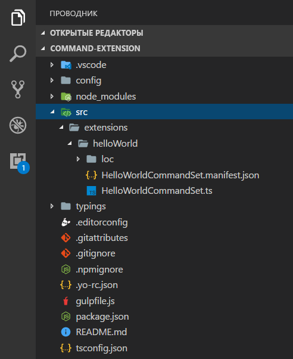
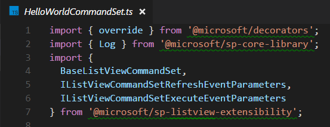
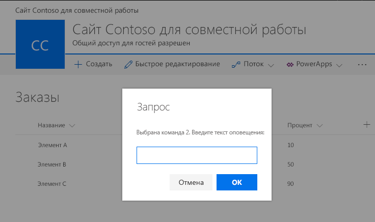
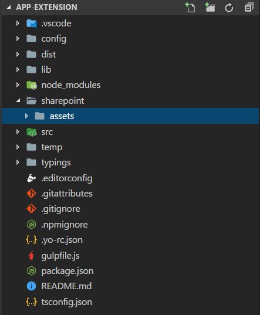
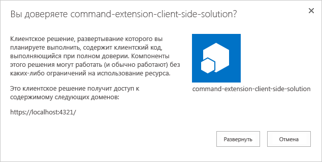
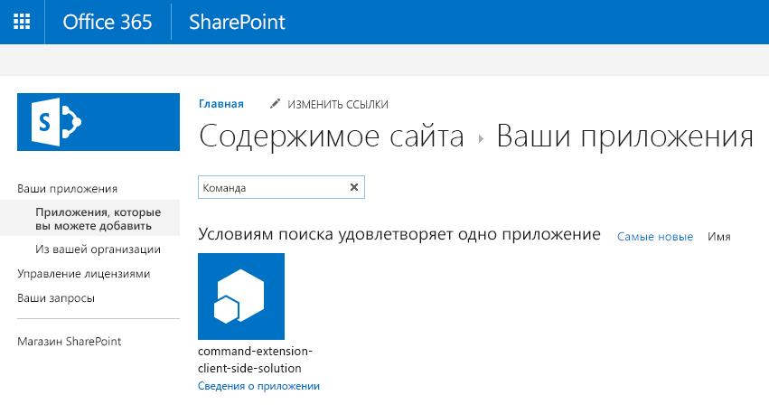
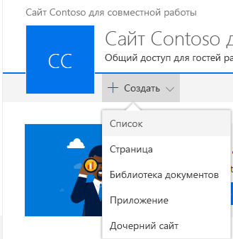

# <a name="build-your-first-listview-command-set-extension"></a>Создание первого расширения с набором команд ListView

>**Примечание.** Расширения для платформы SharePoint Framework находятся на этапе тестирования и могут меняться. В настоящее время расширения SharePoint Framework невозможно использовать в рабочих средах.

Расширения — это клиентские компоненты, которые запускаются в контексте страницы SharePoint. Расширения можно развертывать в SharePoint Online, а для их создания можно использовать современные инструменты и библиотеки JavaScript.

>**Примечание.** Прежде чем выполнять действия, описанные в этой статье, [настройте среду разработки](../../set-up-your-development-environment). Обратите внимание, что в настоящее время расширения доступны **ТОЛЬКО** в клиентах разработчиков приложений для Office 365.

>**Примечание.** В настоящее время отладку расширения с набором команд ListView можно выполнять только с помощью современного интерфейса на классических сайтах SharePoint. Убедитесь, что вы используете для тестирования классический сайт группы с современным интерфейсом списков.

## <a name="create-an-extension-project"></a>Создание проекта расширения
Создайте каталог проекта в любом расположении.

```
md command-extension
```

Перейдите к каталогу проекта.

```
cd command-extension
```

Создайте расширение HelloWorld, запустив генератор Yeoman для SharePoint.

```
yo @microsoft/sharepoint
```

Когда появится запрос, выполните указанные ниже действия.

* Оставьте значение по умолчанию (**command-extension**) для имени решения и нажмите клавишу **ВВОД**.
* Выберите для создаваемого клиентского компонента тип **Extension (Preview)**. 
* Выберите для создаваемого расширения тип **ListView Command Set (Preview)**.

Далее вам потребуется указать определенные сведения о расширении.

* Оставьте значение по умолчанию (**HelloWorld**) для имени решения и нажмите клавишу **ВВОД**.
* Оставьте значение по умолчанию (**HelloWorld description**) для описания решения и нажмите клавишу **ВВОД**.


После этого Yeoman установит необходимые зависимости и сформирует файлы решения, а также расширение **HelloWorld**. Это может занять несколько минут. 

После успешного формирования должно появиться следующее сообщение:


Сведения об устранении неполадок см. в статье [Известные проблемы](../basics/known-issues).

Завершив формирование решения, введите в консоли приведенную ниже команду, чтобы запустить Visual Studio Code.

```
code .
```

> Обратите внимание, что клиентское решение SharePoint создано с помощью HTML и TypeScript, поэтому для разработки расширения можно использовать любой редактор кода, который поддерживает клиентское программирование.

Обратите внимание, что стандартная структура решения аналогична структуре клиентских веб-частей. Это базовая структура решения SharePoint Framework, многие параметры которой не зависят от типа решения.



Откройте файл **HelloWorldCommandSet.manifest.json** в папке **src\extensions\helloWorld**.

В этом файле определяются тип расширения и уникальный идентификатор **id** для него. Этот идентификатор потребуется позже, при отладке и развертывании расширения в SharePoint.

Кроме того, обратите внимание на фактические определения команд в файле манифеста. Это кнопки, которые будут отображаться в соответствии с целью регистрации. В используемом по умолчанию шаблоне вы найдете две разные кнопки: *Command One* и *Command Two*.


> В настоящее время ссылки на изображения не работают надлежащим образом, если не обращаться к ним из абсолютных расположений сети CDN в манифесте. Это будет исправлено в будущих выпусках.

## <a name="coding-your-listview-command-set"></a>Написание кода набора команд ListView 
Откройте файл **HelloWorldCommandSet.ts** в папке **src\extensions\helloWorld**.

Обратите внимание, что базовый класс для набора команд ListView импортируется из пакета **sp-listview-extensibility**, который содержит код платформы SharePoint Framework, необходимый для набора команд ListView.



Поведение настраиваемых кнопок определяется в методах **onRefreshCommand()** и **OnExecute()**.

Событие **onRefreshCommand()** происходит отдельно для каждой команды (например, элемента меню), когда приложение пытается показать ее в пользовательском интерфейсе. Параметр `“event”` функции представляет сведения об отрисовываемой команде. Обработчик может использовать эти сведения, чтобы настроить заголовок или видимость, например если команда должна отображаться, только когда в представлении списка выбрано определенное количество элементов. Ниже представлена реализация по умолчанию.

```ts
  @override
  public onRefreshCommand(event: IListViewCommandSetRefreshEventParameters): void {
    event.visible = true; // assume true by default

    if (this.properties.disabledCommandIds) {
      if (this.properties.disabledCommandIds.indexOf(event.commandId) >= 0) {
        Log.info(LOG_SOURCE, 'Hiding command ' + event.commandId);
        event.visible = false;
      }
    }
  }
```
Метод **OnExecute()** определяет действия, совершаемые при выполнении команды (например, при выборе пункта меню). В стандартной реализации в зависимости от нажатой кнопки отображаются разные сообщения: 

```ts
  @override
  public onExecute(event: IListViewCommandSetExecuteEventParameters): void {
    switch (event.commandId) {
      case 'COMMAND_1':
        alert(`Clicked ${strings.Command1}`);
        break;
      case 'COMMAND_2':
        alert(`Clicked ${strings.Command2}`);
        break;
      default:
        throw new Error('Unknown command');
    }
  }
```


## <a name="debugging-your-listview-command-set-using-gulp-serve-and-query-string-parameters"></a>Отладка набора команд ListView с помощью gulp serve и параметров строки запроса
В настоящее время расширения SharePoint Framework невозможно тестировать с помощью локального рабочего места, поэтому тестировать и разрабатывать их следует непосредственно на активном сайте SharePoint Online. Однако при этом не требуется развертывать модификацию в каталоге приложений, что делает отладку простой и эффективной. 

Для начала скомпилируйте код и разместите скомпилированные файлы с локального компьютера, выполнив следующую команду:
```
gulp serve --nobrowser
```

Обратите внимание, что мы использовали параметр `--nobrowser`, так как локальная отладка расширений сейчас не поддерживается, то есть нет смысла запускать локальное рабочее место.

Когда компиляция кода завершится без ошибок, полученный манифест будет доступен по адресу *http://localhost:4321*.

Перейдите к любому списку SharePoint на сайте SharePoint Online с помощью современного интерфейса.

Так как наш набор команд ListView размещается из localhost и запущен, мы можем использовать определенные параметры запроса отладки для выполнения кода в представлении списка.

Добавьте к URL-адресу приведенные ниже параметры строки запроса. Обратите внимание, что вам потребуется обновить GUID в соответствии с идентификатором расширения с набором команд для представления списка, указанным в файле **HelloWorldCommandSet.manifest.json**.

```
?loadSpfx=true&debugManifestsFile=https://localhost:4321/temp/manifests.js&customActions={"81b6a3d7-e408-43a4-8ef1-180d0f2582cc":{"location":"ClientSideExtension.ListViewCommandSet.CommandBar"}}
```

* **loadSPFX=true:** гарантирует, что платформа SharePoint Framework загружается на странице. Для оптимальной производительности платформа обычно не загружается, если не зарегистрировано хотя бы одно расширение. Так как пока не зарегистрировано ни одного расширения, нам необходимо отдавать явную команду на загрузку платформы.
* **debugManifestsFile:** указывает, что нам требуется загрузить компоненты SPFx, предоставляемые локально. Как правило, загрузчик ищет компоненты только в каталоге приложений (для развернутого решения) и на сервере манифестов SharePoint (для системных библиотек).
* **customActions:** этот параметр запроса URL-адреса имитирует дополнительное действие. Для этого объекта *CustomAction* можно задать множество параметров, влияющих на внешний вид, удобство использования и расположение кнопки. Мы рассмотрим их позже.
    * **Key:** — GUID расширения.
    * **Location:** — расположение, в котором отображаются команды. Доступные значения:
        * **ClientSideExtension.ListViewCommandSet.ContextMenu** — контекстное меню элементов;
        * **ClientSideExtension.ListViewCommandSet.CommandBar** — меню верхнего уровня для набора команд в списке или библиотеке;
        * **ClientSideExtension.ListViewCommandSet** — контекстное меню и панель команд (соответствует параметру SPUserCustomAction.Location="CommandUI.Ribbon").
* **Properties:** — необязательный объект JSON, содержащий свойства, которые будут доступны через элемент `this.properties`.

Полный URL-адрес должен выглядеть примерно так, как показано ниже, но соответствовать URL-адресу и расположению списка.

```
contoso.sharepoint.com/Lists/Orders/AllItems.aspx?loadSpfx=true&debugManifestsFile=https://localhost:4321/temp/manifests.js&customActions={"81b6a3d7-e408-43a4-8ef1-180d0f2582cc":{"location":"ClientSideExtension.ListViewCommandSet.CommandBar"}}
```

Согласитесь на загрузку манифестов отладки, нажав кнопку **Загрузить скрипты отладки** при появлении соответствующего запроса.


Обратите внимание на две новые кнопки с подписями *Command One* и *Command Two*, доступные на панели инструментов.


## <a name="enhancing-the-listview-command-set-rendering"></a>Улучшение отрисовки набора команд ListView
Мы воспользуемся новым API диалоговых окон, позволяющим легко выводить модальные диалоговые окна с помощью кода. 

Вернитесь к консоли и выполните приведенную ниже команду, чтобы включить API диалоговых окон в наше решение.

``` 
npm install @microsoft/sp-dialog --save
```

Вернитесь к Visual Studio Code (или другому редактору, который вы используете).

Откройте файл **HelloWorldCommandSet.ts** в папке **src\extensions\helloWorld**.

Добавьте приведенный ниже оператор импорта для класса `Dialog` из `@microsoft/sp-dialog/lib/index` после имеющихся операторов импорта. 

```ts
import { Dialog } from '@microsoft/sp-dialog/lib/index';
``` 

Измените метод **onExecute** следующим образом:

```ts
  @override
  public onExecute(event: IListViewCommandSetExecuteEventParameters): void {
    switch (event.commandId) {
      case 'COMMAND_1':
        Dialog.alert(`Clicked ${strings.Command1}`);
        break;
      case 'COMMAND_2':
        Dialog.prompt(`Clicked ${strings.Command2}. Enter something to alert:`).then((value: string) => {
          Dialog.alert(value);
        });
        break;
      default:
        throw new Error('Unknown command');
    }
  }
``` 
Вернитесь к окну консоли и убедитесь, что не возникло никаких исключений. Если в localhost еще нет запущенных решений, выполните следующую команду:

```
gulp serve --nobrowser
```

Вернитесь к представлению списка и используйте те же параметры запроса, что и раньше. Идентификатор должен совпадать с идентификатором расширения, указанным в файле **HelloWorldCommandSet.manifest.json**.

Согласитесь на загрузку манифестов отладки, нажав кнопку **Загрузить скрипты отладки** при появлении соответствующего запроса.


На панели инструментов по-прежнему отображаются те же кнопки, но их поведение при нажатии изменилось. Теперь мы работаем с новым API диалоговых окон, который легко использовать с решениями даже для сложных сценариев. 



## <a name="adding-a-listview-command-set-to-a-solution-package-for-deployment"></a>Добавление набора команд ListView к пакету решения для развертывания

Вернитесь к решению в Visual Studio Code (или другом редакторе, который вы используете).

Для начала необходимо создать папку **assets**, в которую мы поместим все ресурсы платформы компонентов, используемые для подготовки структур SharePoint при установке пакета.

* Создайте папку **sharepoint** в корневой папке решения.
* Создайте папку **assets** в только что созданной папке **sharepoint**.

Структура решения должна быть примерно такой, как на следующем рисунке:



### <a name="add-an-elementsxml-file-for-sharepoint-definitions"></a>Добавление файла element.xml для определений SharePoint

Создайте в папке **sharepoint\assets** файл **elements.xml**.

Скопируйте приведенную ниже структуру XML в файл **elements.xml**. Обязательно замените значение свойства **ClientSideComponentId** на уникальный идентификатор набора команд ListView, указанный в файле **HelloWorldCommandSet.manifest.json** из папки **src\extensions\helloWorld**.

Обратите внимание, что мы используем определенное значение расположения `ClientSideExtension.ListViewCommandSet.CommandBar`, чтобы указать, что это набор команд ListView, который должен отображаться на панели команд. Мы также задаем для параметра `RegistrationId` значение **100**, а для параметра `RegistrationType` — значение **List**, чтобы автоматически связать дополнительное действие с универсальными списками.

```xml
<?xml version="1.0" encoding="utf-8"?>
<Elements xmlns="http://schemas.microsoft.com/sharepoint/">

    <CustomAction 
        Title="SPFxListViewCommandSet"
        RegistrationId="100"
        RegistrationType="List"
        Location="ClientSideExtension.ListViewCommandSet.CommandBar"
        ClientSideComponentId="5fc73e12-8085-4a4b-8743-f6d02ffe1240">

    </CustomAction>

</Elements>
```

Допустимые значения расположений, которые можно использовать с набором команд ListView:

* `ClientSideExtension.ListViewCommandSet.CommandBar` — панель инструментов списка или библиотеки;
* `ClientSideExtension.ListViewCommandSet.ContextMenu` — контекстное меню для элементов списка или библиотеки;
* `ClientSideExtension.ListViewCommandSet` — регистрация команд для панели инструментов и контекстного меню.

### <a name="ensure-that-definitions-are-taken-into-account-within-the-build-pipeline"></a>Проверка учета определений в конвейере сборки

Откройте файл **package-solution.json** из папки **config**. В файле **package-solution.json** определяются метаданные пакета, как показано в следующем фрагменте кода:

```json
{
  "solution": {
    "name": "command-extension-client-side-solution",
    "id": "dfffbe21-e422-4c0f-a302-d7d62a30c1bf",
    "version": "1.0.0.0"
  },
  "paths": {
    "zippedPackage": "solution/command-extension.sppkg"
  }
}
```

Чтобы убедиться, что новый файл **elements.xml** учитывается при упаковке решения, необходимо включить определение компонента для пакета решения. Добавим определение JSON для нужного компонента в структуру решения, как показано ниже.

```json
{
  "solution": {
    "name": "command-extension-client-side-solution",
    "id": "dfffbe21-e422-4c0f-a302-d7d62a30c1bf",
    "version": "1.0.0.0",
    "features": [{
      "title": "ListView Command Set - Deployment of custom action.",
      "description": "Deploys a custom action with ClientSideComponentId association",
      "id": "456da147-ced2-3036-b564-8dad5c1c2e34",
      "version": "1.0.0.0",
      "assets": {        
        "elementManifests": [
          "elements.xml"
        ]
      }
    }]
  },
  "paths": {
    "zippedPackage": "solution/command-extension.sppkg"
  }
}
```

## <a name="deploy-the-extension-to-sharepoint-online-and-host-javascript-from-local-host"></a>Развертывание расширения в SharePoint Online и размещение кода JavaScript с локального узла

Теперь все готово для развертывания решения на сайте SharePoint и автоматического связывания с объектом *CustomAction* на уровне сайта.

Чтобы упаковать клиентское решение, содержащее расширение, и получить базовую структуру, готовую к упаковке, введите в окне консоли приведенную ниже команду.

```
gulp bundle
```

Затем выполните следующую команду, чтобы создать пакет решения:

```
gulp package-solution
```

Эта команда создаст пакет в папке **sharepoint/solution**:

```
command-extension.sppkg
```

Далее вам потребуется развернуть созданный пакет в каталоге приложений.

Перейдите к **каталогу приложений** вашего клиента и откройте библиотеку **Приложения для SharePoint**.

Отправьте или перетащите файл `command-extension.sppkg` из папки **sharepoint/solution** в каталог приложений. В SharePoint откроется диалоговое окно с предложением доверять клиентскому решению.

Обратите внимание, что мы не обновляли URL-адреса для размещения решения в этом развертывании, чтобы URL-адрес по-прежнему указывал на `https://localhost:4321`. Нажмите кнопку **Развернуть**.



Вернитесь к консоли и убедитесь, что решение запущено. Если это не так, выполните в папке решения следующую команду:

```
gulp serve --nobrowser
```

Перейдите на тот сайт, где требуется проверить подготовку ресурсов SharePoint. Это может быть любое семейство веб-сайтов в клиенте, где развернут пакет решения.

Нажмите значок шестеренки на верхней панели навигации справа и выберите команду **Добавить приложение**, чтобы перейти к странице "Приложения".

В поле **Поиск** введите **command** и нажмите клавишу *ВВОД*, чтобы отфильтровать приложения.



Выберите приложение **command-extension-client-side-solution**, чтобы установить его на сайте. По завершении установки обновите страницу, нажав клавишу **F5**.

Когда приложение будет успешно установлено, нажмите кнопку **Создать** на панели инструментов страницы **Содержимое сайта** и выберите **Список**.



Укажите имя **Sample** и нажмите кнопку **Создать**.

Обратите внимание, что кнопки **Command One** и **Command Two** отрисовываются на панели задач в соответствии с изменениями набора команд ListView. 


