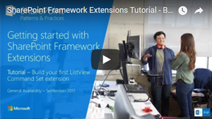
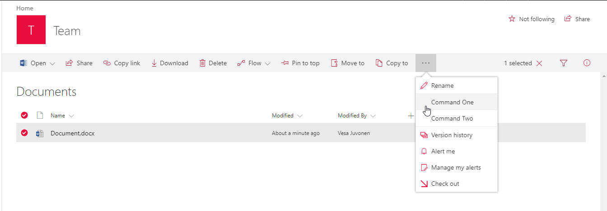

# <a name="build-your-first-listview-command-set-extension"></a><span data-ttu-id="9dcf6-103">Создание первого расширения с набором команд ListView</span><span class="sxs-lookup"><span data-stu-id="9dcf6-103">Build your first ListView Command Set extension</span></span>

<span data-ttu-id="9dcf6-104">Расширения — это клиентские компоненты, которые запускаются в контексте страницы SharePoint.</span><span class="sxs-lookup"><span data-stu-id="9dcf6-104">Extensions are client-side components that run inside the context of a SharePoint page.</span></span> <span data-ttu-id="9dcf6-105">Расширения можно развертывать в SharePoint Online, а для их создания можно использовать современные инструменты и библиотеки JavaScript.</span><span class="sxs-lookup"><span data-stu-id="9dcf6-105">Extensions can be deployed to SharePoint Online, and you can use modern JavaScript tools and libraries to build them.</span></span>

<span data-ttu-id="9dcf6-106">Эти действия также показаны в видео на [канале SharePoint PnP в YouTube](https://www.youtube.com/watch?v=iW0LQQqAY0Y&list=PLR9nK3mnD-OXtWO5AIIr7nCR3sWutACpV).</span><span class="sxs-lookup"><span data-stu-id="9dcf6-106">You can follow these steps by watching the video on the [SharePoint PnP YouTube Channel](https://www.youtube.com/watch?v=iW0LQQqAY0Y&list=PLR9nK3mnD-OXtWO5AIIr7nCR3sWutACpV).</span></span> 

<a href="https://www.youtube.com/watch?v=JBhgdSgWgdM">

</a>

## <a name="create-an-extension-project"></a><span data-ttu-id="9dcf6-107">Создание проекта расширения</span><span class="sxs-lookup"><span data-stu-id="9dcf6-107">Create an extension project</span></span>

1. <span data-ttu-id="9dcf6-108">Создайте каталог проекта в любом расположении.</span><span class="sxs-lookup"><span data-stu-id="9dcf6-108">Create a new project directory in your favorite location.</span></span>
    
    ```
    md command-extension
    ```
    
2. <span data-ttu-id="9dcf6-109">Перейдите к каталогу проекта.</span><span class="sxs-lookup"><span data-stu-id="9dcf6-109">Go to the project directory.</span></span>
    
    ```
    cd command-extension
    ```
    
3. <span data-ttu-id="9dcf6-110">Создайте расширение HelloWorld, запустив генератор Yeoman для SharePoint.</span><span class="sxs-lookup"><span data-stu-id="9dcf6-110">Create a new HelloWorld extension by running the Yeoman SharePoint Generator.</span></span>
    
    ```
    yo @microsoft/sharepoint
    ```
    
4. <span data-ttu-id="9dcf6-111">Когда появится запрос, выполните следующие действия:</span><span class="sxs-lookup"><span data-stu-id="9dcf6-111">When prompted:</span></span>

    * <span data-ttu-id="9dcf6-112">Оставьте значение по умолчанию (**command-extension**) для имени решения и нажмите клавишу ВВОД.</span><span class="sxs-lookup"><span data-stu-id="9dcf6-112">Accept the default value of **command-extension** as your solution name, and then select Enter.</span></span>
    * <span data-ttu-id="9dcf6-113">Выберите **SharePoint Online only (latest)** (Только SharePoint Online, последняя версия) и нажмите клавишу ВВОД.</span><span class="sxs-lookup"><span data-stu-id="9dcf6-113">Select **SharePoint Online only (latest)**, and select Enter.</span></span>
    * <span data-ttu-id="9dcf6-114">Выберите **Use the current folder** (Использовать текущую папку) и нажмите клавишу ВВОД.</span><span class="sxs-lookup"><span data-stu-id="9dcf6-114">Select **Use the current folder**, and select Enter.</span></span>
    * <span data-ttu-id="9dcf6-115">Выберите **N**, чтобы сделать установку расширения, выполняемую напрямую, обязательной на каждом сайте при его использовании.</span><span class="sxs-lookup"><span data-stu-id="9dcf6-115">Select **N** to require the extension to be installed on each site explicitly when it's being used.</span></span> 
    * <span data-ttu-id="9dcf6-116">Выберите **Extension** (Расширение) в качестве типа создаваемого клиентского компонента.</span><span class="sxs-lookup"><span data-stu-id="9dcf6-116">Select **Extension** as the client-side component type to be created.</span></span> 
    * <span data-ttu-id="9dcf6-117">Выберите для создаваемого расширения тип **ListView Command Set**.</span><span class="sxs-lookup"><span data-stu-id="9dcf6-117">Select **ListView Command Set** as the extension type to be created.</span></span>

5. <span data-ttu-id="9dcf6-118">Далее вам потребуется указать определенные сведения о расширении:</span><span class="sxs-lookup"><span data-stu-id="9dcf6-118">The next set of prompts ask for specific information about your extension:</span></span>

    * <span data-ttu-id="9dcf6-119">Оставьте значение по умолчанию **HelloWorld** для имени решения и нажмите клавишу ВВОД.</span><span class="sxs-lookup"><span data-stu-id="9dcf6-119">Accept the default value of **HelloWorld** as your extension name, and then select Enter.</span></span>
    * <span data-ttu-id="9dcf6-120">Оставьте значение по умолчанию **HelloWorld description** (Описание HelloWorld) для описания решения и нажмите клавишу ВВОД.</span><span class="sxs-lookup"><span data-stu-id="9dcf6-120">Accept the default value of **HelloWorld description** as your extension description, and select Enter.</span></span>

    

    <span data-ttu-id="9dcf6-122">После этого Yeoman установит необходимые зависимости и выполнит скаффолдинг файлов решения, а также расширения **HelloWorld**.</span><span class="sxs-lookup"><span data-stu-id="9dcf6-122">At this point, Yeoman installs the required dependencies and scaffolds the solution files along with the **HelloWorld** extension.</span></span> <span data-ttu-id="9dcf6-123">Это может занять несколько минут.</span><span class="sxs-lookup"><span data-stu-id="9dcf6-123">This might take a few minutes.</span></span>

    <span data-ttu-id="9dcf6-124">Когда скаффолдинг успешно закончится, появится следующее сообщение:</span><span class="sxs-lookup"><span data-stu-id="9dcf6-124">When the scaffold is complete, you should see the following message indicating a successful scaffold:</span></span>

    

    <span data-ttu-id="9dcf6-126">Сведения об устранении неполадок см. в статье [Известные проблемы](../../known-issues-and-common-questions.md).</span><span class="sxs-lookup"><span data-stu-id="9dcf6-126">For information about troubleshooting any errors, see [Known issues](../../known-issues-and-common-questions.md).</span></span>

6. <span data-ttu-id="9dcf6-127">После завершения скаффолдинга заблокируйте версию зависимостей проекта, выполнив следующую команду:</span><span class="sxs-lookup"><span data-stu-id="9dcf6-127">After the scaffolding completes, lock down the version of the project dependencies by running the following command:</span></span>

    ```sh
    npm shrinkwrap
    ```

7. <span data-ttu-id="9dcf6-128">Далее введите в консоли приведенную ниже команду, чтобы запустить Visual Studio Code.</span><span class="sxs-lookup"><span data-stu-id="9dcf6-128">Next, type the following into the console to start Visual Studio Code.</span></span>

    ```
    code .
    ```

    > [!NOTE] 
    > <span data-ttu-id="9dcf6-129">Клиентское решение SharePoint создано с помощью HTML и TypeScript, поэтому для разработки расширения можно использовать любой редактор кода, который поддерживает клиентскую разработку.</span><span class="sxs-lookup"><span data-stu-id="9dcf6-129">Because the SharePoint client-side solution is HTML/TypeScript based, you can use any code editor that supports client-side development to build your extension.</span></span>

    <span data-ttu-id="9dcf6-130">Обратите внимание, что стандартная структура решения похожа на структуру клиентских веб-частей.</span><span class="sxs-lookup"><span data-stu-id="9dcf6-130">Note how the default solution structure looks like the solution structure of client-side web parts.</span></span> <span data-ttu-id="9dcf6-131">Это основная структура решения SharePoint Framework, ее параметры конфигурации схожи для всех типов решений.</span><span class="sxs-lookup"><span data-stu-id="9dcf6-131">This is the basic SharePoint Framework solution structure, with similar configuration options across all solution types.</span></span>

    

8. <span data-ttu-id="9dcf6-133">Откройте файл **HelloWorldCommandSet.manifest.json** в папке **src\extensions\helloWorld**.</span><span class="sxs-lookup"><span data-stu-id="9dcf6-133">Open **HelloWorldCommandSet.manifest.json** in the **src\extensions\helloWorld** folder.</span></span>

    <span data-ttu-id="9dcf6-134">В этом файле определяются тип расширения и уникальный идентификатор `id` для расширения.</span><span class="sxs-lookup"><span data-stu-id="9dcf6-134">This file defines your extension type and a unique identifier `id` for your extension.</span></span> <span data-ttu-id="9dcf6-135">Этот идентификатор пригодится позже при отладке и развертывании расширения в SharePoint.</span><span class="sxs-lookup"><span data-stu-id="9dcf6-135">You need this unique identifier later when debugging and deploying your extension to SharePoint.</span></span>

    <span data-ttu-id="9dcf6-136">Обратите внимание на фактические определения команд в файле манифеста.</span><span class="sxs-lookup"><span data-stu-id="9dcf6-136">Note the actual command definitions in the manifest file.</span></span> <span data-ttu-id="9dcf6-137">Это фактические кнопки, показ которых зависит от целевого объекта регистрации.</span><span class="sxs-lookup"><span data-stu-id="9dcf6-137">These are the actual buttons that are exposed based on the registration target.</span></span> <span data-ttu-id="9dcf6-138">В шаблоне по умолчанию вы найдете две другие кнопки: **Command One** и **Command Two**.</span><span class="sxs-lookup"><span data-stu-id="9dcf6-138">In the default template, you find two different buttons: **Command One** and **Command Two**.</span></span>

    

    <span data-ttu-id="9dcf6-p106">В настоящее время ссылки на изображения не работают надлежащим образом, если не обращаться к ним из абсолютных расположений сети CDN в манифесте. Это будет исправлено в будущих выпусках.</span><span class="sxs-lookup"><span data-stu-id="9dcf6-p106">Currently, images are not properly referenced unless you are referring to them from absolute locations in a CDN within your manifest. This will be improved in future releases.</span></span>

## <a name="code-your-listview-command-set"></a><span data-ttu-id="9dcf6-142">Написание кода ListView Command Set</span><span class="sxs-lookup"><span data-stu-id="9dcf6-142">Code your ListView Command Set</span></span> 

<span data-ttu-id="9dcf6-143">Откройте файл **HelloWorldCommandSet.ts** в папке **src\extensions\helloWorld**.</span><span class="sxs-lookup"><span data-stu-id="9dcf6-143">Open the **HelloWorldCommandSet.ts** file in the **src\extensions\helloWorld** folder.</span></span>

<span data-ttu-id="9dcf6-144">Обратите внимание на то, что базовый класс для ListView Command Set импортируется из пакета **sp-listview-extensibility**, который содержит код SharePoint Framework, необходимый для ListView Command Set.</span><span class="sxs-lookup"><span data-stu-id="9dcf6-144">Notice that the base class for the ListView Command Set is imported from the **sp-listview-extensibility** package, which contains SharePoint Framework code required by the ListView Command Set.</span></span>

```typescript
import { override } from '@microsoft/decorators';
import { Log } from '@microsoft/sp-core-library';
import {
  BaseListViewCommandSet,
  Command,
  IListViewCommandSetListViewUpdatedParameters,
  IListViewCommandSetExecuteEventParameters
} from '@microsoft/sp-listview-extensibility';
import { Dialog } from '@microsoft/sp-dialog';
```

<span data-ttu-id="9dcf6-145">Поведение специальных кнопок определяется в методах **onListViewUpdated()** и **OnExecute()**.</span><span class="sxs-lookup"><span data-stu-id="9dcf6-145">The behavior for your custom buttons is contained in the **onListViewUpdated()** and **OnExecute()** methods.</span></span>

<span data-ttu-id="9dcf6-146">Событие **onListViewUpdated()** происходит отдельно для каждой команды (например, элемента меню) всякий раз, когда ListView меняется, и пользовательский интерфейс необходимо отрисовывать повторно.</span><span class="sxs-lookup"><span data-stu-id="9dcf6-146">The **onListViewUpdated()** event occurs separately for each command (for example, a menu item) whenever a change happens in the ListView, and the UI needs to be re-rendered.</span></span> <span data-ttu-id="9dcf6-147">Параметр функции `event` представляет сведения о команде, которая отрисовывается.</span><span class="sxs-lookup"><span data-stu-id="9dcf6-147">The `event` function parameter represents information about the command being rendered.</span></span> <span data-ttu-id="9dcf6-148">Обработчик может использовать эти сведения для настройки названия или видимости (например, если команда должна отображаться, только когда определенное количество элементов выбрано в представлении списка).</span><span class="sxs-lookup"><span data-stu-id="9dcf6-148">The handler can use this information to customize the title or adjust the visibility, for example, if a command should only be shown when a certain number of items are selected in the list view.</span></span> <span data-ttu-id="9dcf6-149">Такова реализация по умолчанию.</span><span class="sxs-lookup"><span data-stu-id="9dcf6-149">This is the default implementation.</span></span>

<span data-ttu-id="9dcf6-150">При использовании метода `tryGetCommand` вы получаете объект Command, который представляет собой команду, отображаемую в пользовательском интерфейсе.</span><span class="sxs-lookup"><span data-stu-id="9dcf6-150">When using the method `tryGetCommand`, you get a Command object, which is a representation of the command that shows in the UI.</span></span> <span data-ttu-id="9dcf6-151">Вы можете изменить его значения, такие как `title` или `visible`, чтобы изменить элемент пользовательского интерфейса.</span><span class="sxs-lookup"><span data-stu-id="9dcf6-151">You can modify its values, such as `title`, or `visible`, to modify the UI element.</span></span> <span data-ttu-id="9dcf6-152">SPFx использует эту информацию при повторной отрисовке команд.</span><span class="sxs-lookup"><span data-stu-id="9dcf6-152">SPFx uses this information when re-rendering the commands.</span></span> <span data-ttu-id="9dcf6-153">Состояние объектов, полученное при последней отрисовке, сохраняется. То есть если команде присвоено значение `visible = false`, она будет оставаться невидимой, пока ей снова не будет задано значение `visible = true`.</span><span class="sxs-lookup"><span data-stu-id="9dcf6-153">These objects keep the state from the last render, so if a command is set to `visible = false`, it remains invisible until it is set back to `visible = true`.</span></span>

```typescript
  @override
  public onListViewUpdated(event: IListViewCommandSetListViewUpdatedParameters): void {
    const compareOneCommand: Command = this.tryGetCommand('COMMAND_1');
    if (compareOneCommand) {
      // This command should be hidden unless exactly one row is selected.
      compareOneCommand.visible = event.selectedRows.length === 1;
    }
  }
```

<span data-ttu-id="9dcf6-154">Метод **OnExecute()** определяет то, что происходит при выполнении команды (например, выбирается элемент меню).</span><span class="sxs-lookup"><span data-stu-id="9dcf6-154">The **OnExecute()** method defines what happens when a command is executed (for example, the menu item is selected).</span></span> <span data-ttu-id="9dcf6-155">В стандартной реализации отображаются разные сообщения в зависимости от того, какая кнопка нажата.</span><span class="sxs-lookup"><span data-stu-id="9dcf6-155">In the default implementation, different messages are shown based on which button was selected.</span></span> 


```typescript
  @override
  public onExecute(event: IListViewCommandSetExecuteEventParameters): void {
    switch (event.itemId) {
      case 'COMMAND_1':
        Dialog.alert(`${this.properties.sampleTextOne}`);
        break;
      case 'COMMAND_2':
        Dialog.alert(`${this.properties.sampleTextTwo}`);
        break;
      default:
        throw new Error('Unknown command');
    }
  }
```


## <a name="debug-your-listview-command-set"></a><span data-ttu-id="9dcf6-156">Отладка набора команд ListView</span><span class="sxs-lookup"><span data-stu-id="9dcf6-156">Debug your ListView Command Set</span></span>

<span data-ttu-id="9dcf6-157">В настоящее время для проверки расширений SharePoint Framework нельзя использовать локальную версию Workbench.</span><span class="sxs-lookup"><span data-stu-id="9dcf6-157">You cannot currently use the local Workbench to test SharePoint Framework Extensions.</span></span> <span data-ttu-id="9dcf6-158">Их необходимо проверять и разрабатывать непосредственно на активном сайте SharePoint Online.</span><span class="sxs-lookup"><span data-stu-id="9dcf6-158">You'll need to test and develop them directly against a live SharePoint Online site.</span></span> <span data-ttu-id="9dcf6-159">Для этого не нужно развертывать настройку в каталоге приложений, что делает процесс отладки простым и эффективным.</span><span class="sxs-lookup"><span data-stu-id="9dcf6-159">You don't have to deploy your customization to the app catalog to do this, which makes the debugging experience simple and efficient.</span></span> 

1. <span data-ttu-id="9dcf6-160">Скомпилируйте код и разместите скомпилированные файлы на локальном компьютере, выполнив следующую команду:</span><span class="sxs-lookup"><span data-stu-id="9dcf6-160">Compile your code and host the compiled files from the local machine by running this command:</span></span>

    ```
    gulp serve --nobrowser
    ```

    <span data-ttu-id="9dcf6-161">Параметр `--nobrowser` используется, так как вам не нужно запускать локальную версию Workbench (локальная отладка расширений невозможна).</span><span class="sxs-lookup"><span data-stu-id="9dcf6-161">You use the `--nobrowser` option because you don't need to launch the local Workbench, since you can't debug extensions locally.</span></span>

    <span data-ttu-id="9dcf6-162">Когда компиляция кода завершится без ошибок, полученный манифест будет доступен по адресу https://localhost:4321.</span><span class="sxs-lookup"><span data-stu-id="9dcf6-162">When the code compiles without errors, it serves the resulting manifest from https://localhost:4321.</span></span>

2. <span data-ttu-id="9dcf6-163">Перейдите к любому списку SharePoint на сайте SharePoint Online с помощью современного интерфейса.</span><span class="sxs-lookup"><span data-stu-id="9dcf6-163">Go to any SharePoint list in your SharePoint Online site by using the modern experience.</span></span>
    
    <span data-ttu-id="9dcf6-164">Так как расширение ListView Command Set размещено с использованием localhost и запущено, с помощью определенных параметров запроса отладки мы можем выполнить код в представлении списка.</span><span class="sxs-lookup"><span data-stu-id="9dcf6-164">Because our ListView Command Set is hosted from localhost and is running, we can use specific debug query parameters to execute the code in the list view.</span></span>
    
3. <span data-ttu-id="9dcf6-165">Добавьте в URL-адрес приведенные ниже параметры строки запроса.</span><span class="sxs-lookup"><span data-stu-id="9dcf6-165">Append the following query string parameters to the URL.</span></span> <span data-ttu-id="9dcf6-166">Обратите внимание, что GUID необходимо обновить в соответствии с идентификатором набора команд ListView, указанным в файле **HelloWorldCommandSet.manifest.json**.</span><span class="sxs-lookup"><span data-stu-id="9dcf6-166">Notice that you need to update the GUID to match the ID of your ListView Command Set Extension available in the **HelloWorldCommandSet.manifest.json** file.</span></span> <span data-ttu-id="9dcf6-167">Дополнительные сведения см. в разделе [Подробнее о параметрах запроса URL-адреса](#more-details-about-the-url-query-parameters).</span><span class="sxs-lookup"><span data-stu-id="9dcf6-167">For more information, see [More details about the URL query parameters](#more-details-about-the-url-query-parameters).</span></span>
    
    ```
    ?loadSpfx=true&debugManifestsFile=https://localhost:4321/temp/manifests.js&customActions={"a8047e2f-30d5-40fc-b880-b2890c7c16d6":{"location":"ClientSideExtension.ListViewCommandSet.CommandBar","properties":{"sampleTextOne":"One item is selected in the list.","sampleTextTwo":"This command is always visible."}}}
    ```

    <span data-ttu-id="9dcf6-168">Полный URL-адрес должен выглядеть примерно так, как показано ниже (соответствовать URL-адресу клиента и расположению списка).</span><span class="sxs-lookup"><span data-stu-id="9dcf6-168">The full URL should look similar to the following, depending on your tenant URL and the location of the list.</span></span>

    ```
    contoso.sharepoint.com/Lists/Orders/AllItems.aspx?loadSpfx=true&debugManifestsFile=https://localhost:4321/temp/manifests.js&customActions={"a8047e2f-30d5-40fc-b880-b2890c7c16d6":{"location":"ClientSideExtension.ListViewCommandSet.CommandBar","properties":{"sampleTextOne":"One item is selected in the list.","sampleTextTwo":"This command is always visible."}}}
    ```

4. <span data-ttu-id="9dcf6-169">Согласитесь на загрузку манифестов отладки, выбрав **Загрузить скрипты отладки** при появлении соответствующего запроса.</span><span class="sxs-lookup"><span data-stu-id="9dcf6-169">Accept the loading of debug manifests by selecting **Load debug scripts** when prompted.</span></span>
    
    
    
5. <span data-ttu-id="9dcf6-171">Обратите внимание на то, что на панели инструментов появилась новая кнопка — **Command Two** (Команда вторая).</span><span class="sxs-lookup"><span data-stu-id="9dcf6-171">Notice the new **Command Two** button available in the toolbar.</span></span> <span data-ttu-id="9dcf6-172">Нажмите эту кнопку, чтобы увидеть текст, предоставленный как свойство для свойства `sampleTextTwo`.</span><span class="sxs-lookup"><span data-stu-id="9dcf6-172">Select that button to see the text provided as property for the `sampleTextTwo` property.</span></span>

    

6. <span data-ttu-id="9dcf6-174">Код не позволяет отображаться кнопке **Command One** (Команда первая), пока в библиотеке документов не будет выбрана одна строка.</span><span class="sxs-lookup"><span data-stu-id="9dcf6-174">The **Command One** button is not visible based on the code, until one row is selected in the document library.</span></span> <span data-ttu-id="9dcf6-175">Отправьте документ в библиотеку или создайте его там и подтвердите, что вторая кнопка видима.</span><span class="sxs-lookup"><span data-stu-id="9dcf6-175">Upload or create a document to the library and confirm that the second button is visible.</span></span>

    

7. <span data-ttu-id="9dcf6-177">Нажмите кнопку **Command Two** (Команда вторая), чтобы увидеть, как работает элемент управления диалоговым окном, который используется в выходных данных, по умолчанию получаемых при скаффолдинге решения, когда в качестве типа расширения выбирается ListView Command Set.</span><span class="sxs-lookup"><span data-stu-id="9dcf6-177">Select **Command Two** to see how the dialog control works, which is used in the default output from the solution scaffolding when the ListView Command Set is selected as the extension type.</span></span> 

    


### <a name="more-details-about-the-url-query-parameters"></a><span data-ttu-id="9dcf6-179">Подробнее о параметрах запроса URL-адреса</span><span class="sxs-lookup"><span data-stu-id="9dcf6-179">More details about the URL query parameters</span></span>

- <span data-ttu-id="9dcf6-180">**loadSPFX=true** гарантирует загрузку SharePoint Framework на странице.</span><span class="sxs-lookup"><span data-stu-id="9dcf6-180">**loadSPFX=true** ensures that the SharePoint Framework is loaded on the page.</span></span> <span data-ttu-id="9dcf6-181">Из соображений производительности платформа обычно загружается, только если зарегистрировано хотя бы одно расширение.</span><span class="sxs-lookup"><span data-stu-id="9dcf6-181">For performance reasons, the framework is not normally loaded unless at least one extension is registered.</span></span> <span data-ttu-id="9dcf6-182">Так как компоненты еще не зарегистрированы, платформу нужно загрузить напрямую.</span><span class="sxs-lookup"><span data-stu-id="9dcf6-182">Because no components are registered yet, we must explicitly load the framework.</span></span>
- <span data-ttu-id="9dcf6-183">**debugManifestsFile** указывает, что нужно загрузить компоненты SPFx, сохраненные локально.</span><span class="sxs-lookup"><span data-stu-id="9dcf6-183">**debugManifestsFile** specifies that we want to load SPFx components that are being locally served.</span></span> <span data-ttu-id="9dcf6-184">Загрузчик ищет компоненты только в каталоге приложений (для развернутого решения) и на сервере манифестов SharePoint (для системных библиотек).</span><span class="sxs-lookup"><span data-stu-id="9dcf6-184">The loader only looks for components in the App Catalog (for your deployed solution) and the SharePoint manifest server (for the system libraries).</span></span>
- <span data-ttu-id="9dcf6-185">**customActions** имитирует дополнительное действие.</span><span class="sxs-lookup"><span data-stu-id="9dcf6-185">**customActions** simulates a custom action.</span></span> <span data-ttu-id="9dcf6-186">Вы можете задать много свойств для этого объекта `CustomAction`, влияющих на внешний вид и расположение кнопки. Мы расскажем о них позже.</span><span class="sxs-lookup"><span data-stu-id="9dcf6-186">You can set many properties on this `CustomAction` object that affect the look, feel, and location of your button; we’ll cover them all later.</span></span>
    - <span data-ttu-id="9dcf6-187">**Key** — GUID расширения.</span><span class="sxs-lookup"><span data-stu-id="9dcf6-187">**Key**: GUID of the extension.</span></span>
    - <span data-ttu-id="9dcf6-188">**Location** — расположение, в котором отображаются команды.</span><span class="sxs-lookup"><span data-stu-id="9dcf6-188">**Location**: Where the commands are displayed.</span></span> <span data-ttu-id="9dcf6-189">Возможные значения:</span><span class="sxs-lookup"><span data-stu-id="9dcf6-189">The possible values are:</span></span>
        - <span data-ttu-id="9dcf6-190">**ClientSideExtension.ListViewCommandSet.ContextMenu** — контекстное меню элементов.</span><span class="sxs-lookup"><span data-stu-id="9dcf6-190">**ClientSideExtension.ListViewCommandSet.ContextMenu**:  The context menu of the item(s).</span></span>
        - <span data-ttu-id="9dcf6-191">**ClientSideExtension.ListViewCommandSet.CommandBar** — меню верхнего уровня для набора команд в списке или библиотеке.</span><span class="sxs-lookup"><span data-stu-id="9dcf6-191">**ClientSideExtension.ListViewCommandSet.CommandBar**: The top command set menu in a list or library.</span></span>
        - <span data-ttu-id="9dcf6-192">**ClientSideExtension.ListViewCommandSet** — контекстное меню и панель команд (соответствует параметру SPUserCustomAction.Location="CommandUI.Ribbon").</span><span class="sxs-lookup"><span data-stu-id="9dcf6-192">**ClientSideExtension.ListViewCommandSet**: Both the context menu and the command bar (corresponds to SPUserCustomAction.Location="CommandUI.Ribbon").</span></span>
    - <span data-ttu-id="9dcf6-193">**Properties** — необязательный объект JSON, содержащий свойства, которые доступны через элемент `this.properties`.</span><span class="sxs-lookup"><span data-stu-id="9dcf6-193">**Properties**: An optional JSON object containing properties that are available via the `this.properties` member.</span></span>

<br/>

## <a name="enhance-the-listview-command-set-rendering"></a><span data-ttu-id="9dcf6-194">Улучшение отрисовки ListView Command Set</span><span class="sxs-lookup"><span data-stu-id="9dcf6-194">Enhance the ListView Command Set rendering</span></span>

<span data-ttu-id="9dcf6-195">Решение по умолчанию использует новый API диалоговых окон, позволяющий легко выводить модальные диалоговые окна с помощью кода.</span><span class="sxs-lookup"><span data-stu-id="9dcf6-195">The default solution takes advantage of a new Dialog API, which can be used to show modal dialogs easily from your code.</span></span> <span data-ttu-id="9dcf6-196">Далее мы слегка изменим интерфейс по умолчанию, чтобы показать варианты использования API диалоговых окон.</span><span class="sxs-lookup"><span data-stu-id="9dcf6-196">In the following steps, we'll slightly modify the default experience to demonstrate Dialog API use cases.</span></span>

1. <span data-ttu-id="9dcf6-197">Вернитесь к консоли и выполните приведенную ниже команду, чтобы включить API диалоговых окон в наше решение.</span><span class="sxs-lookup"><span data-stu-id="9dcf6-197">Return to the console, and execute the following command to include the Dialog API in our solution.</span></span>

2. <span data-ttu-id="9dcf6-198">Вернитесь к Visual Studio Code (или другому редактору, который вы используете).</span><span class="sxs-lookup"><span data-stu-id="9dcf6-198">Return to Visual Studio Code (or your preferred editor).</span></span>

3. <span data-ttu-id="9dcf6-199">Откройте файл **HelloWorldCommandSet.ts** в папке **src\extensions\helloWorld**.</span><span class="sxs-lookup"><span data-stu-id="9dcf6-199">Open **HelloWorldCommandSet.ts** from the **src\extensions\helloWorld** folder.</span></span>

4. <span data-ttu-id="9dcf6-200">Добавьте приведенный ниже оператор импорта для класса `Dialog` из `@microsoft/sp-dialog` после имеющихся операторов импорта.</span><span class="sxs-lookup"><span data-stu-id="9dcf6-200">Add the following import statement for the `Dialog` class from `@microsoft/sp-dialog` after the existing import statements.</span></span> 

5. <span data-ttu-id="9dcf6-201">Измените метод **onExecute** следующим образом:</span><span class="sxs-lookup"><span data-stu-id="9dcf6-201">Update the **onExecute** method as follows:</span></span>
    
    ```typescript
      @override
      public onExecute(event: IListViewCommandSetExecuteEventParameters): void {
        switch (event.commandId) {
          case 'COMMAND_1':
            Dialog.alert(`Clicked ${strings.Command1}`);
            break;
          case 'COMMAND_2':
            Dialog.prompt(`Clicked ${strings.Command2}. Enter something to alert:`).then((value: string) => {
              Dialog.alert(value);
            });
            break;
          default:
            throw new Error('Unknown command');
        }
      }
    ``` 
    
6. <span data-ttu-id="9dcf6-202">В окне консоли не должно быть исключений.</span><span class="sxs-lookup"><span data-stu-id="9dcf6-202">In your console window, ensure that you do not have any exceptions.</span></span> <span data-ttu-id="9dcf6-203">Если в localhost нет запущенного решения, выполните следующую команду:</span><span class="sxs-lookup"><span data-stu-id="9dcf6-203">If you do not already have the solution running in localhost, execute the following command:</span></span>

    ```
    gulp serve --nobrowser
    ```

7. <span data-ttu-id="9dcf6-204">В представлении списка укажите те же параметры запроса, что и раньше. Идентификатор должен совпадать с идентификатором расширения, указанным в файле **HelloWorldCommandSet.manifest.json**.</span><span class="sxs-lookup"><span data-stu-id="9dcf6-204">In the list view, use the same query parameters used previously with the ID matching your extension identifier available in the **HelloWorldCommandSet.manifest.json** file.</span></span>

8. <span data-ttu-id="9dcf6-205">Согласитесь на загрузку манифестов отладки, выбрав **Загрузить скрипты отладки** при появлении соответствующего запроса.</span><span class="sxs-lookup"><span data-stu-id="9dcf6-205">Accept the loading of debug manifests by selecting **Load debug scripts** when prompted.</span></span>

    

    <span data-ttu-id="9dcf6-207">На панели инструментов есть те же кнопки, но вы заметите, что если нажимать их по отдельности, их поведение меняется.</span><span class="sxs-lookup"><span data-stu-id="9dcf6-207">We still have the same buttons in the toolbar, but you'll notice they behave differently if you select them one-by-one.</span></span> <span data-ttu-id="9dcf6-208">Теперь мы используем новый API диалоговых окон, который можно легко применять к решениям даже в случае самых сложных сценариев.</span><span class="sxs-lookup"><span data-stu-id="9dcf6-208">Now we are using the new Dialog API, which can be easily used with your solutions, even for complex scenarios.</span></span> 

    


## <a name="add-a-listview-command-set-to-a-solution-package-for-deployment"></a><span data-ttu-id="9dcf6-210">Добавление набора команд ListView в пакет решения для развертывания</span><span class="sxs-lookup"><span data-stu-id="9dcf6-210">Add a ListView Command Set to a solution package for deployment</span></span>

1. <span data-ttu-id="9dcf6-211">Вернитесь к решению в Visual Studio Code (или другом редакторе, который вы используете).</span><span class="sxs-lookup"><span data-stu-id="9dcf6-211">Return to your solution in Visual Studio Code (or to your preferred editor).</span></span>

2. <span data-ttu-id="9dcf6-212">Разверните папку **sharepoint** и вложенную папку **assets** в корне решения для просмотра существующего файла **elements.xml**.</span><span class="sxs-lookup"><span data-stu-id="9dcf6-212">Extend the **sharepoint** folder and **assets** subfolder in the root of the solution to see the existing **elements.xml** file.</span></span> 
    
    
    
### <a name="review-the-elementsxml-file"></a><span data-ttu-id="9dcf6-214">Просмотрите файл elements.xml</span><span class="sxs-lookup"><span data-stu-id="9dcf6-214">Review the elements.xml file</span></span> 

<span data-ttu-id="9dcf6-215">Откройте файл **elements.xml** в папке **sharepoint\assets**.</span><span class="sxs-lookup"><span data-stu-id="9dcf6-215">Open the **elements.xml** file inside the **sharepoint\assets** folder.</span></span>

<span data-ttu-id="9dcf6-216">Обратите внимание на указанную ниже структуру XML в файле **elements.xml**.</span><span class="sxs-lookup"><span data-stu-id="9dcf6-216">Note the following XML structure in **elements.xml**.</span></span> <span data-ttu-id="9dcf6-217">Свойство **ClientSideComponentId** автоматически обновлено в соответствии с уникальным идентификатором ListView Command Set в файле **HelloWorldCommandSet.manifest.json** папки **src\extensions\helloWorld**.</span><span class="sxs-lookup"><span data-stu-id="9dcf6-217">The **ClientSideComponentId** property has been automatically updated to the unique ID of your ListView Command Set available in the **HelloWorldCommandSet.manifest.json** file in the **src\extensions\helloWorld** folder.</span></span>

<span data-ttu-id="9dcf6-218">Обратите внимание на то, что мы используем определенное значение расположения `ClientSideExtension.ListViewCommandSet.CommandBar`, чтобы определить, что это расширение ListView Command Set, которое должно отображаться на панели команд.</span><span class="sxs-lookup"><span data-stu-id="9dcf6-218">Notice that we use a specific location value of `ClientSideExtension.ListViewCommandSet.CommandBar` to define that this is a ListView Command Set and it should be displayed in the command bar.</span></span> <span data-ttu-id="9dcf6-219">Мы также определяем `RegistrationId` как **100** и `RegistrationType` как **List**, чтобы сопоставить это дополнительное действие автоматически с общими списками.</span><span class="sxs-lookup"><span data-stu-id="9dcf6-219">We also define the `RegistrationId` as **100** and the `RegistrationType` as **List** to associate this custom action automatically with generic lists.</span></span> <span data-ttu-id="9dcf6-220">`ClientSideComponentProperties` позволяет создавать конфигурации для определенных экземпляров.</span><span class="sxs-lookup"><span data-stu-id="9dcf6-220">`ClientSideComponentProperties` can be used to provide instance specific configurations.</span></span> <span data-ttu-id="9dcf6-221">В этом случае мы используем свойства по умолчанию — *sampleTextOne* и *sampleTextTwo*.</span><span class="sxs-lookup"><span data-stu-id="9dcf6-221">In this case, we are using default properties called *sampleTextOne* and *sampleTextTwo*.</span></span>

```xml
<?xml version="1.0" encoding="utf-8"?>
<Elements xmlns="http://schemas.microsoft.com/sharepoint/">

    <CustomAction 
        Title="SPFxListViewCommandSet"
        RegistrationId="100"
        RegistrationType="List"
        Location="ClientSideExtension.ListViewCommandSet.CommandBar"
        ClientSideComponentId="5fc73e12-8085-4a4b-8743-f6d02ffe1240"
        ClientSideComponentProperties="{&quot;sampleTextOne&quot;:&quot;One item is selected in the list.&quot;, &quot;sampleTextTwo&quot;:&quot;This command is always visible.&quot;}">

    </CustomAction>

</Elements>
```

<span data-ttu-id="9dcf6-222">Допустимые значения расположений, которые можно использовать с набором команд ListView:</span><span class="sxs-lookup"><span data-stu-id="9dcf6-222">Possible location values that can be used with a ListView Command Set:</span></span>

* <span data-ttu-id="9dcf6-223">`ClientSideExtension.ListViewCommandSet.CommandBar` — панель инструментов списка или библиотеки;</span><span class="sxs-lookup"><span data-stu-id="9dcf6-223">`ClientSideExtension.ListViewCommandSet.CommandBar` - Toolbar of the list or library</span></span>
* <span data-ttu-id="9dcf6-224">`ClientSideExtension.ListViewCommandSet.ContextMenu` — контекстное меню для элементов списка или библиотеки;</span><span class="sxs-lookup"><span data-stu-id="9dcf6-224">`ClientSideExtension.ListViewCommandSet.ContextMenu` - Context menu for list or library items</span></span>
* <span data-ttu-id="9dcf6-225">`ClientSideExtension.ListViewCommandSet` — регистрация команд для панели инструментов и контекстного меню.</span><span class="sxs-lookup"><span data-stu-id="9dcf6-225">`ClientSideExtension.ListViewCommandSet` - Register commands to both the toolbar and to the context menu</span></span>

### <a name="ensure-that-definitions-are-taken-into-account-within-the-build-pipeline"></a><span data-ttu-id="9dcf6-226">Сделайте так, чтобы определения учитывались при упаковке</span><span class="sxs-lookup"><span data-stu-id="9dcf6-226">Ensure that definitions are taken into account within the build pipeline</span></span>

<span data-ttu-id="9dcf6-227">Откройте файл **package-solution.json** в папке **config**.</span><span class="sxs-lookup"><span data-stu-id="9dcf6-227">Open **package-solution.json** from the **config** folder.</span></span> <span data-ttu-id="9dcf6-228">В файле **package-solution.json** определяются метаданные пакета, как показано в следующем фрагменте кода.</span><span class="sxs-lookup"><span data-stu-id="9dcf6-228">The **package-solution.json** file defines the package metadata as shown in the following code.</span></span> <span data-ttu-id="9dcf6-229">Чтобы при упаковке решения учитывался файл **element.xml**, нужна конфигурация скаффолдинга по умолчанию для определения функций платформы функций для пакета решения.</span><span class="sxs-lookup"><span data-stu-id="9dcf6-229">To ensure that the **element.xml** file is taken into account while the solution is being packaged, default scaffolding added needed configuration to define a feature framework feature definition for the solution package.</span></span>

```json
{
  "$schema": "https://dev.office.com/json-schemas/spfx-build/package-solution.schema.json",
  "solution": {
    "name": "command-extension-client-side-solution",
    "id": "690ae189-a4fc-4b98-8f28-d4ec17448b7a",
    "version": "1.0.0.0",
    "features": [
      {
        "title": "Application Extension - Deployment of custom action.",
        "description": "Deploys a custom action with ClientSideComponentId association",
        "id": "e91d5532-3519-4b50-b55e-b142fc74cd8a",
        "version": "1.0.0.0",
        "assets": {
          "elementManifests": [
            "elements.xml"
          ]
        }
      }
    ]
  },
  "paths": {
    "zippedPackage": "solution/command-extension.sppkg"
  }
}
```

## <a name="deploy-the-extension-to-sharepoint-online-and-host-javascript-from-local-host"></a><span data-ttu-id="9dcf6-230">Развертывание расширения в SharePoint Online и локальное размещение кода JavaScript</span><span class="sxs-lookup"><span data-stu-id="9dcf6-230">Deploy the extension to SharePoint Online and host JavaScript from local host</span></span>

<span data-ttu-id="9dcf6-231">Теперь мы готовы развернуть решение на сайте SharePoint и автоматически сопоставить действие `CustomAction` на уровне сайта.</span><span class="sxs-lookup"><span data-stu-id="9dcf6-231">Now you are ready to deploy the solution to a SharePoint site and have the `CustomAction` automatically associated on the site level.</span></span>

1. <span data-ttu-id="9dcf6-232">Чтобы упаковать клиентское решение, содержащее расширение, и получить базовую структуру, готовую к упаковке, в окне консоли введите указанную ниже команду.</span><span class="sxs-lookup"><span data-stu-id="9dcf6-232">In the console window, enter the following command to package your client-side solution that contains the extension so that we get the basic structure ready for packaging:</span></span>
    
    ```
    gulp bundle
    ```
    
2. <span data-ttu-id="9dcf6-233">Затем выполните следующую команду, чтобы создать пакет решения:</span><span class="sxs-lookup"><span data-stu-id="9dcf6-233">Execute the following command so that the solution package is created:</span></span>
    
    ```
    gulp package-solution
    ```
    
    <span data-ttu-id="9dcf6-234">Эта команда создает пакет в папке **sharepoint/solution**:</span><span class="sxs-lookup"><span data-stu-id="9dcf6-234">The command creates the package in the **sharepoint/solution** folder:</span></span>
    
    ```
    command-extension.sppkg
    ```
    
3. <span data-ttu-id="9dcf6-235">Разверните пакет, созданный в каталоге приложений.</span><span class="sxs-lookup"><span data-stu-id="9dcf6-235">Deploy the package that was generated to the App Catalog.</span></span> <span data-ttu-id="9dcf6-236">Для этого перейдите в **каталог приложений** клиента и откройте библиотеку **Приложения для SharePoint**.</span><span class="sxs-lookup"><span data-stu-id="9dcf6-236">To do this, go to your tenant's **App Catalog** and open the **Apps for SharePoint** library.</span></span>

4. <span data-ttu-id="9dcf6-237">Отправьте или перетащите файл `command-extension.sppkg` из папки **sharepoint/solution** в каталог приложений.</span><span class="sxs-lookup"><span data-stu-id="9dcf6-237">Upload or drag-and-drop the `command-extension.sppkg` located in the **sharepoint/solution** folder to the App Catalog.</span></span> <span data-ttu-id="9dcf6-238">В SharePoint откроется диалоговое окно с запросом на подтверждение доверия клиентскому решению.</span><span class="sxs-lookup"><span data-stu-id="9dcf6-238">SharePoint displays a dialog and asks you to trust the client-side solution.</span></span>

    <span data-ttu-id="9dcf6-239">Обратите внимание, что мы не изменяли URL-адреса для размещения решения в этом развертывании, поэтому по-прежнему используется URL-адрес `https://localhost:4321`.</span><span class="sxs-lookup"><span data-stu-id="9dcf6-239">Note that we did not update the URLs for hosting the solution for this deployment, so the URL is still pointing to `https://localhost:4321`.</span></span> 
    
5. <span data-ttu-id="9dcf6-240">Нажмите кнопку **Развернуть**.</span><span class="sxs-lookup"><span data-stu-id="9dcf6-240">Select the **Deploy** button.</span></span>

    

6. <span data-ttu-id="9dcf6-242">На консоли убедитесь, что решение запущено.</span><span class="sxs-lookup"><span data-stu-id="9dcf6-242">In your console, ensure that the solution is running.</span></span> <span data-ttu-id="9dcf6-243">Если оно не запущено, выполните следующую команду в папке решения:</span><span class="sxs-lookup"><span data-stu-id="9dcf6-243">If it's not running, execute the following command in the solution folder:</span></span>

    ```
    gulp serve --nobrowser
    ```

7. <span data-ttu-id="9dcf6-p127">Перейдите на тот сайт, где требуется проверить подготовку ресурсов SharePoint. Это может быть любое семейство веб-сайтов в клиенте, где развернут пакет решения.</span><span class="sxs-lookup"><span data-stu-id="9dcf6-p127">Go to the site where you want to test SharePoint asset provisioning. This could be any site collection in the tenant where you deployed this solution package.</span></span>

8. <span data-ttu-id="9dcf6-246">Нажмите значок шестеренки на верхней панели навигации справа и выберите команду **Добавить приложение**, чтобы перейти к странице "Приложения".</span><span class="sxs-lookup"><span data-stu-id="9dcf6-246">Select the gears icon on the top navigation bar on the right, and then select **Add an app** to go to your Apps page.</span></span>

9. <span data-ttu-id="9dcf6-247">В поле **Поиск** введите **extension** и нажмите клавишу ВВОД, чтобы отфильтровать приложения.</span><span class="sxs-lookup"><span data-stu-id="9dcf6-247">In the **Search** box, enter **extension**, and then select Enter to filter your apps.</span></span>

    

10. <span data-ttu-id="9dcf6-249">Выберите приложение **command-extension-client-side-solution**, чтобы установить решение на сайте.</span><span class="sxs-lookup"><span data-stu-id="9dcf6-249">Select the **command-extension-client-side-solution** app to install the solution on the site.</span></span> <span data-ttu-id="9dcf6-250">После завершения установки обновите страницу, нажав клавишу F5.</span><span class="sxs-lookup"><span data-stu-id="9dcf6-250">When the installation is complete, refresh the page by selecting F5.</span></span>

11. <span data-ttu-id="9dcf6-251">Когда приложение будет успешно установлено, нажмите кнопку **Создать** на панели инструментов страницы **Содержимое сайта** и выберите **Список**.</span><span class="sxs-lookup"><span data-stu-id="9dcf6-251">When the application has been successfully installed, select **New** from the toolbar on the **Site Contents** page, and then select **List**.</span></span>

    

12. <span data-ttu-id="9dcf6-253">Укажите имя **Sample** (Пример) и нажмите кнопку **Создать**.</span><span class="sxs-lookup"><span data-stu-id="9dcf6-253">Provide the name as **Sample**, and then select **Create**.</span></span>

    <span data-ttu-id="9dcf6-254">Обратите внимание на то, что кнопки **Command One** (Команда первая) и **Command Two** (Команда вторая) отрисовываются на панели инструментов в соответствии с изменениями ListView Command Set.</span><span class="sxs-lookup"><span data-stu-id="9dcf6-254">Notice how **Command One** and **Command Two** are rendering in the toolbar based on your ListView Command Set customizations.</span></span> 

    

> [!NOTE]
> <span data-ttu-id="9dcf6-256">Если вы обнаружили ошибку в документации или SharePoint Framework, сообщите о ней разработчикам SharePoint, указав в [списке проблем для репозитория sp-dev-docs](https://github.com/SharePoint/sp-dev-docs/issues).</span><span class="sxs-lookup"><span data-stu-id="9dcf6-256">If you find an issue in the documentation or in the SharePoint Framework, report that to SharePoint engineering by using the [issue list at the sp-dev-docs repository](https://github.com/SharePoint/sp-dev-docs/issues).</span></span> <span data-ttu-id="9dcf6-257">Заранее спасибо!</span><span class="sxs-lookup"><span data-stu-id="9dcf6-257">Thanks for your input in advance.</span></span>

## <a name="see-also"></a><span data-ttu-id="9dcf6-258">См. также</span><span class="sxs-lookup"><span data-stu-id="9dcf6-258">See also</span></span>

- [<span data-ttu-id="9dcf6-259">Создание первого расширения для настройки полей</span><span class="sxs-lookup"><span data-stu-id="9dcf6-259">Build your first Field Customizer extension</span></span>](./building-simple-field-customizer.md)
- [<span data-ttu-id="9dcf6-260">Обзор расширений SharePoint Framework</span><span class="sxs-lookup"><span data-stu-id="9dcf6-260">Overview of SharePoint Framework Extensions</span></span>](../overview-extensions.md)