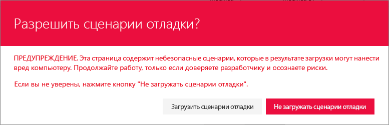
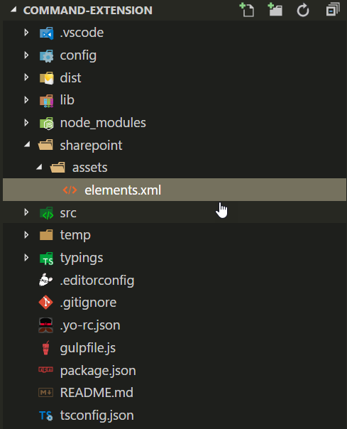

# <a name="build-your-first-listview-command-set-extension"></a>Создание первого расширения ListView Command Set

Расширения — это клиентские компоненты, которые запускаются в контексте страницы SharePoint. Расширения можно развертывать в SharePoint Online, а для их создания можно использовать современные инструменты и библиотеки JavaScript.

В этой статье описано, как создать свое первое расширение ListView Command Set. Эти действия также показаны в видео [канала SharePoint PnP на сайте YouTube](https://www.youtube.com/watch?v=iW0LQQqAY0Y&list=PLR9nK3mnD-OXtWO5AIIr7nCR3sWutACpV). 

<a href="https://www.youtube.com/watch?v=JBhgdSgWgdM">

</a>

## <a name="create-an-extension-project"></a>Создание проекта расширения

1. Создайте каталог проекта в любом расположении.
    
    ```
    md command-extension
    ```
    
2. Перейдите к каталогу проекта.
    
    ```
    cd command-extension
    ```
    
3. Создайте расширение HelloWorld, запустив генератор Yeoman для SharePoint.
    
    ```
    yo @microsoft/sharepoint
    ```
    
4. Когда появится запрос, выполните следующие действия:

    * Оставьте значение по умолчанию (**command-extension**) для имени решения и нажмите клавишу ВВОД.
    * Выберите **SharePoint Online only (latest)** (Только SharePoint Online, последняя версия) и нажмите клавишу ВВОД.
    * Выберите **Use the current folder** (Использовать текущую папку) и нажмите клавишу ВВОД.
    * Выберите **N**, чтобы сделать установку расширения, выполняемую напрямую, обязательной на каждом сайте при его использовании. 
    * Выберите **Extension** (Расширение) в качестве типа создаваемого клиентского компонента. 
    * Выберите для создаваемого расширения тип **ListView Command Set**.

5. Далее вам потребуется указать определенные сведения о расширении:

    * Оставьте значение по умолчанию **HelloWorld** для имени решения и нажмите клавишу ВВОД.
    * Оставьте значение по умолчанию **HelloWorld description** (Описание HelloWorld) для описания решения и нажмите клавишу ВВОД.

    

    После этого Yeoman установит необходимые зависимости и выполнит скаффолдинг файлов решения, а также расширения **HelloWorld**. Это может занять несколько минут.

    Когда скаффолдинг успешно закончится, появится следующее сообщение:

    

    Сведения об устранении неполадок см. в статье [Известные проблемы](../../known-issues-and-common-questions.md).

6. После завершения скаффолдинга блокируйте версию зависимостей проекта, выполнив следующую команду:

    ```sh
    npm shrinkwrap
    ```

7. Далее введите в консоли приведенную ниже команду, чтобы запустить Visual Studio Code.

    ```
    code .
    ```

    > [!NOTE] 
    > Клиентское решение SharePoint создано с помощью HTML и TypeScript, поэтому для разработки расширения можно использовать любой редактор кода, который поддерживает клиентскую разработку.

    Обратите внимание на то, что стандартная структура решения выглядит как структура решения клиентских веб-частей. Это основная структура решения SharePoint Framework, ее параметры конфигурации схожи для всех типов решений.

    

8. Откройте файл **HelloWorldCommandSet.manifest.json** в папке **src\extensions\helloWorld**.

    Этот файл определяет тип расширения и уникальный идентификатор `id` для расширения. Этот идентификатор пригодится позже при отладке и развертывании расширения в SharePoint.

    Обратите внимание на фактически используемые определения команд в файле манифеста. Это фактически используемые кнопки, которые предоставляются с учетом целевого объекта регистрации. В шаблоне по умолчанию вы найдете две разные кнопки: **Command One** (Команда первая) и **Command Two** (Команда вторая).

    

    В настоящее время ссылки на изображения не работают надлежащим образом, если не обращаться к ним из абсолютных расположений сети CDN в манифесте. Это будет исправлено в будущих выпусках.

## <a name="code-your-listview-command-set"></a>Написание кода ListView Command Set 

Откройте файл **HelloWorldCommandSet.ts** в папке **src\extensions\helloWorld**.

Обратите внимание на то, что базовый класс для ListView Command Set импортируется из пакета **sp-listview-extensibility**, который содержит код SharePoint Framework, необходимый для ListView Command Set.

```ts
import { override } from '@microsoft/decorators';
import { Log } from '@microsoft/sp-core-library';
import {
  BaseListViewCommandSet,
  Command,
  IListViewCommandSetListViewUpdatedParameters,
  IListViewCommandSetExecuteEventParameters
} from '@microsoft/sp-listview-extensibility';
import { Dialog } from '@microsoft/sp-dialog';
```

Поведение специальных кнопок определяется в методах **onListViewUpdated()** и **OnExecute()**.

Событие **onListViewUpdated()** происходит отдельно для каждой команды (например, элемента меню) всякий раз, когда ListView меняется, и пользовательский интерфейс необходимо отрисовывать повторно. Параметр функции `event` представляет сведения о команде, которая отрисовывается. Обработчик может использовать эти сведения для настройки названия или видимости (например, если команда должна отображаться, только когда определенное количество элементов выбрано в представлении списка). Такова реализация по умолчанию.

При использовании метода `tryGetCommand` вы получаете объект Command, который представляет команду, которая отображается в пользовательском интерфейсе. Вы можете менять его значения, такие как `title` или `visible`, чтобы изменить элемент пользовательского интерфейса. SPFx использует эти сведения при повторной отрисовке команд. Состояние объектов, полученное при последней отрисовке, сохраняется. То есть если команде присвоено значение `visible = false`, она будет оставаться невидимой, пока ей снова не будет задано значение `visible = true`.

```ts
  @override
  public onListViewUpdated(event: IListViewCommandSetListViewUpdatedParameters): void {
    const compareOneCommand: Command = this.tryGetCommand('COMMAND_1');
    if (compareOneCommand) {
      // This command should be hidden unless exactly one row is selected.
      compareOneCommand.visible = event.selectedRows.length === 1;
    }
  }
```

Метод **OnExecute()** определяет то, что происходит при выполнении команды (например, выбирается элемент меню). В стандартной реализации отображаются разные сообщения в зависимости от того, какая кнопка нажата. 


```ts
  @override
  public onExecute(event: IListViewCommandSetExecuteEventParameters): void {
    switch (event.itemId) {
      case 'COMMAND_1':
        Dialog.alert(`${this.properties.sampleTextOne}`);
        break;
      case 'COMMAND_2':
        Dialog.alert(`${this.properties.sampleTextTwo}`);
        break;
      default:
        throw new Error('Unknown command');
    }
  }
```


## <a name="debug-your-listview-command-set-using-gulp-serve-and-query-string-parameters"></a>Отладка ListView Command Set с помощью gulp serve и параметров строки запроса

В настоящее время использование локальной системы разработки для проверки расширений SharePoint Framework невозможно. Их необходимо проверять и разрабатывать с использованием действующего сайта SharePoint Online. Для этого вам не нужно развертывать модификацию каталога приложений, что делает процесс отладки простым и эффективным. 

1. Для начала скомпилируйте код и разместите скомпилированные файлы с локального компьютера, выполнив следующую команду:

    ```
    gulp serve --nobrowser
    ```

    Так как запускать локальную систему разработки не требуется (невозможно выполнять отладку расширений локально), используется параметр `--nobrowser`.

    Когда компиляция кода завершится без ошибок, полученный манифест будет доступен по адресу https://localhost:4321.

2. Перейдите к любому списку SharePoint на сайте SharePoint Online с помощью современного интерфейса.
    
    Так как расширение ListView Command Set размещено с использованием localhost и запущено, с помощью определенных параметров запроса отладки мы можем выполнить код в представлении списка.
    
3. Добавьте в URL-адрес приведенные ниже параметры строки запроса. Обратите внимание на то, что вам потребуется обновить GUID в соответствии с идентификатором расширения ListView Command Set, указанным в файле **HelloWorldCommandSet.manifest.json**. Дополнительные сведения см. в разделе [Подробнее о параметрах запроса URL-адреса](#more-details-about-the-url-query-parameters).
    
    ```
    ?loadSpfx=true&debugManifestsFile=https://localhost:4321/temp/manifests.js&customActions={"a8047e2f-30d5-40fc-b880-b2890c7c16d6":{"location":"ClientSideExtension.ListViewCommandSet.CommandBar","properties":{"sampleTextOne":"One item is selected in the list.","sampleTextTwo":"This command is always visible."}}}
    ```

    Полный URL-адрес должен выглядеть примерно так, как показано ниже (соответствовать URL-адресу клиента и расположению списка).

    ```
    contoso.sharepoint.com/Lists/Orders/AllItems.aspx?loadSpfx=true&debugManifestsFile=https://localhost:4321/temp/manifests.js&customActions={"a8047e2f-30d5-40fc-b880-b2890c7c16d6":{"location":"ClientSideExtension.ListViewCommandSet.CommandBar","properties":{"sampleTextOne":"One item is selected in the list.","sampleTextTwo":"This command is always visible."}}}
    ```

4. Согласитесь на загрузку манифестов отладки, выбрав **Загрузить скрипты отладки** при появлении соответствующего запроса.
    
    
    
5. Обратите внимание на то, что на панели инструментов появилась новая кнопка — **Command Two** (Команда вторая). Нажмите эту кнопку, чтобы увидеть текст, предоставленный как свойство для свойства `sampleTextTwo`.

    

6. Код не позволяет отображаться кнопке **Command One** (Команда первая), пока в библиотеке документов не будет выбрана одна строка. Отправьте документ в библиотеку или создайте его там и подтвердите, что вторая кнопка видима.

    

7. Нажмите кнопку **Command Two** (Команда вторая), чтобы увидеть, как работает элемент управления диалоговым окном, который используется в выходных данных, по умолчанию получаемых при скаффолдинге решения, когда в качестве типа расширения выбирается ListView Command Set. 

    


### <a name="more-details-about-the-url-query-parameters"></a>Подробнее о параметрах запроса URL-адреса

- **loadSPFX=true** гарантирует загрузку SharePoint Framework на странице. Из соображений производительности платформа обычно загружается, только если зарегистрировано хотя бы одно расширение. Так как компоненты еще не зарегистрированы, платформу нужно загрузить напрямую.
- **debugManifestsFile** указывает, что нужно загрузить компоненты SPFx, предоставляемые локально. Загрузчик ищет компоненты только в каталоге приложений (для развернутого решения) и на сервере манифестов SharePoint (для системных библиотек).
- **customActions** имитирует дополнительное действие. Вы можете задать много свойств для этого объекта `CustomAction`, влияющих на внешний вид и расположение кнопки. Мы расскажем о них позже.
    - **Key** — GUID расширения.
    - **Location** — расположение, в котором отображаются команды. Возможные значения:
        - **ClientSideExtension.ListViewCommandSet.ContextMenu** — контекстное меню элементов;
        - **ClientSideExtension.ListViewCommandSet.CommandBar** — меню верхнего уровня для набора команд в списке или библиотеке;
        - **ClientSideExtension.ListViewCommandSet** — контекстное меню и панель команд (соответствует параметру SPUserCustomAction.Location="CommandUI.Ribbon");
    - **Properties** — необязательный объект JSON, содержащий свойства, которые доступны через элемент `this.properties`.

<br/>

## <a name="enhance-the-listview-command-set-rendering"></a>Улучшение отрисовки ListView Command Set

Решение по умолчанию использует новый API диалоговых окон, позволяющий легко выводить модальные диалоговые окна с помощью кода. Далее мы слегка изменим интерфейс по умолчанию, чтобы показать варианты использования API диалоговых окон.

1. Вернитесь к консоли и выполните приведенную ниже команду, чтобы включить API диалоговых окон в наше решение.

2. Вернитесь к Visual Studio Code (или другому редактору, который вы используете).

3. Откройте файл **HelloWorldCommandSet.ts** в папке **src\extensions\helloWorld**.

4. Добавьте приведенный ниже оператор импорта для класса `Dialog` из `@microsoft/sp-dialog` после имеющихся операторов импорта. 

5. Измените метод **onExecute** следующим образом:
    
    ```ts
      @override
      public onExecute(event: IListViewCommandSetExecuteEventParameters): void {
        switch (event.commandId) {
          case 'COMMAND_1':
            Dialog.alert(`Clicked ${strings.Command1}`);
            break;
          case 'COMMAND_2':
            Dialog.prompt(`Clicked ${strings.Command2}. Enter something to alert:`).then((value: string) => {
              Dialog.alert(value);
            });
            break;
          default:
            throw new Error('Unknown command');
        }
      }
    ``` 
    
6. В окне консоли не должно быть исключений. Если в localhost нет запущенного решения, выполните следующую команду:

    ```
    gulp serve --nobrowser
    ```

7. В представлении списка укажите те же параметры запроса, что и раньше. Идентификатор должен совпадать с идентификатором расширения, указанным в файле **HelloWorldCommandSet.manifest.json**.

8. Согласитесь на загрузку манифестов отладки, выбрав **Загрузить скрипты отладки** при появлении соответствующего запроса.

    

    На панели инструментов есть те же кнопки, но вы заметите, что если нажимать их по отдельности, их поведение меняется. Теперь мы используем новый API диалоговых окон, который можно легко применять к решениям даже в случае самых сложных сценариев. 

    


## <a name="add-a-listview-command-set-to-a-solution-package-for-deployment"></a>Добавление ListView Command Set к пакету решения для развертывания

1. Вернитесь к решению в Visual Studio Code (или другом редакторе, который вы используете).

2. Разверните папку **sharepoint** и вложенную папку **assets** в корне решения для просмотра существующего файла **elements.xml**. 
    
    
    
### <a name="review-the-elementsxml-file"></a>Просмотр файла elements.xml 

Откройте файл **elements.xml** в папке **sharepoint\assets**.

Обратите внимание на указанную ниже структуру XML в файле **elements.xml**. Свойство **ClientSideComponentId** автоматически обновлено в соответствии с уникальным идентификатором ListView Command Set в файле **HelloWorldCommandSet.manifest.json** папки **src\extensions\helloWorld**.

Обратите внимание на то, что мы используем определенное значение расположения `ClientSideExtension.ListViewCommandSet.CommandBar`, чтобы определить, что это расширение ListView Command Set, которое должно отображаться на панели команд. Мы также определяем `RegistrationId` как **100** и `RegistrationType` как **List**, чтобы сопоставить это дополнительное действие автоматически с общими списками. `ClientSideComponentProperties` позволяет предоставлять конфигурации для определенных экземпляров. В этом случае мы используем свойства по умолчанию — *sampleTextOne* и *sampleTextTwo*.

```xml
<?xml version="1.0" encoding="utf-8"?>
<Elements xmlns="http://schemas.microsoft.com/sharepoint/">

    <CustomAction 
        Title="SPFxListViewCommandSet"
        RegistrationId="100"
        RegistrationType="List"
        Location="ClientSideExtension.ListViewCommandSet.CommandBar"
        ClientSideComponentId="5fc73e12-8085-4a4b-8743-f6d02ffe1240"
        ClientSideComponentProperties="{&quot;sampleTextOne&quot;:&quot;One item is selected in the list.&quot;, &quot;sampleTextTwo&quot;:&quot;This command is always visible.&quot;}">

    </CustomAction>

</Elements>
```

Допустимые значения расположений, которые можно использовать с ListView Command Set:

* `ClientSideExtension.ListViewCommandSet.CommandBar` — панель инструментов списка или библиотеки;
* `ClientSideExtension.ListViewCommandSet.ContextMenu` — контекстное меню для элементов списка или библиотеки;
* `ClientSideExtension.ListViewCommandSet` — регистрация команд для панели инструментов и контекстного меню.

### <a name="ensure-that-definitions-are-taken-into-account-within-the-build-pipeline"></a>Проверка учета определений в конвейере сборки

Откройте файл **package-solution.json** в папке **config**. В файле **package-solution.json** определяются метаданные пакета, как показано в следующем фрагменте кода:

```json
{
  "$schema": "https://dev.office.com/json-schemas/spfx-build/package-solution.schema.json",
  "solution": {
    "name": "command-extension-client-side-solution",
    "id": "690ae189-a4fc-4b98-8f28-d4ec17448b7a",
    "version": "1.0.0.0",
    "features": [
      {
        "title": "Application Extension - Deployment of custom action.",
        "description": "Deploys a custom action with ClientSideComponentId association",
        "id": "e91d5532-3519-4b50-b55e-b142fc74cd8a",
        "version": "1.0.0.0",
        "assets": {
          "elementManifests": [
            "elements.xml"
          ]
        }
      }
    ]
  },
  "paths": {
    "zippedPackage": "solution/command-extension.sppkg"
  }
}
```

Чтобы при упаковке решения учитывался файл **element.xml**, нужна конфигурация скаффолдинга по умолчанию для определения функций платформы функций для пакета решения.

## <a name="deploy-the-extension-to-sharepoint-online-and-host-javascript-from-local-host"></a>Развертывание расширения в SharePoint Online и размещение кода JavaScript с локального узла

Теперь все готово для развертывания решения на сайте SharePoint и автоматического сопоставления с объектом `CustomAction` на уровне сайта.

1. Чтобы упаковать клиентское решение, содержащее расширение, и получить базовую структуру, готовую к упаковке, введите в окне консоли приведенную ниже команду.
    
    ```
    gulp bundle
    ```
    
2. Затем выполните следующую команду, чтобы создать пакет решения:
    
    ```
    gulp package-solution
    ```
    
    Эта команда создаст пакет в папке **sharepoint/solution**:
    
    ```
    command-extension.sppkg
    ```
    
3. Далее вам потребуется развернуть созданный пакет в каталоге приложений. Для этого перейдите к **каталогу приложений** клиента и откройте библиотеку **Приложения для SharePoint**.

4. Отправьте или перетащите файл `command-extension.sppkg` из папки **sharepoint/solution** в каталог приложений. В SharePoint откроется диалоговое окно с запросом на подтверждение доверия клиентскому решению.

    Обратите внимание на то, что мы не обновляли URL-адреса для размещения решения в этом развертывании, поэтому URL-адрес по-прежнему указывает на https://localhost:4321. 
    
5. Нажмите кнопку **Развернуть**.

    

6. На консоли убедитесь, что решение запущено. Если оно не запущено, выполните следующую команду в папке решения:

    ```
    gulp serve --nobrowser
    ```

7. Перейдите на тот сайт, где требуется проверить подготовку ресурсов SharePoint. Это может быть любое семейство веб-сайтов в клиенте, где развернут пакет решения.

8. Нажмите значок шестеренки на верхней панели навигации справа и выберите команду **Добавить приложение**, чтобы перейти к странице "Приложения".

9. В поле **Поиск** введите **extension** и нажмите клавишу ВВОД, чтобы отфильтровать приложения.

    

10. Выберите приложение **command-extension-client-side-solution**, чтобы установить решение на сайте. По завершении установки обновите страницу, нажав клавишу **F5**.

11. Когда приложение будет успешно установлено, нажмите кнопку **Создать** на панели инструментов страницы **Содержимое сайта** и выберите **Список**.

    

12. Укажите имя **Sample** (Пример) и нажмите кнопку **Создать**.

    Обратите внимание на то, что кнопки **Command One** (Команда первая) и **Command Two** (Команда вторая) отрисовываются на панели инструментов в соответствии с изменениями ListView Command Set. 

    

> [!NOTE]
> Если вы обнаружили ошибку в документации или SharePoint Framework, сообщите о ней разработчикам SharePoint, указав в [списке проблем для репозитория sp-dev-docs](https://github.com/SharePoint/sp-dev-docs/issues). Заранее спасибо!