# <a name="build-your-first-field-customizer-extension"></a>Создание первого расширения для настройки полей

>**Примечание.** Расширения для платформы SharePoint Framework находятся на этапе тестирования и могут меняться. В настоящее время расширения SharePoint Framework невозможно использовать в рабочих средах.

Расширения — это клиентские компоненты, которые запускаются в контексте страницы SharePoint. Расширения можно развертывать в SharePoint Online, а для их создания можно использовать современные инструменты и библиотеки JavaScript.

>**Примечание.** Прежде чем выполнять действия, описанные в этой статье, [настройте среду разработки](../../set-up-your-development-environment). Обратите внимание, что в настоящее время расширения доступны **ТОЛЬКО** в клиентах разработчиков приложений для Office 365.

>**Примечание.** В настоящее время отладку расширений для настройки полей можно выполнять только с помощью современного интерфейса на классических сайтах SharePoint. Убедитесь, что вы используете для тестирования классический сайт группы с современным интерфейсом списков.

## <a name="create-an-extension-project"></a>Создание проекта расширения
Создайте каталог проекта в любом расположении.

```
md field-extension
```

Перейдите к каталогу проекта.

```
cd field-extension
```

Создайте расширение HelloWorld, запустив генератор Yeoman для SharePoint.

```
yo @microsoft/sharepoint
```

Когда появится запрос, выполните указанные ниже действия.

* Оставьте значение по умолчанию (**field-extension**) для имени решения и нажмите клавишу **ВВОД**.
* Выберите для создаваемого клиентского компонента тип **Extension (Preview)**. 
* Выберите для создаваемого расширения тип **Field Customizer (Preview)**.

Далее вам потребуется указать определенные сведения о расширении.

* Оставьте значение по умолчанию (**HelloWorld**) для имени решения и нажмите клавишу **ВВОД**.
* Оставьте значение по умолчанию (**HelloWorld description**) для описания решения и нажмите клавишу **ВВОД**.
* Оставьте платформу, выбранную по умолчанию (**No JavaScript Framework**), и нажмите клавишу **ВВОД**. 


После этого Yeoman установит необходимые зависимости и сформирует файлы решения, а также расширение **HelloWorld**. Это может занять несколько минут. 

После успешного формирования должно появиться следующее сообщение:


Сведения об устранении неполадок см. в статье [Известные проблемы](../basics/known-issues).

Завершив формирование решения, введите в консоли приведенную ниже команду, чтобы запустить Visual Studio Code.

```
code .
```

> Обратите внимание, что клиентское решение SharePoint создано с помощью HTML и TypeScript, поэтому для разработки расширения можно использовать любой редактор кода, который поддерживает клиентское программирование.

Обратите внимание, что стандартная структура решения аналогична структуре клиентских веб-частей. Это базовая структура решения SharePoint Framework, многие параметры которой не зависят от типа решения.

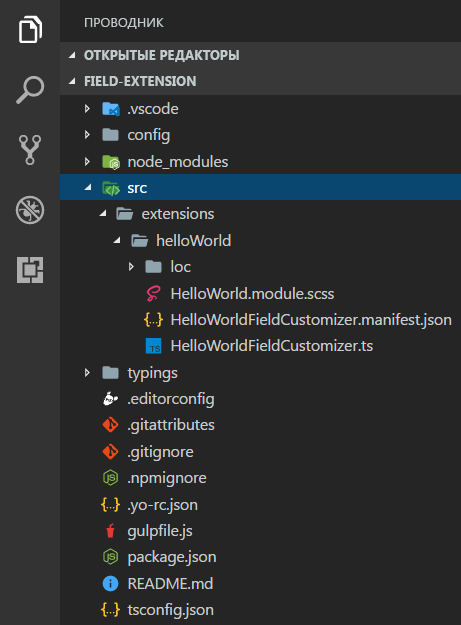

Откройте файл **HelloWorldFieldCustomizer.manifest.json** в папке **src\extensions\helloWorld**.

В этом файле определяются тип расширения и уникальный идентификатор **id** для него. Этот идентификатор потребуется позже, при отладке и развертывании расширения в SharePoint.


## <a name="coding-your-field-customizer"></a>Написание кода настройщика полей 
Откройте файл **HelloWorldFieldCustomizer.ts** в папке **src\extensions\helloWorld**.

Обратите внимание, что базовый класс для настройщика полей импортируется из пакета **sp-application-base**, который содержит код платформы SharePoint Framework, необходимый для настройщика полей.

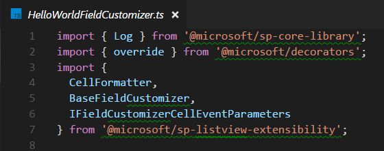

Логика настройщика полей содержится в методах **OnInit()**, **onRenderCell()** и **onDisposeCell()**.

* **onInit():** — здесь выполняется вся настройка, необходимая для расширения. Это событие происходит после назначения `this.context` и `this.properties`, но до того, как модель DOM будет готова. Как и в случае с веб-частями, `onInit()` возвращает обещание, с помощью которого можно выполнять асинхронные операции. `onRenderCell()` не будет вызываться, пока обещание не будет разрешено. Если вам это не нужно, просто верните `super.onInit()`.
* **onRenderCell():** это событие происходит перед отрисовкой каждой ячейки. Оно предоставляет элемент HTML `event.cellDiv`, в который код может записывать содержимое.
* **onDisposeCell():** — это событие, которое происходит сразу после удаления `event.cellDiv`. Его можно использовать для освобождения ресурсов, выделенных во время отрисовки полей. Например, если обработчик события `onRenderCell()` подключил элемент React, то для его освобождения необходимо использовать метод `onDisposeCell()`. В противном случае произойдет утечка ресурсов. 

Ниже представлено содержимое методов **onRenderCell()** и **onDisposeCell()** в стандартном решении.


## <a name="debugging-your-field-customizer-using-gulp-serve-and-query-string-parameters"></a>Отладка настройщика полей с помощью gulp serve и параметров строки запроса
В настоящее время расширения SharePoint Framework невозможно тестировать с помощью локального рабочего места, поэтому тестировать и разрабатывать их следует непосредственно на активном сайте SharePoint Online. Однако при этом не требуется развертывать модификацию в каталоге приложений, что делает отладку простой и эффективной.

Для начала скомпилируйте код и разместите скомпилированные файлы с локального компьютера, выполнив следующую команду:
```
gulp serve --nobrowser
```

Обратите внимание, что мы использовали параметр `--nobrowser`, так как локальная отладка расширений сейчас не поддерживается, то есть нет смысла запускать локальное рабочее место.

Когда компиляция кода завершится без ошибок, полученный манифест будет доступен по адресу http://localhost:4321.


Для тестирования расширения перейдите к сайту в клиенте SharePoint Online.

Откройте страницу **Содержимое сайта**.

Нажмите кнопку **Создать** на панели инструментов и выберите **Список**:


Создайте список под названием *Заказы* и нажмите кнопку **Создать**:

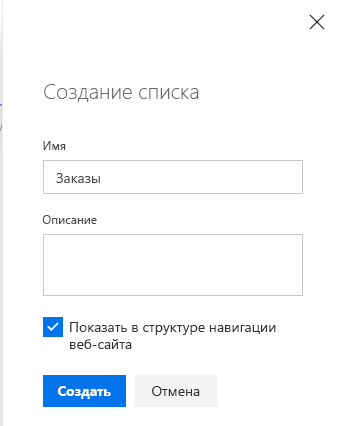

Нажмите значок **плюс** и выберите **Число**, чтобы создать числовое поле для списка:

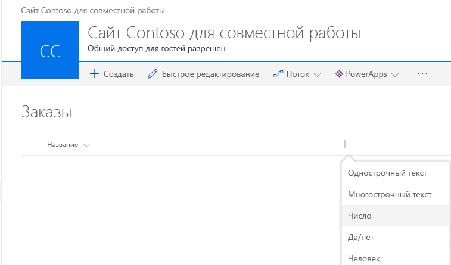

Задайте для поля имя **Процент** и нажмите кнопку **Сохранить**:

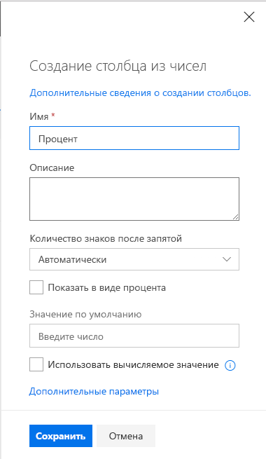

Добавьте несколько элементов с различными числами в процентное поле. Позже мы изменим отрисовку, чтобы разные числа отображались по-разному в соответствии с вашей реализацией.

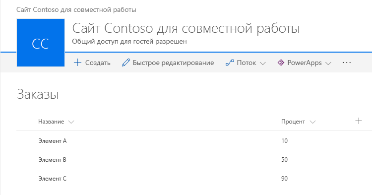

Так как наш настройщик полей размещается в localhost и запущен, мы можем использовать определенные параметры запроса отладки для выполнения кода в новом списке.

Добавьте к URL-адресу приведенные ниже параметры строки запроса. Обратите внимание, что вам потребуется обновить идентификатор в соответствии с идентификатором расширения, указанным в файле **HelloWorldFieldCustomizer.manifest.json**:

```
?loadSPFX=true&debugManifestsFile=https://localhost:4321/temp/manifests.js&fieldCustomizers={"Percent":{"id":"0e3d8b71-56aa-4405-9225-f08a80fc1d71","properties":{"sampleText":"Hello!"}}}
```
Дополнительные сведения о параметрах запросов URL-адресов

* **loadSPFX=true:** гарантирует, что платформа SharePoint Framework загружается на странице. Для оптимальной производительности платформа обычно не загружается, если не зарегистрировано хотя бы одно расширение. Так как пока не зарегистрировано ни одного расширения, нам необходимо отдавать явную команду на загрузку платформы.
* **debugManifestsFile:** указывает, что нам требуется загрузить компоненты SPFx, предоставляемые локально. Как правило, загрузчик ищет компоненты только в каталоге приложений (для развернутого решения) и на сервере манифестов SharePoint (для системных библиотек).
* **fieldCustomizers:** указывает поля в списке, отрисовку которых должен контролировать настройщик полей. Параметр ID указывает GUID расширения, который следует использовать для управления отрисовкой поля. Параметр properties — это необязательная текстовая строка, содержащая объект JSON, который будет десериализован в `this.properties` для вашего расширения.
    * **Key:** в качестве ключа используйте внутреннее имя поля.
    * **Id:** — GUID расширения для настройки полей, связанный с этим полем.
    * **Properties:** — значения свойств, определенные в расширении. В данном примере *sampleText* — это свойство, определенное расширением.

Полный URL-адрес должен выглядеть примерно так, как показано ниже, но соответствовать URL-адресу и расположению нового списка.

```
contoso.sharepoint.com/Lists/Orders/AllItems.aspx?loadSPFX=true&debugManifestsFile=https://localhost:4321/temp/manifests.js&fieldCustomizers={"Percent":{"id":"0e3d8b71-56aa-4405-9225-f08a80fc1d71","properties":{"sampleText":"Hello!"}}}
```

Согласитесь на загрузку манифестов отладки, нажав кнопку **Загрузить скрипты отладки** при появлении соответствующего запроса.


Обратите внимание, что процентные значения теперь представлены с дополнительными символами [ ]:

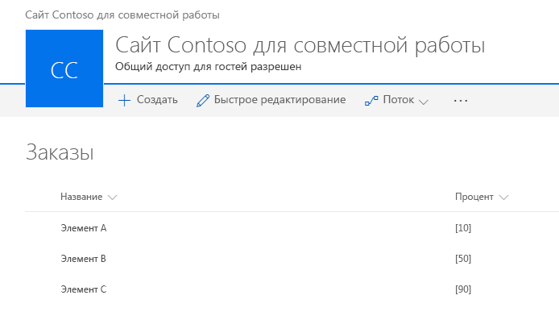

## <a name="enhancing-the-field-customizer-rendering"></a>Улучшение отрисовки настройщика полей
Теперь, когда мы успешно протестировали встроенную отправную точку для создания настройщика полей, пришло время немного изменить логику для более аккуратной отрисовки значения поля. 

Откройте файл **HelloWorld.module.scss** в папке **src\extensions\helloWorld** и измените определение стиля, как показано ниже.

```
.HelloWorld {
  .cell {
    display: 'inline-block';
  }
  .full {
    background-color: '#e5e5e5';
    width: '100px';
  }
}

```
Откройте файл **HelloWorldFieldCustomizer.ts** в папке **src\extensions\helloWorld** и измените метод **onRednerCell**, как показано ниже.

```
  @override
  public onRenderCell(event: IFieldCustomizerCellEventParameters): void {

    event.cellDiv.classList.add(styles.cell);
    event.cellDiv.innerHTML = `
                <div class='${styles.full}'>
                  <div style='width: ${event.cellValue}px; background:#0094ff; color:#c0c0c0'>
                    &nbsp; ${event.cellValue}
                  </div>
                </div>`;

  }
```

Вернитесь к окну консоли и убедитесь, что не возникло никаких исключений. Если в *locahost* еще нет запущенных решений, выполните следующую команду:

```
gulp serve --nobrowser
```

Вернитесь к созданному ранее списку и используйте тот же параметр запроса, что и раньше, с полем "Заказы" и идентификатором, замененным на идентификатор расширения, который указан в файле **HelloWorldFieldCustomizer.manifest.json**.

Согласитесь на загрузку манифестов отладки, нажав кнопку **Загрузить скрипты отладки** при появлении соответствующего запроса.


Обратите внимание, что мы полностью изменили стиль отрисовки поля. Значение поля указывается с помощью его графического представления.

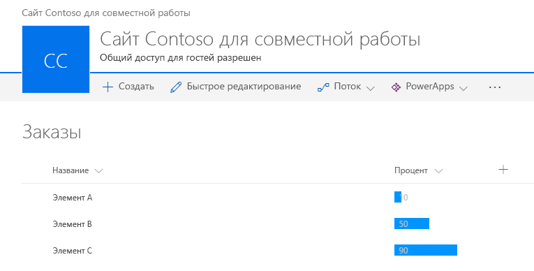

## <a name="add-the-field-definition-to-the-solution-package-for-deployment"></a>Добавление определения поля в пакет решения для развертывания
Теперь, когда мы надлежащим образом протестировали решение в режиме отладки, мы можем упаковать его для автоматического развертывания в составе пакета решения, развертываемого на сайтах. Для этого нужно выполнить несколько операций.

1. Установите пакет решения на нужном сайте, чтобы манифест расширения попал в список разрешенных для запуска.
2. Свяжите настройщик полей с существующим полем на сайте. Это можно сделать программным способом (CSOM/REST) или с помощью платформы компонентов в пакете решения SharePoint Framework. Ниже перечислены свойства, которые необходимо связать с объектом *SPField* на уровне сайта или списка.
    * **ClientSiteComponentId:** — это идентификатор (GUID) настройщика приложений, установленного в каталоге приложений. 
    * **ClientSideComponentProperties:** это необязательный параметр, с помощью которого можно предоставлять свойства для экземпляра настройщика полей.

> Обратите внимание, что в настоящее время необходимо явно устанавливать пакеты решений на сайтах, чтобы расширения выполнялись должным образом. В будущем появятся альтернативные способы достижения этой цели без отдельного развертывания на каждом сайте. 

На следующих этапах мы создадим определение поля, которое затем будет автоматически развернуто с необходимыми параметрами при установке пакета решения на сайте. 

Вернитесь к решению в Visual Studio Code (или другом редакторе, который вы используете).

Для начала необходимо создать папку **assets**, в которую мы поместим все ресурсы платформы компонентов, используемые для подготовки структур SharePoint при установке пакета.

* Создайте папку **sharepoint** в корневой папке решения.
* Создайте папку **assets** в только что созданной папке **sharepoint**.

Структура решения должна быть примерно такой, как на следующем рисунке:


### <a name="add-an-elementsxml-file-for-sharepoint-definitions"></a>Добавление файла element.xml для определений SharePoint
Создайте в папке **sharepoint\assets** файл **elements.xml**.

Скопируйте приведенную ниже структуру XML в файл **elements.xml**. Обязательно замените значение свойства **ClientSideComponentId** на уникальный идентификатор настройщика полей, указанный в файле **HelloWorldFieldCustomizer.manifest.json** в папке **src\extensions\helloWorld**.

```xml
<?xml version="1.0" encoding="utf-8"?>
<Elements xmlns="http://schemas.microsoft.com/sharepoint/">

    <Field ID="{060E50AC-E9C1-3D3C-B1F9-DE0BCAC200F6}"
            Name="SPFxPercentage"
            DisplayName="Percentage"
            Type="Number"
            Min="0"
            Required="FALSE"
            Group="SPFx Columns"
            ClientSideComponentId="0e3d8b71-56aa-4405-9225-f08a80fc1d71">
    </Field>

</Elements>
```

### <a name="ensure-that-definitions-are-taken-into-account-within-the-build-pipeline"></a>Проверка учета определений в конвейере сборки

Откройте файл **package-solution.json** из папки **config**. В файле **package-solution.json** определяются метаданные пакета, как показано в следующем фрагменте кода:

```json
{
  "solution": {
    "name": "field-extension-client-side-solution",
    "id": "11cd343e-1ce6-462c-8acb-929804d0c3b2",
    "version": "1.0.0.0"
  },
  "paths": {
    "zippedPackage": "solution/field-extension.sppkg"
  }
}


```

Чтобы убедиться, что новый файл **elements.xml** учитывается при упаковке решения, необходимо включить определение компонента для пакета решения. Добавим определение JSON для нужного компонента в структуру решения, как показано ниже.

```json
{
  "solution": {
    "name": "field-extension-client-side-solution",
    "id": "11cd343e-1ce6-462c-8acb-929804d0c3b2",
    "version": "1.0.0.0",
    "features": [{
      "title": "Field Extension - Deployment of custom field.",
      "description": "Deploys a custom field with ClientSideComponentId association",
      "id": "123fe847-ced2-3036-b564-8dad5c6c6e83",
      "version": "1.0.0.0",
      "assets": {        
        "elementManifests": [
          "elements.xml"
        ]
      }
    }]
  },
  "paths": {
    "zippedPackage": "solution/field-extension.sppkg"
  }
}

```

## <a name="deploy-the-field-to-sharepoint-online-and-host-javascript-from-local-host"></a>Развертывание поля в SharePoint Online и размещение кода JavaScript с локального узла
Теперь все готово для развертывания решения на сайте SharePoint и автоматического добавления связывания в поле. 

Чтобы упаковать клиентское решение, содержащее расширение, и получить базовую структуру, готовую к упаковке, введите в окне консоли приведенную ниже команду.

```
gulp bundle
```

Затем выполните следующую команду, чтобы создать пакет решения:

```
gulp package-solution
```

Эта команда создаст пакет в папке **sharepoint/solution**:

```
field-extension.sppkg
```

Далее вам потребуется развернуть созданный пакет в каталоге приложений.

Перейдите к **каталогу приложений** вашего клиента и откройте библиотеку **Приложения для SharePoint**.

Отправьте или перетащите файл `field-extension.sppkg` из папки **sharepoint/solution** в каталог приложений. В SharePoint откроется диалоговое окно с предложением доверять клиентскому решению.

Обратите внимание, что мы не обновляли URL-адреса для размещения решения в этом развертывании, чтобы URL-адрес по-прежнему указывал на https://localhost:4321. Нажмите кнопку **Развернуть**.

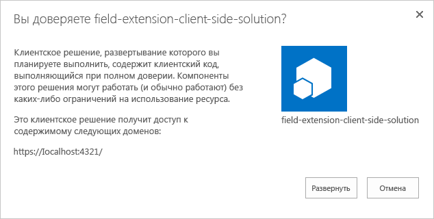

Перейдите на тот сайт, где требуется проверить подготовку ресурсов SharePoint. Это может быть любое семейство веб-сайтов в клиенте, где развернут пакет решения.

Нажмите значок шестеренки на верхней панели навигации справа и выберите команду **Добавить приложение**, чтобы перейти к странице "Приложения".

В поле **Поиск** введите **field** и нажмите клавишу *ВВОД*, чтобы отфильтровать приложения.

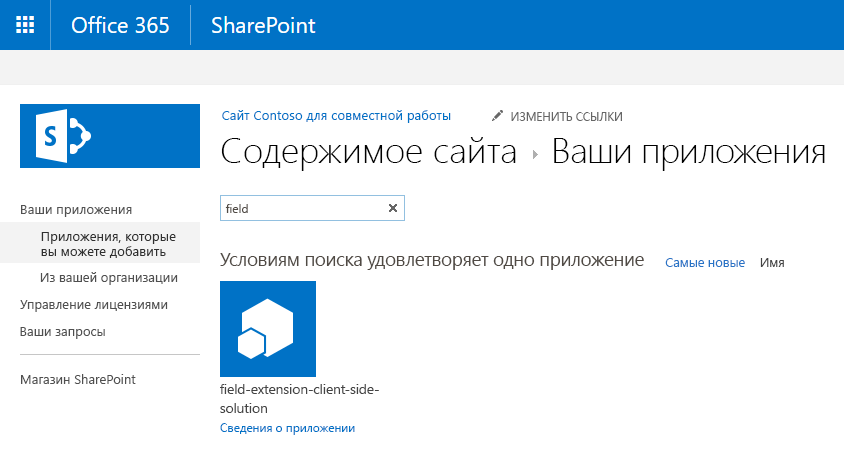

Выберите приложение **field-extension-client-side-solution**, чтобы установить его на сайте. По завершении установки обновите страницу, нажав клавишу **F5**.

После установки решения нажмите кнопку **Создать** на панели инструментов страницы **Содержимое сайта** и выберите **Список**.


Создайте список под названием **Накладные**:

После создания списка вернитесь к странице **Содержимое сайта** и выберите пункт **Параметры** в контекстном меню нового списка:

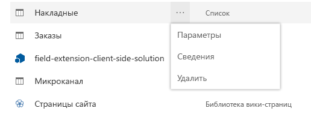

Выберите параметр **Добавить из существующих столбцов сайта** в разделе **Столбцы**:

Выберите поле **Процент**, подготовленное с помощью пакета решения, в группе **Столбцы SPFx**:

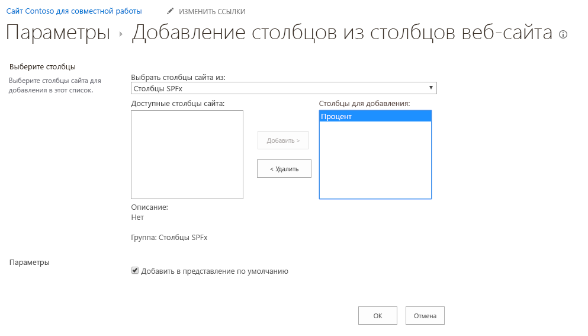

Нажмите кнопку **ОК**.

Вернитесь к консоли и убедитесь, что решение запущено. Если это не так, выполните в папке решения следующую команду:

```
gulp serve --nobrowser
```
Перейдите к новому списку **Накладные** и добавьте в столбец "Процент" несколько новых элементов с разными значениями, чтобы увидеть, как поле отрисовывается без параметров запроса отладки.

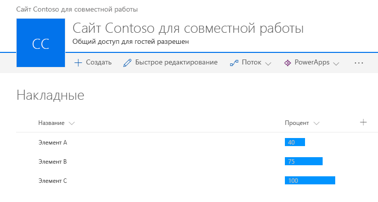

В этом случае код JavaScript по-прежнему размещается в localhost, но вы также можете переместить ресурсы в любую сеть CDN и обновить URL-адрес, чтобы ресурсы JavaScript можно было загружать не только из localhost. 

Процесс публикации приложения не зависит от типа расширения. Вы можете выполнить действия из указанной ниже статьи, чтобы обновить ресурсы, размещенные в сети CDN.

* [Развертывание расширения для Office 365 в сети доставки содержимого](./hosting-extension-from-office365-cdn.md).
