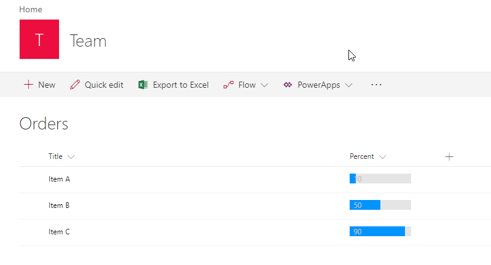

# <a name="build-your-first-field-customizer-extension"></a><span data-ttu-id="001e5-103">Создание первого расширения для настройки полей</span><span class="sxs-lookup"><span data-stu-id="001e5-103">Build your first Field Customizer extension</span></span>

<span data-ttu-id="001e5-104">Расширения — это клиентские компоненты, которые запускаются в контексте страницы SharePoint.</span><span class="sxs-lookup"><span data-stu-id="001e5-104">Extensions are client-side components that run inside the context of a SharePoint page.</span></span> <span data-ttu-id="001e5-105">Расширения можно развертывать в SharePoint Online, а для их создания можно использовать современные инструменты и библиотеки JavaScript.</span><span class="sxs-lookup"><span data-stu-id="001e5-105">Extensions can be deployed to SharePoint Online, and you can use modern JavaScript tools and libraries to build them.</span></span>

<span data-ttu-id="001e5-106">Эти действия также показаны в видео на [канале SharePoint PnP в YouTube](https://www.youtube.com/watch?v=fijOzUmlXrY&list=PLR9nK3mnD-OXtWO5AIIr7nCR3sWutACpV).</span><span class="sxs-lookup"><span data-stu-id="001e5-106">You can follow these steps by watching the video on the [SharePoint PnP YouTube Channel](https://www.youtube.com/watch?v=fijOzUmlXrY&list=PLR9nK3mnD-OXtWO5AIIr7nCR3sWutACpV).</span></span> 

<a href="https://www.youtube.com/watch?v=4wgZy5tm4yo">

</a>

## <a name="create-an-extension-project"></a><span data-ttu-id="001e5-107">Создание проекта расширения</span><span class="sxs-lookup"><span data-stu-id="001e5-107">Create an extension project</span></span>

1. <span data-ttu-id="001e5-108">Создайте каталог проекта в любом расположении.</span><span class="sxs-lookup"><span data-stu-id="001e5-108">Create a new project directory in your favorite location.</span></span>
    
    ```
    md field-extension
    ```
    
2. <span data-ttu-id="001e5-109">Перейдите к каталогу проекта.</span><span class="sxs-lookup"><span data-stu-id="001e5-109">Go to the project directory.</span></span>
    
    ```
    cd field-extension
    ```
    
3. <span data-ttu-id="001e5-110">Создайте расширение HelloWorld, запустив генератор Yeoman для SharePoint.</span><span class="sxs-lookup"><span data-stu-id="001e5-110">Create a new HelloWorld extension by running the Yeoman SharePoint Generator.</span></span>
    
    ```
    yo @microsoft/sharepoint
    ```
    
4. <span data-ttu-id="001e5-111">Когда появится запрос, выполните следующие действия:</span><span class="sxs-lookup"><span data-stu-id="001e5-111">When prompted:</span></span>
    
    * <span data-ttu-id="001e5-112">Оставьте значение по умолчанию **field-extension** для имени решения и нажмите клавишу ВВОД.</span><span class="sxs-lookup"><span data-stu-id="001e5-112">Accept the default value of **field-extension** as your solution name, and then select Enter.</span></span>
    * <span data-ttu-id="001e5-113">Выберите **Только SharePoint Online (новая версия)** и нажмите клавишу ВВОД.</span><span class="sxs-lookup"><span data-stu-id="001e5-113">Select **SharePoint Online only (latest)**, and select Enter.</span></span>
    * <span data-ttu-id="001e5-114">Выберите **Use the current folder** (Использовать текущую папку) и нажмите клавишу ВВОД.</span><span class="sxs-lookup"><span data-stu-id="001e5-114">Select **Use the current folder**, and select Enter.</span></span>
    * <span data-ttu-id="001e5-115">Выберите **N**, чтобы сделать установку расширения, выполняемую напрямую, обязательной на каждом сайте при его использовании.</span><span class="sxs-lookup"><span data-stu-id="001e5-115">Select **N** to require the extension to be installed on each site explicitly when it's being used.</span></span>
    * <span data-ttu-id="001e5-116">Выберите **Расширение** в качестве типа создаваемого клиентского компонента.</span><span class="sxs-lookup"><span data-stu-id="001e5-116">Select **Extension** as the client-side component type to be created.</span></span> 
    * <span data-ttu-id="001e5-117">Выберите для создаваемого расширения тип **Настройщик полей**.</span><span class="sxs-lookup"><span data-stu-id="001e5-117">Select **Field Customizer** as the extension type to be created.</span></span>
    
5. <span data-ttu-id="001e5-118">Далее вам потребуется указать определенные сведения о расширении:</span><span class="sxs-lookup"><span data-stu-id="001e5-118">The next set of prompts ask for specific information about your extension:</span></span>
     
    * <span data-ttu-id="001e5-119">Оставьте значение по умолчанию **HelloWorld** для имени решения и нажмите клавишу ВВОД.</span><span class="sxs-lookup"><span data-stu-id="001e5-119">Accept the default value of **HelloWorld** as your extension name, and then select Enter.</span></span>

    * <span data-ttu-id="001e5-120">Оставьте значение по умолчанию **Описание HelloWorld** для описания решения и нажмите клавишу ВВОД.</span><span class="sxs-lookup"><span data-stu-id="001e5-120">Accept the default value of **HelloWorld description** as your extension description, and select Enter.</span></span>

    * <span data-ttu-id="001e5-121">Оставьте платформу по умолчанию **Не использовать платформу веб-решений на базе JavaScript** и нажмите клавишу ВВОД.</span><span class="sxs-lookup"><span data-stu-id="001e5-121">Accept the default value of **No JavaScript Framework** as the framework selection, and select Enter.</span></span> 
    
    
    
    <span data-ttu-id="001e5-123">После этого Yeoman установит необходимые зависимости и выполнит скаффолдинг файлов решения, а также расширения **HelloWorld**.</span><span class="sxs-lookup"><span data-stu-id="001e5-123">At this point, Yeoman installs the required dependencies and scaffolds the solution files along with the **HelloWorld** extension.</span></span> <span data-ttu-id="001e5-124">Это может занять несколько минут.</span><span class="sxs-lookup"><span data-stu-id="001e5-124">This might take a few minutes.</span></span> 
    
    <span data-ttu-id="001e5-125">Когда скаффолдинг успешно закончится, появится следующее сообщение:</span><span class="sxs-lookup"><span data-stu-id="001e5-125">When the scaffold is complete, you should see the following message indicating a successful scaffold:</span></span>
    
    
    
    <span data-ttu-id="001e5-127">Сведения об устранении неполадок см. в статье [Известные проблемы](../../known-issues-and-common-questions.md).</span><span class="sxs-lookup"><span data-stu-id="001e5-127">For information about troubleshooting any errors, see [Known issues](../../known-issues-and-common-questions.md).</span></span>

6. <span data-ttu-id="001e5-128">После завершения скаффолдинга заблокируйте версию зависимостей проекта, выполнив следующую команду:</span><span class="sxs-lookup"><span data-stu-id="001e5-128">After the scaffolding completes, lock down the version of the project dependencies by running the following command:</span></span>

    ```sh
    npm shrinkwrap
    ```
    
7. <span data-ttu-id="001e5-129">Введите в консоли приведенную ниже команду, чтобы запустить Visual Studio Code.</span><span class="sxs-lookup"><span data-stu-id="001e5-129">Type the following into the console to start Visual Studio Code.</span></span>
    
    ```
    code .
    ```
    
    > [!NOTE] 
    > <span data-ttu-id="001e5-130">Так как клиентское решение SharePoint основано на HTML и TypeScript, для разработки расширения можно использовать любой редактор кода, поддерживающий клиентскую разработку.</span><span class="sxs-lookup"><span data-stu-id="001e5-130">Because the SharePoint client-side solution is HTML/TypeScript based, you can use any code editor that supports client-side development to build your extension.</span></span>

    <span data-ttu-id="001e5-131">Обратите внимание, что стандартная структура решения похожа на структуру клиентских веб-частей.</span><span class="sxs-lookup"><span data-stu-id="001e5-131">Note how the default solution structure looks like the solution structure of client-side web parts.</span></span> <span data-ttu-id="001e5-132">Это основная структура решения SharePoint Framework, ее параметры конфигурации схожи для всех типов решений.</span><span class="sxs-lookup"><span data-stu-id="001e5-132">This is the basic SharePoint Framework solution structure, with similar configuration options across all solution types.</span></span>

    

8. <span data-ttu-id="001e5-134">Откройте файл **HelloWorldFieldCustomizer.manifest.json** в папке **src\extensions\helloWorld**.</span><span class="sxs-lookup"><span data-stu-id="001e5-134">Open **HelloWorldFieldCustomizer.manifest.json** in the **src\extensions\helloWorld** folder.</span></span>

    <span data-ttu-id="001e5-135">В этом файле определяются тип расширения и уникальный идентификатор `id` для расширения.</span><span class="sxs-lookup"><span data-stu-id="001e5-135">This file defines your extension type and a unique identifier `id` for your extension.</span></span> <span data-ttu-id="001e5-136">Этот идентификатор пригодится позже при отладке и развертывании расширения в SharePoint.</span><span class="sxs-lookup"><span data-stu-id="001e5-136">You need this unique identifier later when debugging and deploying your extension to SharePoint.</span></span>

    

## <a name="code-your-field-customizer"></a><span data-ttu-id="001e5-138">Написание кода настройщика полей</span><span class="sxs-lookup"><span data-stu-id="001e5-138">Code your Field Customizer</span></span> 

<span data-ttu-id="001e5-139">Откройте файл **HelloWorldFieldCustomizer.ts** в папке **src\extensions\helloWorld**.</span><span class="sxs-lookup"><span data-stu-id="001e5-139">Open the **HelloWorldFieldCustomizer.ts** file in the **src\extensions\helloWorld** folder.</span></span>

<span data-ttu-id="001e5-140">Обратите внимание, что базовый класс для настройщика полей импортируется из пакета **sp-listview-extensibility**, который содержит код платформы SharePoint Framework, необходимый для настройщика полей.</span><span class="sxs-lookup"><span data-stu-id="001e5-140">Notice that the base class for the Field Customizer is imported from the **sp-listview-extensibility** package, which contains SharePoint Framework code required by the Field Customizer.</span></span>

```typescript
import { Log } from '@microsoft/sp-core-library';
import { override } from '@microsoft/decorators';
import {
  BaseFieldCustomizer,
  IFieldCustomizerCellEventParameters
} from '@microsoft/sp-listview-extensibility';
```

<span data-ttu-id="001e5-141">Логика настройщика полей содержится в методах **OnInit()**, **onRenderCell()** и **onDisposeCell()**.</span><span class="sxs-lookup"><span data-stu-id="001e5-141">The logic for your Field Customizer is contained in the **OnInit()**, **onRenderCell()**, and **onDisposeCell()** methods.</span></span>

* <span data-ttu-id="001e5-142">Именно в методе **onInit()** выполняется вся настройка расширения.</span><span class="sxs-lookup"><span data-stu-id="001e5-142">**onInit()** is where you should perform any setup needed for your extension.</span></span> <span data-ttu-id="001e5-143">Это событие происходит после назначения классов `this.context` и `this.properties`, но до создания модели DOM страницы.</span><span class="sxs-lookup"><span data-stu-id="001e5-143">This event occurs after `this.context` and `this.properties` are assigned, but before the page DOM is ready.</span></span> <span data-ttu-id="001e5-144">Как и в случае с веб-частями, метод `onInit()` возвращает обещание, которое можно использовать для выполнения асинхронных операций. Метод `onRenderCell()` не вызывается до разрешения обещания.</span><span class="sxs-lookup"><span data-stu-id="001e5-144">As with web parts, `onInit()` returns a promise that you can use to perform asynchronous operations; `onRenderCell()` is not called until your promise has resolved.</span></span> <span data-ttu-id="001e5-145">Если вам оно не надо, просто верните `Promise.resolve<void>();`.</span><span class="sxs-lookup"><span data-stu-id="001e5-145">If you don’t need that, simply return `Promise.resolve<void>();`.</span></span>
* <span data-ttu-id="001e5-146">Метод **onRenderCell()** появляется при отрисовке каждой ячейки.</span><span class="sxs-lookup"><span data-stu-id="001e5-146">**onRenderCell()** occurs when each cell is rendered.</span></span> <span data-ttu-id="001e5-147">Он предоставляет `event.domElement` HTML-элемент, где код может записать его содержимое.</span><span class="sxs-lookup"><span data-stu-id="001e5-147">It provides an `event.domElement` HTML element where your code can write its content.</span></span>
* <span data-ttu-id="001e5-148">**onDisposeCell()** происходит непосредственно удалением `event.cellDiv`.</span><span class="sxs-lookup"><span data-stu-id="001e5-148">**onDisposeCell()** occurs immediately before the `event.cellDiv` is deleted.</span></span> <span data-ttu-id="001e5-149">Его можно использовать для освобождения ресурсов, которые были выделены во время отображения поля.</span><span class="sxs-lookup"><span data-stu-id="001e5-149">It can be used to free any resources that were allocated during field rendering.</span></span> <span data-ttu-id="001e5-150">Например, если подключить `onRenderCell()` к элементу Reach, для его освобождения необходимо использовать `onDisposeCell()`, в противном случае произойдет утечка ресурсов.</span><span class="sxs-lookup"><span data-stu-id="001e5-150">For example, if `onRenderCell()` mounted a React element, `onDisposeCell()` must be used to free it; otherwise, a resource leak would occur.</span></span> 

<span data-ttu-id="001e5-151">Ниже представлено содержимое методов **onRenderCell()** и **onDisposeCell()** в решении по умолчанию.</span><span class="sxs-lookup"><span data-stu-id="001e5-151">The following are the contents of **onRenderCell()** and **onDisposeCell()** in the default solution:</span></span>

```typescript
@override
  public onRenderCell(event: IFieldCustomizerCellEventParameters): void {
    // Use this method to perform your custom cell rendering.
    const text: string = `${this.properties.sampleText}: ${event.fieldValue}`;

    event.domElement.innerText = text;

    event.domElement.classList.add(styles.cell);
  }

  @override
  public onDisposeCell(event: IFieldCustomizerCellEventParameters): void {
    // This method should be used to free any resources that were allocated during rendering.
    // For example, if your onRenderCell() called ReactDOM.render(), then you should
    // call ReactDOM.unmountComponentAtNode() here.
    super.onDisposeCell(event);
  }
```

## <a name="debug-your-field-customizer"></a><span data-ttu-id="001e5-152">Отладка настройщика полей</span><span class="sxs-lookup"><span data-stu-id="001e5-152">Debug your Field Customizer</span></span>

<span data-ttu-id="001e5-153">В настоящее время для проверки расширений SharePoint Framework нельзя использовать локальную версию Workbench.</span><span class="sxs-lookup"><span data-stu-id="001e5-153">You cannot currently use the local Workbench to test SharePoint Framework Extensions.</span></span> <span data-ttu-id="001e5-154">Их необходимо проверять и разрабатывать непосредственно на активном сайте SharePoint Online.</span><span class="sxs-lookup"><span data-stu-id="001e5-154">You need to test and develop them directly against a live SharePoint Online site.</span></span> <span data-ttu-id="001e5-155">Для этого не нужно развертывать настройку в каталоге приложений, что делает процесс отладки простым и эффективным.</span><span class="sxs-lookup"><span data-stu-id="001e5-155">You don't have to deploy your customization to the app catalog to do this, which makes the debugging experience simple and efficient.</span></span>

1. <span data-ttu-id="001e5-156">Скомпилируйте код и разместите скомпилированные файлы на локальном компьютере, выполнив следующую команду:</span><span class="sxs-lookup"><span data-stu-id="001e5-156">Compile your code and host the compiled files from the local machine by running this command:</span></span>
    
    ```
    gulp serve --nobrowser
    ```
    
    <span data-ttu-id="001e5-157">Параметр `--nobrowser` используется, так как вам не нужно запускать локальную версию Workbench (локальная отладка расширений невозможна).</span><span class="sxs-lookup"><span data-stu-id="001e5-157">You use the `--nobrowser` option because you don't need to launch the local Workbench, since you can't debug extensions locally.</span></span>

    <span data-ttu-id="001e5-158">Когда компиляция кода завершится без ошибок, полученный манифест будет доступен по адресу https://localhost:4321.</span><span class="sxs-lookup"><span data-stu-id="001e5-158">When the code compiles without errors, it serves the resulting manifest from https://localhost:4321.</span></span>

    

2. <span data-ttu-id="001e5-160">Для тестирования расширения перейдите к сайту в клиенте SharePoint Online.</span><span class="sxs-lookup"><span data-stu-id="001e5-160">To test your extension, go to a site in your SharePoint Online tenant.</span></span>

3. <span data-ttu-id="001e5-161">Откройте страницу **Содержимое сайта**.</span><span class="sxs-lookup"><span data-stu-id="001e5-161">Move to the **Site Contents** page.</span></span>

4. <span data-ttu-id="001e5-162">На панели инструментов выберите **Создать**, а затем выберите **Список**.</span><span class="sxs-lookup"><span data-stu-id="001e5-162">On the toolbar, select **New**, and then select **List**.</span></span>
    
    
    
5. <span data-ttu-id="001e5-164">Создайте список под названием **Заказы** и нажмите кнопку **Создать**.</span><span class="sxs-lookup"><span data-stu-id="001e5-164">Create a new list named **Orders**, and then select **Create**.</span></span>
    
    
    
6. <span data-ttu-id="001e5-166">Нажмите значок **плюс** и выберите **Число**, чтобы создать числовое поле для списка.</span><span class="sxs-lookup"><span data-stu-id="001e5-166">Select the **plus** sign, and then select **Number** to create a new Number field for the list.</span></span>
    
    
    
7. <span data-ttu-id="001e5-168">Для имени поля выберите **Процент**, а затем выберите **Сохранить**.</span><span class="sxs-lookup"><span data-stu-id="001e5-168">Set the name of the field to **Percent**, and then select **Save**.</span></span>
    
    
    
8. <span data-ttu-id="001e5-p109">Добавьте несколько элементов с различными числами в процентное поле. Позже мы изменим отрисовку, чтобы разные числа отображались по-разному в соответствии с вашей реализацией.</span><span class="sxs-lookup"><span data-stu-id="001e5-p109">Add a few items with different numbers in the percent field. We'll modify the rendering later in this tutorial, so the different numbers will be presented differently based on your custom implementation.</span></span>

    

    <span data-ttu-id="001e5-173">Так как настройщик полей размещается в localhost и запущен, доступны определенные параметры запроса отладки для выполнения кода в новом списке.</span><span class="sxs-lookup"><span data-stu-id="001e5-173">Because our Field Customizer is still hosted in localhost and is running, we can use specific debug query parameters to execute the code in the newly created list.</span></span>

9. <span data-ttu-id="001e5-174">Добавьте в URL-адрес приведенные ниже параметры строки запроса.</span><span class="sxs-lookup"><span data-stu-id="001e5-174">Append the following query string parameters to the URL.</span></span> <span data-ttu-id="001e5-175">Обратите внимание, что идентификатор необходимо обновить в соответствии с идентификатором расширения, указанным в файле **HelloWorldFieldCustomizer.manifest.json**.</span><span class="sxs-lookup"><span data-stu-id="001e5-175">Notice that you need to update the ID to match your own extension identifier available from the **HelloWorldFieldCustomizer.manifest.json** file.</span></span> <span data-ttu-id="001e5-176">Дополнительные сведения см. в разделе [Подробнее о параметрах запроса URL-адреса](#more-details-about-the-url-query-parameters).</span><span class="sxs-lookup"><span data-stu-id="001e5-176">For more information, see [More details about the URL query parameters](#more-details-about-the-url-query-parameters).</span></span> 

    ```
    ?loadSPFX=true&debugManifestsFile=https://localhost:4321/temp/manifests.js&fieldCustomizers={"Percent":{"id":"45a1d299-990d-4917-ba62-7cb67158be16","properties":{"sampleText":"Hello!"}}}
    ```
    
    <br/>

    <span data-ttu-id="001e5-177">Полный URL-адрес должен выглядеть примерно так, как показано ниже, но соответствовать URL-адресу и расположению нового списка:</span><span class="sxs-lookup"><span data-stu-id="001e5-177">The full URL should look similar to the following, depending on your tenant URL and the location of the newly created list:</span></span>
    
    ```
    contoso.sharepoint.com/Lists/Orders/AllItems.aspx?loadSPFX=true&debugManifestsFile=https://localhost:4321/temp/manifests.js&fieldCustomizers={"Percent":{"id":"45a1d299-990d-4917-ba62-7cb67158be16","properties":{"sampleText":"Hello!"}}}
    ```
    
10. <span data-ttu-id="001e5-178">Согласитесь на загрузку манифестов отладки, нажав кнопку **Загрузить скрипты отладки** при появлении соответствующего запроса.</span><span class="sxs-lookup"><span data-stu-id="001e5-178">Accept the loading of debug manifests by selecting **Load debug scripts** when prompted.</span></span>

    

    <span data-ttu-id="001e5-180">Обратите внимание, что значения процентов теперь отображаются с дополнительной строкой префикса как `Hello!: `, которая указана как свойство для настройщика полей.</span><span class="sxs-lookup"><span data-stu-id="001e5-180">Notice how the Percent values are now presented with an additional prefix string as `Hello!: `, which is provided as a property for the Field Customizer.</span></span>

    


### <a name="more-details-about-the-url-query-parameters"></a><span data-ttu-id="001e5-182">Подробнее о параметрах запроса URL</span><span class="sxs-lookup"><span data-stu-id="001e5-182">More details about the URL query parameters</span></span>

- <span data-ttu-id="001e5-183">**loadSPFX=true** гарантирует загрузку SharePoint Framework на странице.</span><span class="sxs-lookup"><span data-stu-id="001e5-183">**loadSPFX=true** ensures that the SharePoint Framework is loaded on the page.</span></span> <span data-ttu-id="001e5-184">Из соображений производительности платформа обычно загружается, только если зарегистрировано хотя бы одно расширение.</span><span class="sxs-lookup"><span data-stu-id="001e5-184">For performance reasons, the framework is not normally loaded unless at least one extension is registered.</span></span> <span data-ttu-id="001e5-185">Так как компоненты еще не зарегистрированы, платформу нужно загрузить напрямую.</span><span class="sxs-lookup"><span data-stu-id="001e5-185">Because no components are registered yet, we must explicitly load the framework.</span></span>
- <span data-ttu-id="001e5-186">**debugManifestsFile** указывает, что нужно загрузить компоненты SPFx, сохраненные локально.</span><span class="sxs-lookup"><span data-stu-id="001e5-186">**debugManifestsFile** specifies that you want to load SPFx components that are locally served.</span></span> <span data-ttu-id="001e5-187">Загрузчик ищет компоненты только в каталоге приложений (для развернутого решения) и на сервере манифестов SharePoint (для системных библиотек).</span><span class="sxs-lookup"><span data-stu-id="001e5-187">The loader only looks for components in the App Catalog (for your deployed solution) and the SharePoint manifest server (for the system libraries).</span></span>
- <span data-ttu-id="001e5-188">**fieldCustomizers** указывает, какие поля в списке должны отрисовываться с учетом настройщика полей.</span><span class="sxs-lookup"><span data-stu-id="001e5-188">**fieldCustomizers** indicates which fields in your list should have their rendering controlled by the Field Customizer.</span></span> <span data-ttu-id="001e5-189">Параметр ID задает GUID расширения, управляющего отрисовкой поля.</span><span class="sxs-lookup"><span data-stu-id="001e5-189">The ID parameter specifies the GUID of the extension that should be used to control the rendering of the field.</span></span> <span data-ttu-id="001e5-190">Параметр properties — это необязательным текстовая строка, содержащая объект JSON, который десериализируется в `this.properties` для расширения.</span><span class="sxs-lookup"><span data-stu-id="001e5-190">The properties parameter is an optional text string containing a JSON object that is deserialized into `this.properties` for your extension.</span></span>
    - <span data-ttu-id="001e5-191">**Key:** в качестве ключа используйте внутреннее имя поля.</span><span class="sxs-lookup"><span data-stu-id="001e5-191">**Key**: Use the internal name of the field as the key.</span></span>
    - <span data-ttu-id="001e5-192">**Id:** GUID расширения для настройки полей, связанный с этим полем.</span><span class="sxs-lookup"><span data-stu-id="001e5-192">**Id**: The GUID of the Field Customizer extension associated with this field.</span></span>
    - <span data-ttu-id="001e5-193">**Properties:** значения свойств, определенные в расширении.</span><span class="sxs-lookup"><span data-stu-id="001e5-193">**Properties**: The property values defined in the extension.</span></span> <span data-ttu-id="001e5-194">В этом примере `sampleText` является свойством, определенным с помощью расширения.</span><span class="sxs-lookup"><span data-stu-id="001e5-194">In this example, `sampleText` is a property defined by the extension.</span></span>

<br/>

## <a name="enhance-the-field-customizer-rendering"></a><span data-ttu-id="001e5-195">Улучшение отображения настройщика полей</span><span class="sxs-lookup"><span data-stu-id="001e5-195">Enhance the Field Customizer rendering</span></span>

<span data-ttu-id="001e5-196">Теперь, когда мы успешно протестировали встроенную отправную точку для создания настройщика полей, пришло время немного изменить логику для более аккуратной отрисовки значения поля.</span><span class="sxs-lookup"><span data-stu-id="001e5-196">Now that we have successfully tested the out-of-the-box starting point of the Field Customizer, let's modify the logic slightly to have a more polished rendering of the field value.</span></span> 

1. <span data-ttu-id="001e5-197">Откройте файл **HelloWorld.module.scss** в папке **src\extensions\helloWorld** и измените определение стиля, как показано ниже.</span><span class="sxs-lookup"><span data-stu-id="001e5-197">Open the **HelloWorld.module.scss** file in the **src\extensions\helloWorld** folder, and update the styling definition as follows.</span></span>

    ```
    .HelloWorld {
      .cell {
        display: 'inline-block';
      }
      .full {
        background-color: '#e5e5e5';
        width: '100px';
      }
    }

    ```
    
2. <span data-ttu-id="001e5-198">Откройте файл **HelloWorldFieldCustomizer.ts** в папке **src\extensions\helloWorld** и измените метод **onRednerCell**, как показано ниже.</span><span class="sxs-lookup"><span data-stu-id="001e5-198">Open the **HelloWorldFieldCustomizer.ts** file in the **src\extensions\helloWorld** folder, and update the **onRednerCell** method as follows.</span></span>

    ```typescript
        @override
        public onRenderCell(event: IFieldCustomizerCellEventParameters): void {

            event.domElement.classList.add(styles.cell);
            event.domElement.innerHTML = `
                    <div class='${styles.HelloWorld}'>
                        <div class='${styles.full}'>
                        <div style='width: ${event.fieldValue}px; background:#0094ff; color:#c0c0c0'>
                            &nbsp; ${event.fieldValue}
                        </div>
                        </div>
                    </div>`;
        }
    ```

3. <span data-ttu-id="001e5-199">В окне консоли не должно быть исключений.</span><span class="sxs-lookup"><span data-stu-id="001e5-199">In your console window, ensure that you do not have any exceptions.</span></span> <span data-ttu-id="001e5-200">Если в *localhost* нет запущенного решения, выполните следующую команду:</span><span class="sxs-lookup"><span data-stu-id="001e5-200">If you do not have the solution running in *localhost*, execute the following command:</span></span>

    ```
    gulp serve --nobrowser
    ```

4. <span data-ttu-id="001e5-201">Вернитесь к созданному ранее списку и используйте тот же параметр запроса, что и раньше, с полем `Percent` и `ID`, замененным на идентификатор расширения, который указан в файле **HelloWorldFieldCustomizer.manifest.json**.</span><span class="sxs-lookup"><span data-stu-id="001e5-201">In your previously created list, use the same query parameter as used previously, with the field being `Percent` and the `ID` being updated to your extension identifier available from the **HelloWorldFieldCustomizer.manifest.json** file.</span></span>

5. <span data-ttu-id="001e5-202">Согласитесь на загрузку манифестов отладки, нажав кнопку **Загрузить скрипты отладки** при появлении соответствующего запроса.</span><span class="sxs-lookup"><span data-stu-id="001e5-202">Accept the loading of debug manifests by selecting **Load debug scripts** when prompted.</span></span>

    

    <br/>

    <span data-ttu-id="001e5-204">Обратите внимание на то, как мы изменили стиль отображения поля, полностью.</span><span class="sxs-lookup"><span data-stu-id="001e5-204">Note how we changed the field rendering style completely.</span></span> <span data-ttu-id="001e5-205">Значение поля обозначается с помощью графического представления значения.</span><span class="sxs-lookup"><span data-stu-id="001e5-205">The field value is indicated by using a graphical representation of the value.</span></span>

    

## <a name="add-the-field-definition-to-the-solution-package-for-deployment"></a><span data-ttu-id="001e5-207">Добавление определения поля в пакет решения для развертывания</span><span class="sxs-lookup"><span data-stu-id="001e5-207">Add the field definition to the solution package for deployment</span></span>

<span data-ttu-id="001e5-208">Надлежащим образом протестировав решение в режиме отладки, можно упаковать его для автоматического развертывания в составе пакета решения, развертываемого на сайтах.</span><span class="sxs-lookup"><span data-stu-id="001e5-208">Now that we have tested our solution properly in debug mode, we can package this to be deployed automatically as part of the solution package deployed to the sites.</span></span> 

1. <span data-ttu-id="001e5-209">Установите пакет решения на нужном сайте, чтобы манифест расширения попал в список разрешенных для запуска.</span><span class="sxs-lookup"><span data-stu-id="001e5-209">Install the solution package to the site where it should be installed, so that the extension manifest is white listed for execution.</span></span>

2. <span data-ttu-id="001e5-210">Связывание настройщика поля с существующим поле на сайте.</span><span class="sxs-lookup"><span data-stu-id="001e5-210">Associate the Field Customizer to an existing field in the site.</span></span> <span data-ttu-id="001e5-211">Это можно сделать с помощью кода (CSOM/REST) или с помощью платформы компонентов в пакете решения SharePoint Framework.</span><span class="sxs-lookup"><span data-stu-id="001e5-211">You can do this programmatically (CSOM/REST) or by using the feature framework inside of the SharePoint Framework solution package.</span></span> <span data-ttu-id="001e5-212">Указанные ниже свойства необходимо сопоставить в объекте `SPField` на уровне сайта или списка.</span><span class="sxs-lookup"><span data-stu-id="001e5-212">You need to associate the following properties in the `SPField` object at the site or list level.</span></span>
    - <span data-ttu-id="001e5-213">**ClientSiteComponentId:** идентификатор (GUID) настройщика полей, установленного в каталоге приложений.</span><span class="sxs-lookup"><span data-stu-id="001e5-213">**ClientSiteComponentId** is the identifier (GUID) of the Field Customizer, which has been installed in the App Catalog.</span></span>
    - <span data-ttu-id="001e5-214">**ClientSideComponentProperties:** необязательный параметр, с помощью которого можно предоставлять свойства для экземпляра настройщика полей.</span><span class="sxs-lookup"><span data-stu-id="001e5-214">**ClientSideComponentProperties** is an optional parameter, which can be used to provide properties for the Field Customizer instance.</span></span>

    <span data-ttu-id="001e5-215">Обратите внимание, что вы можете задать требования для добавления на сайт решения, содержащего расширение, с помощью параметра `skipFeatureDeployment` в **package-solution.json**.</span><span class="sxs-lookup"><span data-stu-id="001e5-215">Note that you can control the requirement to add a solution containing your extension to the site by using the `skipFeatureDeployment` setting in **package-solution.json**.</span></span> <span data-ttu-id="001e5-216">Хотя вы можете и не требовать установки решения на сайте, необходимо сопоставить идентификатор **ClientSideComponentId** с конкретными объектами, чтобы расширение было видимым.</span><span class="sxs-lookup"><span data-stu-id="001e5-216">Even though you would not require the solution to be installed on the site, you'd need to associate **ClientSideComponentId** to specific objects for the extension to be visible.</span></span>

    <span data-ttu-id="001e5-217">На следующих этапах мы просмотрим автоматически созданное определение поля по умолчанию, которое будет использоваться при автоматическом развертывании необходимых конфигураций при установке пакета решения на сайте.</span><span class="sxs-lookup"><span data-stu-id="001e5-217">In the following steps, we review the default field definition, which was automatically created and will then be used to automatically deploy needed configurations when the solution package is installed on a site.</span></span>

3. <span data-ttu-id="001e5-218">Вернитесь к решению в Visual Studio Code (или другом редакторе, который вы используете).</span><span class="sxs-lookup"><span data-stu-id="001e5-218">Return to your solution in Visual Studio Code (or to your preferred editor).</span></span>

4. <span data-ttu-id="001e5-219">Разверните папку **sharepoint** и вложенную папку **assets** в корне решения для просмотра существующего файла **elements.xml**.</span><span class="sxs-lookup"><span data-stu-id="001e5-219">Extend the **sharepoint** folder and **assets** subfolder in the root of the solution to see the existing **elements.xml** file.</span></span> 
    
    

<br/>

### <a name="review-the-elementsxml-file"></a><span data-ttu-id="001e5-221">Просмотрите файл elements.xml</span><span class="sxs-lookup"><span data-stu-id="001e5-221">Review the elements.xml file</span></span> 

<span data-ttu-id="001e5-222">Откройте файл **elements.xml** в папке **sharepoint\assets**.</span><span class="sxs-lookup"><span data-stu-id="001e5-222">Open the **elements.xml** file inside the **sharepoint\assets** folder.</span></span>

<span data-ttu-id="001e5-223">Запишите следующую структуру XML в файл **elements.xml**:</span><span class="sxs-lookup"><span data-stu-id="001e5-223">Note the following XML structure in **elements.xml**.</span></span>  <span data-ttu-id="001e5-224">Свойство **ClientSideComponentId** автоматически изменено в соответствии с уникальным идентификатором вашего настройщика полей в файле **HelloWorldFieldCustomizer.manifest.json** папки **src\extensions\helloWorld**.</span><span class="sxs-lookup"><span data-stu-id="001e5-224">The **ClientSideComponentId** property has been automatically updated to the unique ID of your Field Customizer available in the **HelloWorldFieldCustomizer.manifest.json** file in the **src\extensions\helloWorld** folder.</span></span>

```xml
<?xml version="1.0" encoding="utf-8"?>
<Elements xmlns="http://schemas.microsoft.com/sharepoint/">

    <Field ID="{060E50AC-E9C1-3D3C-B1F9-DE0BCAC200F6}"
            Name="SPFxPercentage"
            DisplayName="Percentage"
            Type="Number"
            Min="0"
            Required="FALSE"
            Group="SPFx Columns"
            ClientSideComponentId="7e7a4262-d02b-49bf-bfcb-e6ef1716aaef">
    </Field>

</Elements>
```

<br/>

### <a name="ensure-that-definitions-are-taken-into-account-within-the-build-pipeline"></a><span data-ttu-id="001e5-225">Сделайте так, чтобы определения учитывались при упаковке</span><span class="sxs-lookup"><span data-stu-id="001e5-225">Ensure that definitions are taken into account within the build pipeline</span></span>

<span data-ttu-id="001e5-226">Откройте файл **package-solution.json** в папке **config**.</span><span class="sxs-lookup"><span data-stu-id="001e5-226">Open **package-solution.json** from the **config** folder.</span></span> <span data-ttu-id="001e5-227">В файле **package-solution.json** определяются метаданные пакета, как показано в следующем фрагменте кода.</span><span class="sxs-lookup"><span data-stu-id="001e5-227">The **package-solution.json** file defines the package metadata as shown in the following code.</span></span> <span data-ttu-id="001e5-228">Чтобы при упаковке решения учитывался файл **element.xml**, нужна конфигурация скаффолдинга по умолчанию для определения функций платформы функций для пакета решения.</span><span class="sxs-lookup"><span data-stu-id="001e5-228">To ensure that the **element.xml** file is taken into account while the solution is being packaged, default scaffolding added needed configuration to define a feature framework feature definition for the solution package.</span></span>

```json
{
  "solution": {
    "name": "field-extension-client-side-solution",
    "id": "11cd343e-1ce6-462c-8acb-929804d0c3b2",
    "version": "1.0.0.0",
    "skipFeatureDeployment": false,
    "features": [{
      "title": "Field Extension - Deployment of custom field.",
      "description": "Deploys a custom field with ClientSideComponentId association",
      "id": "123fe847-ced2-3036-b564-8dad5c6c6e83",
      "version": "1.0.0.0",
      "assets": {        
        "elementManifests": [
          "elements.xml"
        ]
      }
    }]
  },
  "paths": {
    "zippedPackage": "solution/field-extension.sppkg"
  }
}

```


## <a name="deploy-the-field-to-sharepoint-online-and-host-javascript-from-local-host"></a><span data-ttu-id="001e5-229">Развертывание поля в SharePoint Online и размещение кода JavaScript с локального узла</span><span class="sxs-lookup"><span data-stu-id="001e5-229">Deploy the field to SharePoint Online and host JavaScript from local host</span></span>

<span data-ttu-id="001e5-230">Теперь все готово для развертывания решения на сайте SharePoint и автоматического добавления связывания в поле.</span><span class="sxs-lookup"><span data-stu-id="001e5-230">Now you are ready to deploy the solution to a SharePoint site and get the field association automatically included in a field.</span></span> 

1. <span data-ttu-id="001e5-231">Чтобы упаковать клиентское решение, содержащее расширение, и получить базовую структуру, готовую к упаковке, введите в окне консоли приведенную ниже команду.</span><span class="sxs-lookup"><span data-stu-id="001e5-231">In the console window, enter the following command to package your client-side solution that contains the extension so that we get the basic structure ready for packaging:</span></span>

    ```
    gulp bundle
    ```

2. <span data-ttu-id="001e5-232">Затем выполните следующую команду, чтобы создать пакет решения:</span><span class="sxs-lookup"><span data-stu-id="001e5-232">Execute the following command so that the solution package is created:</span></span>

    ```
    gulp package-solution
    ```

    <span data-ttu-id="001e5-233">Эта команда создает пакет в папке **sharepoint/solution**:</span><span class="sxs-lookup"><span data-stu-id="001e5-233">The command creates the package in the **sharepoint/solution** folder:</span></span>

    ```
    field-extension.sppkg
    ```

3. <span data-ttu-id="001e5-234">Теперь необходимо развернуть пакет, созданный в каталоге приложений.</span><span class="sxs-lookup"><span data-stu-id="001e5-234">You now need to deploy the package that was generated to the App Catalog.</span></span> <span data-ttu-id="001e5-235">Для этого перейдите в **каталог приложений** клиента и откройте библиотеку **Приложения для SharePoint**.</span><span class="sxs-lookup"><span data-stu-id="001e5-235">To do this, go to your tenant's **App Catalog** and open the **Apps for SharePoint** library.</span></span>

4. <span data-ttu-id="001e5-236">Отправьте или перетащите файл `field-extension.sppkg` из папки **sharepoint/solution** в каталог приложений.</span><span class="sxs-lookup"><span data-stu-id="001e5-236">Upload or drag-and-drop the `field-extension.sppkg` located in the **sharepoint/solution** folder to the App Catalog.</span></span> <span data-ttu-id="001e5-237">В SharePoint откроется диалоговое окно с запросом на подтверждение доверия клиентскому решению.</span><span class="sxs-lookup"><span data-stu-id="001e5-237">SharePoint displays a dialog and asks you to trust the client-side solution.</span></span>

    <span data-ttu-id="001e5-238">Обратите внимание, что мы не изменяли URL-адреса для размещения решения в этом развертывании, поэтому по-прежнему используется URL-адрес `https://localhost:4321`.</span><span class="sxs-lookup"><span data-stu-id="001e5-238">Note that we did not update the URLs for hosting the solution for this deployment, so the URL is still pointing to `https://localhost:4321`.</span></span> 
    
5. <span data-ttu-id="001e5-239">Нажмите кнопку **Развернуть**.</span><span class="sxs-lookup"><span data-stu-id="001e5-239">Select the **Deploy** button.</span></span>

    

6. <span data-ttu-id="001e5-p123">Перейдите на тот сайт, где требуется проверить подготовку ресурсов SharePoint. Это может быть любое семейство веб-сайтов в клиенте, где развернут пакет решения.</span><span class="sxs-lookup"><span data-stu-id="001e5-p123">Go to the site where you want to test SharePoint asset provisioning. This could be any site collection in the tenant where you deployed this solution package.</span></span>

7. <span data-ttu-id="001e5-243">Нажмите значок шестеренки на верхней панели навигации справа и выберите команду **Добавить приложение**, чтобы перейти к странице "Приложения".</span><span class="sxs-lookup"><span data-stu-id="001e5-243">Select the gears icon on the top navigation bar on the right, and then select **Add an app** to go to your Apps page.</span></span>

8. <span data-ttu-id="001e5-244">В поле **Поиск** введите **field** и нажмите клавишу ВВОД, чтобы отфильтровать приложения.</span><span class="sxs-lookup"><span data-stu-id="001e5-244">In the **Search** box, enter **field**, and then select Enter to filter your apps.</span></span>

    

9. <span data-ttu-id="001e5-246">Выберите приложение **field-extension-client-side-solution**, чтобы установить решение на сайте.</span><span class="sxs-lookup"><span data-stu-id="001e5-246">Select the **field-extension-client-side-solution** app to install the solution on the site.</span></span> <span data-ttu-id="001e5-247">После завершения установки обновите страницу, нажав клавишу F5.</span><span class="sxs-lookup"><span data-stu-id="001e5-247">After the installation is complete, refresh the page by selecting F5.</span></span>

10. <span data-ttu-id="001e5-248">После установки решения нажмите кнопку **Создать** на панели инструментов страницы **Содержимое сайта** и выберите **Список**.</span><span class="sxs-lookup"><span data-stu-id="001e5-248">When the solution has been installed, select **New** from the toolbar on the **Site Contents** page, and then select **List**.</span></span>

    

11. <span data-ttu-id="001e5-250">Создайте список под названием **Счета**.</span><span class="sxs-lookup"><span data-stu-id="001e5-250">Create a list named **Invoices**.</span></span>

12. <span data-ttu-id="001e5-251">Создав список, на странице **одержимое сайта** выберите **Параметры** из меню нового списка.</span><span class="sxs-lookup"><span data-stu-id="001e5-251">When the new list is created, on the **Site Contents** page, select **Settings** from the menu of the newly created list.</span></span>

    

13. <span data-ttu-id="001e5-253">В разделе **Столбцы** выберите **Добавить из существующих столбцов сайта**.</span><span class="sxs-lookup"><span data-stu-id="001e5-253">Under **Columns**, select **Add from existing site columns**.</span></span>

14. <span data-ttu-id="001e5-254">В группе **Столбцы SPFx** выберите поле **Процент**, подготовленное с помощью пакета решения, и нажмите кнопку **ОК**.</span><span class="sxs-lookup"><span data-stu-id="001e5-254">Under the **SPFx Columns** group, select the **Percentage** field that was provisioned from the solution package, and then select **OK**.</span></span>

    

15. <span data-ttu-id="001e5-256">На консоли убедитесь, что решение запущено.</span><span class="sxs-lookup"><span data-stu-id="001e5-256">On your console, ensure that the solution is running.</span></span> <span data-ttu-id="001e5-257">Если оно не работает, выполните следующую команду в папке решения:</span><span class="sxs-lookup"><span data-stu-id="001e5-257">If it's not running, execute the following command in the solution folder:</span></span>

    ```
    gulp serve --nobrowser
    ```

16. <span data-ttu-id="001e5-258">Выберите только что созданный список **Счета**.</span><span class="sxs-lookup"><span data-stu-id="001e5-258">Go to the newly created **Invoices** list.</span></span> <span data-ttu-id="001e5-259">Добавьте в столбец "Процент" несколько новых элементов с разными значениями, чтобы увидеть, как поле отрисовывается без параметров запроса отладки.</span><span class="sxs-lookup"><span data-stu-id="001e5-259">Add a few items to the list with different values in the Percentage column to determine how the field is rendering without the debug query parameters.</span></span>


<span data-ttu-id="001e5-261">В этом случае код JavaScript по-прежнему размещается в localhost, но вы также можете переместить ресурсы в любую сеть CDN и обновить URL-адрес, чтобы ресурсы JavaScript можно было загружать не только из localhost.</span><span class="sxs-lookup"><span data-stu-id="001e5-261">In this case, we continued to host the JavaScript from the localhost, but you could just as well relocate the assets to any CDN and update the URL to enable the loading of the JavaScript assets outside of the localhost as well.</span></span>

<span data-ttu-id="001e5-262">Публикация приложения не зависит от типа расширения.</span><span class="sxs-lookup"><span data-stu-id="001e5-262">The process for publishing your app is identical among the different extension types.</span></span> <span data-ttu-id="001e5-263">Вы можете обновить ресурсы для размещения в сети доставки содержимого, используя инструкции из [этой статьи](./hosting-extension-from-office365-cdn.md).</span><span class="sxs-lookup"><span data-stu-id="001e5-263">You can use the following publishing steps to update the assets to be hosted from a CDN: [Host extension from Office 365 CDN](./hosting-extension-from-office365-cdn.md).</span></span>

> [!NOTE]
> <span data-ttu-id="001e5-264">Если вы обнаружили ошибку в документации или SharePoint Framework, сообщите о ней разработчикам SharePoint, указав в [списке проблем для репозитория sp-dev-docs](https://github.com/SharePoint/sp-dev-docs/issues).</span><span class="sxs-lookup"><span data-stu-id="001e5-264">If you find an issue in the documentation or in the SharePoint Framework, report that to SharePoint engineering by using the [issue list at the sp-dev-docs repository](https://github.com/SharePoint/sp-dev-docs/issues).</span></span> <span data-ttu-id="001e5-265">Заранее спасибо!</span><span class="sxs-lookup"><span data-stu-id="001e5-265">Thanks for your input in advance.</span></span>

## <a name="see-also"></a><span data-ttu-id="001e5-266">См. также</span><span class="sxs-lookup"><span data-stu-id="001e5-266">See also</span></span>

- [<span data-ttu-id="001e5-267">Создание первого набора команд ListView</span><span class="sxs-lookup"><span data-stu-id="001e5-267">Build your first ListView Command Set extension</span></span>](./building-simple-cmdset-with-dialog-api.md)
- [<span data-ttu-id="001e5-268">Обзор расширений SharePoint Framework</span><span class="sxs-lookup"><span data-stu-id="001e5-268">Overview of SharePoint Framework Extensions</span></span>](../overview-extensions.md)