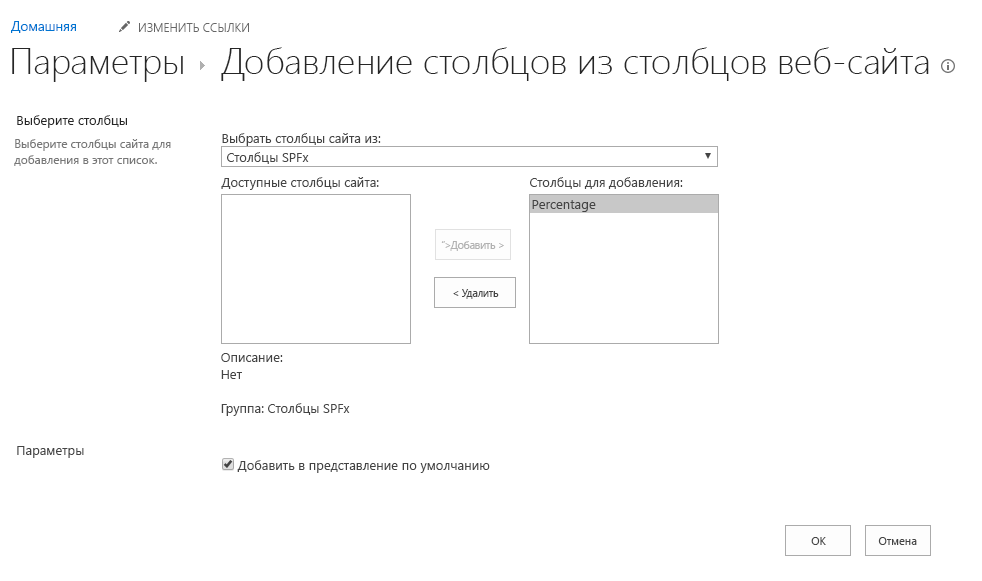

# <a name="build-your-first-field-customizer-extension"></a>Создание первого расширения для настройки полей

Расширения — это клиентские компоненты, которые запускаются в контексте страницы SharePoint. Расширения можно развертывать в SharePoint Online, а для их создания также можно использовать современные инструменты и библиотеки JavaScript.

В этой статье описано, как создать свое первое расширение для настройки полей. Эти действия также показаны в видео на [канале SharePoint PnP в YouTube](https://www.youtube.com/watch?v=fijOzUmlXrY&list=PLR9nK3mnD-OXtWO5AIIr7nCR3sWutACpV). 

<a href="https://www.youtube.com/watch?v=4wgZy5tm4yo">

</a>

## <a name="create-an-extension-project"></a>Создание проекта расширения

1. Создайте каталог проекта в любом расположении.
    
    ```
    md field-extension
    ```
    
2. Перейдите к каталогу проекта.
    
    ```
    cd field-extension
    ```
    
3. Создайте расширение HelloWorld, запустив генератор Yeoman для SharePoint.
    
    ```
    yo @microsoft/sharepoint
    ```
    
4. Когда появится запрос, выполните следующие действия:
    
    * Оставьте значение по умолчанию **field-extension** для имени решения и нажмите клавишу ВВОД.
    * Выберите **Только SharePoint Online (новая версия)** и нажмите клавишу ВВОД.
    * Выберите **Использовать текущую папку** и нажмите клавишу ВВОД.
    * Выберите **N**, чтобы сделать установку расширения обязательной на каждом сайте при его использовании.
    * Выберите **Расширение** в качестве типа создаваемого клиентского компонента. 
    * Выберите для создаваемого расширения тип **Настройщик полей**.
    
5. Далее вам потребуется указать определенные сведения о расширении:
     
    * Оставьте значение по умолчанию **HelloWorld** для имени решения и нажмите клавишу ВВОД.
    * Оставьте значение по умолчанию **Описание HelloWorld** для описания решения и нажмите клавишу ВВОД.
    * Оставьте платформу по умолчанию **Не использовать платформу веб-решений на базе JavaScript** и нажмите клавишу ВВОД. 
    
    <br/>
    
    
    
    После этого Yeoman установит необходимые зависимости и выполнит скаффолдинг файлов решения, а также расширения **HelloWorld**. Это может занять несколько минут. 
    
    Когда скаффолдинг успешно закончится, появится следующее сообщение:
    
    
    
    Сведения об устранении неполадок см. в статье [Известные проблемы](../../known-issues-and-common-questions.md).

6. После завершения скаффолдинга заблокируйте версию зависимостей проекта, выполнив следующую команду:

    ```sh
    npm shrinkwrap
    ```
    
7. Введите в консоли приведенную ниже команду, чтобы запустить Visual Studio Code.
    
    ```
    code .
    ```
    
    > **Примечание.** Клиентское решение SharePoint создано с помощью HTML и TypeScript, поэтому для разработки расширения можно использовать любой редактор кода, который поддерживает клиентское программирование.

    Обратите внимание на то, что структура решения выглядит как структура решения клиентских веб-частей структуры. Это основная структура решения среды SharePoint, ее параметры конфигурации схожи для всех типов решений.

    

8. Откройте файл **HelloWorldFieldCustomizer.manifest.json** в папке **src\extensions\helloWorld**.

    Этот файл определяет тип расширения и уникальный идентификатор `id` для расширения. Этот идентификатор пригодится позже при отладке и развертывании расширения в SharePoint.

    

## <a name="code-your-field-customizer"></a>Написание кода настройщика полей 

Откройте файл **HelloWorldFieldCustomizer.ts** в папке **src\extensions\helloWorld**.

Обратите внимание, что базовый класс для настройщика полей импортируется из пакета **sp-listview-extensibility**, который содержит код платформы SharePoint Framework, необходимый для настройщика полей.

```ts
import { Log } from '@microsoft/sp-core-library';
import { override } from '@microsoft/decorators';
import {
  BaseFieldCustomizer,
  IFieldCustomizerCellEventParameters
} from '@microsoft/sp-listview-extensibility';
```

Логика настройщика полей содержится в методах **OnInit()**, **onRenderCell()** и **onDisposeCell()**.

* В методе **onInit()** выполняется вся настройка, необходимая для расширения. Это событие происходит после назначения `this.context` и `this.properties`, но до того, как модель DOM будет готова. Как и в случае с веб-частями, `onInit()` возвращает обещание, с помощью которого можно выполнять асинхронные операции. `onRenderCell()` не будет вызываться, пока обещание не будет разрешено. Если вам это не нужно, просто верните `Promise.resolve<void>();`.
* **onRenderCell()** происходит при отображении каждой ячейки. Он предоставляет `event.domElement` HTML-элемент, где код может записать его содержимое.
* **onDisposeCell()** происходит непосредственно удалением `event.cellDiv`. Его можно использовать для освобождения ресурсов, которые были выделены во время отображения поля. Например, если подключить `onRenderCell()` к элементу Reach, для его освобождения необходимо использовать `onDisposeCell()`, в противном случае произойдет утечка ресурсов. 

Ниже представлено содержимое методов **onRenderCell()** и **onDisposeCell()** в решении по умолчанию.

```ts
@override
  public onRenderCell(event: IFieldCustomizerCellEventParameters): void {
    // Use this method to perform your custom cell rendering.
    const text: string = `${this.properties.sampleText}: ${event.fieldValue}`;

    event.domElement.innerText = text;

    event.domElement.classList.add(styles.cell);
  }

  @override
  public onDisposeCell(event: IFieldCustomizerCellEventParameters): void {
    // This method should be used to free any resources that were allocated during rendering.
    // For example, if your onRenderCell() called ReactDOM.render(), then you should
    // call ReactDOM.unmountComponentAtNode() here.
    super.onDisposeCell(event);
  }
```

## <a name="debug-your-field-customizer-using-gulp-serve-and-query-string-parameters"></a>Отладка настройщика полей с помощью gulp serve и параметров строки запроса
В настоящее время использование локального рабочего места для проверки расширений SharePoint Framework невозможно. Их необходимо проверить и разрабатывать с помощью действующего сайта SharePoint Online. Для этого вам не нужно развертывать модификацию каталога приложений, что делает процесс отладки простым и эффективным.

1. Для начала скомпилируйте код и разместите скомпилированные файлы с локального компьютера, выполнив следующую команду:
    
    ```
    gulp serve --nobrowser
    ```
    
    Так как запускать локальное рабочее место не требуется (в настоящее время невозможно выполнять отладку расширений локально), используется параметр `--nobrowser`.

    Когда компиляция кода завершится без ошибок, полученный манифест будет доступен по адресу http://localhost:4321.

    

2. Для тестирования расширения перейдите к сайту в клиенте SharePoint Online.

3. Откройте страницу **Содержимое сайта**.

4. На панели инструментов выберите **Создать**, а затем выберите **Список**.
    
    
    
5. Создайте список под названием **Заказы** и нажмите кнопку **Создать**.
    
    
    
6. Нажмите значок **плюс** и выберите **Число**, чтобы создать числовое поле для списка.
    
    
    
7. Для имени поля выберите **Процент**, а затем выберите **Сохранить**.
    
    
    
8. Добавьте несколько элементов с различными числами в процентное поле. Позже мы изменим отрисовку, чтобы разные числа отображались по-разному в соответствии с вашей реализацией.

    

    Так как настройщик полей размещается в localhost и запущен, доступны определенные параметры запроса отладки для выполнения кода в новом списке.

9. Добавьте в URL-адрес приведенные ниже параметры строки запроса. Обратите внимание, что вам потребуется обновить идентификатор в соответствии с идентификатором расширения, указанным в файле **HelloWorldFieldCustomizer.manifest.json**. Дополнительные сведения см. в статье [подробные сведения о URL-адрес запроса параметров](#more-details-about-the-url-query-parameters). 

    ```
    ?loadSPFX=true&debugManifestsFile=https://localhost:4321/temp/manifests.js&fieldCustomizers={"Percent":{"id":"45a1d299-990d-4917-ba62-7cb67158be16","properties":{"sampleText":"Hello!"}}}
    ```
    
    <br/>

    Полный URL-адрес должен выглядеть примерно так, как показано ниже, но соответствовать URL-адресу и расположению нового списка:
    
    <br/>
    
    ```
    contoso.sharepoint.com/Lists/Orders/AllItems.aspx?loadSPFX=true&debugManifestsFile=https://localhost:4321/temp/manifests.js&fieldCustomizers={"Percent":{"id":"45a1d299-990d-4917-ba62-7cb67158be16","properties":{"sampleText":"Hello!"}}}
    ```
    
10. Согласитесь на загрузку манифестов отладки, нажав кнопку **Загрузить скрипты отладки** при появлении соответствующего запроса.

    

    Обратите внимание, что значения процентов теперь отображаются с дополнительной строкой префикса как `Hello!: `, которая указана как свойство для настройщика полей.

    


### <a name="more-details-about-the-url-query-parameters"></a>Подробнее о параметрах запроса URL

- **loadSPFX=true** гарантирует загрузку SharePoint Framework на странице. Из соображений производительности платформа обычно загружается, только если зарегистрировано хотя бы одно расширение. Так как компоненты еще не зарегистрированы, платформу нужно загрузить напрямую.
- **debugManifestsFile** указывает, что нужно загрузить компоненты SPFx, предоставляемые локально. Загрузчик ищет компоненты только в каталоге приложений (для развернутого решения) и на сервере манифестов SharePoint (для системных библиотек).
- **fieldCustomizers** указывает поля в списке, отображение которых управляется настройщиком полей. Параметр ID задает GUID расширения, который будет использоваться для управления отображением поля. Параметр properties — это необязательным текстовая строка, содержащая объект JSON, который будет десериализован в `this.properties` для расширения.
    - **Key:** в качестве ключа используйте внутреннее имя поля.
    - **Id:** GUID расширения для настройки полей, связанный с этим полем.
    - **Properties:** значения свойств, определенные в расширении. В этом примере `sampleText` является свойством, определенным с помощью расширения.

<br/>

## <a name="enhance-the-field-customizer-rendering"></a>Улучшение отображения настройщика полей
Теперь, когда мы успешно протестировали встроенную отправную точку для создания настройщика полей, пришло время немного изменить логику для более аккуратной отрисовки значения поля. 

1. Откройте файл **HelloWorld.module.scss** в папке **src\extensions\helloWorld** и измените определение стиля, как показано ниже.

    ```
    .HelloWorld {
      .cell {
        display: 'inline-block';
      }
      .full {
        background-color: '#e5e5e5';
        width: '100px';
      }
    }

    ```
    
2. Откройте файл **HelloWorldFieldCustomizer.ts** в папке **src\extensions\helloWorld** и измените метод **onRednerCell**, как показано ниже.

    ```ts
        @override
        public onRenderCell(event: IFieldCustomizerCellEventParameters): void {

            event.domElement.classList.add(styles.cell);
            event.domElement.innerHTML = `
                    <div class='${styles.HelloWorld}'>
                        <div class='${styles.full}'>
                        <div style='width: ${event.fieldValue}px; background:#0094ff; color:#c0c0c0'>
                            &nbsp; ${event.fieldValue}
                        </div>
                        </div>
                    </div>`;
        }
    ```

3. В окне консоли не должно быть исключений. Если в *localhost* нет запущенного решения, выполните следующую команду:

    ```
    gulp serve --nobrowser
    ```

4. Вернитесь к созданному ранее списку и используйте тот же параметр запроса, что и раньше, с полем `Percent` и `ID`, замененным на идентификатор расширения, который указан в файле **HelloWorldFieldCustomizer.manifest.json**.

5. Согласитесь на загрузку манифестов отладки, нажав кнопку **Загрузить скрипты отладки** при появлении соответствующего запроса.

    

    Обратите внимание на то, как мы изменили стиль отображения поля, полностью. Значение поля обозначается с помощью графического представления значения.

    

## <a name="add-the-field-definition-to-the-solution-package-for-deployment"></a>Добавление определения поля в пакет решения для развертывания
Надлежащим образом протестировав решение в режиме отладки, можно упаковать его для автоматического развертывания в составе пакета решения, развертываемого на сайтах. 

1. Установите пакет решения на нужном сайте, чтобы манифест расширения попал в список разрешенных для запуска.

2. Связывание настройщика поля с существующим поле на сайте. Это можно сделать путем программирования (CSOM/REST) или с помощью функции платформы внутри пакета решения SharePoint Framework. Вам нужно связать следующие свойства в объекте `SPField` на уровне сайта или списка.
    - **ClientSiteComponentId:** идентификатор (GUID) настройщика приложений, установленный в каталоге приложений.
    - **ClientSideComponentProperties:** необязательный параметр, с помощью которого можно предоставлять свойства для экземпляра настройщика полей.

    Обратите внимание, что вы можете задать требования для добавления на сайт решения, содержащего расширение, с помощью параметра `skipFeatureDeployment` в **package-solution.json**. Хотя вы можете и не требовать установки решения на сайте, необходимо связать **ClientSideComponentId** с отдельными объектами, чтобы расширение было видимым.

    На следующих этапах мы просмотрим автоматически созданное определение поля по умолчанию, которое будет использоваться при автоматическом развертывании необходимых конфигураций при установке пакета решения на сайте.

3. Вернитесь к решению в Visual Studio Code (или другом редакторе, который вы используете).

4. Разверните папку **sharepoint** и вложенную папку **assets** в корне решения для просмотра существующего файла **elements.xml**. 
    
    

<br/>

### <a name="review-the-elementsxml-file"></a>Просмотр файла elements.xml 

Откройте файл **elements.xml** в папке **sharepoint\assets**.

Запишите следующую структуру XML в файл **elements.xml**:  Свойство **ClientSideComponentId** автоматически изменено в соответствии с уникальным идентификатором вашего настройщика полей в файле **HelloWorldFieldCustomizer.manifest.json** папки **src\extensions\helloWorld**.

```xml
<?xml version="1.0" encoding="utf-8"?>
<Elements xmlns="http://schemas.microsoft.com/sharepoint/">

    <Field ID="{060E50AC-E9C1-3D3C-B1F9-DE0BCAC200F6}"
            Name="SPFxPercentage"
            DisplayName="Percentage"
            Type="Number"
            Min="0"
            Required="FALSE"
            Group="SPFx Columns"
            ClientSideComponentId="7e7a4262-d02b-49bf-bfcb-e6ef1716aaef">
    </Field>

</Elements>
```

<br/>

### <a name="ensure-that-definitions-are-taken-into-account-within-the-build-pipeline"></a>Проверка учета определений в конвейере сборки

Откройте файл **package-solution.json** из папки **config**. В файле **package-solution.json** определяются метаданные пакета, как показано в следующем фрагменте кода:

```json
{
  "solution": {
    "name": "field-extension-client-side-solution",
    "id": "11cd343e-1ce6-462c-8acb-929804d0c3b2",
    "version": "1.0.0.0",
    "skipFeatureDeployment": false,
    "features": [{
      "title": "Field Extension - Deployment of custom field.",
      "description": "Deploys a custom field with ClientSideComponentId association",
      "id": "123fe847-ced2-3036-b564-8dad5c6c6e83",
      "version": "1.0.0.0",
      "assets": {        
        "elementManifests": [
          "elements.xml"
        ]
      }
    }]
  },
  "paths": {
    "zippedPackage": "solution/field-extension.sppkg"
  }
}

```

Чтобы убедиться, что файл **element.xml** учитывается при упаковке решения, требуется скаффолдинг по умолчанию для конфигурации, чтобы определить платформу функции для пакета решения.


## <a name="deploy-the-field-to-sharepoint-online-and-host-javascript-from-local-host"></a>Развертывание поля в SharePoint Online и размещение кода JavaScript с локального узла

Теперь все готово для развертывания решения на сайте SharePoint и автоматического добавления связывания в поле. 

1. Чтобы упаковать клиентское решение, содержащее расширение, и получить базовую структуру, готовую к упаковке, введите в окне консоли приведенную ниже команду.

    ```
    gulp bundle
    ```

2. Затем выполните следующую команду, чтобы создать пакет решения:

    ```
    gulp package-solution
    ```

    Эта команда создаст пакет в папке **sharepoint/solution**:

    ```
    field-extension.sppkg
    ```

3. Далее вам потребуется развернуть созданный пакет в каталоге приложений. Для этого перейдите к **каталогу приложений** вашего клиента и откройте библиотеку **Приложения для SharePoint**.

4. Отправьте или перетащите файл `field-extension.sppkg` из папки **sharepoint/solution** в каталог приложений. В SharePoint откроется диалоговое окно с запросом доверия клиентскому решению.

    Обратите внимание, что мы не обновляли URL-адреса для размещения решения в этом развертывании, поэтому URL-адрес по-прежнему указывает на https://localhost:4321. 
    
5. Нажмите кнопку **Развернуть**.

    

6. Перейдите на тот сайт, где требуется проверить подготовку ресурсов SharePoint. Это может быть любое семейство веб-сайтов в клиенте, где развернут пакет решения.

7. Нажмите значок шестеренки на верхней панели навигации справа и выберите команду **Добавить приложение**, чтобы перейти к странице "Приложения".

8. В поле **Поиск** введите **field** и нажмите клавишу ВВОД, чтобы отфильтровать приложения.

    

9. Выберите приложение **field-extension-client-side-solution**, чтобы установить решение на сайте. По завершении установки обновите страницу, нажав клавишу **F5**.

10. После установки решения нажмите кнопку **Создать** на панели инструментов страницы **Содержимое сайта** и выберите **Список**.

    

11. Создайте список под названием **Счета**.

12. Создав список, на странице **одержимое сайта** выберите **Параметры** из меню нового списка.

    

13. В разделе **Столбцы** выберите **Добавить из существующих столбцов сайта**.

14. В группе **Столбцы SPFx** выберите поле **Процент**, подготовленное с помощью пакета решения, и нажмите кнопку **ОК**.

    

15. На консоли убедитесь, что решение запущено. Если оно не работает, выполните следующую команду в папке решения:

    ```
    gulp serve --nobrowser
    ```

16. Выберите только что созданный список **Счета**. Добавьте в столбец "Процент" несколько новых элементов с разными значениями, чтобы увидеть, как поле отрисовывается без параметров запроса отладки.


В этом случае код JavaScript по-прежнему размещается в localhost, но вы также можете переместить ресурсы в любую сеть CDN и обновить URL-адрес, чтобы ресурсы JavaScript можно было загружать не только из localhost.

Публикация приложения не зависит от типа расширения. Чтобы обновить материалы для размещения в сети доставки содержимого, можно использовать эти этапы публикации: [Размещение расширения в сети доставки содержимого Office 365](./hosting-extension-from-office365-cdn.md).
