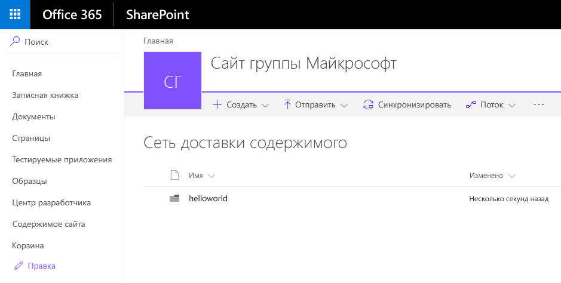
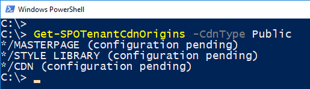

# <a name="hosting-extension-from-office-365-cdn-hello-world-part-4"></a>Размещение расширения из сети доставки содержимого Office 365 (Hello World, часть 4)

>**Примечание.** Расширения для платформы SharePoint Framework находятся на этапе тестирования и могут меняться. В настоящее время расширения SharePoint Framework невозможно использовать в рабочих средах.

Из этой статьи вы узнаете, как развернуть настройщик приложений SharePoint Framework для размещения из сети доставки содержимого Office 365, а затем в SharePoint для пользователей. Это продолжение серии статей о расширении Hello World. В предыдущей статье — [Развертывание расширения в SharePoint (Hello World, часть 3)](./using-page-placeholder-with-extensions.md) — описывалось размещение настройщика из localhost.

Перед началом работы убедитесь, что вы выполнили процедуры, описанные в предыдущих статьях:

* [Создание первого расширения SharePoint Framework (Hello World, часть 1)](./build-a-hello-world-extension.md)
* [Подключение клиентской веб-части к SharePoint (Hello World, часть 2)](./using-page-placeholder-with-extensions.md)
* [Развертывание расширения в SharePoint (Hello World, часть 3)](./serving-your-extension-from-sharepoint.md)

Эти действия также показаны в видео на [канале SharePoint PnP в YouTube](https://www.youtube.com/watch?v=oOIHWamPr34&list=PLR9nK3mnD-OXtWO5AIIr7nCR3sWutACpV). 

<a href="https://www.youtube.com/watch?v=oOIHWamPr34&list=PLR9nK3mnD-OXtWO5AIIr7nCR3sWutACpV">

</a>

## <a name="using-the-cdn-in-your-office-365-tenant"></a>Использование CDN в клиенте Office 365
Сеть доставки содержимого Office 365 — самый простой способ размещать решения SharePoint непосредственно из их клиента, пользуясь при этом преимуществами службы сетей доставки содержимого (CDN) для сокращения времени загрузки ресурсов.

## <a name="enabling-the-cdn-in-your-office-365-tenant"></a>Включение CDN в клиенте Office 365
Скачайте последнюю версию командной консоли SharePoint Online на [сайте загрузки Майкрософт](https://www.microsoft.com/en-us/download/details.aspx?id=35588).

Подключитесь к клиенту SharePoint Online с помощью PowerShell.
```
Connect-SPOService -Url https://contoso-admin.sharepoint.com
```

Чтобы узнать текущее состояние настроек общедоступной сети CDN для клиента, поочередно выполните указанные ниже команды. 
```
Get-SPOTenantCdnEnabled -CdnType Public
Get-SPOTenantCdnOrigins -CdnType Public
Get-SPOTenantCdnPolicies -CdnType Public
```
Включите общедоступную сеть доставки содержимого в клиенте.
```
Set-SPOTenantCdnEnabled -CdnType Public
```
Теперь в клиенте включена общедоступная CDN с использованием разрешенной конфигурации типов файлов по умолчанию. Это означает, что поддерживаются следующие типы файлов: CSS, EOT, GIF, ICO, JPEG, JPG, JS, MAP, PNG, SVG, TTF, WOFF.

Откройте браузер и перейдите к семейству веб-сайтов, в котором вы хотите разместить свою библиотеку CDN. Это может быть любое семейство веб-сайтов в клиенте. Это руководство описывает создание библиотеки CDN, но вы также можете использовать отдельную папку в любой существующей библиотеке документов как конечную точку CDN.

В семействе веб-сайтов создайте библиотеку документов **CDN** и добавьте в нее папку **helloworld**.

 

Вернитесь к консоли PowerShell и добавьте новый источник CDN. В этом случае мы задаем источник `*/cdn`, то есть в качестве источника CDN будет выступать любая относительная папка с именем **cdn**.
```
Add-SPOTenantCdnOrigin -CdnType Public -OriginUrl */cdn
```
Выполните указанную ниже команду, чтобы получить список источников CDN клиента.
```
Get-SPOTenantCdnOrigins -CdnType Public
```
Обратите внимание, что новый источник указан как допустимый источник CDN. Его настройка займет некоторое время (приблизительно 15 минут), поэтому мы пока можем создать тестовое расширение, которое будет размещено в источнике, когда развертывание завершится. 



> Если рядом с названием источника нет уведомления о *настройке в состоянии ожидания*, он готов к использованию в клиенте. Это указывает на выполняющуюся настройку SharePoint Online и системы CDN. 

## <a name="updating-your-solution-project-for-the-cdn-urls"></a>Обновление проекта решения для URL-адресов CDN
Вернитесь к ранее созданному решению, чтобы внести необходимые изменения в URL-адреса.
```
code .
```

Обновите файл *write-manifestests.json* (в папке *config*), как показано ниже, чтобы он указывал на конечную точку CDN. 

* Укажите префикс publiccdn.sharepointonline.com и добавьте к URL-адресу путь в клиенте.
* Формат URL-адреса для сети доставки содержимого:

```
https://publiccdn.sharepointonline.com/<tenant host name>/sites/site/library/folder
```


Сохраните изменения.

Выполните приведенные ниже задачи для упаковки решения.

* При этом будет выполнена сборка конечной версии проекта с использованием URL-адреса CDN, указанного в файле **writer-manifest.json**. Результат выполнения команды будет помещен в папку **./temp/deploy**. Эти файлы вам нужно будет добавить в папку SharePoint, представляющую собой конечную точку CDN. 

```
gulp bundle --ship
```

Выполните указанную ниже задачу, чтобы упаковать свое решение.

```
gulp package-solution --ship
```

Эта команда создаст пакет **app-extension.sppkg** в папке **sharepoint/solution**, а также подготовит ресурсы в папке **temp/deploy** к развертыванию в CDN.

Добавьте или перетащите новый пакет клиентского решения в каталог приложений в клиенте. Нажмите кнопку **Развернуть**.


Отправьте или перетащите файлы из папки **temp/deploy** в созданную ранее папку **CDN/helloworld**.

Установите новую версию решения на сайте и убедитесь, что она работает должным образом, если в *locahost* нет файла JavaScript.


Поздравляем! Вы включили общедоступную сеть CDN в клиенте Office 365 и воспользовались ею в решении!
