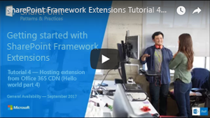
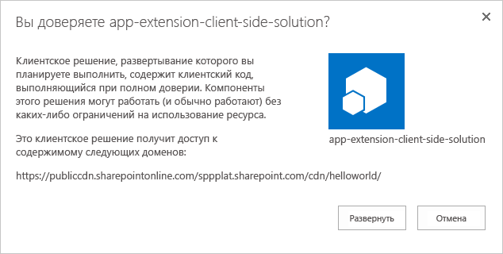
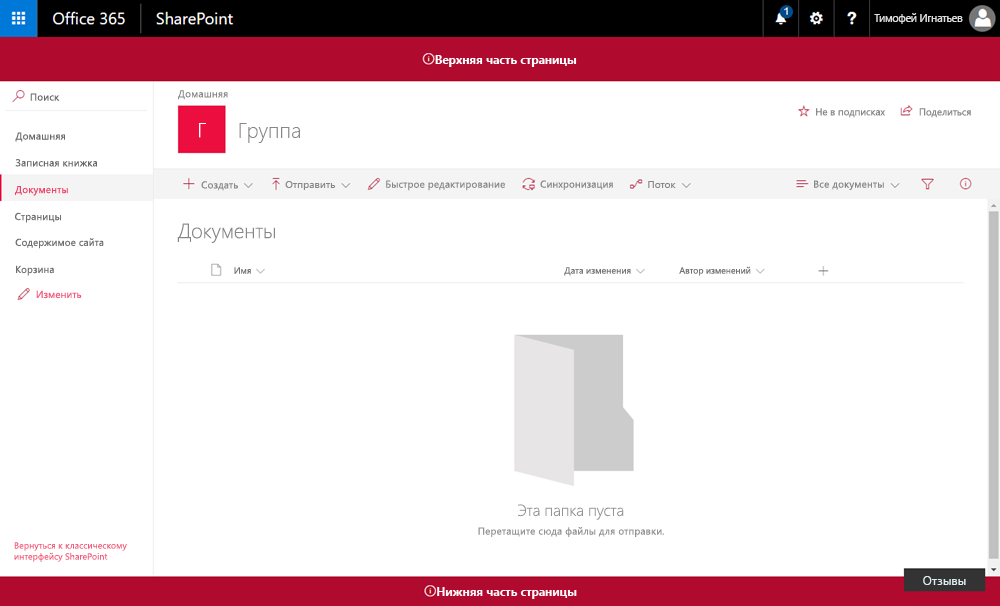

# <a name="host-extension-from-office-365-cdn-hello-world-part-4"></a><span data-ttu-id="e7a4f-103">Размещение расширения в сети доставки содержимого Office 365 (Hello World, часть 4)</span><span class="sxs-lookup"><span data-stu-id="e7a4f-103">Host extension from Office 365 CDN (Hello World part 4)</span></span>

<span data-ttu-id="e7a4f-104">В этой статье объясняется, как развернуть настройщик заполнителей SharePoint Framework для размещения в сети доставки содержимого Office 365 и как развернуть его в SharePoint для конечных пользователей.</span><span class="sxs-lookup"><span data-stu-id="e7a4f-104">This article describes how to deploy your SharePoint Framework Application Customizer to be hosted from an Office 365 CDN and how to deploy that to SharePoint for end users.</span></span> 

<span data-ttu-id="e7a4f-105">Перед началом работы необходимо выполнить процедуры, описанные в следующих статьях:</span><span class="sxs-lookup"><span data-stu-id="e7a4f-105">Be sure you have completed the procedures in the following articles before you begin:</span></span>

* [<span data-ttu-id="e7a4f-106">Создание первого расширения SharePoint Framework (Hello World, часть 1)</span><span class="sxs-lookup"><span data-stu-id="e7a4f-106">Build your first SharePoint Framework Extension (Hello World part 1)</span></span>](./build-a-hello-world-extension.md)
* [<span data-ttu-id="e7a4f-107">Использование заполнителей страниц из настройщика заполнителей (Hello World, часть 2)</span><span class="sxs-lookup"><span data-stu-id="e7a4f-107">Use page placeholders from Application Customizer (Hello World part 2)</span></span>](./using-page-placeholder-with-extensions.md)
* [<span data-ttu-id="e7a4f-108">Развертывание расширения в SharePoint (Hello World, часть 3)</span><span class="sxs-lookup"><span data-stu-id="e7a4f-108">Deploy your extension to SharePoint (Hello World part 3)</span></span>](./serving-your-extension-from-sharepoint.md)

<span data-ttu-id="e7a4f-109">Эти действия также показаны в видео на [канале SharePoint PnP в YouTube](https://www.youtube.com/watch?v=oOIHWamPr34&list=PLR9nK3mnD-OXtWO5AIIr7nCR3sWutACpV).</span><span class="sxs-lookup"><span data-stu-id="e7a4f-109">You can also follow these steps by watching the video on the [SharePoint PnP YouTube Channel](https://www.youtube.com/watch?v=oOIHWamPr34&list=PLR9nK3mnD-OXtWO5AIIr7nCR3sWutACpV).</span></span> 

<a href="https://www.youtube.com/watch?v=nh1qFArXG2Y">

</a>

## <a name="enable-the-cdn-in-your-office-365-tenant"></a><span data-ttu-id="e7a4f-110">Использование CDN в клиенте Office 365</span><span class="sxs-lookup"><span data-stu-id="e7a4f-110">Enable the CDN in your Office 365 tenant</span></span>

<span data-ttu-id="e7a4f-111">Сеть доставки содержимого Office 365 — самый простой способ размещать решения SharePoint непосредственно из их клиента, пользуясь при этом преимуществами службы сетей доставки содержимого (CDN) для сокращения времени загрузки ресурсов.</span><span class="sxs-lookup"><span data-stu-id="e7a4f-111">Office 365 CDN is the easiest way to host SharePoint Framework solutions directly from your tenant while still taking advantage of the Content Delivery Network (CDN) service for faster load times of your assets.</span></span>

1. <span data-ttu-id="e7a4f-112">Скачайте [командную консоль SharePoint Online](https://www.microsoft.com/en-us/download/details.aspx?id=35588), чтобы убедиться, что у вас установлена последняя версия.</span><span class="sxs-lookup"><span data-stu-id="e7a4f-112">Download the [SharePoint Online Management Shell](https://www.microsoft.com/en-us/download/details.aspx?id=35588) to ensure that you have the latest version.</span></span>

2. <span data-ttu-id="e7a4f-113">Подключитесь к клиенту SharePoint Online с помощью PowerShell:</span><span class="sxs-lookup"><span data-stu-id="e7a4f-113">Connect to your SharePoint Online tenant by using PowerShell:</span></span>
    
    ```powershell
    Connect-SPOService -Url https://contoso-admin.sharepoint.com
    ```
    
3. <span data-ttu-id="e7a4f-114">Чтобы узнать текущее состояние настроек общедоступной сети CDN для клиента, поочередно выполните указанные ниже команды.</span><span class="sxs-lookup"><span data-stu-id="e7a4f-114">Get the current status of public CDN settings from the tenant level by executing the following commands one-by-one:</span></span> 
    
    ```powershell
    Get-SPOTenantCdnEnabled -CdnType Public
    Get-SPOTenantCdnOrigins -CdnType Public
    Get-SPOTenantCdnPolicies -CdnType Public
    ```
    
4. <span data-ttu-id="e7a4f-115">Включите общедоступную сеть доставки содержимого в клиенте:</span><span class="sxs-lookup"><span data-stu-id="e7a4f-115">Enable public CDN in the tenant:</span></span>
    
    ```powershell
    Set-SPOTenantCdnEnabled -CdnType Public
    ```
    
    <span data-ttu-id="e7a4f-116">Теперь в клиенте включена общедоступная сеть доставки содержимого с использованием разрешенной конфигурации типов файлов по умолчанию.</span><span class="sxs-lookup"><span data-stu-id="e7a4f-116">Public CDN has now been enabled in the tenant by using the default file type configuration allowed.</span></span> <span data-ttu-id="e7a4f-117">Это означает, что поддерживаются такие расширения: CSS, EOT, CSS, EOT, GIF, ICO, JPEG, JPG, JS, MAP, PNG, SVG, TTF и WOFF.</span><span class="sxs-lookup"><span data-stu-id="e7a4f-117">This means that the following file type extensions are supported: CSS, EOT, GIF, ICO, JPEG, JPG, JS, MAP, PNG, SVG, TTF, and WOFF.</span></span>

5. <span data-ttu-id="e7a4f-p102">Откройте браузер и перейдите к семейству веб-сайтов, в котором вы хотите разместить свою библиотеку CDN. Это может быть любое семейство веб-сайтов в клиенте. Это руководство описывает создание библиотеки CDN, но вы также можете использовать отдельную папку в любой существующей библиотеке документов как конечную точку CDN.</span><span class="sxs-lookup"><span data-stu-id="e7a4f-p102">Open up a browser and move to a site collection where you'd like to host your CDN library. This could be any site collection in your tenant. In this tutorial, we create a specific library to act as your CDN library, but you can also use a specific folder in any existing document library as the CDN endpoint.</span></span>

6. <span data-ttu-id="e7a4f-121">В семействе веб-сайтов создайте библиотеку документов **CDN** и добавьте в нее папку **helloworld**.</span><span class="sxs-lookup"><span data-stu-id="e7a4f-121">Create a new document library on your site collection called **CDN**, and add a folder named **helloworld** to it.</span></span>
    
     
    
    <br/>
    
7. <span data-ttu-id="e7a4f-123">В консоли PowerShell добавьте новый источник сети доставки содержимого.</span><span class="sxs-lookup"><span data-stu-id="e7a4f-123">In the PowerShell console, add a new CDN origin.</span></span> <span data-ttu-id="e7a4f-124">В этом случае мы задаем источник `*/cdn`, то есть в качестве источника сети доставки содержимого будет выступать любая относительная папка с именем **cdn**.</span><span class="sxs-lookup"><span data-stu-id="e7a4f-124">In this case, we are setting the origin as `*/cdn`, which means that any relative folder with the name of **cdn** acts as a CDN origin.</span></span>
    
    ```powershell
    Add-SPOTenantCdnOrigin -CdnType Public -OriginUrl */cdn
    ```
    
8. <span data-ttu-id="e7a4f-125">Выполните указанную ниже команду, чтобы получить список источников сети доставки содержимого клиента:</span><span class="sxs-lookup"><span data-stu-id="e7a4f-125">Execute the following command to get the list of CDN origins from your tenant:</span></span>
    
    ```powershell
    Get-SPOTenantCdnOrigins -CdnType Public
    ```
    
    <span data-ttu-id="e7a4f-126">Обратите внимание, что новый источник указан как допустимый источник CDN.</span><span class="sxs-lookup"><span data-stu-id="e7a4f-126">Note that your newly added origin is listed as a valid CDN origin.</span></span> <span data-ttu-id="e7a4f-127">Окончательная настройка источника занимает приблизительно 15 минут, поэтому мы можем продолжить создавать расширение, которое будет размещено в источнике после развертывания.</span><span class="sxs-lookup"><span data-stu-id="e7a4f-127">Final configuration of the origin takes approximately 15 minutes, so we can continue creating your test extension, which is hosted from the origin after deployment is completed.</span></span> 

    

    <span data-ttu-id="e7a4f-129">Если рядом с названием источника нет уведомления `(configuration pending)`, он готов к использованию в клиенте.</span><span class="sxs-lookup"><span data-stu-id="e7a4f-129">When the origin is listed without the `(configuration pending)` text, it is ready to be used in your tenant.</span></span> <span data-ttu-id="e7a4f-130">Это указывает на выполняющуюся настройку SharePoint Online и системы CDN.</span><span class="sxs-lookup"><span data-stu-id="e7a4f-130">This indicates an on-going configuration between SharePoint Online and the CDN system.</span></span> 

## <a name="update-your-solution-project-for-the-cdn-urls"></a><span data-ttu-id="e7a4f-131">Обновление проекта решения для URL-адресов CDN</span><span class="sxs-lookup"><span data-stu-id="e7a4f-131">Update your solution project for the CDN URLs</span></span>

1. <span data-ttu-id="e7a4f-132">Вернитесь к ранее созданному решению, чтобы изменить URL-адреса.</span><span class="sxs-lookup"><span data-stu-id="e7a4f-132">Return to the previously created solution to perform the needed URL updates.</span></span>
    
2. <span data-ttu-id="e7a4f-133">Обновите файл **write-manifestests.json** (в папке **config**), как показано ниже, чтобы он указывал на конечную точку CDN.</span><span class="sxs-lookup"><span data-stu-id="e7a4f-133">Update the **write-manifests.json** file (under the **config** folder) as follows to point to your CDN endpoint.</span></span> <span data-ttu-id="e7a4f-134">Используйте `publiccdn.sharepointonline.com` в качестве префикса, а затем дополните URL-адрес фактическим путем к вашему клиенту.</span><span class="sxs-lookup"><span data-stu-id="e7a4f-134">Use `publiccdn.sharepointonline.com` as the prefix, and then extend the URL with the actual path of your tenant.</span></span> <span data-ttu-id="e7a4f-135">Формат URL-адреса для сети доставки содержимого:</span><span class="sxs-lookup"><span data-stu-id="e7a4f-135">The format of the CDN URL is as follows:</span></span>
    
    ```json
    https://publiccdn.sharepointonline.com/<tenant host name>/sites/site/library/folder
    ```
    
    

3. <span data-ttu-id="e7a4f-137">Сохраните изменения.</span><span class="sxs-lookup"><span data-stu-id="e7a4f-137">Save your changes.</span></span>

4. <span data-ttu-id="e7a4f-138">Выполните приведенные ниже задачи для упаковки решения.</span><span class="sxs-lookup"><span data-stu-id="e7a4f-138">Execute the following tasks to bundle your solution.</span></span> <span data-ttu-id="e7a4f-139">При этом будет выполнена сборка конечной версии проекта с использованием URL-адреса сети доставки содержимого, указанного в файле **writer-manifest.json**.</span><span class="sxs-lookup"><span data-stu-id="e7a4f-139">This executes a release build of your project using the CDN URL specified in the **write-manifests.json** file.</span></span> <span data-ttu-id="e7a4f-140">Результат будет помещен в папку **./temp/deploy**.</span><span class="sxs-lookup"><span data-stu-id="e7a4f-140">The output of this command is located in the **./temp/deploy** folder.</span></span> <span data-ttu-id="e7a4f-141">Эти файлы вам нужно будет добавить в папку SharePoint, представляющую собой конечную точку CDN.</span><span class="sxs-lookup"><span data-stu-id="e7a4f-141">These are the files that you need to upload to the SharePoint folder acting as your CDN endpoint.</span></span> 
    
    ```
    gulp bundle --ship
    ```
    
5. <span data-ttu-id="e7a4f-142">Выполните указанную ниже команду, чтобы упаковать решение.</span><span class="sxs-lookup"><span data-stu-id="e7a4f-142">Execute the following task to package your solution.</span></span> <span data-ttu-id="e7a4f-143">Эта команда создает пакет **app-extension.sppkg** в папке **sharepoint/solution** и подготавливает ресурсы в папке **temp/deploy** к развертыванию в CDN.</span><span class="sxs-lookup"><span data-stu-id="e7a4f-143">This command creates an **app-extension.sppkg** package in the **sharepoint/solution** folder, and prepares the assets in the **temp/deploy** folder to be deployed to the CDN.</span></span>
    
    ```
    gulp package-solution --ship
    ```
    
6. <span data-ttu-id="e7a4f-144">Добавьте или перетащите новый пакет клиентского решения в каталог приложений в клиенте и нажмите кнопку **Развернуть**.</span><span class="sxs-lookup"><span data-stu-id="e7a4f-144">Upload or drag-and-drop the newly created client-side solution package to the app catalog in your tenant, and then select the **Deploy** button.</span></span>

    

7. <span data-ttu-id="e7a4f-146">Отправьте или перетащите файлы из папки **temp/deploy** в созданную ранее папку **CDN/helloworld**.</span><span class="sxs-lookup"><span data-stu-id="e7a4f-146">Upload or drag-and-drop the files in the **temp/deploy** folder to the **CDN/helloworld** folder created earlier.</span></span>

8. <span data-ttu-id="e7a4f-147">Установите новую версию решения на сайте и убедитесь, что она работает без файла JavaScript в домене *locahost*.</span><span class="sxs-lookup"><span data-stu-id="e7a4f-147">Install the new version of the solution to your site, and ensure that it's working properly without your *locahost* hosting the JavaScript file.</span></span>

    

<br/>

<span data-ttu-id="e7a4f-149">Поздравляем! Вы включили общедоступную сеть CDN в клиенте Office 365 и воспользовались ею в решении!</span><span class="sxs-lookup"><span data-stu-id="e7a4f-149">Congratulations, you have enabled a public CDN in your Office 365 tenant and taken advantage of it from your solution!</span></span>

> [!NOTE]
> <span data-ttu-id="e7a4f-150">Если вы обнаружили ошибку в документации или SharePoint Framework, сообщите о ней разработчикам SharePoint, указав в [списке проблем для репозитория sp-dev-docs](https://github.com/SharePoint/sp-dev-docs/issues).</span><span class="sxs-lookup"><span data-stu-id="e7a4f-150">If you find an issue in the documentation or in the SharePoint Framework, report that to SharePoint engineering by using the [issue list at the sp-dev-docs repository](https://github.com/SharePoint/sp-dev-docs/issues).</span></span> <span data-ttu-id="e7a4f-151">Заранее спасибо!</span><span class="sxs-lookup"><span data-stu-id="e7a4f-151">Thanks for your input in advance.</span></span>

## <a name="see-also"></a><span data-ttu-id="e7a4f-152">См. также</span><span class="sxs-lookup"><span data-stu-id="e7a4f-152">See also</span></span>

- [<span data-ttu-id="e7a4f-153">Создание первого набора команд ListView</span><span class="sxs-lookup"><span data-stu-id="e7a4f-153">Build your first ListView Command Set extension</span></span>](./building-simple-cmdset-with-dialog-api.md)
- [<span data-ttu-id="e7a4f-154">Создание первого расширения для настройки полей</span><span class="sxs-lookup"><span data-stu-id="e7a4f-154">Build your first Field Customizer extension</span></span>](./building-simple-field-customizer.md)
- [<span data-ttu-id="e7a4f-155">Обзор расширений SharePoint Framework</span><span class="sxs-lookup"><span data-stu-id="e7a4f-155">Overview of SharePoint Framework Extensions</span></span>](../overview-extensions.md)