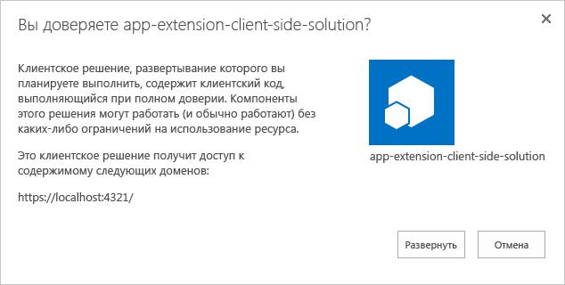
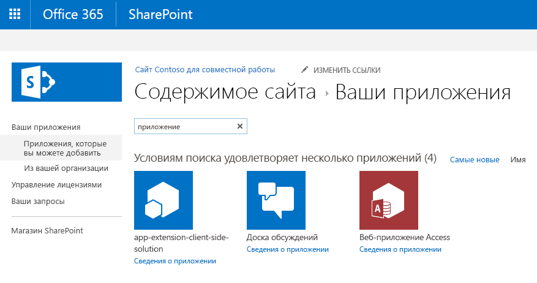

# <a name="deploy-your-extension-to-sharepoint-hello-world-part-3"></a>Развертывание расширения в SharePoint (Hello World, часть 3)

>**Примечание.** Расширения для платформы SharePoint Framework находятся на этапе тестирования и могут меняться. В настоящее время расширения SharePoint Framework невозможно использовать в рабочих средах.

Из этой статьи вы узнаете, как развернуть настройщик приложений SharePoint Framework в SharePoint и использовать его на современных страницах SharePoint. Это продолжение статьи о создании расширения Hello World: [Использование заполнителей страниц в настройщике приложений (Hello World, часть 2)](./using-page-placeholder-with-extensions.md).

Перед началом работы убедитесь, что вы выполнили процедуры, описанные в предыдущих статьях:

* [Создание первого расширения SharePoint Framework (Hello World, часть 1)](./build-a-hello-world-extension.md)
* [Использование заполнителей страниц в настройщике приложений (Hello World, часть 2)](./using-page-placeholder-with-extensions.md)

## <a name="package-the-helloworld-application-customizer"></a>Упаковка настройщика приложений helloWorld
В окне консоли перейдите к каталогу проекта расширения, создание которого описывается в статье [Создание первого расширения SharePoint Framework (Hello World, часть 1)](./build-a-hello-world-extension.md).

```
cd app-extension
```
Если команда gulp serve все еще выполняется, остановите ее с помощью клавиш `Ctrl+C`.

В отличие от режима **Отладка**, для использования расширения на современных серверных страницах SharePoint необходимо развернуть и зарегистрировать расширение для SharePoint в области `Site collection`, `Site` или `List`. Область определяет, где и как будет активироваться настройщик приложений. В этом конкретном случае мы зарегистрируем настройщик приложений в области `Site Collection`. 

Прежде чем упаковывать решение, нам нужно добавить необходимый для автоматической активации расширений на сайте код, который выполняется во время установки решения на сайте. В данном случае мы будем использовать элементы платформы компонентов для выполнения этих действий непосредственно в пакете решения, но вы также можете связать настройщик приложений с сайтом SharePoint с помощью REST или CSOM (например, во время подготовки сайта).

1. Установите пакет решения на нужном сайте, чтобы манифест расширения попал в список разрешенных для запуска.
2. Свяжите настройщик приложений с нужной областью. Это можно сделать программным способом (CSOM/REST) или с помощью платформы компонентов в пакете решения SharePoint Framework. Ниже перечислены свойства, которые необходимо связать с объектом `UserCustomAction` на уровне семейства веб-сайтов, сайта или списка.
    * **ClientSiteComponentId:** — это идентификатор (GUID) настройщика приложений, установленного в каталоге приложений. 
    * **ClientSideComponentProperties:** — это необязательный параметр, с помощью которого можно предоставлять свойства для экземпляра настройщика полей.

> Обратите внимание, что в настоящее время необходимо явно устанавливать пакеты решений на сайтах, чтобы расширения выполнялись должным образом. В будущем появятся альтернативные способы достижения этой цели без отдельного развертывания на каждом сайте. 

На следующих этапах мы создадим определение объекта `CustomAction`, которое затем будет автоматически развернуто с необходимыми параметрами при установке пакета решения на сайте. 

Вернитесь к пакету решения в Visual Studio Code (или другом редакторе, который вы используете).

Для начала необходимо создать папку **assets**, в которую мы поместим все ресурсы платформы компонентов, используемые для подготовки структур SharePoint при установке пакета.

* Создайте папку **sharepoint** в корневой папке решения.
* Создайте папку **assets** в только что созданной папке **sharepoint**.

Структура решения должна быть примерно такой, как на следующем рисунке:


### <a name="add-an-elementsxml-file-for-sharepoint-definitions"></a>Добавление файла element.xml для определений SharePoint

Создайте в папке **sharepoint\assets** файл **elements.xml**.

Скопируйте приведенную ниже структуру XML в файл **elements.xml**. Обязательно замените значение свойства **ClientSideComponentId** на уникальный идентификатор настройщика приложений, указанный в файле **HelloWorldApplicationCustomizer.manifest.json** в папке **src\extensions\helloWorld**.

Мы также задаем **ClientSideComponentProperties** и передаем свойства JSON для этого экземпляра расширения. Обратите внимание, что JSON отменяется, чтобы мы могли задать его должным образом в атрибуте XML. 

Кроме того, обратите внимание, что мы используем расположение `ClientSideExtension.ApplicationCustomizer`, чтобы определить решение как настройщик приложений. По умолчанию этот файл **elements.xml** будет связан с компонентом уровня *Web*, поэтому объект `CustomAction` будет автоматически добавлен в коллекцию `Web.UserCustomAction` на сайте, где устанавливается решение.

```xml
<?xml version="1.0" encoding="utf-8"?>
<Elements xmlns="http://schemas.microsoft.com/sharepoint/">

    <CustomAction 
        Title="SPFxApplicationCustomizer"
        Location="ClientSideExtension.ApplicationCustomizer"
        ClientSideComponentId="46606aa6-5dd8-4792-b017-1555ec0a43a4"
        ClientSideComponentProperties="{&quot;Header&quot;:&quot;Header area of the page&quot;,&quot;Footer&quot;:&quot;Footer area in the page&quot;}">

    </CustomAction>

</Elements>
```

### <a name="ensure-that-definitions-are-taken-into-account-within-the-build-pipeline"></a>Проверка учета определений в конвейере сборки

Откройте файл **package-solution.json** из папки **config**. В файле **package-solution.json** определяются метаданные пакета, как показано в следующем фрагменте кода:

```json
{
  "solution": {
    "name": "app-extension-client-side-solution",
    "id": "02d35a3e-5896-4664-874f-9fe9fdfe8408",
    "version": "1.0.0.0"
  },
  "paths": {
    "zippedPackage": "solution/app-extension.sppkg"
  }
}

```

Чтобы убедиться, что новый файл **element.xml** учитывается при упаковке решения, необходимо включить определение из платформы компонентов для пакета решения. Добавим определение JSON для нужного компонента в структуру решения, как показано ниже.

```json
{
  "solution": {
    "name": "app-extension-client-side-solution",
    "id": "02d35a3e-5896-4664-874f-9fe9fdfe8408",
    "version": "1.0.0.0",
    "features": [{
      "title": "Application Extension - Deployment of custom action.",
      "description": "Deploys a custom action with ClientSideComponentId association",
      "id": "456da147-ced2-3036-b564-8dad5c1c2e34",
      "version": "1.0.0.0",
      "assets": {        
        "elementManifests": [
          "elements.xml"
        ]
      }
    }]
  },
  "paths": {
    "zippedPackage": "solution/app-extension.sppkg"
  }
}

```

## <a name="deploy-the-extension-to-sharepoint-online-and-host-javascript-from-local-host"></a>Развертывание расширения в SharePoint Online и размещение кода JavaScript с локального узла

Теперь все готово для развертывания решения на сайте SharePoint и автоматического связывания с объектом `CustomAction` на уровне сайта.

Чтобы упаковать клиентское решение, содержащее расширение, и получить базовую структуру, готовую к упаковке, введите в окне консоли приведенную ниже команду.

```
gulp bundle
```

Затем выполните следующую команду, чтобы создать пакет решения:

```
gulp package-solution
```

Эта команда создаст пакет в папке **sharepoint/solution**:

```
app-extension.sppkg
```

Далее вам потребуется развернуть созданный пакет в каталоге приложений.

Перейдите к **каталогу приложений** вашего клиента и откройте библиотеку **Приложения для SharePoint**.

Отправьте или перетащите файл `app-extension.sppkg` из папки **sharepoint/solution** в каталог приложений. В SharePoint откроется диалоговое окно с предложением доверять клиентскому решению.

Обратите внимание, что мы не обновляли URL-адреса для размещения решения в этом развертывании, чтобы URL-адрес по-прежнему указывал на `https://localhost:4321`. Нажмите кнопку **Развернуть**.



Вернитесь к консоли и убедитесь, что решение запущено. Если это не так, выполните в папке решения следующую команду:

```
gulp serve --nobrowser
```

Перейдите на тот сайт, где требуется проверить подготовку ресурсов SharePoint. Это может быть любое семейство веб-сайтов в клиенте, где развернут пакет решения.

Нажмите значок шестеренки на верхней панели навигации справа и выберите команду **Добавить приложение**, чтобы перейти к странице "Приложения".

В поле **Поиск** введите **app** и нажмите клавишу *ВВОД*, чтобы отфильтровать приложения.



Выберите приложение **app-extension-client-side-solution**, чтобы установить его на сайте. По завершении установки обновите страницу, нажав клавишу **F5**.

После успешной установки приложения верхний и нижний колонтитулы будут отрисовываться так же, как и при использовании параметров запроса отладки.


## <a name="next-steps"></a>Дальнейшие действия

Поздравляем! Вы развернули расширение на современной странице SharePoint из каталога приложений! Вы можете продолжить создание расширения Hello World в следующей статье — [Размещение расширения из сети доставки содержимого Office 365 (Hello World, часть 4)](./hosting-extension-from-office365-cdn.md). Из нее вы узнаете, как развертывать ресурсы расширения в сети CDN, а не localhost, и загружать их из нее.
