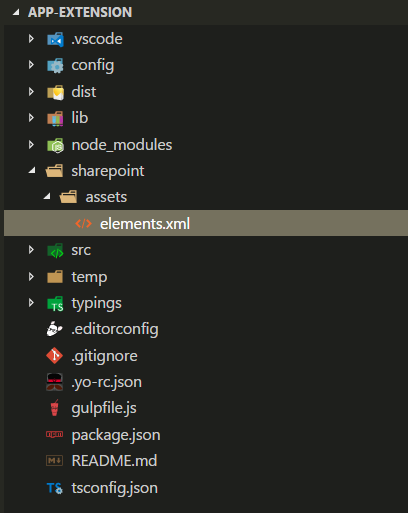

# <a name="deploy-your-extension-to-sharepoint-hello-world-part-3"></a>Развертывание расширения в SharePoint (Hello World, часть 3)

В этой статье рассказывается, как развернуть настройщик приложений для SharePoint Framework в SharePoint и проверить, работает ли он, на современных страницах SharePoint. В этой статье мы продолжим работу с расширением Hello World, которое мы создали в предыдущей статье [Использование заполнителей страниц из настройщика приложений (Hello World, часть 2)](./using-page-placeholder-with-extensions.md).

Перед началом работы выполните процедуры, которые описаны в указанных ниже статьях.

* [Создание первого расширения SharePoint Framework (Hello World, часть 1)](./build-a-hello-world-extension.md)
* [Использование заполнителей страниц из настройщика приложений (Hello World, часть 2)](./using-page-placeholder-with-extensions.md)

Эти действия также показаны в видео на [канале SharePoint PnP на YouTube](https://www.youtube.com/watch?v=P_yWI0WVQIg&list=PLR9nK3mnD-OXtWO5AIIr7nCR3sWutACpV). 

<a href="https://www.youtube.com/watch?v=DzHdVxLA3Pc">

</a>

## <a name="package-the-hello-world-application-customizer"></a>Упаковка настройщика приложений Hello World
В окне консоли перейдите в каталог проекта расширения, созданного при работе со статьей [Создание первого расширения SharePoint Framework (Hello World, часть 1)](./build-a-hello-world-extension.md).

```
cd app-extension
```
Если команда gulp serve все еще выполняется, остановите ее, нажав клавиши CTRL+C.

В отличие от работы в режиме **отладки**, чтобы использовать расширение на современных серверных страницах SharePoint, вам потребуется развернуть и зарегистрировать расширение в SharePoint в области `Site collection`, `Site` или `List`. То, где и как будет активен настройщик, определяется областью. В данном сценарии мы зарегистрируем настройщик приложений, используя область `Site collection`. 

Прежде чем упаковать решение, нам необходимо включить код для автоматизации активации решения при установке его на сайте. В данном случае мы воспользуемся элементами платформы компонентов, чтобы выполнить эти действия непосредственно в пакете решения, но вы, например, можете сопоставить настройщик приложений с сайтом SharePoint, используя REST или CSOM при подготовке сайта к работе.

1. Установите пакет решения на нужном сайте, чтобы манифест расширения попал в список разрешенных для запуска.

2. Сопоставление настройщика приложений с запланированной областью. Это можно выполнить программным путем (CSOM/REST) либо с помощью платформы компонента в пакете решения SharePoint Framework. Вам потребуется сопоставить указанные ниже свойства в объекте `UserCustomAction` на уровне семейства веб-сайтов, сайта или списка.
    * **ClientSiteComponentId:** это идентификатор (GUID) настройщика полей, установленного в каталоге приложений. 
    * **ClientSideComponentProperties:** это необязательный параметр, с помощью которого можно предоставлять свойства для экземпляра настройщика полей.
   
   Обратите внимание, что вы можете задавать требования для добавления на сайт решения, содержащего ваше расширение, с помощью параметра `skipFeatureDeployment` в файле **package-solution.json**. Хотя вы можете и не требовать установки решения на сайте, необходимо сопоставить идентификатор **ClientSideComponentId** с конкретными объектами, чтобы расширение было видимым. 
   
На следующих этапах мы рассмотрим определение `CustomAction`, которое было автоматически создано для решения при формировании шаблонов для включения решения при его установке на сайте. 
   
1. Вернитесь к пакету решения в Visual Studio Code (или другом редакторе, который вы используете).

2. Разверните папку **sharepoint** и вложенную папку **assets** в корневой папке решения. Отобразится существующий файл **elements.xml**. 

   

<br/>

### <a name="review-the-existing-elementsxml-file-for-sharepoint-definitions"></a>Проверка наличия определений SharePoint в существующем файле elements.xml

Проверьте существующую XML-структуру в файле **elements.xml**. Обратите внимание, что свойство **ClientSideComponentId** было автоматически обновлено на основании уникального идентификатора вашего настройщика приложений, доступного в файле **HelloWorldApplicationCustomizer.manifest.json** в папке **src\extensions\helloWorld**.

Кроме того, для параметра **ClientSideComponentProperties** этого экземпляра расширения были автоматически заданы структура, используемая по умолчанию, и свойства JSON. Запомните, как выполняется выход из объекта JSON, чтобы мы могли правильно настроить его в XML-атрибуте. 

Для определения настройщика приложений в конфигурации используется конкретное расположение объекта `ClientSideExtension.ApplicationCustomizer`. Так как по умолчанию этот файл **elements.xml** сопоставлен с компонентом с областью *Интернет*, это действие `CustomAction` будет автоматически добавлено в коллекцию `Web.UserCustomAction` на сайте, на котором устанавливается решение.

Чтобы обеспечить соответствие конфигурации обновлениям, выполняемым в настройщике приложений, измените параметр **ClientSideComponentProperties**, как показано в XML-структуре ниже. Учтите, что вам не следует копировать всю структуру, так как это приведет к несоответствию с идентификатором **ClientSideComponentId**.


```xml
<?xml version="1.0" encoding="utf-8"?>
<Elements xmlns="http://schemas.microsoft.com/sharepoint/">

    <CustomAction 
        Title="SPFxApplicationCustomizer"
        Location="ClientSideExtension.ApplicationCustomizer"
        ClientSideComponentId="46606aa6-5dd8-4792-b017-1555ec0a43a4"
        ClientSideComponentProperties="{&quot;Top&quot;:&quot;Top area of the page&quot;,&quot;Bottom&quot;:&quot;Bottom area in the page&quot;}">

    </CustomAction>

</Elements>
```

<br/>

### <a name="ensure-that-definitions-are-taken-into-account-within-the-build-pipeline"></a>Проверка того, учтены ли определения в конвейере сборки

Откройте файл **package-solution.json** в папке **config**. В файле **package-solution.json** определены метаданные пакета, как показано в следующем фрагменте кода:

```json

{
  "$schema": "https://dev.office.com/json-schemas/spfx-build/package-solution.schema.json",
  "solution": {
    "name": "app-extension-client-side-solution",
    "id": "98a9fe4f-175c-48c1-adee-63fb927faa70",
    "version": "1.0.0.0",
    "features": [
      {
        "title": "Application Extension - Deployment of custom action.",
        "description": "Deploys a custom action with ClientSideComponentId association",
        "id": "4678966b-de68-445f-a74e-e553a7b937ab",
        "version": "1.0.0.0",
        "assets": {
          "elementManifests": [
            "elements.xml"
          ]
        }
      }
    ]
  },
  "paths": {
    "zippedPackage": "solution/app-extension.sppkg"
  }
}


```

<br/>

Чтобы при упаковке решения учитывался файл **element.xml**, функция формирования шаблонов, используемая по умолчанию, добавляет необходимую конфигурацию, чтобы создать определение компонента платформы компонентов для пакета решения.

## <a name="deploy-the-extension-to-sharepoint-online-and-host-javascript-from-local-host"></a>Развертывание расширения в SharePoint Online и размещение кода JavaScript в локальном узле

Теперь мы готовы развернуть решение на сайте SharePoint и автоматически сопоставить действие `CustomAction` на уровне сайта.

1. Чтобы упаковать клиентское решение, содержащее расширение, и получить базовую структуру, готовую к упаковке, в окне консоли введите указанную ниже команду.

   ```
   gulp bundle
   ```

2. Выполните следующую команду, чтобы создать пакет решения:

   ```
   gulp package-solution
   ```

   Эта команда создаст пакет в папке **sharepoint/solution**:

   ```
   app-extension.sppkg
   ```

3. Теперь вам необходимо развернуть созданный пакет в каталоге приложений. Для этого перейдите в **каталог приложений** клиента и откройте библиотеку **Приложения для SharePoint**.

4. Отправьте или перетащите файл `app-extension.sppkg` из папки **sharepoint/solution** в каталог приложений. В SharePoint откроется диалоговое окно с запросом на подтверждение доверия клиентскому решению.

   Обратите внимание, что мы не изменяли URL-адреса для размещения решения в этом развертывании, поэтому по-прежнему используется URL-адрес `https://localhost:4321`. 
   
5. Нажмите кнопку **Развернуть**.

   

6. Вернитесь к консоли и убедитесь, что решение запущено. Если это не так, выполните в папке решения следующую команду:
   
   ```
   gulp serve --nobrowser
   ```
   
7. Перейдите на тот сайт, где требуется проверить подготовку ресурсов SharePoint. Это может быть любое семейство веб-сайтов в клиенте, где развернут пакет решения.

8. Щелкните значок с изображением шестеренки на верхней панели навигации справа и выберите команду **Добавить приложение**. Откроется страница "Приложения".

9. В поле **Поиск** введите **app**, а затем нажмите клавишу ВВОД, чтобы выполнить фильтрацию для ваших приложений.

   

10. Выберите приложение **app-extension-client-side-solution**, чтобы установить решение на сайте. По завершении установки обновите страницу, нажав клавишу **F5**.

После успешной установки приложения верхний и нижний колонтитулы будут отрисовываться так же, как и при использовании параметров запроса отладки.


## <a name="next-steps"></a>Дальнейшие действия

Поздравляем, вы развернули расширение на современной странице SharePoint из каталога приложений! Из следующей статьи [Размещение расширения из сети доставки содержимого Office 365 (Hello World, часть 4)](./hosting-extension-from-office365-cdn.md) вы узнаете, как развернуть и загрузить ресурсы расширения из сети CDN, а не из localhost.

> [!NOTE]
> Если вы обнаружили ошибку в документации или SharePoint Framework, сообщите о ней разработчикам SharePoint в [репозитории sp-dev-docs](https://github.com/SharePoint/sp-dev-docs/issues). Заранее спасибо!