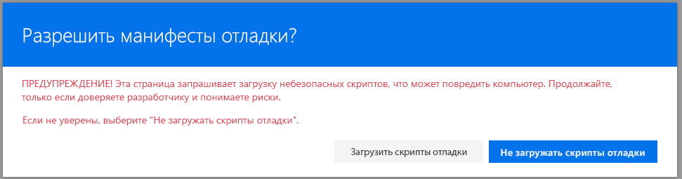

# <a name="using-page-placeholders-from-application-customizer-hello-world-part-2"></a>Использование заполнителей страниц в настройщике приложений (Hello World, часть 2)

>**Примечание.** Расширения для платформы SharePoint Framework находятся на этапе тестирования и могут меняться. В настоящее время расширения SharePoint Framework невозможно использовать в рабочих средах.

Настройщики приложений также предоставляют доступ к известным расположениям на странице, которые можно менять в соответствии с бизнес-требованиями и необходимыми функциями. К типичным примерам относятся динамические верхние и нижние колонтитулы, которые отображаются на всех страницах в SharePoint Online. 

Эта модель подобна использованию коллекции UserCustomAction в объекте Site или Web для связывания пользовательских ресурсов JavaScript и изменения внешнего вида страницы. Ключевое отличие (или преимущество) расширений SPFx заключается в том, что на странице гарантированно отображаются некоторые элементы независимо от изменений структуры HTML или модели DOM в будущих выпусках SharePoint Online.

В этой статье мы продолжим совершенствовать расширение Hello World, создание которого описывается в предыдущей статье, — [Создание первого расширения SharePoint Framework (Hello World, часть 1)](./build-a-hello-world-extension.md) — для использования заполнителей страниц.

Эти действия также показаны в видео на [канале SharePoint PnP в YouTube](https://www.youtube.com/watch?v=ipRw6o6bOTw&list=PLR9nK3mnD-OXtWO5AIIr7nCR3sWutACpV).

<a href="https://www.youtube.com/watch?v=ipRw6o6bOTw&list=PLR9nK3mnD-OXtWO5AIIr7nCR3sWutACpV">

</a>

## <a name="getting-access-to-page-placeholders"></a>Получение доступа к заполнителям страниц

Расширения настройщиков приложений поддерживаются в областях `Site`, `Web` и `List`. Вы можете управлять областью, выбирая, где и как настройщик приложений будет регистрироваться в клиенте SharePoint. Если настройщик приложений существует в области и отрисовывается, то вы можете получить доступ к заполнителю с помощью описанного ниже способа. Получив объект заполнителя, вы можете полностью контролировать элементы, которые видны пользователю.

Обратите внимание, что вы запрашиваете известный заполнитель по соответствующему известному идентификатору. В этом случае код получает доступ к разделу верхнего колонтитула страницы по идентификатору `PageHeader`. 

```ts
    // Handling the header placeholder
    if (!this._bottomPlaceholder) {
      this._bottomPlaceholder =
        this.context.placeholderProvider.tryCreateContent(
          PlaceholderName.Bottom,
          { onDispose: this._onDispose });
    ...
    }
```

На последующих этапах мы изменим созданный ранее настройщик приложений Hello World, чтобы получить доступ к заполнителям и изменить их содержимое, добавив к ним пользовательские элементы HTML.

Перейдите в Visual Studio Code (или другую интегрированную среду разработки) и откройте файл **src\extensions\helloWorld\HelloWorldApplicationCustomizer.ts.**

Добавьте объекты `PlaceholderContent` и `PlaceholderName` к оператору импорта из `@microsoft/sp-application-base`, изменив его следующим образом:

```ts
import {
  BaseApplicationCustomizer, 
  PlaceholderContent,
  PlaceholderName
} from '@microsoft/sp-application-base';
```

Кроме того, добавьте следующие операторы импорта после кода импорта `strings` в начале файла:

* На последующих этапах мы создадим определения стилей для выходных данных.
* Для отмены свойств настройщика приложений используется функция `escape`.  

```ts
import styles from './AppCustomizer.module.scss';
import { escape } from '@microsoft/sp-lodash-subset'; 
```

Создайте файл с именем **AppCustomizer.module.scss** в папке **src\extensions\helloWorld**. 

Измените файл **AppCustomizer.module.scss** следующим образом:

* Это стили, которые будут использоваться в выходном коде HTML для заполнителей верхнего и нижнего колонтитулов.

```css
.app {
  .top {
    height:60px;
    text-align:center;
    line-height:2.5;
    font-weight:bold;
    display: flex;
    align-items: center;
    justify-content: center;
  }

  .bottom {
    height:40px;
    text-align:center;
    line-height:2.5;
    font-weight:bold;
    display: flex;
    align-items: center;
    justify-content: center;
  }
}
```

Вернитесь к файлу **HelloWorldApplicationCustomizer.ts** и измените интерфейс **IHelloWorldApplicationCustomizerProperties**, добавив к нему свойства Header и Footer, как показано ниже.

* Если ваш набор команд использует входные данные ClientSideComponentProperties в формате JSON, он будет десериализован в объект `BaseExtension.properties`. Вы можете определить интерфейс для его описания.

```ts
export interface IHelloWorldApplicationCustomizerProperties {
  Top: string;
  Bottom: string;
}
```

Добавьте приведенные ниже частные переменные в класс **HelloWorldApplicationCustomizer**. В данном сценарии это могут быть обычные локальные переменные в методе `onRender`, но если вы хотите сделать их доступными другим объектам, вы можете определить их как частные переменные. 

```ts
export default class HelloWorldApplicationCustomizer
  extends BaseApplicationCustomizer<IHelloWorldApplicationCustomizerProperties> {
  
  // These have been added
  private _topPlaceholder: PlaceholderContent | undefined;
  private _bottomPlaceholder: PlaceholderContent | undefined;
```

Обновите код метода `onInit` как показано ниже.

```ts
  @override
  public onInit(): Promise<void> {
    Log.info(LOG_SOURCE, `Initialized ${strings.Title}`);

    // Added to handle possible changes on the existence of placeholders
    this.context.placeholderProvider.changedEvent.add(this, this._renderPlaceHolders);

    // Call render method for generating the needed html elements
    this._renderPlaceHolders();
    return Promise.resolve<void>();
  }
```


Создайте новый частный метод `_renderPlaceHolders` со следующим кодом:

* Мы используем метод `this.context.placeholderProvider.tryCreateContent` для доступа к заполнителю.
* Код расширения не должен предполагать, что нужный заполнитель доступен.
* Код ожидает настраиваемые свойства `Top` и `Bottom`. Если свойства существуют, они будут отрисовываться в заполнителях.
* Обратите внимание, что в приведенном ниже пути к коду для верхних и нижних заполнителей практически идентичны. Единственные отличия связаны с используемыми переменными и определениями стилей.

```ts
   private _renderPlaceHolders(): void {

    console.log('HelloWorldApplicationCustomizer._renderPlaceHolders()');
    console.log('Available placeholders: ',
      this.context.placeholderProvider.placeholderNames.map(name => PlaceholderName[name]).join(', '));

    // Handling the top placeholder
    if (!this._topPlaceholder) {
      this._topPlaceholder =
        this.context.placeholderProvider.tryCreateContent(
          PlaceholderName.Top,
          { onDispose: this._onDispose });

      // The extension should not assume that the expected placeholder is available.
      if (!this._topPlaceholder) {
        console.error('The expected placeholder (Top) was not found.');
        return;
      }

      if (this.properties) {
        let topString: string = this.properties.Top;
        if (!topString) {
          topString = '(Top property was not defined.)';
        }

        if (this._topPlaceholder.domElement) {
          this._topPlaceholder.domElement.innerHTML = `
                <div class="${styles.app}">
                  <div class="ms-bgColor-themeDark ms-fontColor-white ${styles.top}">
                    <i class="ms-Icon ms-Icon--Info" aria-hidden="true"></i> ${escape(topString)}
                  </div>
                </div>`;
        }
      }
    }

    // Handling the bottom placeholder
    if (!this._bottomPlaceholder) {
      this._bottomPlaceholder =
        this.context.placeholderProvider.tryCreateContent(
          PlaceholderName.Bottom,
          { onDispose: this._onDispose });

      // The extension should not assume that the expected placeholder is available.
      if (!this._bottomPlaceholder) {
        console.error('The expected placeholder (Bottom) was not found.');
        return;
      }

      if (this.properties) {
        let bottomString: string = this.properties.Bottom;
        if (!bottomString) {
          bottomString = '(Bottom property was not defined.)';
        }

        if (this._bottomPlaceholder.domElement) {
          this._bottomPlaceholder.domElement.innerHTML = `
                <div class="${styles.app}">
                  <div class="ms-bgColor-themeDark ms-fontColor-white ${styles.bottom}">
                    <i class="ms-Icon ms-Icon--Info" aria-hidden="true"></i> ${escape(bottomString)}
                  </div>
                </div>`;
        }
      }
    }
  }

```

Добавьте приведенный ниже метод после метода `_renderPlaceHolders`. В этом случае мы просто выводим сообщение в консоли, когда расширение удаляется со страницы. 

```ts
  private _onDispose(): void {
    console.log('[HelloWorldApplicationCustomizer._onDispose] Disposed custom top and bottom placeholders.');
  }
```

Теперь код готов к тестированию в SharePoint Online.

Перейдите в окно консоли, в котором запущена команда `gulp serve`, и проверьте наличие ошибок. Если gulp сообщил об ошибках, их нужно исправить.

Если в данный момент решение не запущено, выполните приведенную ниже команду и убедитесь, что не возникает никаких ошибок.

```
gulp serve --nobrowser
```

Перейдите ко встроенному списку в SharePoint Online. Это может быть список или библиотека для первоначального тестирования. 

Для тестирования расширения добавьте к URL-адресу следующие параметры строки запроса:

* Обратите внимание, что GUID, используемый в этом параметре запроса, должен совпадать с атрибутом ID настройщика приложений, указанным в файле **HelloWorldApplicationCustomizer.manifest.json**.
* Мы также используем свойства JSON Header и Footer, чтобы предоставлять параметры или модификации в настройщик приложений. В данном случае мы просто выводим эти значения, но вы можете настроить поведение в соответствии со свойствами, используемыми в рабочей среде. 

```
?loadSPFX=true&debugManifestsFile=https://localhost:4321/temp/manifests.js&customActions={"e5625e23-5c5a-4007-a335-e6c2c3afa485":{"location":"ClientSideExtension.ApplicationCustomizer","properties":{"Top":"Top area of the page","Bottom":"Bottom area in the page"}}}
```
Полный URL-адрес запроса должен выглядеть примерно так:

```
contoso.sharepoint.com/Lists/Contoso/AllItems.aspx?loadSPFX=true&debugManifestsFile=https://localhost:4321/temp/manifests.js&customActions={"e5625e23-5c5a-4007-a335-e6c2c3afa485":{"location":"ClientSideExtension.ApplicationCustomizer","properties":{"Top":"Top area of the page","Bottom":"Bottom area in the page"}}}
```



Нажмите кнопку **Загрузить скрипты отладки**, чтобы продолжить загрузку скриптов с локального узла.

Теперь на странице должно отображаться пользовательское содержимое верхнего и нижнего колонтитулов. 


## <a name="next-steps"></a>Дальнейшие действия
Поздравляем! Вы создали собственные верхний и нижний колонтитул с помощью настройщика приложений. Вы можете продолжить разработку расширения Hello World в следующей статье — [Развертывание расширения в семействе веб-сайтов (Hello World, часть 3)](./serving-your-extension-from-sharepoint.md). Вы научитесь развертывать и просматривать расширение Hello World в семействе веб-сайтов SharePoint, не используя параметры запроса **Debug**. 
