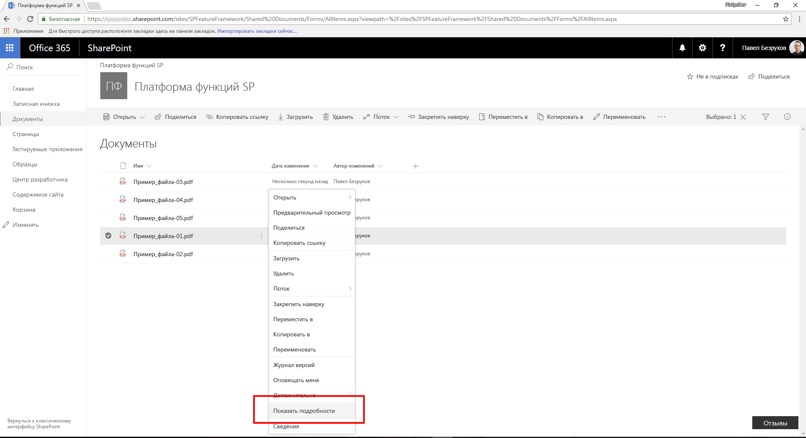
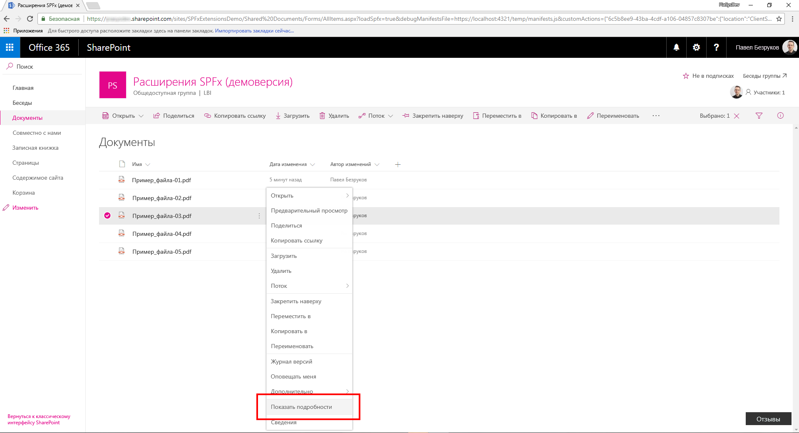
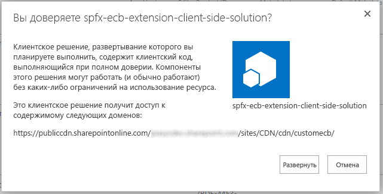
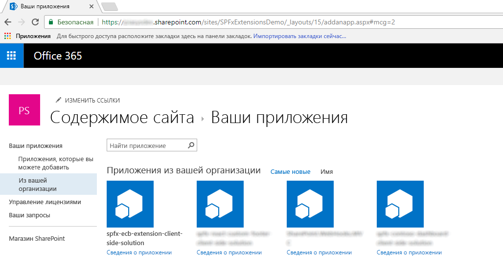

# <a name="migrating-from-edit-control-block-ecb-menu-item-to-sharepoint-framework-extensions"></a>Перенос пункта меню Edit Control Block (ECB) в расширения SharePoint Framework

За последние несколько лет в большинстве корпоративных решений на основе Office 365 и SharePoint Online для расширения пользовательского интерфейса страниц использовалась возможность _CustomAction_ для сайтов на платформе функций SharePoint. Однако на данный момент, с появлением "современного" пользовательского интерфейса SharePoint Online, большинство таких модификаций недоступно. К счастью, с помощью новых расширений SharePoint Framework вы можете реализовать подобные функции в "современном" пользовательском интерфейсе. Из данного руководства вы узнаете, как перейти от старых ("классических") модификаций к новой модели, основанной на расширениях SharePoint Framework.

> [!IMPORTANT]
> "Классический" интерфейс не объявляется устаревшим — он будет сосуществовать с "современным".

_**Область применения:** SharePoint Online_

## <a name="understanding-sharepoint-framework-extensions"></a>Общие сведения о расширениях SharePoint Framework
<a name="spfxExtensions"> </a> Для начала рассмотрим доступные разработчикам варианты расширений SharePoint Framework:

* **Настройщик приложений**. Расширьте встроенный "современный" пользовательский интерфейс SharePoint Online, добавив пользовательские элементы HTML и клиентский код в заранее определенные заполнители на "современных" страницах. На момент написания этой статьи заполнители доступны в верхнем и нижнем колонтитулах каждой "современной" страницы.
* **Набор команд**. Позволяет добавлять пользовательские пункты меню ECB и настраиваемые кнопки на панель команд или в представление списка или библиотеки. С этими командами можно связать любое действие JavaScript (TypeScript).
* **Настройщик полей**. Настройте отображение поля в представлении списка, используя настраиваемые элементы HTML и клиентский код.

Как вы могли понять из приведенных выше описаний, в нашем случае наиболее удобным вариантом будет расширение "Набор команд".

> [!NOTE]
> Дополнительные сведения о расширениях SharePoint Framework см. в статье ["Обзор расширений SharePoint Framework"](https://docs.microsoft.com/ru-RU/sharepoint/dev/spfx/extensions/overview-extensions).

## <a name="migrating-a-ecb-to-an-spfx-command-set"></a>Переход от ECB к набору команд SPFx
<a name="FromECBtoCommandSet"> </a> Предположим, у вас есть элемент _CustomAction_ в SharePoint Online, необходимый для создания пункта меню ECB для документов в библиотеке. Назначение пункта меню ECB — открытие настраиваемой страницы с предоставлением идентификаторов списка и выбранного в текущий момент пункта в строке запроса целевой страницы.
Ниже представлен фрагмент кода XML, в котором определяется этот элемент _CustomAction_ на платформе функций SharePoint.

```XML
<?xml version="1.0" encoding="utf-8"?>
<Elements xmlns="http://schemas.microsoft.com/sharepoint/">
  <CustomAction Id="OpenDetailsPageWithItemReference"
                Title="Show Details"
                Description="Opens a new page with further details about the currently selected item"
                Sequence="1001"
                RegistrationType="List"
                RegistrationId="101"                
                Location="EditControlBlock">
    <UrlAction Url="ShowDetails.aspx?ID={ItemId}&amp;List={ListId}" />
  </CustomAction>
</Elements>
```

Как видите, в файле элементов функции определяется элемент типа _CustomAction_, чтобы добавлять новый пункт в расположении _EditControlBlock_ (т. е. ECB) для любого документа в любой библиотеке (для параметра _RegistrationType_ задано значение _List_, а для параметра _RegistrationId_ — значение _101_).

На приведенном ниже рисунке представлены выходные данные вышеописанного дополнительного действия в представлении списка для библиотеки.



Обратите внимание, что настраиваемый элемент ECB на платформе функций SharePoint также работает в "современном" списке. На самом деле, если не использовать код JavaScript, то дополнительное действие для списков будет работать и в "современных" списках.

Чтобы перенести представленное выше решение на платформу SharePoint Framework, необходимо выполнить указанные ниже действия.

### <a name="create-a-new-sharepoint-framework-solution"></a>Создание решения SharePoint Framework
<a name="CreateCommandSet"> </a> Подготовив среду разработки к созданию решений SharePoint Framework, вы можете приступить к созданию расширения SharePoint Framework, выполнив действия, описанные в статье ["Как настроить среду разработки клиентских веб-частей SharePoint"](https://docs.microsoft.com/ru-RU/sharepoint/dev/spfx/set-up-your-development-environment).

1. Откройте любое средство командной строки (PowerShell, CMD.EXE, Cmder и т. д.), создайте папку для решения (назовите ее _spfx-ecb-extension_) и создайте решение SharePoint Framework, запустив генератор Yeoman с помощью следующей команды:

```
yo @microsoft/sharepoint
```

При появлении соответствующих запросов укажите следующие параметры:
* Оставьте имя решения по умолчанию (_spfx-ecb-extension_) и нажмите клавишу ВВОД.
* Выберите SharePoint Online only (latest) (Только SharePoint Online, последняя версия) и нажмите клавишу ВВОД.
* Выберите Use the current folder (Использовать текущую папку) и нажмите клавишу ВВОД.
* Выберите N, чтобы сделать установку расширения обязательной на каждом сайте при его использовании.
* Выберите Extension (Расширение) в качестве типа создаваемого клиентского компонента.
* Выберите для создаваемого расширения тип _ListView Command Set_.
* Укажите имя CustomECB для набора команд.


На этом этапе Yeoman установит необходимые зависимости и сформирует шаблон файлов и папок решения вместе с расширением _CustomFooter_. Это может занять несколько минут.

После успешного формирования шаблона должно появиться следующее сообщение:


2. Чтобы заблокировать версию зависимостей проекта, выполните следующую команду:

```
npm shrinkwrap
```

3. Теперь запустите Visual Studio Code (или другой редактор кода) и начните разработку решения. Чтобы запустить Visual Studio Code, можно выполнить приведенный ниже оператор.

```
code .
```

### <a name="define-the-new-ecb-item"></a>Определение нового элемента ECB
<a name="DefineCommandSetECB"> </a> Чтобы воспроизвести такое поведение пункта меню ECB, созданного с помощью платформы функций SharePoint, достаточно реализовать такую же логику с помощью клиентского кода в новом решении SharePoint Framework. Чтобы выполнить эту задачу, сделайте следующее:

1. Для начала откройте файл _CustomEcbCommandSet.manifest.json_ в папке _src/extensions/customEcb_. Скопируйте значение свойства _id_ и сохраните его в надежном месте, так как оно потребуется позже.

2. В том же файле измените массив _items_ в нижней части файла, чтобы определить одну команду для набора команд. Вызовите команду _ShowDetails_, указав название и тип команды. На приведенном ниже снимке экрана показано, как должен выглядеть файл манифеста.


3. Теперь откройте файл _CustomEcbCommandSet.ts_ в той же папке и измените его содержимое в соответствии с приведенным ниже фрагментом кода.

``` TypeScript
import { Guid } from '@microsoft/sp-core-library';
import { override } from '@microsoft/decorators';
import {
  BaseListViewCommandSet,
  Command,
  IListViewCommandSetListViewUpdatedParameters,
  IListViewCommandSetExecuteEventParameters
} from '@microsoft/sp-listview-extensibility';
import { Dialog } from '@microsoft/sp-dialog';

import * as strings from 'CustomEcbCommandSetStrings';

export interface ICustomEcbCommandSetProperties {
  targetUrl: string;
}

export default class CustomEcbCommandSet extends BaseListViewCommandSet<ICustomEcbCommandSetProperties> {

  @override
  public onInit(): Promise<void> {
    return Promise.resolve();
  }

  @override
  public onListViewUpdated(event: IListViewCommandSetListViewUpdatedParameters): void {
    const compareOneCommand: Command = this.tryGetCommand('ShowDetails');
    if (compareOneCommand) {
      // This command should be hidden unless exactly one row is selected.
      compareOneCommand.visible = event.selectedRows.length === 1;
    }
  }

  @override
  public onExecute(event: IListViewCommandSetExecuteEventParameters): void {
    switch (event.itemId) {
      case 'ShowDetails':

        const itemId: number = event.selectedRows[0].getValueByName("ID");
        const listId: Guid = this.context.pageContext.list.id;

        window.location.replace(`${this.properties.targetUrl}?ID=${itemId}&List=${listId}`);

        break;
      default:
        throw new Error('Unknown command');
    }
  }
}
```

Обратите внимание на оператор _import_ в самом начале файла. Он необходим, чтобы ссылаться на тип _Guid_, который будет использоваться для хранения идентификатора текущего списка. Более того, в интерфейсе _ICustomEcbCommandSetProperties_ объявляется одно свойство с именем _targetUrl_, с помощью которого можно предоставить URL-адрес целевой страницы, открываемой при выборе пункта меню ECB.
Переопределенный метод _onExecute_ выполняет дополнительное действие. Обратите внимание на фрагмент кода, считывающий идентификатор выбранного элемента из аргумента _event_, и идентификатор исходного списка из объекта _pageContext_.
Наконец, обратите внимание на переопределение метода _onListViewUpdated_, который по умолчанию включал команду _ShowDetails_, только если выбран один элемент.

Перенаправление на целевой URL-адрес выполняется с помощью классического кода JavaScript и функции _window.location.replace_. Конечно, вы можете написать любой код TypeScript в методе _onExecute_. В качестве примера можно использовать платформу диалоговых окон SharePoint Framework, чтобы открыть новое диалоговое окно и взаимодействовать с пользователями.

> [!NOTE]
> Дополнительные сведения о платформе диалоговых окон SharePoint Framework см. в документе [Использование настраиваемых диалоговых окон с расширениями SharePoint Framework](https://docs.microsoft.com/ru-RU/sharepoint/dev/spfx/extensions/guidance/using-custom-dialogs-with-spfx).

На приведенном ниже рисунке показаны выходные данные.



### <a name="test-the-solution-in-debug-mode"></a>Тестирование решения в режиме отладки
<a name="DebugCommandSet"> </a> Теперь все готово к тестированию решения в режиме отладки. 

1. Вернитесь к окну консоли и выполните следующую команду:

```
gulp serve --nobrowser
```

Приведенная выше команда выполняет сборку решения и запускает локальный сервер Node.js для его размещения.

2. Теперь откройте любой браузер и перейдите к "современной" библиотеке на любом "современном" сайте группы. Затем добавьте приведенные ниже параметры строки запроса к URL-адресу страницы _AllItems.aspx_.

```
?loadSpfx=true&debugManifestsFile=https://localhost:4321/temp/manifests.js&customActions={"6c5b8ee9-43ba-4cdf-a106-04857c8307be":{"location":"ClientSideExtension.ListViewCommandSet.ContextMenu","properties":{"targetUrl":"ShowDetail.aspx"}}}
```

В приведенной выше строке запроса необходимо заменить GUID на сохраненное ранее значение _id_ из файла _CustomEcbCommandSet.manifest.json_. Кроме того, доступно свойство _location_, которое принимает значение _ClientSideExtension.ListViewCommandSet.ContextMenu_. При этом SPFx отрисовывает набор команд в виде пункта меню ECB. Допустимые значения свойства _location_:
* **ClientSideExtension.ListViewCommandSet.ContextMenu** — контекстное меню элементов;
* **ClientSideExtension.ListViewCommandSet.CommandBar** — меню верхнего уровня для набора команд в списке или библиотеке;
* **ClientSideExtension.ListViewCommandSet** — контекстное меню и панель команд (соответствует параметру SPUserCustomAction.Location="CommandUI.Ribbon").

Наконец, в строке запроса есть свойство _properties_, представляющее сериализацию JSON для объекта типа _ICustomEcbCommandSetProperties_ — типа настраиваемых свойств, запрашиваемых настраиваемым набором команд для отрисовки.

Обратите внимание, что при выполнении запроса страницы появится окно с предупреждающим сообщением "Разрешить скрипты отладки?", где из соображений безопасности спрашивается ваше согласие на запуск кода с localhost. Конечно, если вы хотите отладить и протестировать решение локально, потребуется разрешить загрузку скриптов отладки.

### <a name="package-and-host-the-solution"></a>Упаковка и размещение решения
<a name="PackageAndHostCommandSet"> </a> Если вы довольны результатом, теперь можно упаковать решение и разместить его в настоящей инфраструктуре.
Прежде чем собирать пакет, необходимо объявить XML-файл платформы функций для подготовки расширения.

#### <a name="review-feature-framework-elements"></a>Обзор элементов платформы функций
В редакторе кода откройте вложенную папку _/sharepoint/assets_ в папке решения и измените файл _elements.xml_.
В приведенном ниже фрагменте кода показано, как должен выглядеть файл.

```XML
<?xml version="1.0" encoding="utf-8"?>
<Elements xmlns="http://schemas.microsoft.com/sharepoint/">
    <CustomAction
        Title="CustomEcb"
        RegistrationId="101"
        RegistrationType="List"
        Location="ClientSideExtension.ListViewCommandSet.ContextMenu"
        ClientSideComponentId="6c5b8ee9-43ba-4cdf-a106-04857c8307be"
        ClientSideComponentProperties="{&quot;targetUrl&quot;:&quot;ShowDetails.aspx&quot;}">
    </CustomAction>
</Elements>
```

Как видите, он напоминает файл платформы функций SharePoint из "классической" модели, но использует атрибут _ClientSideComponentId_, чтобы ссылаться на свойство _id_ настраиваемого расширения, и атрибут _ClientSideComponentProperties_, чтобы настраивать необходимые решению настраиваемые свойства конфигурации.

Теперь откройте файл _package-solution.json_ в папке _/config_ решения. В файле вы увидите ссылку на файл _elements.xml_ в разделе _assets_.

```JSON
{
  "$schema": "https://dev.office.com/json-schemas/spfx-build/package-solution.schema.json",
  "solution": {
    "name": "spfx-ecb-extension-client-side-solution",
    "id": "b8ff6fdf-16e9-4434-9fdb-eac6c5f948ee",
    "version": "1.0.2.0",
    "features": [
      {
        "title": "Custom ECB Menu Item.",
        "description": "Deploys a custom ECB menu item sample extension",
        "id": "f30a744c-6f30-4ccc-a428-125a290b5233",
        "version": "1.0.0.0",
        "assets": {
          "elementManifests": [
            "elements.xml"
          ]
        }
      }
    ]
  },
  "paths": {
    "zippedPackage": "solution/spfx-ecb-extension.sppkg"
  }
}
```

#### <a name="enable-the-cdn-in-your-office-365-tenant"></a>Включение сети доставки содержимого (CDN) в клиенте Office 365
Теперь необходимо разместить расширение в среде внешнего размещения. Сеть доставки содержимого Office 365 — самый простой способ размещать решения SharePoint непосредственно из их клиента, пользуясь при этом преимуществами службы сетей доставки содержимого (CDN) для сокращения времени загрузки ресурсов.

1. Скачайте [командную консоль SharePoint Online](https://www.microsoft.com/en-us/download/details.aspx?id=35588), чтобы убедиться, что у вас установлена последняя версия.

2. Подключитесь к клиенту SharePoint Online с помощью PowerShell:
    
    ```
    Connect-SPOService -Url https://[tenant]-admin.sharepoint.com
    ```
    
3. Чтобы узнать текущее состояние настроек общедоступной сети CDN для клиента, поочередно выполните указанные ниже команды. 
    
    ```
    Get-SPOTenantCdnEnabled -CdnType Public
    Get-SPOTenantCdnOrigins -CdnType Public
    Get-SPOTenantCdnPolicies -CdnType Public
    ```
    
4. Включите общедоступную сеть доставки содержимого в клиенте:
    
    ```
    Set-SPOTenantCdnEnabled -CdnType Public
    ```
    
    Теперь в клиенте включена общедоступная сеть доставки содержимого с использованием разрешенной конфигурации типов файлов по умолчанию. Это означает, что поддерживаются такие расширения: CSS, EOT, CSS, EOT, GIF, ICO, JPEG, JPG, JS, MAP, PNG, SVG, TTF и WOFF.

5. Откройте браузер и перейдите к семейству веб-сайтов, в котором вы хотите разместить свою библиотеку CDN. Это может быть любое семейство веб-сайтов в клиенте. Это руководство описывает создание библиотеки CDN, но вы также можете использовать отдельную папку в любой существующей библиотеке документов как конечную точку CDN.

6. В семействе веб-сайтов создайте библиотеку документов _CDN_ и добавьте в нее папку _customecb_.
    
7. В консоли PowerShell добавьте новый источник сети доставки содержимого. В этом случае мы задаем источник `*/cdn`, то есть в качестве источника сети доставки содержимого (CDN) будет выступать любая относительная папка с именем _cdn_.
    
    ```
    Add-SPOTenantCdnOrigin -CdnType Public -OriginUrl */cdn
    ```
    
8. Выполните следующую команду, чтобы получить список источников сетей CDN из клиента:
    
    ```
    Get-SPOTenantCdnOrigins -CdnType Public
    ```
    
Обратите внимание, что новый источник указан как допустимый источник сети доставки содержимого. Настройка источника займет некоторое время (приблизительно 15 минут), поэтому мы пока можем подготовить к работе расширение, которое будет размещено в источнике по завершении развертывания. 


Если рядом с названием источника нет уведомления `(configuration pending)`, он готов к использованию в клиенте. Это указывает на выполняющуюся настройку SharePoint Online и системы CDN. 

#### <a name="update-the-solution-settings-and-publish-it-on-the-cdn"></a>Обновление параметров решения и его публикация в сети доставки содержимого
Теперь необходимо обновить решение для использования только что созданной сети CDN в качестве среды внешнего размещения и опубликовать в ней пакет решения. Чтобы выполнить эту задачу, выполните указанные ниже действия.

1. Вернитесь к ранее созданному решению, чтобы внести необходимые изменения в URL-адреса.
    
2. Обновите файл _write-manifestests.json_ (в папке _config_), как показано ниже, чтобы он указывал на конечную точку CDN. Используйте префикс `publiccdn.sharepointonline.com`, а затем дополните URL-адрес фактическим путем к вашему клиенту. Формат URL-адреса для сети доставки содержимого:
    
    ```
    https://publiccdn.sharepointonline.com/[tenant host name]/sites/[site]/[library]/[folder]
    ```
    
    

3. Сохраните изменения.

4. Выполните описанную ниже задачу для упаковки решения. При этом будет выполнена сборка конечной версии проекта с использованием URL-адреса CDN, указанного в файле _writer-manifest.json_. Результат будет помещен в папку _./temp/deploy_. Эти файлы вам нужно будет добавить в папку SharePoint, представляющую собой конечную точку CDN. 
    
    ```
    gulp bundle --ship
    ```
    
5. Выполните приведенную ниже задачу, чтобы упаковать решение. Эта команда создаст пакет _spfx-ecb-extension.sppkg_ в папке _sharepoint/solution_, а также подготовит ресурсы в папке _temp/deploy_ к развертыванию в CDN.
    
    ```
    gulp package-solution --ship
    ```
    
6. Добавьте или перетащите новый пакет клиентского решения в каталог приложений в клиенте, а затем нажмите кнопку _Развернуть_.

    

7. Отправьте или перетащите файлы из папки _temp/deploy_ в созданную ранее папку _CDN/customfooter_.

### <a name="install-and-run-the-solution"></a>Установка и запуск решения
<a name="InstallCommandSet"> </a> Теперь вы можете установить решения на любом целевом "современном" сайте.

1. Откройте браузер и перейдите на любой "современный" сайт.

2. Перейдите на страницу _Контент сайта_ и добавьте новое _приложение_.

3. Установите новое приложение _из вашей организации_, чтобы просмотреть решения, доступные в _каталоге приложений_.

4. Выберите решение _spfx-ecb-extension-client-side-solution_ и установите его на целевом сайте.

    

5. По завершении установки приложения откройте библиотеку _Документы_ на сайте. Выбрав один документ, вы увидите пользовательский пункт меню ECB в действии.

Поздравляем! Вы создали пункт меню ECB с помощью расширений SharePoint Framework.
