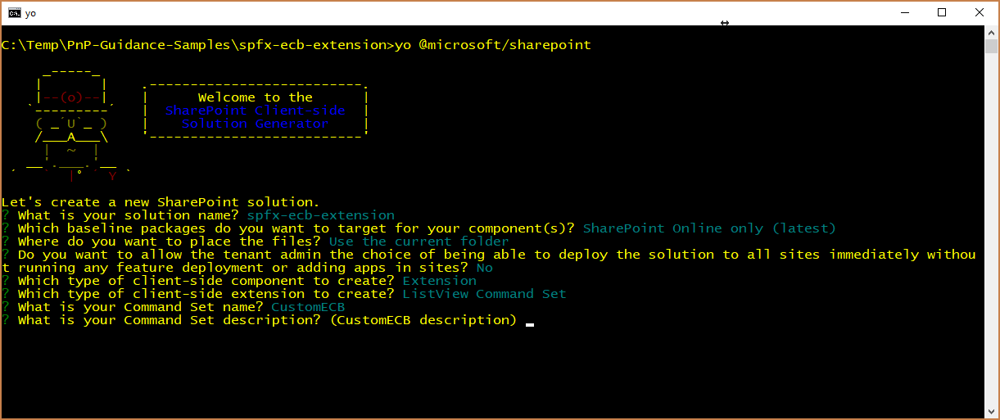

# <a name="migrating-from-edit-control-block-ecb-menu-item-to-sharepoint-framework-extensions"></a><span data-ttu-id="7e7ea-102">Перенос пункта меню Edit Control Block (ECB) в расширения SharePoint Framework</span><span class="sxs-lookup"><span data-stu-id="7e7ea-102">Migrating from Edit Control Block (ECB) menu item to SharePoint Framework Extensions</span></span>

<span data-ttu-id="7e7ea-103">За последние несколько лет в большинстве корпоративных решений на основе Office 365 и SharePoint Online для расширения пользовательского интерфейса страниц использовалась возможность _CustomAction_ для сайтов на платформе функций SharePoint.</span><span class="sxs-lookup"><span data-stu-id="7e7ea-103">During the last few years, most of the enterprise solutions built on top of Office 365 and SharePoint Online leveraged the site _CustomAction_ capability of the SharePoint Feature Framework to extend the UI of pages.</span></span> <span data-ttu-id="7e7ea-104">Однако на данный момент, с появлением "современного" пользовательского интерфейса SharePoint Online, большинство таких модификаций недоступно.</span><span class="sxs-lookup"><span data-stu-id="7e7ea-104">However nowdays, within the new "modern" UI of SharePoint Online, most of those customizations are no more available.</span></span> <span data-ttu-id="7e7ea-105">К счастью, с помощью новых расширений SharePoint Framework вы можете реализовать подобные функции в "современном" пользовательском интерфейсе.</span><span class="sxs-lookup"><span data-stu-id="7e7ea-105">Luckily, with the new SharePoint Framework Extensions you can provide similar functionality in the "modern" UI.</span></span> <span data-ttu-id="7e7ea-106">Из данного руководства вы узнаете, как перейти от старых ("классических") модификаций к новой модели, основанной на расширениях SharePoint Framework.</span><span class="sxs-lookup"><span data-stu-id="7e7ea-106">In this tutorial you will learn how to migrate from old "classic" customizations to the new model based on SharePoint Framework Extensions.</span></span>

## <a name="understanding-sharepoint-framework-extensions"></a><span data-ttu-id="7e7ea-107">Общие сведения о расширениях SharePoint Framework</span><span class="sxs-lookup"><span data-stu-id="7e7ea-107">Understanding SharePoint Framework Extensions</span></span>
<span data-ttu-id="7e7ea-108"><a name="spfxExtensions"> </a> Для начала рассмотрим доступные разработчикам варианты расширений SharePoint Framework:</span><span class="sxs-lookup"><span data-stu-id="7e7ea-108"><a name="spfxExtensions"> </a> First of all, let's introduce the available options when developing SharePoint Framework Extensions:</span></span>

* <span data-ttu-id="7e7ea-109">**Настройщик приложений**. Расширьте встроенный "современный" пользовательский интерфейс SharePoint Online, добавив пользовательские элементы HTML и клиентский код в заранее определенные заполнители на "современных" страницах.</span><span class="sxs-lookup"><span data-stu-id="7e7ea-109">**Application Customizer**: extend the native "modern" UI of SharePoint Online by adding custom HTML elements and client-side code to pre-defined placeholders of "modern" pages.</span></span> <span data-ttu-id="7e7ea-110">На момент написания этой статьи заполнители доступны в верхнем и нижнем колонтитулах каждой "современной" страницы.</span><span class="sxs-lookup"><span data-stu-id="7e7ea-110">At the time of this writing, the available placeholders are the header and the footer of every "modern" page.</span></span>
* <span data-ttu-id="7e7ea-111">**Набор команд**. Позволяет добавлять пользовательские пункты меню ECB и настраиваемые кнопки на панель команд или в представление списка или библиотеки.</span><span class="sxs-lookup"><span data-stu-id="7e7ea-111">**Command Set**: allow to add custom ECB menu items or custom buttons to the command bar of a list view for a list or a library.</span></span> <span data-ttu-id="7e7ea-112">С этими командами можно связать любое действие JavaScript (TypeScript).</span><span class="sxs-lookup"><span data-stu-id="7e7ea-112">You can associate any JavaScript (TypeScript) action to these commands.</span></span>
* <span data-ttu-id="7e7ea-113">**Настройщик полей**. Настройте отображение поля в представлении списка, используя настраиваемые элементы HTML и клиентский код.</span><span class="sxs-lookup"><span data-stu-id="7e7ea-113">**Field Customizer**: customize the rendering of a field in a list view using custom HTML elements and client-side code.</span></span>

<span data-ttu-id="7e7ea-114">Как вы могли понять из приведенных выше описаний, в нашем случае наиболее удобным вариантом будет расширение "Набор команд".</span><span class="sxs-lookup"><span data-stu-id="7e7ea-114">As you can argue from the above descriptions, the most useful one in our context is the "Command Set" extension.</span></span>

> [!NOTE]
> <span data-ttu-id="7e7ea-115">Дополнительные сведения о расширениях SharePoint Framework см. в статье ["Обзор расширений SharePoint Framework"](https://docs.microsoft.com/ru-RU/sharepoint/dev/spfx/extensions/overview-extensions).</span><span class="sxs-lookup"><span data-stu-id="7e7ea-115">For further details about how to build SharePoint Framework Extensions you can read the article ["Overview of SharePoint Framework Extensions"](https://docs.microsoft.com/ru-RU/sharepoint/dev/spfx/extensions/overview-extensions).</span></span>

## <a name="migrating-a-ecb-to-an-spfx-command-set"></a><span data-ttu-id="7e7ea-116">Переход от ECB к набору команд SPFx</span><span class="sxs-lookup"><span data-stu-id="7e7ea-116">Migrating a ECB to an SPFx Command Set</span></span>
<span data-ttu-id="7e7ea-117"><a name="FromECBtoCommandSet"> </a> Предположим, у вас есть элемент _CustomAction_ в SharePoint Online, необходимый для создания пункта меню ECB для документов в библиотеке.</span><span class="sxs-lookup"><span data-stu-id="7e7ea-117"><a name="FromECBtoCommandSet"> </a> Assume that you have a _CustomAction_ in SharePoint Online, in order to have a custom ECB menu item for documents in a library.</span></span> <span data-ttu-id="7e7ea-118">Назначение пункта меню ECB — открытие настраиваемой страницы с предоставлением идентификаторов списка и выбранного в текущий момент пункта в строке запроса целевой страницы.</span><span class="sxs-lookup"><span data-stu-id="7e7ea-118">The scope of the ECB menu item is to open a custom page, providing the list ID and the list item ID of the currently selected item in the querystring of the target page.</span></span>
<span data-ttu-id="7e7ea-119">Ниже представлен фрагмент кода XML, в котором определяется этот элемент _CustomAction_ на платформе функций SharePoint.</span><span class="sxs-lookup"><span data-stu-id="7e7ea-119">In the following code snippet you can see the XML code defining that _CustomAction_ using the SharePoint Feature Framework.</span></span>

```XML
<?xml version="1.0" encoding="utf-8"?>
<Elements xmlns="http://schemas.microsoft.com/sharepoint/">
  <CustomAction Id="OpenDetailsPageWithItemReference"
                Title="Show Details"
                Description="Opens a new page with further details about the currently selected item"
                Sequence="1001"
                RegistrationType="List"
                RegistrationId="101"                
                Location="EditControlBlock">
    <UrlAction Url="ShowDetails.aspx?ID={ItemId}&amp;List={ListId}" />
  </CustomAction>
</Elements>
```

<span data-ttu-id="7e7ea-120">Как видите, в файле элементов функции определяется элемент типа _CustomAction_, чтобы добавлять новый пункт в расположении _EditControlBlock_ (т. е. ECB) для любого документа в любой библиотеке (для параметра _RegistrationType_ задано значение _List_, а для параметра _RegistrationId_ — значение _101_).</span><span class="sxs-lookup"><span data-stu-id="7e7ea-120">As you can see, the feature elements file defines an element of type _CustomAction_ to add a new item in the _EditControlBlock_ location (i.e. ECB) for any document in any library (_RegistrationType_ is _List_ and _RegistrationId_ is _101_).</span></span>

<span data-ttu-id="7e7ea-121">На приведенном ниже рисунке представлены выходные данные вышеописанного дополнительного действия в представлении списка для библиотеки.</span><span class="sxs-lookup"><span data-stu-id="7e7ea-121">In the following figure you can see the output of the previous custom action, within the list view of a library.</span></span>


<span data-ttu-id="7e7ea-123">Обратите внимание, что настраиваемый элемент ECB на платформе функций SharePoint также работает в "современном" списке.</span><span class="sxs-lookup"><span data-stu-id="7e7ea-123">Notice that the SharePoint Feature Framework ECB custom item works in a "modern" list, too.</span></span> <span data-ttu-id="7e7ea-124">На самом деле, если не использовать код JavaScript, то дополнительное действие для списков будет работать и в "современных" списках.</span><span class="sxs-lookup"><span data-stu-id="7e7ea-124">In fact, as long as you don't use JavaScript code, a list custom action still works in "modern" lists, too.</span></span>

<span data-ttu-id="7e7ea-125">Чтобы перенести представленное выше решение на платформу SharePoint Framework, необходимо выполнить указанные ниже действия.</span><span class="sxs-lookup"><span data-stu-id="7e7ea-125">In order to migrate the above solution to the SharePoint Framework, you will have to accomplish the following steps.</span></span>

### <a name="create-a-new-sharepoint-framework-solution"></a><span data-ttu-id="7e7ea-126">Создание решения SharePoint Framework</span><span class="sxs-lookup"><span data-stu-id="7e7ea-126">Create a new SharePoint Framework solution</span></span>
<span data-ttu-id="7e7ea-127"><a name="CreateCommandSet"> </a> Подготовив среду разработки к созданию решений SharePoint Framework, вы можете приступить к созданию расширения SharePoint Framework, выполнив действия, описанные в статье ["Как настроить среду разработки клиентских веб-частей SharePoint"](https://docs.microsoft.com/ru-RU/sharepoint/dev/spfx/set-up-your-development-environment).</span><span class="sxs-lookup"><span data-stu-id="7e7ea-127"><a name="CreateCommandSet"> </a> Once you have prepared you development environment to develop SharePoint Framework solutions, by following the instructions provided in the document ["Set up your SharePoint client-side web part development environment"](https://docs.microsoft.com/ru-RU/sharepoint/dev/spfx/set-up-your-development-environment), you can start creating a SharePoint Framework extension.</span></span>

1. <span data-ttu-id="7e7ea-128">Откройте любое средство командной строки (PowerShell, CMD.EXE, Cmder и т. д.), создайте папку для решения (назовите ее _spfx-ecb-extension_) и создайте решение SharePoint Framework, запустив генератор Yeoman с помощью следующей команды:</span><span class="sxs-lookup"><span data-stu-id="7e7ea-128">Open the command line tool of your choice (PowerShell, CMD.EXE, Cmder, etc.), create a new folder for the solution (call it _spfx-ecb-extension_), and create a new SharePoint Framework solution by running the Yeoman generator with the following command:</span></span>

```
yo @microsoft/sharepoint
```

<span data-ttu-id="7e7ea-129">При появлении соответствующих запросов укажите следующие параметры:</span><span class="sxs-lookup"><span data-stu-id="7e7ea-129">When prompted by the tool, provide the following answers:</span></span>
* <span data-ttu-id="7e7ea-130">Оставьте имя решения по умолчанию (_spfx-ecb-extension_) и нажмите клавишу ВВОД.</span><span class="sxs-lookup"><span data-stu-id="7e7ea-130">Accept the default name (_spfx-ecb-extension_) for your solution, and press Enter.</span></span>
* <span data-ttu-id="7e7ea-131">Выберите SharePoint Online only (latest) (Только SharePoint Online, последняя версия) и нажмите клавишу ВВОД.</span><span class="sxs-lookup"><span data-stu-id="7e7ea-131">Choose SharePoint Online only (latest), and press Enter.</span></span>
* <span data-ttu-id="7e7ea-132">Выберите Use the current folder (Использовать текущую папку) и нажмите клавишу ВВОД.</span><span class="sxs-lookup"><span data-stu-id="7e7ea-132">Choose Use the current folder, and press Enter.</span></span>
* <span data-ttu-id="7e7ea-133">Выберите N, чтобы сделать установку расширения обязательной на каждом сайте при его использовании.</span><span class="sxs-lookup"><span data-stu-id="7e7ea-133">Choose N to require the extension to be installed on each site explicitly when it's being used.</span></span>
* <span data-ttu-id="7e7ea-134">Выберите Extension (Расширение) в качестве типа создаваемого клиентского компонента.</span><span class="sxs-lookup"><span data-stu-id="7e7ea-134">Choose Extension as the client-side component type to be created.</span></span>
* <span data-ttu-id="7e7ea-135">Выберите для создаваемого расширения тип _ListView Command Set_.</span><span class="sxs-lookup"><span data-stu-id="7e7ea-135">Choose _"ListView Command Set"_ as the extension type to be created.</span></span>
* <span data-ttu-id="7e7ea-136">Укажите имя CustomECB для набора команд.</span><span class="sxs-lookup"><span data-stu-id="7e7ea-136">Provide "CustomECB" as the name for your Command Set.</span></span>



<span data-ttu-id="7e7ea-138">На этом этапе Yeoman установит необходимые зависимости и сформирует шаблон файлов и папок решения вместе с расширением _CustomFooter_.</span><span class="sxs-lookup"><span data-stu-id="7e7ea-138">At this point, Yeoman will install the required dependencies and scaffold the solution files and folders along with the _CustomFooter_ extension.</span></span> <span data-ttu-id="7e7ea-139">Это может занять несколько минут.</span><span class="sxs-lookup"><span data-stu-id="7e7ea-139">This might take a few minutes.</span></span>

<span data-ttu-id="7e7ea-140">После успешного формирования шаблона должно появиться следующее сообщение:</span><span class="sxs-lookup"><span data-stu-id="7e7ea-140">When the scaffold is complete, you should see the following message indicating a successful scaffold:</span></span>


2. <span data-ttu-id="7e7ea-142">Чтобы заблокировать версию зависимостей проекта, выполните следующую команду:</span><span class="sxs-lookup"><span data-stu-id="7e7ea-142">To lock down the version of the project dependencies, run the following command:</span></span>

```
npm shrinkwrap
```

3. <span data-ttu-id="7e7ea-143">Теперь запустите Visual Studio Code (или другой редактор кода) и начните разработку решения.</span><span class="sxs-lookup"><span data-stu-id="7e7ea-143">Now start Visual Studio Code (or whatever else is the code editor of your choice) and start developing the solution.</span></span> <span data-ttu-id="7e7ea-144">Чтобы запустить Visual Studio Code, можно выполнить приведенный ниже оператор.</span><span class="sxs-lookup"><span data-stu-id="7e7ea-144">To start Visual Studio Code, you can execute the following statement.</span></span>

```
code .
```

### <a name="define-the-new-ecb-item"></a><span data-ttu-id="7e7ea-145">Определение нового элемента ECB</span><span class="sxs-lookup"><span data-stu-id="7e7ea-145">Define the new ECB item</span></span>
<span data-ttu-id="7e7ea-146"><a name="DefineCommandSetECB"> </a> Чтобы воспроизвести такое поведение пункта меню ECB, созданного с помощью платформы функций SharePoint, достаточно реализовать такую же логику с помощью клиентского кода в новом решении SharePoint Framework.</span><span class="sxs-lookup"><span data-stu-id="7e7ea-146"><a name="DefineCommandSetECB"> </a> In order to reproduce the same behavior of the ECB menu item built using the SharePoint Feature Framework, you simply need to implement the same logic using client-side code, within the new SharePoint Framework solution.</span></span> <span data-ttu-id="7e7ea-147">Чтобы выполнить эту задачу, сделайте следующее:</span><span class="sxs-lookup"><span data-stu-id="7e7ea-147">To accomplish this task, complete the following steps.</span></span>

1. <span data-ttu-id="7e7ea-148">Для начала откройте файл _CustomEcbCommandSet.manifest.json_ в папке _src/extensions/customEcb_.</span><span class="sxs-lookup"><span data-stu-id="7e7ea-148">First of all, open the file _CustomEcbCommandSet.manifest.json_ under the _src/extensions/customEcb_ folder.</span></span> <span data-ttu-id="7e7ea-149">Скопируйте значение свойства _id_ и сохраните его в надежном месте, так как оно потребуется позже.</span><span class="sxs-lookup"><span data-stu-id="7e7ea-149">Copy the value of the _id_ property and store it in a safe place, because you will need it later.</span></span>

2. <span data-ttu-id="7e7ea-150">В том же файле измените массив _items_ в нижней части файла, чтобы определить одну команду для набора команд.</span><span class="sxs-lookup"><span data-stu-id="7e7ea-150">Within the same file edit the array of _"items"_ in the lower part of the file, in order to define a single command for the Command Set.</span></span> <span data-ttu-id="7e7ea-151">Вызовите команду _ShowDetails_, указав название и тип команды.</span><span class="sxs-lookup"><span data-stu-id="7e7ea-151">Call the command _"ShowDetails"_, provide a Title, and a command type.</span></span> <span data-ttu-id="7e7ea-152">На приведенном ниже снимке экрана показано, как должен выглядеть файл манифеста.</span><span class="sxs-lookup"><span data-stu-id="7e7ea-152">In the following screenshot you can see how the manifest file should look like.</span></span>


3. <span data-ttu-id="7e7ea-154">Теперь откройте файл _CustomEcbCommandSet.ts_ в той же папке и измените его содержимое в соответствии с приведенным ниже фрагментом кода.</span><span class="sxs-lookup"><span data-stu-id="7e7ea-154">Now, open the _CustomEcbCommandSet.ts_ file, still under the same folder as before and edit the content accordingly to the following code excerpt.</span></span>

``` TypeScript
import { Guid } from '@microsoft/sp-core-library';
import { override } from '@microsoft/decorators';
import {
  BaseListViewCommandSet,
  Command,
  IListViewCommandSetListViewUpdatedParameters,
  IListViewCommandSetExecuteEventParameters
} from '@microsoft/sp-listview-extensibility';
import { Dialog } from '@microsoft/sp-dialog';

import * as strings from 'CustomEcbCommandSetStrings';

export interface ICustomEcbCommandSetProperties {
  targetUrl: string;
}

export default class CustomEcbCommandSet extends BaseListViewCommandSet<ICustomEcbCommandSetProperties> {

  @override
  public onInit(): Promise<void> {
    return Promise.resolve();
  }

  @override
  public onListViewUpdated(event: IListViewCommandSetListViewUpdatedParameters): void {
    const compareOneCommand: Command = this.tryGetCommand('ShowDetails');
    if (compareOneCommand) {
      // This command should be hidden unless exactly one row is selected.
      compareOneCommand.visible = event.selectedRows.length === 1;
    }
  }

  @override
  public onExecute(event: IListViewCommandSetExecuteEventParameters): void {
    switch (event.itemId) {
      case 'ShowDetails':

        const itemId: number = event.selectedRows[0].getValueByName("ID");
        const listId: Guid = this.context.pageContext.list.id;

        window.location.replace(`${this.properties.targetUrl}?ID=${itemId}&List=${listId}`);

        break;
      default:
        throw new Error('Unknown command');
    }
  }
}
```

<span data-ttu-id="7e7ea-155">Обратите внимание на оператор _import_ в самом начале файла. Он необходим, чтобы ссылаться на тип _Guid_, который будет использоваться для хранения идентификатора текущего списка.</span><span class="sxs-lookup"><span data-stu-id="7e7ea-155">Notice the _import_ statement at the very beginning of the file, in order to reference the _Guid_ type, which will be used to hold the ID of the current list.</span></span> <span data-ttu-id="7e7ea-156">Более того, в интерфейсе _ICustomEcbCommandSetProperties_ объявляется одно свойство с именем _targetUrl_, с помощью которого можно предоставить URL-адрес целевой страницы, открываемой при выборе пункта меню ECB.</span><span class="sxs-lookup"><span data-stu-id="7e7ea-156">Moreover, the interface _ICustomEcbCommandSetProperties_ declares a single property called _targetUrl_ that can be used to provide the URL of the target page to open when clicking on the ECB menu item.</span></span>
<span data-ttu-id="7e7ea-157">Переопределенный метод _onExecute_ выполняет дополнительное действие.</span><span class="sxs-lookup"><span data-stu-id="7e7ea-157">Furthermore, the override of the _onExecute_ method handles the execution of the custom action.</span></span> <span data-ttu-id="7e7ea-158">Обратите внимание на фрагмент кода, считывающий идентификатор выбранного элемента из аргумента _event_, и идентификатор исходного списка из объекта _pageContext_.</span><span class="sxs-lookup"><span data-stu-id="7e7ea-158">Notice the code excerpt that reads the ID of the currently selected item, from the _event_ argument, and the ID of the source list from the the _pageContext_ object.</span></span>
<span data-ttu-id="7e7ea-159">Наконец, обратите внимание на переопределение метода _onListViewUpdated_, который по умолчанию включал команду _ShowDetails_, только если выбран один элемент.</span><span class="sxs-lookup"><span data-stu-id="7e7ea-159">Lastly, notice the override of the _onListViewUpdated_ method, which by default enabled the _'ShowDetails'_ command only if a single item is selected.</span></span>

<span data-ttu-id="7e7ea-160">Перенаправление на целевой URL-адрес выполняется с помощью классического кода JavaScript и функции _window.location.replace_.</span><span class="sxs-lookup"><span data-stu-id="7e7ea-160">The redirection to the target URL is handled by using classic JavaScript code and using the _window.location.replace_ function.</span></span> <span data-ttu-id="7e7ea-161">Конечно, вы можете написать любой код TypeScript в методе _onExecute_.</span><span class="sxs-lookup"><span data-stu-id="7e7ea-161">Of course, you can write whatever kind of TypeScript code you like inside the _onExecute_ method.</span></span> <span data-ttu-id="7e7ea-162">В качестве примера можно использовать платформу диалоговых окон SharePoint Framework, чтобы открыть новое диалоговое окно и взаимодействовать с пользователями.</span><span class="sxs-lookup"><span data-stu-id="7e7ea-162">Just for the sake of making an example, you can leverage the SharePoint Framework Dialog Framework to open a new dialog window and to interact with the end users.</span></span>

> [!NOTE]
> <span data-ttu-id="7e7ea-163">Дополнительные сведения о платформе диалоговых окон SharePoint Framework см. в документе [Использование настраиваемых диалоговых окон с расширениями SharePoint Framework](https://docs.microsoft.com/ru-RU/sharepoint/dev/spfx/extensions/guidance/using-custom-dialogs-with-spfx).</span><span class="sxs-lookup"><span data-stu-id="7e7ea-163">For further details about the SharePoint Framework Dialog Framework you can read the document [Use custom dialog boxes with SharePoint Framework Extensions](https://docs.microsoft.com/ru-RU/sharepoint/dev/spfx/extensions/guidance/using-custom-dialogs-with-spfx).</span></span>

<span data-ttu-id="7e7ea-164">На приведенном ниже рисунке показаны выходные данные.</span><span class="sxs-lookup"><span data-stu-id="7e7ea-164">In the following figure you can see the resulting output.</span></span>


### <a name="test-the-solution-in-debug-mode"></a><span data-ttu-id="7e7ea-166">Тестирование решения в режиме отладки</span><span class="sxs-lookup"><span data-stu-id="7e7ea-166">Test the solution in debug mode</span></span>
<span data-ttu-id="7e7ea-167"><a name="DebugCommandSet"> </a> Теперь все готово к тестированию решения в режиме отладки.</span><span class="sxs-lookup"><span data-stu-id="7e7ea-167"><a name="DebugCommandSet"> </a> You are now ready to test your solution in debug mode.</span></span> 

1. <span data-ttu-id="7e7ea-168">Вернитесь к окну консоли и выполните следующую команду:</span><span class="sxs-lookup"><span data-stu-id="7e7ea-168">Go back to the console window and run the following command:</span></span>

```
gulp serve --nobrowser
```

<span data-ttu-id="7e7ea-169">Приведенная выше команда выполняет сборку решения и запускает локальный сервер Node.js для его размещения.</span><span class="sxs-lookup"><span data-stu-id="7e7ea-169">The above command will build the solution and run the local Node.js server to host it.</span></span>

2. <span data-ttu-id="7e7ea-170">Теперь откройте любой браузер и перейдите к "современной" библиотеке на любом "современном" сайте группы.</span><span class="sxs-lookup"><span data-stu-id="7e7ea-170">Now open your favorite browser and go to a "modern" library of any "modern" team site.</span></span> <span data-ttu-id="7e7ea-171">Затем добавьте приведенные ниже параметры строки запроса к URL-адресу страницы _AllItems.aspx_.</span><span class="sxs-lookup"><span data-stu-id="7e7ea-171">Now, append the following querystring parameters to the _AllItems.aspx_ page URL.</span></span>

```
?loadSpfx=true&debugManifestsFile=https://localhost:4321/temp/manifests.js&customActions={"6c5b8ee9-43ba-4cdf-a106-04857c8307be":{"location":"ClientSideExtension.ListViewCommandSet.ContextMenu","properties":{"targetUrl":"ShowDetail.aspx"}}}
```

<span data-ttu-id="7e7ea-172">В приведенной выше строке запроса необходимо заменить GUID на сохраненное ранее значение _id_ из файла _CustomEcbCommandSet.manifest.json_.</span><span class="sxs-lookup"><span data-stu-id="7e7ea-172">In the above querystring, you will have to replace the GUID with the _id_ value you saved from the _CustomEcbCommandSet.manifest.json_ file.</span></span> <span data-ttu-id="7e7ea-173">Кроме того, доступно свойство _location_, которое принимает значение _ClientSideExtension.ListViewCommandSet.ContextMenu_. При этом SPFx отрисовывает набор команд в виде пункта меню ECB.</span><span class="sxs-lookup"><span data-stu-id="7e7ea-173">Moreover, there is a _location_ property which assumes the value of _ClientSideExtension.ListViewCommandSet.ContextMenu_, which instructs SPFx to render the Command Set as an ECB menu item.</span></span> <span data-ttu-id="7e7ea-174">Допустимые значения свойства _location_:</span><span class="sxs-lookup"><span data-stu-id="7e7ea-174">Here are all the available options for the _location_ property:</span></span>
* <span data-ttu-id="7e7ea-175">**ClientSideExtension.ListViewCommandSet.ContextMenu** — контекстное меню элементов;</span><span class="sxs-lookup"><span data-stu-id="7e7ea-175">**ClientSideExtension.ListViewCommandSet.ContextMenu:**  The context menu of the item(s)</span></span>
* <span data-ttu-id="7e7ea-176">**ClientSideExtension.ListViewCommandSet.CommandBar** — меню верхнего уровня для набора команд в списке или библиотеке;</span><span class="sxs-lookup"><span data-stu-id="7e7ea-176">**ClientSideExtension.ListViewCommandSet.CommandBar:** The top command set menu in a list or library</span></span>
* <span data-ttu-id="7e7ea-177">**ClientSideExtension.ListViewCommandSet** — контекстное меню и панель команд (соответствует параметру SPUserCustomAction.Location="CommandUI.Ribbon").</span><span class="sxs-lookup"><span data-stu-id="7e7ea-177">**ClientSideExtension.ListViewCommandSet:** Both the context menu and the command bar (Corresponds to SPUserCustomAction.Location="CommandUI.Ribbon")</span></span>

<span data-ttu-id="7e7ea-178">Наконец, в строке запроса есть свойство _properties_, представляющее сериализацию JSON для объекта типа _ICustomEcbCommandSetProperties_ — типа настраиваемых свойств, запрашиваемых настраиваемым набором команд для отрисовки.</span><span class="sxs-lookup"><span data-stu-id="7e7ea-178">Lastly, still in the querystring there is a property called _properties_, which represents the JSON serialization of an object of type _ICustomEcbCommandSetProperties_ that is the type of the custom properties requested by the custom Command Set for rendering.</span></span>

<span data-ttu-id="7e7ea-179">Обратите внимание, что при выполнении запроса страницы появится окно с предупреждающим сообщением "Разрешить скрипты отладки?", где из соображений безопасности спрашивается ваше согласие на запуск кода с localhost.</span><span class="sxs-lookup"><span data-stu-id="7e7ea-179">Notice that, when executing the page request, you will be prompted with a warning message box with title "Allow debug scripts?", which asks your consent to run code from localhost, for security reasons.</span></span> <span data-ttu-id="7e7ea-180">Конечно, если вы хотите отладить и протестировать решение локально, потребуется разрешить загрузку скриптов отладки.</span><span class="sxs-lookup"><span data-stu-id="7e7ea-180">Of course, if you want to locally debug and test the solution, you will have to allow to "Load debug scripts".</span></span>

### <a name="package-and-host-the-solution"></a><span data-ttu-id="7e7ea-181">Упаковка и размещение решения</span><span class="sxs-lookup"><span data-stu-id="7e7ea-181">Package and host the solution</span></span>
<span data-ttu-id="7e7ea-182"><a name="PackageAndHostCommandSet"> </a> Если вы довольны результатом, теперь можно упаковать решение и разместить его в настоящей инфраструктуре.</span><span class="sxs-lookup"><span data-stu-id="7e7ea-182"><a name="PackageAndHostCommandSet"> </a> If you are happy with the result, you are now ready to package the solution and host it in a real hosting infrastructure.</span></span>
<span data-ttu-id="7e7ea-183">Прежде чем собирать пакет, необходимо объявить XML-файл платформы функций для подготовки расширения.</span><span class="sxs-lookup"><span data-stu-id="7e7ea-183">Before building the bundle and the package, you need to declare an XML feature framework file to provision the extension.</span></span>

#### <a name="review-feature-framework-elements"></a><span data-ttu-id="7e7ea-184">Обзор элементов платформы функций</span><span class="sxs-lookup"><span data-stu-id="7e7ea-184">Review feature framework elements</span></span>
<span data-ttu-id="7e7ea-185">В редакторе кода откройте вложенную папку _/sharepoint/assets_ в папке решения и измените файл _elements.xml_.</span><span class="sxs-lookup"><span data-stu-id="7e7ea-185">Within the code editor, open the _/sharepoint/assets_ sub-folder of the solution folder and edit the _elements.xml_ file.</span></span>
<span data-ttu-id="7e7ea-186">В приведенном ниже фрагменте кода показано, как должен выглядеть файл.</span><span class="sxs-lookup"><span data-stu-id="7e7ea-186">In the following code excerpt you can see how the file should look like.</span></span>

```XML
<?xml version="1.0" encoding="utf-8"?>
<Elements xmlns="http://schemas.microsoft.com/sharepoint/">
    <CustomAction
        Title="CustomEcb"
        RegistrationId="101"
        RegistrationType="List"
        Location="ClientSideExtension.ListViewCommandSet.ContextMenu"
        ClientSideComponentId="6c5b8ee9-43ba-4cdf-a106-04857c8307be"
        ClientSideComponentProperties="{&quot;targetUrl&quot;:&quot;ShowDetails.aspx&quot;}">
    </CustomAction>
</Elements>
```

<span data-ttu-id="7e7ea-187">Как видите, он напоминает файл платформы функций SharePoint из "классической" модели, но использует атрибут _ClientSideComponentId_, чтобы ссылаться на свойство _id_ настраиваемого расширения, и атрибут _ClientSideComponentProperties_, чтобы настраивать необходимые решению настраиваемые свойства конфигурации.</span><span class="sxs-lookup"><span data-stu-id="7e7ea-187">As you can see, it reminds the SharePoint Feature Framework file that we saw in the "classic" model, but it uses the _ClientSideComponentId_ attribute to reference the _id_ of the custom extension, and the _ClientSideComponentProperties_ attribute, to configure the custom configuration properties required by the extension.</span></span>

<span data-ttu-id="7e7ea-188">Теперь откройте файл _package-solution.json_ в папке _/config_ решения.</span><span class="sxs-lookup"><span data-stu-id="7e7ea-188">Now, open the _package-solution.json_ file under the _/config_ folder of the solution.</span></span> <span data-ttu-id="7e7ea-189">В файле вы увидите ссылку на файл _elements.xml_ в разделе _assets_.</span><span class="sxs-lookup"><span data-stu-id="7e7ea-189">Within the file you can see that there is a reference to the _elements.xml_ file, within the _assets_ section.</span></span>

```JSON
{
  "$schema": "https://dev.office.com/json-schemas/spfx-build/package-solution.schema.json",
  "solution": {
    "name": "spfx-ecb-extension-client-side-solution",
    "id": "b8ff6fdf-16e9-4434-9fdb-eac6c5f948ee",
    "version": "1.0.2.0",
    "features": [
      {
        "title": "Custom ECB Menu Item.",
        "description": "Deploys a custom ECB menu item sample extension",
        "id": "f30a744c-6f30-4ccc-a428-125a290b5233",
        "version": "1.0.0.0",
        "assets": {
          "elementManifests": [
            "elements.xml"
          ]
        }
      }
    ]
  },
  "paths": {
    "zippedPackage": "solution/spfx-ecb-extension.sppkg"
  }
}
```

#### <a name="enable-the-cdn-in-your-office-365-tenant"></a><span data-ttu-id="7e7ea-190">Включение сети доставки содержимого (CDN) в клиенте Office 365</span><span class="sxs-lookup"><span data-stu-id="7e7ea-190">Enable the CDN in your Office 365 tenant</span></span>
<span data-ttu-id="7e7ea-191">Теперь необходимо разместить расширение в среде внешнего размещения.</span><span class="sxs-lookup"><span data-stu-id="7e7ea-191">Now you need to host the extension in a hosting environment.</span></span> <span data-ttu-id="7e7ea-192">Сеть доставки содержимого Office 365 — самый простой способ размещать решения SharePoint непосредственно из их клиента, пользуясь при этом преимуществами службы сетей доставки содержимого (CDN) для сокращения времени загрузки ресурсов.</span><span class="sxs-lookup"><span data-stu-id="7e7ea-192">Office 365 CDN is the easiest way to host SharePoint Framework solutions directly from your tenant while still taking advantage of the Content Delivery Network (CDN) service for faster load times of your assets.</span></span>

1. <span data-ttu-id="7e7ea-193">Скачайте [командную консоль SharePoint Online](https://www.microsoft.com/en-us/download/details.aspx?id=35588), чтобы убедиться, что у вас установлена последняя версия.</span><span class="sxs-lookup"><span data-stu-id="7e7ea-193">Download the [SharePoint Online Management Shell](https://www.microsoft.com/en-us/download/details.aspx?id=35588) to ensure that you have the latest version.</span></span>

2. <span data-ttu-id="7e7ea-194">Подключитесь к клиенту SharePoint Online с помощью PowerShell:</span><span class="sxs-lookup"><span data-stu-id="7e7ea-194">Connect to your SharePoint Online tenant by using PowerShell:</span></span>
    
    ```
    Connect-SPOService -Url https://[tenant]-admin.sharepoint.com
    ```
    
3. <span data-ttu-id="7e7ea-195">Чтобы узнать текущее состояние настроек общедоступной сети CDN для клиента, поочередно выполните указанные ниже команды.</span><span class="sxs-lookup"><span data-stu-id="7e7ea-195">Get the current status of public CDN settings from the tenant level by executing the following commands one-by-one:</span></span> 
    
    ```
    Get-SPOTenantCdnEnabled -CdnType Public
    Get-SPOTenantCdnOrigins -CdnType Public
    Get-SPOTenantCdnPolicies -CdnType Public
    ```
    
4. <span data-ttu-id="7e7ea-196">Включите общедоступную сеть доставки содержимого в клиенте:</span><span class="sxs-lookup"><span data-stu-id="7e7ea-196">Enable public CDN in the tenant:</span></span>
    
    ```
    Set-SPOTenantCdnEnabled -CdnType Public
    ```
    
    <span data-ttu-id="7e7ea-197">Теперь в клиенте включена общедоступная сеть доставки содержимого с использованием разрешенной конфигурации типов файлов по умолчанию.</span><span class="sxs-lookup"><span data-stu-id="7e7ea-197">Public CDN has now been enabled in the tenant by using the default file type configuration allowed.</span></span> <span data-ttu-id="7e7ea-198">Это означает, что поддерживаются такие расширения: CSS, EOT, CSS, EOT, GIF, ICO, JPEG, JPG, JS, MAP, PNG, SVG, TTF и WOFF.</span><span class="sxs-lookup"><span data-stu-id="7e7ea-198">This means that the following file type extensions are supported: CSS, EOT, GIF, ICO, JPEG, JPG, JS, MAP, PNG, SVG, TTF, and WOFF.</span></span>

5. <span data-ttu-id="7e7ea-p121">Откройте браузер и перейдите к семейству веб-сайтов, в котором вы хотите разместить свою библиотеку CDN. Это может быть любое семейство веб-сайтов в клиенте. Это руководство описывает создание библиотеки CDN, но вы также можете использовать отдельную папку в любой существующей библиотеке документов как конечную точку CDN.</span><span class="sxs-lookup"><span data-stu-id="7e7ea-p121">Open up a browser and move to a site collection where you'd like to host your CDN library. This could be any site collection in your tenant. In this tutorial, we will create a specific library to act as your CDN library, but you can also use a specific folder in any existing document library as the CDN endpoint.</span></span>

6. <span data-ttu-id="7e7ea-202">В семействе веб-сайтов создайте библиотеку документов _CDN_ и добавьте в нее папку _customecb_.</span><span class="sxs-lookup"><span data-stu-id="7e7ea-202">Create a new document library on your site collection called _CDN_ and add a folder named _customecb_ to it.</span></span>
    
7. <span data-ttu-id="7e7ea-203">В консоли PowerShell добавьте новый источник сети доставки содержимого.</span><span class="sxs-lookup"><span data-stu-id="7e7ea-203">In the PowerShell console, add a new CDN origin.</span></span> <span data-ttu-id="7e7ea-204">В этом случае мы задаем источник `*/cdn`, то есть в качестве источника сети доставки содержимого (CDN) будет выступать любая относительная папка с именем _cdn_.</span><span class="sxs-lookup"><span data-stu-id="7e7ea-204">In this case, we are setting the origin as `*/cdn`, which means that any relative folder with the name of _cdn_ acts as a CDN origin.</span></span>
    
    ```
    Add-SPOTenantCdnOrigin -CdnType Public -OriginUrl */cdn
    ```
    
8. <span data-ttu-id="7e7ea-205">Выполните указанную ниже команду, чтобы получить список источников сети доставки содержимого клиента:</span><span class="sxs-lookup"><span data-stu-id="7e7ea-205">Execute the following command to get the list of CDN origins from your tenant:</span></span>
    
    ```
    Get-SPOTenantCdnOrigins -CdnType Public
    ```
    
<span data-ttu-id="7e7ea-206">Обратите внимание, что новый источник указан как допустимый источник сети доставки содержимого.</span><span class="sxs-lookup"><span data-stu-id="7e7ea-206">Note that your newly added origin is listed as a valid CDN origin.</span></span> <span data-ttu-id="7e7ea-207">Настройка источника займет некоторое время (приблизительно 15 минут), поэтому мы пока можем подготовить к работе расширение, которое будет размещено в источнике по завершении развертывания.</span><span class="sxs-lookup"><span data-stu-id="7e7ea-207">Final configuration of the origin takes approximately 15 minutes, so we can continue provisioning the extension, which will be hosted from the origin after deployment is completed.</span></span> 


<span data-ttu-id="7e7ea-209">Если рядом с названием источника нет уведомления `(configuration pending)`, он готов к использованию в клиенте.</span><span class="sxs-lookup"><span data-stu-id="7e7ea-209">When the origin is listed without the `(configuration pending)` text, it is ready to be used in your tenant.</span></span> <span data-ttu-id="7e7ea-210">Это указывает на выполняющуюся настройку SharePoint Online и системы CDN.</span><span class="sxs-lookup"><span data-stu-id="7e7ea-210">This indicates an on-going configuration between SharePoint Online and the CDN system.</span></span> 

#### <a name="update-the-solution-settings-and-publish-it-on-the-cdn"></a><span data-ttu-id="7e7ea-211">Обновление параметров решения и его публикация в сети доставки содержимого</span><span class="sxs-lookup"><span data-stu-id="7e7ea-211">Update the solution settings and publish it on the CDN</span></span>
<span data-ttu-id="7e7ea-212">Теперь необходимо обновить решение для использования только что созданной сети CDN в качестве среды внешнего размещения и опубликовать в ней пакет решения.</span><span class="sxs-lookup"><span data-stu-id="7e7ea-212">Now, you need to update the solution in order to use the just created CDN as the hosting enviroment and you will need to publish the solution bundle to the CDN.</span></span> <span data-ttu-id="7e7ea-213">Чтобы выполнить эту задачу, выполните указанные ниже действия.</span><span class="sxs-lookup"><span data-stu-id="7e7ea-213">To accomplish this task, just follow the upcoming steps.</span></span>

1. <span data-ttu-id="7e7ea-214">Вернитесь к ранее созданному решению, чтобы внести необходимые изменения в URL-адреса.</span><span class="sxs-lookup"><span data-stu-id="7e7ea-214">Return to the previously created solution to perform the needed URL updates.</span></span>
    
2. <span data-ttu-id="7e7ea-215">Обновите файл _write-manifestests.json_ (в папке _config_), как показано ниже, чтобы он указывал на конечную точку CDN.</span><span class="sxs-lookup"><span data-stu-id="7e7ea-215">Update the _write-manifests.json_ file (under the _config_ folder) as follows to point to your CDN endpoint.</span></span> <span data-ttu-id="7e7ea-216">Используйте `publiccdn.sharepointonline.com` в качестве префикса, а затем дополните URL-адрес фактическим путем к вашему клиенту.</span><span class="sxs-lookup"><span data-stu-id="7e7ea-216">Use `publiccdn.sharepointonline.com` as the prefix, and then extend the URL with the actual path of your tenant.</span></span> <span data-ttu-id="7e7ea-217">Формат URL-адреса для сети доставки содержимого:</span><span class="sxs-lookup"><span data-stu-id="7e7ea-217">The format of the CDN URL is as follows:</span></span>
    
    ```
    https://publiccdn.sharepointonline.com/[tenant host name]/sites/[site]/[library]/[folder]
    ```
    
    

3. <span data-ttu-id="7e7ea-219">Сохраните изменения.</span><span class="sxs-lookup"><span data-stu-id="7e7ea-219">Save your changes.</span></span>

4. <span data-ttu-id="7e7ea-220">Выполните описанную ниже задачу для упаковки решения.</span><span class="sxs-lookup"><span data-stu-id="7e7ea-220">Execute the following task to bundle your solution.</span></span> <span data-ttu-id="7e7ea-221">При этом будет выполнена сборка конечной версии проекта с использованием URL-адреса CDN, указанного в файле _writer-manifest.json_.</span><span class="sxs-lookup"><span data-stu-id="7e7ea-221">This executes a release build of your project using the CDN URL specified in the _write-manifests.json_ file.</span></span> <span data-ttu-id="7e7ea-222">Результат будет помещен в папку _./temp/deploy_.</span><span class="sxs-lookup"><span data-stu-id="7e7ea-222">The output of this command is located in the _./temp/deploy_ folder.</span></span> <span data-ttu-id="7e7ea-223">Эти файлы вам нужно будет добавить в папку SharePoint, представляющую собой конечную точку CDN.</span><span class="sxs-lookup"><span data-stu-id="7e7ea-223">These are the files that you need to upload to the SharePoint folder acting as your CDN endpoint.</span></span> 
    
    ```
    gulp bundle --ship
    ```
    
5. <span data-ttu-id="7e7ea-224">Выполните приведенную ниже задачу, чтобы упаковать решение.</span><span class="sxs-lookup"><span data-stu-id="7e7ea-224">Execute the following task to package your solution.</span></span> <span data-ttu-id="7e7ea-225">Эта команда создаст пакет _spfx-ecb-extension.sppkg_ в папке _sharepoint/solution_, а также подготовит ресурсы в папке _temp/deploy_ к развертыванию в CDN.</span><span class="sxs-lookup"><span data-stu-id="7e7ea-225">This command creates an _spfx-ecb-extension.sppkg_ package in the _sharepoint/solution_ folder and also prepares the assets in the _temp/deploy_ folder to be deployed to the CDN.</span></span>
    
    ```
    gulp package-solution --ship
    ```
    
6. <span data-ttu-id="7e7ea-226">Добавьте или перетащите новый пакет клиентского решения в каталог приложений в клиенте, а затем нажмите кнопку _Развернуть_.</span><span class="sxs-lookup"><span data-stu-id="7e7ea-226">Upload or drag-and-drop the newly created client-side solution package to the app catalog in your tenant, and then select the _Deploy_ button.</span></span>

    

7. <span data-ttu-id="7e7ea-228">Отправьте или перетащите файлы из папки _temp/deploy_ в созданную ранее папку _CDN/customfooter_.</span><span class="sxs-lookup"><span data-stu-id="7e7ea-228">Upload or drag-and-drop the files in the _temp/deploy_ folder to the _CDN/customfooter_ folder created earlier.</span></span>

### <a name="install-and-run-the-solution"></a><span data-ttu-id="7e7ea-229">Установка и запуск решения</span><span class="sxs-lookup"><span data-stu-id="7e7ea-229">Install and run the solution</span></span>
<span data-ttu-id="7e7ea-230"><a name="InstallCommandSet"> </a> Теперь вы можете установить решения на любом целевом "современном" сайте.</span><span class="sxs-lookup"><span data-stu-id="7e7ea-230"><a name="InstallCommandSet"> </a> You can now install the solution on any target "modern" site.</span></span>

1. <span data-ttu-id="7e7ea-231">Откройте браузер и перейдите на любой "современный" сайт.</span><span class="sxs-lookup"><span data-stu-id="7e7ea-231">Open the browser and navigate to any target "modern" site.</span></span>

2. <span data-ttu-id="7e7ea-232">Перейдите на страницу _Контент сайта_ и добавьте новое _приложение_.</span><span class="sxs-lookup"><span data-stu-id="7e7ea-232">Go to the _"Site Contents"_ page and select to add a new _App_.</span></span>

3. <span data-ttu-id="7e7ea-233">Установите новое приложение _из вашей организации_, чтобы просмотреть решения, доступные в _каталоге приложений_.</span><span class="sxs-lookup"><span data-stu-id="7e7ea-233">Select to install a new app _"From Your Organization"_ to browse the solutions available in the _AppCatalog_.</span></span>

4. <span data-ttu-id="7e7ea-234">Выберите решение _spfx-ecb-extension-client-side-solution_ и установите его на целевом сайте.</span><span class="sxs-lookup"><span data-stu-id="7e7ea-234">Select the solution called _"spfx-ecb-extension-client-side-solution"_ and istall it on the target site.</span></span>

    

5. <span data-ttu-id="7e7ea-236">По завершении установки приложения откройте библиотеку _Документы_ на сайте. Выбрав один документ, вы увидите пользовательский пункт меню ECB в действии.</span><span class="sxs-lookup"><span data-stu-id="7e7ea-236">Once the application installation will be completed, open the _"Documents"_ library of the site and see the custom ECB menu item in action by selecting a single document.</span></span>

<span data-ttu-id="7e7ea-237">Поздравляем! Вы создали пункт меню ECB с помощью расширений SharePoint Framework.</span><span class="sxs-lookup"><span data-stu-id="7e7ea-237">Enjoy your new custom ECB menu item built using the SharePoint Framework extensions!</span></span>
