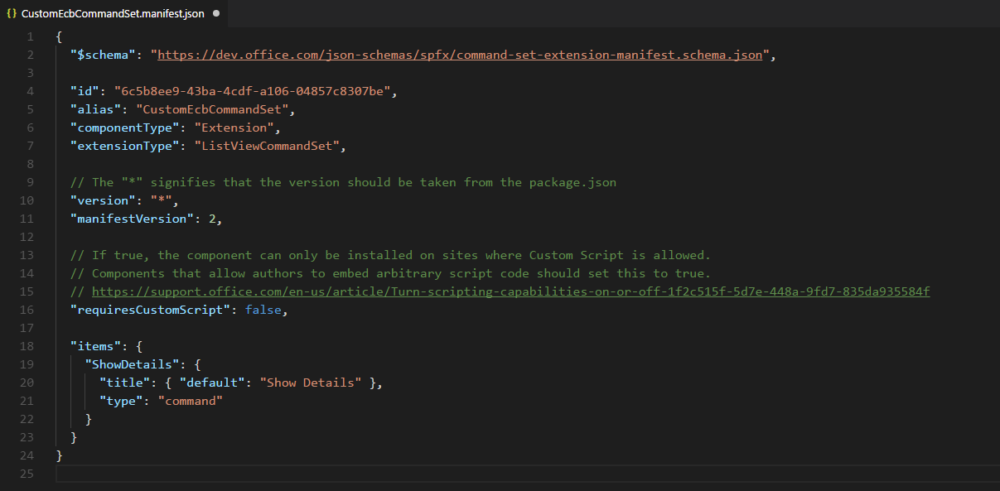

# <a name="migrating-from-edit-control-block-ecb-menu-item-to-sharepoint-framework-extensions"></a>Перенос пункта меню Edit Control Block (ECB) в расширения SharePoint Framework

За последние несколько лет в большинстве корпоративных решений на основе Office 365 и SharePoint Online для расширения пользовательского интерфейса страниц использовалась возможность _CustomAction_ для сайтов на платформе функций SharePoint. Однако в "современном" интерфейсе SharePoint Online большинство таких модификаций стало недоступным. Реализовать схожие функции в "современном" интерфейсе можно с помощью новых расширений SharePoint Framework. 

Из данного руководства вы узнаете, как перейти от старых ("классических") модификаций к новой модели на основе расширений SharePoint Framework.

> [!NOTE]
> Дополнительные сведения о создании расширений SharePoint Framework см. в статье [Обзор расширений SharePoint Framework](../overview-extensions.md).

Сначала рассмотрим доступные разработчикам варианты для создания расширений SharePoint Framework.

* **Настройщик приложений**. Расширьте встроенный "современный" пользовательский интерфейс SharePoint Online, добавив собственные элементы HTML и клиентский код к стандартным заполнителям "современных" страниц. На момент написания этой статьи заполнители доступны в верхнем и нижнем колонтитулах каждой "современной" страницы.
* **Набор команд**. Добавьте собственные элементы меню ECB или кнопки на панель команд списка или библиотеки. С этими командами можно связать любое действие JavaScript (TypeScript).
* **Настройщик полей**. Настройте отображение поля в списке, используя собственные элементы HTML и клиентский код.

Наиболее полезное в нашем контексте расширение — набор команд.

Предположим, у вас есть элемент _CustomAction_ в SharePoint Online, необходимый для создания пункта меню ECB для документов в библиотеке. Назначение пункта меню ECB — открытие настраиваемой страницы с предоставлением идентификаторов списка и выбранного в текущий момент пункта в строке запроса целевой страницы.

Ниже представлен XML-код этого элемента _CustomAction_ на платформе SharePoint Feature Framework.

```XML
<?xml version="1.0" encoding="utf-8"?>
<Elements xmlns="http://schemas.microsoft.com/sharepoint/">
  <CustomAction Id="OpenDetailsPageWithItemReference"
                Title="Show Details"
                Description="Opens a new page with further details about the currently selected item"
                Sequence="1001"
                RegistrationType="List"
                RegistrationId="101"                
                Location="EditControlBlock">
    <UrlAction Url="ShowDetails.aspx?ID={ItemId}&amp;List={ListId}" />
  </CustomAction>
</Elements>
```

Как видите, в файле элементов функции определяется элемент типа _CustomAction_, чтобы добавлять новый пункт в расположении _EditControlBlock_ (ECB) для любого документа в любой библиотеке (для параметра _RegistrationType_ задано значение _List_, а для параметра _RegistrationId_ — значение _101_).

На приведенном ниже рисунке представлены выходные данные вышеописанного дополнительного действия в представлении списка для библиотеки.


Обратите внимание на то, что настраиваемый элемент ECB в SharePoint Feature Framework работает и в "современном" списке. Если не использовать код JavaScript, то дополнительное действие для списков будет работать и в "современных" списках.

Ниже описано, как перенести старое решение в SharePoint Framework.

> [!NOTE]
> Прежде чем выполнять действия, описанные в этой статье, обязательно [настройте среду разработки](../../set-up-your-development-environment.md).

<a name="CreateCommandSet"> </a>

## <a name="create-a-new-sharepoint-framework-solution"></a>Создание решения SharePoint Framework

1. Откройте любую командную строку (например, PowerShell, CMD.EXE или Cmder). Создайте папку для решения под названием **spfx-ecb-extension**, а затем решение SharePoint Framework, запустив генератор Yeoman с помощью следующей команды:

2. При появлении соответствующих запросов укажите следующие параметры:

  * Оставьте имя решения по умолчанию (**spfx-ecb-extension**) и нажмите клавишу ВВОД.
  * Выберите **SharePoint Online only (latest)** (Только SharePoint Online, последняя версия) и нажмите клавишу ВВОД.
  * Выберите **Use the current folder** (Использовать текущую папку) и нажмите клавишу ВВОД.
  * Выберите **N**, чтобы сделать установку расширения, выполняемую напрямую, обязательной на каждом сайте при его использовании.
  * Выберите **Extension** (Расширение) в качестве типа создаваемого клиентского компонента.
  * Выберите для создаваемого расширения тип **ListView Command Set**.
  * Укажите имя **CustomECB** для набора команд.

  

  На этом этапе Yeoman устанавливает необходимые зависимости и выполняет скаффолдинг файлов и папок решения вместе с расширением **CustomFooter**. Это может занять несколько минут.

  После успешного формирования шаблона должно появиться следующее сообщение:

  

3. Чтобы заблокировать версию зависимостей проекта, выполните следующую команду:

  ```
  npm shrinkwrap
  ```

4. Запустите Visual Studio Code (или другой редактор кода) и начните разработку решения. Чтобы запустить Visual Studio Code, можно выполнить приведенный ниже оператор.

  ```
  code .
  ```

<a name="DefineCommandSetECB"> </a>

## <a name="define-the-new-ecb-item"></a>Определение нового элемента ECB

Чтобы воспроизвести такое поведение пункта меню ECB, созданного с помощью SharePoint Feature Framework, нужно реализовать такую же логику с помощью клиентского кода в новом решении SharePoint Framework. Чтобы выполнить эту задачу, сделайте следующее:

1. Откройте файл **CustomEcbCommandSet.manifest.json** в папке **src/extensions/customEcb**. Скопируйте значение свойства `id` и сохраните его в надежном месте, так как оно понадобится вам позже.

2. В том же файле измените массив **items** в нижней части файла, чтобы определить одну команду для набора команд. Вызовите команду **ShowDetails**, а затем укажите название и тип команды. На приведенном ниже снимке экрана показано, как должен выглядеть файл манифеста.

  

3. Откройте файл **CustomEcbCommandSet.ts** в папке **src/расширения/customEcb** и измените его содержимое в соответствии со следующим фрагментом кода:

  ``` TypeScript
  import { Guid } from '@microsoft/sp-core-library';
  import { override } from '@microsoft/decorators';
  import {
    BaseListViewCommandSet,
    Command,
    IListViewCommandSetListViewUpdatedParameters,
    IListViewCommandSetExecuteEventParameters
  } from '@microsoft/sp-listview-extensibility';
  import { Dialog } from '@microsoft/sp-dialog';

  import * as strings from 'CustomEcbCommandSetStrings';

  export interface ICustomEcbCommandSetProperties {
    targetUrl: string;
  }

  export default class CustomEcbCommandSet extends BaseListViewCommandSet<ICustomEcbCommandSetProperties> {

    @override
    public onInit(): Promise<void> {
      return Promise.resolve();
    }

    @override
    public onListViewUpdated(event: IListViewCommandSetListViewUpdatedParameters): void {
      const compareOneCommand: Command = this.tryGetCommand('ShowDetails');
      if (compareOneCommand) {
        // This command should be hidden unless exactly one row is selected.
        compareOneCommand.visible = event.selectedRows.length === 1;
      }
    }

    @override
    public onExecute(event: IListViewCommandSetExecuteEventParameters): void {
      switch (event.itemId) {
        case 'ShowDetails':

          const itemId: number = event.selectedRows[0].getValueByName("ID");
          const listId: Guid = this.context.pageContext.list.id;

          window.location.replace(`${this.properties.targetUrl}?ID=${itemId}&List=${listId}`);

          break;
        default:
          throw new Error('Unknown command');
      }
    }
  }
  ```

  Обратите внимание на оператор `import` в самом начале файла. Он ссылается на тип `Guid`, который будет использоваться для хранения идентификатора текущего списка. 
  
  Более того, в интерфейсе `ICustomEcbCommandSetProperties` объявляется одно свойство с именем `targetUrl`, с помощью которого можно предоставить URL-адрес целевой страницы, открываемой при выборе пункта меню ECB.

  Переопределенный метод `onExecute` выполняет дополнительное действие. Обратите внимание на фрагмент кода, считывающий идентификатор выбранного элемента из аргумента `event`, а также идентификатор исходного списка из объекта `pageContext`.

  Наконец, обратите внимание на переопределение метода `onListViewUpdated`, который по умолчанию включал команду `'ShowDetails'`, только если выбран один элемент.

  Перенаправление на целевой URL-адрес выполняется с помощью классического кода JavaScript и функции `window.location.replace`. Конечно, вы можете написать любой код TypeScript в методе `onExecute`. В качестве примера можно использовать платформу диалоговых окон SharePoint Framework, чтобы открыть новое диалоговое окно и взаимодействовать с пользователями.

  > [!NOTE]
  > Дополнительные сведения о платформе SharePoint Framework см. в документе [Использование настраиваемых диалоговых окон с расширениями SharePoint Framework](./using-custom-dialogs-with-spfx.md).

  <br/>

  На приведенном ниже рисунке показаны выходные данные.

  

<a name="DebugCommandSet"> </a>

## <a name="test-the-solution-in-debug-mode"></a>Тестирование решения в режиме отладки

1. Вернитесь в окно консоли и выполните приведенную ниже команду, чтобы выполнить сборку и запустить локальный сервер Node.js для размещения решения.

  ```
  gulp serve --nobrowser
  ```

2. Теперь откройте любой браузер и перейдите к "современной" библиотеке на любом "современном" сайте группы. Добавьте приведенные ниже параметры строки запроса к URL-адресу страницы **AllItems.aspx**.

  ```
  ?loadSpfx=true&debugManifestsFile=https://localhost:4321/temp/manifests.js&customActions={"6c5b8ee9-43ba-4cdf-a106-04857c8307be":{"location":"ClientSideExtension.ListViewCommandSet.ContextMenu","properties":{"targetUrl":"ShowDetail.aspx"}}}
  ```

  В приведенной выше строке запроса замените GUID на сохраненное ранее значение `id` из файла **CustomEcbCommandSet.manifest.json**. 
  
  Кроме того, доступно свойство `location`, которое принимает значение **ClientSideExtension.ListViewCommandSet.ContextMenu**. При этом SPFx отрисовывает набор команд в виде пункта меню ECB. Ниже представлены допустимые значения свойства `location`.
  
  * **ClientSideExtension.ListViewCommandSet.ContextMenu**.  Контекстное меню элементов.
  * **ClientSideExtension.ListViewCommandSet.CommandBar**. Меню верхнего уровня для набора команд в списке или библиотеке.
  * **ClientSideExtension.ListViewCommandSet**. Контекстное меню и панель команд (соответствует параметру `SPUserCustomAction.Location="CommandUI.Ribbon"`).

  В строке запроса есть свойство `properties`, представляющее сериализацию JSON для объекта типа `ICustomEcbCommandSetProperties` (типа настраиваемых свойств, запрашиваемых настраиваемым набором команд для отрисовки).

  При выполнении запроса страницы появится предупреждающее сообщение о разрешении на запуск кода с localhost (окно с заголовком "Разрешить скрипты отладки?"). Конечно, если вы хотите отладить и протестировать решение локально, необходимо разрешить загрузку скриптов отладки.

<a name="PackageAndHostCommandSet"> </a>

## <a name="package-and-host-the-solution"></a>Упаковка и размещение решения

Если вы довольны результатом, упакуйте решение и разместите его в настоящей инфраструктуре.
Прежде чем собирать пакет, необходимо объявить XML-файл Feature Framework для подготовки расширения.

### <a name="review-feature-framework-elements"></a>Обзор элементов Feature Framework

1. В редакторе кода откройте папку **/sharepoint/assets** в папке решения и измените файл **elements.xml**. В приведенном ниже фрагменте кода показано, как должен выглядеть файл.

  ```XML
  <?xml version="1.0" encoding="utf-8"?>
  <Elements xmlns="http://schemas.microsoft.com/sharepoint/">
      <CustomAction
          Title="CustomEcb"
          RegistrationId="101"
          RegistrationType="List"
          Location="ClientSideExtension.ListViewCommandSet.ContextMenu"
          ClientSideComponentId="6c5b8ee9-43ba-4cdf-a106-04857c8307be"
          ClientSideComponentProperties="{&quot;targetUrl&quot;:&quot;ShowDetails.aspx&quot;}">
      </CustomAction>
  </Elements>
  ```

  Как видите, он напоминает файл SharePoint Feature Framework из "классической" модели, но использует атрибут `ClientSideComponentId` для обращения к `id` настраиваемого расширения, а также атрибут `ClientSideComponentProperties` для настройки специальных свойств конфигурации, необходимых расширению.

2. Откройте файл **package-solution.json** в папке **/config** решения. В файле вы увидите ссылку на файл **elements.xml** в разделе `assets`.

  ```JSON
  {
    "$schema": "https://dev.office.com/json-schemas/spfx-build/package-solution.schema.json",
    "solution": {
      "name": "spfx-ecb-extension-client-side-solution",
      "id": "b8ff6fdf-16e9-4434-9fdb-eac6c5f948ee",
      "version": "1.0.2.0",
      "features": [
        {
          "title": "Custom ECB Menu Item.",
          "description": "Deploys a custom ECB menu item sample extension",
          "id": "f30a744c-6f30-4ccc-a428-125a290b5233",
          "version": "1.0.0.0",
          "assets": {
            "elementManifests": [
              "elements.xml"
            ]
          }
        }
      ]
    },
    "paths": {
      "zippedPackage": "solution/spfx-ecb-extension.sppkg"
    }
  }
  ```

### <a name="enable-the-cdn-in-your-office-365-tenant"></a>Включение сети доставки содержимого (CDN) в клиенте Office 365

Теперь необходимо разместить расширение в среде внешнего размещения. Сеть доставки содержимого Office 365 — самый простой способ размещать решения SharePoint непосредственно из их клиента, пользуясь при этом преимуществами службы сетей доставки содержимого (CDN) для сокращения времени загрузки ресурсов.

1. Скачайте [командную консоль SharePoint Online](https://www.microsoft.com/en-us/download/details.aspx?id=35588), чтобы убедиться, что у вас установлена последняя версия.

2. Подключитесь к клиенту SharePoint Online с помощью PowerShell:
    
    ```powershell
    Connect-SPOService -Url https://[tenant]-admin.sharepoint.com
    ```
    
3. Чтобы узнать текущее состояние настроек общедоступной сети CDN для клиента, поочередно выполните указанные ниже команды. 
    
    ```powershell
    Get-SPOTenantCdnEnabled -CdnType Public
    Get-SPOTenantCdnOrigins -CdnType Public
    Get-SPOTenantCdnPolicies -CdnType Public
    ```
    
4. Включите общедоступную сеть доставки содержимого в клиенте:
    
    ```powershell
    Set-SPOTenantCdnEnabled -CdnType Public
    ```
    
    Теперь в клиенте включена общедоступная сеть доставки содержимого с использованием разрешенной конфигурации типов файлов по умолчанию. Это означает, что поддерживаются такие расширения: CSS, EOT, CSS, EOT, GIF, ICO, JPEG, JPG, JS, MAP, PNG, SVG, TTF и WOFF.

5. Откройте браузер и перейдите к семейству веб-сайтов, в котором вы хотите разместить свою библиотеку CDN. Это может быть любое семейство веб-сайтов в клиенте. Это руководство описывает создание библиотеки CDN, но вы также можете использовать отдельную папку в любой существующей библиотеке документов как конечную точку CDN.

6. В семействе веб-сайтов создайте библиотеку документов **CDN** и добавьте в нее папку **customecb**.
    
7. В консоли PowerShell добавьте новый источник сети доставки содержимого. В этом случае мы задаем источник `*/cdn`, то есть в качестве источника сети доставки содержимого будет выступать любая относительная папка с именем **cdn**.
    
    ```powershell
    Add-SPOTenantCdnOrigin -CdnType Public -OriginUrl */cdn
    ```
    
8. Выполните указанную ниже команду, чтобы получить список источников сети доставки содержимого клиента:
    
    ```powershell
    Get-SPOTenantCdnOrigins -CdnType Public
    ```
    
  Обратите внимание на то, что новый источник указан как допустимый источник сети доставки содержимого. Окончательная настройка источника занимает приблизительно 15 минут, поэтому мы можем продолжить подготовку расширения, которое будет размещено в источнике после развертывания. 

  

  Если рядом с названием источника нет уведомления `(configuration pending)`, он готов к использованию в клиенте. Это указывает на выполняющуюся настройку SharePoint Online и системы CDN. 

### <a name="update-the-solution-settings-and-publish-it-on-the-cdn"></a>Обновление параметров решения и его публикация в сети доставки содержимого

Далее необходимо обновить решение, чтобы разместить его в только что созданной сети CDN, а также опубликовать в ней пакет решения. Для этого выполните указанные ниже действия.

1. Вернитесь к ранее созданному решению, чтобы внести необходимые изменения в URL-адреса.
    
2. Обновите файл **write-manifestests.json** (в папке **config**), как показано ниже, чтобы он указывал на конечную точку CDN. Используйте `publiccdn.sharepointonline.com` в качестве префикса, а затем дополните URL-адрес фактическим путем к клиенту. Формат URL-адреса для сети доставки содержимого:
    
    ```
    https://publiccdn.sharepointonline.com/[tenant host name]/sites/[site]/[library]/[folder]
    ```
    
    

3. Сохраните изменения.

4. Выполните описанную ниже задачу для упаковки решения. При этом будет выполнена сборка конечной версии проекта с использованием URL-адреса сети доставки содержимого, указанного в файле **writer-manifest.json**. Результат будет помещен в папку **./temp/deploy**. Эти файлы вам нужно будет добавить в папку SharePoint, представляющую собой конечную точку CDN. 
    
    ```
    gulp bundle --ship
    ```
    
5. Выполните приведенную ниже задачу, чтобы упаковать решение. Эта команда создаст пакет **spfx-ecb-extension.sppkg** в папке **sharepoint/solution** и подготовит ресурсы в папке **temp/deploy** к развертыванию в CDN.
    
    ```
    gulp package-solution --ship
    ```
    
6. Отправьте или перетащите новый пакет клиентского решения в каталог приложений в клиенте. Нажмите кнопку **Развернуть**.

    

7. Отправьте или перетащите файлы из папки **temp/deploy** в созданную ранее папку **CDN/customfooter**.

<a name="InstallCommandSet"> </a>

## <a name="install-and-run-the-solution"></a>Установка и запуск решения

1. Откройте браузер и перейдите на любой "современный" сайт.

2. Перейдите на страницу **Содержимое сайта** и добавьте новое **приложение**.

3. Выберите **Из вашей организации**, чтобы просмотреть решения, доступные в каталоге приложений.

4. Выберите решение **spfx-ecb-extension-client-side-solution** и установите его на целевом сайте.

    

5. После завершения установки приложения откройте библиотеку **Документы** на сайте. Выбрав один документ, вы увидите пользовательский пункт меню ECB в действии.

Поздравляем! Вы создали пункт меню ECB с помощью расширений SharePoint Framework.

## <a name="see-also"></a>См. также

- [Обзор расширений SharePoint Framework](../overview-extensions.md)
