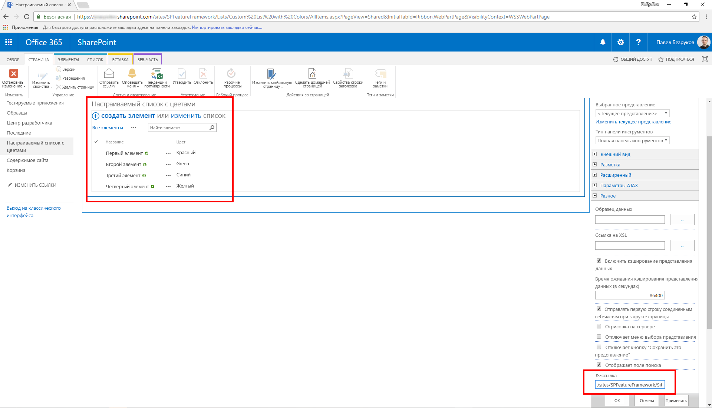
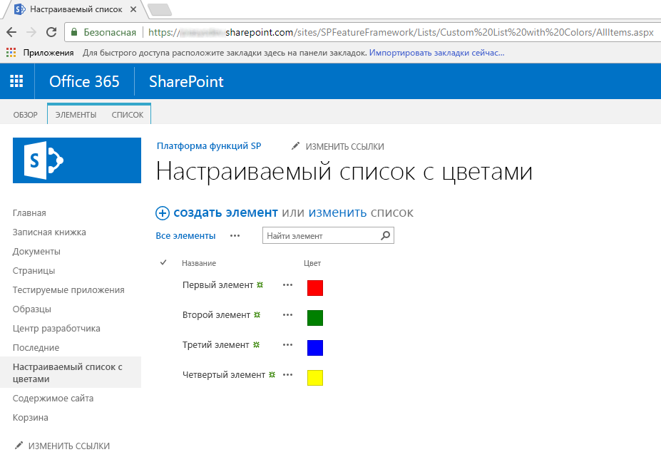
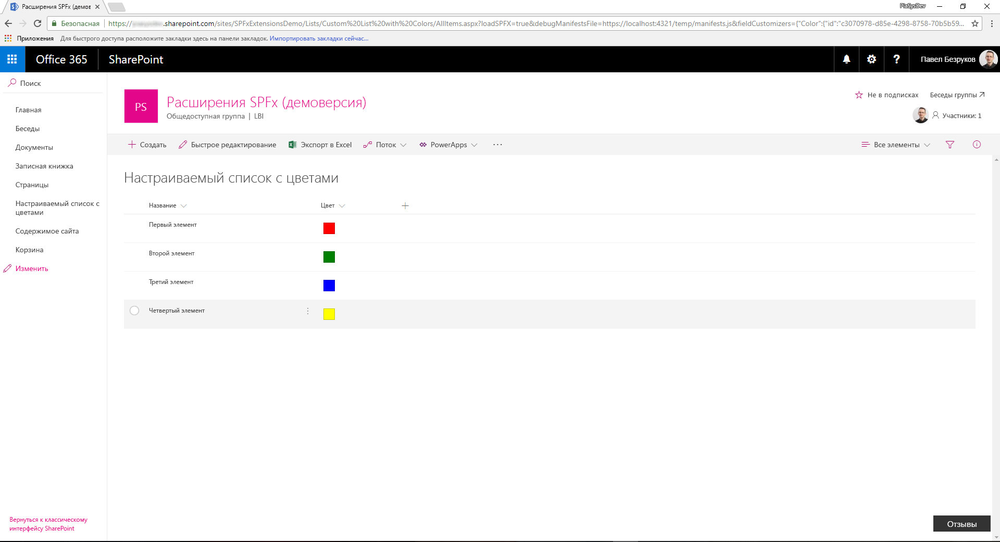
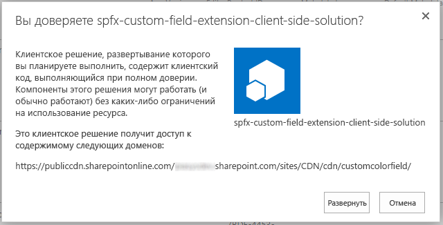
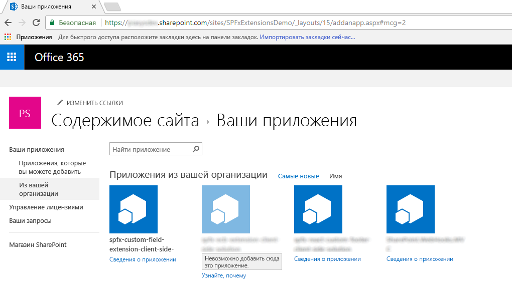
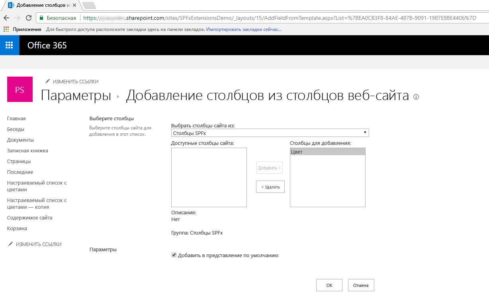
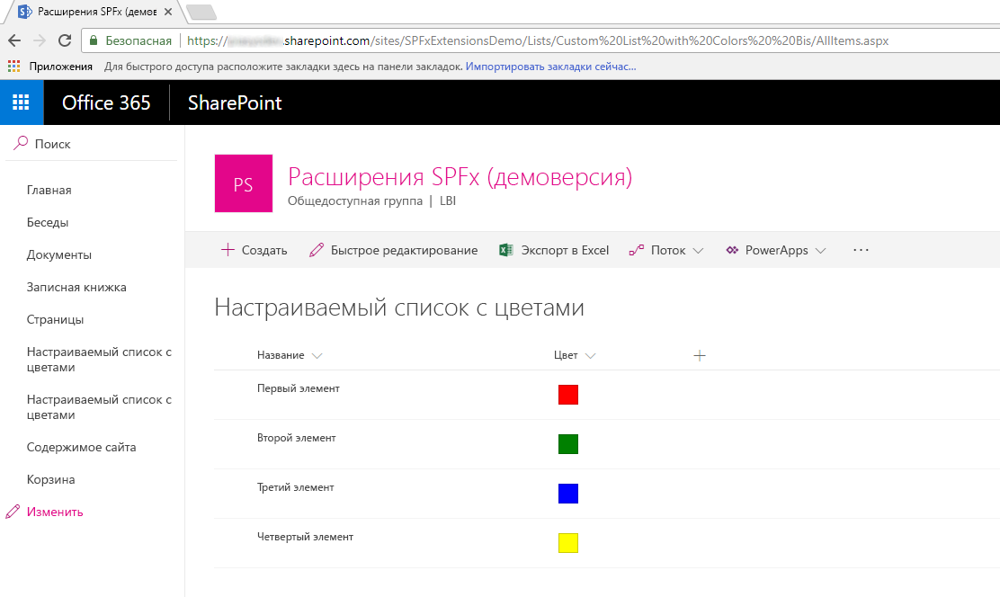

# <a name="migrating-from-jslink-to-sharepoint-framework-extensions"></a><span data-ttu-id="f24e4-103">Переход с JSLink на расширения SharePoint Framework</span><span class="sxs-lookup"><span data-stu-id="f24e4-103">Migrating from JSLink to SharePoint Framework Extensions</span></span>

<span data-ttu-id="f24e4-104">Начиная с Microsoft SharePoint 2013, в большинстве корпоративных решений, основанных на Office 365 и SharePoint Online, для настройки полей использовалось свойство `JSLink` полей и представлений списков.</span><span class="sxs-lookup"><span data-stu-id="f24e4-104">Since Microsoft SharePoint 2013, most of the enterprise solutions built on top of Office 365 and SharePoint Online leveraged the `JSLink` property of fields and list views to customize the rendering of fields.</span></span> <span data-ttu-id="f24e4-105">Однако в "современном" интерфейсе SharePoint Online большинство таких настроек больше не доступно.</span><span class="sxs-lookup"><span data-stu-id="f24e4-105">However, within the new "modern" UI of SharePoint Online, most of those customizations are no longer available.</span></span> <span data-ttu-id="f24e4-106">Реализовать схожие функции в "современном" интерфейсе можно с помощью новых расширений SharePoint Framework.</span><span class="sxs-lookup"><span data-stu-id="f24e4-106">Fortunately, with the new SharePoint Framework Extensions, you can now provide almost the same functionality in the "modern" UI.</span></span> 

<span data-ttu-id="f24e4-107">Из данного руководства вы узнаете, как перейти со старых ("классических") настроек на новую модель на основе расширений SharePoint Framework.</span><span class="sxs-lookup"><span data-stu-id="f24e4-107">In this tutorial you learn how to migrate from the old "classic" customizations to the new model based on SharePoint Framework Extensions.</span></span>

> [!NOTE]
> <span data-ttu-id="f24e4-108">Дополнительные сведения о создании расширений SharePoint Framework см. в статье [Обзор расширений SharePoint Framework](../overview-extensions.md).</span><span class="sxs-lookup"><span data-stu-id="f24e4-108">For more information about how to build SharePoint Framework Extensions, see [Overview of SharePoint Framework Extensions](../overview-extensions.md).</span></span>

<span data-ttu-id="f24e4-109">Сначала рассмотрим доступные разработчикам варианты для создания расширений SharePoint Framework.</span><span class="sxs-lookup"><span data-stu-id="f24e4-109">First, let's introduce the available options when developing SharePoint Framework Extensions:</span></span>

* <span data-ttu-id="f24e4-110">**Настройщик приложений**.</span><span class="sxs-lookup"><span data-stu-id="f24e4-110">**Application Customizer**.</span></span> <span data-ttu-id="f24e4-111">Расширьте встроенный "современный" пользовательский интерфейс SharePoint Online, добавив собственные элементы HTML и клиентский код к стандартным заполнителям "современных" страниц.</span><span class="sxs-lookup"><span data-stu-id="f24e4-111">Extend the native "modern" UI of SharePoint Online by adding custom HTML elements and client-side code to pre-defined placeholders of "modern" pages.</span></span> <span data-ttu-id="f24e4-112">На момент написания этой статьи заполнители доступны в верхнем и нижнем колонтитулах каждой "современной" страницы.</span><span class="sxs-lookup"><span data-stu-id="f24e4-112">At the time of this writing, the available placeholders are the header and the footer of every "modern" page.</span></span>
* <span data-ttu-id="f24e4-113">**Набор команд**.</span><span class="sxs-lookup"><span data-stu-id="f24e4-113">**Command Set**.</span></span> <span data-ttu-id="f24e4-114">Добавьте собственные элементы меню ECB или кнопки на панель команд списка или библиотеки.</span><span class="sxs-lookup"><span data-stu-id="f24e4-114">Add custom ECB menu items or custom buttons to the command bar of a list view for a list or a library.</span></span> <span data-ttu-id="f24e4-115">С этими командами можно связать любое действие JavaScript (TypeScript).</span><span class="sxs-lookup"><span data-stu-id="f24e4-115">You can associate any JavaScript (TypeScript) action to these commands.</span></span>
* <span data-ttu-id="f24e4-116">**Настройщик полей**.</span><span class="sxs-lookup"><span data-stu-id="f24e4-116">**Field Customizer**.</span></span> <span data-ttu-id="f24e4-117">Настройте отрисовку поля в списке, используя собственные элементы HTML и клиентский код.</span><span class="sxs-lookup"><span data-stu-id="f24e4-117">Customize the rendering of a field in a list view by using custom HTML elements and client-side code.</span></span>

<span data-ttu-id="f24e4-118">Наиболее полезное в нашем контексте расширение — настройщик заполнителей.</span><span class="sxs-lookup"><span data-stu-id="f24e4-118">The most useful option in our context is the Field Customizer extension.</span></span>

<span data-ttu-id="f24e4-119">Предположим, используется среда SharePoint Online, в которой есть настраиваемый список с настраиваемым полем Color, относящимся к типу **Choice** и принимающим следующие значения: _Red_, _Green_, _Blue_, _Yellow_.</span><span class="sxs-lookup"><span data-stu-id="f24e4-119">Assume that you are in SharePoint Online, and you have a custom list with a custom field called "Color", which is of type **Choice** and which can assume the following values: _Red_, _Green_, _Blue_, _Yellow_.</span></span> <span data-ttu-id="f24e4-120">Допустим, что у вас есть собственное значение для свойства `JSLink` веб-части представления списка.</span><span class="sxs-lookup"><span data-stu-id="f24e4-120">Assume that you have a custom value for the `JSLink` property of the list view rendering web part of the custom list.</span></span> 

<span data-ttu-id="f24e4-121">Ниже представлен фрагмент кода JavaScript, на который ссылается свойство `JSLink` (**customColorRendering.js**).</span><span class="sxs-lookup"><span data-stu-id="f24e4-121">In the following code snippet, you can see the JavaScript code referenced by the `JSLink` property (**customColorRendering.js**).</span></span>

```JavaScript
// Define a namespace for the custom rendering code
var customJSLinkRendering = customJSLinkRendering || {}; 

// Define a function that declare the custom rendering rules for the target list view
customJSLinkRendering.CustomizeFieldRendering = function () {  

    // Define a custom object to configure the rendering template overrides
    var customRenderingOverride = {};
    customRenderingOverride.Templates = {};
    customRenderingOverride.Templates.Fields = 
    { 
        // Declare the custom rendering function for the 'View' of field 'Color'
        'Color': 
        { 
            'View': customJSLinkRendering.RenderColorField 
        } 
    }; 

    // Register the custom rendering template
    SPClientTemplates.TemplateManager.RegisterTemplateOverrides(customRenderingOverride); 
}; 

// Declare the custom rendering function for the 'View' of field 'Color'
customJSLinkRendering.RenderColorField = function (context)  
{ 
    var colorField = context.CurrentItem.Color; 

    // Declare a local variable to hold the output color
    var color = '';

    // Evaluate the values of the 'Color' field and render it accordingly
    switch (colorField)
    {
        case 'Red':
            color = 'red';
            break;
        case 'Green':
            color = 'green';
            break;
        case 'Blue':
            color = 'blue';
            break;
        case 'Yellow':
            color = 'yellow';
            break;
        default:
            color = 'white';
            break;
    }

    // Render the output for the 'Color' field
    return "<div style='float: left; width: 20px; height: 20px; margin: 5px; border: 1px solid rgba(0,0,0,.2);background:" + color + "' />"; 
}; 

// Invoke the custom rendering function
customJSLinkRendering.CustomizeFieldRendering();
```

<br/>

<span data-ttu-id="f24e4-122">Кроме того, на приведенном ниже снимке экрана показано, как настраивается свойство `JSLink` в веб-части представления списка.</span><span class="sxs-lookup"><span data-stu-id="f24e4-122">Moreover, in the following screenshot you can see how the `JSLink` property is configured in the list view web part.</span></span>



<br/>

<span data-ttu-id="f24e4-124">Если вы отправили файл JavaScript в библиотеку **Активы сайта**, то для свойства `JSLink` может быть задано значение `"~site/SiteAssets/customColorRendering.js"`.</span><span class="sxs-lookup"><span data-stu-id="f24e4-124">If you uploaded the JavaScript file into the **Site Assets** library, the value for the `JSLink` property can be `"~site/SiteAssets/customColorRendering.js"`.</span></span>

<span data-ttu-id="f24e4-125">Для полноты картины ниже показано, как теперь отрисовывается список.</span><span class="sxs-lookup"><span data-stu-id="f24e4-125">For the sake of completeness, you can see how the custom rendering of the list works.</span></span>



<span data-ttu-id="f24e4-127">Как видите, в полях Color отображается квадрат, заполненный цветом, выбранным на уровне элемента.</span><span class="sxs-lookup"><span data-stu-id="f24e4-127">As you can see, "Color" fields render a colored box filled with the color selected at the item level.</span></span>

> [!NOTE]
> <span data-ttu-id="f24e4-128">Чтобы подготовить такое решение на "классическом сайте", можно воспользоваться шаблоном подготовки PnP, который может одновременно подготовить список с настраиваемым полем и свойство `JSLink`.</span><span class="sxs-lookup"><span data-stu-id="f24e4-128">To provision this kind of solution in a "classic" site you can eventually use a PnP Provisioning Template, which can provision both the list with the custom field, and the `JSLink` property at once.</span></span>

<span data-ttu-id="f24e4-129">Ниже описано, как перенести старое решение в SharePoint Framework.</span><span class="sxs-lookup"><span data-stu-id="f24e4-129">To migrate the previous solution to the SharePoint Framework, see the following steps.</span></span>

> [!NOTE]
> <span data-ttu-id="f24e4-130">Прежде чем выполнять действия, описанные в этой статье, обязательно [настройте среду разработки](../../set-up-your-development-environment.md).</span><span class="sxs-lookup"><span data-stu-id="f24e4-130">Before following the steps in this article, be sure to [Set up your development environment](../../set-up-your-development-environment.md).</span></span>

## <a name="create-a-new-sharepoint-framework-solution"></a><span data-ttu-id="f24e4-131">Создание решения SharePoint Framework</span><span class="sxs-lookup"><span data-stu-id="f24e4-131">Create a new SharePoint Framework solution</span></span>

1. <span data-ttu-id="f24e4-132">Откройте любую командную строку (например, PowerShell, CMD.EXE или Cmder).</span><span class="sxs-lookup"><span data-stu-id="f24e4-132">Open the command line tool of your choice (for example, PowerShell, CMD.EXE, Cmder).</span></span> <span data-ttu-id="f24e4-133">Создайте папку для решения под названием **spfx-custom-field-extension** и создайте решение SharePoint Framework, запустив генератор Yeoman с помощью следующей команды:</span><span class="sxs-lookup"><span data-stu-id="f24e4-133">Create a new folder for the solution named **spfx-custom-field-extension**, and create a new SharePoint Framework solution by running the Yeoman generator with the following command:</span></span>

    ```
    yo @microsoft/sharepoint
    ```

2. <span data-ttu-id="f24e4-134">Когда инструмент попросит, укажите следующие сведения:</span><span class="sxs-lookup"><span data-stu-id="f24e4-134">When prompted by the tool, provide the following answers:</span></span>
    
    * <span data-ttu-id="f24e4-135">Оставьте имя решения по умолчанию (**spfx-custom-field-extension**) и нажмите клавишу ВВОД.</span><span class="sxs-lookup"><span data-stu-id="f24e4-135">Accept the default name **spfx-custom-field-extension** for your solution, and select Enter.</span></span>
    * <span data-ttu-id="f24e4-136">Выберите **SharePoint Online only (latest)** (Только SharePoint Online, последняя версия) и нажмите клавишу ВВОД.</span><span class="sxs-lookup"><span data-stu-id="f24e4-136">Select **SharePoint Online only (latest)**, and select Enter.</span></span>
    * <span data-ttu-id="f24e4-137">Выберите **Use the current folder** (Использовать текущую папку) и нажмите клавишу ВВОД.</span><span class="sxs-lookup"><span data-stu-id="f24e4-137">Select **Use the current folder**, and select Enter.</span></span>
    * <span data-ttu-id="f24e4-138">Выберите **N**, чтобы сделать установку расширения, выполняемую напрямую, обязательной на каждом сайте при его использовании.</span><span class="sxs-lookup"><span data-stu-id="f24e4-138">Select **N** to require the extension to be installed on each site explicitly when it's being used.</span></span>
    * <span data-ttu-id="f24e4-139">Выберите **Расширение** в качестве типа создаваемого клиентского компонента.</span><span class="sxs-lookup"><span data-stu-id="f24e4-139">Select **Extension** as the client-side component type to be created.</span></span>
    * <span data-ttu-id="f24e4-140">Выберите для создаваемого расширения тип **Настройщик полей**.</span><span class="sxs-lookup"><span data-stu-id="f24e4-140">Select **Field Customizer** as the extension type to be created.</span></span>
    * <span data-ttu-id="f24e4-141">Укажите для настройщика полей имя **CustomColorField**.</span><span class="sxs-lookup"><span data-stu-id="f24e4-141">Provide **CustomColorField** as the name for your Field Customizer.</span></span>
    * <span data-ttu-id="f24e4-142">Чтобы не использовать конкретную платформу JavaScript, выберите параметр **No JavaScript framework** (Без платформы JavaScript).</span><span class="sxs-lookup"><span data-stu-id="f24e4-142">Select to not use any specific JavaScript framework by selecting the **No JavaScript framework** option.</span></span>

    

    <span data-ttu-id="f24e4-144">На этом этапе Yeoman устанавливает необходимые зависимости и формирует шаблон файлов и папок решения вместе с расширением **CustomColorField**.</span><span class="sxs-lookup"><span data-stu-id="f24e4-144">At this point, Yeoman installs the required dependencies and scaffolds the solution files and folders along with the **CustomColorField** extension.</span></span> <span data-ttu-id="f24e4-145">Это может занять несколько минут.</span><span class="sxs-lookup"><span data-stu-id="f24e4-145">This might take a few minutes.</span></span>

    <span data-ttu-id="f24e4-146">После успешного формирования шаблона должно появиться следующее сообщение:</span><span class="sxs-lookup"><span data-stu-id="f24e4-146">When the scaffold is complete, you should see the following message indicating a successful scaffold:</span></span>

    

3. <span data-ttu-id="f24e4-148">Чтобы заблокировать версию зависимостей проекта, выполните следующую команду:</span><span class="sxs-lookup"><span data-stu-id="f24e4-148">To lock down the version of the project dependencies, run the following command:</span></span>

    ```
    npm shrinkwrap
    ```

4. <span data-ttu-id="f24e4-149">Запустите Visual Studio Code (или другой редактор кода) и начните разработку решения.</span><span class="sxs-lookup"><span data-stu-id="f24e4-149">Start Visual Studio Code (or the code editor of your choice) and start developing the solution.</span></span> <span data-ttu-id="f24e4-150">Чтобы запустить Visual Studio Code, можно выполнить приведенный ниже оператор.</span><span class="sxs-lookup"><span data-stu-id="f24e4-150">To start Visual Studio Code, you can execute the following statement.</span></span>

    ```
    code .
    ```

## <a name="define-the-new-field-customizer-with-javascript"></a><span data-ttu-id="f24e4-151">Определение нового настройщика полей с помощью JavaScript</span><span class="sxs-lookup"><span data-stu-id="f24e4-151">Define the new Field Customizer with JavaScript</span></span>

<span data-ttu-id="f24e4-152">Чтобы воспроизвести отрисовку настраиваемого поля `JSLink`, необходимо реализовать ту же логику с помощью клиентского кода в новом решении SharePoint Framework.</span><span class="sxs-lookup"><span data-stu-id="f24e4-152">To reproduce the same behavior of the `JSLink` custom field rendering, you need to implement the same logic by using client-side code within the new SharePoint Framework solution.</span></span> <span data-ttu-id="f24e4-153">Чтобы выполнить эту задачу, сделайте следующее:</span><span class="sxs-lookup"><span data-stu-id="f24e4-153">To accomplish this task, complete the following steps.</span></span>

1. <span data-ttu-id="f24e4-154">Откройте файл **CustomColorFieldFieldCustomizer.manifest.json** в папке **src/extensions/customColorField**.</span><span class="sxs-lookup"><span data-stu-id="f24e4-154">Open the file **CustomColorFieldFieldCustomizer.manifest.json** in the **src/extensions/customColorField** folder.</span></span> <span data-ttu-id="f24e4-155">Скопируйте значение свойства `id` и сохраните его в надежном месте, так как оно понадобится вам позже.</span><span class="sxs-lookup"><span data-stu-id="f24e4-155">Copy the value of the `id` property and store it in a safe place because you need it later.</span></span>

2. <span data-ttu-id="f24e4-156">Откройте файл **CustomColorFieldFieldCustomizer.ts** в папке **src/extensions/customColorField** и измените его содержимое в соответствии со следующим фрагментом кода:</span><span class="sxs-lookup"><span data-stu-id="f24e4-156">Open the **CustomColorFieldFieldCustomizer.ts** file in the **src/extensions/customColorField** folder, and edit the content according to the following code snippet:</span></span>

    ``` TypeScript
    import { Log } from '@microsoft/sp-core-library';
    import { override } from '@microsoft/decorators';
    import {
    BaseFieldCustomizer,
    IFieldCustomizerCellEventParameters
    } from '@microsoft/sp-listview-extensibility';

    import * as strings from 'CustomColorFieldFieldCustomizerStrings';
    import styles from './CustomColorFieldFieldCustomizer.module.scss';

    /**
    * If your field customizer uses the ClientSideComponentProperties JSON input,
    * it will be deserialized into the BaseExtension.properties object.
    * You can define an interface to describe it.
    */
    export interface ICustomColorFieldFieldCustomizerProperties {
    // This is an example; replace with your own property
    sampleText?: string;
    }

    const LOG_SOURCE: string = 'CustomColorFieldFieldCustomizer';

    export default class CustomColorFieldFieldCustomizer
    extends BaseFieldCustomizer<ICustomColorFieldFieldCustomizerProperties> {

    @override
    public onInit(): Promise<void> {
        // Add your custom initialization to this method.  The framework will wait
        // for the returned promise to resolve before firing any BaseFieldCustomizer events.
        Log.info(LOG_SOURCE, 'Activated CustomColorFieldFieldCustomizer with properties:');
        Log.info(LOG_SOURCE, JSON.stringify(this.properties, undefined, 2));
        Log.info(LOG_SOURCE, `The following string should be equal: "CustomColorFieldFieldCustomizer" and "${strings.Title}"`);
        return Promise.resolve();
    }

    @override
    public onRenderCell(event: IFieldCustomizerCellEventParameters): void {

        var colorField = event.fieldValue; 
        
        // Declare a local variable to hold the output color
        var color = '';

        // Evaluate the values of the 'Color' field and render it accordingly
        switch (colorField)
        {
            case 'Red':
                color = 'red';
                break;
            case 'Green':
                color = 'green';
                break;
            case 'Blue':
                color = 'blue';
                break;
            case 'Yellow':
                color = 'yellow';
                break;
            default:
                color = 'white';
                break;
        }
        
        // Render the output for the 'Color' field
        event.domElement.innerHTML = "<div style='float: left; width: 20px; height: 20px; margin: 5px; border: 1px solid rgba(0,0,0,.2);background:" + color + "' />"; 
    }

    @override
    public onDisposeCell(event: IFieldCustomizerCellEventParameters): void {
        // This method should be used to free any resources that were allocated during rendering.
        // For example, if your onRenderCell() called ReactDOM.render(), then you should
        // call ReactDOM.unmountComponentAtNode() here.
        super.onDisposeCell(event);
    }
    }
    ```

    <span data-ttu-id="f24e4-157">Как видите, содержимое метода `onRenderCell` практически такое же, как у метода `RenderColorField` в реализации `JSLink`.</span><span class="sxs-lookup"><span data-stu-id="f24e4-157">As you can see, the content of the method `onRenderCell` is almost the same as the previous `RenderColorField` method in the `JSLink` implementation.</span></span> <span data-ttu-id="f24e4-158">Единственные отличия:</span><span class="sxs-lookup"><span data-stu-id="f24e4-158">The only differences are:</span></span>

    - <span data-ttu-id="f24e4-159">Чтобы получить текущее значение поля, необходимо считать свойство `event.fieldValue` входного аргумента метода `onRenderCell`.</span><span class="sxs-lookup"><span data-stu-id="f24e4-159">To retrieve the current field value, you need to read the `event.fieldValue` property of the input argument of the `onRenderCell` method.</span></span>
    - <span data-ttu-id="f24e4-160">Чтобы вернуть настраиваемый HTML-код для отрисовки поля, необходимо назначить значение свойству `innerHTML` объекта `event.domElement`, представляющему выходной контейнер HTML для отрисовки поля.</span><span class="sxs-lookup"><span data-stu-id="f24e4-160">To return the custom HTML code to render the field, you need to assign a value to the `innerHTML` property of the `event.domElement` object, which represents the output HTML container of the field rendering.</span></span>

    <span data-ttu-id="f24e4-161">Если не считать этих незначительных изменений, вы можете использовать практически такой же код JavaScript, как прежде.</span><span class="sxs-lookup"><span data-stu-id="f24e4-161">Aside from these small changes, you can reuse almost the same JavaScript code as before.</span></span>

    <span data-ttu-id="f24e4-162">На приведенном ниже рисунке показан результат.</span><span class="sxs-lookup"><span data-stu-id="f24e4-162">In the following figure, you can see the resulting output.</span></span>

    

## <a name="test-the-solution-in-debug-mode"></a><span data-ttu-id="f24e4-164">Тестирование решения в режиме отладки</span><span class="sxs-lookup"><span data-stu-id="f24e4-164">Test the solution in debug mode</span></span>

1. <span data-ttu-id="f24e4-165">Вернитесь в окно консоли и выполните приведенную ниже команду, чтобы выполнить сборку и запустить локальный сервер Node.js для размещения решения.</span><span class="sxs-lookup"><span data-stu-id="f24e4-165">Go back to the console window and run the following command to build the solution and run the local Node.js server to host it.</span></span>

    ```
    gulp serve --nobrowser
    ```

2. <span data-ttu-id="f24e4-166">Откройте любой браузер и перейдите к "современному" списку, содержащему настраиваемое поле с именем **Color** и типом **Choice** с теми же значениями, что и раньше (Red, Green, Blue, Yellow).</span><span class="sxs-lookup"><span data-stu-id="f24e4-166">Open your favorite browser, and go to a "modern" list, which has a custom field with the name **Color** and the type **Choice** with the same value options as before (Red, Green, Blue, Yellow).</span></span> <span data-ttu-id="f24e4-167">Вы можете использовать список, созданный на "классическом" сайте, просто просматривая его в "современном" интерфейсе.</span><span class="sxs-lookup"><span data-stu-id="f24e4-167">You can eventually use the list you created in the "classic" site, just viewing it with the new "modern" experience.</span></span> <span data-ttu-id="f24e4-168">Теперь добавьте приведенные ниже параметры строки запроса к URL-адресу страницы **AllItems.aspx**.</span><span class="sxs-lookup"><span data-stu-id="f24e4-168">Now, append the following query string parameters to the **AllItems.aspx** page URL.</span></span>

    ```
    ?loadSPFX=true&debugManifestsFile=https://localhost:4321/temp/manifests.js&fieldCustomizers={"Color":{"id":"c3070978-d85e-4298-8758-70b5b5933076"}}
    ```

    <span data-ttu-id="f24e4-169">В приведенной ниже строке запроса замените GUID сохраненным значением `id` из файла **CustomColorFieldFieldCustomizer.manifest.json**. Имя объекта **Color** указывает на поле, которое нужно настроить.</span><span class="sxs-lookup"><span data-stu-id="f24e4-169">In this query string, replace the GUID with the `id` value you saved from the **CustomColorFieldFieldCustomizer.manifest.json** file, and the **Color** object name refers to the name of the field to customize.</span></span> <span data-ttu-id="f24e4-170">При желании вы также можете передать настраиваемый объект конфигурации, сериализованный в формате JSON, в качестве дополнительного параметра при конструировании настройщика полей.</span><span class="sxs-lookup"><span data-stu-id="f24e4-170">If you like, you can also provide a custom configuration object, serialized in JSON format, as an additional parameter for the field customizer construction.</span></span>

    <span data-ttu-id="f24e4-171">При выполнении запроса страницы появится запрос разрешения на запуск кода с домена localhost (окно с заголовком "Разрешить скрипты отладки?").</span><span class="sxs-lookup"><span data-stu-id="f24e4-171">Notice that when executing the page request, you are prompted with a warning message box with the title "Allow debug scripts?", which asks your consent to run code from localhost for security reasons.</span></span> <span data-ttu-id="f24e4-172">Конечно, если вы хотите отладить и протестировать решение локально, необходимо разрешить загрузку скриптов отладки.</span><span class="sxs-lookup"><span data-stu-id="f24e4-172">Of course, if you want to locally debug and test the solution, you have to allow it to "Load debug scripts."</span></span>

## <a name="define-the-new-field-customizer-with-typescript"></a><span data-ttu-id="f24e4-173">Определение нового настройщика полей с помощью TypeScript</span><span class="sxs-lookup"><span data-stu-id="f24e4-173">Define the new Field Customizer with TypeScript</span></span>

<span data-ttu-id="f24e4-174">Теперь вы можете заменить код JavaScript на TypeScript, чтобы воспользоваться преимуществами полностью типизированного подхода TypeScript.</span><span class="sxs-lookup"><span data-stu-id="f24e4-174">You are now ready to replace the JavaScript code with TypeScript to benefit from the fully typed approach of TypeScript.</span></span>

1. <span data-ttu-id="f24e4-175">Откройте файл **CustomColorFieldFieldCustomizer.module.scss** в папке **src/extensions/customColorField**.</span><span class="sxs-lookup"><span data-stu-id="f24e4-175">Open the file **CustomColorFieldFieldCustomizer.module.scss** in the **src/extensions/customColorField** folder.</span></span> <span data-ttu-id="f24e4-176">В этом SCSS-файле представлен стиль пользовательского интерфейса настройщика полей.</span><span class="sxs-lookup"><span data-stu-id="f24e4-176">This file, which is a Sass CSS, represents the UI style for the field customizer.</span></span> <span data-ttu-id="f24e4-177">Замените содержимое SCSS-файла приведенным ниже кодом.</span><span class="sxs-lookup"><span data-stu-id="f24e4-177">Replace the content of the SCSS file with the following.</span></span>

    ``` SCSS
    .CustomColorField {
    .cell {
        float: left;
        width: 20px; 
        height: 20px; 
        margin: 5px; 
        border: 1px solid rgba(0,0,0,.2);
    }

    .cellRed {
        background: red;
    }

    .cellGreen {
        background: green;
    }

    .cellBlue {
        background: blue;
    }

    .cellYellow {
        background: yellow;
    }

    .cellWhite {
        background: white;
    }
    }
    ```

2. <span data-ttu-id="f24e4-178">Замените реализацию метода `onRenderCell` приведенным ниже фрагментом кода.</span><span class="sxs-lookup"><span data-stu-id="f24e4-178">Replace the implementation of the `onRenderCell` method with the following code excerpt.</span></span>

    ``` TypeScript
    @override
    public onRenderCell(event: IFieldCustomizerCellEventParameters): void {

    // Read the current field value
    let colorField: String = event.fieldValue; 

    // Add the main style to the field container element
    event.domElement.classList.add(styles.CustomColorField);

    // Get a reference to the output HTML
    let fieldHtml: HTMLDivElement = event.domElement.firstChild as HTMLDivElement;

    // Add the standard style
    fieldHtml.classList.add(styles.cell);

    // Add the colored style
    switch(colorField)
    {
        case "Red":
        fieldHtml.classList.add(styles.cellRed);
        break;
        case "Green":
        fieldHtml.classList.add(styles.cellGreen);
        break;
        case "Blue":
        fieldHtml.classList.add(styles.cellBlue);
        break;
        case "Yellow":
        fieldHtml.classList.add(styles.cellYellow);
        break;
        default:
        fieldHtml.classList.add(styles.cellWhite);
        break;
    }
    }
    ```

    <span data-ttu-id="f24e4-179">Обратите внимание, что в новой реализации метода используется полностью типизированный подход, а класс CSS `cell` назначается дочернему элементу `DIV` текущего элемента поля вместе с другим пользовательским классом CSS, чтобы определить целевой цвет элемента `DIV` в соответствии с выбранным значением поля.</span><span class="sxs-lookup"><span data-stu-id="f24e4-179">Notice that the new method implementation uses a fully typed approach, and assigns the `cell` CSS class to the `DIV` element child of the current field element, together with another custom CSS class to define the target color of the `DIV` based on the currently selected value for the field.</span></span>

3. <span data-ttu-id="f24e4-180">Еще раз запустите настройщик полей в режиме отладки и просмотрите результаты.</span><span class="sxs-lookup"><span data-stu-id="f24e4-180">Run the Field Customizer one more time in debug mode and view the results.</span></span>

## <a name="package-and-host-the-solution"></a><span data-ttu-id="f24e4-181">Упаковка и размещение решения</span><span class="sxs-lookup"><span data-stu-id="f24e4-181">Package and host the solution</span></span>

<span data-ttu-id="f24e4-182">Если вы довольны результатом, упакуйте решение и разместите его в настоящей инфраструктуре.</span><span class="sxs-lookup"><span data-stu-id="f24e4-182">If you are happy with the result, you are now ready to package the solution and host it in a real hosting infrastructure.</span></span>
<span data-ttu-id="f24e4-183">Прежде чем собирать пакет, необходимо объявить XML-файл Feature Framework для подготовки расширения.</span><span class="sxs-lookup"><span data-stu-id="f24e4-183">Before building the bundle and the package, you need to declare an XML Feature Framework file to provision the extension.</span></span>

### <a name="review-feature-framework-elements"></a><span data-ttu-id="f24e4-184">Обзор элементов Feature Framework</span><span class="sxs-lookup"><span data-stu-id="f24e4-184">Review Feature Framework elements</span></span>

1. <span data-ttu-id="f24e4-185">В редакторе кода откройте папку **/sharepoint/assets** в папке решения и измените файл **elements.xml**.</span><span class="sxs-lookup"><span data-stu-id="f24e4-185">In the code editor, open the **/sharepoint/assets** sub-folder of the solution folder and edit the **elements.xml** file.</span></span> <span data-ttu-id="f24e4-186">В приведенном ниже фрагменте кода показано, как должен выглядеть файл.</span><span class="sxs-lookup"><span data-stu-id="f24e4-186">In the following code excerpt, you can see how the file should look.</span></span>

    ```XML
    <?xml version="1.0" encoding="utf-8"?>
    <Elements xmlns="http://schemas.microsoft.com/sharepoint/">
        <Field ID="{40475661-efaf-447a-a220-c992b20ec1c3}"
                Name="SPFxColor"
                DisplayName="Color"
                Title="Color"
                Type="Choice"
                Required="FALSE"
                Group="SPFx Columns"
                ClientSideComponentId="c3070978-d85e-4298-8758-70b5b5933076">
        </Field>
    </Elements>
    ```

    <span data-ttu-id="f24e4-187">Как видите, он напоминает файл SharePoint Feature Framework, но содержит пользовательский элемент `Field` с типом поля `Choice`, который ссылается на свойство `id` настройщика полей, используя атрибут `ClientSideComponentId`. Кроме того, в нем может быть атрибут `ClientSideComponentProperties` для настройки свойств конфигурации, необходимых расширению.</span><span class="sxs-lookup"><span data-stu-id="f24e4-187">As you can see, it reminds us of a SharePoint Feature Framework file, but it defines a custom `Field` element with a field type `Choice`, which uses the `ClientSideComponentId` attribute to reference the `id` of the Field Customizer, and there could be a `ClientSideComponentProperties` attribute to configure the custom configuration properties required by the extension.</span></span>

2. <span data-ttu-id="f24e4-188">Откройте файл **package-solution.json** в папке **/config** решения.</span><span class="sxs-lookup"><span data-stu-id="f24e4-188">Open the **package-solution.json** file in the **/config** folder of the solution.</span></span> <span data-ttu-id="f24e4-189">В файле вы увидите ссылку на файл **elements.xml** в разделе `assets`.</span><span class="sxs-lookup"><span data-stu-id="f24e4-189">Within the file, you can see that there is a reference to the **elements.xml** file in the `assets` section.</span></span>

    ```JSON
    {
    "$schema": "https://dev.office.com/json-schemas/spfx-build/package-solution.schema.json",
    "solution": {
        "name": "spfx-custom-field-extension-client-side-solution",
        "id": "ab0fbbf8-01ba-4633-8498-46cfd5652619",
        "version": "1.0.0.0",
        "features": [
        {
            "title": "Application Extension - Deployment of custom action.",
            "description": "Deploys a custom action with ClientSideComponentId association",
            "id": "090dc976-878d-44fe-8f8e-ac603d094aa1",
            "version": "1.0.0.0",
            "assets": {
            "elementManifests": [
                "elements.xml"
            ]
            }
        }
        ]
    },
    "paths": {
        "zippedPackage": "solution/spfx-custom-field-extension.sppkg"
    }
    }
    ```

### <a name="enable-the-cdn-in-your-office-365-tenant"></a><span data-ttu-id="f24e4-190">Включение сети доставки содержимого (CDN) в клиенте Office 365</span><span class="sxs-lookup"><span data-stu-id="f24e4-190">Enable the CDN in your Office 365 tenant</span></span>

<span data-ttu-id="f24e4-191">Теперь необходимо разместить расширение в среде внешнего размещения.</span><span class="sxs-lookup"><span data-stu-id="f24e4-191">Now you need to host the extension in a hosting environment.</span></span> <span data-ttu-id="f24e4-192">Сеть доставки содержимого Office 365 — самый простой способ размещать решения SharePoint непосредственно из их клиента, пользуясь при этом преимуществами службы сетей доставки содержимого (CDN) для сокращения времени загрузки ресурсов.</span><span class="sxs-lookup"><span data-stu-id="f24e4-192">Office 365 CDN is the easiest way to host SharePoint Framework solutions directly from your tenant while still taking advantage of the Content Delivery Network (CDN) service for faster load times of your assets.</span></span>

1. <span data-ttu-id="f24e4-193">Скачайте [командную консоль SharePoint Online](https://www.microsoft.com/en-us/download/details.aspx?id=35588), чтобы убедиться, что у вас установлена последняя версия.</span><span class="sxs-lookup"><span data-stu-id="f24e4-193">Download the [SharePoint Online Management Shell](https://www.microsoft.com/en-us/download/details.aspx?id=35588) to ensure that you have the latest version.</span></span>

2. <span data-ttu-id="f24e4-194">Подключитесь к клиенту SharePoint Online с помощью PowerShell:</span><span class="sxs-lookup"><span data-stu-id="f24e4-194">Connect to your SharePoint Online tenant by using PowerShell:</span></span>
    
    ```powershell
    Connect-SPOService -Url https://[tenant]-admin.sharepoint.com
    ```
    
3. <span data-ttu-id="f24e4-195">Чтобы узнать текущее состояние настроек общедоступной сети CDN для клиента, поочередно выполните указанные ниже команды.</span><span class="sxs-lookup"><span data-stu-id="f24e4-195">Get the current status of public CDN settings from the tenant level by executing the following commands one-by-one:</span></span> 
    
    ```powershell
    Get-SPOTenantCdnEnabled -CdnType Public
    Get-SPOTenantCdnOrigins -CdnType Public
    Get-SPOTenantCdnPolicies -CdnType Public
    ```
    
4. <span data-ttu-id="f24e4-196">Включите общедоступную сеть доставки содержимого в клиенте:</span><span class="sxs-lookup"><span data-stu-id="f24e4-196">Enable public CDN in the tenant:</span></span>
    
    ```powershell
    Set-SPOTenantCdnEnabled -CdnType Public
    ```
    
    <span data-ttu-id="f24e4-197">Теперь в клиенте включена общедоступная сеть доставки содержимого с использованием разрешенной конфигурации типов файлов по умолчанию.</span><span class="sxs-lookup"><span data-stu-id="f24e4-197">Public CDN has now been enabled in the tenant by using the default file type configuration allowed.</span></span> <span data-ttu-id="f24e4-198">Это означает, что поддерживаются такие расширения: CSS, EOT, CSS, EOT, GIF, ICO, JPEG, JPG, JS, MAP, PNG, SVG, TTF и WOFF.</span><span class="sxs-lookup"><span data-stu-id="f24e4-198">This means that the following file type extensions are supported: CSS, EOT, GIF, ICO, JPEG, JPG, JS, MAP, PNG, SVG, TTF, and WOFF.</span></span>

5. <span data-ttu-id="f24e4-p121">Откройте браузер и перейдите к семейству веб-сайтов, в котором вы хотите разместить свою библиотеку CDN. Это может быть любое семейство веб-сайтов в клиенте. Это руководство описывает создание библиотеки CDN, но вы также можете использовать отдельную папку в любой существующей библиотеке документов как конечную точку CDN.</span><span class="sxs-lookup"><span data-stu-id="f24e4-p121">Open up a browser and move to a site collection where you'd like to host your CDN library. This could be any site collection in your tenant. In this tutorial, we create a specific library to act as your CDN library, but you can also use a specific folder in any existing document library as the CDN endpoint.</span></span>

6. <span data-ttu-id="f24e4-202">В семействе веб-сайтов создайте библиотеку документов **CDN** и добавьте в нее папку **customcolorfield**.</span><span class="sxs-lookup"><span data-stu-id="f24e4-202">Create a new document library on your site collection called **CDN**, and add a folder named **customcolorfield** to it.</span></span>
    
7. <span data-ttu-id="f24e4-203">В консоли PowerShell добавьте новый источник CDN.</span><span class="sxs-lookup"><span data-stu-id="f24e4-203">In the PowerShell console, add a new CDN origin.</span></span> <span data-ttu-id="f24e4-204">В этом случае мы задаем источник `*/cdn`, то есть в качестве источника сети доставки содержимого будет выступать любая относительная папка с именем **cdn**.</span><span class="sxs-lookup"><span data-stu-id="f24e4-204">In this case, we are setting the origin as `*/cdn`, which means that any relative folder with the name of **cdn** acts as a CDN origin.</span></span>
    
    ```powershell
    Add-SPOTenantCdnOrigin -CdnType Public -OriginUrl */cdn
    ```
    
8. <span data-ttu-id="f24e4-205">Выполните указанную ниже команду, чтобы получить список источников сети доставки содержимого клиента:</span><span class="sxs-lookup"><span data-stu-id="f24e4-205">Execute the following command to get the list of CDN origins from your tenant:</span></span>
    
    ```powershell
    Get-SPOTenantCdnOrigins -CdnType Public
    ```
    
    <span data-ttu-id="f24e4-206">Обратите внимание на то, что новый источник указан как допустимый источник сети доставки содержимого.</span><span class="sxs-lookup"><span data-stu-id="f24e4-206">Note that your newly added origin is listed as a valid CDN origin.</span></span> <span data-ttu-id="f24e4-207">Окончательная настройка источника занимает приблизительно 15 минут, поэтому мы можем продолжить подготовку расширения, которое будет размещено в источнике после развертывания.</span><span class="sxs-lookup"><span data-stu-id="f24e4-207">Final configuration of the origin takes approximately 15 minutes, so we can continue provisioning the extension, which is hosted from the origin after deployment is completed.</span></span> 

    

    <span data-ttu-id="f24e4-209">Если рядом с названием источника нет уведомления `(configuration pending)`, он готов к использованию в клиенте.</span><span class="sxs-lookup"><span data-stu-id="f24e4-209">When the origin is listed without the `(configuration pending)` text, it is ready to be used in your tenant.</span></span> <span data-ttu-id="f24e4-210">Это указывает на выполняющуюся настройку SharePoint Online и системы CDN.</span><span class="sxs-lookup"><span data-stu-id="f24e4-210">This indicates an on-going configuration between SharePoint Online and the CDN system.</span></span> 

### <a name="update-the-solution-settings-and-publish-it-on-the-cdn"></a><span data-ttu-id="f24e4-211">Обновление параметров решения и его публикация в сети доставки содержимого</span><span class="sxs-lookup"><span data-stu-id="f24e4-211">Update the solution settings and publish it on the CDN</span></span>

<span data-ttu-id="f24e4-212">Далее необходимо обновить решение, чтобы разместить его в только что созданной сети CDN, а также опубликовать в ней пакет решения.</span><span class="sxs-lookup"><span data-stu-id="f24e4-212">Next, you need to update the solution to use the just created CDN as the hosting enviroment, and you need to publish the solution bundle to the CDN.</span></span> <span data-ttu-id="f24e4-213">Для этого выполните указанные ниже действия.</span><span class="sxs-lookup"><span data-stu-id="f24e4-213">To accomplish this task, follow these steps.</span></span>

1. <span data-ttu-id="f24e4-214">Вернитесь к ранее созданному решению, чтобы внести необходимые изменения в URL-адреса.</span><span class="sxs-lookup"><span data-stu-id="f24e4-214">Return to the previously created solution to perform the needed URL updates.</span></span>
    
2. <span data-ttu-id="f24e4-215">Обновите файл **write-manifestests.json** (в папке **config**), как показано ниже, чтобы он указывал на конечную точку CDN.</span><span class="sxs-lookup"><span data-stu-id="f24e4-215">Update the **write-manifests.json** file (under the **config** folder) as follows to point to your CDN endpoint.</span></span> <span data-ttu-id="f24e4-216">Используйте `publiccdn.sharepointonline.com` в качестве префикса, а затем дополните URL-адрес фактическим путем к вашему клиенту.</span><span class="sxs-lookup"><span data-stu-id="f24e4-216">Use `publiccdn.sharepointonline.com` as the prefix, and then extend the URL with the actual path of your tenant.</span></span> <span data-ttu-id="f24e4-217">Формат URL-адреса для сети доставки содержимого:</span><span class="sxs-lookup"><span data-stu-id="f24e4-217">The format of the CDN URL is as follows:</span></span>
    
    ```
    https://publiccdn.sharepointonline.com/[tenant host name]/sites/[site]/[library]/[folder]
    ```
    
    

3. <span data-ttu-id="f24e4-219">Сохраните изменения.</span><span class="sxs-lookup"><span data-stu-id="f24e4-219">Save your changes.</span></span>

4. <span data-ttu-id="f24e4-220">Выполните описанную ниже задачу для упаковки решения.</span><span class="sxs-lookup"><span data-stu-id="f24e4-220">Execute the following task to bundle your solution.</span></span> <span data-ttu-id="f24e4-221">При этом будет выполнена сборка конечной версии проекта с использованием URL-адреса сети доставки содержимого, указанного в файле **writer-manifest.json**.</span><span class="sxs-lookup"><span data-stu-id="f24e4-221">This executes a release build of your project using the CDN URL specified in the **write-manifests.json** file.</span></span> <span data-ttu-id="f24e4-222">Результат будет помещен в папку **./temp/deploy**.</span><span class="sxs-lookup"><span data-stu-id="f24e4-222">The output of this command is located in the **./temp/deploy** folder.</span></span> <span data-ttu-id="f24e4-223">Эти файлы вам нужно будет добавить в папку SharePoint, представляющую собой конечную точку CDN.</span><span class="sxs-lookup"><span data-stu-id="f24e4-223">These are the files that you need to upload to the SharePoint folder acting as your CDN endpoint.</span></span> 
    
    ```
    gulp bundle --ship
    ```
    
5. <span data-ttu-id="f24e4-224">Выполните приведенную ниже задачу, чтобы упаковать решение.</span><span class="sxs-lookup"><span data-stu-id="f24e4-224">Execute the following task to package your solution.</span></span> <span data-ttu-id="f24e4-225">Эта команда создаст пакет **spfx-custom-field-extension.sppkg** в папке **sharepoint/solution**, а также подготовит ресурсы в папке **temp/deploy** к развертыванию в CDN.</span><span class="sxs-lookup"><span data-stu-id="f24e4-225">This command creates an **spfx-custom-field-extension.sppkg** package in the **sharepoint/solution** folder and also prepares the assets in the **temp/deploy** folder to be deployed to the CDN.</span></span>
    
    ```
    gulp package-solution --ship
    ```
    
6. <span data-ttu-id="f24e4-226">Добавьте или перетащите новый пакет клиентского решения в каталог приложений в клиенте и нажмите кнопку **Развернуть**.</span><span class="sxs-lookup"><span data-stu-id="f24e4-226">Upload or drag-and-drop the newly created client-side solution package to the app catalog in your tenant, and then select the **Deploy** button.</span></span>

    

7. <span data-ttu-id="f24e4-228">Отправьте или перетащите файлы из папки **temp/deploy** в созданную ранее папку **CDN/customcolorfield**.</span><span class="sxs-lookup"><span data-stu-id="f24e4-228">Upload or drag-and-drop the files in the **temp/deploy** folder to the **CDN/customcolorfield** folder created earlier.</span></span>

## <a name="install-and-run-the-solution"></a><span data-ttu-id="f24e4-229">Установка и запуск решения</span><span class="sxs-lookup"><span data-stu-id="f24e4-229">Install and run the solution</span></span>

1. <span data-ttu-id="f24e4-230">Откройте браузер и перейдите на любой "современный" сайт.</span><span class="sxs-lookup"><span data-stu-id="f24e4-230">Open the browser and navigate to any target "modern" site.</span></span>

2. <span data-ttu-id="f24e4-231">Перейдите на страницу **Содержимое сайта** и добавьте новое **приложение**.</span><span class="sxs-lookup"><span data-stu-id="f24e4-231">Go to the **Site Contents** page and select to add a new **App**.</span></span>

3. <span data-ttu-id="f24e4-232">Выберите **Из вашей организации**, чтобы просмотреть решения, доступные в каталоге приложений.</span><span class="sxs-lookup"><span data-stu-id="f24e4-232">Select to install a new app **From Your Organization** to browse the solutions available in the App Catalog.</span></span>

4. <span data-ttu-id="f24e4-233">Выберите решение **spfx-custom-field-extension-client-side-solution** и установите его на целевом сайте.</span><span class="sxs-lookup"><span data-stu-id="f24e4-233">Select the solution called **spfx-custom-field-extension-client-side-solution** and install it on the target site.</span></span>

    

5. <span data-ttu-id="f24e4-235">После завершения установки приложения создайте настраиваемый список, измените его свойства и добавьте новый столбец на основе уже имеющихся.</span><span class="sxs-lookup"><span data-stu-id="f24e4-235">After the application installation is completed, create a new custom list, edit the list settings, and add a new column from already existing site columns.</span></span> <span data-ttu-id="f24e4-236">Выберите группу столбцов под названием **Столбцы SPFx** и добавьте поле **Color**.</span><span class="sxs-lookup"><span data-stu-id="f24e4-236">Select the group of columns called **SPFx Columns** and add the **Color** field.</span></span>

    

6. <span data-ttu-id="f24e4-238">Измените добавленное поле и настройте значения цветов (Red, Green, Blue, Yellow), а затем сохраните параметры поля.</span><span class="sxs-lookup"><span data-stu-id="f24e4-238">Edit the just added field and configure some color values ( such as Red, Green, Blue, Yellow), and then save the field settings.</span></span>

7. <span data-ttu-id="f24e4-239">Добавьте в список элементы и просмотрите результат в представлении списка.</span><span class="sxs-lookup"><span data-stu-id="f24e4-239">Add some items to the list and see the output in the list view.</span></span> <span data-ttu-id="f24e4-240">Они должны выглядеть так, как на приведенном ниже снимке экрана.</span><span class="sxs-lookup"><span data-stu-id="f24e4-240">It should look like the one in the following screenshot.</span></span>

    

<span data-ttu-id="f24e4-242">Поздравляем! Вы создали настройщик полей, используя расширения SharePoint Framework.</span><span class="sxs-lookup"><span data-stu-id="f24e4-242">Enjoy your new Field Customizer built by using the SharePoint Framework Extensions!</span></span>

## <a name="see-also"></a><span data-ttu-id="f24e4-243">См. также</span><span class="sxs-lookup"><span data-stu-id="f24e4-243">See also</span></span>

- [<span data-ttu-id="f24e4-244">Обзор расширений SharePoint Framework</span><span class="sxs-lookup"><span data-stu-id="f24e4-244">Overview of SharePoint Framework Extensions</span></span>](../overview-extensions.md)
