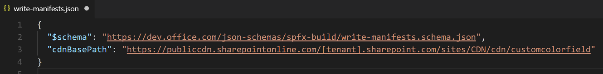

# <a name="migrating-from-jslink-to-sharepoint-framework-extensions"></a><span data-ttu-id="310e3-102">Переход с JSLink на расширения SharePoint Framework</span><span class="sxs-lookup"><span data-stu-id="310e3-102">Migrating from JSLink to SharePoint Framework Extensions</span></span>

<span data-ttu-id="310e3-103">После выпуска Microsoft SharePoint 2013 в большинстве корпоративных решений, основанных на Office 365 и SharePoint Online, для настройки полей использовалось свойство _JSLink_ полей и представлений списков.</span><span class="sxs-lookup"><span data-stu-id="310e3-103">Since Microsoft SharePoint version 2013, most of the enterprise solutions built on top of Office 365 and SharePoint Online leveraged the _JSLink_ property of fields and list views to customize the rendering of fields.</span></span> <span data-ttu-id="310e3-104">Однако на данный момент, с появлением "современного" пользовательского интерфейса SharePoint Online, большинство таких модификаций недоступно.</span><span class="sxs-lookup"><span data-stu-id="310e3-104">However nowdays, within the new "modern" UI of SharePoint Online, most of those customizations are no more available.</span></span> <span data-ttu-id="310e3-105">К счастью, с помощью новых расширений SharePoint Framework вы можете реализовать практически идентичные функции в "современном" пользовательском интерфейсе.</span><span class="sxs-lookup"><span data-stu-id="310e3-105">Luckily, with the new SharePoint Framework Extensions you can now provide almost the same functionality in the "modern" UI.</span></span> <span data-ttu-id="310e3-106">Из данного руководства вы узнаете, как перейти от старых ("классических") модификаций к новой модели, основанной на расширениях SharePoint Framework.</span><span class="sxs-lookup"><span data-stu-id="310e3-106">In this tutorial you will learn how to migrate from old "classic" customizations to the new model based on SharePoint Framework Extensions.</span></span>

## <a name="understanding-sharepoint-framework-extensions"></a><span data-ttu-id="310e3-107">Общие сведения о расширениях SharePoint Framework</span><span class="sxs-lookup"><span data-stu-id="310e3-107">Understanding SharePoint Framework Extensions</span></span>

<span data-ttu-id="310e3-108">Для начала рассмотрим доступные разработчикам варианты расширений SharePoint Framework:</span><span class="sxs-lookup"><span data-stu-id="310e3-108">First of all, let's introduce the available options when developing SharePoint Framework Extensions:</span></span>

* <span data-ttu-id="310e3-109">**Настройщик приложений**. Расширьте встроенный "современный" пользовательский интерфейс SharePoint Online, добавив пользовательские элементы HTML и клиентский код в заранее определенные заполнители на "современных" страницах.</span><span class="sxs-lookup"><span data-stu-id="310e3-109">**Application Customizer**: extend the native "modern" UI of SharePoint Online by adding custom HTML elements and client-side code to pre-defined placeholders of "modern" pages.</span></span> <span data-ttu-id="310e3-110">На момент написания этой статьи заполнители доступны в верхнем и нижнем колонтитулах каждой "современной" страницы.</span><span class="sxs-lookup"><span data-stu-id="310e3-110">At the time of this writing, the available placeholders are the header and the footer of every "modern" page.</span></span>
* <span data-ttu-id="310e3-111">**Набор команд**. Позволяет добавлять пользовательские пункты меню ECB и настраиваемые кнопки на панель команд или в представление списка или библиотеки.</span><span class="sxs-lookup"><span data-stu-id="310e3-111">**Command Set**: allow to add custom ECB menu items or custom buttons to the command bar of a list view for a list or a library.</span></span> <span data-ttu-id="310e3-112">С этими командами можно связать любое действие JavaScript (TypeScript).</span><span class="sxs-lookup"><span data-stu-id="310e3-112">You can associate any JavaScript (TypeScript) action to these commands.</span></span>
* <span data-ttu-id="310e3-113">**Настройщик полей**. Настройте отображение поля в представлении списка, используя настраиваемые элементы HTML и клиентский код.</span><span class="sxs-lookup"><span data-stu-id="310e3-113">**Field Customizer**: customize the rendering of a field in a list view using custom HTML elements and client-side code.</span></span>

<span data-ttu-id="310e3-114">Как вы могли понять из приведенных выше описаний, в нашем случае наиболее удобным вариантом будет расширение "Настройщик полей".</span><span class="sxs-lookup"><span data-stu-id="310e3-114">As you can argue from the above descriptions, the most useful one in our context is the "Field Customizer" extension.</span></span>

> [!NOTE]
> <span data-ttu-id="310e3-115">Дополнительные сведения о расширениях SharePoint Framework см. в статье ["Обзор расширений SharePoint Framework"]((https://docs.microsoft.com/ru-RU/sharepoint/dev/spfx/extensions/overview-extensions)).</span><span class="sxs-lookup"><span data-stu-id="310e3-115">For further details about how to build SharePoint Framework Extensions you can read the article ["Overview of SharePoint Framework Extensions"]((https://docs.microsoft.com/ru-RU/sharepoint/dev/spfx/extensions/overview-extensions)).</span></span>

## <a name="migrating-a-jslink-to-an-spfx-field-customizer"></a><span data-ttu-id="310e3-116">Переход с JSLink на настройщик полей SPFx</span><span class="sxs-lookup"><span data-stu-id="310e3-116">Migrating a JSLink to an SPFx Field Customizer</span></span>

<span data-ttu-id="310e3-117">Предположим, используется среда SharePoint Online, в которой есть настраиваемый список с настраиваемым полем Color, относящимся к типу _Choice_ и принимающим следующие значения: _Red_, _Green_, _Blue_, _Yellow_.</span><span class="sxs-lookup"><span data-stu-id="310e3-117">  Assume that you are in SharePoint Online, and you have a custom list with a custom field called "Color", which is of type Choice and which can assume the following values: Red, Green, Blue, Yellow.</span></span> <span data-ttu-id="310e3-118">Допустим, что у вас есть пользовательское значение для свойства _JSLink_ веб-части, отображающей представление настраиваемого списка.</span><span class="sxs-lookup"><span data-stu-id="310e3-118">Then, assume that you have custom value for the _JSLink_ property of the list view rendering web part of the custom list.</span></span> <span data-ttu-id="310e3-119">Ниже представлен фрагмент кода JavaScript, на который ссылается свойство _JSLink_ (_customColorRendering.js_).</span><span class="sxs-lookup"><span data-stu-id="310e3-119">In the following code snippet you can see the JavaScript code referenced by the _JSLink_ property (_customColorRendering.js_).</span></span>

```JavaScript
// Define a namespace for the custom rendering code
var customJSLinkRendering = customJSLinkRendering || {}; 

// Define a function that declare the custom rendering rules for the target list view
customJSLinkRendering.CustomizeFieldRendering = function () {  

    // Define a custom object to configure the rendering template overrides
    var customRenderingOverride = {};
    customRenderingOverride.Templates = {};
    customRenderingOverride.Templates.Fields = 
    { 
        // Declare the custom rendering function for the 'View' of field 'Color'
        'Color': 
        { 
            'View': customJSLinkRendering.RenderColorField 
        } 
    }; 

    // Register the custom rendering template
    SPClientTemplates.TemplateManager.RegisterTemplateOverrides(customRenderingOverride); 
}; 

// Declare the custom rendering function for the 'View' of field 'Color'
customJSLinkRendering.RenderColorField = function (context)  
{ 
    var colorField = context.CurrentItem.Color; 

    // Declare a local variable to hold the output color
    var color = '';

    // Evaluate the values of the 'Color' field and render it accordingly
    switch (colorField)
    {
        case 'Red':
            color = 'red';
            break;
        case 'Green':
            color = 'green';
            break;
        case 'Blue':
            color = 'blue';
            break;
        case 'Yellow':
            color = 'yellow';
            break;
        default:
            color = 'white';
            break;
    }

    // Render the output for the 'Color' field
    return "<div style='float: left; width: 20px; height: 20px; margin: 5px; border: 1px solid rgba(0,0,0,.2);background:" + color + "' />"; 
}; 

// Invoke the custom rendering function
customJSLinkRendering.CustomizeFieldRendering();
```

<span data-ttu-id="310e3-120">Кроме того, на приведенном ниже снимке экрана показано, как настраивается JSLink в веб-части представления списка.</span><span class="sxs-lookup"><span data-stu-id="310e3-120">Moreover, in the following screenshot you can see how the JSLink is configured in the list view web part.</span></span>


<span data-ttu-id="310e3-122">Если вы отправили файл JavaScript в библиотеку _"Активы сайта"_, то для свойства _JSLink_ может быть задано значение _"~site/SiteAssets/customColorRendering.js"_.</span><span class="sxs-lookup"><span data-stu-id="310e3-122">If you uploaded the JavaScript file into the _"Site Assets"_ library, the value for the _JSLink_ property can be _"~site/SiteAssets/customColorRendering.js"_.</span></span>
<span data-ttu-id="310e3-123">А здесь, для полноты картины, показано, как работает настраиваемая отрисовка списка.</span><span class="sxs-lookup"><span data-stu-id="310e3-123">And here, for the sake of completeness, you can see how the custom rendering of the list works.</span></span>


<span data-ttu-id="310e3-125">Как видите, в полях Color отображается квадрат, заполненный цветом, выбранным на уровне элемента.</span><span class="sxs-lookup"><span data-stu-id="310e3-125">As you can see "Color" fields render a colored box filled with the color selected at the item level.</span></span>

> [!NOTE]
> <span data-ttu-id="310e3-126">Чтобы подготовить такое решение на "классическом сайте", можно воспользоваться шаблоном подготовки PnP, который может одновременно подготовить список с настраиваемым полем и JSLink.</span><span class="sxs-lookup"><span data-stu-id="310e3-126">In order to provision this kind of solution in a "classic" site you can eventually use a PnP Provisioning Template, which can provision both the list with the custom field, and the JSLink at once.</span></span>

<span data-ttu-id="310e3-127">Чтобы перенести представленное выше решение на платформу SharePoint Framework, необходимо выполнить указанные ниже действия.</span><span class="sxs-lookup"><span data-stu-id="310e3-127">In order to migrate the above solution to the SharePoint Framework, you will have to accomplish the following steps.</span></span>

### <a name="create-a-new-sharepoint-framework-solution"></a><span data-ttu-id="310e3-128">Создание решения SharePoint Framework</span><span class="sxs-lookup"><span data-stu-id="310e3-128">Create a new SharePoint Framework solution</span></span>

<span data-ttu-id="310e3-129"> Подготовив среду разработки к созданию решений SharePoint Framework, вы можете приступить к созданию расширения SharePoint Framework, выполнив действия, описанные в статье ["Как настроить среду разработки клиентских веб-частей SharePoint"]((https://docs.microsoft.com/ru-RU/sharepoint/dev/spfx/set-up-your-development-environment)).</span><span class="sxs-lookup"><span data-stu-id="310e3-129">Once you have prepared you development environment to develop SharePoint Framework solutions, by following the instructions provided in the document ["Set up your SharePoint client-side web part development environment"]((https://docs.microsoft.com/ru-RU/sharepoint/dev/spfx/set-up-your-development-environment)), you can start creating a SharePoint Framework extension.</span></span>

1. <span data-ttu-id="310e3-130">Откройте любое средство командной строки (PowerShell, CMD.EXE, Cmder и т. д.), создайте папку для решения (назовите ее _spfx-custom-field-extension_) и создайте решение SharePoint Framework, запустив генератор Yeoman с помощью следующей команды:</span><span class="sxs-lookup"><span data-stu-id="310e3-130">Open the command line tool of your choice (PowerShell, CMD.EXE, Cmder, etc.), create a new folder for the solution (call it _spfx-custom-field-extension_), and create a new SharePoint Framework solution by running the Yeoman generator with the following command:</span></span>

```
yo @microsoft/sharepoint
```

<span data-ttu-id="310e3-131">При появлении соответствующих запросов укажите следующие параметры:</span><span class="sxs-lookup"><span data-stu-id="310e3-131">When prompted by the tool, provide the following answers:</span></span>
* <span data-ttu-id="310e3-132">Оставьте имя решения по умолчанию (_spfx-custom-field-extension_) и нажмите клавишу ВВОД.</span><span class="sxs-lookup"><span data-stu-id="310e3-132">Accept the default name (_spfx-custom-field-extension_) for your solution, and press Enter.</span></span>
* <span data-ttu-id="310e3-133">Выберите SharePoint Online only (latest) (Только SharePoint Online, последняя версия) и нажмите клавишу ВВОД.</span><span class="sxs-lookup"><span data-stu-id="310e3-133">Choose SharePoint Online only (latest), and press Enter.</span></span>
* <span data-ttu-id="310e3-134">Выберите Use the current folder (Использовать текущую папку) и нажмите клавишу ВВОД.</span><span class="sxs-lookup"><span data-stu-id="310e3-134">Choose Use the current folder, and press Enter.</span></span>
* <span data-ttu-id="310e3-135">Выберите N, чтобы сделать установку расширения обязательной на каждом сайте при его использовании.</span><span class="sxs-lookup"><span data-stu-id="310e3-135">Choose N to require the extension to be installed on each site explicitly when it's being used.</span></span>
* <span data-ttu-id="310e3-136">Выберите Extension (Расширение) в качестве типа создаваемого клиентского компонента.</span><span class="sxs-lookup"><span data-stu-id="310e3-136">Choose Extension as the client-side component type to be created.</span></span>
* <span data-ttu-id="310e3-137">Выберите для создаваемого расширения тип _"Настройщик полей"_.</span><span class="sxs-lookup"><span data-stu-id="310e3-137">Choose _"Field Customizer"_ as the extension type to be created.</span></span>
* <span data-ttu-id="310e3-138">Укажите для настройщика полей имя "CustomColorField".</span><span class="sxs-lookup"><span data-stu-id="310e3-138">Provide "CustomColorField" as the name for your Field Customizer.</span></span>
* <span data-ttu-id="310e3-139">Чтобы не использовать конкретную платформу JavaScript, выберите параметр _No JavaScript framework_ (Без платформы JavaScript).</span><span class="sxs-lookup"><span data-stu-id="310e3-139">Select to not use any specific JavaScript framework by selecting the _"No JavaScript framework"_ option.</span></span>


<span data-ttu-id="310e3-141">На этом этапе Yeoman установит необходимые зависимости и сформирует шаблон файлов и папок решения вместе с расширением _CustomColorField_.</span><span class="sxs-lookup"><span data-stu-id="310e3-141">At this point, Yeoman will install the required dependencies and scaffold the solution files and folders along with the _CustomColorField_ extension.</span></span> <span data-ttu-id="310e3-142">Это может занять несколько минут.</span><span class="sxs-lookup"><span data-stu-id="310e3-142">This might take a few minutes.</span></span>

<span data-ttu-id="310e3-143">После успешного формирования шаблона должно появиться следующее сообщение:</span><span class="sxs-lookup"><span data-stu-id="310e3-143">When the scaffold is complete, you should see the following message indicating a successful scaffold:</span></span>


2. <span data-ttu-id="310e3-145">Чтобы заблокировать версию зависимостей проекта, выполните следующую команду:</span><span class="sxs-lookup"><span data-stu-id="310e3-145">To lock down the version of the project dependencies, run the following command:</span></span>

```
npm shrinkwrap
```

3. <span data-ttu-id="310e3-146">Теперь запустите Visual Studio Code (или другой редактор кода) и начните разработку решения.</span><span class="sxs-lookup"><span data-stu-id="310e3-146">Now start Visual Studio Code (or whatever else is the code editor of your choice) and start developing the solution.</span></span> <span data-ttu-id="310e3-147">Чтобы запустить Visual Studio Code, можно выполнить приведенный ниже оператор.</span><span class="sxs-lookup"><span data-stu-id="310e3-147">To start Visual Studio Code, you can execute the following statement.</span></span>

```
code .
```

### <a name="define-the-new-field-customizer-with-javascript"></a><span data-ttu-id="310e3-148">Определение нового настройщика полей с помощью JavaScript</span><span class="sxs-lookup"><span data-stu-id="310e3-148">Define the new Field Customizer with JavaScript</span></span>

<span data-ttu-id="310e3-149"> Чтобы воспроизвести такое поведение отрисовки настраиваемого поля _JSLink_, достаточно реализовать такую же логику с помощью клиентского кода в новом решении SharePoint Framework.</span><span class="sxs-lookup"><span data-stu-id="310e3-149">In order to reproduce the same behavior of the _JSLink_ custom field rendering, you simply need to implement the same logic using client-side code, within the new SharePoint Framework solution.</span></span> <span data-ttu-id="310e3-150">Чтобы выполнить эту задачу, сделайте следующее:</span><span class="sxs-lookup"><span data-stu-id="310e3-150">To accomplish this task, complete the following steps.</span></span>

1. <span data-ttu-id="310e3-151">Для начала откройте файл _CustomColorFieldFieldCustomizer.manifest.json_ в папке _src/extensions/customColorField_.</span><span class="sxs-lookup"><span data-stu-id="310e3-151">First of all, open the file _CustomColorFieldFieldCustomizer.manifest.json_ under the _src/extensions/customColorField_ folder.</span></span> <span data-ttu-id="310e3-152">Скопируйте значение свойства _id_ и сохраните его в надежном месте, так как оно потребуется позже.</span><span class="sxs-lookup"><span data-stu-id="310e3-152">Copy the value of the _id_ property and store it in a safe place, because you will need it later.</span></span>

2. <span data-ttu-id="310e3-153">Теперь откройте файл _CustomColorFieldFieldCustomizer.ts_ в той же папке и измените его содержимое в соответствии с приведенным ниже фрагментом кода.</span><span class="sxs-lookup"><span data-stu-id="310e3-153">Now, open the _CustomColorFieldFieldCustomizer.ts_ file, still under the same folder as before and edit the content accordingly to the following code excerpt.</span></span>

``` TypeScript
import { Log } from '@microsoft/sp-core-library';
import { override } from '@microsoft/decorators';
import {
  BaseFieldCustomizer,
  IFieldCustomizerCellEventParameters
} from '@microsoft/sp-listview-extensibility';

import * as strings from 'CustomColorFieldFieldCustomizerStrings';
import styles from './CustomColorFieldFieldCustomizer.module.scss';

/**
 * If your field customizer uses the ClientSideComponentProperties JSON input,
 * it will be deserialized into the BaseExtension.properties object.
 * You can define an interface to describe it.
 */
export interface ICustomColorFieldFieldCustomizerProperties {
  // This is an example; replace with your own property
  sampleText?: string;
}

const LOG_SOURCE: string = 'CustomColorFieldFieldCustomizer';

export default class CustomColorFieldFieldCustomizer
  extends BaseFieldCustomizer<ICustomColorFieldFieldCustomizerProperties> {

  @override
  public onInit(): Promise<void> {
    // Add your custom initialization to this method.  The framework will wait
    // for the returned promise to resolve before firing any BaseFieldCustomizer events.
    Log.info(LOG_SOURCE, 'Activated CustomColorFieldFieldCustomizer with properties:');
    Log.info(LOG_SOURCE, JSON.stringify(this.properties, undefined, 2));
    Log.info(LOG_SOURCE, `The following string should be equal: "CustomColorFieldFieldCustomizer" and "${strings.Title}"`);
    return Promise.resolve();
  }

  @override
  public onRenderCell(event: IFieldCustomizerCellEventParameters): void {

    var colorField = event.fieldValue; 
    
    // Declare a local variable to hold the output color
    var color = '';

    // Evaluate the values of the 'Color' field and render it accordingly
    switch (colorField)
    {
        case 'Red':
            color = 'red';
            break;
        case 'Green':
            color = 'green';
            break;
        case 'Blue':
            color = 'blue';
            break;
        case 'Yellow':
            color = 'yellow';
            break;
        default:
            color = 'white';
            break;
    }
    
    // Render the output for the 'Color' field
    event.domElement.innerHTML = "<div style='float: left; width: 20px; height: 20px; margin: 5px; border: 1px solid rgba(0,0,0,.2);background:" + color + "' />"; 
  }

  @override
  public onDisposeCell(event: IFieldCustomizerCellEventParameters): void {
    // This method should be used to free any resources that were allocated during rendering.
    // For example, if your onRenderCell() called ReactDOM.render(), then you should
    // call ReactDOM.unmountComponentAtNode() here.
    super.onDisposeCell(event);
  }
}
```

<span data-ttu-id="310e3-154">Как видите, содержимое метода _onRenderCell_ практически такое же, как у метода _RenderColorField_ в реализации _JSLink_.</span><span class="sxs-lookup"><span data-stu-id="310e3-154">As you can see, the content of method _onRenderCell_ is almost the same of the previous _RenderColorField_ method in the _JSLink_ implementation.</span></span>
<span data-ttu-id="310e3-155">Единственные отличия:</span><span class="sxs-lookup"><span data-stu-id="310e3-155">The only differences are:</span></span>
- <span data-ttu-id="310e3-156">чтобы получить текущее значение поля, необходимо считать свойство _event.fieldValue_ входного аргумента метода _onRenderCell_;</span><span class="sxs-lookup"><span data-stu-id="310e3-156">To retrieve the current field value you need to read the _event.fieldValue_ property of the input argument of the _onRenderCell_ method.</span></span>
- <span data-ttu-id="310e3-157">чтобы вернуть настраиваемый HTML-код для отрисовки поля, необходимо назначить значение свойству _innerHTML_ объекта _event.domElement_, представляющему выходной контейнер HTML для отрисовки поля.</span><span class="sxs-lookup"><span data-stu-id="310e3-157">To return the custom HTML code to render the field, you need to assign a value to the _innerHTML_ property of the _event.domElement_ object, which represents the output HTML container of the field rendering.</span></span>

<span data-ttu-id="310e3-158">Если не считать этих незначительных изменений, вы можете использовать практически такой же код JavaScript, как прежде.</span><span class="sxs-lookup"><span data-stu-id="310e3-158">Aside from these small changes, you can reuse almost the same JavaScript code as before.</span></span>

<span data-ttu-id="310e3-159">На приведенном ниже рисунке показаны выходные данные.</span><span class="sxs-lookup"><span data-stu-id="310e3-159">In the following figure you can see the resulting output.</span></span>


### <a name="test-the-solution-in-debug-mode"></a><span data-ttu-id="310e3-161">Тестирование решения в режиме отладки</span><span class="sxs-lookup"><span data-stu-id="310e3-161">Test the solution in debug mode</span></span>

<span data-ttu-id="310e3-162">Теперь все готово к тестированию решения в режиме отладки.</span><span class="sxs-lookup"><span data-stu-id="310e3-162">You are now ready to test your solution in debug mode.</span></span> 

1. <span data-ttu-id="310e3-163">Вернитесь к окну консоли и выполните следующую команду:</span><span class="sxs-lookup"><span data-stu-id="310e3-163">Go back to the console window and run the following command:</span></span>

```
gulp serve --nobrowser
```

<span data-ttu-id="310e3-164">Приведенная выше команда выполняет сборку решения и запускает локальный сервер Node.js для его размещения.</span><span class="sxs-lookup"><span data-stu-id="310e3-164">The above command will build the solution and run the local Node.js server to host it.</span></span>

2. <span data-ttu-id="310e3-165">Теперь откройте любой браузер и перейдите к "современному" списку, содержащему настраиваемое поле с именем _Color_, и введите _Choice_ с теми же вариантами значений, что и раньше (Red, Green, Blue, Yellow).</span><span class="sxs-lookup"><span data-stu-id="310e3-165">Now open your favorite browser and go to a "modern" list, which has a custom field with name _"Color"_ and type _Choice_ with the same value options as before (Red, Green, Blue, Yellow).</span></span> <span data-ttu-id="310e3-166">Впоследствии вы можете использовать список, созданный на "классическом" сайте, просматривая его в "современном" интерфейсе.</span><span class="sxs-lookup"><span data-stu-id="310e3-166">You can eventually use the list you created in the "classic" site, just viewing it with the new "modern" experience.</span></span> <span data-ttu-id="310e3-167">Затем добавьте приведенные ниже параметры строки запроса к URL-адресу страницы _AllItems.aspx_.</span><span class="sxs-lookup"><span data-stu-id="310e3-167">Now, append the following querystring parameters to the _AllItems.aspx_ page URL.</span></span>

```
?loadSPFX=true&debugManifestsFile=https://localhost:4321/temp/manifests.js&fieldCustomizers={"Color":{"id":"c3070978-d85e-4298-8758-70b5b5933076"}}
```

<span data-ttu-id="310e3-168">В приведенной ниже строке запроса потребуется заменить GUID на сохраненное ранее значение _id_ из файла _CustomColorFieldFieldCustomizer.manifest.json_. Имя объекта _Color_ указывает на поле, которое требуется настроить.</span><span class="sxs-lookup"><span data-stu-id="310e3-168">In the above querystring, you will have to replace the GUID with the _id_ value you saved from the _CustomColorFieldFieldCustomizer.manifest.json_ file, and the _"Color"_ object name refers to the name of the field to customize.</span></span> <span data-ttu-id="310e3-169">При желании вы также можете передать настраиваемый объект конфигурации, сериализованный в формате JSON, в качестве дополнительного параметра при конструировании настройщика полей.</span><span class="sxs-lookup"><span data-stu-id="310e3-169">If you like, you can also provide a custom configuration object, serialized in JSON format, as an additional parameter for the field customizer construction.</span></span>

<span data-ttu-id="310e3-170">Обратите внимание, что при выполнении запроса страницы появится окно с предупреждающим сообщением "Разрешить скрипты отладки?", где из соображений безопасности спрашивается ваше согласие на запуск кода с localhost.</span><span class="sxs-lookup"><span data-stu-id="310e3-170">Notice that, when executing the page request, you will be prompted with a warning message box with title "Allow debug scripts?", which asks your consent to run code from localhost, for security reasons.</span></span> <span data-ttu-id="310e3-171">Конечно, если вы хотите отладить и протестировать решение локально, потребуется разрешить загрузку скриптов отладки.</span><span class="sxs-lookup"><span data-stu-id="310e3-171">Of course, if you want to locally debug and test the solution, you will have to allow to "Load debug scripts".</span></span>

### <a name="define-the-new-field-customizer-with-typescript"></a><span data-ttu-id="310e3-172">Определение нового настройщика полей с помощью TypeScript</span><span class="sxs-lookup"><span data-stu-id="310e3-172">Define the new Field Customizer with TypeScript</span></span>

<span data-ttu-id="310e3-173">Теперь вы можете заменить код JavaScript на TypeScript, чтобы воспользоваться преимуществами полностью типизированного подхода, реализованного в TypeScript.</span><span class="sxs-lookup"><span data-stu-id="310e3-173">You are now ready to replace the JavaScript code with TypeScript, in order to benefit of the fully typed approach of TypeScript.</span></span>

1. <span data-ttu-id="310e3-174">Откройте файл _CustomColorFieldFieldCustomizer.module.scss_ в папке _src/extensions/customColorField_.</span><span class="sxs-lookup"><span data-stu-id="310e3-174">Open the file _CustomColorFieldFieldCustomizer.module.scss_ under the _src/extensions/customColorField_ folder.</span></span> <span data-ttu-id="310e3-175">Это файл Sassy CSS, представляющий стиль пользовательского интерфейса настройщика полей.</span><span class="sxs-lookup"><span data-stu-id="310e3-175">This file, which is a Sassy CSS, represents the UI style for the field customizer.</span></span> <span data-ttu-id="310e3-176">Замените содержимое файла SCSS на приведенный ниже код.</span><span class="sxs-lookup"><span data-stu-id="310e3-176">Replace the content of the SCSS file with the following one.</span></span>

``` SCSS
.CustomColorField {
  .cell {
    float: left;
    width: 20px; 
    height: 20px; 
    margin: 5px; 
    border: 1px solid rgba(0,0,0,.2);
  }

  .cellRed {
    background: red;
  }

  .cellGreen {
    background: green;
  }

  .cellBlue {
    background: blue;
  }

  .cellYellow {
    background: yellow;
  }

  .cellWhite {
    background: white;
  }
}
```

2. <span data-ttu-id="310e3-177">Замените реализацию метода _onRenderCell_ на приведенный ниже фрагмент кода.</span><span class="sxs-lookup"><span data-stu-id="310e3-177">Replace the implementation of the _onRenderCell_ method with the following code excerpt.</span></span>

``` TypeScript
@override
public onRenderCell(event: IFieldCustomizerCellEventParameters): void {

// Read the current field value
let colorField: String = event.fieldValue; 

// Add the main style to the field container element
event.domElement.classList.add(styles.CustomColorField);

// Get a reference to the output HTML
let fieldHtml: HTMLDivElement = event.domElement.firstChild as HTMLDivElement;

// Add the standard style
fieldHtml.classList.add(styles.cell);

// Add the colored style
switch(colorField)
{
    case "Red":
    fieldHtml.classList.add(styles.cellRed);
    break;
    case "Green":
    fieldHtml.classList.add(styles.cellGreen);
    break;
    case "Blue":
    fieldHtml.classList.add(styles.cellBlue);
    break;
    case "Yellow":
    fieldHtml.classList.add(styles.cellYellow);
    break;
    default:
    fieldHtml.classList.add(styles.cellWhite);
    break;
}
}
```

<span data-ttu-id="310e3-178">Обратите внимание, что в новой реализации метода используется полностью типизированный подход, а класс CSS _cell_ назначается дочернему элементу _DIV_ текущего элемента поля вместе с другим пользовательским классом CSS, чтобы определить целевой цвет элемента _DIV_ в соответствии с выбранным значением поля.</span><span class="sxs-lookup"><span data-stu-id="310e3-178">Notice that the new method implementation uses a fully typed approach, and assigns the _"cell"_ CSS class to the _DIV_ element child of the current field element, together with another custom CSS class to define the target color of the _DIV_ based on the currently selected value for the field.</span></span>

3. <span data-ttu-id="310e3-179">Еще раз запустите настройщик полей в режиме отладки и ознакомьтесь с результатом.</span><span class="sxs-lookup"><span data-stu-id="310e3-179">Run one more time in debug mode the field customizer and see the result.</span></span>

### <a name="package-and-host-the-solution"></a><span data-ttu-id="310e3-180">Упаковка и размещение решения</span><span class="sxs-lookup"><span data-stu-id="310e3-180">Package and host the solution</span></span>

<span data-ttu-id="310e3-181">Если вы довольны результатом, теперь можно упаковать решение и разместить его в настоящей инфраструктуре.</span><span class="sxs-lookup"><span data-stu-id="310e3-181">If you are happy with the result, you are now ready to package the solution and host it in a real hosting infrastructure.</span></span>
<span data-ttu-id="310e3-182">Прежде чем собирать пакет, необходимо объявить XML-файл платформы функций для подготовки расширения.</span><span class="sxs-lookup"><span data-stu-id="310e3-182">Before building the bundle and the package, you need to declare an XML feature framework file to provision the extension.</span></span>

#### <a name="review-feature-framework-elements"></a><span data-ttu-id="310e3-183">Обзор элементов платформы функций</span><span class="sxs-lookup"><span data-stu-id="310e3-183">Review feature framework elements</span></span>
<span data-ttu-id="310e3-184">В редакторе кода откройте вложенную папку _/sharepoint/assets_ в папке решения и измените файл _elements.xml_.</span><span class="sxs-lookup"><span data-stu-id="310e3-184">Within the code editor, open the _/sharepoint/assets_ sub-folder of the solution folder and edit the _elements.xml_ file.</span></span>
<span data-ttu-id="310e3-185">В приведенном ниже фрагменте кода показано, как должен выглядеть файл.</span><span class="sxs-lookup"><span data-stu-id="310e3-185">In the following code excerpt you can see how the file should look like.</span></span>

```XML
<?xml version="1.0" encoding="utf-8"?>
<Elements xmlns="http://schemas.microsoft.com/sharepoint/">
    <Field ID="{40475661-efaf-447a-a220-c992b20ec1c3}"
            Name="SPFxColor"
            DisplayName="Color"
            Title="Color"
            Type="Choice"
            Required="FALSE"
            Group="SPFx Columns"
            ClientSideComponentId="c3070978-d85e-4298-8758-70b5b5933076">
    </Field>
</Elements>
```

<span data-ttu-id="310e3-186">Как видите, он напоминает файл платформы функций SharePoint. В нем определяется настраиваемый элемент _Field_ типа _Choice_, с помощью атрибута _ClientSideComponentId_ ссылающийся на свойство _id_ настройщика полей. Кроме того, может быть задан атрибут _ClientSideComponentProperties_ для установки настраиваемых свойств конфигурации, необходимых расширению.</span><span class="sxs-lookup"><span data-stu-id="310e3-186">As you can see, it reminds a SharePoint Feature Framework file, it defines a custom _Field_ element with a field type _Choice_, which uses the _ClientSideComponentId_ attribute to reference the _id_ of the field customizer, and there could be a _ClientSideComponentProperties_ attribute, to configure the custom configuration properties required by the extension.</span></span>

<span data-ttu-id="310e3-187">Теперь откройте файл _package-solution.json_ в папке _/config_ решения.</span><span class="sxs-lookup"><span data-stu-id="310e3-187">Now, open the _package-solution.json_ file under the _/config_ folder of the solution.</span></span> <span data-ttu-id="310e3-188">В файле вы увидите ссылку на файл _elements.xml_ в разделе _assets_.</span><span class="sxs-lookup"><span data-stu-id="310e3-188">Within the file you can see that there is a reference to the _elements.xml_ file, within the _assets_ section.</span></span>

```JSON
{
  "$schema": "https://dev.office.com/json-schemas/spfx-build/package-solution.schema.json",
  "solution": {
    "name": "spfx-custom-field-extension-client-side-solution",
    "id": "ab0fbbf8-01ba-4633-8498-46cfd5652619",
    "version": "1.0.0.0",
    "features": [
      {
        "title": "Application Extension - Deployment of custom action.",
        "description": "Deploys a custom action with ClientSideComponentId association",
        "id": "090dc976-878d-44fe-8f8e-ac603d094aa1",
        "version": "1.0.0.0",
        "assets": {
          "elementManifests": [
            "elements.xml"
          ]
        }
      }
    ]
  },
  "paths": {
    "zippedPackage": "solution/spfx-custom-field-extension.sppkg"
  }
}
```

#### <a name="enable-the-cdn-in-your-office-365-tenant"></a><span data-ttu-id="310e3-189">Включение сети доставки содержимого (CDN) в клиенте Office 365</span><span class="sxs-lookup"><span data-stu-id="310e3-189">Enable the CDN in your Office 365 tenant</span></span>

<span data-ttu-id="310e3-190">Теперь необходимо разместить расширение в среде внешнего размещения.</span><span class="sxs-lookup"><span data-stu-id="310e3-190">Now you need to host the extension in a hosting environment.</span></span> <span data-ttu-id="310e3-191">Сеть доставки содержимого Office 365 — самый простой способ размещать решения SharePoint непосредственно из их клиента, пользуясь при этом преимуществами службы сетей доставки содержимого (CDN) для сокращения времени загрузки ресурсов.</span><span class="sxs-lookup"><span data-stu-id="310e3-191">Office 365 CDN is the easiest way to host SharePoint Framework solutions directly from your tenant while still taking advantage of the Content Delivery Network (CDN) service for faster load times of your assets.</span></span>

1. <span data-ttu-id="310e3-192">Скачайте [командную консоль SharePoint Online](https://www.microsoft.com/en-us/download/details.aspx?id=35588), чтобы убедиться, что у вас установлена последняя версия.</span><span class="sxs-lookup"><span data-stu-id="310e3-192">Download the [SharePoint Online Management Shell](https://www.microsoft.com/en-us/download/details.aspx?id=35588) to ensure that you have the latest version.</span></span>

2. <span data-ttu-id="310e3-193">Подключитесь к клиенту SharePoint Online с помощью PowerShell:</span><span class="sxs-lookup"><span data-stu-id="310e3-193">Connect to your SharePoint Online tenant by using PowerShell:</span></span>
    
    ```
    Connect-SPOService -Url https://[tenant]-admin.sharepoint.com
    ```
    
3. <span data-ttu-id="310e3-194">Чтобы узнать текущее состояние настроек общедоступной сети CDN для клиента, поочередно выполните указанные ниже команды.</span><span class="sxs-lookup"><span data-stu-id="310e3-194">Get the current status of public CDN settings from the tenant level by executing the following commands one-by-one:</span></span> 
    
    ```
    Get-SPOTenantCdnEnabled -CdnType Public
    Get-SPOTenantCdnOrigins -CdnType Public
    Get-SPOTenantCdnPolicies -CdnType Public
    ```
    
4. <span data-ttu-id="310e3-195">Включите общедоступную сеть доставки содержимого в клиенте:</span><span class="sxs-lookup"><span data-stu-id="310e3-195">Enable public CDN in the tenant:</span></span>
    
    ```
    Set-SPOTenantCdnEnabled -CdnType Public
    ```
    
    <span data-ttu-id="310e3-196">Теперь в клиенте включена общедоступная сеть доставки содержимого с использованием разрешенной конфигурации типов файлов по умолчанию.</span><span class="sxs-lookup"><span data-stu-id="310e3-196">Public CDN has now been enabled in the tenant by using the default file type configuration allowed.</span></span> <span data-ttu-id="310e3-197">Это означает, что поддерживаются такие расширения: CSS, EOT, CSS, EOT, GIF, ICO, JPEG, JPG, JS, MAP, PNG, SVG, TTF и WOFF.</span><span class="sxs-lookup"><span data-stu-id="310e3-197">This means that the following file type extensions are supported: CSS, EOT, GIF, ICO, JPEG, JPG, JS, MAP, PNG, SVG, TTF, and WOFF.</span></span>

5. <span data-ttu-id="310e3-p120">Откройте браузер и перейдите к семейству веб-сайтов, в котором вы хотите разместить свою библиотеку CDN. Это может быть любое семейство веб-сайтов в клиенте. Это руководство описывает создание библиотеки CDN, но вы также можете использовать отдельную папку в любой существующей библиотеке документов как конечную точку CDN.</span><span class="sxs-lookup"><span data-stu-id="310e3-p120">Open up a browser and move to a site collection where you'd like to host your CDN library. This could be any site collection in your tenant. In this tutorial, we will create a specific library to act as your CDN library, but you can also use a specific folder in any existing document library as the CDN endpoint.</span></span>

6. <span data-ttu-id="310e3-201">В семействе веб-сайтов создайте библиотеку документов _CDN_ и добавьте в нее папку _customcolorfield_.</span><span class="sxs-lookup"><span data-stu-id="310e3-201">Create a new document library on your site collection called _CDN_ and add a folder named _customcolorfield_ to it.</span></span>
    
7. <span data-ttu-id="310e3-202">В консоли PowerShell добавьте новый источник сети доставки содержимого.</span><span class="sxs-lookup"><span data-stu-id="310e3-202">In the PowerShell console, add a new CDN origin.</span></span> <span data-ttu-id="310e3-203">В этом случае мы задаем источник `*/cdn`, то есть в качестве источника сети доставки содержимого (CDN) будет выступать любая относительная папка с именем _cdn_.</span><span class="sxs-lookup"><span data-stu-id="310e3-203">In this case, we are setting the origin as `*/cdn`, which means that any relative folder with the name of _cdn_ acts as a CDN origin.</span></span>
    
    ```
    Add-SPOTenantCdnOrigin -CdnType Public -OriginUrl */cdn
    ```
    
8. <span data-ttu-id="310e3-204">Выполните указанную ниже команду, чтобы получить список источников сети доставки содержимого клиента:</span><span class="sxs-lookup"><span data-stu-id="310e3-204">Execute the following command to get the list of CDN origins from your tenant:</span></span>
    
    ```
    Get-SPOTenantCdnOrigins -CdnType Public
    ```
    
<span data-ttu-id="310e3-205">Обратите внимание, что новый источник указан как допустимый источник сети доставки содержимого.</span><span class="sxs-lookup"><span data-stu-id="310e3-205">Note that your newly added origin is listed as a valid CDN origin.</span></span> <span data-ttu-id="310e3-206">Настройка источника займет некоторое время (приблизительно 15 минут), поэтому мы пока можем подготовить к работе расширение, которое будет размещено в источнике по завершении развертывания.</span><span class="sxs-lookup"><span data-stu-id="310e3-206">Final configuration of the origin takes approximately 15 minutes, so we can continue provisioning the extension, which will be hosted from the origin after deployment is completed.</span></span> 


<span data-ttu-id="310e3-208">Если рядом с названием источника нет уведомления `(configuration pending)`, он готов к использованию в клиенте.</span><span class="sxs-lookup"><span data-stu-id="310e3-208">When the origin is listed without the `(configuration pending)` text, it is ready to be used in your tenant.</span></span> <span data-ttu-id="310e3-209">Это указывает на выполняющуюся настройку SharePoint Online и системы CDN.</span><span class="sxs-lookup"><span data-stu-id="310e3-209">This indicates an on-going configuration between SharePoint Online and the CDN system.</span></span> 

#### <a name="update-the-solution-settings-and-publish-it-on-the-cdn"></a><span data-ttu-id="310e3-210">Обновление параметров решения и его публикация в сети доставки содержимого</span><span class="sxs-lookup"><span data-stu-id="310e3-210">Update the solution settings and publish it on the CDN</span></span>

<span data-ttu-id="310e3-211">Теперь необходимо обновить решение для использования только что созданной сети CDN в качестве среды внешнего размещения и опубликовать в ней пакет решения.</span><span class="sxs-lookup"><span data-stu-id="310e3-211">Now, you need to update the solution in order to use the just created CDN as the hosting enviroment and you will need to publish the solution bundle to the CDN.</span></span> <span data-ttu-id="310e3-212">Чтобы выполнить эту задачу, выполните указанные ниже действия.</span><span class="sxs-lookup"><span data-stu-id="310e3-212">To accomplish this task, just follow the upcoming steps.</span></span>

1. <span data-ttu-id="310e3-213">Вернитесь к ранее созданному решению, чтобы внести необходимые изменения в URL-адреса.</span><span class="sxs-lookup"><span data-stu-id="310e3-213">Return to the previously created solution to perform the needed URL updates.</span></span>
    
2. <span data-ttu-id="310e3-214">Обновите файл _write-manifestests.json_ (в папке _config_), как показано ниже, чтобы он указывал на конечную точку CDN.</span><span class="sxs-lookup"><span data-stu-id="310e3-214">Update the _write-manifests.json_ file (under the _config_ folder) as follows to point to your CDN endpoint.</span></span> <span data-ttu-id="310e3-215">Используйте `publiccdn.sharepointonline.com` в качестве префикса, а затем дополните URL-адрес фактическим путем к вашему клиенту.</span><span class="sxs-lookup"><span data-stu-id="310e3-215">Use `publiccdn.sharepointonline.com` as the prefix, and then extend the URL with the actual path of your tenant.</span></span> <span data-ttu-id="310e3-216">Формат URL-адреса для сети доставки содержимого:</span><span class="sxs-lookup"><span data-stu-id="310e3-216">The format of the CDN URL is as follows:</span></span>
    
    ```
    https://publiccdn.sharepointonline.com/[tenant host name]/sites/[site]/[library]/[folder]
    ```
    
    

3. <span data-ttu-id="310e3-218">Сохраните изменения.</span><span class="sxs-lookup"><span data-stu-id="310e3-218">Save your changes.</span></span>

4. <span data-ttu-id="310e3-219">Выполните описанную ниже задачу для упаковки решения.</span><span class="sxs-lookup"><span data-stu-id="310e3-219">Execute the following task to bundle your solution.</span></span> <span data-ttu-id="310e3-220">При этом будет выполнена сборка конечной версии проекта с использованием URL-адреса CDN, указанного в файле _writer-manifest.json_.</span><span class="sxs-lookup"><span data-stu-id="310e3-220">This executes a release build of your project using the CDN URL specified in the _write-manifests.json_ file.</span></span> <span data-ttu-id="310e3-221">Результат будет помещен в папку _./temp/deploy_.</span><span class="sxs-lookup"><span data-stu-id="310e3-221">The output of this command is located in the _./temp/deploy_ folder.</span></span> <span data-ttu-id="310e3-222">Эти файлы вам нужно будет добавить в папку SharePoint, представляющую собой конечную точку CDN.</span><span class="sxs-lookup"><span data-stu-id="310e3-222">These are the files that you need to upload to the SharePoint folder acting as your CDN endpoint.</span></span> 
    
    ```
    gulp bundle --ship
    ```
    
5. <span data-ttu-id="310e3-223">Выполните приведенную ниже задачу, чтобы упаковать решение.</span><span class="sxs-lookup"><span data-stu-id="310e3-223">Execute the following task to package your solution.</span></span> <span data-ttu-id="310e3-224">Эта команда создаст пакет _spfx-custom-field-extension.sppkg_ в папке _sharepoint/solution_, а также подготовит ресурсы в папке _temp/deploy_ к развертыванию в CDN.</span><span class="sxs-lookup"><span data-stu-id="310e3-224">This command creates an _spfx-custom-field-extension.sppkg_ package in the _sharepoint/solution_ folder and also prepares the assets in the _temp/deploy_ folder to be deployed to the CDN.</span></span>
    
    ```
    gulp package-solution --ship
    ```
    
6. <span data-ttu-id="310e3-225">Добавьте или перетащите новый пакет клиентского решения в каталог приложений в клиенте, а затем нажмите кнопку _Развернуть_.</span><span class="sxs-lookup"><span data-stu-id="310e3-225">Upload or drag-and-drop the newly created client-side solution package to the app catalog in your tenant, and then select the _Deploy_ button.</span></span>

    

7. <span data-ttu-id="310e3-227">Отправьте или перетащите файлы из папки _temp/deploy_ в созданную ранее папку _CDN/customcolorfield_.</span><span class="sxs-lookup"><span data-stu-id="310e3-227">Upload or drag-and-drop the files in the _temp/deploy_ folder to the _CDN/customcolorfield_ folder created earlier.</span></span>

### <a name="install-and-run-the-solution"></a><span data-ttu-id="310e3-228">Установка и запуск решения</span><span class="sxs-lookup"><span data-stu-id="310e3-228">Install and run the solution</span></span>

<span data-ttu-id="310e3-229">Теперь вы можете установить решения на любом целевом "современном" сайте.</span><span class="sxs-lookup"><span data-stu-id="310e3-229">You can now install the solution on any target "modern" site.</span></span>

1. <span data-ttu-id="310e3-230">Откройте браузер и перейдите на любой "современный" сайт.</span><span class="sxs-lookup"><span data-stu-id="310e3-230">Open the browser and navigate to any target "modern" site.</span></span>

2. <span data-ttu-id="310e3-231">Перейдите на страницу _Контент сайта_ и добавьте новое _приложение_.</span><span class="sxs-lookup"><span data-stu-id="310e3-231">Go to the _"Site Contents"_ page and select to add a new _App_.</span></span>

3. <span data-ttu-id="310e3-232">Установите новое приложение _из вашей организации_, чтобы просмотреть решения, доступные в _каталоге приложений_.</span><span class="sxs-lookup"><span data-stu-id="310e3-232">Select to install a new app _"From Your Organization"_ to browse the solutions available in the _AppCatalog_.</span></span>

4. <span data-ttu-id="310e3-233">Выберите решение _spfx-custom-field-extension-client-side-solution_ и установите его на целевом сайте.</span><span class="sxs-lookup"><span data-stu-id="310e3-233">Select the solution called _"spfx-custom-field-extension-client-side-solution"_ and istall it on the target site.</span></span>

    

5. <span data-ttu-id="310e3-235">По завершении установки приложения создайте настраиваемый список, измените его свойства и добавьте новый столбец на основе имеющихся столбцов.</span><span class="sxs-lookup"><span data-stu-id="310e3-235">Once the application installation will be completed, create a new custom list, edit the list settings, and add a new column from already existing site columns.</span></span> <span data-ttu-id="310e3-236">Выберите группу столбцов под названием _"Столбцы SPFx"_ и добавьте поле _Color_.</span><span class="sxs-lookup"><span data-stu-id="310e3-236">Select the group of columns called _"SPFx Columns"_ and add the _"Color"_ field.</span></span>


6. <span data-ttu-id="310e3-238">Измените добавленное поле и настройте значения цветов (например, "Красный", "Зеленый", "Синий", "Желтый"), а затем сохраните параметры поля.</span><span class="sxs-lookup"><span data-stu-id="310e3-238">Edit the just added field and configure some color values (like: Red, Green, Blue, Yellow) and save the field settings.</span></span>

7. <span data-ttu-id="310e3-239">Добавьте в список элементы и просмотрите выходные данные в представлении списка.</span><span class="sxs-lookup"><span data-stu-id="310e3-239">Add some items to the list and see the output in the list view.</span></span> <span data-ttu-id="310e3-240">Они должны выглядеть так, как на приведенном ниже снимке экрана.</span><span class="sxs-lookup"><span data-stu-id="310e3-240">It should look like the one in the following screenshot.</span></span>


<span data-ttu-id="310e3-242">Поздравляем! Вы создали настройщик полей с помощью расширений SharePoint Framework.</span><span class="sxs-lookup"><span data-stu-id="310e3-242">Enjoy your new Field Customizer built using the SharePoint Framework extensions!</span></span>
