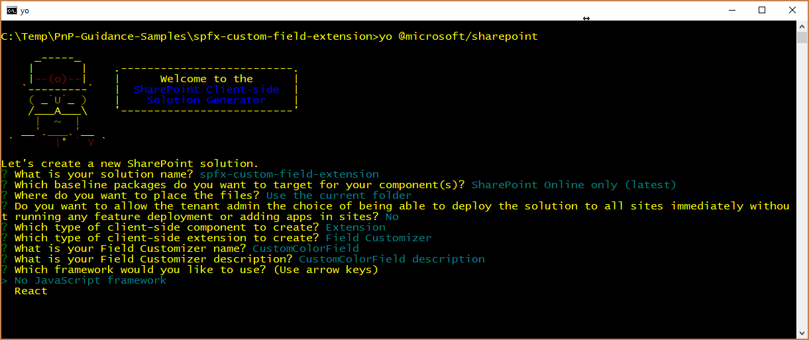

# <a name="migrating-from-jslink-to-sharepoint-framework-extensions"></a>Переход с JSLink на расширения SharePoint Framework

Начиная с Microsoft SharePoint 2013, в большинстве корпоративных решений, основанных на Office 365 и SharePoint Online, для настройки полей использовалось свойство `JSLink` полей и представлений списков. Однако в "современном" интерфейсе SharePoint Online большинство таких настроек больше не доступно. Реализовать схожие функции в "современном" интерфейсе можно с помощью новых расширений SharePoint Framework. 

Из данного руководства вы узнаете, как перейти со старых ("классических") настроек на новую модель на основе расширений SharePoint Framework.

> [!NOTE]
> Дополнительные сведения о создании расширений SharePoint Framework см. в статье [Обзор расширений SharePoint Framework](../overview-extensions.md).

Сначала давайте познакомимся с вариантами расширений SharePoint Framework:

* **Настройщик заполнителей**. Расширьте встроенный "современный" пользовательский интерфейс SharePoint Online, добавив собственные элементы HTML и клиентский код к стандартным заполнителям "современных" страниц. На момент написания этой статьи настройщик заполнителей может настраивать верхний и нижний колонтитулы всех "современных" страниц.
* **Набор команд**. Добавьте собственные элементы меню ECB или кнопки на панель команд списка или библиотеки. С этими командами можно связать любое действие JavaScript (TypeScript).
* **Настройщик полей**. Настройте отрисовку поля в списке, используя собственные элементы HTML и клиентский код.

Наиболее полезное в нашем контексте расширение — настройщик заполнителей.

Предположим, используется среда SharePoint Online, в которой есть настраиваемый список с настраиваемым полем Color, относящимся к типу **Choice** и принимающим следующие значения: _Red_, _Green_, _Blue_, _Yellow_. Допустим, что у вас есть собственное значение для свойства `JSLink` веб-части представления списка. 

Ниже представлен фрагмент кода JavaScript, на который ссылается свойство `JSLink` (**customColorRendering.js**).

```JavaScript
// Define a namespace for the custom rendering code
var customJSLinkRendering = customJSLinkRendering || {}; 

// Define a function that declare the custom rendering rules for the target list view
customJSLinkRendering.CustomizeFieldRendering = function () {  

    // Define a custom object to configure the rendering template overrides
    var customRenderingOverride = {};
    customRenderingOverride.Templates = {};
    customRenderingOverride.Templates.Fields = 
    { 
        // Declare the custom rendering function for the 'View' of field 'Color'
        'Color': 
        { 
            'View': customJSLinkRendering.RenderColorField 
        } 
    }; 

    // Register the custom rendering template
    SPClientTemplates.TemplateManager.RegisterTemplateOverrides(customRenderingOverride); 
}; 

// Declare the custom rendering function for the 'View' of field 'Color'
customJSLinkRendering.RenderColorField = function (context)  
{ 
    var colorField = context.CurrentItem.Color; 

    // Declare a local variable to hold the output color
    var color = '';

    // Evaluate the values of the 'Color' field and render it accordingly
    switch (colorField)
    {
        case 'Red':
            color = 'red';
            break;
        case 'Green':
            color = 'green';
            break;
        case 'Blue':
            color = 'blue';
            break;
        case 'Yellow':
            color = 'yellow';
            break;
        default:
            color = 'white';
            break;
    }

    // Render the output for the 'Color' field
    return "<div style='float: left; width: 20px; height: 20px; margin: 5px; border: 1px solid rgba(0,0,0,.2);background:" + color + "' />"; 
}; 

// Invoke the custom rendering function
customJSLinkRendering.CustomizeFieldRendering();
```

<br/>

Кроме того, на приведенном ниже снимке экрана показано, как настраивается свойство `JSLink` в веб-части представления списка.


<br/>

Если вы отправили файл JavaScript в библиотеку **Активы сайта**, то для свойства `JSLink` может быть задано значение `"~site/SiteAssets/customColorRendering.js"`.

Для полноты картины ниже показано, как теперь отрисовывается список.


Как видите, в полях Color отображается квадрат, заполненный цветом, выбранным на уровне элемента.

> [!NOTE]
> Чтобы подготовить такое решение на "классическом сайте", можно воспользоваться шаблоном подготовки PnP, который может одновременно подготовить список с настраиваемым полем и свойство `JSLink`.

Ниже описано, как перенести старое решение в SharePoint Framework.

> [!NOTE]
> Прежде чем выполнять действия, описанные в этой статье, обязательно [настройте среду разработки](../../set-up-your-development-environment.md).

## <a name="create-a-new-sharepoint-framework-solution"></a>Создание решения SharePoint Framework

1. Откройте любую командную строку (например, PowerShell, CMD.EXE или Cmder). Создайте папку для решения под названием **spfx-custom-field-extension** и создайте решение SharePoint Framework, запустив генератор Yeoman с помощью следующей команды:

    ```
    yo @microsoft/sharepoint
    ```

2. Когда инструмент попросит, укажите следующие сведения:
    
    * Оставьте имя решения по умолчанию (**spfx-custom-field-extension**) и нажмите клавишу ВВОД.
    * Выберите **SharePoint Online only (latest)** (Только SharePoint Online, последняя версия) и нажмите клавишу ВВОД.
    * Выберите **Use the current folder** (Использовать текущую папку) и нажмите клавишу ВВОД.
    * Выберите **N**, чтобы сделать установку расширения, выполняемую напрямую, обязательной на каждом сайте при его использовании.
    * Выберите **Расширение** в качестве типа создаваемого клиентского компонента.
    * Выберите для создаваемого расширения тип **Настройщик полей**.
    * Укажите для настройщика полей имя **CustomColorField**.
    * Чтобы не использовать конкретную платформу JavaScript, выберите параметр **No JavaScript framework** (Без платформы JavaScript).

    

    На этом этапе Yeoman устанавливает необходимые зависимости и формирует шаблон файлов и папок решения вместе с расширением **CustomColorField**. Это может занять несколько минут.

    После успешного формирования шаблона должно появиться следующее сообщение:

    

3. Чтобы заблокировать версию зависимостей проекта, выполните следующую команду:

    ```
    npm shrinkwrap
    ```

4. Запустите Visual Studio Code (или другой редактор кода) и начните разработку решения. Чтобы запустить Visual Studio Code, можно выполнить приведенный ниже оператор.

    ```
    code .
    ```

## <a name="define-the-new-field-customizer-with-javascript"></a>Определение нового настройщика полей с помощью JavaScript

Чтобы воспроизвести отрисовку настраиваемого поля `JSLink`, необходимо реализовать ту же логику с помощью клиентского кода в новом решении SharePoint Framework. Чтобы выполнить эту задачу, сделайте следующее:

1. Откройте файл **CustomColorFieldFieldCustomizer.manifest.json** в папке **src/extensions/customColorField**. Скопируйте значение свойства `id` и сохраните его в надежном месте, так как оно понадобится вам позже.

2. Откройте файл **CustomColorFieldFieldCustomizer.ts** в папке **src/extensions/customColorField** и измените его содержимое в соответствии со следующим фрагментом кода:

    ``` TypeScript
    import { Log } from '@microsoft/sp-core-library';
    import { override } from '@microsoft/decorators';
    import {
    BaseFieldCustomizer,
    IFieldCustomizerCellEventParameters
    } from '@microsoft/sp-listview-extensibility';

    import * as strings from 'CustomColorFieldFieldCustomizerStrings';
    import styles from './CustomColorFieldFieldCustomizer.module.scss';

    /**
    * If your field customizer uses the ClientSideComponentProperties JSON input,
    * it will be deserialized into the BaseExtension.properties object.
    * You can define an interface to describe it.
    */
    export interface ICustomColorFieldFieldCustomizerProperties {
    // This is an example; replace with your own property
    sampleText?: string;
    }

    const LOG_SOURCE: string = 'CustomColorFieldFieldCustomizer';

    export default class CustomColorFieldFieldCustomizer
    extends BaseFieldCustomizer<ICustomColorFieldFieldCustomizerProperties> {

    @override
    public onInit(): Promise<void> {
        // Add your custom initialization to this method.  The framework will wait
        // for the returned promise to resolve before firing any BaseFieldCustomizer events.
        Log.info(LOG_SOURCE, 'Activated CustomColorFieldFieldCustomizer with properties:');
        Log.info(LOG_SOURCE, JSON.stringify(this.properties, undefined, 2));
        Log.info(LOG_SOURCE, `The following string should be equal: "CustomColorFieldFieldCustomizer" and "${strings.Title}"`);
        return Promise.resolve();
    }

    @override
    public onRenderCell(event: IFieldCustomizerCellEventParameters): void {

        var colorField = event.fieldValue; 
        
        // Declare a local variable to hold the output color
        var color = '';

        // Evaluate the values of the 'Color' field and render it accordingly
        switch (colorField)
        {
            case 'Red':
                color = 'red';
                break;
            case 'Green':
                color = 'green';
                break;
            case 'Blue':
                color = 'blue';
                break;
            case 'Yellow':
                color = 'yellow';
                break;
            default:
                color = 'white';
                break;
        }
        
        // Render the output for the 'Color' field
        event.domElement.innerHTML = "<div style='float: left; width: 20px; height: 20px; margin: 5px; border: 1px solid rgba(0,0,0,.2);background:" + color + "' />"; 
    }

    @override
    public onDisposeCell(event: IFieldCustomizerCellEventParameters): void {
        // This method should be used to free any resources that were allocated during rendering.
        // For example, if your onRenderCell() called ReactDOM.render(), then you should
        // call ReactDOM.unmountComponentAtNode() here.
        super.onDisposeCell(event);
    }
    }
    ```

    Как видите, содержимое метода `onRenderCell` практически такое же, как у метода `RenderColorField` в реализации `JSLink`. Единственные отличия:

    - Чтобы получить текущее значение поля, необходимо считать свойство `event.fieldValue` входного аргумента метода `onRenderCell`.
    - Чтобы вернуть настраиваемый HTML-код для отрисовки поля, необходимо назначить значение свойству `innerHTML` объекта `event.domElement`, представляющему выходной контейнер HTML для отрисовки поля.

    Если не считать этих незначительных изменений, вы можете использовать практически такой же код JavaScript, как прежде.

    На приведенном ниже рисунке показан результат.

    

## <a name="test-the-solution-in-debug-mode"></a>Тестирование решения в режиме отладки

1. Вернитесь в окно консоли и выполните приведенную ниже команду, чтобы выполнить сборку и запустить локальный сервер Node.js для размещения решения.

    ```
    gulp serve --nobrowser
    ```

2. Откройте любой браузер и перейдите к "современному" списку, содержащему настраиваемое поле с именем **Color** и типом **Choice** с теми же значениями, что и раньше (Red, Green, Blue, Yellow). Вы можете использовать список, созданный на "классическом" сайте, просто просматривая его в "современном" интерфейсе. Теперь добавьте приведенные ниже параметры строки запроса к URL-адресу страницы **AllItems.aspx**.

    ```
    ?loadSPFX=true&debugManifestsFile=https://localhost:4321/temp/manifests.js&fieldCustomizers={"Color":{"id":"c3070978-d85e-4298-8758-70b5b5933076"}}
    ```

    В приведенной ниже строке запроса замените GUID сохраненным значением `id` из файла **CustomColorFieldFieldCustomizer.manifest.json**. Имя объекта **Color** указывает на поле, которое нужно настроить. При желании вы также можете передать настраиваемый объект конфигурации, сериализованный в формате JSON, в качестве дополнительного параметра при конструировании настройщика полей.

    При выполнении запроса страницы появится запрос разрешения на запуск кода с домена localhost (окно с заголовком "Разрешить скрипты отладки?"). Конечно, если вы хотите отладить и протестировать решение локально, необходимо разрешить загрузку скриптов отладки.

## <a name="define-the-new-field-customizer-with-typescript"></a>Определение нового настройщика полей с помощью TypeScript

Теперь вы можете заменить код JavaScript на TypeScript, чтобы воспользоваться преимуществами полностью типизированного подхода TypeScript.

1. Откройте файл **CustomColorFieldFieldCustomizer.module.scss** в папке **src/extensions/customColorField**. В этом SCSS-файле представлен стиль пользовательского интерфейса настройщика полей. Замените содержимое SCSS-файла приведенным ниже кодом.

    ``` SCSS
    .CustomColorField {
    .cell {
        float: left;
        width: 20px; 
        height: 20px; 
        margin: 5px; 
        border: 1px solid rgba(0,0,0,.2);
    }

    .cellRed {
        background: red;
    }

    .cellGreen {
        background: green;
    }

    .cellBlue {
        background: blue;
    }

    .cellYellow {
        background: yellow;
    }

    .cellWhite {
        background: white;
    }
    }
    ```

2. Замените реализацию метода `onRenderCell` приведенным ниже фрагментом кода.

    ``` TypeScript
    @override
    public onRenderCell(event: IFieldCustomizerCellEventParameters): void {

    // Read the current field value
    let colorField: String = event.fieldValue; 

    // Add the main style to the field container element
    event.domElement.classList.add(styles.CustomColorField);

    // Get a reference to the output HTML
    let fieldHtml: HTMLDivElement = event.domElement.firstChild as HTMLDivElement;

    // Add the standard style
    fieldHtml.classList.add(styles.cell);

    // Add the colored style
    switch(colorField)
    {
        case "Red":
        fieldHtml.classList.add(styles.cellRed);
        break;
        case "Green":
        fieldHtml.classList.add(styles.cellGreen);
        break;
        case "Blue":
        fieldHtml.classList.add(styles.cellBlue);
        break;
        case "Yellow":
        fieldHtml.classList.add(styles.cellYellow);
        break;
        default:
        fieldHtml.classList.add(styles.cellWhite);
        break;
    }
    }
    ```

    Обратите внимание, что в новой реализации метода используется полностью типизированный подход, а класс CSS `cell` назначается дочернему элементу `DIV` текущего элемента поля вместе с другим пользовательским классом CSS, чтобы определить целевой цвет элемента `DIV` в соответствии с выбранным значением поля.

3. Еще раз запустите настройщик полей в режиме отладки и просмотрите результаты.

## <a name="package-and-host-the-solution"></a>Упаковка и размещение решения

Если вы довольны результатом, упакуйте решение и разместите его в настоящей инфраструктуре.
Прежде чем собирать пакет, необходимо объявить XML-файл Feature Framework для подготовки расширения.

### <a name="review-feature-framework-elements"></a>Обзор элементов Feature Framework

1. В редакторе кода откройте папку **/sharepoint/assets** в папке решения и измените файл **elements.xml**. В приведенном ниже фрагменте кода показано, как должен выглядеть файл.

    ```XML
    <?xml version="1.0" encoding="utf-8"?>
    <Elements xmlns="http://schemas.microsoft.com/sharepoint/">
        <Field ID="{40475661-efaf-447a-a220-c992b20ec1c3}"
                Name="SPFxColor"
                DisplayName="Color"
                Title="Color"
                Type="Choice"
                Required="FALSE"
                Group="SPFx Columns"
                ClientSideComponentId="c3070978-d85e-4298-8758-70b5b5933076">
        </Field>
    </Elements>
    ```

    Как видите, он напоминает файл SharePoint Feature Framework, но содержит пользовательский элемент `Field` с типом поля `Choice`, который ссылается на свойство `id` настройщика полей, используя атрибут `ClientSideComponentId`. Кроме того, в нем может быть атрибут `ClientSideComponentProperties` для настройки свойств конфигурации, необходимых расширению.

2. Откройте файл **package-solution.json** в папке **/config** решения. В файле вы увидите ссылку на файл **elements.xml** в разделе `assets`.

    ```JSON
    {
    "$schema": "https://dev.office.com/json-schemas/spfx-build/package-solution.schema.json",
    "solution": {
        "name": "spfx-custom-field-extension-client-side-solution",
        "id": "ab0fbbf8-01ba-4633-8498-46cfd5652619",
        "version": "1.0.0.0",
        "features": [
        {
            "title": "Application Extension - Deployment of custom action.",
            "description": "Deploys a custom action with ClientSideComponentId association",
            "id": "090dc976-878d-44fe-8f8e-ac603d094aa1",
            "version": "1.0.0.0",
            "assets": {
            "elementManifests": [
                "elements.xml"
            ]
            }
        }
        ]
    },
    "paths": {
        "zippedPackage": "solution/spfx-custom-field-extension.sppkg"
    }
    }
    ```

### <a name="enable-the-cdn-in-your-office-365-tenant"></a>Включение сети доставки содержимого (CDN) в клиенте Office 365

Теперь необходимо разместить расширение в среде внешнего размещения. Сеть доставки содержимого Office 365 — самый простой способ размещать решения SharePoint непосредственно из их клиента, пользуясь при этом преимуществами службы сетей доставки содержимого (CDN) для сокращения времени загрузки ресурсов.

1. Скачайте [командную консоль SharePoint Online](https://www.microsoft.com/en-us/download/details.aspx?id=35588), чтобы убедиться, что у вас установлена последняя версия.

2. Подключитесь к клиенту SharePoint Online с помощью PowerShell:
    
    ```powershell
    Connect-SPOService -Url https://[tenant]-admin.sharepoint.com
    ```
    
3. Чтобы узнать текущее состояние настроек общедоступной сети CDN для клиента, поочередно выполните указанные ниже команды. 
    
    ```powershell
    Get-SPOTenantCdnEnabled -CdnType Public
    Get-SPOTenantCdnOrigins -CdnType Public
    Get-SPOTenantCdnPolicies -CdnType Public
    ```
    
4. Включите общедоступную сеть доставки содержимого в клиенте:
    
    ```powershell
    Set-SPOTenantCdnEnabled -CdnType Public
    ```
    
    Теперь в клиенте включена общедоступная сеть доставки содержимого с использованием разрешенной конфигурации типов файлов по умолчанию. Это означает, что поддерживаются такие расширения: CSS, EOT, CSS, EOT, GIF, ICO, JPEG, JPG, JS, MAP, PNG, SVG, TTF и WOFF.

5. Откройте браузер и перейдите к семейству веб-сайтов, в котором вы хотите разместить свою библиотеку CDN. Это может быть любое семейство веб-сайтов в клиенте. Это руководство описывает создание библиотеки CDN, но вы также можете использовать отдельную папку в любой существующей библиотеке документов как конечную точку CDN.

6. В семействе веб-сайтов создайте библиотеку документов **CDN** и добавьте в нее папку **customcolorfield**.
    
7. В консоли PowerShell добавьте новый источник CDN. В этом случае мы задаем источник `*/cdn`, то есть в качестве источника сети доставки содержимого будет выступать любая относительная папка с именем **cdn**.
    
    ```powershell
    Add-SPOTenantCdnOrigin -CdnType Public -OriginUrl */cdn
    ```
    
8. Выполните указанную ниже команду, чтобы получить список источников сети доставки содержимого клиента:
    
    ```powershell
    Get-SPOTenantCdnOrigins -CdnType Public
    ```
    
    Обратите внимание, что новый источник указан как допустимый источник CDN. Окончательная настройка источника занимает приблизительно 15 минут, поэтому мы можем продолжить подготовку расширения, которое будет размещено в источнике после развертывания. 

    

    Если рядом с названием источника нет уведомления `(configuration pending)`, он готов к использованию в клиенте. Это указывает на выполняющуюся настройку SharePoint Online и системы CDN. 

### <a name="update-the-solution-settings-and-publish-it-on-the-cdn"></a>Обновление параметров решения и его публикация в сети доставки содержимого

Далее необходимо обновить решение, чтобы разместить его в только что созданной сети CDN, а также опубликовать в ней пакет решения. Для этого выполните указанные ниже действия.

1. Вернитесь к ранее созданному решению, чтобы внести необходимые изменения в URL-адреса.
    
2. Обновите файл **write-manifestests.json** (в папке **config**), как показано ниже, чтобы он указывал на конечную точку CDN. Используйте `publiccdn.sharepointonline.com` в качестве префикса, а затем дополните URL-адрес фактическим путем к вашему клиенту. Формат URL-адреса для сети доставки содержимого:
    
    ```
    https://publiccdn.sharepointonline.com/[tenant host name]/sites/[site]/[library]/[folder]
    ```
    
    

3. Сохраните изменения.

4. Выполните описанную ниже задачу для упаковки решения. При этом будет выполнена сборка конечной версии проекта с использованием URL-адреса сети доставки содержимого, указанного в файле **writer-manifest.json**. Результат будет помещен в папку **./temp/deploy**. Эти файлы вам нужно будет добавить в папку SharePoint, представляющую собой конечную точку CDN. 
    
    ```
    gulp bundle --ship
    ```
    
5. Выполните приведенную ниже задачу, чтобы упаковать решение. Эта команда создаст пакет **spfx-custom-field-extension.sppkg** в папке **sharepoint/solution**, а также подготовит ресурсы в папке **temp/deploy** к развертыванию в CDN.
    
    ```
    gulp package-solution --ship
    ```
    
6. Добавьте или перетащите новый пакет клиентского решения в каталог приложений в клиенте, а затем нажмите кнопку **Развернуть**.

    

7. Отправьте или перетащите файлы из папки **temp/deploy** в созданную ранее папку **CDN/customcolorfield**.

## <a name="install-and-run-the-solution"></a>Установка и запуск решения

1. Откройте браузер и перейдите на любой "современный" сайт.

2. Перейдите на страницу **Содержимое сайта** и добавьте новое **приложение**.

3. Выберите **Из вашей организации**, чтобы просмотреть решения, доступные в каталоге приложений.

4. Выберите решение **spfx-custom-field-extension-client-side-solution** и установите его на целевом сайте.

    

5. После завершения установки приложения создайте настраиваемый список, измените его свойства и добавьте новый столбец на основе уже имеющихся. Выберите группу столбцов под названием **Столбцы SPFx** и добавьте поле **Color**.

    

6. Измените добавленное поле и настройте значения цветов (Red, Green, Blue, Yellow), а затем сохраните параметры поля.

7. Добавьте в список элементы и просмотрите результат в представлении списка. Они должны выглядеть так, как на приведенном ниже снимке экрана.

    

Поздравляем! Вы создали настройщик полей, используя расширения SharePoint Framework.

## <a name="see-also"></a>См. также

- [Обзор расширений SharePoint Framework](../overview-extensions.md)
