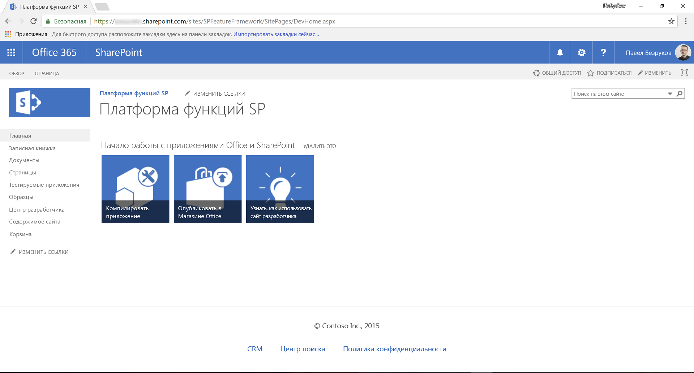
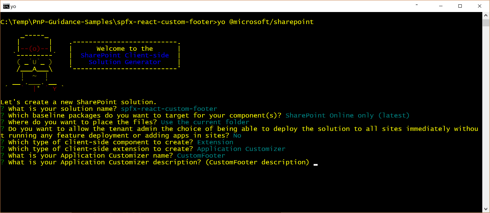
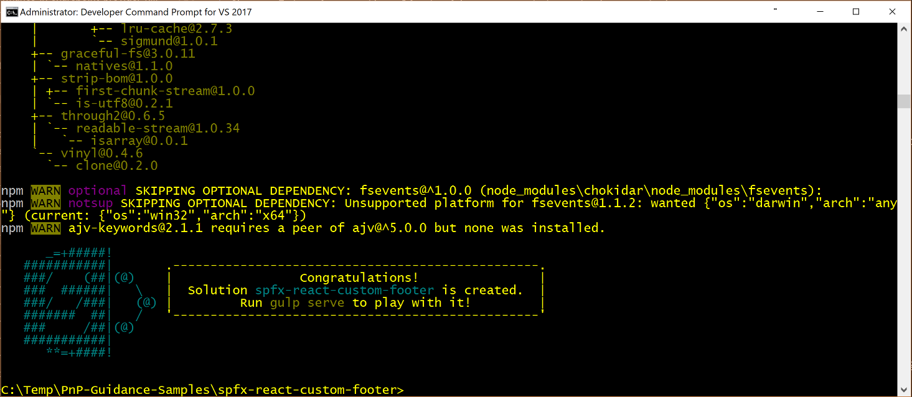
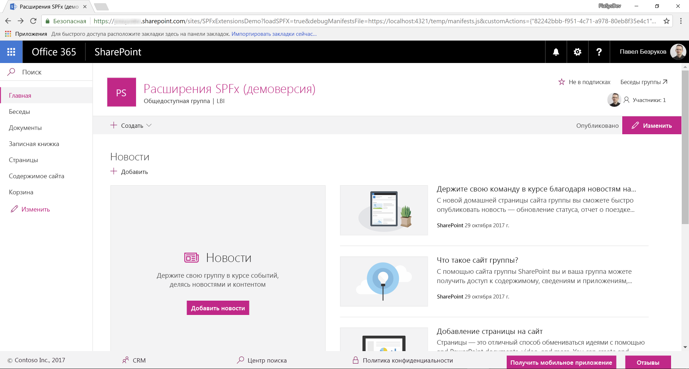
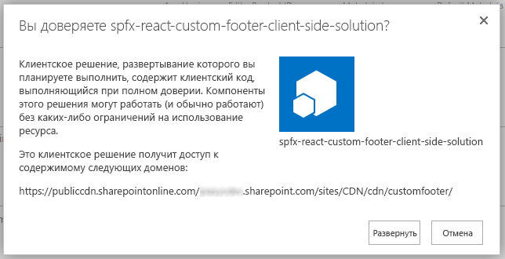
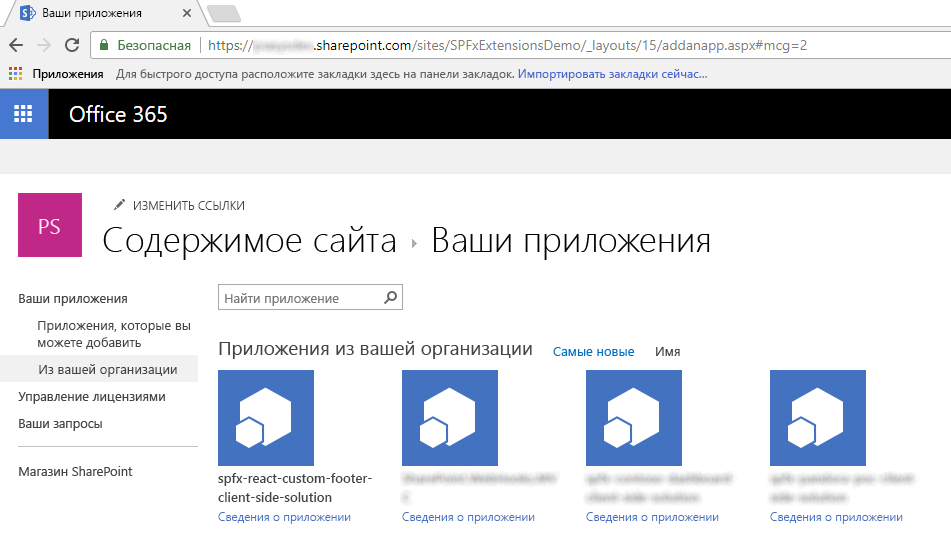

# <a name="migrating-from-usercustomaction-to-sharepoint-framework-extensions"></a><span data-ttu-id="8798d-103">Переход с дополнительных действий пользователя на расширения SharePoint Framework</span><span class="sxs-lookup"><span data-stu-id="8798d-103">Migrating from UserCustomAction to SharePoint Framework Extensions</span></span>

<span data-ttu-id="8798d-104">За последние несколько лет в большинстве корпоративных решений на основе Office 365 и SharePoint Online для расширения пользовательского интерфейса страниц использовалась возможность _CustomAction_ для сайтов на платформе функций SharePoint.</span><span class="sxs-lookup"><span data-stu-id="8798d-104">During the last few years, most of the enterprise solutions built on top of Office 365 and SharePoint Online leveraged the site _CustomAction_ capability of the SharePoint Feature Framework to extend the UI of pages.</span></span> <span data-ttu-id="8798d-105">Однако в "современном" интерфейсе SharePoint Online большинство таких модификаций стало недоступным.</span><span class="sxs-lookup"><span data-stu-id="8798d-105">However, within the new "modern" UI of SharePoint Online, most of those customizations are no longer available.</span></span> <span data-ttu-id="8798d-106">Реализовать схожие функции в "современном" интерфейсе можно с помощью новых расширений SharePoint Framework.</span><span class="sxs-lookup"><span data-stu-id="8798d-106">Fortunately, with the new SharePoint Framework Extensions, you can provide similar functionality in the "modern" UI.</span></span>

<span data-ttu-id="8798d-107">Из данного руководства вы узнаете, как перейти от старых ("классических") модификаций к новой модели на основе расширений SharePoint Framework.</span><span class="sxs-lookup"><span data-stu-id="8798d-107">In this tutorial, you learn how to migrate from the old "classic" customizations to the new model based on SharePoint Framework Extensions.</span></span>

> [!NOTE]
> <span data-ttu-id="8798d-108">Дополнительные сведения о создании расширений SharePoint Framework см. в статье [Обзор расширений SharePoint Framework](../overview-extensions.md).</span><span class="sxs-lookup"><span data-stu-id="8798d-108">For more information about how to build SharePoint Framework Extensions, see [Overview of SharePoint Framework Extensions](../overview-extensions.md).</span></span>

<span data-ttu-id="8798d-109">Сначала рассмотрим доступные разработчикам варианты для создания расширений SharePoint Framework.</span><span class="sxs-lookup"><span data-stu-id="8798d-109">First, let's introduce the available options when developing SharePoint Framework Extensions:</span></span>

* <span data-ttu-id="8798d-110">**Настройщик приложений**.</span><span class="sxs-lookup"><span data-stu-id="8798d-110">**Application Customizer**.</span></span> <span data-ttu-id="8798d-111">Расширьте встроенный "современный" пользовательский интерфейс SharePoint Online, добавив собственные элементы HTML и клиентский код к стандартным заполнителям "современных" страниц.</span><span class="sxs-lookup"><span data-stu-id="8798d-111">Extend the native "modern" UI of SharePoint Online by adding custom HTML elements and client-side code to pre-defined placeholders of "modern" pages.</span></span> <span data-ttu-id="8798d-112">На момент написания этой статьи заполнители доступны в верхнем и нижнем колонтитулах каждой "современной" страницы.</span><span class="sxs-lookup"><span data-stu-id="8798d-112">At the time of this writing, the available placeholders are the header and the footer of every "modern" page.</span></span>
* <span data-ttu-id="8798d-113">**Набор команд**.</span><span class="sxs-lookup"><span data-stu-id="8798d-113">**Command Set**.</span></span> <span data-ttu-id="8798d-114">Добавьте собственные элементы меню ECB или кнопки на панель команд списка или библиотеки.</span><span class="sxs-lookup"><span data-stu-id="8798d-114">Add custom ECB menu items or custom buttons to the command bar of a list view for a list or a library.</span></span> <span data-ttu-id="8798d-115">С этими командами можно связать любое действие JavaScript (TypeScript).</span><span class="sxs-lookup"><span data-stu-id="8798d-115">You can associate any JavaScript (TypeScript) action to these commands.</span></span>
* <span data-ttu-id="8798d-116">**Настройщик полей**.</span><span class="sxs-lookup"><span data-stu-id="8798d-116">**Field Customizer**.</span></span> <span data-ttu-id="8798d-117">Настройте отображение поля в списке, используя собственные элементы HTML и клиентский код.</span><span class="sxs-lookup"><span data-stu-id="8798d-117">Customize the rendering of a field in a list view by using custom HTML elements and client-side code.</span></span>

<span data-ttu-id="8798d-118">Наиболее полезное в нашем контексте расширение — настройщик заполнителей.</span><span class="sxs-lookup"><span data-stu-id="8798d-118">The most useful option in our context is the Application Customizer extension.</span></span>

<span data-ttu-id="8798d-119">Предположим, вы добавили в SharePoint Online элемент _CustomAction_ для отображения собственного нижнего колонтитула на всех страницах сайта.</span><span class="sxs-lookup"><span data-stu-id="8798d-119">Assume that you have a _CustomAction_ in SharePoint Online in order to have a custom footer in all of the site's pages.</span></span>

<span data-ttu-id="8798d-120">Ниже представлен XML-код этого элемента _CustomAction_ на платформе SharePoint Feature Framework.</span><span class="sxs-lookup"><span data-stu-id="8798d-120">In the following code snippet, you can see the XML code defining that _CustomAction_ by using the SharePoint Feature Framework.</span></span>

```XML
<?xml version="1.0" encoding="utf-8"?>
<Elements xmlns="http://schemas.microsoft.com/sharepoint/">
  <CustomAction Id="jQueryCDN"
                Title="jQueryCDN"
                Description="Loads jQuery from the public CDN"
                ScriptSrc="https://code.jquery.com/jquery-3.2.1.slim.min.js"
                Location="ScriptLink"
                Sequence="100" />
  <CustomAction Id="spoCustomBar"
                Title="spoCustomBar"
                Description="Loads a script to rendere a custom footer"
                Location="ScriptLink"
                ScriptSrc="SiteAssets/SPOCustomUI.js"
                Sequence="200" />
</Elements>
```

<span data-ttu-id="8798d-121">Как видите, в файле определено несколько элементов типа _CustomAction_, которые необходимо включить на страницы целевого сайта: код jQuery, загружаемый через общедоступную сеть CDN, и пользовательский файл JavaScript.</span><span class="sxs-lookup"><span data-stu-id="8798d-121">As you can see, the feature elements file defines a few elements of type _CustomAction_ to include in the pages of the target site: jQuery, loaded through the public CDN, and a custom JavaScript file that renders the custom footer.</span></span>

<span data-ttu-id="8798d-122">Для полноты картины ниже показан код JavaScript, который отрисовывает специальный нижний колонтитул с предопределенными элементами меню.</span><span class="sxs-lookup"><span data-stu-id="8798d-122">For the sake of completeness, you can see the JavaScript code that renders a custom footer, whose menu items are pre-defined in code for the sake of simplicity.</span></span>

```JavaScript
var SPOCustomUI = SPOCustomUI || {};

SPOCustomUI.setUpCustomFooter = function () {
    if ($("#SPOCustomFooter").length)
        return;

    var footerContainer = $("<div>");
    footerContainer.attr("id", "SPOCustomFooter");

    footerContainer.append("<ul>");

    $("#s4-workspace").append(footerContainer);
}

SPOCustomUI.addCustomFooterText = function (id, text) {
    if ($("#" + id).length)
        return;

    var customElement = $("<div>");
    customElement.attr("id", id);
    customElement.html(text);

    $("#SPOCustomFooter > ul").before(customElement);

    return customElement;
}

SPOCustomUI.addCustomFooterLink = function (id, text, url) {
    if ($("#" + id).length)
        return;

    var customElement = $("<a>");
    customElement.attr("id", id);
    customElement.attr("href", url);
    customElement.html(text);

    $("#SPOCustomFooter > ul").append($("<li>").append(customElement));

    return customElement;
}

SPOCustomUI.loadCSS = function (url) {
    var head = document.getElementsByTagName('head')[0];
    var style = document.createElement('link');
    style.type = 'text/css';
    style.rel = 'stylesheet';
    style.href = url;
    head.appendChild(style);
}

SPOCustomUI.init = function (whenReadyDoFunc) {
    // avoid executing inside iframes (used by Sharepoint for dialogs)
    if (self !== top) return;

    if (!window.jQuery) {
        // jQuery is needed for Custom Bar to run
        setTimeout(function () { SPOCustomUI.init(whenReadyDoFunc); }, 50);
    } else {
        $(function () {
            SPOCustomUI.setUpCustomFooter();
            whenReadyDoFunc();
        });
    }
}

// The following initializes the custom footer with some fake links
SPOCustomUI.init(function () {

    var currentScriptUrl;

    var currentScript = document.querySelectorAll("script[src*='SPOCustomUI']");
    if (currentScript.length > 0) {
        currentScriptUrl = currentScript[0].src;
    }
    if (currentScriptUrl != undefined) {
        var currentScriptBaseUrl = currentScriptUrl.substring(0, currentScriptUrl.lastIndexOf('/') + 1);
        SPOCustomUI.loadCSS(currentScriptBaseUrl + 'SPOCustomUI.css');
    }

    SPOCustomUI.addCustomFooterText('SPOFooterCopyright', '&copy; 2017, Contoso Inc.');
    SPOCustomUI.addCustomFooterLink('SPOFooterCRMLink', 'CRM', 'CRM.aspx');
    SPOCustomUI.addCustomFooterLink('SPOFooterSearchLink', 'Search Center', 'SearchCenter.aspx');
    SPOCustomUI.addCustomFooterLink('SPOFooterPrivacyLink', 'Privacy Policy', 'Privacy.aspx');
});
```

<br/>

<span data-ttu-id="8798d-123">На следующем рисунке показан результат предыдущего дополнительного действия на домашней странице классического сайта.</span><span class="sxs-lookup"><span data-stu-id="8798d-123">In the following figure you can see the output of the previous custom action, within the home page of a classic site.</span></span>



<br/>

<span data-ttu-id="8798d-125">Ниже описано, как перенести старое решение в "современный" пользовательский интерфейс.</span><span class="sxs-lookup"><span data-stu-id="8798d-125">To migrate the previous solution to the "modern" UI, see the following steps.</span></span>

> [!NOTE]
> <span data-ttu-id="8798d-126">Прежде чем выполнять действия, описанные в этой статье, обязательно [настройте среду разработки](../../set-up-your-development-environment.md).</span><span class="sxs-lookup"><span data-stu-id="8798d-126">Before following the steps in this article, be sure to [Set up your development environment](../../set-up-your-development-environment.md).</span></span>

## <a name="create-a-new-sharepoint-framework-solution"></a><span data-ttu-id="8798d-127">Создание решения SharePoint Framework</span><span class="sxs-lookup"><span data-stu-id="8798d-127">Create a new SharePoint Framework solution</span></span>

1. <span data-ttu-id="8798d-128">Откройте любую командную строку (например, PowerShell, CMD.EXE или Cmder).</span><span class="sxs-lookup"><span data-stu-id="8798d-128">Open the command line tool of your choice (for example, PowerShell, CMD.EXE, Cmder).</span></span> <span data-ttu-id="8798d-129">Создайте папку для решения под названием **spfx-react-custom-footer** и создайте решение SharePoint Framework, запустив генератор Yeoman с помощью следующей команды:</span><span class="sxs-lookup"><span data-stu-id="8798d-129">Create a new folder for the solution named **spfx-react-custom-footer**, and create a new SharePoint Framework solution by running the Yeoman generator with the following command:</span></span>

    ```
    yo @microsoft/sharepoint
    ```

2. <span data-ttu-id="8798d-130">При появлении запроса:</span><span class="sxs-lookup"><span data-stu-id="8798d-130">When prompted by the tool, provide the following answers:</span></span>

    * <span data-ttu-id="8798d-131">Оставьте имя решения по умолчанию (**spfx-react-custom-footer**) и нажмите клавишу ВВОД.</span><span class="sxs-lookup"><span data-stu-id="8798d-131">Accept the default name **spfx-react-custom-footer** for your solution, and select Enter.</span></span>
    * <span data-ttu-id="8798d-132">Выберите **SharePoint Online only (latest)** (Только SharePoint Online, последняя версия) и нажмите клавишу ВВОД.</span><span class="sxs-lookup"><span data-stu-id="8798d-132">Select **SharePoint Online only (latest)**, and select Enter.</span></span>
    * <span data-ttu-id="8798d-133">Выберите **Use the current folder** (Использовать текущую папку) и нажмите клавишу ВВОД.</span><span class="sxs-lookup"><span data-stu-id="8798d-133">Select **Use the current folder**, and select Enter.</span></span>
    * <span data-ttu-id="8798d-134">Выберите **N**, чтобы сделать установку расширения, выполняемую напрямую, обязательной на каждом сайте при его использовании.</span><span class="sxs-lookup"><span data-stu-id="8798d-134">Select **N** to require the extension to be installed on each site explicitly when it's being used.</span></span>
    * <span data-ttu-id="8798d-135">Выберите **Extension** (Расширение) в качестве типа создаваемого клиентского компонента.</span><span class="sxs-lookup"><span data-stu-id="8798d-135">Select **Extension** as the client-side component type to be created.</span></span>
    * <span data-ttu-id="8798d-136">Выберите для создаваемого расширения тип **Настройщик заполнителей**.</span><span class="sxs-lookup"><span data-stu-id="8798d-136">Select **Application Customizer** as the extension type to be created.</span></span>
    * <span data-ttu-id="8798d-137">Укажите для настройщика заполнителей имя **CustomFooter**.</span><span class="sxs-lookup"><span data-stu-id="8798d-137">Provide **CustomFooter** as the name for your Application Customizer.</span></span>

    

    <span data-ttu-id="8798d-139">На этом этапе Yeoman устанавливает необходимые зависимости и выполняет скаффолдинг файлов и папок решения вместе с расширением **CustomFooter**.</span><span class="sxs-lookup"><span data-stu-id="8798d-139">At this point, Yeoman installs the required dependencies and scaffolds the solution files and folders along with the **CustomFooter** extension.</span></span> <span data-ttu-id="8798d-140">Это может занять несколько минут.</span><span class="sxs-lookup"><span data-stu-id="8798d-140">This might take a few minutes.</span></span>

    <span data-ttu-id="8798d-141">После успешного формирования шаблона должно появиться следующее сообщение:</span><span class="sxs-lookup"><span data-stu-id="8798d-141">When the scaffold is complete, you should see the following message indicating a successful scaffold:</span></span>

    

3. <span data-ttu-id="8798d-143">Чтобы заблокировать версию зависимостей проекта, выполните следующую команду:</span><span class="sxs-lookup"><span data-stu-id="8798d-143">To lock down the version of the project dependencies, run the following command:</span></span>

    ```
    npm shrinkwrap
    ```

4. <span data-ttu-id="8798d-144">Запустите Visual Studio Code (или другой редактор кода) и начните разработку решения.</span><span class="sxs-lookup"><span data-stu-id="8798d-144">Start Visual Studio Code (or the code editor of your choice) and start developing the solution.</span></span> <span data-ttu-id="8798d-145">Чтобы запустить Visual Studio Code, можно выполнить следующий оператор:</span><span class="sxs-lookup"><span data-stu-id="8798d-145">To start Visual Studio Code, you can execute the following statement.</span></span>

    ```
    code .
    ```

## <a name="define-the-new-ui-elements"></a><span data-ttu-id="8798d-146">Определение новых элементов пользовательского интерфейса</span><span class="sxs-lookup"><span data-stu-id="8798d-146">Define the new UI elements</span></span>

<span data-ttu-id="8798d-147">Элементы специального нижнего колонтитула отрисовываются с помощью React и пользовательского компонента React.</span><span class="sxs-lookup"><span data-stu-id="8798d-147">The UI elements of the custom footer are rendered using React and a custom React component.</span></span> <span data-ttu-id="8798d-148">Конечно, вы можете создать элементы нижнего колонтитула с помощью любой технологии.</span><span class="sxs-lookup"><span data-stu-id="8798d-148">Of course, you can create the UI elements of the sample footer with whatever technology you like.</span></span> <span data-ttu-id="8798d-149">В этом руководстве мы используем React, чтобы получить доступ к компонентам Office UI Fabric для React.</span><span class="sxs-lookup"><span data-stu-id="8798d-149">In this tutorial, we use React to leverage the Office UI Fabric components for React.</span></span>

> [!NOTE]
> <span data-ttu-id="8798d-150">Дополнительные сведения о разработке решений с помощью React см. в [этом руководстве](https://reactjs.org/tutorial/tutorial.html).</span><span class="sxs-lookup"><span data-stu-id="8798d-150">For more information about developing solutions with React, see [Tutorial: Intro to React](https://reactjs.org/tutorial/tutorial.html).</span></span>

1. <span data-ttu-id="8798d-151">Откройте файл **CustomFooterApplicationCustomizer.manifest.json** в папке **src/extensions/customFooter**.</span><span class="sxs-lookup"><span data-stu-id="8798d-151">Open the file **CustomFooterApplicationCustomizer.manifest.json** in the **src/extensions/customFooter** folder.</span></span> <span data-ttu-id="8798d-152">Скопируйте значение свойства `id` и сохраните его в надежном месте, так как оно понадобится вам позже.</span><span class="sxs-lookup"><span data-stu-id="8798d-152">Copy the value of the `id` property and store it in a safe place because you need it later.</span></span>

2. <span data-ttu-id="8798d-153">Откройте файл **CustomFooterApplicationCustomizer.ts** в папке **src/расширения/customFooter** и импортируйте типы `PlaceholderContent` и `PlaceholderName` из пакета `'@microsoft/sp-application-base'`.</span><span class="sxs-lookup"><span data-stu-id="8798d-153">Open the **CustomFooterApplicationCustomizer.ts** file in the **src/extensions/customFooter** folder, and import the types `PlaceholderContent` and `PlaceholderName` from the package `'@microsoft/sp-application-base'`.</span></span> <span data-ttu-id="8798d-154">В самом начале файла добавьте директивы импорта для React.</span><span class="sxs-lookup"><span data-stu-id="8798d-154">At the very beginning of the file, add the import directives for React.</span></span>

    <span data-ttu-id="8798d-155">В приведенном ниже фрагменте кода показан раздел импорта в файле **CustomFooterApplicationCustomizer.ts**.</span><span class="sxs-lookup"><span data-stu-id="8798d-155">In the following code excerpt, you can see the imports section of the **CustomFooterApplicationCustomizer.ts** file.</span></span>

    ``` TypeScript
    import * as React from 'react';
    import * as ReactDom from 'react-dom';

    import { override } from '@microsoft/decorators';
    import { Log } from '@microsoft/sp-core-library';
    import {
    BaseApplicationCustomizer,
    PlaceholderContent,
    PlaceholderName
    } from '@microsoft/sp-application-base';
    import { Dialog } from '@microsoft/sp-dialog';

    import * as strings from 'CustomFooterApplicationCustomizerStrings';
    import CustomFooter from './components/CustomFooter';
    ```

3. <span data-ttu-id="8798d-156">Найдите определение класса `CustomFooterApplicationCustomizer` и объявите новый частный элемент `bottomPlaceholder` типа `PlaceholderContent | undefined`.</span><span class="sxs-lookup"><span data-stu-id="8798d-156">Locate the definition of the class `CustomFooterApplicationCustomizer` and declare a new private member called `bottomPlaceholder` of type `PlaceholderContent | undefined`.</span></span> 

4. <span data-ttu-id="8798d-157">В переопределении метода `onInit` вызовите пользовательскую функцию `renderPlaceHolders` и определите эту функцию.</span><span class="sxs-lookup"><span data-stu-id="8798d-157">Within the override of the `onInit` method, invoke a custom function called `renderPlaceHolders`, and define that function.</span></span>

    <span data-ttu-id="8798d-158">В приведенном ниже фрагменте кода показана реализация класса CustomFooterApplicationCustomizer.</span><span class="sxs-lookup"><span data-stu-id="8798d-158">In the following code excerpt you can see the implementation of the custom footer Application Customizer class.</span></span>

    ``` TypeScript
    /** A Custom Action which can be run during execution of a Client Side Application */
    export default class CustomFooterApplicationCustomizer
    extends BaseApplicationCustomizer<ICustomFooterApplicationCustomizerProperties> {

    // This private member holds a reference to the page's footer
    private _bottomPlaceholder: PlaceholderContent | undefined;

    @override
    public onInit(): Promise<void> {
        Log.info(LOG_SOURCE, `Initialized ${strings.Title}`);

        let message: string = this.properties.testMessage;
        if (!message) {
        message = '(No properties were provided.)';
        }

        // Call render method for rendering the needed html elements
        this._renderPlaceHolders();

        return Promise.resolve();
    }

    private _renderPlaceHolders(): void {

        // Handling the bottom placeholder
        if (!this._bottomPlaceholder) {
        this._bottomPlaceholder =
            this.context.placeholderProvider.tryCreateContent(
            PlaceholderName.Bottom);

        // The extension should not assume that the expected placeholder is available.
        if (!this._bottomPlaceholder) {
            console.error('The expected placeholder (Bottom) was not found.');
            return;
        }

        const element: React.ReactElement<{}> = React.createElement(CustomFooter);
        
        ReactDom.render(element, this._bottomPlaceholder.domElement);
        }
    }
    }
    ```

    <span data-ttu-id="8798d-159">Метод `renderPlaceHolders` ищет заполнитель типа `Bottom` и (если он найден) отрисовывает его содержимое.</span><span class="sxs-lookup"><span data-stu-id="8798d-159">The `renderPlaceHolders` method searches for the placeholder of type `Bottom`, and if any, it renders its content.</span></span> <span data-ttu-id="8798d-160">В самом конце метода `renderPlaceHolders` код создает новый экземпляр компонента React `CustomFooter` и отрисовывает его в заполнителе в нижней части страницы (т. е. на месте нижнего колонтитула).</span><span class="sxs-lookup"><span data-stu-id="8798d-160">In fact, at the very end of the `renderPlaceHolders` method, the code creates a new instance of a `CustomFooter` React component, and renders it within the placeholder of the pages' bottom (i.e. where the footer should be rendered).</span></span>

    > [!NOTE]
    > <span data-ttu-id="8798d-161">В "современной" модели компонент React заменяет файл JavaScript из "классической" модели.</span><span class="sxs-lookup"><span data-stu-id="8798d-161">The React component is the replacement in the "modern" UI for the JavaScript file in the "classic" model.</span></span> <span data-ttu-id="8798d-162">Конечно, вы можете по-прежнему отрисовывать нижний колонтитул, используя по большей части имеющийся чистый код JavaScript.</span><span class="sxs-lookup"><span data-stu-id="8798d-162">Of course, you can render the entire footer by using pure JavaScript code and reusing most of the code that you already have.</span></span> <span data-ttu-id="8798d-163">Однако рекомендуется обновить реализацию. Это целесообразно с методологической, и с практической точки зрения.</span><span class="sxs-lookup"><span data-stu-id="8798d-163">However, it is better to consider to upgrade the implementation not only from a technology perspective, but also from a code perspective.</span></span>

5. <span data-ttu-id="8798d-164">Добавьте новую папку под названием **components** в папку **src/extensions/customFooter**.</span><span class="sxs-lookup"><span data-stu-id="8798d-164">Add a new folder named **components** within the **src/extensions/customFooter** folder.</span></span> <span data-ttu-id="8798d-165">Создайте в новой папке файл и назовите его **CustomFooter.tsx**.</span><span class="sxs-lookup"><span data-stu-id="8798d-165">Create a new file within the new folder, and name it **CustomFooter.tsx**.</span></span>

    <span data-ttu-id="8798d-166">В приведенном ниже фрагменте кода показан исходный файл компонента.</span><span class="sxs-lookup"><span data-stu-id="8798d-166">In the following code excerpt, you can see the component source file.</span></span>

    ```TypeScript
    import * as React from 'react';

    import { CommandButton } from 'office-ui-fabric-react/lib/Button';

    export default class CustomFooter extends React.Component<{}, {}> {

    public render(): React.ReactElement<{}> {

        return (
        <div className={`ms-bgColor-neutralLighter ms-fontColor-white`}>
            <div className={`ms-bgColor-neutralLighter ms-fontColor-white`}>
                <div className={`ms-Grid`}>
                    <div className="ms-Grid-row">
                        <div className="ms-Grid-col ms-sm2 ms-md2 ms-lg2">
                            <CommandButton 
                                data-automation="CopyRight"
                                href={`CRM.aspx`}>&copy; 2017, Contoso Inc.</CommandButton>
                        </div>
                        <div className="ms-Grid-col ms-sm2 ms-md2 ms-lg2">
                        <CommandButton 
                                data-automation="CRM"
                                iconProps={ { iconName: 'People' } }
                                href={`CRM.aspx`}>CRM</CommandButton>
                        </div>
                        <div className="ms-Grid-col ms-sm2 ms-md2 ms-lg2">
                        <CommandButton 
                                data-automation="SearchCenter"
                                iconProps={ { iconName: 'Search' } }
                                href={`SearchCenter.aspx`}>Search Center</CommandButton>
                        </div>
                        <div className="ms-Grid-col ms-sm2 ms-md2 ms-lg2">
                            <CommandButton 
                                data-automation="Privacy"
                                iconProps={ { iconName: 'Lock' } }
                                href={`Privacy.aspx`}>Privacy Policy</CommandButton>
                        </div>
                        <div className="ms-Grid-col ms-sm4 ms-md4 ms-lg4">
                        </div>
                    </div>
                </div>
            </div>
        </div>
        );
    }
    }
    ```

    <span data-ttu-id="8798d-167">В данном документе не рассматривается создание компонента React.</span><span class="sxs-lookup"><span data-stu-id="8798d-167">Teaching you how to write a React component is out of scope for this document.</span></span> <span data-ttu-id="8798d-168">В любом случае обратите внимание на операторы `import` в начале файла, где компонент импортирует React и компонент React `CommandButton` из библиотеки компонентов Office UI Fabric.</span><span class="sxs-lookup"><span data-stu-id="8798d-168">Nevertheless, notice the `import` statements at the beginning, where the component imports React, and the `CommandButton` React component from the Office UI Fabric components library.</span></span>
    
    <span data-ttu-id="8798d-169">Вывод компонента `CustomFooter` определен в методе `render` с несколькими экземплярами компонента `CommandButton`, представляющими собой ссылки в нижнем колонтитуле.</span><span class="sxs-lookup"><span data-stu-id="8798d-169">In the `render` method of the component, it defined the output of the `CustomFooter` with few instances of the `CommandButton` component for the links in the footer.</span></span> <span data-ttu-id="8798d-170">Все выходные данные HTML заключены в макет сетки из Office UI Fabric.</span><span class="sxs-lookup"><span data-stu-id="8798d-170">All the HTML output is wrapped within a Grid layout of Office UI Fabric.</span></span>
    
    > [!NOTE]
    > <span data-ttu-id="8798d-171">Дополнительные сведения о макете сетки Office UI Fabric см. в разделе [Гибкий макет](https://developer.microsoft.com/ru-RU/fabric#/styles/layout).</span><span class="sxs-lookup"><span data-stu-id="8798d-171">For more information about the grid layout of Office UI Fabric, see [Responsive Layout](https://developer.microsoft.com/ru-RU/fabric#/styles/layout).</span></span>

    <span data-ttu-id="8798d-172">На приведенном ниже рисунке показан результат.</span><span class="sxs-lookup"><span data-stu-id="8798d-172">In the following figure, you can see the resulting output.</span></span>

    

## <a name="test-the-solution-in-debug-mode"></a><span data-ttu-id="8798d-174">Тестирование решения в режиме отладки</span><span class="sxs-lookup"><span data-stu-id="8798d-174">Test the solution in debug mode</span></span>

1. <span data-ttu-id="8798d-175">Вернитесь в окно консоль и выполните следующую команду, чтобы выполнить сборку и запустить локальный сервер Node.js для размещения решения.</span><span class="sxs-lookup"><span data-stu-id="8798d-175">Go back to the console window and run the following command to build the solution and run the local Node.js server to host it.</span></span>

    ```
    gulp serve --nobrowser
    ```

2. <span data-ttu-id="8798d-176">Теперь откройте любой браузер и перейдите на "современную" страницу любого "современного" сайта группы.</span><span class="sxs-lookup"><span data-stu-id="8798d-176">Now open your favorite browser and go to a "modern" page of any "modern" team site.</span></span> <span data-ttu-id="8798d-177">Добавьте приведенные ниже параметры строки запроса в URL-адрес страницы.</span><span class="sxs-lookup"><span data-stu-id="8798d-177">Now, append the following query string parameters to the page's URL.</span></span>

    ```
    ?loadSPFX=true&debugManifestsFile=https://localhost:4321/temp/manifests.js&customActions={"82242bbb-f951-4c71-a978-80eb8f35e4c1":{"location":"ClientSideExtension.ApplicationCustomizer"}}
    ```

    <span data-ttu-id="8798d-178">В этой строке запроса замените GUID сохраненным значением `id` из файла **CustomFooterApplicationCustomizer.manifest.json**.</span><span class="sxs-lookup"><span data-stu-id="8798d-178">In this query string, replace the GUID with the `id` value you saved from the **CustomFooterApplicationCustomizer.manifest.json** file.</span></span> 
    
    <span data-ttu-id="8798d-179">При выполнении запроса страницы появится запрос разрешения на запуск кода с localhost (окно с заголовком "Разрешить скрипты отладки?").</span><span class="sxs-lookup"><span data-stu-id="8798d-179">Notice that when executing the page request, you are prompted with a warning message box with the title "Allow debug scripts?", which asks your consent to run code from localhost for security reasons.</span></span> <span data-ttu-id="8798d-180">Конечно, если вы хотите отладить и протестировать решение локально, необходимо разрешить загрузку скриптов отладки.</span><span class="sxs-lookup"><span data-stu-id="8798d-180">Of course, if you want to locally debug and test the solution, you have to allow it to "Load debug scripts."</span></span>

## <a name="package-and-host-the-solution"></a><span data-ttu-id="8798d-181">Упаковка и размещение решения</span><span class="sxs-lookup"><span data-stu-id="8798d-181">Package and host the solution</span></span>

<span data-ttu-id="8798d-182">Если вы довольны результатом, упакуйте решение и разместите его в настоящей инфраструктуре.</span><span class="sxs-lookup"><span data-stu-id="8798d-182">If you are happy with the result, you are now ready to package the solution and host it in a real hosting infrastructure.</span></span>
<span data-ttu-id="8798d-183">Прежде чем собирать пакет, необходимо объявить XML-файл Feature Framework для подготовки расширения.</span><span class="sxs-lookup"><span data-stu-id="8798d-183">Before building the bundle and the package, you need to declare an XML Feature Framework file to provision the extension.</span></span>

### <a name="review-feature-framework-elements"></a><span data-ttu-id="8798d-184">Обзор элементов Feature Framework</span><span class="sxs-lookup"><span data-stu-id="8798d-184">Review Feature Framework elements</span></span>

1. <span data-ttu-id="8798d-185">В редакторе кода откройте вложенную папку **/sharepoint/assets** в папке решения и измените файл **elements.xml**.</span><span class="sxs-lookup"><span data-stu-id="8798d-185">In the code editor, open the **/sharepoint/assets** sub-folder of the solution folder, and edit the **elements.xml** file.</span></span> <span data-ttu-id="8798d-186">В приведенном ниже фрагменте кода показано, как должен выглядеть файл.</span><span class="sxs-lookup"><span data-stu-id="8798d-186">In the following code excerpt, you can see how the file should look.</span></span>

    ```XML
    <?xml version="1.0" encoding="utf-8"?>
    <Elements xmlns="http://schemas.microsoft.com/sharepoint/">
        <CustomAction
            Title="CustomFooter"
            Location="ClientSideExtension.ApplicationCustomizer"
            ClientSideComponentId="82242bbb-f951-4c71-a978-80eb8f35e4c1">
        </CustomAction>
    </Elements>
    ```

    <span data-ttu-id="8798d-187">Как видите, он напоминает файл SharePoint Feature Framework из "классической" модели, но использует атрибут `ClientSideComponentId`, чтобы ссылаться на свойство `id` специального расширения.</span><span class="sxs-lookup"><span data-stu-id="8798d-187">As you can see, it reminds us of the SharePoint Feature Framework file that we saw in the "classic" model, but it uses the `ClientSideComponentId` attribute to reference the `id` of the custom extension.</span></span> <span data-ttu-id="8798d-188">Вы также можете добавить атрибут `ClientSideComponentProperties`, если нужно предоставить расширению пользовательские параметры (в данном руководстве это не требуется).</span><span class="sxs-lookup"><span data-stu-id="8798d-188">You can also add a `ClientSideComponentProperties` attribute, if you need to provide custom settings to the extension, which is not the case in this tutorial.</span></span>

2. <span data-ttu-id="8798d-189">Откройте файл **package-solution.json** в папке **/config** решения.</span><span class="sxs-lookup"><span data-stu-id="8798d-189">Open the **package-solution.json** file under the **/config** folder of the solution.</span></span> <span data-ttu-id="8798d-190">В файле вы увидите ссылку на файл **elements.xml** в разделе `assets`.</span><span class="sxs-lookup"><span data-stu-id="8798d-190">Within the file, you can see that there is a reference to the **elements.xml** file within the `assets` section.</span></span>

    ```JSON
    {
    "$schema": "https://dev.office.com/json-schemas/spfx-build/package-solution.schema.json",
    "solution": {
        "name": "spfx-react-custom-footer-client-side-solution",
        "id": "911728a5-7bde-4453-97b2-2eba59277ed3",
        "version": "1.0.0.0",
        "features": [
        {
            "title": "Application Extension - Deployment of custom action.",
            "description": "Deploys a custom action with ClientSideComponentId association",
            "id": "f16a2612-3163-46ad-9664-3d3daac68cff",
            "version": "1.0.0.0",
            "assets": {
            "elementManifests": [
                "elements.xml"
            ]
            }
        }
        ]
    },
    "paths": {
        "zippedPackage": "solution/spfx-react-custom-footer.sppkg"
    }
    }
    ```

### <a name="enable-the-cdn-in-your-office-365-tenant"></a><span data-ttu-id="8798d-191">Включение сети доставки содержимого (CDN) в клиенте Office 365</span><span class="sxs-lookup"><span data-stu-id="8798d-191">Enable the CDN in your Office 365 tenant</span></span>

<span data-ttu-id="8798d-192">Теперь необходимо разместить расширение в среде внешнего размещения.</span><span class="sxs-lookup"><span data-stu-id="8798d-192">Now you need to host the extension in a hosting environment.</span></span> <span data-ttu-id="8798d-193">Сеть доставки содержимого Office 365 — самый простой способ размещать решения SharePoint непосредственно из их клиента, пользуясь при этом преимуществами службы сетей доставки содержимого (CDN) для сокращения времени загрузки ресурсов.</span><span class="sxs-lookup"><span data-stu-id="8798d-193">Office 365 CDN is the easiest way to host SharePoint Framework solutions directly from your tenant while still taking advantage of the Content Delivery Network (CDN) service for faster load times of your assets.</span></span>

1. <span data-ttu-id="8798d-194">Скачайте [командную консоль SharePoint Online](https://www.microsoft.com/en-us/download/details.aspx?id=35588), чтобы убедиться, что у вас установлена последняя версия.</span><span class="sxs-lookup"><span data-stu-id="8798d-194">Download the [SharePoint Online Management Shell](https://www.microsoft.com/en-us/download/details.aspx?id=35588) to ensure that you have the latest version.</span></span>

2. <span data-ttu-id="8798d-195">Подключитесь к клиенту SharePoint Online с помощью PowerShell:</span><span class="sxs-lookup"><span data-stu-id="8798d-195">Connect to your SharePoint Online tenant by using PowerShell:</span></span>
    
    ```powershell
    Connect-SPOService -Url https://[tenant]-admin.sharepoint.com
    ```
    
3. <span data-ttu-id="8798d-196">Чтобы узнать текущее состояние настроек общедоступной сети CDN для клиента, поочередно выполните указанные ниже команды.</span><span class="sxs-lookup"><span data-stu-id="8798d-196">Get the current status of public CDN settings from the tenant level by executing the following commands one-by-one:</span></span> 
    
    ```powershell
    Get-SPOTenantCdnEnabled -CdnType Public
    Get-SPOTenantCdnOrigins -CdnType Public
    Get-SPOTenantCdnPolicies -CdnType Public
    ```
    
4. <span data-ttu-id="8798d-197">Включите общедоступную сеть доставки содержимого в клиенте:</span><span class="sxs-lookup"><span data-stu-id="8798d-197">Enable public CDN in the tenant:</span></span>
    
    ```powershell
    Set-SPOTenantCdnEnabled -CdnType Public
    ```
    
    <span data-ttu-id="8798d-198">Теперь в клиенте включена общедоступная сеть доставки содержимого с использованием разрешенной конфигурации типов файлов по умолчанию.</span><span class="sxs-lookup"><span data-stu-id="8798d-198">Public CDN has now been enabled in the tenant by using the default file type configuration allowed.</span></span> <span data-ttu-id="8798d-199">Это означает, что поддерживаются такие расширения: CSS, EOT, CSS, EOT, GIF, ICO, JPEG, JPG, JS, MAP, PNG, SVG, TTF и WOFF.</span><span class="sxs-lookup"><span data-stu-id="8798d-199">This means that the following file type extensions are supported: CSS, EOT, GIF, ICO, JPEG, JPG, JS, MAP, PNG, SVG, TTF, and WOFF.</span></span>

5. <span data-ttu-id="8798d-p124">Откройте браузер и перейдите к семейству веб-сайтов, в котором вы хотите разместить свою библиотеку CDN. Это может быть любое семейство веб-сайтов в клиенте. Это руководство описывает создание библиотеки CDN, но вы также можете использовать отдельную папку в любой существующей библиотеке документов как конечную точку CDN.</span><span class="sxs-lookup"><span data-stu-id="8798d-p124">Open up a browser and move to a site collection where you'd like to host your CDN library. This could be any site collection in your tenant. In this tutorial, we create a specific library to act as your CDN library, but you can also use a specific folder in any existing document library as the CDN endpoint.</span></span>

6. <span data-ttu-id="8798d-203">В семействе веб-сайтов создайте библиотеку документов **CDN** и добавьте в нее папку **customfooter**.</span><span class="sxs-lookup"><span data-stu-id="8798d-203">Create a new document library on your site collection called **CDN** and add a folder named **customfooter** to it.</span></span>
    
7. <span data-ttu-id="8798d-204">В консоли PowerShell добавьте новый источник сети доставки содержимого.</span><span class="sxs-lookup"><span data-stu-id="8798d-204">In the PowerShell console, add a new CDN origin.</span></span> <span data-ttu-id="8798d-205">В этом случае мы задаем источник `*/cdn`, то есть в качестве источника сети доставки содержимого будет выступать любая относительная папка с именем **cdn**.</span><span class="sxs-lookup"><span data-stu-id="8798d-205">In this case, we are setting the origin as `*/cdn`, which means that any relative folder with the name of **cdn** acts as a CDN origin.</span></span>
    
    ```powershell
    Add-SPOTenantCdnOrigin -CdnType Public -OriginUrl */cdn
    ```
    
8. <span data-ttu-id="8798d-206">Выполните указанную ниже команду, чтобы получить список источников сети доставки содержимого клиента:</span><span class="sxs-lookup"><span data-stu-id="8798d-206">Execute the following command to get the list of CDN origins from your tenant:</span></span>
    
    ```powershell
    Get-SPOTenantCdnOrigins -CdnType Public
    ```
    
    <span data-ttu-id="8798d-207">Обратите внимание на то, что новый источник указан как допустимый источник сети доставки содержимого.</span><span class="sxs-lookup"><span data-stu-id="8798d-207">Note that your newly added origin is listed as a valid CDN origin.</span></span> <span data-ttu-id="8798d-208">Окончательная настройка источника занимает приблизительно 15 минут, поэтому мы можем продолжить подготовку расширения, которое будет размещено в источнике после развертывания.</span><span class="sxs-lookup"><span data-stu-id="8798d-208">Final configuration of the origin takes approximately 15 minutes, so we can continue provisioning the extension, which is hosted from the origin after deployment is completed.</span></span> 

    

    <span data-ttu-id="8798d-210">Если рядом с названием источника нет уведомления `(configuration pending)`, он готов к использованию в клиенте.</span><span class="sxs-lookup"><span data-stu-id="8798d-210">When the origin is listed without the `(configuration pending)` text, it is ready to be used in your tenant.</span></span> <span data-ttu-id="8798d-211">Это указывает на выполняющуюся настройку SharePoint Online и системы CDN.</span><span class="sxs-lookup"><span data-stu-id="8798d-211">This indicates an on-going configuration between SharePoint Online and the CDN system.</span></span> 

### <a name="update-the-solution-settings-and-publish-it-on-the-cdn"></a><span data-ttu-id="8798d-212">Обновление параметров решения и его публикация в сети доставки содержимого</span><span class="sxs-lookup"><span data-stu-id="8798d-212">Update the solution settings and publish it on the CDN</span></span>

<span data-ttu-id="8798d-213">Далее необходимо обновить решение, чтобы разместить его в только что созданной сети CDN, а также опубликовать в ней пакет решения.</span><span class="sxs-lookup"><span data-stu-id="8798d-213">Next, you need to update the solution to use the just created CDN as the hosting enviroment, and you need to publish the solution bundle to the CDN.</span></span> <span data-ttu-id="8798d-214">Для этого выполните указанные ниже действия.</span><span class="sxs-lookup"><span data-stu-id="8798d-214">To accomplish this task, follow these steps.</span></span>

1. <span data-ttu-id="8798d-215">Вернитесь к ранее созданному решению, чтобы внести необходимые изменения в URL-адреса.</span><span class="sxs-lookup"><span data-stu-id="8798d-215">Return to the previously created solution to perform the needed URL updates.</span></span>
    
2. <span data-ttu-id="8798d-216">Обновите файл _write-manifestests.json_ (в папке _config_), как показано ниже, чтобы он указывал на конечную точку CDN.</span><span class="sxs-lookup"><span data-stu-id="8798d-216">Update the _write-manifests.json_ file (under the _config_ folder) as follows to point to your CDN endpoint.</span></span> <span data-ttu-id="8798d-217">Используйте `publiccdn.sharepointonline.com` в качестве префикса, а затем дополните URL-адрес фактическим путем к вашему клиенту.</span><span class="sxs-lookup"><span data-stu-id="8798d-217">Use `publiccdn.sharepointonline.com` as the prefix, and then extend the URL with the actual path of your tenant.</span></span> <span data-ttu-id="8798d-218">Формат URL-адреса для сети доставки содержимого:</span><span class="sxs-lookup"><span data-stu-id="8798d-218">The format of the CDN URL is as follows:</span></span>
    
    ```
    https://publiccdn.sharepointonline.com/[tenant host name]/sites/[site]/[library]/[folder]
    ```
    
    

3. <span data-ttu-id="8798d-220">Сохраните изменения.</span><span class="sxs-lookup"><span data-stu-id="8798d-220">Save your changes.</span></span>

4. <span data-ttu-id="8798d-221">Выполните описанную ниже задачу для упаковки решения.</span><span class="sxs-lookup"><span data-stu-id="8798d-221">Execute the following task to bundle your solution.</span></span> <span data-ttu-id="8798d-222">При этом будет выполнена сборка конечной версии проекта с использованием URL-адреса сети доставки содержимого, указанного в файле **writer-manifest.json**.</span><span class="sxs-lookup"><span data-stu-id="8798d-222">This executes a release build of your project using the CDN URL specified in the **write-manifests.json** file.</span></span> <span data-ttu-id="8798d-223">Результат будет помещен в папку **./temp/deploy**.</span><span class="sxs-lookup"><span data-stu-id="8798d-223">The output of this command is located in the **./temp/deploy** folder.</span></span> <span data-ttu-id="8798d-224">Эти файлы вам нужно будет добавить в папку SharePoint, представляющую собой конечную точку CDN.</span><span class="sxs-lookup"><span data-stu-id="8798d-224">These are the files that you need to upload to the SharePoint folder acting as your CDN endpoint.</span></span> 
    
    ```
    gulp bundle --ship
    ```
    
5. <span data-ttu-id="8798d-225">Выполните указанную ниже команду, чтобы упаковать решение.</span><span class="sxs-lookup"><span data-stu-id="8798d-225">Execute the following task to package your solution.</span></span> <span data-ttu-id="8798d-226">Эта команда создает пакет **spfx-react-custom-footer.sppkg** в папке **sharepoint/solution** и подготавливает ресурсы в папке **temp/deploy** к развертыванию в CDN.</span><span class="sxs-lookup"><span data-stu-id="8798d-226">This command creates an **spfx-react-custom-footer.sppkg** package in the **sharepoint/solution** folder and prepares the assets in the **temp/deploy** folder to be deployed to the CDN.</span></span>
    
    ```
    gulp package-solution --ship
    ```
    
6. <span data-ttu-id="8798d-227">Добавьте или перетащите новый пакет клиентского решения в каталог приложений в клиенте и нажмите кнопку _Развернуть_.</span><span class="sxs-lookup"><span data-stu-id="8798d-227">Upload or drag-and-drop the newly created client-side solution package to the app catalog in your tenant, and then select the _Deploy_ button.</span></span>

    

7. <span data-ttu-id="8798d-229">Отправьте или перетащите файлы из папки **temp/deploy** в созданную ранее папку **CDN/customfooter**.</span><span class="sxs-lookup"><span data-stu-id="8798d-229">Upload or drag-and-drop the files in the **temp/deploy** folder to the **CDN/customfooter** folder created earlier.</span></span>

### <a name="install-and-run-the-solution"></a><span data-ttu-id="8798d-230">Установка и запуск решения</span><span class="sxs-lookup"><span data-stu-id="8798d-230">Install and run the solution</span></span>

1. <span data-ttu-id="8798d-231">Откройте браузер и перейдите на любой "современный" сайт.</span><span class="sxs-lookup"><span data-stu-id="8798d-231">Open the browser and navigate to any target "modern" site.</span></span>

2. <span data-ttu-id="8798d-232">Перейдите на страницу **Содержимое сайта** и добавьте новое **приложение**.</span><span class="sxs-lookup"><span data-stu-id="8798d-232">Go to the **Site Contents** page and select to add a new **App**.</span></span>

3. <span data-ttu-id="8798d-233">Выберите **Из вашей организации**, чтобы просмотреть решения, доступные в каталоге приложений.</span><span class="sxs-lookup"><span data-stu-id="8798d-233">Select to install a new app **From Your Organization** to browse the solutions available in the App Catalog.</span></span>

4. <span data-ttu-id="8798d-234">Выберите решение **spfx-react-custom-footer-client-side-solution** и установите его на целевом сайте.</span><span class="sxs-lookup"><span data-stu-id="8798d-234">Select the solution called **spfx-react-custom-footer-client-side-solution** and install it on the target site.</span></span>

    

5. <span data-ttu-id="8798d-236">После установки приложения обновите страницу или перейдите на домашнюю страницу сайта.</span><span class="sxs-lookup"><span data-stu-id="8798d-236">After the application installation is completed, refresh the page or go to the home page of the site.</span></span> <span data-ttu-id="8798d-237">Внизу страницы должен отображаться специальный нижний колонтитул.</span><span class="sxs-lookup"><span data-stu-id="8798d-237">You should be able to see the custom footer in action.</span></span>

<span data-ttu-id="8798d-238">Поздравляем! Вы создали специальный нижний колонтитул, используя расширения SharePoint Framework.</span><span class="sxs-lookup"><span data-stu-id="8798d-238">Enjoy your new custom footer built by using the SharePoint Framework Extensions!</span></span>

## <a name="see-also"></a><span data-ttu-id="8798d-239">См. также</span><span class="sxs-lookup"><span data-stu-id="8798d-239">See also</span></span>

- [<span data-ttu-id="8798d-240">Обзор расширений SharePoint Framework</span><span class="sxs-lookup"><span data-stu-id="8798d-240">Overview of SharePoint Framework Extensions</span></span>](../overview-extensions.md)
