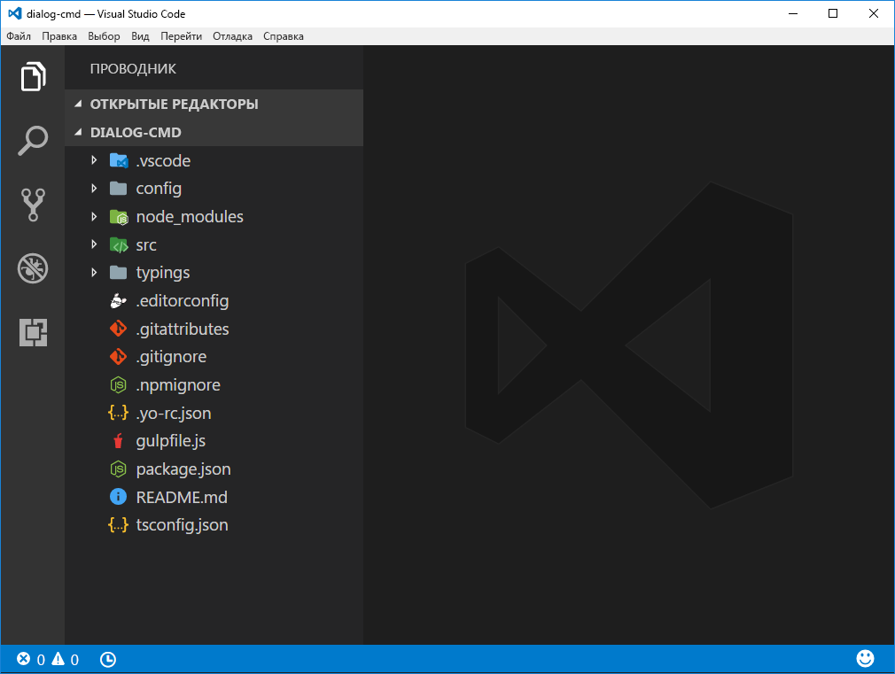
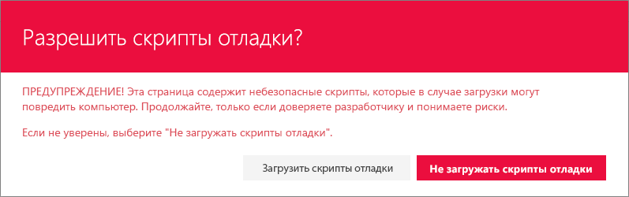
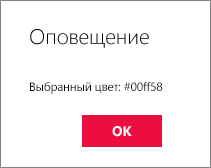

# <a name="using-custom-dialogs-with-sharepoint-framework-extensions"></a>Использование настраиваемых диалоговых окон с расширениями SharePoint Framework

Настраиваемые диалоговые окна доступны в пакете `@microsoft/sp-dialog`, и их можно использовать в контексте расширений SharePoint Framework или клиентских веб-частей. 

В этом руководстве показано создание настраиваемого диалогового окна и его использование в контексте расширения с набором команд ListView.

> Обратите внимание, что диалоговое окно SharePoint Framework находится на этапе тестирования, и мы собираем отзывы перед его официальным выпуском. Оставляйте свои отзывы с помощью [списка проблем в репозитории sp-dev-docs](https://github.com/SharePoint/sp-dev-docs/issues).

> Обратите внимание, что в настоящее время отладка настраиваемых списков ListView в SharePoint Online доступна только в современном интерфейсе списков на классических сайтах групп, размещенных в клиенте разработчика. 

> Результат выполнения действий, описанных в этом руководстве, также доступен в виде исходного кода по адресу https://github.com/SharePoint/sp-dev-fx-extensions/tree/master/samples/react-command-dialog.  

## <a name="setup-your-environment"></a>Настройка среды

Прежде чем выполнять действия, описанные в этом руководстве, необходимо убедиться, что вы [настроили среду](https://dev.office.com/sharepoint/docs/spfx/set-up-your-development-environment) для разработки с помощью SharePoint Framework, а также используете последние версии шаблонов Yeoman для SharePoint Framework. 

> Чтобы обновить шаблоны Yeoman для SharePoint Framework, можно выполнить следующую команду: `npm install -g @microsoft/generator-sharepoint`. 

## <a name="create-a-new-project"></a>Создание проекта

Для начала создайте папку проекта с помощью любой консоли:

```sh
md dialog-cmd
```

Перейдите к этой папке.

```sh
cd dialog-cmd
```

Запустите генератор Yeoman для SharePoint Framework.

```sh
yo @microsoft/sharepoint
```

Когда появится запрос, выполните указанные ниже действия.

* Оставьте значение по умолчанию (**dialog-cmd**) для имени решения и нажмите клавишу **ВВОД**.
* Выберите для создаваемого клиентского компонента тип **Extension (Preview)**. 
* Выберите для создаваемого расширения тип **ListView Command Set (Preview)**.

Далее вам потребуется указать определенные сведения о расширении.

* Оставьте значение по умолчанию (**DialogDemo**) для имени решения и нажмите клавишу **ВВОД**.
* Оставьте значение по умолчанию (**DialogDemo description**) для описания решения и нажмите клавишу **ВВОД**.


После этого Yeoman установит необходимые зависимости и сформирует файлы решения, а также расширение *HelloWorld*. Это может занять несколько минут. 

После успешного формирования должно появиться следующее сообщение:


Сведения об устранении неполадок см. в статье [Известные проблемы](../basics/known-issues).

Когда шаблон будет сформирован, откройте папку проекта в редакторе кода. В этой статье инструкции и снимки экрана основаны на Visual Studio Code, но вы можете использовать любой редактор.

```
code .
```



## <a name="modify-extension-manifest-based-on-requirements"></a>Изменение манифеста расширения в соответствии с требованиями 

Настройте манифест расширения так, чтобы в расширении была только одна кнопка. В редакторе кода откройте файл **./src/extensions/dialogDemo/DialogDemoCommandSet.manifest.json**. Замените раздел команд на следующий код JSON:

```json
{
  //...
  "commands": {
    "COMMAND_1": {
      "title": "Open Custom Dialog",
      "iconImageUrl": "icons/request.png"
    }
  }
}

```

## <a name="adding-sp-dialog-package-to-solution"></a>Добавление пакета sp-dialog в решение
Вернитесь к консоли и выполните приведенную ниже команду, чтобы включить API диалоговых окон в наше решение. 

```
npm install @microsoft/sp-dialog --save
```

Так как мы используем параметр `--save`, эта зависимость будет добавлена в файл *package.json* и автоматически установлена при выполнении команды `npm install`.

Вернитесь к Visual Studio Code (или другому редактору, который вы используете).

## <a name="creating-your-custom-dialog"></a>Создание настраиваемого диалогового окна
Создайте файл с именем **ColorPickerDialog.tsx** в папке **./src/extensions/dialogDemo/**.

Добавьте приведенный ниже оператор импорта в начале нового файла. Мы создаем настраиваемое диалоговое окно с помощью компонентов Office UI Fabric React, поэтому реализация будет основана на React. 

> Обратите внимание, что в настоящее время компонент DialogContent поступает из `@microsoft/sp-dialog`, но скоро будет включен в компоненты Office UI Fabric React, как указано в комментариях к коду. 

```ts
import * as React from 'react';
import * as ReactDOM from 'react-dom';
import { BaseDialog, IDialogConfiguration } from '@microsoft/sp-dialog';
import {
  autobind,
  ColorPicker,
  PrimaryButton,
  Button,
  DialogFooter
  // DialogContent <- This should be imported here for third parties
} from 'office-ui-fabric-react';
// Note: DialogContent is available in v2.32.0 of office-ui-fabric-react
// As a workaround we're importing it from sp-dialog until the next version bump
import { DialogContent } from '@microsoft/sp-dialog';
```

Добавьте приведенное ниже определение интерфейса сразу после операторов импорта. Оно будет использоваться для передачи необходимых сведений и функций между набором команд ListView и настраиваемым диалоговым окном.

```ts
interface IColorPickerDialogContentProps {
  message: string;
  close: () => void;
  submit: (color: string) => void;
  defaultColor?: string;
}
```

Добавьте приведенный ниже класс сразу после определения интерфейса. Этот класс React отвечает за отрисовку пользовательского интерфейса в настраиваемом диалоговом окне. Обратите внимание, что мы используем компоненты Office UI Fabric React для фактической отрисовки и просто передаем необходимые свойства.  

```ts
class ColorPickerDialogContent extends React.Component<IColorPickerDialogContentProps, {}> {
  private _pickedColor: string;

  constructor(props) {
    super(props);
    // Default Color
    this._pickedColor = props.defaultColor || '#FFFFFF';
  }

  public render(): JSX.Element {
    return <DialogContent
      title='Color Picker'
      subText={this.props.message}
      onDismiss={this.props.close}
      showCloseButton={true}
    >
      <ColorPicker color={this._pickedColor} onColorChanged={this._onColorChange} />
      <DialogFooter>
        <Button text='Cancel' title='Cancel' onClick={this.props.close} />
        <PrimaryButton text='OK' title='OK' onClick={() => { this.props.submit(this._pickedColor); }} />
      </DialogFooter>
    </DialogContent>;
  }

  @autobind
  private _onColorChange(color: string): void {
    this._pickedColor = color;
  }
}
```
Добавьте приведенное ниже определение класса для настраиваемого диалогового окна под только что добавленным кодом класса. Это фактическое настраиваемое диалоговое окно, которое будет вызываться по нажатию кнопки и наследоваться от **BaseDialog**.

```ts
export default class ColorPickerDialog extends BaseDialog {
  public message: string;
  public colorCode: string;

  public render(): void {
    ReactDOM.render(<ColorPickerDialogContent
      close={ this.close }
      message={ this.message }
      defaultColor={ this.colorCode }
      submit={ this._submit }
    />, this.domElement);
  }

  public getConfig(): IDialogConfiguration {
    return {
      isBlocking: false
    };
  }

  @autobind
  private _submit(color: string): void {
    this.colorCode = color;
    this.close();
  }
}
```

## <a name="associating-custom-dialog-to-button-click"></a>Связывание настраиваемого диалогового окна с нажатием кнопки
Чтобы связать настраиваемое диалоговое окно с набором команд ListView, необходимо добавить код инициализации диалогового окна в операцию нажатия кнопки.

В редакторе кода откройте файл **DialogDemoCommandSet.ts** из папки **./src/extensions/dialogDemo/**.

Добавьте приведенные ниже операторы импорта под имеющимся оператором импорта **strings**. Они предназначены для использования только что созданного настраиваемого диалогового окна в контексте набора команд ListView. 

```ts
import { Dialog } from '@microsoft/sp-dialog';
import ColorPickerDialog from './ColorPickerDialog';
```

Добавьте приведенное ниже определение переменной **_colorCode** над функцией **onInit** в классе **DialogDemoCommandSet**. Оно используется для хранения цвета, выбранного в диалоговом окне.

```ts
  private _colorCode: string;
```

Измените функцию **onExecute**, как показано ниже. В этом коде выполняются следующие действия:

* инициализация настраиваемого диалогового окна;
* передача сообщения, которое будет использоваться в качестве заголовка диалогового окна;
* передача кода цвета диалоговому окну со значением по умолчанию, если оно еще не задано;
* отображение настраиваемого диалогового окна;
* получение и хранение значения, возвращаемого диалоговым окном;
* отображение полученного значения во встроенном диалоговом окне с помощью функции `Dialog.alert()`.

```ts
  @override
  public onExecute(event: IListViewCommandSetExecuteEventParameters): void {
    switch (event.commandId) {
      case 'COMMAND_1':
        const dialog: ColorPickerDialog = new ColorPickerDialog();
        dialog.message = 'Pick a color:';
        // Use 'EEEEEE' as the default color for first usage
        dialog.colorCode = this._colorCode || '#EEEEEE';
        dialog.show().then(() => {
          this._colorCode = dialog.colorCode;
          Dialog.alert(`Picked color: ${dialog.colorCode}`);
        });
        break;
      default:
        throw new Error('Unknown command');
    }
  }
```

## <a name="testing-custom-dialog-in-your-tenant"></a>Тестирование настраиваемого диалогового окна в клиенте
Перейдите к файлу **DialogDemoCommandSet.manifest.json** в папке **./src/extensions/dialogDemo/** и скопируйте значение **id**, которое будет использоваться в качестве параметра запроса отладки.

Перейдите к консоли и выполните приведенную ниже команду. Мы используем параметр `--nobrowser`, так как в настоящее время невозможно использовать для отладки локальное рабочее место, а следовательно, нет смысла запускать его. 

```sh
gulp serve --nobrowser
```

Начнется упаковка, а полученный манифест станет доступен по адресу `localhost`.


Для тестирования расширения перейдите к сайту в клиенте SharePoint Online.

Перейдите к существующему настраиваемому списку на сайте с несколькими элементами или создайте список и добавьте в него несколько элементов для тестирования. 

Добавьте к URL-адресу приведенные ниже параметры строки запроса. Обратите внимание, что вам потребуется обновить параметр **id** в соответствии с идентификатором расширения, указанным в файле **DialogDemoCommandSet.manifest.json**:

```
?loadSpfx=true&debugManifestsFile=https://localhost:4321/temp/manifests.js&customActions={"8701f44c-8c81-4e54-999d-62763e8f34d2":{"location":"ClientSideExtension.ListViewCommandSet.CommandBar"}}
```

Согласитесь на загрузку манифестов отладки, нажав кнопку **Загрузить скрипты отладки** при появлении соответствующего запроса.



Обратите внимание на новую кнопку *Open Custom Dialog* (Открыть настраиваемое диалоговое окно) на панели инструментов списка.


Нажмите кнопку *Open Custom Dialog*, чтобы в представлении списка открылось настраиваемое диалоговое окно. 


Выберите цвет в *палитре* и нажмите кнопку **ОК**, чтобы проверить, как код возвращает вызывающей стороне выбранное значение, которое затем отображается с помощью встроенного диалогового окна предупреждения.


