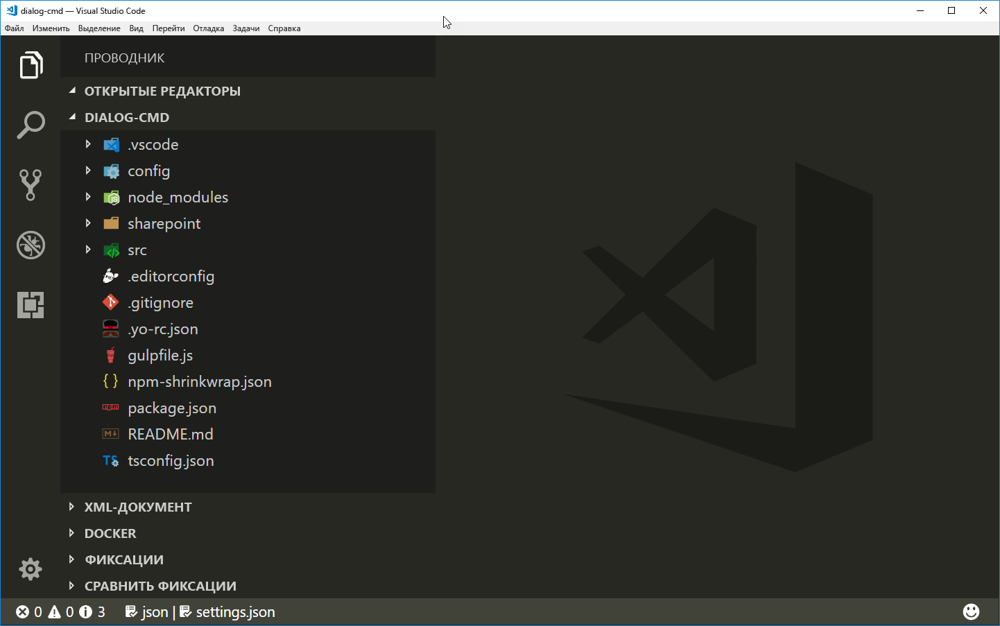

# <a name="use-custom-dialog-boxes-with-sharepoint-framework-extensions"></a>Использование настраиваемых диалоговых окон с расширениями SharePoint Framework

Вы можете использовать настраиваемые диалоговые окна, доступные в пакете **@microsoft/sp-dialog**, в контексте расширений SharePoint Framework или клиентских веб-частей. 

В этой статье описываются создание настраиваемого диалогового окна и его использование в контексте расширения ListView Command Set.

Пример кода, рассматриваемый в этой статье, можно найти в репозитории [sp-dev-fx-extensions](https://github.com/SharePoint/sp-dev-fx-extensions/tree/master/samples/react-command-dialog).

## <a name="set-up-your-development-environment"></a>Настройка среды разработки

Чтобы создать настраиваемое диалоговое окно, необходимо выполнить действия, описанные в статье [Настройка среды разработки](../../set-up-your-development-environment.md). Убедитесь, что вы используете последние версии шаблонов Yeoman для SharePoint Framework.

## <a name="create-a-new-project"></a>Создание проекта

1. Создайте папку проекта с помощью любой консоли:

  ```sh
  md dialog-cmd
  ```

2. Перейдите в эту папку:

  ```sh
  cd dialog-cmd
  ```

3. Запустите генератор Yeoman для SharePoint Framework:

  ```sh
  yo @microsoft/sharepoint
  ```

4. Когда появится запрос, выполните следующие действия:

  * Оставьте значение по умолчанию (**dialog-cmd**) для имени решения, а затем нажмите клавишу ВВОД.
  * Выберите **SharePoint Online only (latest)** (Только SharePoint Online, последняя версия) и нажмите клавишу ВВОД.
  * Выберите **Use the current folder** (Использовать текущую папку), а затем нажмите клавишу ВВОД.
  * Выберите **N**, чтобы сделать установку расширения обязательной на каждом сайте при его использовании.
  * Выберите **Extension** (Расширение) в качестве типа создаваемого клиентского компонента. 
  * Выберите для создаваемого расширения тип **ListView Command Set**.

5. Далее вам потребуется указать определенные сведения о расширении:

  * Используйте значение **DialogDemo** для имени решения, а затем нажмите клавишу ВВОД.
  * Оставьте значение по умолчанию (**DialogDemo description**) для описания решения, а затем нажмите клавишу ВВОД.

  

  После этого Yeoman установит необходимые зависимости и сформирует шаблоны файлов решения, а также расширение **DialogDemo**. Это может занять несколько минут.

  Когда скаффолдинг успешно закончится, появится следующее сообщение:

  

6. По завершении формирования шаблона заблокируйте версию зависимостей проекта, выполнив следующую команду:

  ```sh
  npm shrinkwrap
  ```

7. Откройте папку проекта в редакторе кода. В этой статье в инструкциях и на снимках экрана используется Visual Studio Code, но вы можете использовать любой другой редактор. Чтобы открыть папку в Visual Studio Code, выполните следующую команду в консоли:

  ```sh
  code .
  ```

  <br/>

  

## <a name="modify-the-extension-manifest"></a>Изменение манифеста расширения

Настройте манифест расширения так, чтобы в расширении была только одна кнопка. В редакторе кода откройте файл **./src/extensions/dialogDemo/DialogDemoCommandSet.manifest.json**. Замените раздел команд на следующий код JSON:

```json
{
  //...
  "items": {
    "COMMAND_1": {
      "title": { "default": "Open Custom Dialog" },
      "iconImageUrl": "icons/request.png",
      "type": "command"
    }
  }
}
```

## <a name="create-a-custom-dialog-box"></a>Создание настраиваемого диалогового окна

1. Создайте файл с именем **ColorPickerDialog.tsx** в папке **./src/extensions/dialogDemo/**.

2. Добавьте приведенные ниже операторы импорта в начале нового файла. Вы создаете настраиваемое диалоговое окно с помощью [компонентов Office UI Fabric React](https://developer.microsoft.com/ru-RU/fabric#/components), поэтому реализация будет основана на React. 

  ```typescript
  import * as React from 'react';
  import * as ReactDOM from 'react-dom';
  import { BaseDialog, IDialogConfiguration } from '@microsoft/sp-dialog';
  import {
    autobind,
    ColorPicker,
    PrimaryButton,
    Button,
    DialogFooter,
    DialogContent
  } from 'office-ui-fabric-react';

  ```

3. Добавьте приведенное ниже определение интерфейса сразу после операторов импорта. Оно будет использоваться для передачи сведений и функций между расширением ListView Command Set и настраиваемым диалоговым окном.

  ```typescript
  interface IColorPickerDialogContentProps {
    message: string;
    close: () => void;
    submit: (color: string) => void;
    defaultColor?: string;
  }
  ```

4. Добавьте приведенный ниже класс сразу после определения интерфейса. Этот класс React отвечает за отрисовку пользовательского интерфейса в настраиваемом диалоговом окне. Обратите внимание, что мы используем компоненты Office UI Fabric React для фактической отрисовки и просто передаем необходимые свойства.  

  ```typescript
  class ColorPickerDialogContent extends React.Component<IColorPickerDialogContentProps, {}> {
    private _pickedColor: string;

    constructor(props) {
      super(props);
      // Default Color
      this._pickedColor = props.defaultColor || '#FFFFFF';
    }

    public render(): JSX.Element {
      return <DialogContent
        title='Color Picker'
        subText={this.props.message}
        onDismiss={this.props.close}
        showCloseButton={true}
      >
        <ColorPicker color={this._pickedColor} onColorChanged={this._onColorChange} />
        <DialogFooter>
          <Button text='Cancel' title='Cancel' onClick={this.props.close} />
          <PrimaryButton text='OK' title='OK' onClick={() => { this.props.submit(this._pickedColor); }} />
        </DialogFooter>
      </DialogContent>;
    }

    @autobind
    private _onColorChange(color: string): void {
      this._pickedColor = color;
    }
  }
  ```

5. Добавьте приведенное ниже определение класса для настраиваемого диалогового окна под только что добавленным классом `ColorPickerDialogContent`. Это фактическое настраиваемое диалоговое окно, которое вызывается по нажатию кнопки "Набор команд ListView" и наследуется от объекта `BaseDialog`.

  ```typescript
  export default class ColorPickerDialog extends BaseDialog {
    public message: string;
    public colorCode: string;

    public render(): void {
      ReactDOM.render(<ColorPickerDialogContent
        close={ this.close }
        message={ this.message }
        defaultColor={ this.colorCode }
        submit={ this._submit }
      />, this.domElement);
    }

    public getConfig(): IDialogConfiguration {
      return {
        isBlocking: false
      };
    }

    @autobind
    private _submit(color: string): void {
      this.colorCode = color;
      this.close();
    }
  }
  ```

## <a name="associate-the-dialog-box-with-the-listview-command-set-button-click"></a>Связывание диалогового окна с нажатием кнопки "Набор команд ListView"

Чтобы связать настраиваемое диалоговое окно с набором команд ListView, добавьте код инициализации диалогового окна в операцию нажатия кнопки.

1. В редакторе кода откройте файл **DialogDemoCommandSet.ts** из папки **./src/extensions/dialogDemo/**.

2. Добавьте приведенные ниже операторы импорта под имеющимся оператором импорта **strings**. Они предназначены для использования настраиваемого диалогового окна в контексте набора команд ListView. 

  ```typescript
  import ColorPickerDialog from './ColorPickerDialog';
  ```

3. Добавьте приведенное ниже определение переменной `_colorCode` над функцией `onInit` в классе `DialogDemoCommandSet`. Оно используется для хранения цвета, выбранного в диалоговом окне.

  ```typescript
    private _colorCode: string;
  ```

4. Измените функцию `onExecute`, как показано ниже. Этот код:

  * инициализирует настраиваемое диалоговое окно;
  * передает сообщение, используемое в качестве заголовка диалогового окна;
  * передает код цвета диалогового окна со стандартным значением, если оно еще не задано;
  * показывает настраиваемое диалоговое окно;
  * получает и сохраняет значение, возвращаемое диалоговым окном;
  * показывает полученное значение в стандартном диалоговом окне с помощью функции `Dialog.alert()`.

  ```typescript
    @override
    public onExecute(event: IListViewCommandSetExecuteEventParameters): void {
      switch (event.itemId) {
        case 'COMMAND_1':
          const dialog: ColorPickerDialog = new ColorPickerDialog();
          dialog.message = 'Pick a color:';
          // Use 'EEEEEE' as the default color for first usage
          dialog.colorCode = this._colorCode || '#EEEEEE';
          dialog.show().then(() => {
            this._colorCode = dialog.colorCode;
            Dialog.alert(`Picked color: ${dialog.colorCode}`);
          });
          break;
        default:
          throw new Error('Unknown command');
      }
    }
  ```

## <a name="test-the-dialog-box-in-your-tenant"></a>Тестирование диалогового окна в клиенте

1. Откройте файл **serve.json** в папке **./config/** и обновите в нем текущие параметры. Этот файл призван упростить отладку расширений SharePoint Framework. Вы можете обновить содержимое файла в соответствии с данными клиента и сайта, на котором будет тестироваться расширение. В первую очередь следует изменить значение свойства `pageUrl` в определении JSON так, чтобы оно соответствовало вашему клиенту.

2. Измените свойство `pageUrl` так, чтобы оно указывало на URL-адрес списка, в котором нужно тестировать функции диалогового окна.

  ```sh
    "serveConfigurations": {
      "default": {
        "pageUrl": "https://sppnp.sharepoint.com/sites/team/Shared%20Documents/Forms/AllItems.aspx",
        "customActions": {
          "9b98b919-fe5e-4758-ac91-6d62e582c4fe": {
            "location": "ClientSideExtension.ListViewCommandSet.CommandBar",
            "properties": {
              "sampleTextOne": "One item is selected in the list",
              "sampleTextTwo": "This command is always visible."
            }
          }
        }
      },
  ```

  > [!NOTE]
  > Уникальный идентификатор расширения автоматически обновляется для этого файла во время первоначального формирования шаблонов. Если вы обновляете свойства, которые используются расширением, следует обновить файл **serve.json**, прежде чем приступать к отладке.

3. Вернитесь к консоли и выполните следующую команду:

  ```sh
  gulp serve
  ```

  Начнется упаковка решения, а полученный манифест станет доступен по адресу `localhost`. В соответствии с конфигурацией из файла **serve.json** в браузере также откроется определенный URL-адрес, а параметры запроса будут автоматически заданы согласно конфигурации решения.

4. Согласитесь на загрузку манифестов отладки, нажав кнопку **Загрузить скрипты отладки** при появлении соответствующего запроса.

  

  Обратите внимание, что новая кнопка *не* отображается на панели инструментов по умолчанию, так как стандартное решение требует выбора одного элемента списка. Если список или библиотека не содержит элементов, создайте элемент или отправьте документ. 

5. Выберите элемент из списка или библиотеки. Обратите внимание, что на панели инструментов появится кнопка с текстом **Open Custom Dialog** (Открыть настраиваемое диалоговое окно).

  

6. Нажмите кнопку **Open Custom Dialog** (Открыть настраиваемое диалоговое окно), чтобы настраиваемое диалоговое окно отобразилось в представлении списка. 

  

7. Выберите цвет в **палитре** и нажмите кнопку **ОК**, чтобы проверить, как код возвращает вызывающей стороне выбранное значение, которое затем отображается в стандартном диалоговом окне предупреждения.

  

> [!NOTE]
> Если вы обнаружили ошибку в документации или SharePoint Framework, сообщите о ней разработчикам SharePoint, указав в [списке проблем для репозитория sp-dev-docs](https://github.com/SharePoint/sp-dev-docs/issues). Заранее спасибо!

## <a name="see-also"></a>См. также

- [Обзор расширений SharePoint Framework](../overview-extensions.md)