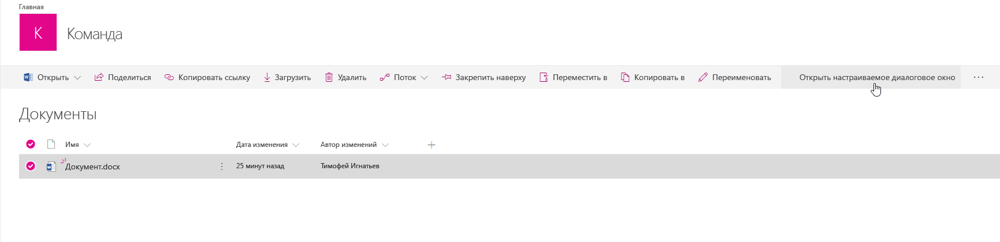
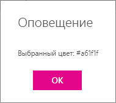

# <a name="use-custom-dialog-boxes-with-sharepoint-framework-extensions"></a><span data-ttu-id="7095a-102">Использование настраиваемых диалоговых окон с расширениями SharePoint Framework</span><span class="sxs-lookup"><span data-stu-id="7095a-102">Use custom dialog boxes with SharePoint Framework Extensions</span></span>

<span data-ttu-id="7095a-103">Вы можете использовать настраиваемые диалоговые окна, доступные в пакете **@microsoft/sp-dialog**, в контексте расширений SharePoint Framework или клиентских веб-частей.</span><span class="sxs-lookup"><span data-stu-id="7095a-103">You can use custom dialog boxes, available from the **@microsoft/sp-dialog** package, within the context of SharePoint Framework Extensions or client-side web parts.</span></span> 

<span data-ttu-id="7095a-104">В этой статье описываются создание настраиваемого диалогового окна и его использование в контексте расширения ListView Command Set.</span><span class="sxs-lookup"><span data-stu-id="7095a-104">This article describes how to create a custom dialog box and use it within the context of a ListView Command Set extension.</span></span>

<span data-ttu-id="7095a-105">Пример кода, рассматриваемый в этой статье, можно найти в репозитории [sp-dev-fx-extensions](https://github.com/SharePoint/sp-dev-fx-extensions/tree/master/samples/react-command-dialog).</span><span class="sxs-lookup"><span data-stu-id="7095a-105">You can access the sample code that this article is based on in the [sp-dev-fx-extensions](https://github.com/SharePoint/sp-dev-fx-extensions/tree/master/samples/react-command-dialog) repo.</span></span>

## <a name="set-up-your-development-environment"></a><span data-ttu-id="7095a-106">Настройка среды разработки</span><span class="sxs-lookup"><span data-stu-id="7095a-106">Set up your development environment</span></span>

<span data-ttu-id="7095a-p101">Чтобы создать настраиваемое диалоговое окно, необходимо выполнить действия, описанные в статье [Настройка среды разработки](https://dev.office.com/sharepoint/docs/spfx/set-up-your-development-environment). Убедитесь, что вы используете последние версии шаблонов Yeoman для SharePoint Framework.</span><span class="sxs-lookup"><span data-stu-id="7095a-p101">To create a custom dialog box, you'll need to follow the steps in the [Set up your development environment](https://dev.office.com/sharepoint/docs/spfx/set-up-your-development-environment). Make sure that you're using the latest SharePoint Framework Yeoman templates.</span></span>

## <a name="create-a-new-project"></a><span data-ttu-id="7095a-109">Создание проекта</span><span class="sxs-lookup"><span data-stu-id="7095a-109">Create a new project</span></span>

<span data-ttu-id="7095a-110">Создайте папку проекта с помощью любой консоли:</span><span class="sxs-lookup"><span data-stu-id="7095a-110">Create a new folder for the project using your console of choice:</span></span>

```sh
md dialog-cmd
```

<span data-ttu-id="7095a-111">Перейдите к этой папке:</span><span class="sxs-lookup"><span data-stu-id="7095a-111">Then enter that folder:</span></span>

```sh
cd dialog-cmd
```

<span data-ttu-id="7095a-112">Запустите генератор Yeoman для SharePoint Framework.</span><span class="sxs-lookup"><span data-stu-id="7095a-112">Run the Yeoman generator for the SharePoint Framework:</span></span>

```sh
yo @microsoft/sharepoint
```

<span data-ttu-id="7095a-113">Когда появится запрос, выполните указанные ниже действия.</span><span class="sxs-lookup"><span data-stu-id="7095a-113">When prompted:</span></span>

* <span data-ttu-id="7095a-114">Оставьте значение по умолчанию (**dialog-cmd**) для имени решения и нажмите клавишу **ВВОД**.</span><span class="sxs-lookup"><span data-stu-id="7095a-114">Accept the default value of **dialog-cmd** as your solution name and press **Enter**.</span></span>
* <span data-ttu-id="7095a-115">Выберите **SharePoint Online only (latest)** (Только SharePoint Online, последняя версия) и нажмите клавишу **ВВОД**.</span><span class="sxs-lookup"><span data-stu-id="7095a-115">Choose **SharePoint Online only (latest)**, and press **Enter**.</span></span>
* <span data-ttu-id="7095a-116">Выберите **Use the current folder** (Использовать текущую папку) и нажмите клавишу **ВВОД**.</span><span class="sxs-lookup"><span data-stu-id="7095a-116">Choose **Use the current folder** and press **Enter**.</span></span>
* <span data-ttu-id="7095a-117">Выберите **N**, чтобы сделать установку расширения, выполняемую напрямую, обязательной на каждом сайте при его использовании.</span><span class="sxs-lookup"><span data-stu-id="7095a-117">Choose **N** to require extension to be installed on each site explicitly when it's being used.</span></span>
* <span data-ttu-id="7095a-118">Выберите **Extension** (Расширение) в качестве типа создаваемого клиентского компонента.</span><span class="sxs-lookup"><span data-stu-id="7095a-118">Choose **Extension** as the client-side component type to be created.</span></span> 
* <span data-ttu-id="7095a-119">Выберите для создаваемого расширения тип **ListView Command Set**.</span><span class="sxs-lookup"><span data-stu-id="7095a-119">Choose **ListView Command Set** as the extension type to be created.</span></span>

<span data-ttu-id="7095a-120">Далее вам потребуется указать определенные сведения о расширении.</span><span class="sxs-lookup"><span data-stu-id="7095a-120">The next set of prompts will ask for specific information about your extension:</span></span>

* <span data-ttu-id="7095a-121">Используйте значение **DialogDemo** для имени решения и нажмите клавишу **ВВОД**.</span><span class="sxs-lookup"><span data-stu-id="7095a-121">Use the value of **DialogDemo** as your extension name and press **Enter**.</span></span>
* <span data-ttu-id="7095a-122">Оставьте значение по умолчанию (**DialogDemo description**) для описания решения и нажмите клавишу **ВВОД**.</span><span class="sxs-lookup"><span data-stu-id="7095a-122">Accept the default value of **DialogDemo description** as your extension description and press **Enter**.</span></span>


<span data-ttu-id="7095a-p102">После этого Yeoman установит необходимые зависимости и сформирует файлы решения, а также расширение *DialogDemo*. Это может занять несколько минут.</span><span class="sxs-lookup"><span data-stu-id="7095a-p102">At this point, Yeoman will install the required dependencies and scaffold the solution files along with the *DialogDemo* extension. This might take a few minutes.</span></span>

<span data-ttu-id="7095a-126">После успешного формирования должно появиться следующее сообщение:</span><span class="sxs-lookup"><span data-stu-id="7095a-126">When the scaffold is complete, you should see the following message indicating a successful scaffold:</span></span>


<span data-ttu-id="7095a-128">После скаффолдинга заблокируйте версию зависимостей проекта, выполнив следующую команду:</span><span class="sxs-lookup"><span data-stu-id="7095a-128">Once the scaffolding completes, lock down the version of the project dependencies by running the following command:</span></span>

```sh
npm shrinkwrap
```

<span data-ttu-id="7095a-129">Далее откройте папку проекта в редакторе кода.</span><span class="sxs-lookup"><span data-stu-id="7095a-129">Next, open your project folder in your code editor.</span></span> <span data-ttu-id="7095a-130">В инструкциях и на снимках экрана из этой статьи указан Visual Studio Code, но вы можете использовать любой редактор.</span><span class="sxs-lookup"><span data-stu-id="7095a-130">This article uses Visual Studio Code in the steps and screenshots, but you can use any editor you prefer.</span></span> <span data-ttu-id="7095a-131">Чтобы открыть папку в Visual Studio Code, выполните следующую команду в консоли:</span><span class="sxs-lookup"><span data-stu-id="7095a-131">To open the folder in Visual Studio Code, use the following command in the console:</span></span>

```sh
code .
```


## <a name="modify-the-extension-manifest"></a><span data-ttu-id="7095a-133">Изменение манифеста расширения</span><span class="sxs-lookup"><span data-stu-id="7095a-133">Modify the extension manifest</span></span>

<span data-ttu-id="7095a-p104">Настройте манифест расширения так, чтобы в расширении была только одна кнопка. В редакторе кода откройте файл **./src/extensions/dialogDemo/DialogDemoCommandSet.manifest.json**. Замените раздел команд на следующий код JSON:</span><span class="sxs-lookup"><span data-stu-id="7095a-p104">In the extension manifest, configure the extension to have only one button. In the code editor, open the **./src/extensions/dialogDemo/DialogDemoCommandSet.manifest.json** file. Replace the commands section with the following JSON:</span></span>

```json
{
  //...
  "items": {
    "COMMAND_1": {
      "title": { "default": "Open Custom Dialog" },
      "iconImageUrl": "icons/request.png",
      "type": "command"
    }
  }
}
```

## <a name="create-a-custom-dialog-box"></a><span data-ttu-id="7095a-137">Создание настраиваемого диалогового окна</span><span class="sxs-lookup"><span data-stu-id="7095a-137">Create a custom dialog box</span></span>

<span data-ttu-id="7095a-138">Создайте файл с именем **ColorPickerDialog.tsx** в папке **./src/extensions/dialogDemo/**.</span><span class="sxs-lookup"><span data-stu-id="7095a-138">Create a new file called **ColorPickerDialog.tsx** in the **./src/extensions/dialogDemo/** folder.</span></span>

<span data-ttu-id="7095a-p105">Добавьте приведенный ниже оператор импорта в начале нового файла. Мы создаем настраиваемое диалоговое окно с помощью [компонентов Office UI Fabric React](https://dev.office.com/fabric#/components), поэтому реализация будет основана на React.</span><span class="sxs-lookup"><span data-stu-id="7095a-p105">Add the following import statements at the top of the newly created file. You're creating your custom dialog box using the [Office UI Fabric React components](https://dev.office.com/fabric#/components), so the implementation will be in React.</span></span> 


```ts
import * as React from 'react';
import * as ReactDOM from 'react-dom';
import { BaseDialog, IDialogConfiguration } from '@microsoft/sp-dialog';
import {
  autobind,
  ColorPicker,
  PrimaryButton,
  Button,
  DialogFooter,
  DialogContent
} from 'office-ui-fabric-react';

```

<span data-ttu-id="7095a-p106">Добавьте приведенное ниже определение интерфейса сразу после операторов импорта. Оно будет использоваться для передачи сведений и функций между набором команд ListView и настраиваемым диалоговым окном.</span><span class="sxs-lookup"><span data-stu-id="7095a-p106">Add the following interface definition just below the import statements. This will be used to pass information and functions between your ListView Command Set extension and your custom dialog box.</span></span>

```ts
interface IColorPickerDialogContentProps {
  message: string;
  close: () => void;
  submit: (color: string) => void;
  defaultColor?: string;
}
```

<span data-ttu-id="7095a-p107">Добавьте приведенный ниже класс сразу после определения интерфейса. Этот класс React отвечает за отрисовку пользовательского интерфейса в настраиваемом диалоговом окне. Обратите внимание, что мы используем компоненты Office UI Fabric React для фактической отрисовки и просто передаем необходимые свойства.</span><span class="sxs-lookup"><span data-stu-id="7095a-p107">Add the following class just below the interface definition. This React class is responsible for rendering the UI experiences inside the custom dialog box. Notice that you use the Office UI Fabric React components for actual rendering and just pass the needed properties.</span></span>  

```ts
class ColorPickerDialogContent extends React.Component<IColorPickerDialogContentProps, {}> {
  private _pickedColor: string;

  constructor(props) {
    super(props);
    // Default Color
    this._pickedColor = props.defaultColor || '#FFFFFF';
  }

  public render(): JSX.Element {
    return <DialogContent
      title='Color Picker'
      subText={this.props.message}
      onDismiss={this.props.close}
      showCloseButton={true}
    >
      <ColorPicker color={this._pickedColor} onColorChanged={this._onColorChange} />
      <DialogFooter>
        <Button text='Cancel' title='Cancel' onClick={this.props.close} />
        <PrimaryButton text='OK' title='OK' onClick={() => { this.props.submit(this._pickedColor); }} />
      </DialogFooter>
    </DialogContent>;
  }

  @autobind
  private _onColorChange(color: string): void {
    this._pickedColor = color;
  }
}
```
<span data-ttu-id="7095a-p108">Добавьте приведенное ниже определение класса к настраиваемому диалоговому окну под только что добавленным классом `ColorPickerDialogContent`. Это фактическое настраиваемое диалоговое окно, которое будет вызываться по нажатию кнопки набору команд ListView и наследуется от объекта `BaseDialog`.</span><span class="sxs-lookup"><span data-stu-id="7095a-p108">Add the following class definition for your custom dialog box under the `ColorPickerDialogContent` class that you just added. This is the actual custom dialog box that will be called from the ListView Command Set button click and is inherited from the `BaseDialog`.</span></span>

```ts
export default class ColorPickerDialog extends BaseDialog {
  public message: string;
  public colorCode: string;

  public render(): void {
    ReactDOM.render(<ColorPickerDialogContent
      close={ this.close }
      message={ this.message }
      defaultColor={ this.colorCode }
      submit={ this._submit }
    />, this.domElement);
  }

  public getConfig(): IDialogConfiguration {
    return {
      isBlocking: false
    };
  }

  @autobind
  private _submit(color: string): void {
    this.colorCode = color;
    this.close();
  }
}
```

## <a name="associate-the-custom-dialog-box-with-the-listview-command-set-button-click"></a><span data-ttu-id="7095a-148">Связывание настраиваемого диалогового окна с нажатием кнопки набора команд ListView</span><span class="sxs-lookup"><span data-stu-id="7095a-148">Associate the custom dialog box with the ListView Command Set button click</span></span>
<span data-ttu-id="7095a-149">Чтобы связать настраиваемое диалоговое окно с набором команд ListView, добавьте код инициализации диалогового окна в операцию нажатия кнопки.</span><span class="sxs-lookup"><span data-stu-id="7095a-149">To associate the custom dialog box with your custom ListView Command Set, add the code to initiate the dialog box within the button click operation.</span></span>

<span data-ttu-id="7095a-150">В редакторе кода откройте файл **DialogDemoCommandSet.ts** из папки **./src/extensions/dialogDemo/**.</span><span class="sxs-lookup"><span data-stu-id="7095a-150">In the code editor, open the **DialogDemoCommandSet.ts** file from the **./src/extensions/dialogDemo/** folder.</span></span>

<span data-ttu-id="7095a-p109">Добавьте приведенные ниже операторы импорта под имеющимся оператором импорта **strings**. Они предназначены для использования настраиваемого диалогового окна в контексте набора команд ListView.</span><span class="sxs-lookup"><span data-stu-id="7095a-p109">Add the following import statements under the existing **strings** import. These are for using the custom dialog box in the context of your ListView Command Set.</span></span> 

```ts
import ColorPickerDialog from './ColorPickerDialog';
```

<span data-ttu-id="7095a-p110">Добавьте приведенное ниже определение переменной `_colorCode` над функцией `onInit` в классе `DialogDemoCommandSet`. Оно используется для хранения цвета, выбранного в диалоговом окне.</span><span class="sxs-lookup"><span data-stu-id="7095a-p110">Add the following `_colorCode` variable definition above the `onInit` function in the `DialogDemoCommandSet` class. This is used to store the color picker dialog box result.</span></span>

```ts
  private _colorCode: string;
```

<span data-ttu-id="7095a-p111">Измените функцию `onExecute`, как показано ниже. Этот код:</span><span class="sxs-lookup"><span data-stu-id="7095a-p111">Update the `onExecute` function as follows. This code does the following:</span></span>

* <span data-ttu-id="7095a-157">инициализирует настраиваемое диалоговое окно;</span><span class="sxs-lookup"><span data-stu-id="7095a-157">Initiates the custom dialog box.</span></span>
* <span data-ttu-id="7095a-158">передает диалоговому окну сообщение, которое будет использоваться в качестве заголовка;</span><span class="sxs-lookup"><span data-stu-id="7095a-158">Passes a message for the dialog box, which is used for the title.</span></span>
* <span data-ttu-id="7095a-159">передает код цвета диалоговому окну со значением по умолчанию, если оно еще не задано;</span><span class="sxs-lookup"><span data-stu-id="7095a-159">Passed a color code for the dialog box with a default value, if not yet set.</span></span>
* <span data-ttu-id="7095a-160">показывает настраиваемое диалоговое окно;</span><span class="sxs-lookup"><span data-stu-id="7095a-160">Shows the custom dialog box.</span></span>
* <span data-ttu-id="7095a-161">получает и сохраняет значение, возвращаемое диалоговым окном;</span><span class="sxs-lookup"><span data-stu-id="7095a-161">Receives and stores the return value from the dialog box.</span></span>
* <span data-ttu-id="7095a-162">показывает полученное значение в диалоговом окне по умолчанию с помощью функции `Dialog.alert()`.</span><span class="sxs-lookup"><span data-stu-id="7095a-162">Shows the received value in a default dialog box using the `Dialog.alert()` function.</span></span>

```ts
  @override
  public onExecute(event: IListViewCommandSetExecuteEventParameters): void {
    switch (event.itemId) {
      case 'COMMAND_1':
        const dialog: ColorPickerDialog = new ColorPickerDialog();
        dialog.message = 'Pick a color:';
        // Use 'EEEEEE' as the default color for first usage
        dialog.colorCode = this._colorCode || '#EEEEEE';
        dialog.show().then(() => {
          this._colorCode = dialog.colorCode;
          Dialog.alert(`Picked color: ${dialog.colorCode}`);
        });
        break;
      default:
        throw new Error('Unknown command');
    }
  }
```

## <a name="test-the-custom-dialog-box-in-your-tenant"></a><span data-ttu-id="7095a-163">Тестирование настраиваемого диалогового окна в клиенте</span><span class="sxs-lookup"><span data-stu-id="7095a-163">Test the custom dialog box in your tenant</span></span>

<span data-ttu-id="7095a-164">Откройте файл **serve.json** в папке **./config/** и проверьте текущие параметры в нем.</span><span class="sxs-lookup"><span data-stu-id="7095a-164">Open the **serve.json** file in the **./config/** folder and update review the current settings in the the file.</span></span> <span data-ttu-id="7095a-165">Этот файл призван упростить отладку расширений SharePoint Framework.</span><span class="sxs-lookup"><span data-stu-id="7095a-165">This file is used to make debugging on SharePoint Framework Extensions easier.</span></span> <span data-ttu-id="7095a-166">Вы можете обновить содержимое файла в соответствии с данными клиента и сайта, на котором будет тестироваться расширение.</span><span class="sxs-lookup"><span data-stu-id="7095a-166">You can update the file content to match your own tenant and site details where you want to test your extension.</span></span> <span data-ttu-id="7095a-167">В первую очередь следует изменить значение свойства `pageUrl` в определении JSON так, чтобы оно соответствовало вашему клиенту.</span><span class="sxs-lookup"><span data-stu-id="7095a-167">Key value to update is the `pageUrl` property in the json definition to match your own tenant.</span></span>

<span data-ttu-id="7095a-168">Измените свойство `pageUrl` так, чтобы оно указывало на URL-адрес списка, в котором нужно тестировать функции диалогового окна.</span><span class="sxs-lookup"><span data-stu-id="7095a-168">Update `pageUrl` to point to a list URL where you want to test the dialog functionality.</span></span>

```sh
  "serveConfigurations": {
    "default": {
      "pageUrl": "https://sppnp.sharepoint.com/sites/team/Shared%20Documents/Forms/AllItems.aspx",
      "customActions": {
        "9b98b919-fe5e-4758-ac91-6d62e582c4fe": {
          "location": "ClientSideExtension.ListViewCommandSet.CommandBar",
          "properties": {
            "sampleTextOne": "One item is selected in the list",
            "sampleTextTwo": "This command is always visible."
          }
        }
      }
    },
```

> [!NOTE]
> <span data-ttu-id="7095a-169">Уникальный идентификатор расширения автоматически обновляется для этого файла во время первоначального скаффолдинга.</span><span class="sxs-lookup"><span data-stu-id="7095a-169">Unique identifier of your extension is automatically updated to this file during initial scaffolding.</span></span> <span data-ttu-id="7095a-170">Если вы меняете свойства, которые будет использовать расширение, следует обновить файл **serve.json**, прежде чем приступать к отладке.</span><span class="sxs-lookup"><span data-stu-id="7095a-170">If you update the properties which your extension will use, you should be updating **serve.json** before you start debuggin.</span></span>

<span data-ttu-id="7095a-171">Вернитесь к консоли и выполните следующую команду:</span><span class="sxs-lookup"><span data-stu-id="7095a-171">Return to the console and run the following command:</span></span>

```sh
gulp serve
```

<span data-ttu-id="7095a-172">Начнется упаковка решения, а полученный манифест станет доступен по адресу `localhost`.</span><span class="sxs-lookup"><span data-stu-id="7095a-172">This will start the bundling of your solution and will serve the resulting manifest from the `localhost` address.</span></span> <span data-ttu-id="7095a-173">В соответствии с конфигурацией из файла **serve.json** в браузере откроется определенный URL-адрес, а параметры запроса будут автоматически заданы согласно конфигурации решения.</span><span class="sxs-lookup"><span data-stu-id="7095a-173">Due the configuration in the **serve.json** file, it also opens up a browser in the specific URL with automatically setting the query parameters based on the solution configuration.</span></span>

<span data-ttu-id="7095a-174">Согласитесь на загрузку манифестов отладки, нажав кнопку **Загрузить скрипты отладки** при появлении соответствующего запроса.</span><span class="sxs-lookup"><span data-stu-id="7095a-174">Accept the loading of Debug Manifests by choosing **Load debug scripts** when prompted.</span></span>


<span data-ttu-id="7095a-176">Обратите внимание на то, что новая кнопка НЕ отображается на панели инструментов по умолчанию, так как стандартное решение требует выбора одного элемента списка.</span><span class="sxs-lookup"><span data-stu-id="7095a-176">Notice that the new button is NOT visible in the toolbar by default, since default solution require that you'll need to select one item from the list.</span></span> <span data-ttu-id="7095a-177">Если список или библиотека не содержит элементов, создайте элемент или отправьте документ.</span><span class="sxs-lookup"><span data-stu-id="7095a-177">If you do not have any items in the list or library, create an item or upload a document.</span></span> 

<span data-ttu-id="7095a-178">Выберите элемент из списка или библиотеки. После этого на панели инструментов появится кнопка с текстом *Open Custom Dialog box* (Открыть настраиваемое диалоговое окно).</span><span class="sxs-lookup"><span data-stu-id="7095a-178">Select item from the list or library and notice how button will be visible in the toolbar with the text *Open Custom Dialog box*.</span></span>



<span data-ttu-id="7095a-180">Нажмите кнопку *Open Custom Dialog box* (Открыть настраиваемое диалоговое окно), чтобы настраиваемое диалоговое окно отобразилось в представлении списка.</span><span class="sxs-lookup"><span data-stu-id="7095a-180">Click the *Open Custom Dialog box* button to see your custom dialog box rendered within the list view.</span></span> 


<span data-ttu-id="7095a-p116">Выберите цвет в *палитре* и нажмите кнопку **ОК**, чтобы проверить, как код возвращает вызывающей стороне выбранное значение, которое затем отображается в стандартном диалоговом окне предупреждения.</span><span class="sxs-lookup"><span data-stu-id="7095a-p116">Choose a color in the *Color Picker* and choose **OK** to test how the code is returning the selected value back to the caller. The selection is then shown using the default alert dialog box.</span></span>



> [!NOTE]
> <span data-ttu-id="7095a-185">Если вы обнаружили ошибку в документации или SharePoint Framework, сообщите о ней разработчикам SharePoint, указав в [списке проблем для репозитория sp-dev-docs](https://github.com/SharePoint/sp-dev-docs/issues).</span><span class="sxs-lookup"><span data-stu-id="7095a-185">If you find an issue in the documentation or in the SharePoint Framework, please report that to SharePoint engineering using the [issue list at sp-dev-docs repository](https://github.com/SharePoint/sp-dev-docs/issues).</span></span> <span data-ttu-id="7095a-186">Заранее спасибо!</span><span class="sxs-lookup"><span data-stu-id="7095a-186">Thanks for your input advance.</span></span>