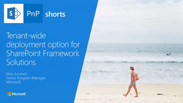

# <a name="tenant-scoped-solution-deployment-for-sharepoint-framework-solutions"></a>Развертывание решений SharePoint Framework на уровне клиента

Вы можете настроить компоненты SharePoint Framework так, чтобы они были доступны в клиенте сразу после установки пакета решения в каталоге приложений клиента. Это можно сделать с помощью атрибута **skipFeatureDeployment** в файле **package-solution.json**.

Если в решении включен этот атрибут, администратор клиента может сделать решение доступным во всех семействах веб-сайтов и на всех сайтах в клиенте сразу после установки пакета решения в каталоге приложений клиента. 

Развертывание на уровне клиента также демонстрируется в видео на [канале SharePoint PnP в YouTube](https://www.youtube.com/watch?v=pemHOZCSwZI).

<a href="https://www.youtube.com/watch?v=pemHOZCSwZI&list=PLR9nK3mnD-OXZbEvTEPxzIOMGXj_aZKJG">

</a>

> Обратите внимание, что для использования этой возможности необходимо обновить шаблон Yeoman для SharePoint Framework до последней версии. Вы можете обновить глобальную установку с помощью команды `npm install -g @microsoft/generator-sharepoint`. 

## <a name="solution-specific-requirements"></a>Специальные требования для решений

При использовании этот параметра игнорируются все определения платформы компонентов в решении SharePoint Framework. Если решение содержит определения платформы компонентов, например для создания настраиваемого списка, то не следует использовать этот специальный параметр решения.

* [Подготовка ресурсов SharePoint с пакетом решения](#)

> Обратите внимание, что решения, настроенные для автоматического развертывания на уровне клиента, не отображаются при добавлении приложения на уровне сайта. 

## <a name="configuring-solution-to-be-available-cross-tenant"></a>Настройка решения для доступности во всем клиенте

Шаблон Yeoman для SharePoint Framework задаст конкретный вопрос, связанный с этим вариантом развертывания. Это непосредственно повлияет на атрибут **skipFeatureDeployment** в файле **package-solution.json**. 


В приведенном ниже примере конфигурации для параметра **skipFeatureDeployment** задано значение true, указывающее, что решение можно централизованно развернуть на уровне клиента. 

```json
{
  "solution": {
    "name": "tenant-deploy-client-side-solution",
    "id": "dd4feca4-6f7e-47f1-a0e2-97de8890e3fa",
    "version": "1.0.0.0",
    "skipFeatureDeployment": true
  },
  "paths": {
    "zippedPackage": "solution/tenant-deploy-true.sppkg"
  }
}

```

### <a name="approving-tenant-wide-deployment-in-app-catalog"></a>Утверждение развертывания на уровне клиента в каталоге приложений

При развертывании решения, где для атрибута **skipFeatureDeployment** задано значение **true**, в каталоге приложений администратор может настроить решение на централизованное развертывание на уровне клиента.

По умолчанию флажок **Сделать это решение доступным всем сайтам в организации** снят. Если администратор установит этот флажок, компоненты решения будут автоматически видны и доступны на уровне клиента. 


Обратите внимание, что специальные действия по обновлению решений и сайтов доступны только при использовании платформы компонентов, поэтому не существует специального варианта обновления для централизованно развернутых решений. Вы можете просто обновить ресурс такого решения в сети CDN и пакет в каталоге приложений. При этом все существующие экземпляры компонентов будут автоматически обновлены для использования последних версий ресурсов компонентов, таких как файлы JavaScript и обновленные CSS-файлы.

## <a name="client-side-web-part-visibility-in-sharepoint-sites"></a>Видимость клиентских веб-частей на сайтах SharePoint

Веб-части, включенные в централизованно развернутые решения, будут автоматически видны в средстве выбора веб-частей как на классических, так и на современных страницах. 

## <a name="impact-of-skipfeaturedeployment-setting-with-extensions"></a>Влияние параметра skipFeatureDeployment на расширения

Расширения SharePoint Framework будут сразу доступны для использования на сайтах SharePoint. Это означает, что их можно связывать для использования со свойствами **ClientSideComponentId** в определенных элементах SharePoint, таких как *поля* и *пользовательские дополнительные действия*. 

