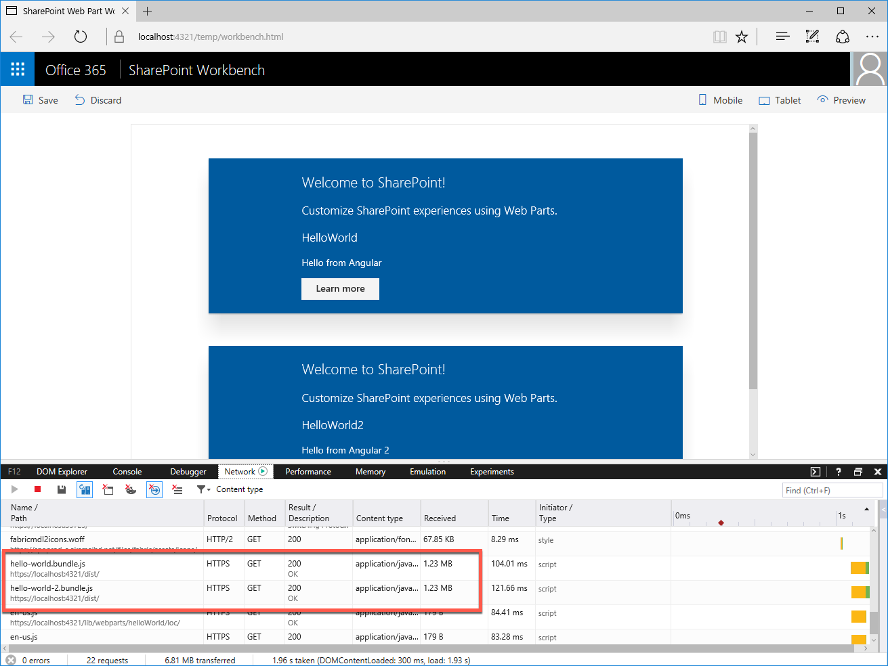
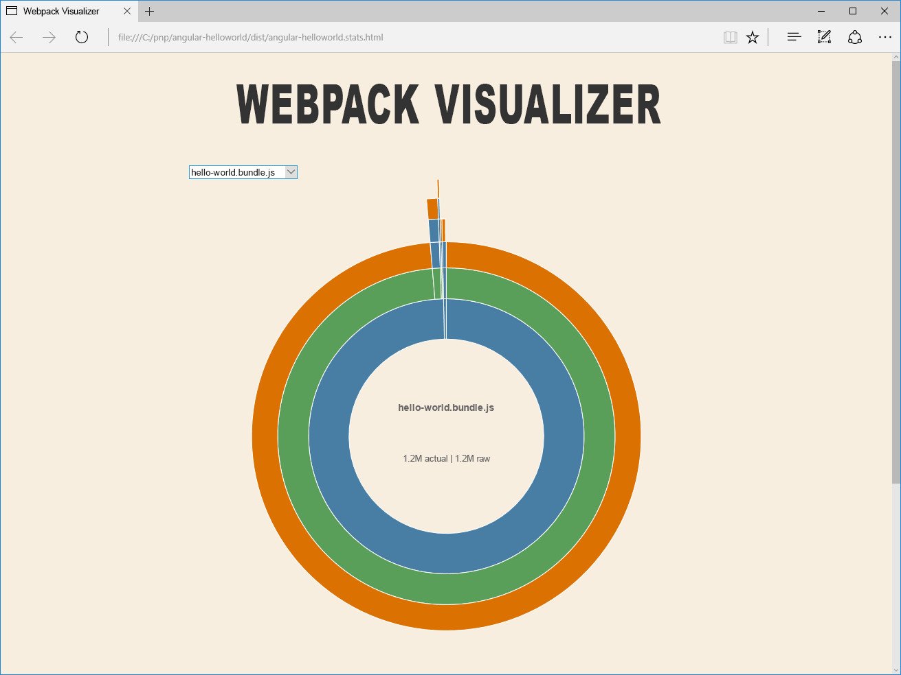
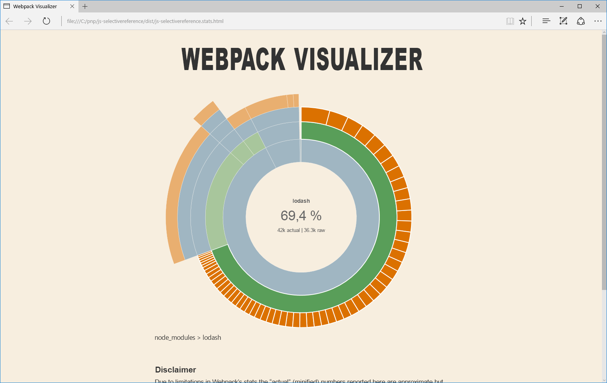

# <a name="optimize-builds-for-production"></a>Оптимизация сборок для рабочей среды

При развертывании решений SharePoint Framework в рабочей среде следует всегда использовать сборку выпуска проекта, оптимизированную для максимальной производительности. В этой статье иллюстрируются основные отличия между сборками для отладки и выпуска, а также показано, как оптимизировать пакет для использования в рабочих средах.

## <a name="use-release-builds-in-production"></a>Используйте сборки выпуска в рабочей среде

При сборке проекта SharePoint Framework вы можете выбрать режим отладки или выпуска. По умолчанию проекты SharePoint Framework собираются в режиме отладки, что упрощает отладку кода. Но когда код готов и работает надлежащим образом, необходимо собрать его для выпуска, чтобы оптимизировать приложение для выполнения в рабочей среде.

> Дополнительные сведения о сборке проекта в режиме выпуска см. в статье [Цепочка инструментов SharePoint Framework](./sharepoint-framework-toolchain).

Основное отличие между результатами сборки в режимах отладки и выпуска состоит в том, что размер пакета для выпуска значительно меньше, чем у аналогичного пакета для отладки. Чтобы увидеть разницу, сравните размеры проектов SharePoint Framework, собранных для отладки и выпуска, в веб-части на платформе Angular.


Версия пакета для отладки занимает 1255 КБ, а аналогичный пакет для выпуска — всего 177 КБ. Разница в размере между пакетами для отладки и выпуска зависит от того, какие библиотеки используются в проекте. Однако сборка для выпуска всегда будет значительно меньше сборки для отладки, поэтому в рабочей среде следует всегда развертывать сборки для выпуска.

## <a name="dont-include-third-party-libraries-in-the-bundle"></a>Не включайте в пакет сторонние библиотеки

При сборке решений SharePoint Framework можно использовать множество готовых библиотек JavaScript для решения распространенных задач. Использование готовых библиотек повышает эффективность работы и позволяет сосредоточиться на том, какую ценность представляет решение для организации, а не разработке стандартных функций, необходимых решению.

По умолчанию, ссылаясь на сторонние библиотеки в проекте, SharePoint Framework включает их в создаваемый пакет. В результате пользователям решения приходится скачивать одну и ту же библиотеку несколько раз (с каждым компонентом). Общий размер страницы значительно возрастет. Это повышает время загрузки и создает неудобства в работе пользователей, особенно в медленных сетях.



При работе со сторонними библиотеками следует всегда рассматривать возможность их отправки во внешнее расположение: общедоступную сеть CDN или хранилище, принадлежащее вашей организации. Во-первых, это позволяет исключить библиотеку из пакета, значительно снижая его размер. Кроме того, если хранилище, из которого загружается библиотека, оптимизировано для обслуживания статических ресурсов, то пользователям, работающим с вашим решением, придется скачать библиотеку только один раз. При последующих запросах или даже при дальнейшем использовании решения веб-браузер будет использовать ранее кэшированную копию библиотеки, а не скачивать ее заново. Таким образом, страница с решением будет загружаться значительно быстрее.

## <a name="verify-the-contents-of-your-bundle"></a>Проверка содержимого пакета

При сборке проекта в режиме отладки SharePoint Framework предоставляет диаграмму [Webpack Visualizer](https://chrisbateman.github.io/webpack-visualizer/), на которой показаны различные сценарии, включенные в создаваемый пакет. Вы можете найти эту диаграмму в файле **./dist/[solution-name].stats.html**.



Диаграмма Webpack Visualizer помогает убедиться, что созданный пакет не содержит лишних сценариев, и проверить, как включенные сценарии влияют на общий размер пакета. Помните, что отображаемый размер относится к сборке для отладки, а пакет для выпуска будет значительно меньше.

Более подробные сведения, используемые для создания диаграммы, включены в файл **./dist/[solution-name].stats.json**. С помощью этого файла вы можете узнать, почему тот или иной сценарий был включен в пакет и используется ли он в нескольких пакетах. Эти сведения помогут вам оптимизировать пакеты, ускоряя загрузку решения.

## <a name="choose-your-primary-client-side-library"></a>Выбор основной клиентской библиотеки

Если на одной или нескольких страницах портала находится несколько компонентов, использующих одну и ту же библиотеку, загруженную с одного URL-адреса, веб-браузер также будет повторно использовать ранее кэшированную копию, что ускорит загрузку портала. Именно по этой причине важно рационализировать использование библиотек, указав нужные библиотеки для конкретных версий, а также источники, из которых они загружаются. Это относится не только к конкретному проекту, но и ко всей организации. Такая политика поможет пользователям, работающим в различных приложениях, работать эффективнее за счет ускоренной загрузки приложений. Повторное использование ранее загруженных ресурсов также позволяет ограничить нагрузку на сеть, освобождая пропускную способность для других целей.

> Дополнительные сведения о работе с внешними библиотеками см. в статье [Использование существующих библиотек JavaScript в клиентских веб-частях SharePoint Frameworks](../webparts/guidance/use-existing-javascript-libraries).

## <a name="reference-only-the-necessary-components"></a>Ссылайтесь только на необходимые компоненты

Иногда при работе с внешней библиотекой может быть необходима лишь небольшая ее часть. Включив всю библиотеку, вы увеличите размер пакета, замедлив его загрузку. Вместо этого следует всегда рассматривать возможность загрузки отдельных частей той или иной библиотеки.

В качестве примера возьмем библиотеку [Lodash](https://lodash.com). Lodash — это коллекция служебных программ, помогающих выполнять определенные операции в коде. Высока вероятность того, что при работе с Lodash вам потребуется лишь несколько отдельных методов, а не вся библиотека. Можно также сослаться на всю библиотеку с помощью следующего кода:

```ts
import * as _ from 'lodash';
```

В этом случае к размеру неоптимизированного пакета прибавится 533 КБ.



Можно сослаться на конкретный метод Lodash с помощью следующего кода:

```ts
const at: any = require('lodash/at');
```

В этом случае к размеру неоптимизированного пакета добавится лишь 42 КБ.


В случае библиотеки Lodash, как и с некоторыми другими библиотеками, у ссылок на отдельные методы есть свои недостатки. В настоящее время библиотека Lodash не поддерживает загрузку конкретных методов в проектах SharePoint Framework с помощью нотации **import**. Вместо этого необходимо использовать оператор **require**, не предоставляющий таких же возможностей по обеспечению безопасности типов, как оператор **import**. Рано или поздно вам придется решить, стоит ли загружать большое количество кода, чтобы сохранить возможности по обеспечению безопасности типов.

> Некоторые из методов Lodash включены в библиотеку **@microsoft/sp-lodash-subset**, входящую в состав SharePoint Framework. Прежде чем использовать Lodash, проверьте, нет ли нужного вам метода в библиотеке **@microsoft/sp-lodash-subset**. Она уже входит в состав SharePoint Framework, поэтому ее не требуется включать в пакет решения.