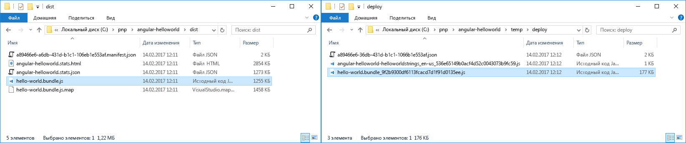
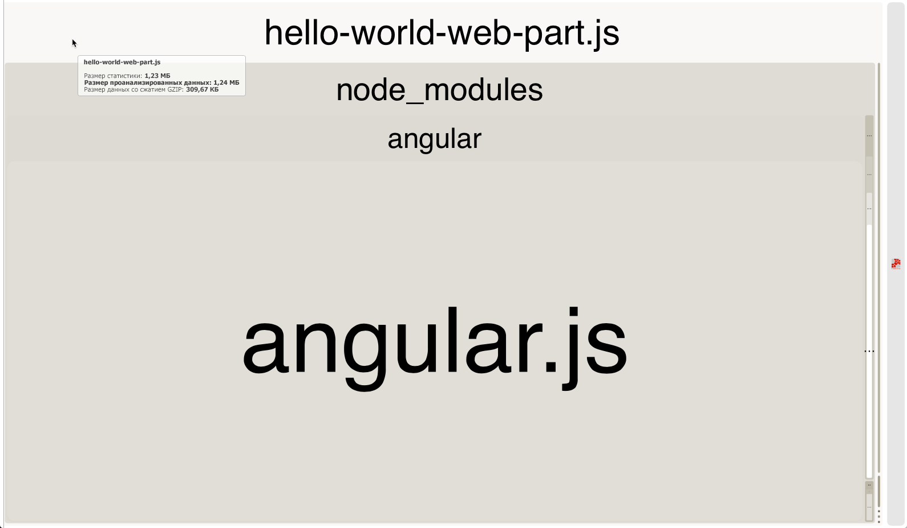
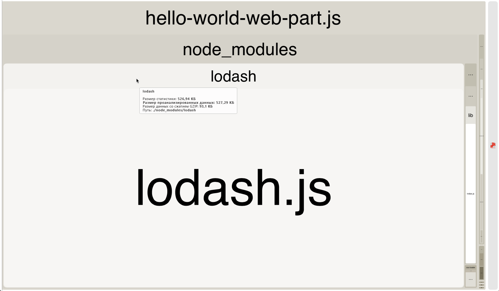
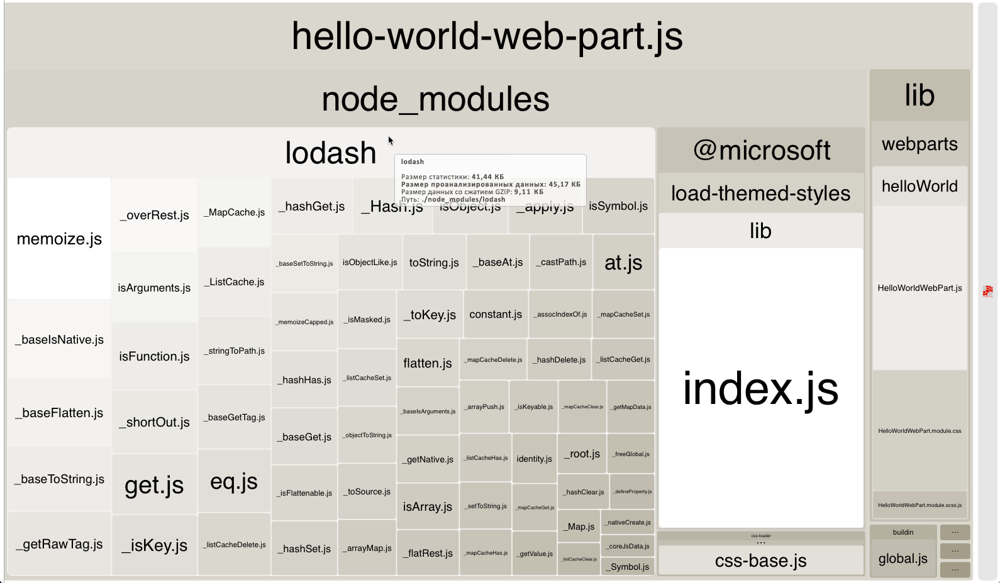

# <a name="optimize-builds-for-production"></a><span data-ttu-id="71a8b-102">Оптимизация сборок для рабочей среды</span><span class="sxs-lookup"><span data-stu-id="71a8b-102">Optimize builds for production</span></span>

<span data-ttu-id="71a8b-p101">При развертывании решений SharePoint Framework в рабочей среде следует всегда использовать сборку выпуска проекта, оптимизированную для максимальной производительности. В этой статье иллюстрируются основные отличия между сборками для отладки и выпуска, а также показано, как оптимизировать пакет для использования в рабочих средах.</span><span class="sxs-lookup"><span data-stu-id="71a8b-p101">When deploying SharePoint Framework solutions to production you should always use a release build of your project which is optimized for performance. This article illustrates the main differences between debug and release builds and shows how you can optimize your bundle for use in production environments.</span></span>

## <a name="use-release-builds-in-production"></a><span data-ttu-id="71a8b-105">Используйте сборки выпуска в рабочей среде</span><span class="sxs-lookup"><span data-stu-id="71a8b-105">Use release builds in production</span></span>

<span data-ttu-id="71a8b-p102">При сборке проекта SharePoint Framework вы можете выбрать режим отладки или выпуска. По умолчанию проекты SharePoint Framework собираются в режиме отладки, что упрощает отладку кода. Но когда код готов и работает надлежащим образом, необходимо собрать его для выпуска, чтобы оптимизировать приложение для выполнения в рабочей среде.</span><span class="sxs-lookup"><span data-stu-id="71a8b-p102">When building a SharePoint Framework project, you can choose whether you want to build it in a debug or release mode. By default, SharePoint Framework projects are built in debug mode, which makes it easier for you to debug code. But when your code is finished and is working as expected, you should build it in release mode to optimize it for running in the production environment.</span></span>

> <span data-ttu-id="71a8b-109">Дополнительные сведения о сборке проекта в режиме выпуска см. в статье [Цепочка инструментов SharePoint Framework](./sharepoint-framework-toolchain.md).</span><span class="sxs-lookup"><span data-stu-id="71a8b-109">For more information about building your project in release mode, see the [SharePoint Framework Toolchain](./sharepoint-framework-toolchain.md) article.</span></span>

<span data-ttu-id="71a8b-p103">Основное отличие между результатами сборки в режимах отладки и выпуска состоит в том, что размер пакета для выпуска значительно меньше, чем у аналогичного пакета для отладки. Чтобы увидеть разницу, сравните размеры проектов SharePoint Framework, собранных для отладки и выпуска, в веб-части на платформе Angular.</span><span class="sxs-lookup"><span data-stu-id="71a8b-p103">The main difference between the output of a debug and release build is, that the release version of the generated bundle is minified and significantly smaller in size than its debug equivalent. To illustrate the difference, compare the size of the debug and release version of a SharePoint Framework project with a web part using Angular.</span></span>



<span data-ttu-id="71a8b-p104">Версия пакета для отладки занимает 1255 КБ, а аналогичный пакет для выпуска — всего 177 КБ. Разница в размере между пакетами для отладки и выпуска зависит от того, какие библиотеки используются в проекте. Однако сборка для выпуска всегда будет значительно меньше сборки для отладки, поэтому в рабочей среде следует всегда развертывать сборки для выпуска.</span><span class="sxs-lookup"><span data-stu-id="71a8b-p104">The debug version of the bundle is 1255 KB while its release equivalent is only 177 KB. The difference in size between the debug and release version of the generated bundle will differ depending on the libraries used in your project. Still, the release build will always be significantly smaller than a debug build, which is why you should always deploy the output of release builds to production.</span></span>

## <a name="dont-include-third-party-libraries-in-the-bundle"></a><span data-ttu-id="71a8b-116">Не включайте в пакет сторонние библиотеки</span><span class="sxs-lookup"><span data-stu-id="71a8b-116">Don't include third party libraries in the bundle</span></span>

<span data-ttu-id="71a8b-p105">При сборке решений SharePoint Framework можно использовать множество готовых библиотек JavaScript для решения распространенных задач. Использование готовых библиотек повышает эффективность работы и позволяет сосредоточиться на том, какую ценность представляет решение для организации, а не разработке стандартных функций, необходимых решению.</span><span class="sxs-lookup"><span data-stu-id="71a8b-p105">When building SharePoint Framework solutions, you can benefit of many existing JavaScript libraries to solve common problems. Using existing libraries allows you to be more productive and lets you focus on the added value for your organization, instead of on developing generic functionality, required by your solution.</span></span>

<span data-ttu-id="71a8b-p106">По умолчанию, ссылаясь на сторонние библиотеки в проекте, SharePoint Framework включает их в создаваемый пакет. В результате пользователям решения приходится скачивать одну и ту же библиотеку несколько раз (с каждым компонентом). Общий размер страницы значительно возрастет. Это повышает время загрузки и создает неудобства в работе пользователей, особенно в медленных сетях.</span><span class="sxs-lookup"><span data-stu-id="71a8b-p106">By default, when referencing third party libraries in your project, SharePoint Framework will include them in the generated bundle. As a result, users working with your solution, would end up downloading the same library multiple times - once with each component. The total page size would grow significantly taking longer to load and leading to a poor user experience, particularly on slower networks.</span></span>


<span data-ttu-id="71a8b-p107">При работе со сторонними библиотеками следует всегда рассматривать возможность их отправки во внешнее расположение: общедоступную сеть CDN или хранилище, принадлежащее вашей организации. Во-первых, это позволяет исключить библиотеку из пакета, значительно снижая его размер. Кроме того, если хранилище, из которого загружается библиотека, оптимизировано для обслуживания статических ресурсов, то пользователям, работающим с вашим решением, придется скачать библиотеку только один раз. При последующих запросах или даже при дальнейшем использовании решения веб-браузер будет использовать ранее кэшированную копию библиотеки, а не скачивать ее заново. Таким образом, страница с решением будет загружаться значительно быстрее.</span><span class="sxs-lookup"><span data-stu-id="71a8b-p107">When working with third party libraries, you should always consider loading them from an external location: either a public CDN or a hosting location owned by your organization. First of all, this allows you to exclude the library from your bundle, significantly decreasing its size. Additionally, if the hosting location from which you are loading the library is optimized for serving static assets, users working with your solution will need to load the library only once. On subsequent requests, or even when using your solution in the future, the web browser will reuse the previously cached copy of the library rather than downloading it again. As a result, the page with your solution will load significantly faster.</span></span>

## <a name="verify-the-contents-of-your-bundle"></a><span data-ttu-id="71a8b-128">Проверка содержимого пакета</span><span class="sxs-lookup"><span data-stu-id="71a8b-128">Verify the contents of your bundle</span></span>

<span data-ttu-id="71a8b-129">Чтобы оценить объем созданных пакетов, можно развернуть конфигурацию веб-пакета в проекте или запустить в SharePoint Framework формирование статистики пакета.</span><span class="sxs-lookup"><span data-stu-id="71a8b-129">To better understand the size of the generated bundles, you can extend the webpack configuration in your project and have the SharePoint Framework generate bundle statistics.</span></span>

<span data-ttu-id="71a8b-130">Сначала установите пакет **webpack-bundle-analyzer** в проекте, выполнив в командной строке следующее:</span><span class="sxs-lookup"><span data-stu-id="71a8b-130">First, install the **webpack-bundle-analyzer** package in your project, by executing in the command line:</span></span>

```sh
npm install webpack-bundle-analyzer --save-dev
```

<span data-ttu-id="71a8b-131">Затем измените содержимое файла **gulpfile.js** в проекте таким образом:</span><span class="sxs-lookup"><span data-stu-id="71a8b-131">Next, change the contents of the **gulpfile.js** file in your project to:</span></span>

```js
'use strict';

const gulp = require('gulp');
const path = require('path');
const build = require('@microsoft/sp-build-web');
const bundleAnalyzer = require('webpack-bundle-analyzer');

build.configureWebpack.mergeConfig({
  additionalConfiguration: (generatedConfiguration) => {
    const lastDirName = path.basename(__dirname);
    const dropPath = path.join(__dirname, 'temp', 'stats');
    generatedConfiguration.plugins.push(new bundleAnalyzer.BundleAnalyzerPlugin({
      openAnalyzer: false,
      analyzerMode: 'static',
      reportFilename: path.join(dropPath, `${lastDirName}.stats.html`),
      generateStatsFile: true,
      statsFilename: path.join(dropPath, `${lastDirName}.stats.json`),
      logLevel: 'error'
    }));

    return generatedConfiguration;
  }
});

build.initialize(gulp);
```

<span data-ttu-id="71a8b-132">В следующий раз, создавая пакет проекта с помощью задачи `gulp bundle`, вы увидите файлы статистики пакета, сгенерированные в папке **temp/stats** в проекте.</span><span class="sxs-lookup"><span data-stu-id="71a8b-132">Next time you bundle your project using the `gulp bundle` task, you will see the bundle stats files generated in the **temp/stats** folder in your project.</span></span> <span data-ttu-id="71a8b-133">Один из этих файлов статистики представляет собой диаграмму "дерево", которая отображает разные сценарии, включенные в сгенерированный пакет.</span><span class="sxs-lookup"><span data-stu-id="71a8b-133">One of the generated stats file, is a treemap showing the different scripts included in the generated bundle.</span></span> <span data-ttu-id="71a8b-134">Вы можете найти эту визуализацию в файле **./temp/stats/[solution-name].stats.html**.</span><span class="sxs-lookup"><span data-stu-id="71a8b-134">You can find this visualization in the **./temp/stats/[solution-name].stats.html** file.</span></span>



<span data-ttu-id="71a8b-136">Диаграмма "дерево" с анализом веб-пакета помогает убедиться, что созданный пакет не содержит лишних сценариев, и проверить, как включенные сценарии влияют на общий размер пакета.</span><span class="sxs-lookup"><span data-stu-id="71a8b-136">Using the Webpack Visualizer chart is a convenient way for you to verify, that the generated bundle doesn't contain any unnecessary scripts and how the included scripts affect the total bundle size. Keep in mind, that the displayed size reflects the debug build and would be significantly smaller for a release build.</span></span> <span data-ttu-id="71a8b-137">Помните, что отображаемый размер относится к сборке для отладки, а сборка для выпуска будет значительно меньше.</span><span class="sxs-lookup"><span data-stu-id="71a8b-137">Keep in mind, that the displayed size reflects the debug build and would be significantly smaller for a release build.</span></span>

<span data-ttu-id="71a8b-138">Более подробные сведения, используемые для создания визуализации, включены в файл **./dist/[solution-name].stats.json**.</span><span class="sxs-lookup"><span data-stu-id="71a8b-138">More detailed information, used to generate the visualization, is included in the **./dist/[solution-name].stats.json** file.</span></span> <span data-ttu-id="71a8b-139">С помощью этого файла вы можете узнать, почему тот или иной сценарий был включен в пакет и используется ли он в нескольких пакетах.</span><span class="sxs-lookup"><span data-stu-id="71a8b-139">More detailed information, used to generate the chart, is included in the ./dist/[solution-name].stats.json file. Using this file you can find out why a specific script has been included in the bundle or if a particular script is used in multiple bundles. With this information you can optimize your bundles improving the loading time of your solution.</span></span> <span data-ttu-id="71a8b-140">Эти сведения помогут вам оптимизировать пакеты, ускоряя загрузку решения.</span><span class="sxs-lookup"><span data-stu-id="71a8b-140">With this information you can optimize your bundles improving the loading time of your solution.</span></span>

## <a name="choose-your-primary-client-side-library"></a><span data-ttu-id="71a8b-141">Выбор основной клиентской библиотеки</span><span class="sxs-lookup"><span data-stu-id="71a8b-141">Choose your primary client-side library</span></span>

<span data-ttu-id="71a8b-p111">Если на одной или нескольких страницах портала находится несколько компонентов, использующих одну и ту же библиотеку, загруженную с одного URL-адреса, веб-браузер также будет повторно использовать ранее кэшированную копию, что ускорит загрузку портала. Именно по этой причине важно рационализировать использование библиотек, указав нужные библиотеки для конкретных версий, а также источники, из которых они загружаются. Это относится не только к конкретному проекту, но и ко всей организации. Такая политика поможет пользователям, работающим в различных приложениях, работать эффективнее за счет ускоренной загрузки приложений. Повторное использование ранее загруженных ресурсов также позволяет ограничить нагрузку на сеть, освобождая пропускную способность для других целей.</span><span class="sxs-lookup"><span data-stu-id="71a8b-p111">If there are multiple components on the same page, or even on different pages across the portal, and they all use the same library loaded from the same URL, the web browser will also reuse the copy it cached previously, which will lead to the portal loading faster. This is exactly why it is essential for organizations to rationalize which libraries and in which versions they use and where they load them from, not only for a specific project but for the whole organization. Such policy will let users working with the different applications be more productive by loading the applications faster. By reusing the previously downloaded assets, it will also limit the load on the network freeing its bandwidth for other purposes.</span></span>

> <span data-ttu-id="71a8b-146">Дополнительные сведения о работе с внешними библиотеками см. в статье [Использование существующих библиотек JavaScript в клиентских веб-частях SharePoint Frameworks](../web-parts/guidance/use-existing-javascript-libraries.md).</span><span class="sxs-lookup"><span data-stu-id="71a8b-146">For more information about working with external libraries see the [Use existing JavaScript libraries in SharePoint Framework client-side web parts](../web-parts/guidance/use-existing-javascript-libraries.md) article.</span></span>

## <a name="reference-only-the-necessary-components"></a><span data-ttu-id="71a8b-147">Ссылайтесь только на необходимые компоненты</span><span class="sxs-lookup"><span data-stu-id="71a8b-147">Reference only the necessary components</span></span>

<span data-ttu-id="71a8b-p112">Иногда при работе с внешней библиотекой может быть необходима лишь небольшая ее часть. Включив всю библиотеку, вы увеличите размер пакета, замедлив его загрузку. Вместо этого следует всегда рассматривать возможность загрузки отдельных частей той или иной библиотеки.</span><span class="sxs-lookup"><span data-stu-id="71a8b-p112">Sometimes, when working with external libraries, you might actually not need the whole library but only a small portion of it. Including the whole library will unnecessary add to the size of your bundle increasing its load time. Instead, you should always consider loading only the specific parts of the particular library that you actually need.</span></span>

<span data-ttu-id="71a8b-151">В качестве примера возьмем библиотеку [Lodash](https://lodash.com).</span><span class="sxs-lookup"><span data-stu-id="71a8b-151">To illustrate this, take the [Lodash](https://lodash.com) library as an example.</span></span> <span data-ttu-id="71a8b-152">Lodash — это коллекция служебных программ, помогающих выполнять определенные операции в коде.</span><span class="sxs-lookup"><span data-stu-id="71a8b-152">Lodash is a collection of utilities helping you to perform certain operations in your code.</span></span> <span data-ttu-id="71a8b-153">Высока вероятность того, что при работе с Lodash вам потребуется лишь несколько отдельных методов, а не вся библиотека.</span><span class="sxs-lookup"><span data-stu-id="71a8b-153">The odds are high, that when working with Lodash, you will only need a few specific methods rather than the complete library.</span></span> <span data-ttu-id="71a8b-154">Можно также сослаться на всю библиотеку с помощью следующего кода:</span><span class="sxs-lookup"><span data-stu-id="71a8b-154">If you however referenced the whole library using the following code:</span></span>

```ts
import * as _ from 'lodash';
```

<span data-ttu-id="71a8b-155">В этом случае к размеру неоптимизированного пакета прибавится 527 КБ.</span><span class="sxs-lookup"><span data-stu-id="71a8b-155">It would add 42 KB to your unoptimized bundle.</span></span>



<span data-ttu-id="71a8b-157">Можно сослаться на конкретный метод Lodash с помощью следующего кода:</span><span class="sxs-lookup"><span data-stu-id="71a8b-157">Instead, if you referenced only the specific Lodash method using the following code:</span></span>

```ts
const at: any = require('lodash/at');
```

<span data-ttu-id="71a8b-158">В этом случае к размеру неоптимизированного пакета прибавится 45 КБ.</span><span class="sxs-lookup"><span data-stu-id="71a8b-158">It would add 42 KB to your unoptimized bundle.</span></span>



<span data-ttu-id="71a8b-160">В случае библиотеки Lodash, как и с некоторыми другими библиотеками, у ссылок на отдельные методы есть свои недостатки.</span><span class="sxs-lookup"><span data-stu-id="71a8b-160">Specifically with regards to Lodash, but which could also be the case with other libraries, referencing specific methods instead of the whole library comes with a price.</span></span> <span data-ttu-id="71a8b-161">В настоящее время библиотека Lodash не поддерживает загрузку конкретных методов в проектах SharePoint Framework с помощью нотации **import**.</span><span class="sxs-lookup"><span data-stu-id="71a8b-161">Currently, Lodash doesn't support loading specific methods inside of SharePoint Framework projects using the **import** notation.</span></span> <span data-ttu-id="71a8b-162">Вместо этого необходимо использовать оператор **require**, не предоставляющий таких же возможностей по обеспечению безопасности типов, как оператор **import**.</span><span class="sxs-lookup"><span data-stu-id="71a8b-162">Instead, you have to use a **require** statement which doesn't offer you the typesafety capabilities that using the **import** statement does.</span></span> <span data-ttu-id="71a8b-163">Рано или поздно вам придется решить, стоит ли дополнительно загружать большое количество кода, чтобы сохранить возможности по обеспечению безопасности типов.</span><span class="sxs-lookup"><span data-stu-id="71a8b-163">Eventually it is up to you to decide if loading significantly more code into your bundles is worth preserving the typesafety capabilities.</span></span>

> <span data-ttu-id="71a8b-164">Некоторые из методов Lodash включены в библиотеку **@microsoft/sp-lodash-subset**, входящую в состав SharePoint Framework.</span><span class="sxs-lookup"><span data-stu-id="71a8b-164">Some of the Lodash methods are provided with the SharePoint Framework in the **@microsoft/sp-lodash-subset** library.</span></span> <span data-ttu-id="71a8b-165">Прежде чем использовать Lodash, проверьте, нет ли нужного вам метода в библиотеке **@microsoft/sp-lodash-subset**. Она уже входит в состав SharePoint Framework, поэтому ее не требуется включать в пакет решения.</span><span class="sxs-lookup"><span data-stu-id="71a8b-165">Some of the Lodash methods are provided with the SharePoint Framework in the @microsoft/sp-lodash-subset library. Before using Lodash, verify if the method that you want to use isn't already available in the **@microsoft/sp-lodash-subset** library, which is already available as a part of the SharePoint Framework and does not need to be included in your bundle.</span></span>
