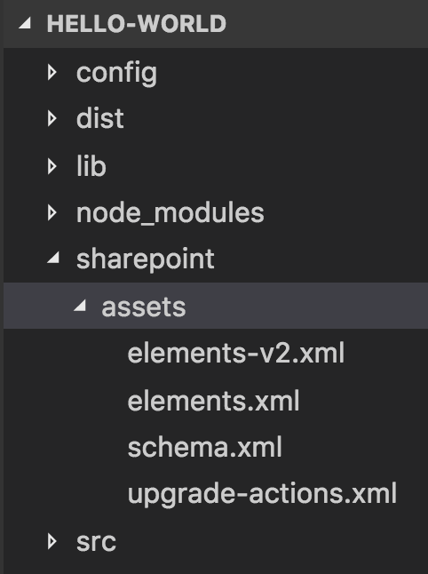

# <a name="provision-sharepoint-assets-with-your-solution-package"></a>Подготовка ресурсов SharePoint с пакетом решения

Иногда требуется подготовить список или библиотеку документов SharePoint вместе с пакетом клиентского решения, чтобы они были доступны клиентским компонентам, таким как веб-части. Цепочка инструментов SharePoint Framework позволяет упаковывать и развертывать элементы SharePoint с пакетом клиентского решения. Подготовка этих элементов затем выполняется при установке клиентского решения на сайте. 

Узнать больше о возможностях подготовки ресурсов можно из веб-трансляции на [канале SharePoint PnP в YouTube](https://www.youtube.com/watch?v=r-UdJhhHlEQ&list=PLR9nK3mnD-OUnJytlXlO84fQnYt50iTmS). 

<a href="https://www.youtube.com/watch?v=r-UdJhhHlEQ&list=PLR9nK3mnD-OUnJytlXlO84fQnYt50iTmS">

</a>


## <a name="provision-items-using-javascript-code"></a>Подготовка элементов с помощью кода JavaScript

Хотя элементы SharePoint можно создавать в компоненте (например, веб-части) с помощью кода JavaScript, эта возможность ограничена контекстом текущего пользователя компонента. Если у пользователя нет разрешений на создание или изменение элементов SharePoint, код JavaScript не подготовит эти элементы. В таких случаях для подготовки в контексте c повышенными привилегиями элементы SharePoint необходимо упаковать и развернуть с пакетом решения.

## <a name="provision-sharepoint-items-in-your-solution"></a>Подготовка элементов SharePoint в решении

С клиентским пакетом решения можно подготовить к работе следующие ресурсы SharePoint:

* поля;
* типы контента;
* экземпляры списков;
* экземпляры списков со специальной схемой.

### <a name="fields"></a>Поля

Поле (столбец сайта) представляет атрибут, или фрагмент метаданных, который пользователь применяет в управлении списком или типом контента, к которому добавил этот столбец. Это определение столбца, или шаблон, которое вы можете назначить нескольким спискам для нескольких сайтов SharePoint. Столбцы сайтов избавляют от лишней работы и помогают обеспечить согласованность метаданных на сайтах и в списках. 

Допустим, вы определили столбец сайта под названием "Клиент". Пользователи могут добавлять этот столбец к своим спискам и ссылаться на него в своих типах контента. Это гарантирует, что у столбца всегда будут одни и те же атрибуты (хотя бы вначале), где бы он ни находился.

Определяя новое поле в своем решении, вы можете сверяться со схемой и атрибутами из статьи [Элемент Field (поле)](https://msdn.microsoft.com/en-us/library/aa979575(v=office.15).aspx). 

Ниже приведен пример нового поля DateTime.

```xml
<Field ID="{1511BF28-A787-4061-B2E1-71F64CC93FD5}"
            Name="DateOpened"
            DisplayName="Date Opened"
            Type="DateTime"
            Format="DateOnly"
            Required="FALSE"
            Group="Financial Columns">
        <Default>[today]</Default>
    </Field>
```

### <a name="content-types"></a>Типы контента

Тип контента — это многоразовая коллекция метаданных (столбцов), настроек поведения и других настроек для категории элементов в списке SharePoint или документов в библиотеке документов SharePoint. Типы контента позволяют централизованно управлять настройками для категории сведений.

Представьте себе, что у вас есть три типа документов: авансовые отчеты, заказы на поставку и счета-фактуры. Все три типа схожи тем, что представляют собой финансовые документы и содержат данные с денежными значениями. Однако каждый из них имеет собственные требования к данным, шаблон и рабочий процесс. 

Один из способов решения этой проблемы — создание четырех типов контента. Первый тип контента, "Финансовый документ", может включать требования к данным, общие для всех финансовых документов в организации. Остальные три — "Авансовый отчет", "Заказ на покупку" и "Счет-фактура" — могут наследовать общие элементы от типа "Финансовый документ". Кроме того, они могут определять отличительные особенности каждого типа, например особый набор метаданных, шаблон документа, используемый при создании элемента, и особую схему его обработки.

Определяя новый тип контента в решении, вы можете сверяться со схемой и атрибутами из статьи [Элемент ContentType (тип контента)](https://msdn.microsoft.com/ru-RU/library/aa544268.aspx). 

Ниже приведен пример типа контента.

```xml
<ContentType ID="0x010042D0C1C200A14B6887742B6344675C8B" 
    Name="Cost Center" 
    Group="Financial Content Types" 
    Description="Financial Content Type">
    <FieldRefs>
        <FieldRef ID="{1511BF28-A787-4061-B2E1-71F64CC93FD5}" />
        <FieldRef ID="{060E50AC-E9C1-4D3C-B1F9-DE0BCAC300F6}" /> 
    </FieldRefs>
</ContentType> 
```

### <a name="list-instances"></a>Экземпляры списков

Списки — это ключевая, базовая функция сайта SharePoint. Они помогают группам собирать и отслеживать информацию, а также делиться ею. Многие приложения используют списки, созданные на сайте, чтобы хранить данные для реализации своего поведения. Экземпляр списка — это предопределенный список SharePoint с известным идентификатором. Вы можете настраивать и добавлять элементы в этих списках, создавать дополнительные списки с помощью доступных шаблонов, а также создавать специальные списки, указывая только нужные параметры и столбцы.

В SharePoint доступно несколько шаблонов списков (например, для календаря, списка контактов или задач). С помощью этих шаблонов вы можете создавать экземпляры списков для своих веб-частей и других решений. Например, вы можете определить экземпляр списка "Финансовые документы" на основе шаблона "Библиотека документов", чтобы обеспечить хранение соответствующих документов для веб-части. 

Определяя новый экземпляр списка в решении, вы можете сверяться со схемой и атрибутами из статьи [Элемент ListInstance (экземпляр списка)](https://msdn.microsoft.com/ru-RU/library/office/ms476062.aspx).

Ниже приведен пример определения экземпляра списка.

```xml
<ListInstance 
    FeatureId="00bfea71-e717-4e80-aa17-d0c71b360101"
    Title="Finance Records" 
    Description="Finance documents"
    TemplateType="101"
    Url="Lists/FinanceRecords">
</ListInstance>
```

### <a name="list-instances-with-custom-schema"></a>экземпляры списков со специальной схемой.

Определять поля, типы контента и представления, используемые в экземпляре списка, можно с помощью специальной схемы. Ссылаться на специальную схему можно с помощью атрибута [CustomSchema](https://msdn.microsoft.com/ru-RU/library/office/ms476062.aspx#sectionSection0) в элементе ListInstance. 

Например, вы можете определить тип экземпляра списка **Финансовые документы** как **Финансовый документ**, который может включать требования к данным, общие для всех финансовых документов в организации. 

Ниже приведен пример экземпляра списка, для определения которого используется специальная схема.

```xml
<ListInstance 
    CustomSchema="schema.xml"
    FeatureId="00bfea71-de22-43b2-a848-c05709900100"
    Title="Cost Centers" 
    Description="Cost Centers"
    TemplateType="100"
    Url="Lists/CostCenters">
</ListInstance>
```

<br/>

А так выглядит специальная схема, которая определяет тип контента для определенного выше экземпляра списка:

```xml
<List xmlns:ows="Microsoft SharePoint" Title="Basic List" EnableContentTypes="TRUE" FolderCreation="FALSE" Direction="$Resources:Direction;" Url="Lists/Basic List" BaseType="0" xmlns="http://schemas.microsoft.com/sharepoint/">
  <MetaData>
    <ContentTypes>
      <ContentTypeRef ID="0x010042D0C1C200A14B6887742B6344675C8B" />
    </ContentTypes>
    <Fields></Fields>
    <Views>
      <View BaseViewID="1" Type="HTML" WebPartZoneID="Main" DisplayName="$Resources:core,objectiv_schema_mwsidcamlidC24;" DefaultView="TRUE" MobileView="TRUE" MobileDefaultView="TRUE" SetupPath="pages\viewpage.aspx" ImageUrl="/_layouts/images/generic.png" Url="AllItems.aspx">
        <XslLink Default="TRUE">main.xsl</XslLink>
        <JSLink>clienttemplates.js</JSLink>
        <RowLimit Paged="TRUE">30</RowLimit>
        <Toolbar Type="Standard" />
        <ViewFields>
          <FieldRef Name="LinkTitle"></FieldRef>
          <FieldRef Name="SPFxAmount"></FieldRef>
          <FieldRef Name="SPFxCostCenter"></FieldRef>
        </ViewFields>
        <Query>
          <OrderBy>
            <FieldRef Name="ID" />
          </OrderBy>
        </Query>
      </View>
    </Views>
    <Forms>
      <Form Type="DisplayForm" Url="DispForm.aspx" SetupPath="pages\form.aspx" WebPartZoneID="Main" />
      <Form Type="EditForm" Url="EditForm.aspx" SetupPath="pages\form.aspx" WebPartZoneID="Main" />
      <Form Type="NewForm" Url="NewForm.aspx" SetupPath="pages\form.aspx" WebPartZoneID="Main" />
    </Forms>
  </MetaData>
</List>
```

## <a name="create-sharepoint-items-in-your-solution"></a>Создание элементов SharePoint в решении

В пакете решения для подготовки и упаковки элементов SharePoint используются [компоненты SharePoint](https://msdn.microsoft.com/en-us/library/ee537350(office.14).aspx). Компонент — это контейнер, включающий один или несколько элементов SharePoint для подготовки. Компонент содержит файл Feature.xml и один или несколько файлов манифеста элементов. Эти XML-файлы также называют определениями компонентов. 

Как правило, пакет клиентского решения содержит один компонент. Этот компонент активируется при установке решения на сайте. Важно отметить, что администраторы сайтов устанавливают пакет решения, а не компонент. 

Как правило, при создании компонентов используются указанные ниже XML-файлы.

### <a name="element-manifest-file"></a>Файл манифеста элементов

Файл манифеста элементов содержит определения элементов SharePoint и выполняется при активации компонента. Например, в манифесте элементов могут находиться XML-определения для создания поля, типа контента или экземпляра списка. 

Ниже приведен пример файла манифеста элемента, который определяет новое поле DateTime.

```xml
<?xml version="1.0" encoding="utf-8"?>
<Elements xmlns="http://schemas.microsoft.com/sharepoint/">
    <Field ID="{1511BF28-A787-4061-B2E1-71F64CC93FD5}"
            Name="DateOpened"
            DisplayName="Date Opened"
            Type="DateTime"
            Format="DateOnly"
            Required="FALSE"
            Group="Financial Columns">
        <Default>[today]</Default>
    </Field>
  </Elements>
```

### <a name="element-file"></a>Файл элемента

Файлы элементов — это все поддерживаемые файлы, сопровождающие манифест элемента. Например, схема экземпляра списка — это файл элемента, связанный с экземпляром списка, определенным в манифесте элемента. 

Ниже приведен пример специальной схемы экземпляра списка.

```xml
<List xmlns:ows="Microsoft SharePoint" Title="Basic List" EnableContentTypes="TRUE" FolderCreation="FALSE"
      Direction="$Resources:Direction;" Url="Lists/Basic List" BaseType="0" xmlns="http://schemas.microsoft.com/sharepoint/">
  <MetaData>
    <ContentTypes>
      <ContentTypeRef ID="0x010042D0C1C200A14B6887742B6344675C8B" />
    </ContentTypes>    
  </MetaData>
</List>
```

### <a name="upgrade-actions-file"></a>Файл с действиями по обновлению

Как понятно из названия, этот файл указывает действия, выполняемые при обновлении решения на сайте. Такое действие может сопровождаться одним или несколькими манифестами элементов. Например, если обновление предусматривает добавление нового поля, то определение этого поля доступно в виде манифеста элемента и сопоставлено в файле с действиями по обновлению. 

Ниже приведен пример файла с действиями по обновлению, который применяет файл манифеста элемента во время обновления.

```xml
<ApplyElementManifests>
      <ElementManifest Location="9c0be970-a4d7-41bb-be21-4a683586db18\elements-v2.xml" />
</ApplyElementManifests>
```

## <a name="configure-the-sharepoint-feature"></a>Настройка компонента SharePoint 

Чтобы включить XML-файлы, необходимо сначала определить конфигурацию компонента в файле конфигурации *package-solution.json*, находящемся в папке *config* проекта. Файл *package-solution.json* содержит ключевые метаданные для пакета клиентского решения, и на него можно ссылаться при выполнении задачи gulp `package-solution`, которая упаковывает решение в файл `.sppkg`. 

```json
{
  "solution": {
    "name": "hello-world-client-side-solution",
    "id": "26364618-3056-4b45-98c1-39450adc5723",
    "version": "1.1.0.0",
    "features": [{
      "title": "hello-world-client-side-solution",
      "description": "hello-world-client-side-solution",
      "id": "d46cd9d6-87fc-473b-a4c0-db9ad9162b64",
      "version": "1.1.0.0",
      "assets": {        
        "elementManifests": [
          "elements.xml"
        ],
        "elementFiles":[
          "schema.xml"
        ],
        "upgradeActions":[
            "upgrade-actions-v1.xml"
        ]
      }
    }]
  },  
  "paths": {
    "zippedPackage": "solution/hello-world.sppkg"
  }
}
``` 

<br/>

Объект JSON `features` содержит метаданные для компонента, как показано в приведенной ниже таблице.

Свойство | Описание 
-----|------
id|Уникальный идентификатор (GUID) компонента
title|Название компонента
description| Описание компонента
assets|Массив XML-файлов, используемых в компоненте
elementManifests|Определяется в свойстве `assets`, массив файлов манифеста элемента
elementFiles|Определяется в свойстве `assets`, массив файлов элемента
upgradeActions|Определяется в свойстве `assets`, массив файлов с действиями по обновлению

### <a name="create-the-feature-xml-files"></a>Создание XML-файлов компонента

Цепочка инструментов ищет XML-файлы, определенные в конфигурации в специальной папке проекта клиентского решения — *sharepoint\assets*. 



Конфигурация, определенная в файле `package-solution.json`, сопоставляет XML-файлы с соответствующим XML-файлом компонента при выполнении задачи gulp `package-solution`.

## <a name="package-sharepoint-items"></a>Упаковка элементов SharePoint 

Определив компонент в файле `package-solution.json` и создав соответствующие XML-файлы компонента, вы можете упаковать элементы SharePoint вместе с пакетом `.sppkg` при помощи приведенной ниже команды gulp.

```js
gulp package-solution
```

Эта команда упаковывает один или несколько манифестов клиентских компонентов, таких как веб-части, вместе с XML-файлами, на которые ссылается файл конфигурации `package-solution.json`.

> [!NOTE] 
> Вы можете упаковывать сжатые версии компонентов, используя флаг `--ship`. 

## <a name="upgrade-sharepoint-items"></a>Обновление элементов SharePoint

Обновляя клиентское решение, можно добавлять новые элементы SharePoint или обновлять уже имеющиеся. Для подготовки элементов SharePoint используются компоненты, поэтому определите список действий по обновлению с помощью XML-файла [UpgradeActions](https://msdn.microsoft.com/en-us/library/office/ee537575(v=office.14).aspx).

Массив объектов JSON `upgradeActions` в файле `package-solution.json` ссылается на XML-файлы, связанные с действиями по обновлению для компонента. В файле с действиями по обновлению определяется по крайней мере XML-файл манифеста элемента, выполняющийся при обновлении компонента. 

При обновлении решения SharePoint Framework необходимо также обновить атрибуты версии как для решения, так и для компонента, в который были включены действия по обновлению. По увеличению версии решения пользователи SharePoint поймут, что доступна новая версия пакета. Увеличение версии компонента обеспечивает обработку задач, указанных в действиях по обновлению, при обновлении решения. 

Ниже приведен пример файла с действиями по обновлению, который применяет файл манифеста элемента во время обновления.

```xml
<ApplyElementManifests>
      <ElementManifest Location="9c0be970-a4d7-41bb-be21-4a683586db18\elements-v2.xml" />
</ApplyElementManifests>
```

<br/>

Это соответствующий файл `element-v2.xml`, который определяет новое денежное поле, подготавливаемое при обновлении:

```xml
<?xml version="1.0" encoding="utf-8"?>
<Elements xmlns="http://schemas.microsoft.com/sharepoint/">
    <Field ID="{060E50AC-E9C1-4D3C-B1F9-DE0BCAC300F6}"
            Name="Amount"
            DisplayName="Amount"
            Type="Currency"
            Decimals="2"
            Min="0"
            Required="FALSE"
            Group="Financial Columns" />
</Elements>
```

<br/>

### <a name="sub-elements"></a>Дочерние элементы

Действия по обновлению в клиентских решениях поддерживают следующие дочерние элементы:

#### <a name="addcontenttypefield"></a>AddContentTypeField

Добавляет новое поле к имеющемуся подготовленному типу контента. Распространяет изменения, внесенные в тип контента сайта, для всех дочерних списков и типов контента на этом сайте. Например:

```xml
<AddContentTypeField 
     ContentTypeId="0x010100A6F9CE1AFE2A48f0A3E6CB5BB770B0F7" 
     FieldId="{B250DCFD-9310-4e2d-85F2-BE2DA37A57D2}" 
     PushDown="TRUE" />
```

#### <a name="applyelementmanifests"></a>ApplyElementManifests

Добавляет новый элемент к уже имеющемуся компоненту. При обновлении компонента подготавливаются все недекларативные элементы, на которые ссылаются указанные манифесты элементов.

#### <a name="versionrange"></a>VersionRange

Задает диапазон версий, к которым применяются указанные действия по обновлению.


## <a name="see-also"></a>См. также
 
- [Руководство: подготовка ресурсов SharePoint из клиентской веб-части SharePoint](../web-parts/get-started/provision-sp-assets-from-package.md)
- [Обзор SharePoint Framework](../sharepoint-framework-overview.md)