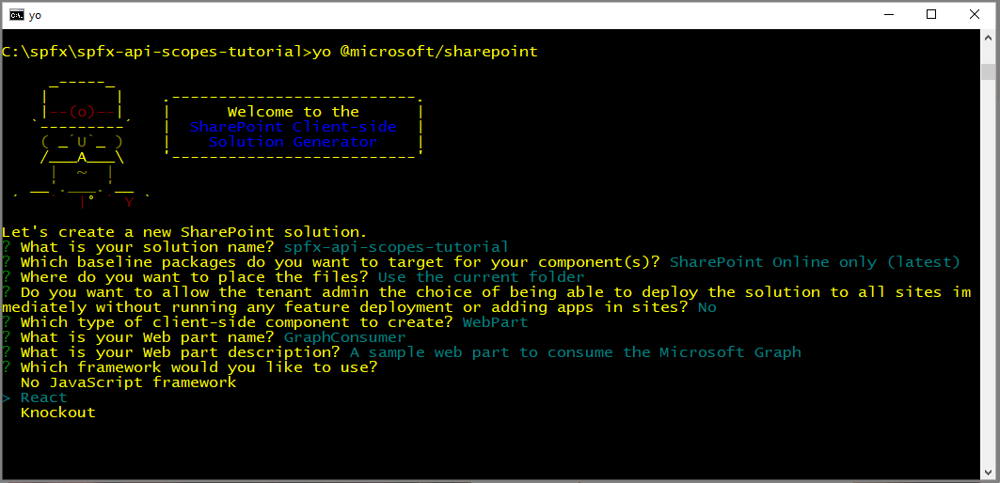
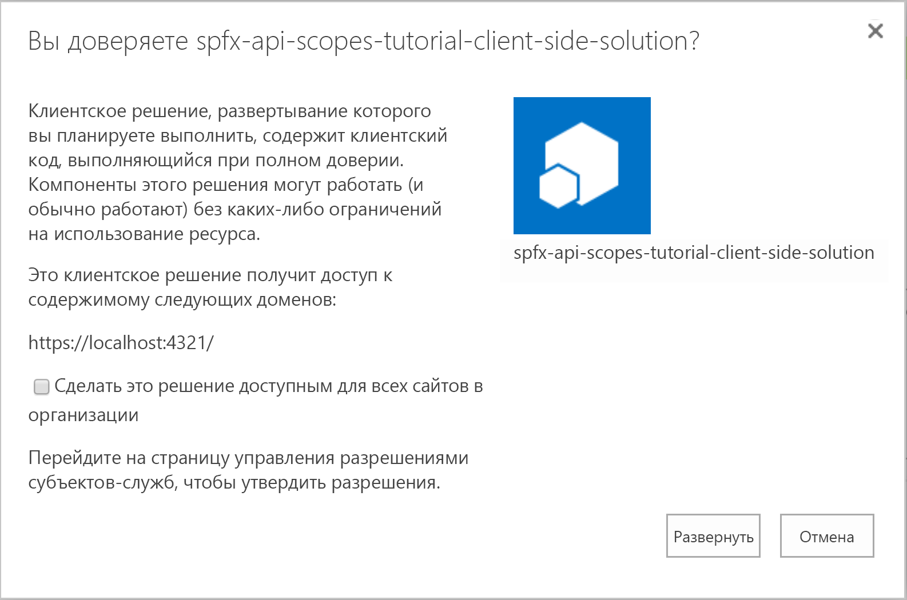

# <a name="consuming-apis-secured-with-azure-ad-within-the-sharepoint-framework"></a><span data-ttu-id="102ae-103">Использование API, защищенных с помощью Azure AD, в SharePoint Framework</span><span class="sxs-lookup"><span data-stu-id="102ae-103">Consuming APIs secured with Azure AD within the SharePoint Framework</span></span>

> [!IMPORTANT]
> <span data-ttu-id="102ae-104">Клиентские объекты `AadHttpClient` и `MSGraphClient` находятся на стадии тестирования и могут меняться.</span><span class="sxs-lookup"><span data-stu-id="102ae-104">`AadHttpClient` and `MSGraphClient` client objects are currently in preview and are subject to change.</span></span> <span data-ttu-id="102ae-105">Не используйте их в рабочей среде.</span><span class="sxs-lookup"><span data-stu-id="102ae-105">Do not use them in a production environment.</span></span> <span data-ttu-id="102ae-106">Также обратите внимание, что свойства `webApiPermissionRequests` в `package-solution.json` не поддерживаются в производственных клиентах.</span><span class="sxs-lookup"><span data-stu-id="102ae-106">Also note that the `webApiPermissionRequests` properties in `package-solution.json` are not supported in production tenants.</span></span>

<span data-ttu-id="102ae-107">Использование REST API, защищенных с помощью Azure Active Directory (Azure AD) и Open Authorization (OAuth 2.0), из клиентской веб-части или расширения SharePoint Framework — распространенный бизнес-сценарий корпоративного уровня.</span><span class="sxs-lookup"><span data-stu-id="102ae-107">Consuming REST APIs secured with Azure Active Directory (Azure AD) and Open Authorization (OAuth 2.0) from within a SharePoint Framework client-side web part or extension is a common enterprise-level business scenario.</span></span>

<span data-ttu-id="102ae-108">Вы можете использовать SharePoint Framework версии 1.4.1 для вызова REST API Microsoft Graph или любого другого REST API, зарегистрированного в Azure AD.</span><span class="sxs-lookup"><span data-stu-id="102ae-108">You can use the SharePoint Framework v.1.4.1 to consume Microsoft Graph REST APIs, or any other REST API that's registered in Azure AD.</span></span> 

<span data-ttu-id="102ae-109">Из этой статьи вы узнаете, как создать решение SharePoint Framework, которое использует API Microsoft Graph с особым набором разрешений.</span><span class="sxs-lookup"><span data-stu-id="102ae-109">In this article, you'll learn how to create a SharePoint Framework solution that uses the Microsoft Graph API with a custom set of permissions.</span></span> <span data-ttu-id="102ae-110">Общий обзор этой технологии см. в статье [Подключение к API, защищенным службой Azure AD, в решениях SharePoint Framework](use-aadhttpclient.md).</span><span class="sxs-lookup"><span data-stu-id="102ae-110">For a conceptual overview of this technology, see [Connect to Azure AD secured APIs in SharePoint Framework solutions](use-aadhttpclient.md).</span></span>

> [!IMPORTANT]
> <span data-ttu-id="102ae-111">Вы можете использовать API Microsoft Graph с SharePoint Framework более ранних версий, чем 1.4.1, через собственный клиент **graphHttpClient** или вручную через неявный поток OAuth [ADAL JS](https://github.com/AzureAD/azure-activedirectory-library-for-js).</span><span class="sxs-lookup"><span data-stu-id="102ae-111">You can consume the Microsoft Graph API with versions of SharePoint Framework earler than v.1.4.1, either via the native **graphHttpClient**, or via a manual [ADAL JS](https://github.com/AzureAD/azure-activedirectory-library-for-js) implicit OAuth flow.</span></span> <span data-ttu-id="102ae-112">Однако первый подход связан с предопределенным набором разрешений, который имеет некоторые ограничения, а второй сложен с точки зрения разработки.</span><span class="sxs-lookup"><span data-stu-id="102ae-112">However, he former approach is bound to a predefined set of permissions, which presents some limitations, and the latter is complex from a development perspective.</span></span> <span data-ttu-id="102ae-113">Инструкции по реализации неявного потока OAuth см. в статье [Подключение к API, защищенным с помощью Azure Active Directory](https://docs.microsoft.com/ru-RU/sharepoint/dev/spfx/web-parts/guidance/connect-to-api-secured-with-aad).</span><span class="sxs-lookup"><span data-stu-id="102ae-113">For details about how to implement an implicit OAuth flow, see [Connect to APIs secured with Azure Active Directory](https://docs.microsoft.com/ru-RU/sharepoint/dev/spfx/web-parts/guidance/connect-to-api-secured-with-aad).</span></span>

## <a name="SolutionOverview"></a><span data-ttu-id="102ae-114">Обзор решения</span><span class="sxs-lookup"><span data-stu-id="102ae-114">Solution overview</span></span>

<span data-ttu-id="102ae-115">В этой статье описано, как создать клиентскую веб-часть, которая позволяет искать пользователей в текущем клиенте, как показано на следующем снимке экрана.</span><span class="sxs-lookup"><span data-stu-id="102ae-115">The steps in this article show you how to build a client-side web part that enables searching for users in the current tenant, as shown in the following screenshot.</span></span> <span data-ttu-id="102ae-116">Поиск основан на Microsoft Graph, и для него требуются разрешения не ниже User.ReadBasic.All.</span><span class="sxs-lookup"><span data-stu-id="102ae-116">The search is based on Microsoft Graph and requires at least the User.ReadBasic.All permission.</span></span>


<span data-ttu-id="102ae-118">Клиентская веб-часть позволяет искать пользователей по имени и показывает всех подходящих пользователей через компонент **DetailsList** из Office UI Fabric.</span><span class="sxs-lookup"><span data-stu-id="102ae-118">The client-side web part enables searching for users based on their name, and provides all the matching users through a **DetailsList** Office UI Fabric component.</span></span> <span data-ttu-id="102ae-119">В области свойств веб-части есть параметр для выбора способа доступа к Microsoft Graph.</span><span class="sxs-lookup"><span data-stu-id="102ae-119">The web part has an option in the property pane to choose how to access Microsoft Graph.</span></span> <span data-ttu-id="102ae-120">Начиная с SharePoint Framework версии 1.4.1 для доступа к Microsoft Graph можно использовать собственный клиент Graph (**MSGraphClient**) или низкоуровневый тип, используемый для доступа к любому REST API, защищенному с помощью Azure AD (**AadHttpClient**).</span><span class="sxs-lookup"><span data-stu-id="102ae-120">In versions of the SharePoint Framework starting with v.1.4.1, you can access Microsoft Graph by using either the native graph client (**MSGraphClient**), or the low-level type used to access any Azure AD secured REST API (**AadHttpClient**).</span></span>

> [!NOTE]
> <span data-ttu-id="102ae-121">Исходный код этого решения представлен в репозитории GitHub [api-scopes](https://github.com/SharePoint/sp-dev-fx-webparts/tree/master/tutorials/api-scopes).</span><span class="sxs-lookup"><span data-stu-id="102ae-121">To get the source code for this solution, see the [spfx-api-scopes-tutorial](https://github.com/SharePoint/sp-dev-fx-webparts/tree/master/tutorials/api-scopes) GitHub repo.</span></span>

<span data-ttu-id="102ae-122">Если вы уже знаете, как создавать решения SharePoint Framework, можете перейти к [настройке запросов на получение разрешений API](#ConfiguringApiPermissions).</span><span class="sxs-lookup"><span data-stu-id="102ae-122">If you're already familiar with how to create SharePoint Framework solutions, you can proceed to [Configure the API permissions requests](#ConfiguringApiPermissions).</span></span>

## <a name="CreatingInitialSolution"></a><span data-ttu-id="102ae-123">Создание исходного решения</span><span class="sxs-lookup"><span data-stu-id="102ae-123">Create the initial solution</span></span>
<span data-ttu-id="102ae-124">Если у вас установлена старая версия генератора SharePoint Framework, необходимо обновить ее до версии 1.4.1 или более поздней.</span><span class="sxs-lookup"><span data-stu-id="102ae-124">If you have an old version of the SharePoint Framework generator, you need to update it to version 1.4.1 or later.</span></span> <span data-ttu-id="102ae-125">Для этого выполните следующую команду, чтобы глобально установить последнюю версию пакета.</span><span class="sxs-lookup"><span data-stu-id="102ae-125">To do that, run the following command to globally install the latest version of the package.</span></span>

```sh
npm install -g @microsoft/generator-sharepoint
```

<span data-ttu-id="102ae-126">После этого создайте новое решение SharePoint Framework:</span><span class="sxs-lookup"><span data-stu-id="102ae-126">Next, create a new SharePoint Framework solution:</span></span>

* <span data-ttu-id="102ae-127">Создайте папку в своей файловой системе.</span><span class="sxs-lookup"><span data-stu-id="102ae-127">Create a folder in your file system.</span></span> <span data-ttu-id="102ae-128">В ней будет храниться исходный код решения. Измените текущий путь, указав эту папку.</span><span class="sxs-lookup"><span data-stu-id="102ae-128">You will store the solution source code and move the current path into this folder.</span></span>
* <span data-ttu-id="102ae-129">Запустите генератор Yeoman, чтобы сформировать шаблоны нового решения.</span><span class="sxs-lookup"><span data-stu-id="102ae-129">Run the Yeoman generator to scaffold a new solution.</span></span>

   ```sh
   yo @microsoft/sharepoint
   ```
* <span data-ttu-id="102ae-130">В решении сделайте следующее:</span><span class="sxs-lookup"><span data-stu-id="102ae-130">In your solution, do the following:</span></span>
    * <span data-ttu-id="102ae-131">Укажите имя решения (например, *spfx-api-scopes-tutorial*).</span><span class="sxs-lookup"><span data-stu-id="102ae-131">Provide a name for the solution (for example *spfx-api-scopes-tutorial*).</span></span>
    * <span data-ttu-id="102ae-132">В качестве целевой среды укажите *SharePoint Online only (latest)* (Только SharePoint Online, последняя версия).</span><span class="sxs-lookup"><span data-stu-id="102ae-132">Target the solution for: *SharePoint Online only (latest)*.</span></span>
    * <span data-ttu-id="102ae-133">Используйте текущую папку.</span><span class="sxs-lookup"><span data-stu-id="102ae-133">Use the current folder.</span></span>
    * <span data-ttu-id="102ae-134">Укажите, следует ли развертывать решение глобально в целевом клиенте.</span><span class="sxs-lookup"><span data-stu-id="102ae-134">Decide whether you want to globally deploy the solution to the target tenant.</span></span>
    * <span data-ttu-id="102ae-135">Выберите тип решения "WebPart".</span><span class="sxs-lookup"><span data-stu-id="102ae-135">Choose to create a WebPart.</span></span>
    * <span data-ttu-id="102ae-136">Назовите веб-часть *GraphConsumer*.</span><span class="sxs-lookup"><span data-stu-id="102ae-136">Call the web part *GraphConsumer*.</span></span>
    * <span data-ttu-id="102ae-137">Добавьте описание.</span><span class="sxs-lookup"><span data-stu-id="102ae-137">Provide a description.</span></span>
    * <span data-ttu-id="102ae-138">Выберите React в качестве платформы разработки.</span><span class="sxs-lookup"><span data-stu-id="102ae-138">Choose to use React as the development framework.</span></span>



* <span data-ttu-id="102ae-140">Запустите Visual Studio Code (или другой редактор кода) в контексте текущей папки.</span><span class="sxs-lookup"><span data-stu-id="102ae-140">Start Visual Studio Code (or your favorite code editor) within the context of the current folder.</span></span>

```sh
code .
```

## <a name="ConfiguringBaseElements"></a><span data-ttu-id="102ae-141">Настройка базовых элементов веб-части</span><span class="sxs-lookup"><span data-stu-id="102ae-141">Configure the base web part elements</span></span>
<span data-ttu-id="102ae-142">После этого настройте исходные элементы клиентской веб-части.</span><span class="sxs-lookup"><span data-stu-id="102ae-142">Next, configure the initial elements of the client-side web part.</span></span>

### <a name="ConfigureCustomProperties"></a><span data-ttu-id="102ae-143">Настройка особых свойств</span><span class="sxs-lookup"><span data-stu-id="102ae-143">Configure the custom properties</span></span>
<span data-ttu-id="102ae-144">Создайте файл исходного кода в папке *src/webparts/graphConsumer/components* решения.</span><span class="sxs-lookup"><span data-stu-id="102ae-144">Create a new source code file under the *src/webparts/graphConsumer/components* folder of the solution.</span></span>
<span data-ttu-id="102ae-145">Назовите новый файл *ClientMode.ts* и объявите с его помощью объект TypeScript *enum* с доступными значениями свойства **ClientMode** веб-части.</span><span class="sxs-lookup"><span data-stu-id="102ae-145">Call the new file *ClientMode.ts* and use it to declare a TypeScript *enum* with the available options for the **ClientMode** property of the web part.</span></span>

```TS
export enum ClientMode {
    aad,
    graph,
}
```

<span data-ttu-id="102ae-146">Теперь откройте файл *GraphConsumerWebPart.ts* в папке *src/webparts/graphConsumer* решения.</span><span class="sxs-lookup"><span data-stu-id="102ae-146">Now, open the *GraphConsumerWebPart.ts* file in the *src/webparts/graphConsumer* folder of the solution.</span></span>
<span data-ttu-id="102ae-147">Измените определение интерфейса **IGraphConsumerWebPartProps**, чтобы он принимал значение типа **ClientMode**.</span><span class="sxs-lookup"><span data-stu-id="102ae-147">Change the definition of the **IGraphConsumerWebPartProps** interface in order to accept a value of type **ClientMode**.</span></span>

```TS
export interface IGraphConsumerWebPartProps {
  clientMode: ClientMode;
}
```

<span data-ttu-id="102ae-148">Теперь обновите метод **getPropertyPaneConfiguration()** клиентской веб-части так, чтобы он поддерживал выбор вариантов в области свойств.</span><span class="sxs-lookup"><span data-stu-id="102ae-148">Now update the **getPropertyPaneConfiguration()** method of the client-side web part, in order to support the choice selection in the property pane.</span></span> <span data-ttu-id="102ae-149">Ниже показана новая реализация этого метода.</span><span class="sxs-lookup"><span data-stu-id="102ae-149">The following example shows the new implementation of the method.</span></span>

```TS
  protected getPropertyPaneConfiguration(): IPropertyPaneConfiguration {
    return {
      pages: [
        {
          header: {
            description: strings.PropertyPaneDescription
          },
          groups: [
            {
              groupName: strings.BasicGroupName,
              groupFields: [
                PropertyPaneChoiceGroup('clientMode', {
                  label: strings.ClientModeLabel,
                  options: [
                    { key: ClientMode.aad, text: "AadHttpClient"},
                    { key: ClientMode.graph, text: "MSGraphClient"},
                  ]
                }),              
              ]
            }
          ]
        }
      ]
    };
  }
```

<span data-ttu-id="102ae-150">Кроме того, необходимо обновить метод **render** клиентской веб-части, чтобы создавать должным образом настроенный экземпляр компонента React для отрисовки.</span><span class="sxs-lookup"><span data-stu-id="102ae-150">In addition, you need to update the **render** method of the client-side web part to create a properly configured instance of the React component for rendering.</span></span> <span data-ttu-id="102ae-151">Ниже показано определение метода обновления.</span><span class="sxs-lookup"><span data-stu-id="102ae-151">The following code shows the update method definition.</span></span>

```TS
  public render(): void {
    const element: React.ReactElement<IGraphConsumerProps > = React.createElement(
      GraphConsumer,
      {
        clientMode: this.properties.clientMode,
        context: this.context,
      }
    );

    ReactDom.render(element, this.domElement);
  }
```

<span data-ttu-id="102ae-152">Чтобы этот код работал, нужно добавить операторы import в начале файла *GraphConsumerWebPart.ts*, как показано ниже.</span><span class="sxs-lookup"><span data-stu-id="102ae-152">For this code to work, you need to add some import statements at the beginning of the *GraphConsumerWebPart.ts* file, as shown in the following example.</span></span>

```TS
import * as React from 'react';
import * as ReactDom from 'react-dom';
import { Version } from '@microsoft/sp-core-library';
import {
  BaseClientSideWebPart,
  IPropertyPaneConfiguration,
  PropertyPaneChoiceGroup
} from '@microsoft/sp-webpart-base';

import * as strings from 'GraphConsumerWebPartStrings';
import GraphConsumer from './components/GraphConsumer';
import { IGraphConsumerProps } from './components/IGraphConsumerProps';
import { ClientMode } from './components/ClientMode';
```

<span data-ttu-id="102ae-153">Обратите внимание на импорт элемента управления **PropertyPaneChoiceGroup**, а также импорт перечисления **ClientMode**.</span><span class="sxs-lookup"><span data-stu-id="102ae-153">Note the import for the **PropertyPaneChoiceGroup** control, as well as the import of the **ClientMode** enum.</span></span>

### <a name="UpdateResourceStrings"></a><span data-ttu-id="102ae-154">Обновление строк ресурсов</span><span class="sxs-lookup"><span data-stu-id="102ae-154">Update the resource strings</span></span>
<span data-ttu-id="102ae-155">Чтобы скомпилировать решение, необходимо обновить файл *mystrings.d.ts* в папке *src/webparts/graphConsumer/loc* этого решения.</span><span class="sxs-lookup"><span data-stu-id="102ae-155">To compile the solution, you need to update the *mystrings.d.ts* file under the *src/webparts/graphConsumer/loc* folder of the solution.</span></span> <span data-ttu-id="102ae-156">Замените код интерфейса, который определяет строку ресурсов, приведенным ниже кодом.</span><span class="sxs-lookup"><span data-stu-id="102ae-156">Rewrite the interface that defines the resources string with the following code.</span></span>

```TS
declare interface IGraphConsumerWebPartStrings {
  PropertyPaneDescription: string;
  BasicGroupName: string;
  ClientModeLabel: string;
  SearchFor: string;
  SearchForValidationErrorMessage: string;
}
```

<span data-ttu-id="102ae-157">Теперь задайте нужные значения для новых строк ресурсов, обновив файл *en-us.js* в той же папке.</span><span class="sxs-lookup"><span data-stu-id="102ae-157">Now configure proper values for the newly created resource strings, by updating the *en-us.js* file within the same folder.</span></span>

```TS
define([], function() {
  return {
    "PropertyPaneDescription": "Description",
    "BasicGroupName": "Group Name",
    "ClientModeLabel": "Client Mode",
    "SearchFor": "Search for",
    "SearchForValidationErrorMessage": "Invalid value for 'Search for' field"
  }
});
```

### <a name="UpdateStyles"></a><span data-ttu-id="102ae-158">Обновление стиля клиентской веб-части</span><span class="sxs-lookup"><span data-stu-id="102ae-158">Update the style for the client-side web part</span></span>
<span data-ttu-id="102ae-159">Вам также нужно обновить файл стилей SCSS.</span><span class="sxs-lookup"><span data-stu-id="102ae-159">You also need to update the SCSS style file.</span></span> <span data-ttu-id="102ae-160">Откройте файл *GraphConsumer.module.scss* в папке *src/webparts/graphConsumer/components* решения.</span><span class="sxs-lookup"><span data-stu-id="102ae-160">Open the *GraphConsumer.module.scss* under the *src/webparts/graphConsumer/components* folder of the solution.</span></span> <span data-ttu-id="102ae-161">Добавьте следующие классы стилей сразу после класса **.title**:</span><span class="sxs-lookup"><span data-stu-id="102ae-161">Add the following style classes, right after the **.title** class:</span></span>

```SCSS
  .form {
    @include ms-font-l;
    @include ms-fontColor-white;
  }

  label {
    @include ms-fontColor-white;
  }
```

### <a name="UpdateReactComponent"></a><span data-ttu-id="102ae-162">Обновление компонента React, отображающего веб-часть</span><span class="sxs-lookup"><span data-stu-id="102ae-162">Update the React component rendering the web part</span></span>
<span data-ttu-id="102ae-163">Теперь вы можете обновить компонент React **GraphConsumer** в папке *src/webparts/graphConsumer/components* решения.</span><span class="sxs-lookup"><span data-stu-id="102ae-163">Now you can update the **GraphConsumer** React component under the *src/webparts/graphConsumer/components* folder of the solution.</span></span>
<span data-ttu-id="102ae-164">Сначала обновите файл *IGraphConsumerProps.ts*, чтобы принять особые свойства, необходимые для реализации веб-части.</span><span class="sxs-lookup"><span data-stu-id="102ae-164">First, update the *IGraphConsumerProps.ts* file to accept the custom properties required by the web part implementation.</span></span> <span data-ttu-id="102ae-165">Ниже показано обновленное содержимое файла *IGraphConsumerProps.ts*.</span><span class="sxs-lookup"><span data-stu-id="102ae-165">The following example shows the updated content of the *IGraphConsumerProps.ts* file.</span></span>

```TS
import { WebPartContext } from '@microsoft/sp-webpart-base';
import { ClientMode } from './ClientMode';

export interface IGraphConsumerProps {
  clientMode: ClientMode;
  context: WebPartContext;
}
```
<span data-ttu-id="102ae-166">Обратите внимание на импорт определения перечисления **ClientMode**, а также на импорт типа **WebPartContext**.</span><span class="sxs-lookup"><span data-stu-id="102ae-166">Notice the import of the **ClientMode** enum definition, as well as the import of the **WebPartContext** type.</span></span> <span data-ttu-id="102ae-167">Они понадобятся вам позже.</span><span class="sxs-lookup"><span data-stu-id="102ae-167">You will use that later.</span></span>

<span data-ttu-id="102ae-168">Создайте интерфейс для хранения состояния компонента React.</span><span class="sxs-lookup"><span data-stu-id="102ae-168">Create a new interface to hold the React component state.</span></span> <span data-ttu-id="102ae-169">Создайте файл в папке *src/webparts/graphConsumer/components* и назовите его *IGraphConsumerState.ts*.</span><span class="sxs-lookup"><span data-stu-id="102ae-169">Create a new file in the *src/webparts/graphConsumer/components* folder and call it *IGraphConsumerState.ts*.</span></span> <span data-ttu-id="102ae-170">Ниже показано определение интерфейса.</span><span class="sxs-lookup"><span data-stu-id="102ae-170">The following is the interface definition.</span></span>

```TS
import { IUserItem } from './IUserItem';

export interface IGraphConsumerState {
    users: Array<IUserItem>;
    searchFor: string;
  }
```

<span data-ttu-id="102ae-171">Определите интерфейс **IUserItem** (в файле *IUserItem.ts*, хранящемся в папке *src/webparts/graphConsumer/components*).</span><span class="sxs-lookup"><span data-stu-id="102ae-171">Define the **IUserItem** interface (within a file called *IUserItem.ts* stored in the *src/webparts/graphConsumer/components* folder).</span></span> <span data-ttu-id="102ae-172">Этот интерфейс импортируется в файл состояния.</span><span class="sxs-lookup"><span data-stu-id="102ae-172">That interface is imported in the state file.</span></span>

```TS
export interface IUserItem {
    displayName: string;
    mail: string;
    userPrincipalName: string;
  }
```

<span data-ttu-id="102ae-173">Интерфейс будет использоваться для определения структуры пользователей, полученной из текущего клиента и привязанной к компоненту **DetailsList** в пользовательском интерфейсе.</span><span class="sxs-lookup"><span data-stu-id="102ae-173">The interface will be used to define the outline of the users retrieved from the current tenant and bound to the **DetailsList** in the UI.</span></span>

<span data-ttu-id="102ae-174">После этого обновите файл *GraphConsumer.tsx*.</span><span class="sxs-lookup"><span data-stu-id="102ae-174">Next, update the *GraphConsumer.tsx* file.</span></span> <span data-ttu-id="102ae-175">Сначала добавьте операторы для импорта определенных ранее типов.</span><span class="sxs-lookup"><span data-stu-id="102ae-175">First, add some import statements to import the types you defined earlier.</span></span>

```TS
import * as React from 'react';
import styles from './GraphConsumer.module.scss';
import * as strings from 'GraphConsumerWebPartStrings';
import { IGraphConsumerProps } from './IGraphConsumerProps';
import { IGraphConsumerState } from './IGraphConsumerState';
import { ClientMode } from './ClientMode';
import { IUserItem } from './IUserItem';
import { escape } from '@microsoft/sp-lodash-subset';

import {
  autobind,
  PrimaryButton,
  TextField,
  Label,
  DetailsList,
  DetailsListLayoutMode,
  CheckboxVisibility,
  SelectionMode
} from 'office-ui-fabric-react';

import { AadHttpClient } from "@microsoft/sp-http";
import { MSGraphClient } from "@microsoft/sp-client-preview";
```

<span data-ttu-id="102ae-176">Обратите внимание на импорт компонентов **IGraphConsumerProps**, **IGraphConsumerState**, **ClientMode** и **IUserItem**.</span><span class="sxs-lookup"><span data-stu-id="102ae-176">Notice the import for: **IGraphConsumerProps**, **IGraphConsumerState**, **ClientMode**, **IUserItem**.</span></span> <span data-ttu-id="102ae-177">Также импортируются некоторые компоненты Office UI Fabric, используемые для отрисовки пользовательского интерфейса компонента React.</span><span class="sxs-lookup"><span data-stu-id="102ae-177">There are also some imports for the Office UI Fabric components used to render the UI of the React component.</span></span>

<span data-ttu-id="102ae-178">После операций импорта определите структуру столбцов для компонента **DetailsList** из Office UI Fabric.</span><span class="sxs-lookup"><span data-stu-id="102ae-178">After the imports, define the outline of the columns for the **DetailsList** component of Office UI Fabric.</span></span>

```TS
// Configure the columns for the DetailsList component
let _usersListColumns = [
  {
    key: 'displayName',
    name: 'Display name',
    fieldName: 'displayName',
    minWidth: 50,
    maxWidth: 100,
    isResizable: true
  },
  {
    key: 'mail',
    name: 'Mail',
    fieldName: 'mail',
    minWidth: 50,
    maxWidth: 100,
    isResizable: true
  },
  {
    key: 'userPrincipalName',
    name: 'User Principal Name',
    fieldName: 'userPrincipalName',
    minWidth: 100,
    maxWidth: 200,
    isResizable: true
  },
];
```

<span data-ttu-id="102ae-179">Этот массив будет использоваться в параметрах компонента **DetailsList**, как видно по методу **render()** компонента React.</span><span class="sxs-lookup"><span data-stu-id="102ae-179">This array will be used in the settings of the **DetailsList** component, as you can see in the **render()** method of the React component.</span></span> <span data-ttu-id="102ae-180">Замените этот компонент приведенным ниже кодом.</span><span class="sxs-lookup"><span data-stu-id="102ae-180">Replace this component with the following code.</span></span>

```TS
  public render(): React.ReactElement<IGraphConsumerProps> {
    return (
      <div className={ styles.graphConsumer }>
        <div className={ styles.container }>
          <div className={ styles.row }>
            <div className={ styles.column }>
              <span className={ styles.title }>Search for a user!</span>
              <p className={ styles.form }>
                <TextField 
                    label={ strings.SearchFor } 
                    required={ true } 
                    value={ this.state.searchFor }
                    onChanged={ this._onSearchForChanged }
                    onGetErrorMessage={ this._getSearchForErrorMessage }
                  />
              </p>
              <p className={ styles.form }>
                <PrimaryButton 
                    text='Search' 
                    title='Search' 
                    onClick={ this._search } 
                  />
              </p>
              {
                (this.state.users != null && this.state.users.length > 0) ?
                  <p className={ styles.form }>
                  <DetailsList
                      items={ this.state.users }
                      columns={ _usersListColumns }
                      setKey='set'
                      checkboxVisibility={ CheckboxVisibility.hidden }
                      selectionMode={ SelectionMode.none }
                      layoutMode={ DetailsListLayoutMode.fixedColumns }
                      compact={ true }
                  />
                </p>
                : null
              }
            </div>
          </div>
        </div>
      </div>
    );
  }
```

<span data-ttu-id="102ae-181">Обновите объявление типа компонента React и добавьте конструктор, как показано ниже.</span><span class="sxs-lookup"><span data-stu-id="102ae-181">Update the React component type declaration and add a constructor, as shown in the following example.</span></span>

```TS
export default class GraphConsumer extends React.Component<IGraphConsumerProps, IGraphConsumerState> {

  constructor(props: IGraphConsumerProps, state: IGraphConsumerState) {
    super(props);
    
    // Initialize the state of the component
    this.state = {
      users: [],
      searchFor: ""
    };
  }

```

<span data-ttu-id="102ae-182">Для сбора критериев поиска компоненту **TextField** требуются некоторые правила проверки и обработчики событий.</span><span class="sxs-lookup"><span data-stu-id="102ae-182">There are some validation rules and handling events for the **TextField** component to collect the search criteria.</span></span> <span data-ttu-id="102ae-183">Ниже показаны реализации метода.</span><span class="sxs-lookup"><span data-stu-id="102ae-183">The following are the method implementations.</span></span>

```TS
  @autobind
  private _onSearchForChanged(newValue: string): void {

    // Update the component state accordingly to the current user's input
    this.setState({
      searchFor: newValue,
    });
  }

  private _getSearchForErrorMessage(value: string): string {
    // The search for text cannot contain spaces
    return (value == null || value.length == 0 || value.indexOf(" ") < 0)
      ? ''
      : `${strings.SearchForValidationErrorMessage}`;
  }
```

<span data-ttu-id="102ae-184">Компонент **PrimaryButton** вызывает функцию **_search()**, которая определяет, какую клиентскую технологию использовать для вызова Microsoft Graph.</span><span class="sxs-lookup"><span data-stu-id="102ae-184">The **PrimaryButton** fires a **_search()** function, which determines what client technology to use to consume Microsoft Graph.</span></span>

```TS
  @autobind
  private _search(): void {

    console.log(this.props.clientMode);

    // Based on the clientMode value search users
    switch (this.props.clientMode)
    {
      case ClientMode.aad:
        this._searchWithAad();
        break;
      case ClientMode.graph:
      this._searchWithGraph();
      break;
    }
  }
```

<span data-ttu-id="102ae-185">Экземпляр компонента **DetailsList** отрисовывается в методе **render()** на тот случай, если в свойстве **users** состояния компонента имеются элементы.</span><span class="sxs-lookup"><span data-stu-id="102ae-185">The **DetailsList** component instance is rendered in the **render()** method, in case there are items in the **users** property of the component's state.</span></span>

## <a name="ConfiguringApiPermissions"></a><span data-ttu-id="102ae-186">Настройка запросов на получение разрешений API</span><span class="sxs-lookup"><span data-stu-id="102ae-186">Configure the API permissions requests</span></span>

<span data-ttu-id="102ae-187">Чтобы использовать Microsoft Graph или другой сторонний REST API, в манифесте решения необходимо явно объявить требуемые разрешения с точки зрения OAuth.</span><span class="sxs-lookup"><span data-stu-id="102ae-187">To consume Microsoft Graph or any other third-party REST API, you need to explicitly declare the permission requirements from an OAuth perspective in the manifest of your solution.</span></span>

<span data-ttu-id="102ae-188">В SharePoint Framework 1.4.1 или более новой версии для этого можно настроить свойство **webApiPermissionRequests** в файле *package-solution.json* из папки *config* в решении.</span><span class="sxs-lookup"><span data-stu-id="102ae-188">In the SharePoint Framework v.1.4.1 or later, you can do that by configuring the **webApiPermissionRequests** property in the *package-solution.json* under the *config* folder of the solution.</span></span> <span data-ttu-id="102ae-189">Ниже показан фрагмент этого файла для текущего решения.</span><span class="sxs-lookup"><span data-stu-id="102ae-189">The following example shows an excerpt of that file for the current solution.</span></span> <span data-ttu-id="102ae-190">Скопируйте объявление свойства **webApiPermissionRequests**.</span><span class="sxs-lookup"><span data-stu-id="102ae-190">Copy the declaration of the **webApiPermissionRequests** property.</span></span>

```JSON
{
  "$schema": "https://dev.office.com/json-schemas/spfx-build/package-solution.schema.json",
  "solution": {
    "name": "spfx-api-scopes-tutorial-client-side-solution",
    "id": "841cd609-d821-468d-a6e4-2d207b966cd8",
    "version": "1.0.0.0",
    "includeClientSideAssets": true,
    "skipFeatureDeployment": true,
    "webApiPermissionRequests": [
      {
        "resource": "Microsoft Graph",
        "scope": "User.ReadBasic.All"
      }
    ]
  },
  "paths": {
    "zippedPackage": "solution/spfx-api-scopes-tutorial.sppkg"
  }
}
```

<span data-ttu-id="102ae-191">Обратите внимание на объект **webApiPermissionRequests**, представляющий собой массив элементов **webApiPermissionRequest**.</span><span class="sxs-lookup"><span data-stu-id="102ae-191">Notice the **webApiPermissionRequests**, which is an array of **webApiPermissionRequest** items.</span></span> <span data-ttu-id="102ae-192">Каждый элемент определяет *ресурс* и *область* для запроса на получение разрешений.</span><span class="sxs-lookup"><span data-stu-id="102ae-192">Each item defines the *resource* and the *scope* of the permission request.</span></span>
<span data-ttu-id="102ae-193">Значением *resource* может быть имя или ObjectId (в Azure AD) ресурса, для которого требуется настроить запрос на получение разрешений.</span><span class="sxs-lookup"><span data-stu-id="102ae-193">The *resource* can be the name or the ObjectId (in Azure AD) of the resource for which you want to configure the permission request.</span></span> <span data-ttu-id="102ae-194">Для Microsoft Graph используется имя "Microsoft Graph".</span><span class="sxs-lookup"><span data-stu-id="102ae-194">For  Microsoft Graph, the name is "Microsoft Graph".</span></span> <span data-ttu-id="102ae-195">Значение ObjectId не уникально и зависит от клиента.</span><span class="sxs-lookup"><span data-stu-id="102ae-195">The ObjectId is not unique and varies on a per tenant basis.</span></span>
<span data-ttu-id="102ae-196">Значением *scope* может быть имя разрешения или уникальный идентификатор этого разрешения.</span><span class="sxs-lookup"><span data-stu-id="102ae-196">The *scope* can be the name of the permission, or the unique ID of that permission.</span></span> <span data-ttu-id="102ae-197">Имя разрешения можно получить из документации по API.</span><span class="sxs-lookup"><span data-stu-id="102ae-197">You can get the permission name from the API documentation.</span></span> <span data-ttu-id="102ae-198">Идентификатор разрешения можно получить из файла манифеста API.</span><span class="sxs-lookup"><span data-stu-id="102ae-198">You can get the permission ID from the API manifest file.</span></span>

> [!NOTE]
> <span data-ttu-id="102ae-199">Все доступные разрешения перечислены в [справочнике по разрешениям Microsoft Graph](https://developer.microsoft.com/ru-RU/graph/docs/concepts/permissions_reference).</span><span class="sxs-lookup"><span data-stu-id="102ae-199">For a list of the permissions that are available in Microsoft Graph, see [Microsoft Graph permissions reference](https://developer.microsoft.com/ru-RU/graph/docs/concepts/permissions_reference).</span></span> <span data-ttu-id="102ae-200">По умолчанию у субъекта-службы нет явных разрешений на доступ к Microsoft Graph.</span><span class="sxs-lookup"><span data-stu-id="102ae-200">By default, the service principal has no explicit permissions granted to access Microsoft Graph.</span></span> <span data-ttu-id="102ae-201">Однако, запросив маркер доступа для Microsoft Graph, вы получите маркер с разрешением `user_impersonation`, с помощью которого можно считывать сведения о пользователях (User.Read.All).</span><span class="sxs-lookup"><span data-stu-id="102ae-201">However, if you request an access token for Microsoft Graph, you get a token with the `user_impersonation` permission that you can use to read information about the users (User.Read.All).</span></span> <span data-ttu-id="102ae-202">Вы можете запрашивать дополнительные разрешения, а администраторы клиентов — предоставлять их.</span><span class="sxs-lookup"><span data-stu-id="102ae-202">You can request additional permissions to be granted by tenant administrators.</span></span> <span data-ttu-id="102ae-203">Дополнительные сведения см. в статье [Подключение к API, защищенным службой Azure AD, в решениях SharePoint Framework](use-aadhttpclient.md).</span><span class="sxs-lookup"><span data-stu-id="102ae-203">For more information, see [Connect to Azure AD secured APIs in SharePoint Framework solutions](use-aadhttpclient.md).</span></span>


<span data-ttu-id="102ae-204">Для поиска пользователей и получения свойств **displayName**, **mail** и **userPrincipalName** достаточно разрешения User.ReadBasic.All.</span><span class="sxs-lookup"><span data-stu-id="102ae-204">The User.ReadBasic.All permission is sufficient for searching for users and getting their **displayName**, **mail**, and **userPrincipalName**.</span></span>

<span data-ttu-id="102ae-205">Когда вы упакуете и развернете решение, вам (или администратору) нужно будет предоставить ему запрашиваемые разрешения.</span><span class="sxs-lookup"><span data-stu-id="102ae-205">When you package and deploy your solution, you (or an admin) will have to grant the requested permissions to your solution.</span></span> <span data-ttu-id="102ae-206">Дополнительные сведения см. в разделе [Развертывание решения и предоставление разрешений](#DeploymentAndPermissionsGrant).</span><span class="sxs-lookup"><span data-stu-id="102ae-206">For details, see [Deploy the solution and grant permissions](#DeploymentAndPermissionsGrant).</span></span>

## <a name="ConsumingTheGraph"></a><span data-ttu-id="102ae-207">Использование Microsoft Graph</span><span class="sxs-lookup"><span data-stu-id="102ae-207">Consume Microsoft Graph</span></span>
<span data-ttu-id="102ae-208">Теперь вы можете реализовать методы для использования Microsoft Graph.</span><span class="sxs-lookup"><span data-stu-id="102ae-208">You can now implement the methods to consume the Microsoft Graph.</span></span> <span data-ttu-id="102ae-209">У вас есть два варианта:</span><span class="sxs-lookup"><span data-stu-id="102ae-209">You have two options:</span></span>
* <span data-ttu-id="102ae-210">использовать клиентский объект **AadHttpClient**;</span><span class="sxs-lookup"><span data-stu-id="102ae-210">Use the **AadHttpClient** client object</span></span>
* <span data-ttu-id="102ae-211">использовать клиентский объект **MSGraphClient**.</span><span class="sxs-lookup"><span data-stu-id="102ae-211">Use the **MSGraphClient** client object</span></span>

<span data-ttu-id="102ae-212">С помощью клиентского объекта **AadHttpClient**</span><span class="sxs-lookup"><span data-stu-id="102ae-212">The **AadHttpClient** client object is useful for consuming any REST API.</span></span> <span data-ttu-id="102ae-213">можно использовать Microsoft Graph или любой другой сторонний (или встроенный) REST API.</span><span class="sxs-lookup"><span data-stu-id="102ae-213">You can use it to consume Microsoft Graph or any other third-party (or first-party) REST API.</span></span>

<span data-ttu-id="102ae-214">Клиентской объект **MSGraphClient** подходит только для использования Microsoft Graph.</span><span class="sxs-lookup"><span data-stu-id="102ae-214">The **MSGraphClient** client object can consume the Microsoft Graph only.</span></span> <span data-ttu-id="102ae-215">Он использует клиентский объект **AadHttpClient** и поддерживает текучий синтаксис пакета SDK Microsoft Graph.</span><span class="sxs-lookup"><span data-stu-id="102ae-215">Internally it uses the **AadHttpClient** client object and supports the fluent syntax of the Microsoft Graph SDK.</span></span>

### <a name="AadHttpClient"></a><span data-ttu-id="102ae-216">Использование AadHttpClient</span><span class="sxs-lookup"><span data-stu-id="102ae-216">Using AadHttpClient</span></span>
<span data-ttu-id="102ae-217">Чтобы использовать любой REST API с помощью клиентского объекта **AadHttpClient**, создайте экземпляр типа **AadHttpClient** и укажите свойство *serviceScope* текущего контекста и URI целевой службы.</span><span class="sxs-lookup"><span data-stu-id="102ae-217">To consume any REST API using the **AadHttpClient** client object, create a new instance of the **AadHttpClient** type, and provide the *serviceScope* of the current context and the URI of the target service.</span></span>

<span data-ttu-id="102ae-218">Созданный объект предоставит методы для выполнения следующих запросов:</span><span class="sxs-lookup"><span data-stu-id="102ae-218">The object created will provide methods to make the following requests:</span></span>

* <span data-ttu-id="102ae-219">**get** (отправляет HTTP-запрос GET);</span><span class="sxs-lookup"><span data-stu-id="102ae-219">**get**: makes an HTTP GET request</span></span>
* <span data-ttu-id="102ae-220">**post** (отправляет HTTP-запрос POST);</span><span class="sxs-lookup"><span data-stu-id="102ae-220">**post**: makes an HTTP POST request</span></span>
* <span data-ttu-id="102ae-221">**fetch** (отправляет любой HTTP-запрос в зависимости от указанных аргументов *HttpClientConfiguration* и *IHttpClientOptions*).</span><span class="sxs-lookup"><span data-stu-id="102ae-221">**fetch**: makes any other kind of HTTP request, based on the *HttpClientConfiguration* and *IHttpClientOptions* arguments provided.</span></span>

<span data-ttu-id="102ae-222">Так как все эти методы поддерживают асинхронную модель разработки с использованием JavaScript и TypeScript, вы можете обрабатывать их результаты с помощью обещаний.</span><span class="sxs-lookup"><span data-stu-id="102ae-222">Because all these methods support the asynchronous development model of JavaScript/TypeScript, you can handle their result with promises.</span></span>

<span data-ttu-id="102ae-223">Ниже показан метод **_searchWithAad()** из демо-решения.</span><span class="sxs-lookup"><span data-stu-id="102ae-223">The following example shows the **_searchWithAad()** method of the sample solution.</span></span>

```TS
  private _searchWithAad(): void {

    // Log the current operation
    console.log("Using _searchWithAad() method");

    // Using Graph here, but any 1st or 3rd party REST API that requires Azure AD auth can be used here.
    const aadClient: AadHttpClient = new AadHttpClient(
      this.props.context.serviceScope,
      "https://graph.microsoft.com"
    );

    // Search for the users with givenName, surname, or displayName equal to the searchFor value
    aadClient
      .get(
        `https://graph.microsoft.com/v1.0/users?$select=displayName,mail,userPrincipalName&$filter=(givenName%20eq%20'${escape(this.state.searchFor)}')%20or%20(surname%20eq%20'${escape(this.state.searchFor)}')%20or%20(displayName%20eq%20'${escape(this.state.searchFor)}')`,
        AadHttpClient.configurations.v1
      )
      .then(response => {
        return response.json();
      })
      .then(json => {

        // Prepare the output array
        var users: Array<IUserItem> = new Array<IUserItem>();

        // Log the result in the console for testing purposes
        console.log(json);

        // Map the JSON response to the output array
        json.value.map((item: any) => {
          users.push( { 
            displayName: item.displayName,
            mail: item.mail,
            userPrincipalName: item.userPrincipalName,
          });
        });

        // Update the component state accordingly to the result
        this.setState(
          {
            users: users,
          }
        );
      })
      .catch(error => {
        console.error(error);
      });
  }
```

<span data-ttu-id="102ae-224">Метод **get()** получает URL-адрес запроса OData в качестве входного аргумента.</span><span class="sxs-lookup"><span data-stu-id="102ae-224">The **get()** method gets the URL of the OData request as the input argument.</span></span> <span data-ttu-id="102ae-225">В случае успешного выполнения запроса возвращается объект JSON с ответом.</span><span class="sxs-lookup"><span data-stu-id="102ae-225">A successful request returns a JSON object with the response.</span></span>

### <a name="MSGraphClient"></a><span data-ttu-id="102ae-226">Использование MSGraphClient</span><span class="sxs-lookup"><span data-stu-id="102ae-226">Using MSGraphClient</span></span>
<span data-ttu-id="102ae-227">Если планируете использовать Microsoft Graph, можно воспользоваться клиентским объектом **MSGraphClient**, который предоставляет более текучий синтаксис.</span><span class="sxs-lookup"><span data-stu-id="102ae-227">If you are targeting Microsoft Graph, you can use the **MSGraphClient** client object, which provides a more fluent syntax.</span></span>
<span data-ttu-id="102ae-228">Ниже показана реализация метода **_searchWithGraph()** из демо-решения.</span><span class="sxs-lookup"><span data-stu-id="102ae-228">The following example shows the implementation of the **_searchWithGraph()** method of the sample solution.</span></span>

```TS
  private _searchWithGraph(): void {

    // Log the current operation
    console.log("Using _searchWithGraph() method");

    const graphClient: MSGraphClient = this.props.context.serviceScope.consume(
      MSGraphClient.serviceKey
    );

    // From https://github.com/microsoftgraph/msgraph-sdk-javascript sample
    graphClient
      .api("users")
      .version("v1.0")
      .select("displayName,mail,userPrincipalName")
      .filter(`(givenName eq '${escape(this.state.searchFor)}') or (surname eq '${escape(this.state.searchFor)}') or (displayName eq '${escape(this.state.searchFor)}')`)
      .get((err, res) => {  

        if (err) {
          console.error(err);
          return;
        }

        // Prepare the output array
        var users: Array<IUserItem> = new Array<IUserItem>();

        // Map the JSON response to the output array
        res.value.map((item: any) => {
          users.push( { 
            displayName: item.displayName,
            mail: item.mail,
            userPrincipalName: item.userPrincipalName,
          });
        });

        // Update the component state accordingly to the result
        this.setState(
          {
            users: users,
          }
        );
      });
  }
```

<span data-ttu-id="102ae-229">Чтобы создать экземпляр типа **MSGraphClient**, передайте его ключ службы методу **consume()** объекта *serviceScope* для текущего контекста.</span><span class="sxs-lookup"><span data-stu-id="102ae-229">You create an instance of the **MSGraphClient** type by providing its service key to the **consume()** method of the current context's *serviceScope*.</span></span>
<span data-ttu-id="102ae-230">Затем используйте текучий API из пакета SDK Microsoft Graph, чтобы определить запрос OData, который будет выполняться для целевой конечной точки Microsoft Graph.</span><span class="sxs-lookup"><span data-stu-id="102ae-230">Then, you use the fluent API of the Microsoft Graph SDK to define the OData query that will run against the target Microsoft Graph endpoint.</span></span>
<span data-ttu-id="102ae-231">В результате вы получите ответ JSON, который потребуется раскодировать и сопоставить с типизированным результатом.</span><span class="sxs-lookup"><span data-stu-id="102ae-231">The result will be a JSON response that you will have to decode and map to the typed result.</span></span>

> [!NOTE]
> <span data-ttu-id="102ae-232">Вы можете использовать полностью типизированный подход, используя [типы TypeScript Microsoft Graph](https://github.com/microsoftgraph/msgraph-typescript-typings).</span><span class="sxs-lookup"><span data-stu-id="102ae-232">You can use a fully typed approach by using the [Microsoft Graph TypeScript types](https://github.com/microsoftgraph/msgraph-typescript-typings).</span></span>

## <a name="DeploymentAndPermissionsGrant"></a><span data-ttu-id="102ae-233">Развертывание решения и предоставление разрешений</span><span class="sxs-lookup"><span data-stu-id="102ae-233">Deploy the solution and grant permissions</span></span>
<span data-ttu-id="102ae-234">Теперь все готово к сборке, компоновке, упаковыванию и развертыванию решения.</span><span class="sxs-lookup"><span data-stu-id="102ae-234">You're now ready to build, bundle, package, and deploy the solution.</span></span> <span data-ttu-id="102ae-235">Выполните команды gulp для правильной сборки решения.</span><span class="sxs-lookup"><span data-stu-id="102ae-235">Run the gulp commands to verify that the solution builds correctly.</span></span>

```sh
gulp build
```

<span data-ttu-id="102ae-236">Используйте следующую команду, чтобы объединить в пакет и упаковать решение.</span><span class="sxs-lookup"><span data-stu-id="102ae-236">Use the following command to bundle and package the solution.</span></span>

```sh
gulp bundle
gulp package-solution
```

<span data-ttu-id="102ae-237">После этого перейдите в каталог приложений целевого клиента и отправьте пакет решения.</span><span class="sxs-lookup"><span data-stu-id="102ae-237">Next, browse to the app catalog of your target tenant and upload the solution package.</span></span> <span data-ttu-id="102ae-238">Пакет решения находится в папке *sharepoint/solution* решения.</span><span class="sxs-lookup"><span data-stu-id="102ae-238">You can find the solution package under the *sharepoint/solution* folder of your solution.</span></span> <span data-ttu-id="102ae-239">Это SPPKG-файл.</span><span class="sxs-lookup"><span data-stu-id="102ae-239">It is the .sppkg file.</span></span>
<span data-ttu-id="102ae-240">После отправки пакета решения в каталоге приложений откроется примерно такое диалоговое окно:</span><span class="sxs-lookup"><span data-stu-id="102ae-240">After you upload the solution package, the app catalog will prompt you with a dialog box, similar to the one shown in the following screenshot.</span></span>



<span data-ttu-id="102ae-242">В нижней части экрана отображается сообщение о том, что для пакета решения необходимо утвердить разрешения.</span><span class="sxs-lookup"><span data-stu-id="102ae-242">A message in the lower part of the screen tells you that the solution package requires permissions approval.</span></span> <span data-ttu-id="102ae-243">Это вызвано свойством **webApiPermissionRequests** в файле *package-solution.json*.</span><span class="sxs-lookup"><span data-stu-id="102ae-243">This is because of the **webApiPermissionRequests** property in the *package-solution.json* file.</span></span>

<span data-ttu-id="102ae-244">Откройте Центр администрирования SharePoint и перейдите по ссылке **Попробуйте новый Центр администрирования SharePoint** в правом верхнем углу экрана.</span><span class="sxs-lookup"><span data-stu-id="102ae-244">Open the SharePoint Admin Center of your tenant, and in the upper right corner of the screen, choose **Try the new SharePoint admin center**.</span></span>


<span data-ttu-id="102ae-246">В новом Центре администрирования выберите пункт меню **Управление WebApiPermission** в меню быстрого запуска слева.</span><span class="sxs-lookup"><span data-stu-id="102ae-246">In the new Admin Center, in the left quick launch menu, choose the **WebApiPermission management** menu item.</span></span> <span data-ttu-id="102ae-247">Теперь страница будет выглядеть приблизительно следующим образом:</span><span class="sxs-lookup"><span data-stu-id="102ae-247">You will see a page similar to the following.</span></span>


> [!NOTE]
> <span data-ttu-id="102ae-249">Звездочки в пользовательском интерфейсе нового Центра администрирования означают, что функции находятся на стадии тестирования.</span><span class="sxs-lookup"><span data-stu-id="102ae-249">Asterisks in the UI of the new Admin Center indicate that the features are in preview.</span></span>

<span data-ttu-id="102ae-250">На этой странице вы (или любой другой администратор вашего клиента SharePoint Online) можете утвердить или отклонить любой запрос на получение разрешений, ожидающий проверки.</span><span class="sxs-lookup"><span data-stu-id="102ae-250">Using this page you (or any other admin of your SharePoint Online tenant) can approve or deny any pending permission request.</span></span> <span data-ttu-id="102ae-251">Обратите внимание: вы не видите, какой пакет решения запрашивает разрешение, так как разрешения определяются на уровне клиента и для уникального приложения.</span><span class="sxs-lookup"><span data-stu-id="102ae-251">Note that you don't see which solution package is requesting which permission, because the permissions are defined at the tenant level and for a unique application.</span></span> 

> [!NOTE]
> <span data-ttu-id="102ae-252">Дополнительные сведения о принципе работы разрешений на уровне клиента см. в статьях, указанных в разделе [См. также](#SeeAlso).</span><span class="sxs-lookup"><span data-stu-id="102ae-252">For more information about how the tenant-level permission scopes work internally, see the articles in the [See also](#SeeAlso) section.</span></span>

<span data-ttu-id="102ae-253">Выберите разрешение, запрашиваемое в файле решения *package-solution.json*, выберите **Разрешите или запретите доступ** и нажмите **Утвердить**.</span><span class="sxs-lookup"><span data-stu-id="102ae-253">Choose the permission that you requested in the *package-solution.json* file of your solution, choose **Approve or reject access**, and choose **Approve**.</span></span> <span data-ttu-id="102ae-254">Ниже показана панель Центра администрирования.</span><span class="sxs-lookup"><span data-stu-id="102ae-254">The following screenshot shows the panel in the Admin UI.</span></span>


<span data-ttu-id="102ae-256">Вы также можете выбрать разрешение, ожидающее утверждения, и нажать кнопку **Утвердить или отклонить** на панели инструментов.</span><span class="sxs-lookup"><span data-stu-id="102ae-256">You can also select the pending approval permission item, and choose **Approve or reject** in the toolbar.</span></span>


<span data-ttu-id="102ae-258">Готово!</span><span class="sxs-lookup"><span data-stu-id="102ae-258">And you're now ready to go.</span></span>

> [!WARNING]
> <span data-ttu-id="102ae-259">В случае непредвиденного исключения при попытке утвердить разрешение (`[HTTP]:400 -  [CorrelationId]`) обновите атрибут `resource` в **package-solution.json** так, чтобы использовалось значение "*Microsoft.Azure.AgregatorService*", а не "*Microsoft Graph*" (указано ранее в этом руководстве).</span><span class="sxs-lookup"><span data-stu-id="102ae-259">If you are getting an unexpected exception when trying to approve the permission (`[HTTP]:400 -  [CorrelationId]`), please update the `resource` attribute in your **package-solution.json** to use value '*Microsoft.Azure.AgregatorService*' rather then '*Microsoft Graph*' which was instructed earlier in this tutorial.</span></span> <span data-ttu-id="102ae-260">Отклоните существующий запрос и обновите пакет решения в каталоге приложений, указав значение обновления.</span><span class="sxs-lookup"><span data-stu-id="102ae-260">Reject existing request and update solution package in app catalog with the update value.</span></span>

## <a name="SolutionTesting"></a><span data-ttu-id="102ae-261">Тестирование решения</span><span class="sxs-lookup"><span data-stu-id="102ae-261">Test the solution</span></span>
<span data-ttu-id="102ae-262">Запустите решение с помощью указанной ниже команды gulp.</span><span class="sxs-lookup"><span data-stu-id="102ae-262">Run your solution by using the following gulp command.</span></span>

```sh
gulp serve --nobrowser
```

<span data-ttu-id="102ae-263">Откройте браузер и перейдите на страницу SharePoint Framework Workbench:</span><span class="sxs-lookup"><span data-stu-id="102ae-263">Open the browser and go to the following URL to go to the SharePoint Framework Workbench page:</span></span>

```TXT
https://<your-tenant>.sharepoint.com/_layouts/15/Workbench.aspx
```

<span data-ttu-id="102ae-264">Добавьте клиентскую веб-часть *GraphConsumer*, выберите *Режим клиента* и попробуйте найти пользователей.</span><span class="sxs-lookup"><span data-stu-id="102ae-264">Add the *GraphConsumer* client-side web part, configure the *Client Mode*, and search for users.</span></span>
<span data-ttu-id="102ae-265">При первом запросе появится и исчезнет всплывающее окно.</span><span class="sxs-lookup"><span data-stu-id="102ae-265">When you make your first request, you will see a pop-up window appear and disappear.</span></span> <span data-ttu-id="102ae-266">Это окно входа, используемое библиотекой ADAL JS, с помощью которой SharePoint Framework получает маркер доступа из Azure AD, используя неявный поток OAuth.</span><span class="sxs-lookup"><span data-stu-id="102ae-266">That's the logon window used by ADAL JS, which is used internally by the SharePoint Framework to get the access token from Azure AD using and OAuth implicit flow.</span></span>


<span data-ttu-id="102ae-268">Вот и все!</span><span class="sxs-lookup"><span data-stu-id="102ae-268">And that's it!</span></span> <span data-ttu-id="102ae-269">Теперь вы можете создавать корпоративные решения, использующие REST API, защищенные с помощью Azure AD.</span><span class="sxs-lookup"><span data-stu-id="102ae-269">Now you can build enterprise-level solutions that use Azure AD-secured REST APIs.</span></span>

<a name="SeeAlso"></a>

## <a name="see-also"></a><span data-ttu-id="102ae-270">См. также</span><span class="sxs-lookup"><span data-stu-id="102ae-270">See also</span></span>
* [<span data-ttu-id="102ae-271">Подключение к API, защищенным службой Azure AD, в решениях SharePoint Framework</span><span class="sxs-lookup"><span data-stu-id="102ae-271">Connect to Azure AD-secured APIs in SharePoint Framework solutions</span></span>](use-aadhttpclient.md)
* [<span data-ttu-id="102ae-272">Использование MSGraphClient для подключения к Microsoft Graph</span><span class="sxs-lookup"><span data-stu-id="102ae-272">Use the MSGraphClient to connect to Microsoft Graph</span></span>](use-msgraph.md)
* [<span data-ttu-id="102ae-273">Применение исходного кода из этого руководства</span><span class="sxs-lookup"><span data-stu-id="102ae-273">Complete source code from this tutorial</span></span>](https://github.com/SharePoint/sp-dev-fx-webparts/tree/master/tutorials/api-scopes)