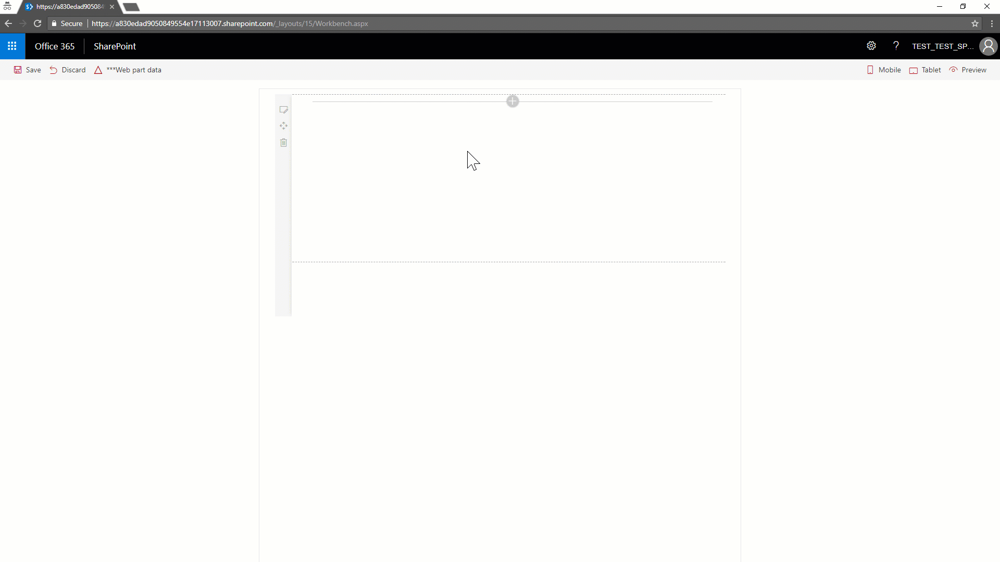
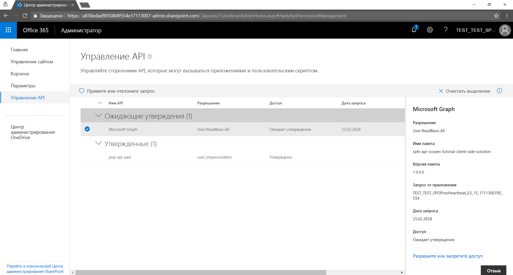

# <a name="tutorial-consuming-apis-secured-with-azure-active-directory-within-sharepoint-framework"></a><span data-ttu-id="d24d0-103">Руководство: использование API, защищенных с помощью Azure Active Directory, в SharePoint Framework</span><span class="sxs-lookup"><span data-stu-id="d24d0-103">Tutorial: Consuming APIs secured with Azure Active Directory within SharePoint Framework</span></span>

<span data-ttu-id="d24d0-104">Очень распространенный бизнес-сценарий для эффективных корпоративных решений — использование REST API, защищенного с помощью Azure Active Directory (Azure AD) и Open Authorization (OAuth 2.0), из решения SharePoint Framework, будь то клиентская веб-часть или расширение.</span><span class="sxs-lookup"><span data-stu-id="d24d0-104">A very common business scenario for enterprise-level and real-life solutions is to consume REST API secured with Azure Active Directory (Azure AD) and Open Authorization (OAuth 2.0) from within a SharePoint Framework solution, whether it is a client-side web part or an extension.</span></span>
<span data-ttu-id="d24d0-105">В SharePoint Framework 1.4.1 или более поздней версии доступен ряд встроенных возможностей, которые легко удовлетворят это бизнес-требование, позволяя использовать Microsoft Graph со специальным набором областей разрешений или любой другой REST API в качестве специальной службы, зарегистрированной в Azure AD.</span><span class="sxs-lookup"><span data-stu-id="d24d0-105">By using SharePoint Framework v.1.4.1 or later, you can leverage a set of out of the box capabilities to easily satisfy that business requirement, being able to consume either the Microsoft Graph, with a custom set of permission scopes, or any other REST API like a custom service registered in Azure AD.</span></span>

> [!IMPORTANT]
> <span data-ttu-id="d24d0-106">В настоящее время `AadHttpClient` и `MSGraphClient` предоставляются в ознакомительных целях и могут меняться.</span><span class="sxs-lookup"><span data-stu-id="d24d0-106">Usage of `AadHttpClient` and `MSGraphClient` is currently in preview status and subject to change.</span></span> <span data-ttu-id="d24d0-107">Не следует использовать эти возможности в рабочей среде.</span><span class="sxs-lookup"><span data-stu-id="d24d0-107">You should not use these capabilities in production environment.</span></span> <span data-ttu-id="d24d0-108">Кроме того, обратите внимание, что использование свойств `webApiPermissionRequests` в `package-solution.json` не поддерживается для обычных клиентов.</span><span class="sxs-lookup"><span data-stu-id="d24d0-108">Notice also that usage of `webApiPermissionRequests` properties in `package-solution.json` is not supported in normal tenants.</span></span>

> [!IMPORTANT]
> <span data-ttu-id="d24d0-109">Вы можете использовать Microsoft Graph с SharePoint Framework версии, предшествующей 1.4.1, применяя либо встроенный элемент **graphHttpClient** контекста SharePoint Framework, либо вручную реализованный неявный поток OAuth с помощью [ADAL JS](https://github.com/AzureAD/azure-activedirectory-library-for-js).</span><span class="sxs-lookup"><span data-stu-id="d24d0-109">You can consume the Microsoft Graph with versions of SharePoint Framework older than v1.4.1, either using the native **graphHttpClient** member of the SharePoint Framework context, or with a manually implemented implicit flow of OAuth by using [ADAL JS](https://github.com/AzureAD/azure-activedirectory-library-for-js).</span></span> <span data-ttu-id="d24d0-110">Однако первый подход привязан к предопределенному набору областей разрешений (то есть позволяет выполнять только задачи, предусмотренные корпорацией Майкрософт), а второй подход довольно сложен с точки зрения разработки.</span><span class="sxs-lookup"><span data-stu-id="d24d0-110">However, the former approach is bound to a pre-defined set of permissions scopes, which allow you to do nothing more that what have been defined by Microsoft, and the latter is a bit complex from a development perspective.</span></span> <span data-ttu-id="d24d0-111">Тем не менее в статье [Подключение к API, защищенному с помощью Azure Active Directory](https://docs.microsoft.com/ru-RU/sharepoint/dev/spfx/web-parts/guidance/connect-to-api-secured-with-aad) вы найдете дополнительные сведения о последнем сценарии.</span><span class="sxs-lookup"><span data-stu-id="d24d0-111">Nevertheless, for more information about the latter scenario, you can see the [Connect to API secured with Azure Active Directory](https://docs.microsoft.com/ru-RU/sharepoint/dev/spfx/web-parts/guidance/connect-to-api-secured-with-aad) article.</span></span>

<span data-ttu-id="d24d0-112">Из этого пошагового руководства вы узнаете, как создать решение SharePoint Framework со специальным набором областей разрешений, использующее Microsoft Graph.</span><span class="sxs-lookup"><span data-stu-id="d24d0-112">Reading this tutorial you will learn - through a step by step approach - how to create a SharePoint Framework solution that consumes the Microsoft Graph, with a custom set of permission scopes.</span></span>

> [!NOTE]
> <span data-ttu-id="d24d0-113">Чтобы лучше понять общую архитектуру этой возможности, можете ознакомиться со статьей [Подключение к API, защищенным службой Azure AD, в решениях SharePoint Framework](use-aadhttpclient.md).</span><span class="sxs-lookup"><span data-stu-id="d24d0-113">To better undestand the overall architecture of this capability, you can read the article [Connect to Azure AD secured APIs in SharePoint Framework solutions](use-aadhttpclient.md).</span></span>

## <a name="SolutionOverview"></a><span data-ttu-id="d24d0-114">Обзор решения</span><span class="sxs-lookup"><span data-stu-id="d24d0-114">Overview of the solution</span></span>
<span data-ttu-id="d24d0-115">Прежде чем углубляться в тонкости разработки решения, давайте рассмотрим в общих чертах, что мы будем создавать.</span><span class="sxs-lookup"><span data-stu-id="d24d0-115">Before digging into the detailed steps of developing the solution, let's have a quick overview of what you are going to build.</span></span>
<span data-ttu-id="d24d0-116">На приведенном ниже снимке экрана показан пользовательский интерфейс клиентской веб-части, с помощью которой можно искать пользователей в текущем клиенте.</span><span class="sxs-lookup"><span data-stu-id="d24d0-116">In the following screenshot, you can see the UI of a client-side web part that allows to search for users in the current tenant.</span></span> <span data-ttu-id="d24d0-117">Поиск основан на Microsoft Graph, и для него требуются разрешения не ниже *User.ReadBasic.All*.</span><span class="sxs-lookup"><span data-stu-id="d24d0-117">The search is based on the Microsoft Graph and requires at least the *User.ReadBasic.All* permission.</span></span>



<span data-ttu-id="d24d0-119">Как видите, с помощью этой клиентской веб-части можно искать пользователей по имени, а все подходящие пользователи отображаются с помощью компонента **DetailsList** из Office UI Fabric.</span><span class="sxs-lookup"><span data-stu-id="d24d0-119">As you can see, the client-side web part allows to search users based on their name, and provides all the matching users through a **DetailsList** component of Office UI Fabric.</span></span> <span data-ttu-id="d24d0-120">Кроме того, у веб-части есть настраиваемый параметр, доступный в области свойств, для выбора способа доступа к Microsoft Graph.</span><span class="sxs-lookup"><span data-stu-id="d24d0-120">Moreover, the web part has a configurable option, available in the property pane, to select how to access the Microsoft Graph.</span></span> <span data-ttu-id="d24d0-121">На самом деле, начиная с SharePoint Framework 1.4.1, вы можете получать доступ к Microsoft Graph при помощи собственного клиента Graph (**MSGraphClient**) или низкоуровневого типа для доступа к любому REST API, защищенному с помощью Azure AD (**AadHttpClient**).</span><span class="sxs-lookup"><span data-stu-id="d24d0-121">In fact, starting from SharePoint Framework v.1.4.1 you can access the Microsoft Graph either using the native graph client (**MSGraphClient**), or the low level type to access any Azure AD secured REST API (**AadHttpClient**).</span></span>

> [!NOTE]
> <span data-ttu-id="d24d0-122">Полный исходный код этого решения доступен в следующем репозитории GitHub: [spfx-api-scopes-tutorial](https://github.com/SharePoint/sp-dev-fx-webparts/tree/master/tutorials/spfx-api-scopes-tutorial).</span><span class="sxs-lookup"><span data-stu-id="d24d0-122">You can find the full source code of the sample solution in the following GitHub repository [spfx-api-scopes-tutorial](https://github.com/SharePoint/sp-dev-fx-webparts/tree/master/tutorials/spfx-api-scopes-tutorial).</span></span>

## <a name="CreatingTheSolution"></a><span data-ttu-id="d24d0-123">Создание решения</span><span class="sxs-lookup"><span data-stu-id="d24d0-123">Creating the solution</span></span>
<span data-ttu-id="d24d0-124">В последующих разделах представлено пошаговое руководство по созданию решения.</span><span class="sxs-lookup"><span data-stu-id="d24d0-124">In the following sections you will be able to build the solution with a step by step approach.</span></span> <span data-ttu-id="d24d0-125">Этот процесс состоит из следующих основных этапов:</span><span class="sxs-lookup"><span data-stu-id="d24d0-125">Here are the main sections of the process:</span></span>

* [<span data-ttu-id="d24d0-126">Создание исходного решения.</span><span class="sxs-lookup"><span data-stu-id="d24d0-126">Creating the initial solution</span></span>](#CreatingInitialSolution)
* [<span data-ttu-id="d24d0-127">Настройка базовых элементов веб-части.</span><span class="sxs-lookup"><span data-stu-id="d24d0-127">Configuring the base web part elements</span></span>](#ConfiguringBaseElements)
* [<span data-ttu-id="d24d0-128">Настройка запросов на получение разрешений API.</span><span class="sxs-lookup"><span data-stu-id="d24d0-128">Configuring the API permissions requests</span></span>](#ConfiguringApiPermissions)
* [<span data-ttu-id="d24d0-129">Использование Microsoft Graph.</span><span class="sxs-lookup"><span data-stu-id="d24d0-129">Consuming the Microsoft Graph</span></span>](#ConsumingTheGraph)
* [<span data-ttu-id="d24d0-130">Развертывание решения и предоставление разрешений.</span><span class="sxs-lookup"><span data-stu-id="d24d0-130">Solution deployment and permissions grant</span></span>](#DeploymentAndPermissionsGrant)
* [<span data-ttu-id="d24d0-131">Тестирование решения.</span><span class="sxs-lookup"><span data-stu-id="d24d0-131">Testing the solution</span></span>](#SolutionTesting)

<span data-ttu-id="d24d0-132">Если вы уже уверенно создаете решения SharePoint Framework, можете пропустить вступительные разделы и перейти непосредственно к разделу [Настройка запросов на получение разрешений API](#ConfiguringApiPermissions).</span><span class="sxs-lookup"><span data-stu-id="d24d0-132">If you are already confident creating SharePoint Framework solutions, you can skip the introductory sections and go straight to [Configuring the API permissions requests](#ConfiguringApiPermissions).</span></span>

### <a name="CreatingInitialSolution"></a><span data-ttu-id="d24d0-133">Создание исходного решения</span><span class="sxs-lookup"><span data-stu-id="d24d0-133">Creating the solution</span></span>
<span data-ttu-id="d24d0-134">Во-первых, если у вас установлена старая версия генератора SharePoint Framework, необходимо обновить ее до версии 1.4.1 или более поздней.</span><span class="sxs-lookup"><span data-stu-id="d24d0-134">First of all, if you have an old version of the SharePoint Framework generator, you need to update it to version 1.4.1 or newer.</span></span> <span data-ttu-id="d24d0-135">Для этого можно просто выполнить следующую команду:</span><span class="sxs-lookup"><span data-stu-id="d24d0-135">In order to do that, you can simply execute the following command:</span></span>

```sh
npm install -g @microsoft/generator-sharepoint
```

<span data-ttu-id="d24d0-136">В глобальном масштабе будет установлена последняя версия пакета.</span><span class="sxs-lookup"><span data-stu-id="d24d0-136">to globally install the most updated version of the package.</span></span>
<span data-ttu-id="d24d0-137">Затем необходимо создать решение SharePoint Framework, выполнив указанные ниже действия.</span><span class="sxs-lookup"><span data-stu-id="d24d0-137">Then, you need to create a new SharePoint Framework solution, going through the following steps:</span></span>

* <span data-ttu-id="d24d0-138">Создайте в файловой системе папку, где будет храниться исходный код решения, и измените текущий путь, указав эту папку.</span><span class="sxs-lookup"><span data-stu-id="d24d0-138">Create a folder in your file system, where you will store the source code of the solution and move the current path into that folder</span></span>
* <span data-ttu-id="d24d0-139">Запустите генератор Yeoman, чтобы выполнить скаффолдинг нового решения.</span><span class="sxs-lookup"><span data-stu-id="d24d0-139">Execute the Yeoman generator to scaffold a new solution</span></span>

```sh
yo @microsoft/sharepoint
```
* <span data-ttu-id="d24d0-140">Выберите следующие параметры:</span><span class="sxs-lookup"><span data-stu-id="d24d0-140">Select the following options</span></span>
    * <span data-ttu-id="d24d0-141">Укажите имя решения (например, *spfx-api-scopes-tutorial*).</span><span class="sxs-lookup"><span data-stu-id="d24d0-141">Provide a name for the solution (for example *spfx-api-scopes-tutorial*)</span></span>
    * <span data-ttu-id="d24d0-142">В качестве целевой среды укажите *SharePoint Online only (latest)* (Только SharePoint Online, последняя версия).</span><span class="sxs-lookup"><span data-stu-id="d24d0-142">Target the solution for: *SharePoint Online only (latest)*</span></span>
    * <span data-ttu-id="d24d0-143">Оставьте текущую папку.</span><span class="sxs-lookup"><span data-stu-id="d24d0-143">Use the current folder</span></span>
    * <span data-ttu-id="d24d0-144">Укажите, следует ли развертывать решение глобально в целевом клиенте.</span><span class="sxs-lookup"><span data-stu-id="d24d0-144">It is up to you whether you want to globally deploy the solution onto the target tenant or not</span></span>
    * <span data-ttu-id="d24d0-145">Выберите тип решения "WebPart".</span><span class="sxs-lookup"><span data-stu-id="d24d0-145">Select to create a WebPart</span></span>
    * <span data-ttu-id="d24d0-146">Назовите веб-часть *GraphConsumer*.</span><span class="sxs-lookup"><span data-stu-id="d24d0-146">Call the web part *GraphConsumer*</span></span>
    * <span data-ttu-id="d24d0-147">Добавьте описание.</span><span class="sxs-lookup"><span data-stu-id="d24d0-147">Provide a user-visible description of the drive.</span></span>
    * <span data-ttu-id="d24d0-148">Выберите React в качестве платформы разработки.</span><span class="sxs-lookup"><span data-stu-id="d24d0-148">Select to use React as the development framework</span></span>


* <span data-ttu-id="d24d0-150">Запустите Visual Studio Code (или другой редактор кода) в контексте текущей папки.</span><span class="sxs-lookup"><span data-stu-id="d24d0-150">Start Visual Studio Code (or whatever else is your favorite code editor) within the context of the current folder</span></span>

```sh
code .
```

### <a name="ConfiguringBaseElements"></a><span data-ttu-id="d24d0-151">Настройка базовых элементов веб-части</span><span class="sxs-lookup"><span data-stu-id="d24d0-151">Configuring the base web part elements</span></span>
<span data-ttu-id="d24d0-152">Настало время настроить исходные элементы клиентской веб-части.</span><span class="sxs-lookup"><span data-stu-id="d24d0-152">It's now time to configure the initial elements of the client-side web part.</span></span>

#### <a name="ConfigureCustomProperties"></a><span data-ttu-id="d24d0-153">Конфигурация настраиваемых свойств</span><span class="sxs-lookup"><span data-stu-id="d24d0-153">Configure custom properties</span></span>
<span data-ttu-id="d24d0-154">Создайте файл исходного кода в папке *src/webparts/graphConsumer/components* решения.</span><span class="sxs-lookup"><span data-stu-id="d24d0-154">Create a new source code file under the *src/webparts/graphConsumer/components* folder of the solution.</span></span>
<span data-ttu-id="d24d0-155">Назовите его *ClientMode.ts* и объявите объект TypeScript *enum* с доступными значениями свойства "Режим клиента" веб-части.</span><span class="sxs-lookup"><span data-stu-id="d24d0-155">Call the new file *ClientMode.ts* and use it to declare a TypeScript *enum* with the available options for the "Client Mode" property of the web part.</span></span>

```TS
export enum ClientMode {
    aad,
    graph,
}
```

<span data-ttu-id="d24d0-156">Теперь откройте файл *GraphConsumerWebPart.ts* в папке *src/webparts/graphConsumer* решения.</span><span class="sxs-lookup"><span data-stu-id="d24d0-156">Now, open the *GraphConsumerWebPart.ts* file in the *src/webparts/graphConsumer* folder of the solution.</span></span>
<span data-ttu-id="d24d0-157">Измените определение интерфейса **IGraphConsumerWebPartProps**, чтобы он принимал значение типа **ClientMode**.</span><span class="sxs-lookup"><span data-stu-id="d24d0-157">Change the definition of the **IGraphConsumerWebPartProps** interface in order to accept a value of type **ClientMode**.</span></span>

```TS
export interface IGraphConsumerWebPartProps {
  clientMode: ClientMode;
}
```

<span data-ttu-id="d24d0-158">Теперь обновите метод **getPropertyPaneConfiguration()** клиентской веб-части так, чтобы он поддерживал выбор вариантов в области свойств.</span><span class="sxs-lookup"><span data-stu-id="d24d0-158">Now update the **getPropertyPaneConfiguration()** method of the client-side web part, in order to support the choice selection in the property pane.</span></span> <span data-ttu-id="d24d0-159">Ниже представлена новая реализация этого метода.</span><span class="sxs-lookup"><span data-stu-id="d24d0-159">Here follows the new implementation of the method.</span></span>

```TS
  protected getPropertyPaneConfiguration(): IPropertyPaneConfiguration {
    return {
      pages: [
        {
          header: {
            description: strings.PropertyPaneDescription
          },
          groups: [
            {
              groupName: strings.BasicGroupName,
              groupFields: [
                PropertyPaneChoiceGroup('clientMode', {
                  label: strings.ClientModeLabel,
                  options: [
                    { key: ClientMode.aad, text: "AadHttpClient"},
                    { key: ClientMode.graph, text: "MSGraphClient"},
                  ]
                }),              
              ]
            }
          ]
        }
      ]
    };
  }
```

<span data-ttu-id="d24d0-160">Кроме того, необходимо обновить метод *render* клиентской веб-части, чтобы создавать должным образом настроенный экземпляр компонента React для отрисовки.</span><span class="sxs-lookup"><span data-stu-id="d24d0-160">Furthermore, you need to update the *render* method of the client-side web part, in order to create a properly configured instance of the React component for rendering.</span></span> <span data-ttu-id="d24d0-161">Ниже представлено определение метода обновления.</span><span class="sxs-lookup"><span data-stu-id="d24d0-161">Here follows the update method definition.</span></span>

```TS
  public render(): void {
    const element: React.ReactElement<IGraphConsumerProps > = React.createElement(
      GraphConsumer,
      {
        clientMode: this.properties.clientMode,
        context: this.context,
      }
    );

    ReactDom.render(element, this.domElement);
  }
```

<span data-ttu-id="d24d0-162">Напоследок, чтобы приведенный выше код работал, необходимо добавить операторы *import* в самом начале файла *GraphConsumerWebPart.ts*.</span><span class="sxs-lookup"><span data-stu-id="d24d0-162">Last but not least, in order to make the above code to work, you will need to add some *import* statements at the very beggining of the *GraphConsumerWebPart.ts* file.</span></span> <span data-ttu-id="d24d0-163">Ниже представлен обновленный раздел импорта для этого файла.</span><span class="sxs-lookup"><span data-stu-id="d24d0-163">Here follows the update section of imports for that file.</span></span>

```TS
import * as React from 'react';
import * as ReactDom from 'react-dom';
import { Version } from '@microsoft/sp-core-library';
import {
  BaseClientSideWebPart,
  IPropertyPaneConfiguration,
  PropertyPaneChoiceGroup
} from '@microsoft/sp-webpart-base';

import * as strings from 'GraphConsumerWebPartStrings';
import GraphConsumer from './components/GraphConsumer';
import { IGraphConsumerProps } from './components/IGraphConsumerProps';
import { ClientMode } from './components/ClientMode';
```

<span data-ttu-id="d24d0-164">Обратите внимание на импорт элемента управления **PropertyPaneChoiceGroup**, а также импорт перечисления **ClientMode**.</span><span class="sxs-lookup"><span data-stu-id="d24d0-164">Notice the import for the **PropertyPaneChoiceGroup** control, as well as the import of the **ClientMode** enum.</span></span>

#### <a name="UpdateResourceStrings"></a><span data-ttu-id="d24d0-165">Обновление строк ресурсов</span><span class="sxs-lookup"><span data-stu-id="d24d0-165">Update the resource strings</span></span>
<span data-ttu-id="d24d0-166">Чтобы скомпилировать решение, необходимо обновить файл *mystrings.d.ts* в папке *src/webparts/graphConsumer/loc* этого решения.</span><span class="sxs-lookup"><span data-stu-id="d24d0-166">In order to compile the solution, you will need to update the *mystrings.d.ts* file under the *src/webparts/graphConsumer/loc* folder of the solution.</span></span> <span data-ttu-id="d24d0-167">Потребуется заменить интерфейс, в котором определяется строка ресурсов, на следующий фрагмент кода:</span><span class="sxs-lookup"><span data-stu-id="d24d0-167">You will need to rewrite the interface defining the resources string with the following code excerpt:</span></span>

```TS
declare interface IGraphConsumerWebPartStrings {
  PropertyPaneDescription: string;
  BasicGroupName: string;
  ClientModeLabel: string;
  SearchFor: string;
  SearchForValidationErrorMessage: string;
}
```

<span data-ttu-id="d24d0-168">Теперь задайте нужные значения для новых строк ресурсов, обновив файл *en-us.js* в той же папке.</span><span class="sxs-lookup"><span data-stu-id="d24d0-168">Now configure proper values for the newly created resource strings, by updating the *en-us.js* file within the same folder.</span></span>

```TS
define([], function() {
  return {
    "PropertyPaneDescription": "Description",
    "BasicGroupName": "Group Name",
    "ClientModeLabel": "Client Mode",
    "SearchFor": "Search for",
    "SearchForValidationErrorMessage": "Invalid value for 'Search for' field"
  }
});
```

#### <a name="UpdateStyles"></a><span data-ttu-id="d24d0-169">Обновление стиля клиентской веб-части</span><span class="sxs-lookup"><span data-stu-id="d24d0-169">Update the style for the client-side web part</span></span>
<span data-ttu-id="d24d0-170">Как и в случае со строками ресурсов, также необходимо немного изменить файл стилей SCSS.</span><span class="sxs-lookup"><span data-stu-id="d24d0-170">As like as you did with the resource strings, you need to slightly update the SCSS style file, too.</span></span> <span data-ttu-id="d24d0-171">Для этого откройте файл *GraphConsumer.module.scss* в папке *src/webparts/graphConsumer/components* решения.</span><span class="sxs-lookup"><span data-stu-id="d24d0-171">Thus, open the *GraphConsumer.module.scss* under the *src/webparts/graphConsumer/components* folder of the solution.</span></span> <span data-ttu-id="d24d0-172">Добавьте следующие классы стилей сразу после класса *.title*:</span><span class="sxs-lookup"><span data-stu-id="d24d0-172">Add the following style classes, right after the *.title* class:</span></span>

```SCSS
  .form {
    @include ms-font-l;
    @include ms-fontColor-white;
  }

  label {
    @include ms-fontColor-white;
  }
```

#### <a name="UpdateReactComponent"></a><span data-ttu-id="d24d0-173">Обновление компонента React, отображающего веб-часть</span><span class="sxs-lookup"><span data-stu-id="d24d0-173">Update the React component rendering the web part</span></span>
<span data-ttu-id="d24d0-174">Теперь вы можете обновить компонент React **GraphConsumer** в папке *src/webparts/graphConsumer/components* решения.</span><span class="sxs-lookup"><span data-stu-id="d24d0-174">Now you can update the **GraphConsumer** React component under the *src/webparts/graphConsumer/components* folder of the solution.</span></span>
<span data-ttu-id="d24d0-175">Для начала необходимо обновить файл *IGraphConsumerProps.ts*, чтобы сделать возможным принятие настраиваемых свойств, необходимых для реализации веб-части.</span><span class="sxs-lookup"><span data-stu-id="d24d0-175">First of all, you need to update the *IGraphConsumerProps.ts* file in order to accept the custom properties required by the web part implementation.</span></span> <span data-ttu-id="d24d0-176">Ниже представлено обновленное содержимое файла *IGraphConsumerProps.ts*.</span><span class="sxs-lookup"><span data-stu-id="d24d0-176">Here you can see the updated content of the *IGraphConsumerProps.ts* file.</span></span>

```TS
import { WebPartContext } from '@microsoft/sp-webpart-base';
import { ClientMode } from './ClientMode';

export interface IGraphConsumerProps {
  clientMode: ClientMode;
  context: WebPartContext;
}
```
<span data-ttu-id="d24d0-177">Обратите внимание на импорт определения перечисления **ClientMode**, а также на импорт типа **WebPartContext**, который будет использоваться позже.</span><span class="sxs-lookup"><span data-stu-id="d24d0-177">Notice the import of the **ClientMode** enum definition, as well as the import of the **WebPartContext** type, that will be used later.</span></span>

<span data-ttu-id="d24d0-178">Создайте интерфейс для хранения состояния компонента React.</span><span class="sxs-lookup"><span data-stu-id="d24d0-178">Create a new interface to hold the React component state.</span></span> <span data-ttu-id="d24d0-179">Создайте файл в папке *src/webparts/graphConsumer/components* и назовите его *IGraphConsumerState.ts*.</span><span class="sxs-lookup"><span data-stu-id="d24d0-179">Create a new file in the *src/webparts/graphConsumer/components* folder and call it *IGraphConsumerState.ts*.</span></span> <span data-ttu-id="d24d0-180">Ниже представлено определение интерфейса.</span><span class="sxs-lookup"><span data-stu-id="d24d0-180">Here is the interface definition.</span></span>

```TS
import { IUserItem } from './IUserItem';

export interface IGraphConsumerState {
    users: Array<IUserItem>;
    searchFor: string;
  }
```

<span data-ttu-id="d24d0-181">Определите интерфейс **IUserItem** (в файле *IUserItem.ts*, хранящемся в папке *src/webparts/graphConsumer/components*).</span><span class="sxs-lookup"><span data-stu-id="d24d0-181">Define the **IUserItem** interface (within a file called *IUserItem.ts* stored in the *src/webparts/graphConsumer/components* folder).</span></span> <span data-ttu-id="d24d0-182">Этот интерфейс импортируется в файл состояния.</span><span class="sxs-lookup"><span data-stu-id="d24d0-182">That interface is imported in the state file.</span></span>

```TS
export interface IUserItem {
    displayName: string;
    mail: string;
    userPrincipalName: string;
  }
```

<span data-ttu-id="d24d0-183">Этот интерфейс будет использоваться для определения структуры пользователей, полученной из текущего клиента и привязанной к компоненту DetailsList в пользовательском интерфейсе.</span><span class="sxs-lookup"><span data-stu-id="d24d0-183">That interface will be used to define the outline of the users retrieved from the current tenant and bound to the DetailsList in the UI.</span></span>

<span data-ttu-id="d24d0-184">Пришло время обновить файл *GraphConsumer.tsx*.</span><span class="sxs-lookup"><span data-stu-id="d24d0-184">It's now time to update the *GraphConsumer.tsx* file.</span></span> <span data-ttu-id="d24d0-185">Для начала добавьте операторы для импорта определенных ранее типов.</span><span class="sxs-lookup"><span data-stu-id="d24d0-185">First of all, add some import statements to imports the types you defined early.</span></span>

```TS
import * as React from 'react';
import styles from './GraphConsumer.module.scss';
import * as strings from 'GraphConsumerWebPartStrings';
import { IGraphConsumerProps } from './IGraphConsumerProps';
import { IGraphConsumerState } from './IGraphConsumerState';
import { ClientMode } from './ClientMode';
import { IUserItem } from './IUserItem';
import { escape } from '@microsoft/sp-lodash-subset';

import {
  autobind,
  PrimaryButton,
  TextField,
  Label,
  DetailsList,
  DetailsListLayoutMode,
  CheckboxVisibility,
  SelectionMode
} from 'office-ui-fabric-react';

import { AadHttpClient } from "@microsoft/sp-http";
import { MSGraphClient } from "@microsoft/sp-client-preview";
```

<span data-ttu-id="d24d0-186">Обратите внимание на импорт компонентов **IGraphConsumerProps**, **IGraphConsumerState**, **ClientMode** и **IUserItem**.</span><span class="sxs-lookup"><span data-stu-id="d24d0-186">Notice the import for: **IGraphConsumerProps**, **IGraphConsumerState**, **ClientMode**, **IUserItem**.</span></span> <span data-ttu-id="d24d0-187">Кроме того, импортируются некоторые компоненты Office UI Fabric, используемые для отрисовки пользовательского интерфейса компонента React.</span><span class="sxs-lookup"><span data-stu-id="d24d0-187">Moreover, there are some imports for the Office UI Fabric components used to render the UI of the React component.</span></span>

<span data-ttu-id="d24d0-188">Сразу после операций импорта определите структуру столбцов для компонента **DetailsList** из Office UI Fabric.</span><span class="sxs-lookup"><span data-stu-id="d24d0-188">Right after the imports, define the outline of the columns for the **DetailsList** component of Office UI Fabric.</span></span>

```TS
// Configure the columns for the DetailsList component
let _usersListColumns = [
  {
    key: 'displayName',
    name: 'Display name',
    fieldName: 'displayName',
    minWidth: 50,
    maxWidth: 100,
    isResizable: true
  },
  {
    key: 'mail',
    name: 'Mail',
    fieldName: 'mail',
    minWidth: 50,
    maxWidth: 100,
    isResizable: true
  },
  {
    key: 'userPrincipalName',
    name: 'User Principal Name',
    fieldName: 'userPrincipalName',
    minWidth: 100,
    maxWidth: 200,
    isResizable: true
  },
];
```

<span data-ttu-id="d24d0-189">Определенный выше массив будет использоваться в параметрах компонента **DetailsList**, как видно по методу *render()* компонента React, который необходимо заменить на приведенный ниже фрагмент кода.</span><span class="sxs-lookup"><span data-stu-id="d24d0-189">The array defined above will be used in the settings of the **DetailsList** component, as you can see in the *render()* method of the React component, which you need to replace with the following code snippet.</span></span>

```TS
  public render(): React.ReactElement<IGraphConsumerProps> {
    return (
      <div className={ styles.graphConsumer }>
        <div className={ styles.container }>
          <div className={ styles.row }>
            <div className={ styles.column }>
              <span className={ styles.title }>Search for a user!</span>
              <p className={ styles.form }>
                <TextField 
                    label={ strings.SearchFor } 
                    required={ true } 
                    value={ this.state.searchFor }
                    onChanged={ this._onSearchForChanged }
                    onGetErrorMessage={ this._getSearchForErrorMessage }
                  />
              </p>
              <p className={ styles.form }>
                <PrimaryButton 
                    text='Search' 
                    title='Search' 
                    onClick={ this._search } 
                  />
              </p>
              {
                (this.state.users != null && this.state.users.length > 0) ?
                  <p className={ styles.form }>
                  <DetailsList
                      items={ this.state.users }
                      columns={ _usersListColumns }
                      setKey='set'
                      checkboxVisibility={ CheckboxVisibility.hidden }
                      selectionMode={ SelectionMode.none }
                      layoutMode={ DetailsListLayoutMode.fixedColumns }
                      compact={ true }
                  />
                </p>
                : null
              }
            </div>
          </div>
        </div>
      </div>
    );
  }
```

<span data-ttu-id="d24d0-190">Кроме того, обновите объявление типа компонента React и добавьте конструктор, скопировав приведенный ниже фрагмент кода.</span><span class="sxs-lookup"><span data-stu-id="d24d0-190">Moreover, update the React component type declaration and add a constructor, by miming the following code excerpt.</span></span>

```TS
export default class GraphConsumer extends React.Component<IGraphConsumerProps, IGraphConsumerState> {

  constructor(props: IGraphConsumerProps, state: IGraphConsumerState) {
    super(props);
    
    // Initialize the state of the component
    this.state = {
      users: [],
      searchFor: ""
    };
  }

```

<span data-ttu-id="d24d0-191">Для сбора критериев поиска компоненту **TextField** требуются некоторые правила проверки и обработчики событий.</span><span class="sxs-lookup"><span data-stu-id="d24d0-191">There are some validation rules and handling events for the **TextField** component to collect the search criteria.</span></span> <span data-ttu-id="d24d0-192">Ниже приведена реализация этих методов.</span><span class="sxs-lookup"><span data-stu-id="d24d0-192">Here are the methods implementations.</span></span>

```TS
  @autobind
  private _onSearchForChanged(newValue: string): void {

    // Update the component state accordingly to the current user's input
    this.setState({
      searchFor: newValue,
    });
  }

  private _getSearchForErrorMessage(value: string): string {
    // The search for text cannot contain spaces
    return (value == null || value.length == 0 || value.indexOf(" ") < 0)
      ? ''
      : `${strings.SearchForValidationErrorMessage}`;
  }
```

<span data-ttu-id="d24d0-193">Компонент **PrimaryButton** вызывает функцию *_search()*, которая определяет, какую клиентскую технологию использовать для Microsoft Graph.</span><span class="sxs-lookup"><span data-stu-id="d24d0-193">The **PrimaryButton** fires a *_search()* function, which determines what client technology to use in order to consume the Microsoft Graph.</span></span>

```TS
  @autobind
  private _search(): void {

    console.log(this.props.clientMode);

    // Based on the clientMode value search users
    switch (this.props.clientMode)
    {
      case ClientMode.aad:
        this._searchWithAad();
        break;
      case ClientMode.graph:
      this._searchWithGraph();
      break;
    }
  }
```

<span data-ttu-id="d24d0-194">Как видите, экземпляр компонента **DetailsList** отрисовывается в методе *render()* на тот случай, если в свойстве *users* состояния компонента имеются элементы.</span><span class="sxs-lookup"><span data-stu-id="d24d0-194">Lastly, as you can see, the **DetailsList** component instance is rendered in the *render()* method just in case there are items in the *users* property of the component's state.</span></span>

### <a name="ConfiguringApiPermissions"></a><span data-ttu-id="d24d0-195">Настройка запросов на получение разрешений API</span><span class="sxs-lookup"><span data-stu-id="d24d0-195">Configuring the API permissions requests</span></span>

<span data-ttu-id="d24d0-196">Чтобы решение могло использовать Microsoft Graph, а также другие сторонние REST API, в его манифесте необходимо явно объявить требуемые разрешения с точки зрения OAuth.</span><span class="sxs-lookup"><span data-stu-id="d24d0-196">In order to being able to consume the Microsoft Graph, as well as any other third party REST API, you will need to explicitly declare in the manifest of your solution what are the permission requirements from an OAuth perspective.</span></span>

<span data-ttu-id="d24d0-197">В SharePoint Framework 1.4.1 или более поздней версии для этого можно настроить свойство *webApiPermissionRequests* в файле *package-solution.json* из папки *config* в решении.</span><span class="sxs-lookup"><span data-stu-id="d24d0-197">In SharePoint Framework v.1.4.1 or later you can do that by configuring the *webApiPermissionRequests* property in the *package-solution.json* under the *config* folder of the solution.</span></span> <span data-ttu-id="d24d0-198">Ниже представлен фрагмент этого файла для текущего решения.</span><span class="sxs-lookup"><span data-stu-id="d24d0-198">Here you can see a sample excerpt of that file for the current solution.</span></span> <span data-ttu-id="d24d0-199">Достаточно скопировать объявление свойства *webApiPermissionRequests*.</span><span class="sxs-lookup"><span data-stu-id="d24d0-199">You will simply need to copy the declaration of the *webApiPermissionRequests* property.</span></span>

```JSON
{
  "$schema": "https://dev.office.com/json-schemas/spfx-build/package-solution.schema.json",
  "solution": {
    "name": "spfx-api-scopes-tutorial-client-side-solution",
    "id": "841cd609-d821-468d-a6e4-2d207b966cd8",
    "version": "1.0.0.0",
    "includeClientSideAssets": true,
    "skipFeatureDeployment": true,
    "webApiPermissionRequests": [
      {
        "resource": "Microsoft Graph",
        "scope": "User.ReadBasic.All"
      }
    ]
  },
  "paths": {
    "zippedPackage": "solution/spfx-api-scopes-tutorial.sppkg"
  }
}
```

<span data-ttu-id="d24d0-200">Обратите внимание на объект *webApiPermissionRequests*, представляющий собой массив элементов *webApiPermissionRequest*.</span><span class="sxs-lookup"><span data-stu-id="d24d0-200">Notice the *webApiPermissionRequests*, which is an array of *webApiPermissionRequest* items.</span></span> <span data-ttu-id="d24d0-201">Каждый элемент определяет *ресурс* и *область* для запроса на получение разрешений.</span><span class="sxs-lookup"><span data-stu-id="d24d0-201">Each item defines the *resource* and the *scope* of the permission request.</span></span>
<span data-ttu-id="d24d0-202">*Ресурсом* может быть имя или ObjectId (в Azure AD) ресурса, для которого требуется настроить запрос на получение разрешений.</span><span class="sxs-lookup"><span data-stu-id="d24d0-202">The *resource* can be the name or the ObjectId (in Azure AD) of the resource for which you want to configure the permission request.</span></span> <span data-ttu-id="d24d0-203">Для Microsoft Graph используется имя "Microsoft Graph", а значение ObjectId не уникально и зависит от клиента.</span><span class="sxs-lookup"><span data-stu-id="d24d0-203">For the Microsoft Graph the name is "Microsoft Graph", while the ObjectId is not unique and varies on a per tenant basis.</span></span>
<span data-ttu-id="d24d0-204">*Областью* может быть имя области разрешений или уникальный идентификатор этой области разрешений.</span><span class="sxs-lookup"><span data-stu-id="d24d0-204">The *scope* can be the name of the permission scope, or the unique ID of that permission scope.</span></span> <span data-ttu-id="d24d0-205">Это имя можно получить из документации для соответствующего API, а идентификатор должен быть указан в файле манифеста этого API.</span><span class="sxs-lookup"><span data-stu-id="d24d0-205">The former can be retrieved reading the documentation of the target API, while the latter can be retrieved reading the manifest file of the target API.</span></span>

> [!NOTE]
> <span data-ttu-id="d24d0-206">Все доступные области разрешений для Microsoft Graph перечислены в документе [Справочник по разрешениям Microsoft Graph](https://developer.microsoft.com/ru-RU/graph/docs/concepts/permissions_reference).</span><span class="sxs-lookup"><span data-stu-id="d24d0-206">For the Microsoft Graph you can find all the available permission scopes in the [Microsoft Graph permissions reference](https://developer.microsoft.com/ru-RU/graph/docs/concepts/permissions_reference) document.</span></span> <span data-ttu-id="d24d0-207">По умолчанию субъекту-службе не назначены явные разрешения на доступ к Microsoft Graph.</span><span class="sxs-lookup"><span data-stu-id="d24d0-207">By default, the service principal has no explicit permissions granted to access the Microsoft Graph.</span></span> <span data-ttu-id="d24d0-208">Однако, запросив маркер доступа для Microsoft Graph, вы получите маркер с областью разрешений `user_impersonation`, с помощью которой можно считывать сведения о пользователях (т. е. `User.Read.All`).</span><span class="sxs-lookup"><span data-stu-id="d24d0-208">If you would however request an access token for the Microsoft Graph, you would get a token with the `user_impersonation` permission scope, that can be used for reading information about the users (i.e. `User.Read.All`).</span></span> <span data-ttu-id="d24d0-209">Разработчики могут запрашивать дополнительные области разрешений, а администраторы клиентов — предоставлять их.</span><span class="sxs-lookup"><span data-stu-id="d24d0-209">Additional permission scopes can be requested by developers and granted by tenant administrators.</span></span> <span data-ttu-id="d24d0-210">Дополнительные сведения см. в справочной [статье, посвященной использованию AadHttpClient](use-aadhttpclient.md).</span><span class="sxs-lookup"><span data-stu-id="d24d0-210">For more information see the guidance [article on using the AadHttpClient](use-aadhttpclient.md).</span></span>


<span data-ttu-id="d24d0-211">Для поиска пользователей и получения свойств *displayName*, *mail* и *userPrincipalName* достаточно разрешения *User.ReadBasic.All*.</span><span class="sxs-lookup"><span data-stu-id="d24d0-211">In order to search for users and to retrieve their *displayName*, *mail*, and *userPrincipalName* the *User.ReadBasic.All* permission will suffice.</span></span>

<span data-ttu-id="d24d0-212">Позже мы упакуем и развернем решение, а вам (или администратору) потребуется предоставить запрашиваемые разрешения своему решению. Об этом рассказывается в разделе [Развертывание решения и предоставление разрешений](#DeploymentAndPermissionsGrant).</span><span class="sxs-lookup"><span data-stu-id="d24d0-212">Later you will package and deploy the solution, and you (or an admin) will have to grant the requested permissions to your solution, as you will learn in the section [Solution deployment and permissions grant](#DeploymentAndPermissionsGrant)</span></span>

### <a name="ConsumingTheGraph"></a><span data-ttu-id="d24d0-213">Использование Microsoft Graph</span><span class="sxs-lookup"><span data-stu-id="d24d0-213">Consuming the Microsoft Graph</span></span>
<span data-ttu-id="d24d0-214">Теперь вы можете реализовать методы для использования Microsoft Graph.</span><span class="sxs-lookup"><span data-stu-id="d24d0-214">You can now implement the methods to consume the Microsoft Graph.</span></span> <span data-ttu-id="d24d0-215">Как вы узнали из раздела [Обзор решения](#SolutionOverview), использовать Microsoft Graph можно двумя способами:</span><span class="sxs-lookup"><span data-stu-id="d24d0-215">As you saw reading the [Overview of the solution](#SolutionOverview) you have two options to consume the Microsoft Graph:</span></span>
* <span data-ttu-id="d24d0-216">с помощью клиентского объекта **AadHttpClient**;</span><span class="sxs-lookup"><span data-stu-id="d24d0-216">Using the **AadHttpClient** client object</span></span>
* <span data-ttu-id="d24d0-217">с помощью клиентского объекта **MSGraphClient**.</span><span class="sxs-lookup"><span data-stu-id="d24d0-217">Using the **MSGraphClient** client object</span></span>

<span data-ttu-id="d24d0-218">Первый представляет собой клиентский объект, удобный для использования любого REST API.</span><span class="sxs-lookup"><span data-stu-id="d24d0-218">The former is a client object useful to consume whatever REST API.</span></span> <span data-ttu-id="d24d0-219">Следовательно, с его помощью можно использовать Microsoft Graph, а также любой другой сторонний (или встроенный) REST API.</span><span class="sxs-lookup"><span data-stu-id="d24d0-219">Thus you can use it to consume the Microsoft Graph, as well as any other third party (or first party) REST API.</span></span>
<span data-ttu-id="d24d0-220">Второй клиентской объект подходит только для использования Microsoft Graph.</span><span class="sxs-lookup"><span data-stu-id="d24d0-220">The latter is a client object that can consume the Microsoft Graph only.</span></span> <span data-ttu-id="d24d0-221">Он использует клиентский объект **AadHttpClient** и поддерживает текучий синтаксис пакета SDK Microsoft Graph.</span><span class="sxs-lookup"><span data-stu-id="d24d0-221">Internally it uses the **AadHttpClient** client object and supports the fluent syntax of the Microsoft Graph SDK.</span></span>

#### <a name="AadHttpClient"></a><span data-ttu-id="d24d0-222">Использование AadHttpClient</span><span class="sxs-lookup"><span data-stu-id="d24d0-222">Using AadHttpClient</span></span>
<span data-ttu-id="d24d0-223">Чтобы использовать любой REST API с помощью клиентского объекта **AadHttpClient**, достаточно создать экземпляр типа **AadHttpClient**, указав свойство *serviceScope* контекста и URI целевой службы.</span><span class="sxs-lookup"><span data-stu-id="d24d0-223">In order to consume any REST API using the **AadHttpClient** client object, you simply need to create a new instance of the **AadHttpClient** type, providing the *serviceScope* of the current context, and the URI of the target service.</span></span>
<span data-ttu-id="d24d0-224">Созданный объект предоставит следующие методы:</span><span class="sxs-lookup"><span data-stu-id="d24d0-224">The object created will provide you methods to make the following:</span></span>
* <span data-ttu-id="d24d0-225">*get* (отправляет HTTP-запрос GET);</span><span class="sxs-lookup"><span data-stu-id="d24d0-225">*get*: makes an HTTP GET request</span></span>
* <span data-ttu-id="d24d0-226">*post* (отправляет HTTP-запрос POST);</span><span class="sxs-lookup"><span data-stu-id="d24d0-226">*post*: makes an HTTP POST request</span></span>
* <span data-ttu-id="d24d0-227">*fetch* (отправляет любой HTTP-запрос в зависимости от указанных аргументов *HttpClientConfiguration* и *IHttpClientOptions*).</span><span class="sxs-lookup"><span data-stu-id="d24d0-227">*fetch*: makes any other kind of HTTP request, based on the *HttpClientConfiguration* and *IHttpClientOptions* arguments provided.</span></span>

<span data-ttu-id="d24d0-228">Все эти методы поддерживают асинхронную модель разработки с использованием JavaScript и TypeScript, поэтому вы можете обрабатывать их результаты с помощью обещаний.</span><span class="sxs-lookup"><span data-stu-id="d24d0-228">All these methods support the asynchronous development model of JavaScript/TypeScript and so you can handle their result with promises.</span></span>

<span data-ttu-id="d24d0-229">Ниже представлен фрагмент кода метода *_searchWithAad()* из нашего примера решения.</span><span class="sxs-lookup"><span data-stu-id="d24d0-229">Here you can see a code excerpt of the *_searchWithAad()* method of the current sample solution.</span></span>

```TS
  private _searchWithAad(): void {

    // Log the current operation
    console.log("Using _searchWithAad() method");

    // Using Graph here, but any 1st or 3rd party REST API that requires Azure AD auth can be used here.
    const aadClient: AadHttpClient = new AadHttpClient(
      this.props.context.serviceScope,
      "https://graph.microsoft.com"
    );

    // Search for the users with givenName, surname, or displayName equal to the searchFor value
    aadClient
      .get(
        `https://graph.microsoft.com/v1.0/users?$select=displayName,mail,userPrincipalName&$filter=(givenName%20eq%20'${escape(this.state.searchFor)}')%20or%20(surname%20eq%20'${escape(this.state.searchFor)}')%20or%20(displayName%20eq%20'${escape(this.state.searchFor)}')`,
        AadHttpClient.configurations.v1
      )
      .then(response => {
        return response.json();
      })
      .then(json => {

        // Prepare the output array
        var users: Array<IUserItem> = new Array<IUserItem>();

        // Log the result in the console for testing purposes
        console.log(json);

        // Map the JSON response to the output array
        json.value.map((item: any) => {
          users.push( { 
            displayName: item.displayName,
            mail: item.mail,
            userPrincipalName: item.userPrincipalName,
          });
        });

        // Update the component state accordingly to the result
        this.setState(
          {
            users: users,
          }
        );
      })
      .catch(error => {
        console.error(error);
      });
  }
```

<span data-ttu-id="d24d0-230">Как видите, метод *get()* получает URL-адрес запроса OData в качестве входного параметра, а в случае успешного запроса возвращает объект JSON с откликом.</span><span class="sxs-lookup"><span data-stu-id="d24d0-230">As you can see, the *get()* method gets the URL of the OData request as the input argument, and in case of successful request will return a JSON object with the response.</span></span>

#### <a name="MSGraphClient"></a><span data-ttu-id="d24d0-231">Использование MSGraphClient</span><span class="sxs-lookup"><span data-stu-id="d24d0-231">Using MSGraphClient</span></span>
<span data-ttu-id="d24d0-232">Если планируете применять Microsoft Graph, можно воспользоваться клиентским объектом **MSGraphClient**, который предоставляет более текучий синтаксис.</span><span class="sxs-lookup"><span data-stu-id="d24d0-232">If you are targeting the Microsoft Graph, you can use the **MSGraphClient** client object, which provides you a more fluent syntax.</span></span>
<span data-ttu-id="d24d0-233">В приведенном ниже фрагменте кода показана фактическая реализация метода *_searchWithGraph()* из нашего примера решения.</span><span class="sxs-lookup"><span data-stu-id="d24d0-233">In the following code excerpt you can see the actual implementation of the *_searchWithGraph()* method of the current sample solution.</span></span>

```TS
  private _searchWithGraph(): void {

    // Log the current operation
    console.log("Using _searchWithGraph() method");

    const graphClient: MSGraphClient = this.props.context.serviceScope.consume(
      MSGraphClient.serviceKey
    );

    // From https://github.com/microsoftgraph/msgraph-sdk-javascript sample
    graphClient
      .api("users")
      .version("v1.0")
      .select("displayName,mail,userPrincipalName")
      .filter(`(givenName eq '${escape(this.state.searchFor)}') or (surname eq '${escape(this.state.searchFor)}') or (displayName eq '${escape(this.state.searchFor)}')`)
      .get((err, res) => {  

        if (err) {
          console.error(err);
          return;
        }

        // Prepare the output array
        var users: Array<IUserItem> = new Array<IUserItem>();

        // Map the JSON response to the output array
        res.value.map((item: any) => {
          users.push( { 
            displayName: item.displayName,
            mail: item.mail,
            userPrincipalName: item.userPrincipalName,
          });
        });

        // Update the component state accordingly to the result
        this.setState(
          {
            users: users,
          }
        );
      });
  }
```

<span data-ttu-id="d24d0-234">Чтобы создать экземпляр типа **MSGraphClient**, передайте его ключ службы методу *consume()* объекта *serviceScope* для текущего контекста.</span><span class="sxs-lookup"><span data-stu-id="d24d0-234">You create an instance of the **MSGraphClient** type by providing its service key to the *consume()* method of the current context's *serviceScope*.</span></span>
<span data-ttu-id="d24d0-235">Затем просто используйте текучий API из пакета SDK Graph, чтобы определить запрос OData, который будет выполняться для целевой конечной точки Microsoft Graph.</span><span class="sxs-lookup"><span data-stu-id="d24d0-235">Then, you simply use the fluent API of the Graph SDK to define the OData query that will be executed against the target Microsoft Graph endpoint.</span></span>
<span data-ttu-id="d24d0-236">В результате вы также получите отклик JSON, который потребуется раскодировать и сопоставить с типизированным результатом.</span><span class="sxs-lookup"><span data-stu-id="d24d0-236">The result will still be a JSON response that you will have to decode and map to the typed result.</span></span>

> [!NOTE]
> <span data-ttu-id="d24d0-237">Вы даже можете воспользоваться полностью типизированным подходом с использованием [типов TypeScript Microsoft Graph](https://github.com/microsoftgraph/msgraph-typescript-typings).</span><span class="sxs-lookup"><span data-stu-id="d24d0-237">You can even use a fully typed approach leveraging the [Microsoft Graph TypeScript types](https://github.com/microsoftgraph/msgraph-typescript-typings).</span></span>

### <a name="DeploymentAndPermissionsGrant"></a><span data-ttu-id="d24d0-238">Развертывание решения и предоставление разрешений</span><span class="sxs-lookup"><span data-stu-id="d24d0-238">Solution deployment and permissions grant</span></span>
<span data-ttu-id="d24d0-239">Теперь все готово к сборке, компоновке, упаковыванию и развертыванию решения.</span><span class="sxs-lookup"><span data-stu-id="d24d0-239">You are now ready to build, bundle, package, and deploy the solution.</span></span>
<span data-ttu-id="d24d0-240">Выполните команды gulp, чтобы выполнить эти задачи.</span><span class="sxs-lookup"><span data-stu-id="d24d0-240">Run the gulp commands to accomplish this tasks.</span></span>

```sh
gulp build
```

<span data-ttu-id="d24d0-241">Проверьте сборку решения.</span><span class="sxs-lookup"><span data-stu-id="d24d0-241">Just to see if the solution build properly.</span></span>

```sh
gulp bundle
gulp package-solution
```

<span data-ttu-id="d24d0-242">Скомпонуйте и упакуйте решение.</span><span class="sxs-lookup"><span data-stu-id="d24d0-242">To bundle and package the solution.</span></span>
<span data-ttu-id="d24d0-243">Теперь перейдите к каталогу приложений целевого клиента и отправьте в него пакет решения.</span><span class="sxs-lookup"><span data-stu-id="d24d0-243">Now, browse to the app catalog of your target tenant and upload the solution package in there.</span></span> <span data-ttu-id="d24d0-244">Пакет решения находится в папке *sharepoint/solution* решения.</span><span class="sxs-lookup"><span data-stu-id="d24d0-244">You can find the solution package under the *sharepoint/solution* folder of your solution.</span></span> <span data-ttu-id="d24d0-245">Это SPPKG-файл.</span><span class="sxs-lookup"><span data-stu-id="d24d0-245">It is the .sppkg file.</span></span>
<span data-ttu-id="d24d0-246">После отправки пакета решения в каталоге приложений откроется примерно такое диалоговое окно:</span><span class="sxs-lookup"><span data-stu-id="d24d0-246">Once you upload the solution package, the app catalog will prompt you with a dialog like the following one.</span></span>


<span data-ttu-id="d24d0-248">Как видите, в нижней части экрана отображается сообщение о том, что для пакета решения необходимо утвердить разрешения.</span><span class="sxs-lookup"><span data-stu-id="d24d0-248">As you can see, there is a message in the lower area of the screen that informs you that the solution package requires permissions approval.</span></span> <span data-ttu-id="d24d0-249">Это вызвано свойством webApiPermissionRequests в файле *package-solution.json*.</span><span class="sxs-lookup"><span data-stu-id="d24d0-249">That's because of the webApiPermissionRequests property in the *package-solution.json* file.</span></span>

<span data-ttu-id="d24d0-250">Откройте Центр администрирования SharePoint и перейдите по ссылке "Попробуйте новый Центр администрирования SharePoint" в правом верхнем углу экрана.</span><span class="sxs-lookup"><span data-stu-id="d24d0-250">Open the SharePoint Admin Center of your tenant, and select to "Try the new SharePoint admin center", in the upper right corner of the screen.</span></span>


<span data-ttu-id="d24d0-252">В новом Центре администрирования выберите пункт меню "\*Управление WebApiPermission" в меню быстрого запуска слева.</span><span class="sxs-lookup"><span data-stu-id="d24d0-252">In the new Admin Center select the \*WebApiPermission management" menu item, in the left quick launch menu.</span></span> <span data-ttu-id="d24d0-253">Откроется примерно такая страница:</span><span class="sxs-lookup"><span data-stu-id="d24d0-253">You will see a page like the following one.</span></span>


> [!NOTE]
> <span data-ttu-id="d24d0-255">Звездочки в пользовательском интерфейсе нового Центра администрирования указывают на то, что функции по-прежнему находятся на стадии предварительного тестирования.</span><span class="sxs-lookup"><span data-stu-id="d24d0-255">The asterisks in the UI of the new Admin Center imply that the functionalities are still under preview.</span></span>

<span data-ttu-id="d24d0-256">На этой странице вы (или любой другой администратор клиента SPO) можете утвердить или отклонить любой запрос на получение разрешений, ожидающий проверки.</span><span class="sxs-lookup"><span data-stu-id="d24d0-256">Using this page you (or any other admin of your SPO tenant) can Approve or Deny any pending permission request.</span></span> <span data-ttu-id="d24d0-257">Обратите внимание: на ней не видно, какой пакет решения запрашивает разрешение, так как разрешения определяются на уровне клиента и для уникального приложения.</span><span class="sxs-lookup"><span data-stu-id="d24d0-257">Notice that here you don't see which solution package is requesting which permission, because the permissions are defined at tenant level and for a unique application.</span></span> 

> [!NOTE]
> <span data-ttu-id="d24d0-258">Дополнительные сведения о принципе работы областей разрешений на уровне клиента вы найдете в статьях, указанных в разделе [См. также](#SeeAlso).</span><span class="sxs-lookup"><span data-stu-id="d24d0-258">For further details about how the tenant-level permission scopes work internally, you can read the articles highlighted in the [See also](#SeeAlso) section.</span></span>

<span data-ttu-id="d24d0-259">Выберите разрешение, запрашиваемое в файле решения *package-solution.json*, выберите пункт "Утверждение или отклонение прав доступа" и нажмите "Утвердить" в области справа, как показано на приведенном ниже снимке экрана.</span><span class="sxs-lookup"><span data-stu-id="d24d0-259">Select the permission that you requested in the *package-solution.json* file of your solution, click on "Approve or reject access" and click "Approve", through the right-side panel that you see in the following screenshot.</span></span>



<span data-ttu-id="d24d0-261">Вы также можете выбрать разрешение, ожидающее утверждения, и нажать кнопку "Утвердить или отклонить" на панели инструментов.</span><span class="sxs-lookup"><span data-stu-id="d24d0-261">You can also select thhe pending approval permission item, and click on the "Approve or reject" button in the toolbar.</span></span>


<span data-ttu-id="d24d0-263">Готово!</span><span class="sxs-lookup"><span data-stu-id="d24d0-263">And you are now ready to go!</span></span>

### <a name="SolutionTesting"></a><span data-ttu-id="d24d0-264">Тестирование решения</span><span class="sxs-lookup"><span data-stu-id="d24d0-264">Testing the solution</span></span>
<span data-ttu-id="d24d0-265">Запустите решение с помощью следующей команды gulp:</span><span class="sxs-lookup"><span data-stu-id="d24d0-265">Run your solution by using the following gulp command:</span></span>

```sh
gulp serve --nobrowser
```

<span data-ttu-id="d24d0-266">Откройте браузер и перейдите на страницу SharePoint Framework Workbench по следующему URL-адресу:</span><span class="sxs-lookup"><span data-stu-id="d24d0-266">Open the browser and browse to the SharePoint Framework Workbench page, which can be found at the following URL:</span></span>

```TXT
https://<your-tenant>.sharepoint.com/_layouts/15/Workbench.aspx
```

<span data-ttu-id="d24d0-267">Добавьте клиентскую веб-часть *GraphConsumer*, выберите *Режим клиента* и попробуйте найти пользователей.</span><span class="sxs-lookup"><span data-stu-id="d24d0-267">Add the *GraphConsumer* client-side web part, configure the *Client Mode* and search for users.</span></span>
<span data-ttu-id="d24d0-268">При первом запросе всплывающее окно должно сначала появиться, а затем пропасть.</span><span class="sxs-lookup"><span data-stu-id="d24d0-268">The first request you will make, you will see a pop-up window popping out and then disappearing.</span></span> <span data-ttu-id="d24d0-269">Это окно входа, используемое библиотекой ADAL JS, с помощью которой SharePoint Framework получает маркер доступа из Azure AD, применяя неявный поток OAuth.</span><span class="sxs-lookup"><span data-stu-id="d24d0-269">That's the logon window used by ADAL JS, which is internally used by the SharePoint Framework to retrieve the Access Token from Azure AD using and OAuth implicit flow.</span></span>


<span data-ttu-id="d24d0-271">Вот и все!</span><span class="sxs-lookup"><span data-stu-id="d24d0-271">And that's it!</span></span> <span data-ttu-id="d24d0-272">С помощью этой возможности вы можете создавать эффективные корпоративные решения, использующие REST API, защищенный с помощью Azure AD.</span><span class="sxs-lookup"><span data-stu-id="d24d0-272">Enjoy this capability building real-life enterprise-level solutions that leverage Azure AD-secured REST API.</span></span>

<a name="SeeAlso"></a>

## <a name="see-also"></a><span data-ttu-id="d24d0-273">См. также</span><span class="sxs-lookup"><span data-stu-id="d24d0-273">See also</span></span>
* [<span data-ttu-id="d24d0-274">Подключение к API, защищенным службой Azure AD, в решениях SharePoint Framework</span><span class="sxs-lookup"><span data-stu-id="d24d0-274">Connect to Azure AD-secured APIs in SharePoint Framework solutions</span></span>](use-aadhttpclient.md)
* [<span data-ttu-id="d24d0-275">Использование MSGraphClient для подключения к Microsoft Graph</span><span class="sxs-lookup"><span data-stu-id="d24d0-275">Use the MSGraphClient to connect to Microsoft Graph</span></span>](use-msgraph.md)
