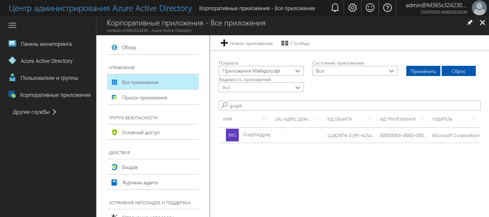
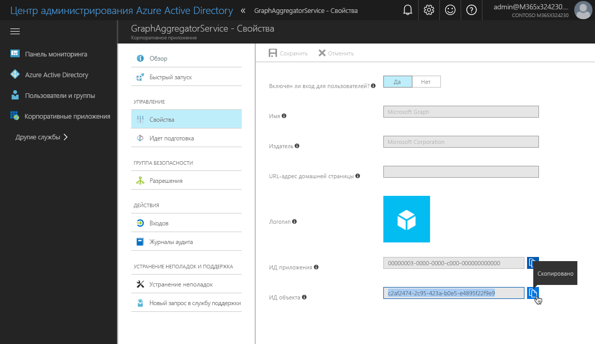
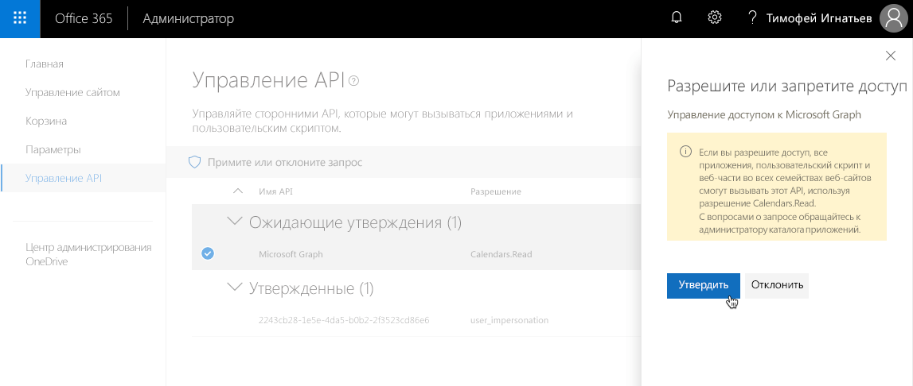

# <a name="connect-to-azure-ad-secured-apis-in-sharepoint-framework-solutions"></a>Подключение к API, защищенным службой Azure AD, в решениях SharePoint Framework

При создании решений SharePoint Framework может потребоваться подключиться к API, защищенному службой Azure Active Directory. На платформе SharePoint Framework можно указать, какие разрешения и приложения Azure AD необходимы вашему решению, а администратор клиента может предоставить необходимые разрешения, если они еще не предоставлены. С помощью **AadHttpClient** вы можете легко подключаться к API, защищенным службой Azure AD, не реализуя поток OAuth самостоятельно.

> [!IMPORTANT]
> В настоящее время `AadHttpClient` и `MSGraphClient` предоставляются в ознакомительных целях и могут меняться. Не следует использовать эти возможности в рабочей среде. Кроме того, обратите внимание, что использование свойств `webApiPermissionRequests` в `package-solution.json` не поддерживается для обычных клиентов.


## <a name="web-api-permissions---concept-overview"></a>Разрешения веб-API: обзор концепции

Azure Active Directory защищает ряд ресурсов, начиная с самой среды Office 365 и заканчивая специальными бизнес-приложениями, созданными в организации. Чтобы подключаться к этим ресурсам, приложению необходимо получить действительный маркер доступа для определенного ресурса. Приложение может получить маркер доступа в ходе [потока авторизации OAuth](https://docs.microsoft.com/ru-RU/azure/active-directory/develop/active-directory-protocols-oauth-code). Клиентские приложения, например решения SharePoint Framework, которые не могут хранить секрет, используют специальный вариант потока OAuth, называемый [неявным потоком OAuth](https://docs.microsoft.com/ru-RU/azure/active-directory/develop/active-directory-dev-understanding-oauth2-implicit-grant).

Разработчики клиентских решений несут ответственность за реализацию авторизации с использованием неявного потока OAuth в своем приложении. В решениях SharePoint Framework это уже сделано на уровне платформы с помощью объектов **MSGraphClient** и **AadHttpClient**, появившихся в SharePoint Framework 1.4.1.

> [!NOTE]
> Если вы создаете решения на платформе SharePoint Framework версии ниже 1.4.1, вы все еще можете подключаться к ресурсам, защищенным службой Azure AD. В этом случае необходимо самостоятельно реализовать неявный поток OAuth с помощью [ADAL JS](https://github.com/AzureAD/azure-activedirectory-library-for-js). Дополнительные сведения см. в статье [Подключение к API, защищенному с помощью Azure Active Directory](https://docs.microsoft.com/ru-RU/sharepoint/dev/spfx/web-parts/guidance/connect-to-api-secured-with-aad).

В рамках SharePoint Framework определен специальный процесс, с помощью которого разработчики могут запрашивать разрешения на доступ к ресурсам, защищенным с помощью Azure AD, а администраторы клиента — управлять ими. Приведенная ниже схема иллюстрирует этот процесс.


Разработчики решения SharePoint Framework, которому требуется доступ к определенным ресурсам, защищенным с помощью Azure AD, указывают эти ресурсы вместе с необходимыми областями разрешений в манифесте решения (1). SharePoint при развертывании пакета решения в каталоге приложений создает запросы на получение разрешений и предлагает администратору управлять запрашиваемыми разрешениями (2). Администраторы клиента могут решить, следует ли предоставлять каждое из запрашиваемых разрешений (3).

Все разрешения предоставляются всему клиенту, а не только тому приложению, которое их запрашивает. Когда администратор клиента предоставляет определенное разрешение, оно добавляется в приложение Azure AD **Расширение клиента SharePoint Online**, которое подготавливается корпораций Майкрософт в каждой службе Azure Active Directory и используется платформой SharePoint Framework в потоке OAuth для предоставления решений с действительными маркерами доступа.

## <a name="discover-available-applications-and-permissions"></a>Определение доступных приложений и разрешений

То, для каких приложений запрашиваются разрешения, зависит от целевой службы Azure Active Directory, которая защищает клиент Office 365. Список доступных приложений может зависеть от лицензии на Office 365, используемой в организации, и от того, какие бизнес-приложения зарегистрированы в ее службе Azure AD. При условии, что у вас есть необходимые разрешения, вы можете несколькими способами определить, какие приложения и области разрешений доступны в клиенте.

### <a name="azure-portal"></a>Портал Azure

Один из способов просмотреть список приложений, доступных в Azure Active Directory, — перейти на портал Azure ([https://portal.azure.com](https://portal.azure.com)) или в центр администрирования Azure Active Directory ([https://aad.portal.azure.com](https://aad.portal.azure.com)).

Открыв портал, выберите в меню пункт **Корпоративные приложения**.


В колонке **Корпоративные приложения** щелкните ссылку **Все приложения** в группе **Управление**.


Чтобы быстрее найти приложение, к которому требуется подключиться, выполните фильтрацию по типу приложения (_Приложения Майкрософт_ или _Корпоративные приложения_) либо поиск по имени или идентификатору.

Например, если вам нужно запросить дополнительные разрешения для Microsoft Graph, введите в поле поиска запрос `graph`.



Когда вы найдете приложение, щелкните его, чтобы получить дополнительные сведения о нем. В колонке приложения щелкните ссылку **Свойства** в группе **Управление**, чтобы открыть свойства приложения.


В списке свойств скопируйте значение свойства **ИД объекта**, необходимое, чтобы запросить дополнительные области разрешений для Microsoft Graph. Кроме того, вы можете скопировать **имя** приложения и использовать его в запросе на получение разрешений.



> [!NOTE]
> Свойство **ИД объекта** уникально для каждого клиента, но во всех клиентах используется одно и то же **имя**. Если вам нужно собрать решение один раз и развернуть его в разных клиентах, следует использовать **имя**, запрашивая дополнительные разрешения в решении.

### <a name="powershell"></a>PowerShell

> [!NOTE]
> Прежде чем выполнять описанные ниже действия, необходимо установить [Azure PowerShell](https://docs.microsoft.com/en-us/powershell/azure/install-azurerm-ps?view=azurermps-5.1.1). Кроме того, вы можете выполнять приведенные в этом разделе командлеты в Azure Cloud Shell PowerShell.

Для начала войдите в свою учетную запись подписки на Azure, выполнив в PowerShell следующую команду (это необязательно, если используется Azure Cloud Shell):

```powershell
Login-AzureRmAccount
```

Затем введите следующую команду, чтобы получить список приложений, доступных в клиенте:

```powershell
Get-AzureRmADServicePrincipal | sort DisplayName | ft DisplayName, Id
```

При выполнении этого командлета возвращается список всех приложений, доступных в клиенте, а для каждого приложения выводятся отображаемое имя и ИД объекта, которые можно использовать в решении SharePoint Framework, чтобы запрашивать разрешения приложения.

### <a name="azure-cli"></a>Azure CLI

> [!NOTE]
> Прежде чем выполнять описанные ниже действия, необходимо установить [Azure CLI](https://docs.microsoft.com/en-us/cli/azure/install-azure-cli?view=azure-cli-latest). Кроме того, вы можете запустить Azure CLI через [Azure Cloud Shell](https://docs.microsoft.com/en-us/azure/cloud-shell/overview?view=azure-cli-latest) или в качестве [контейнера Docker](https://hub.docker.com/r/microsoft/azure-cli/).

Если интерфейс командной строки работает на вашем компьютере или в контейнере Docker, для начала подключитесь к своей подписке на Azure с помощью следующей команды:

```sh
azure login
```

После подключения выполните следующую команду, чтобы получить список всех доступных приложений Azure AD:

```sh
azure ad sp list --query "sort_by([*].{displayName: displayName, objectId: objectId}, &displayName)" -o table
```

При выполнении этой команды появится список всех доступных в клиенте приложений Azure AD, отсортированный по свойству displayName. Эта команда выводит displayName и objectId каждого приложения. Кроме того, выходные данные форматируются в виде таблицы.

### <a name="get-the-list-of-permission-scopes-exposed-by-the-application"></a>Получение списка областей разрешений, предоставляемых приложением

Каждое приложение Azure AD предоставляет ряд областей разрешений. Зачастую они относятся к определенным ресурсам или операциям в приложении. Чтобы получить список доступных разрешений для приложения, к которому требуется подключиться, ознакомьтесь с документацией к нему. Список областей разрешений, доступных в Microsoft Graph, представлен на следующей странице: [https://developer.microsoft.com/ru-ru/graph/docs/concepts/permissions_reference](https://developer.microsoft.com/ru-RU/graph/docs/concepts/permissions_reference).

## <a name="request-permissions-to-an-azure-active-directory-application"></a>Запрашивание разрешений для приложения Azure Active Directory

Если вашему решению SharePoint Framework требуются разрешения для определенных ресурсов, защищенных с помощью Azure Active Directory, например Microsoft Graph или корпоративных приложений, вы можете указывать эти ресурсы вместе с необходимыми разрешениями в конфигурации решения. Для этого в проекте SharePoint Framework откройте файл **config/package-solution.json** и добавьте к свойству **solution** свойство **webApiPermissionRequests**, в котором указаны все ресурсы и соответствующие разрешения, необходимые решению. Ниже представлен пример решения SharePoint Framework, запрашивающего доступ на чтение календарей пользователей с помощью Microsoft Graph.

```json
{
  "$schema": "https://dev.office.com/json-schemas/spfx-build/package-solution.schema.json",
  "solution": {
    "name": "spfx-graph-client-side-solution",
    "id": "5d16587c-5e87-44d7-b658-1148988f212a",
    "version": "1.0.0.0",
    "includeClientSideAssets": true,
    "skipFeatureDeployment": true,
    "webApiPermissionRequests": [
      {
        "resource": "Microsoft Graph",
        "scope": "Calendars.Read"
      }
    ]
  },
  "paths": {
    "zippedPackage": "solution/spfx-graph.sppkg"
  }
}
```

> [!NOTE]
> В качестве значения свойства **resource** можно указать либо **displayName**, либо **objectId** приложения, для которого запрашиваются разрешения. Свойство displayName не только более удобочитаемо, но и позволяет создать решение один раз, а затем использовать его во множестве клиентов. Свойство **objectId** приложения Azure AD будет уникальным для каждого клиента, но свойство **displayName** остается неизменным.

Если вам нужно запросить несколько областей разрешения для того или иного ресурса, указывайте каждую область в отдельной записи, например:

```json
{
  "$schema": "https://dev.office.com/json-schemas/spfx-build/package-solution.schema.json",
  "solution": {
    "name": "spfx-graph-client-side-solution",
    "id": "5d16587c-5e87-44d7-b658-1148988f212a",
    "version": "1.0.0.0",
    "includeClientSideAssets": true,
    "skipFeatureDeployment": true,
    "webApiPermissionRequests": [
      {
        "resource": "Microsoft Graph",
        "scope": "Calendars.Read"
      },
      {
        "resource": "Microsoft Graph",
        "scope": "User.ReadBasic.All"
      }
    ]
  },
  "paths": {
    "zippedPackage": "solution/spfx-graph.sppkg"
  }
}
```

При развертывании этого решения в каталоге приложений SharePoint администратору предлагается проверить запрашиваемые разрешения и предоставить их либо отказать.

> [!NOTE]
> Независимо от того, предоставит ли администратор запрашиваемые разрешения, решение можно развертывать и использовать на сайтах. При создании решений, которым требуются дополнительные разрешения, не следует рассчитывать на предоставление запрашиваемых разрешений.

## <a name="manage-permission-request"></a>Управление запросом на получение разрешений

При развертывании решения SharePoint Framework, запрашивающего доступ к приложениям Azure AD, администратору предлагается управлять запросом на получение разрешений, предоставляемым вместе с решением. Запросами на получение разрешений можно управлять множеством способов.

### <a name="manage-permissions-in-the-office-365-admin-portal"></a>Управление разрешениями на портале администрирования Office 365

> [!NOTE]
> На снимках экрана, представленных в этом разделе, показан предварительный выпуск этой функции. Они будут изменены после выхода общедоступной версии. У предварительного выпуска пользовательского интерфейса администрирования есть ограничения. Одно из них — отсутствие отчетов об ошибках. Если вы выполнили действие, а пользовательский интерфейс не реагирует на него, возможно, возникла ошибка. Чтобы проверить это, откройте средства разработчика в веб-браузере и изучите консоль и отправленные веб-запросы.

Администраторы клиентов Office 365 могут управлять предоставлением и запрашиванием разрешений через веб-интерфейс современного Центра администрирования SharePoint. Чтобы открыть современный Центр администрирования SharePoint, сделайте следующее:

Перейдите на начальную страницу портала Office 365 по адресу https://portal.office.com и войдите с помощью своей учетной записи в организации.


В списке приложений выберите пункт **Администратор**.


В Центре администрирования Office 365 перейдите по ссылке **SharePoint** в группе **Центры администрирования**.


В Центре администрирования SharePoint перейдите по ссылке **Попробуйте новый Центр администрирования SharePoint**.


#### <a name="view-pending-permission-requests"></a>Просмотр запросов на получение разрешений, ожидающих проверки

Чтобы просмотреть запросы на получение разрешений, ожидающие проверки, в меню современного Центра администрирования SharePoint выберите пункт **Управление WebApiPermission**.


Все запросы на получение разрешений, ожидающие проверки, будут выделены в списке разрешений веб-API.


#### <a name="approve-permission-request"></a>Утверждение запроса на получение разрешений

Чтобы утвердить запрос на получение разрешений, ожидающий проверки, выберите этот запрос в списке разрешений, на панели инструментов нажмите кнопку **Утвердить или отклонить**, а затем в области **Утверждение или отклонение прав доступа** нажмите кнопку **Утвердить**.



После утверждения запроса разрешение в списке изменится, что будет указывать на то, что оно предоставлено.

> [!NOTE]
> При попытке утвердить запрос на получение разрешений для ресурса, некоторые разрешения которого уже предоставлены (например, при предоставлении дополнительных разрешений для Microsoft Graph), запрашиваемые области добавляются к ранее предоставленным разрешениям.

#### <a name="reject-permission-request"></a>Отклонение запроса на получение разрешений

Чтобы отклонить запрос на получение разрешений, ожидающий проверки, выберите этот запрос в списке разрешений, на панели инструментов нажмите кнопку **Утвердить или отклонить**, а затем в области **Утверждение или отклонение прав доступа** нажмите кнопку **Отклонить**.


Отклоненный запрос больше не будет отображаться в списке разрешений веб-API.

> [!NOTE]
> Отклонение запроса на получение разрешений, который был отправлен решением, развернутым в каталоге приложений, не влияет на это решение. Оно остается развернутым в каталоге приложений. Так как запрашиваемые разрешения были отклонены, решение не будет работать должным образом, и его следует удалить из каталога приложений сразу после отклонения запроса на получение разрешений.

#### <a name="revoke-granted-permission"></a>Отзыв предоставленного разрешения

Чтобы отозвать ранее предоставленный набор разрешений, выберите его в списке разрешений, на панели инструментов нажмите кнопку **Закрытие доступа**, а затем в области **Закрытие доступа** нажмите кнопку **Удалить**.


Отозванные разрешения больше не будут отображаться в списке разрешений веб-API.

При удалении предоставленного ранее набора разрешений во всех решениях, используемых в клиенте и зависящих от этих разрешений, возникнут ошибки. Прежде чем удалять предоставленные разрешения, следует внимательно изучить их влияние на клиент. Если вы случайно удалили предоставленные разрешения, их можно восстановить, отправив новые запросы разрешений с теми же ресурсом и областью.

Отзыв предоставленных разрешений не делает недействительными ранее выданные маркеры доступа. Они остаются действительными, пока не истечет срок их действия.

#### <a name="view-granted-permissions"></a>Просмотр предоставленных разрешений

Чтобы просмотреть все предоставленные ранее разрешения, в меню современного Центра администрирования SharePoint выберите пункт **Управление API**. Все предоставленные разрешения появятся в разделе **Утвержденные**.


### <a name="manage-permissions-with-powershell"></a>Управление разрешениями с помощью PowerShell

Администраторы клиентов SharePoint могут управлять разрешениями и запросами на их получение в SharePoint Online с помощью командной консоли SharePoint Online.

#### <a name="view-pending-permission-requests"></a>Просмотр запросов на получение разрешений, ожидающих проверки

Чтобы просмотреть все запросы на получение разрешений, ожидающие проверки, используйте командлет `Get-SPOTenantServicePrincipalPermissionRequests`. Этот командлет выводит для каждого запроса на получение разрешений ИД (необходимый для утверждения или отклонения запроса), имя ресурса, для которого запрашиваются разрешения, и названия этих разрешений.

> [!NOTE]
> SharePoint не проверяет, предоставлены ли уже запрашиваемые разрешения, поэтому прежде чем утверждать или отклонять запрос на получение разрешений, проверьте, какие разрешения уже предоставлены в клиенте.

#### <a name="approve-permission-request"></a>Утверждение запроса на получение разрешений

Чтобы утвердить определенный запрос на получение разрешений, используйте командлет `Approve-SPOTenantServicePrincipalPermissionRequest -RequestId <Guid>`, указав ИД нужного запроса.

> [!NOTE]
> При попытке утвердить запрос на получение уже предоставленного разрешения возникнет ошибка.

#### <a name="deny-permission-request"></a>Отклонение запроса на получение разрешений

Если запрашиваемое разрешение уже было предоставлено либо запрос противоречит политикам организации, вы можете отклонить запрос с помощью командлета `Deny-SPOTenantServicePrincipalPermissionRequest -RequestId <Guid>`, указав ИД нужного запроса.

> [!NOTE]
> Даже если запрос на получение разрешений, отправленный приложением SharePoint Framework, был отклонен, приложение все равно можно развернуть в каталоге приложений и устанавливать на сайтах.

#### <a name="view-granted-permissions"></a>Просмотр предоставленных разрешений

Чтобы просмотреть разрешения, предоставленные в клиенте, используйте командлет `Get-SPOTenantServicePrincipalPermissionGrants`. Этот командлет выводит следующие сведения о каждом предоставленном разрешении:

- ClientId. Свойство objectId субъекта-службы, которому предоставлено разрешение действовать от имени пользователя при доступе к ресурсу (представленному свойством resourceId).
- ConsentType. Указывает, кем было предоставлено согласие — администратором от имени организации или отдельным лицом. Возможные значения: AllPrincipals и Principal.
- ObjectId. Уникальный идентификатор предоставленного разрешения.
- Resource. Ресурс, к которому предоставлен доступ.
- ResourceId. Свойство objectId субъекта-службы ресурса, к которому предоставлен доступ.
- Scope. Значение утверждения области, которое приложение ресурса ожидает в маркере доступа OAuth 2.0.

#### <a name="revoke-granted-permission"></a>Отзыв предоставленного разрешения

Если вам нужно отозвать предоставленное ранее разрешение, можете воспользоваться командлетом `Revoke-SPOTenantServicePrincipalPermission -ObjectId <String>`. В параметре `ObjectId` следует указать ObjectId нужного разрешения. Это значение можно получить с помощью командлета `Get-SPOTenantServicePrincipalPermissionGrants`.

> [!NOTE]
> Отзыв разрешения не приводит к изменению каталога приложений и каких-либо развернутых приложений. Единственное последствие отзыва разрешения заключается в том, что никакое из используемых в клиенте приложений не сможет подключаться к ресурсам, для которых отозвано разрешение.

### <a name="manage-permissions-using-the-office-365-cli"></a>Управление разрешениями с помощью Office 365 CLI

Администраторы клиентов SharePoint могут управлять разрешениями и запросами на их получение в SharePoint Online с помощью [Office 365 CLI](https://aka.ms/o365cli).

#### <a name="view-pending-permission-requests"></a>Просмотр запросов на получение разрешений, ожидающих проверки

Чтобы просмотреть все запросы на получение разрешений, ожидающие проверки, используйте команду [spo serviceprincipal permissionrequest list](https://sharepoint.github.io/office365-cli/cmd/spo/serviceprincipal/serviceprincipal-permissionrequest-list/). Эта команда выводит для каждого запроса на получение разрешений ИД (необходимый для утверждения или отклонения запроса), имя ресурса, для которого запрашиваются разрешения, и названия этих разрешений.

> [!NOTE]
> SharePoint не проверяет, предоставлены ли уже запрашиваемые разрешения, поэтому прежде чем утверждать или отклонять запрос на получение разрешений, проверьте, какие разрешения уже предоставлены в клиенте.

#### <a name="approve-permission-request"></a>Утверждение запроса на получение разрешений

Чтобы утвердить определенный запрос на получение разрешений, используйте команду [spo serviceprincipal permissionrequest approve](https://sharepoint.github.io/office365-cli/cmd/spo/serviceprincipal/serviceprincipal-permissionrequest-approve/), указав ИД нужного запроса.

> [!NOTE]
> При попытке утвердить запрос на получение уже предоставленного разрешения возникнет ошибка.

#### <a name="deny-permission-request"></a>Отклонение запроса на получение разрешений

Если запрашиваемое разрешение уже было предоставлено либо запрос противоречит политикам организации, вы можете отклонить запрос с помощью команды [spo serviceprincipal permissionrequest deny](https://sharepoint.github.io/office365-cli/cmd/spo/serviceprincipal/serviceprincipal-permissionrequest-deny/), указав ИД нужного запроса.

> [!NOTE]
> Даже если запрос на получение разрешений, отправленный приложением SharePoint Framework, был отклонен, приложение все равно можно развернуть в каталоге приложений и устанавливать на сайтах.

#### <a name="view-granted-permissions"></a>Просмотр предоставленных разрешений

Чтобы просмотреть разрешения, предоставленные в клиенте, используйте команду [spo serviceprincipal grant list](https://sharepoint.github.io/office365-cli/cmd/spo/serviceprincipal/serviceprincipal-grant-list/). Эта команда выводит следующие сведения о каждом предоставленном разрешении:

- ObjectId. Уникальный идентификатор предоставленного разрешения.
- Resource. Ресурс, к которому предоставлен доступ.
- ResourceId. Свойство objectId субъекта-службы ресурса, к которому предоставлен доступ.
- Scope. Значение утверждения области, которое приложение ресурса ожидает в маркере доступа OAuth 2.0.

#### <a name="revoke-granted-permission"></a>Отзыв предоставленного разрешения

Если вам нужно отозвать предоставленное ранее разрешение, можете воспользоваться командой [spo serviceprincipal grant revoke](https://sharepoint.github.io/office365-cli/cmd/spo/serviceprincipal/serviceprincipal-grant-revoke/). В параметре `grantId` следует указать ObjectId нужного разрешения. Это значение можно получить с помощью команды `spo serviceprincipal grant list`.

> [!NOTE]
> Отзыв разрешения не приводит к изменению каталога приложений и каких-либо развернутых приложений. Единственное последствие отзыва разрешения заключается в том, что никакое из используемых в клиенте приложений не сможет подключаться к ресурсам, для которых отозвано разрешение.

## <a name="connect-to-azure-ad-applications-using-the-aadhttpclient"></a>Подключение к приложениям AD с помощью AadHttpClient

Начиная с версии 1.4.1, SharePoint Framework упрощает подключение к API, защищенным при помощи Azure AD. С помощью нового объекта **AadHttpClient** вы можете легко подключаться к API, защищенным службой Azure AD, не реализуя проверку подлинности и авторизацию самостоятельно. В объекте **AadHttpClient** реализован поток OAuth службы Azure AD с использованием ADAL JS и субъекта-службы **Расширение клиента SharePoint Online** для получения действительного маркера доступа. Субъект-служба **Расширение клиента SharePoint Online** подготавливается к работе корпорацией Майкрософт и доступна в Azure Active Directory для всех клиентов Office 365.

Чтобы использовать объект **AadHttpClient** в решении SharePoint Framework, добавьте выражение `import` в основной файл веб-части:

```ts
import { AadHttpClient, HttpClientResponse } from '@microsoft/sp-http';
```

Затем создайте экземпляр объекта **AadHttpClient**, передав в качестве параметров текущую область действия службы и ресурс, к которому требуется подключиться:

```ts
export default class HelloWorldWebPart extends BaseClientSideWebPart<IHelloWorldWebPartProps> {
  public render(): void {
    // ...

    const contosoApiClient: AadHttpClient = new AadHttpClient(this.context.serviceScope, 'https://contoso.onmicrosoft.com/orders');
  }

  // ...
}
```

> [!NOTE]
> Каждый экземпляр объекта **AadHttpClient** связан с определенным ресурсом. Именно поэтому необходимо создавать новый экземпляр клиента для каждого подключаемого ресурса.

Создав экземпляр объекта **AadHttpClient** для нужного ресурса, вы можете отправить веб-запрос на связь с API:

```ts
export default class HelloWorldWebPart extends BaseClientSideWebPart<IHelloWorldWebPartProps> {
  public render(): void {
    // ...

    const contosoApiClient: AadHttpClient = new AadHttpClient(this.context.serviceScope, 'https://contoso.onmicrosoft.com/orders');
    contosoApiClient
      .get('https://contoso.azurewebsites.net/api/orders', AadHttpClient.configurations.v1)
      .then((response: HttpClientResponse): Promise<Order[]> => {
        return response.json();
      })
      .then((orders: Order[]): void => {
        // process data
      });
  }

  // ...
}
```

В этом примере API возвращает список заказов, представленный пользовательским интерфейсом **Order**, определенным в другом файле проекта.

## <a name="considerations"></a>Замечания

Ниже представлены некоторые замечания, которые следует учитывать при работе с разрешениями веб-API.

### <a name="request-permissions-via-sharepoint-framework-solutions"></a>Запрашивание разрешений с помощью решений SharePoint Framework

В данный момент запрашивать дополнительные разрешения можно только с помощью решения SharePoint Framework. Запрос инициируется при развертывании пакета решения (SPPKG), содержащего запрос на получение разрешений, в каталоге приложений. После этого администратор клиента может утвердить или отклонить запрос.

### <a name="granted-permissions-apply-to-all-solutions"></a>Предоставленные разрешения применяются ко всем решениям

Несмотря на то что решение SharePoint Framework запрашивает разрешения для ресурсов Azure AD, после предоставления они применяются ко всему клиенту, и их может использовать любое решение в этом клиенте.

### <a name="removing-solution-doesnt-revoke-permissions"></a>Разрешения не отзываются при удалении решения

При удалении решения, которое изначально запросило то или иное разрешение, предоставленное разрешение не отзывается. Администраторам клиентов необходимо вручную отзывать разрешения, предоставленные по запросам приложений SharePoint Framework.

### <a name="revoking-previously-granted-permissions-doesnt-invalidate-issued-access-tokens"></a>Отзыв ранее предоставленных разрешений не делает недействительными выданные маркеры доступа.

Отзыв ранее предоставленных разрешений не делает недействительными маркеры доступа, выданные пользователям. Эти маркеры доступа остаются действительными, пока не истечет срок их действия.

### <a name="permission-request-doesnt-affect-solution-deployment"></a>Запрос на получение разрешений не влияет на развертывание решений

Независимо от того, предоставит ли администратор запрашиваемые разрешения, решение можно развертывать и использовать на сайтах. При создании решений, которым требуются дополнительные разрешения, не следует рассчитывать на предоставление запрашиваемых разрешений.

### <a name="control-the-sharepoint-online-client-service-principal"></a>Управление субъектом-службой клиента SharePoint Online

Все разрешения, предоставленные по запросам веб-API, хранятся с помощью приложения Azure AD **Расширение клиента SharePoint Online**. Если администраторам клиентов не нужно, чтобы разработчики использовали модель запросов веб-API, а также объекты **MSGraphClient** и **AadHttpClient** в своих решениях, они могут отключить субъект-службу **Расширение клиента SharePoint Online** в консоли PowerShell с помощью командлета `Disable-SPOTenantServicePrincipal`. Субъект-службу можно заново включить с помощью командлета `Enable-SPOTenantServicePrincipal`. Кроме того, вы также можете включать и отключать субъект-службу **Расширение клиента SharePoint Online** с помощью Office 365 CLI, используя команду [spo serviceprincipal set](https://sharepoint.github.io/office365-cli/cmd/spo/serviceprincipal/serviceprincipal-set/).

### <a name="access-to-the-microsoft-graph"></a>Доступ к Microsoft Graph

Даже если доступ к службе Microsoft Graph не предоставлен в явном виде, решения все равно смогут запрашивать маркер доступа для нее. Субъект-служба **Расширение клиента SharePoint Online** выдаст маркер доступа с областью действия `user_impersonation`, который позволяет скриптам получать доступ к базовым сведениям о текущем пользователе.