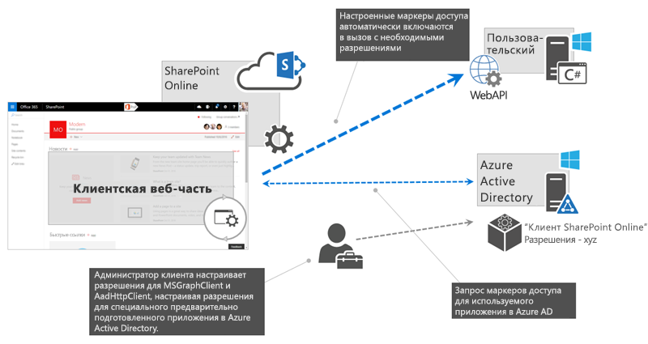
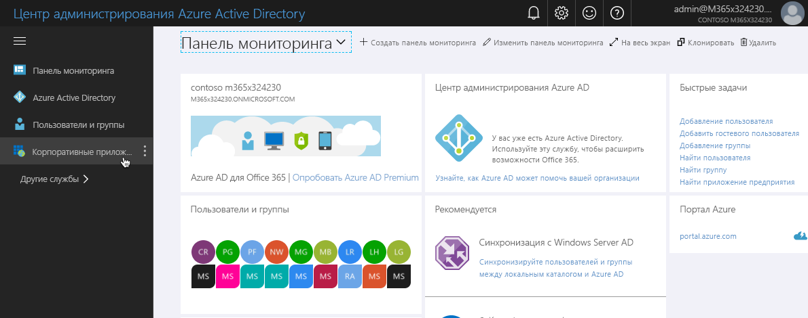
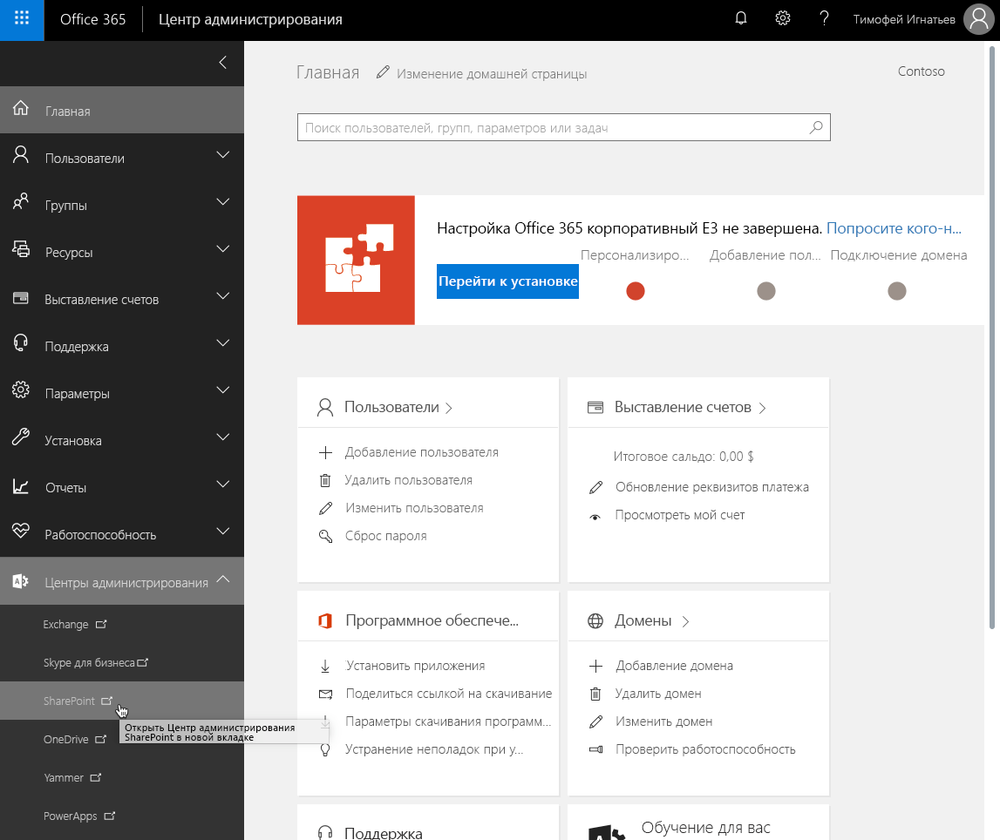

# <a name="connect-to-azure-ad-secured-apis-in-sharepoint-framework-solutions"></a><span data-ttu-id="da646-103">Подключение к API, защищенным службой Azure AD, в решениях SharePoint Framework</span><span class="sxs-lookup"><span data-stu-id="da646-103">Connect to Azure AD secured APIs in SharePoint Framework solutions</span></span>

<span data-ttu-id="da646-104">При создании решений SharePoint Framework может потребоваться подключиться к API, защищенному службой Azure Active Directory.</span><span class="sxs-lookup"><span data-stu-id="da646-104">When building SharePoint Framework solutions, you might need to connect to an API secured with Azure Active Directory.</span></span> <span data-ttu-id="da646-105">На платформе SharePoint Framework можно указать, какие разрешения и приложения Azure AD необходимы вашему решению, а администратор клиента может предоставить необходимые разрешения, если они еще не предоставлены.</span><span class="sxs-lookup"><span data-stu-id="da646-105">SharePoint Framework allows you to specify which Azure AD applications and permissions your solution requires, and tenant administrator can grant the necessary permissions if they haven't yet been granted.</span></span> <span data-ttu-id="da646-106">С помощью **AadHttpClient** вы можете легко подключаться к API, защищенным службой Azure AD, не реализуя поток OAuth самостоятельно.</span><span class="sxs-lookup"><span data-stu-id="da646-106">Using the **AadHttpClient** you can easily connect to APIs secured with Azure AD without having to implement the OAuth flow yourself.</span></span>

> [!IMPORTANT]
> <span data-ttu-id="da646-107">В настоящее время `AadHttpClient` и `MSGraphClient` предоставляются в ознакомительных целях и могут меняться.</span><span class="sxs-lookup"><span data-stu-id="da646-107">Usage of `AadHttpClient` and `MSGraphClient` is currently in preview status and subject to change.</span></span> <span data-ttu-id="da646-108">Не следует использовать эти возможности в рабочей среде.</span><span class="sxs-lookup"><span data-stu-id="da646-108">You should not use these capabilities in production environment.</span></span> <span data-ttu-id="da646-109">Кроме того, обратите внимание, что использование свойств `webApiPermissionRequests` в `package-solution.json` не поддерживается для обычных клиентов.</span><span class="sxs-lookup"><span data-stu-id="da646-109">Notice also that usage of `webApiPermissionRequests` properties in `package-solution.json` is not supported in normal tenants.</span></span>


## <a name="web-api-permissions---concept-overview"></a><span data-ttu-id="da646-110">Разрешения веб-API: обзор концепции</span><span class="sxs-lookup"><span data-stu-id="da646-110">Web API permissions - concept overview</span></span>

<span data-ttu-id="da646-111">Azure Active Directory защищает ряд ресурсов, начиная с самой среды Office 365 и заканчивая специальными бизнес-приложениями, созданными в организации.</span><span class="sxs-lookup"><span data-stu-id="da646-111">Azure Active Directory secures a number of resources: from Office 365 itself, to custom line of business applications built by the organization.</span></span> <span data-ttu-id="da646-112">Чтобы подключаться к этим ресурсам, приложению необходимо получить действительный маркер доступа для определенного ресурса.</span><span class="sxs-lookup"><span data-stu-id="da646-112">In order to connect to these resources, applications must obtain a valid access token granting them access to the particular resource.</span></span> <span data-ttu-id="da646-113">Приложение может получить маркер доступа в ходе [потока авторизации OAuth](https://docs.microsoft.com/ru-RU/azure/active-directory/develop/active-directory-protocols-oauth-code).</span><span class="sxs-lookup"><span data-stu-id="da646-113">Applications can obtain an access token as a part of the [OAuth authorization flow](https://docs.microsoft.com/ru-RU/azure/active-directory/develop/active-directory-protocols-oauth-code).</span></span> <span data-ttu-id="da646-114">Клиентские приложения, например решения SharePoint Framework, которые не могут хранить секрет, используют специальный вариант потока OAuth, называемый [неявным потоком OAuth](https://docs.microsoft.com/ru-RU/azure/active-directory/develop/active-directory-dev-understanding-oauth2-implicit-grant).</span><span class="sxs-lookup"><span data-stu-id="da646-114">Client-side applications, such as SharePoint Framework solutions, which are incapable of storing a secret, use a specific type of OAuth flow, named [OAuth implicit flow](https://docs.microsoft.com/ru-RU/azure/active-directory/develop/active-directory-dev-understanding-oauth2-implicit-grant).</span></span>

<span data-ttu-id="da646-115">Разработчики клиентских решений несут ответственность за реализацию авторизации с использованием неявного потока OAuth в своем приложении.</span><span class="sxs-lookup"><span data-stu-id="da646-115">Developers building client-side solutions are responsible for implementing authorization using the OAuth implicit flow in their application.</span></span> <span data-ttu-id="da646-116">В решениях SharePoint Framework это уже сделано на уровне платформы с помощью объектов **MSGraphClient** и **AadHttpClient**, появившихся в SharePoint Framework 1.4.1.</span><span class="sxs-lookup"><span data-stu-id="da646-116">In SharePoint Framework solutions that's already done as a part of the framework through the **MSGraphClient** and **AadHttpClient** both introduced in SharePoint Framework v1.4.1.</span></span>

> [!NOTE]
> <span data-ttu-id="da646-117">Если вы создаете решения на платформе SharePoint Framework версии ниже 1.4.1, вы все еще можете подключаться к ресурсам, защищенным службой Azure AD.</span><span class="sxs-lookup"><span data-stu-id="da646-117">If you build solutions on a version of the SharePoint Framework older than v1.4.1 you can still connect to resources secured with Azure AD.</span></span> <span data-ttu-id="da646-118">В этом случае необходимо самостоятельно реализовать неявный поток OAuth с помощью [ADAL JS](https://github.com/AzureAD/azure-activedirectory-library-for-js).</span><span class="sxs-lookup"><span data-stu-id="da646-118">In that case you need to implement the OAuth implicit flow using [ADAL JS](https://github.com/AzureAD/azure-activedirectory-library-for-js) yourself.</span></span> <span data-ttu-id="da646-119">Дополнительные сведения см. в статье [Подключение к API, защищенному с помощью Azure Active Directory](https://docs.microsoft.com/ru-RU/sharepoint/dev/spfx/web-parts/guidance/connect-to-api-secured-with-aad).</span><span class="sxs-lookup"><span data-stu-id="da646-119">For more information see the [Connect to API secured with Azure Active Directory](https://docs.microsoft.com/ru-RU/sharepoint/dev/spfx/web-parts/guidance/connect-to-api-secured-with-aad) article.</span></span>

<span data-ttu-id="da646-120">В рамках SharePoint Framework определен специальный процесс, с помощью которого разработчики могут запрашивать разрешения на доступ к ресурсам, защищенным с помощью Azure AD, а администраторы клиента — управлять ими.</span><span class="sxs-lookup"><span data-stu-id="da646-120">As a part of the SharePoint Framework, there is a specific process defined for how developers can request- and tenant administrators can manage permissions to resources secured with Azure AD.</span></span> <span data-ttu-id="da646-121">Приведенная ниже схема иллюстрирует этот процесс.</span><span class="sxs-lookup"><span data-stu-id="da646-121">The following schema illustrates this process.</span></span>



<span data-ttu-id="da646-123">Разработчики решения SharePoint Framework, которому требуется доступ к определенным ресурсам, защищенным с помощью Azure AD, указывают эти ресурсы вместе с необходимыми областями разрешений в манифесте решения (1).</span><span class="sxs-lookup"><span data-stu-id="da646-123">Developers building a SharePoint Framework solution, that requires access to specific resources secured with Azure AD, list these resources along with the required permission scopes in the solution manifest (1).</span></span> <span data-ttu-id="da646-124">SharePoint при развертывании пакета решения в каталоге приложений создает запросы на получение разрешений и предлагает администратору управлять запрашиваемыми разрешениями (2).</span><span class="sxs-lookup"><span data-stu-id="da646-124">When deploying the solution package to the app catalog, SharePoint will create permission requests and will prompt the administrator to manage the requested permissions (2).</span></span> <span data-ttu-id="da646-125">Администраторы клиента могут решить, следует ли предоставлять каждое из запрашиваемых разрешений (3).</span><span class="sxs-lookup"><span data-stu-id="da646-125">For each requested permission, tenant administrators can decide whether they want to grant or deny the specific permission (3).</span></span>

<span data-ttu-id="da646-126">Все разрешения предоставляются всему клиенту, а не только тому приложению, которое их запрашивает.</span><span class="sxs-lookup"><span data-stu-id="da646-126">All permissions are granted to the whole tenant and not to a specific application that has requested them.</span></span> <span data-ttu-id="da646-127">Когда администратор клиента предоставляет определенное разрешение, оно добавляется в приложение Azure AD **Расширение клиента SharePoint Online**, которое подготавливается корпораций Майкрософт в каждой службе Azure Active Directory и используется платформой SharePoint Framework в потоке OAuth для предоставления решений с действительными маркерами доступа.</span><span class="sxs-lookup"><span data-stu-id="da646-127">When tenant administrator grants a specific permission, it is added to the **SharePoint Online Client Extensibility** Azure AD application, which is provisioned by Microsoft in every Azure Active Directory and which is used by the SharePoint Framework in the OAuth flow to provide solutions with valid access tokens.</span></span>

## <a name="discover-available-applications-and-permissions"></a><span data-ttu-id="da646-128">Определение доступных приложений и разрешений</span><span class="sxs-lookup"><span data-stu-id="da646-128">Discover available applications and permissions</span></span>

<span data-ttu-id="da646-129">То, для каких приложений запрашиваются разрешения, зависит от целевой службы Azure Active Directory, которая защищает клиент Office 365.</span><span class="sxs-lookup"><span data-stu-id="da646-129">For which applications you can request permissions in your solution, depends on the target Azure Active Directory which secures your Office 365 tenant.</span></span> <span data-ttu-id="da646-130">Список доступных приложений может зависеть от лицензии на Office 365, используемой в организации, и от того, какие бизнес-приложения зарегистрированы в ее службе Azure AD.</span><span class="sxs-lookup"><span data-stu-id="da646-130">The list of available application might depend on the Office 365 license the organization is using and which line of business applications they registered in their Azure AD.</span></span> <span data-ttu-id="da646-131">При условии, что у вас есть необходимые разрешения, вы можете несколькими способами определить, какие приложения и области разрешений доступны в клиенте.</span><span class="sxs-lookup"><span data-stu-id="da646-131">Assuming you have sufficient permissions, there are a number of ways in which you can see which applications and permission scopes are available in your tenant.</span></span>

### <a name="azure-portal"></a><span data-ttu-id="da646-132">Портал Azure</span><span class="sxs-lookup"><span data-stu-id="da646-132">Azure Portal</span></span>

<span data-ttu-id="da646-133">Один из способов просмотреть список приложений, доступных в Azure Active Directory, — перейти на портал Azure ([https://portal.azure.com](https://portal.azure.com)) или в центр администрирования Azure Active Directory ([https://aad.portal.azure.com](https://aad.portal.azure.com)).</span><span class="sxs-lookup"><span data-stu-id="da646-133">One way to see the list of applications available in your Azure Active Directory, is by navigating to the Azure Portal at [https://portal.azure.com](https://portal.azure.com) or the Azure Active Directory admin center at [https://aad.portal.azure.com](https://aad.portal.azure.com).</span></span>

<span data-ttu-id="da646-134">Открыв портал, выберите в меню пункт **Корпоративные приложения**.</span><span class="sxs-lookup"><span data-stu-id="da646-134">Once in the portal, from the menu click the **Enterprise applications** link.</span></span>



<span data-ttu-id="da646-136">В колонке **Корпоративные приложения** щелкните ссылку **Все приложения** в группе **Управление**.</span><span class="sxs-lookup"><span data-stu-id="da646-136">On the **Enterprise applications** blade, from the **Manage** group, click the **All applications** link.</span></span>


<span data-ttu-id="da646-138">Чтобы быстрее найти приложение, к которому требуется подключиться, выполните фильтрацию по типу приложения (_Приложения Майкрософт_ или _Корпоративные приложения_) либо поиск по имени или идентификатору.</span><span class="sxs-lookup"><span data-stu-id="da646-138">To quicker find the application to which you want to connect, you can filter the overview either by application type (_Microsoft Applications_ or _Enterprise Applications_) or you can search for it using its name or ID.</span></span>

<span data-ttu-id="da646-139">Например, если вам нужно запросить дополнительные разрешения для Microsoft Graph, введите в поле поиска запрос `graph`.</span><span class="sxs-lookup"><span data-stu-id="da646-139">Assuming you wanted to request additional permissions to the Microsoft Graph, in the search box you would search for `graph`.</span></span>


<span data-ttu-id="da646-141">Когда вы найдете приложение, щелкните его, чтобы получить дополнительные сведения о нем.</span><span class="sxs-lookup"><span data-stu-id="da646-141">Once you find the application, click on it, to get its additional information.</span></span> <span data-ttu-id="da646-142">В колонке приложения щелкните ссылку **Свойства** в группе **Управление**, чтобы открыть свойства приложения.</span><span class="sxs-lookup"><span data-stu-id="da646-142">Once on the application blade, from the **Manage** group, click the **Properties** link, to open application's properties.</span></span>


<span data-ttu-id="da646-144">В списке свойств скопируйте значение свойства **ИД объекта**, необходимое, чтобы запросить дополнительные области разрешений для Microsoft Graph.</span><span class="sxs-lookup"><span data-stu-id="da646-144">From the list of properties, copy the value of the **Object ID** property which you need to request additional permission scopes to the Microsoft Graph.</span></span> <span data-ttu-id="da646-145">Кроме того, вы можете скопировать **имя** приложения и использовать его в запросе на получение разрешений.</span><span class="sxs-lookup"><span data-stu-id="da646-145">Alternatively, you can copy the application's **Name** and use it in the permission request instead.</span></span>


> [!NOTE]
> <span data-ttu-id="da646-147">Свойство **ИД объекта** уникально для каждого клиента, но во всех клиентах используется одно и то же **имя**.</span><span class="sxs-lookup"><span data-stu-id="da646-147">While the **Object ID** is unique for each tenant, the application's **Name** is the same across all tenants.</span></span> <span data-ttu-id="da646-148">Если вам нужно собрать решение один раз и развернуть его в разных клиентах, следует использовать **имя**, запрашивая дополнительные разрешения в решении.</span><span class="sxs-lookup"><span data-stu-id="da646-148">If you want to build your solution once and deploy it to different tenants, you should use the application's **Name** when requesting additional permissions in your solution.</span></span>

### <a name="powershell"></a><span data-ttu-id="da646-149">PowerShell</span><span class="sxs-lookup"><span data-stu-id="da646-149">powershell</span></span>

> [!NOTE]
> <span data-ttu-id="da646-150">Прежде чем выполнять описанные ниже действия, необходимо установить [Azure PowerShell](https://docs.microsoft.com/en-us/powershell/azure/install-azurerm-ps?view=azurermps-5.1.1).</span><span class="sxs-lookup"><span data-stu-id="da646-150">Before you can execute the following steps, you have to install [Azure PowerShell](https://docs.microsoft.com/en-us/powershell/azure/install-azurerm-ps?view=azurermps-5.1.1).</span></span> <span data-ttu-id="da646-151">Кроме того, вы можете выполнять приведенные в этом разделе командлеты в Azure Cloud Shell PowerShell.</span><span class="sxs-lookup"><span data-stu-id="da646-151">Alternatively, you can execute the cmdlets mentioned in this section in the Azure Cloud Shell PowerShell.</span></span>

<span data-ttu-id="da646-152">Для начала войдите в свою учетную запись подписки на Azure, выполнив в PowerShell следующую команду (это необязательно, если используется Azure Cloud Shell):</span><span class="sxs-lookup"><span data-stu-id="da646-152">Start, by logging in to your Azure subscription by executing in PowerShell (this is not necessary if you're using the Azure Cloud Shell):</span></span>

```powershell
Login-AzureRmAccount
```

<span data-ttu-id="da646-153">Затем введите следующую команду, чтобы получить список приложений, доступных в клиенте:</span><span class="sxs-lookup"><span data-stu-id="da646-153">Next, type the following to list the applications available in your tenant:</span></span>

```powershell
Get-AzureRmADServicePrincipal | sort DisplayName | ft DisplayName, Id
```

<span data-ttu-id="da646-154">При выполнении этого командлета возвращается список всех приложений, доступных в клиенте, а для каждого приложения выводятся отображаемое имя и ИД объекта, которые можно использовать в решении SharePoint Framework, чтобы запрашивать разрешения приложения.</span><span class="sxs-lookup"><span data-stu-id="da646-154">Running this cmdlet will list all applications available in your tenant, and for each application will display its display name and object ID, that you can use in your SharePoint Framework solution to request application permissions.</span></span>

### <a name="azure-cli"></a><span data-ttu-id="da646-155">Azure CLI</span><span class="sxs-lookup"><span data-stu-id="da646-155">Azure CLI</span></span>

> [!NOTE]
> <span data-ttu-id="da646-156">Прежде чем выполнять описанные ниже действия, необходимо установить [Azure CLI](https://docs.microsoft.com/en-us/cli/azure/install-azure-cli?view=azure-cli-latest).</span><span class="sxs-lookup"><span data-stu-id="da646-156">Before you can execute the following steps, you have to install the [Azure CLI](https://docs.microsoft.com/en-us/cli/azure/install-azure-cli?view=azure-cli-latest).</span></span> <span data-ttu-id="da646-157">Кроме того, вы можете запустить Azure CLI через [Azure Cloud Shell](https://docs.microsoft.com/en-us/azure/cloud-shell/overview?view=azure-cli-latest) или в качестве [контейнера Docker](https://hub.docker.com/r/microsoft/azure-cli/).</span><span class="sxs-lookup"><span data-stu-id="da646-157">Alternatively, you can run the Azure CLI through the [Azure Cloud Shell](https://docs.microsoft.com/en-us/azure/cloud-shell/overview?view=azure-cli-latest) or as a [Docker container](https://hub.docker.com/r/microsoft/azure-cli/).</span></span>

<span data-ttu-id="da646-158">Если интерфейс командной строки работает на вашем компьютере или в контейнере Docker, для начала подключитесь к своей подписке на Azure с помощью следующей команды:</span><span class="sxs-lookup"><span data-stu-id="da646-158">If you're running the CLI on your machine or in a Docker container, start by connecting to your Azure subscription, by executing:</span></span>

```sh
azure login
```

<span data-ttu-id="da646-159">После подключения выполните следующую команду, чтобы получить список всех доступных приложений Azure AD:</span><span class="sxs-lookup"><span data-stu-id="da646-159">Once connected, execute the following command, to list all available Azure AD applications:</span></span>

```sh
azure ad sp list --query "sort_by([*].{displayName: displayName, objectId: objectId}, &displayName)" -o table
```

<span data-ttu-id="da646-160">При выполнении этой команды появится список всех доступных в клиенте приложений Azure AD, отсортированный по свойству displayName.</span><span class="sxs-lookup"><span data-stu-id="da646-160">Running this command will list all Azure AD applications available in your tenant sorted by displayName.</span></span> <span data-ttu-id="da646-161">Эта команда выводит displayName и objectId каждого приложения.</span><span class="sxs-lookup"><span data-stu-id="da646-161">For each application, the command will display its displayName and objectId.</span></span> <span data-ttu-id="da646-162">Кроме того, выходные данные форматируются в виде таблицы.</span><span class="sxs-lookup"><span data-stu-id="da646-162">Additionally, the output will be formatted as a table.</span></span>

### <a name="get-the-list-of-permission-scopes-exposed-by-the-application"></a><span data-ttu-id="da646-163">Получение списка областей разрешений, предоставляемых приложением</span><span class="sxs-lookup"><span data-stu-id="da646-163">Get the list of permission scopes exposed by the application</span></span>

<span data-ttu-id="da646-164">Каждое приложение Azure AD предоставляет ряд областей разрешений.</span><span class="sxs-lookup"><span data-stu-id="da646-164">Each Azure AD application exposes a number of permission scopes.</span></span> <span data-ttu-id="da646-165">Зачастую они относятся к определенным ресурсам или операциям в приложении.</span><span class="sxs-lookup"><span data-stu-id="da646-165">These permission scopes often relate to specific resources or operations inside the application.</span></span> <span data-ttu-id="da646-166">Чтобы получить список доступных разрешений для приложения, к которому требуется подключиться, ознакомьтесь с документацией к нему.</span><span class="sxs-lookup"><span data-stu-id="da646-166">To get the list permissions available for the application you would like to connect to, consult its documentation.</span></span> <span data-ttu-id="da646-167">Список областей разрешений, доступных в Microsoft Graph, представлен на следующей странице: [https://developer.microsoft.com/ru-ru/graph/docs/concepts/permissions_reference](https://developer.microsoft.com/ru-RU/graph/docs/concepts/permissions_reference).</span><span class="sxs-lookup"><span data-stu-id="da646-167">For the list of permission scopes available in the Microsoft Graph see: [https://developer.microsoft.com/ru-RU/graph/docs/concepts/permissions_reference](https://developer.microsoft.com/ru-RU/graph/docs/concepts/permissions_reference).</span></span>

## <a name="request-permissions-to-an-azure-active-directory-application"></a><span data-ttu-id="da646-168">Запрашивание разрешений для приложения Azure Active Directory</span><span class="sxs-lookup"><span data-stu-id="da646-168">Request permissions to an Azure Active Directory application</span></span>

<span data-ttu-id="da646-169">Если вашему решению SharePoint Framework требуются разрешения для определенных ресурсов, защищенных с помощью Azure Active Directory, например Microsoft Graph или корпоративных приложений, вы можете указывать эти ресурсы вместе с необходимыми разрешениями в конфигурации решения.</span><span class="sxs-lookup"><span data-stu-id="da646-169">If your SharePoint Framework solution requires permissions to specific resources secured with Azure Active Directory, such as Microsoft Graph or enterprise applications, you can specify these resources along with the necessary permissions in the configuration of your solution.</span></span> <span data-ttu-id="da646-170">Для этого в проекте SharePoint Framework откройте файл **config/package-solution.json** и добавьте к свойству **solution** свойство **webApiPermissionRequests**, в котором указаны все ресурсы и соответствующие разрешения, необходимые решению.</span><span class="sxs-lookup"><span data-stu-id="da646-170">To do this, in your SharePoint Framework project, open the **config/package-solution.json** file and to the **solution** property, add the **webApiPermissionRequests** property listing all resources and corresponding permissions your solution needs.</span></span> <span data-ttu-id="da646-171">Ниже представлен пример решения SharePoint Framework, запрашивающего доступ на чтение календарей пользователей с помощью Microsoft Graph.</span><span class="sxs-lookup"><span data-stu-id="da646-171">Following is an example of a SharePoint Framework solution requesting access to read user calendars using the Microsoft Graph:</span></span>

```json
{
  "$schema": "https://dev.office.com/json-schemas/spfx-build/package-solution.schema.json",
  "solution": {
    "name": "spfx-graph-client-side-solution",
    "id": "5d16587c-5e87-44d7-b658-1148988f212a",
    "version": "1.0.0.0",
    "includeClientSideAssets": true,
    "skipFeatureDeployment": true,
    "webApiPermissionRequests": [
      {
        "resource": "Microsoft Graph",
        "scope": "Calendars.Read"
      }
    ]
  },
  "paths": {
    "zippedPackage": "solution/spfx-graph.sppkg"
  }
}
```

> [!NOTE]
> <span data-ttu-id="da646-172">В качестве значения свойства **resource** можно указать либо **displayName**, либо **objectId** приложения, для которого запрашиваются разрешения.</span><span class="sxs-lookup"><span data-stu-id="da646-172">As the value of the **resource** property you can specify either the **displayName** or the **objectId** of the application to which you want to request permissions.</span></span> <span data-ttu-id="da646-173">Свойство displayName не только более удобочитаемо, но и позволяет создать решение один раз, а затем использовать его во множестве клиентов.</span><span class="sxs-lookup"><span data-stu-id="da646-173">Using the displayName is not only more readable but it also allows you to build your solution once and reuse it across multiple tenants.</span></span> <span data-ttu-id="da646-174">Свойство **objectId** приложения Azure AD будет уникальным для каждого клиента, но свойство **displayName** остается неизменным.</span><span class="sxs-lookup"><span data-stu-id="da646-174">Where the **objectId** of an Azure AD application is different on each tenant, the **displayName** stays the same.</span></span>

<span data-ttu-id="da646-175">Если вам нужно запросить несколько областей разрешения для того или иного ресурса, указывайте каждую область в отдельной записи, например:</span><span class="sxs-lookup"><span data-stu-id="da646-175">If you want to request multiple permission scopes for the given resource, specify each scope in a separate entry, for example:</span></span>

```json
{
  "$schema": "https://dev.office.com/json-schemas/spfx-build/package-solution.schema.json",
  "solution": {
    "name": "spfx-graph-client-side-solution",
    "id": "5d16587c-5e87-44d7-b658-1148988f212a",
    "version": "1.0.0.0",
    "includeClientSideAssets": true,
    "skipFeatureDeployment": true,
    "webApiPermissionRequests": [
      {
        "resource": "Microsoft Graph",
        "scope": "Calendars.Read"
      },
      {
        "resource": "Microsoft Graph",
        "scope": "User.ReadBasic.All"
      }
    ]
  },
  "paths": {
    "zippedPackage": "solution/spfx-graph.sppkg"
  }
}
```

<span data-ttu-id="da646-176">При развертывании этого решения в каталоге приложений SharePoint администратору предлагается проверить запрашиваемые разрешения и предоставить их либо отказать.</span><span class="sxs-lookup"><span data-stu-id="da646-176">When this solution is deployed to SharePoint app catalog, it will prompt the administrator to verify the requested permissions and either grant or deny them.</span></span>

> [!NOTE]
> <span data-ttu-id="da646-177">Независимо от того, предоставит ли администратор запрашиваемые разрешения, решение можно развертывать и использовать на сайтах.</span><span class="sxs-lookup"><span data-stu-id="da646-177">No matter if the administrator denies or approves the requested permissions, the solution can be deployed and used in sites.</span></span> <span data-ttu-id="da646-178">При создании решений, которым требуются дополнительные разрешения, не следует рассчитывать на предоставление запрашиваемых разрешений.</span><span class="sxs-lookup"><span data-stu-id="da646-178">When building solutions that require additional permissions, you should never assume that the requested permissions have been granted.</span></span>

## <a name="manage-permission-request"></a><span data-ttu-id="da646-179">Управление запросом на получение разрешений</span><span class="sxs-lookup"><span data-stu-id="da646-179">Manage permission request</span></span>

<span data-ttu-id="da646-180">При развертывании решения SharePoint Framework, запрашивающего доступ к приложениям Azure AD, администратору предлагается управлять запросом на получение разрешений, предоставляемым вместе с решением.</span><span class="sxs-lookup"><span data-stu-id="da646-180">When deploying SharePoint Framework solutions that request permissions to Azure AD applications, administrators are prompted to manage the permission request provided with the solution.</span></span> <span data-ttu-id="da646-181">Запросами на получение разрешений можно управлять множеством способов.</span><span class="sxs-lookup"><span data-stu-id="da646-181">Permission requests can be managed in a number of ways.</span></span>

### <a name="manage-permissions-in-the-office-365-admin-portal"></a><span data-ttu-id="da646-182">Управление разрешениями на портале администрирования Office 365</span><span class="sxs-lookup"><span data-stu-id="da646-182">Manage permissions in the Office 365 Admin portal</span></span>

> [!NOTE]
> <span data-ttu-id="da646-183">На снимках экрана, представленных в этом разделе, показан предварительный выпуск этой функции. Они будут изменены после выхода общедоступной версии.</span><span class="sxs-lookup"><span data-stu-id="da646-183">Screenshots included in this section are based on the prerelease version of this capability and will change when it becomes generally available.</span></span> <span data-ttu-id="da646-184">У предварительного выпуска пользовательского интерфейса администрирования есть ограничения. Одно из них — отсутствие отчетов об ошибках.</span><span class="sxs-lookup"><span data-stu-id="da646-184">One of the limitations of the prerelease version of the administration UI, is that it doesn't report errors.</span></span> <span data-ttu-id="da646-185">Если вы выполнили действие, а пользовательский интерфейс не реагирует на него, возможно, возникла ошибка.</span><span class="sxs-lookup"><span data-stu-id="da646-185">If you performed an action and the UI doesn't seem to respond to it, it is possible that an error has occurred.</span></span> <span data-ttu-id="da646-186">Чтобы проверить это, откройте средства разработчика в веб-браузере и изучите консоль и отправленные веб-запросы.</span><span class="sxs-lookup"><span data-stu-id="da646-186">You can verify that by, opening the developer tools in your web browser and examining the console and the issued web requests.</span></span>

<span data-ttu-id="da646-187">Администраторы клиентов Office 365 могут управлять предоставлением и запрашиванием разрешений через веб-интерфейс современного Центра администрирования SharePoint.</span><span class="sxs-lookup"><span data-stu-id="da646-187">Office 365 tenant administrators can manage permission grants and requests through the web UI from the modern SharePoint admin center.</span></span> <span data-ttu-id="da646-188">Чтобы открыть современный Центр администрирования SharePoint, сделайте следующее:</span><span class="sxs-lookup"><span data-stu-id="da646-188">To open the modern SharePoint admin center:</span></span>

<span data-ttu-id="da646-189">Перейдите на начальную страницу портала Office 365 по адресу https://portal.office.com и войдите с помощью своей учетной записи в организации.</span><span class="sxs-lookup"><span data-stu-id="da646-189">Navigate to the Office 365 portal landing page at https://portal.office.com and sign in with your organizational account.</span></span>


<span data-ttu-id="da646-191">В списке приложений выберите пункт **Администратор**.</span><span class="sxs-lookup"><span data-stu-id="da646-191">From the list of apps, select **Admin**.</span></span>


<span data-ttu-id="da646-193">В Центре администрирования Office 365 перейдите по ссылке **SharePoint** в группе **Центры администрирования**.</span><span class="sxs-lookup"><span data-stu-id="da646-193">In the Office 365 Admin center, from the **Admin centers** group, click the **SharePoint** link.</span></span>



<span data-ttu-id="da646-195">В Центре администрирования SharePoint перейдите по ссылке **Попробуйте новый Центр администрирования SharePoint**.</span><span class="sxs-lookup"><span data-stu-id="da646-195">In the SharePoint admin center, click the **Try the new SharePoint admin center** link.</span></span>


#### <a name="view-pending-permission-requests"></a><span data-ttu-id="da646-197">Просмотр запросов на получение разрешений, ожидающих проверки</span><span class="sxs-lookup"><span data-stu-id="da646-197">View pending permission requests</span></span>

<span data-ttu-id="da646-198">Чтобы просмотреть запросы на получение разрешений, ожидающие проверки, в меню современного Центра администрирования SharePoint выберите пункт **Управление WebApiPermission**.</span><span class="sxs-lookup"><span data-stu-id="da646-198">To view pending permission requests, in the modern SharePoint admin center, from the menu, click the **WebApiPermission management** link.</span></span>


<span data-ttu-id="da646-200">Все запросы на получение разрешений, ожидающие проверки, будут выделены в списке разрешений веб-API.</span><span class="sxs-lookup"><span data-stu-id="da646-200">All pending permissions requests will be highlighted in the list of web API permissions.</span></span>


#### <a name="approve-permission-request"></a><span data-ttu-id="da646-202">Утверждение запроса на получение разрешений</span><span class="sxs-lookup"><span data-stu-id="da646-202">Approve permission request</span></span>

<span data-ttu-id="da646-203">Чтобы утвердить запрос на получение разрешений, ожидающий проверки, выберите этот запрос в списке разрешений, на панели инструментов нажмите кнопку **Утвердить или отклонить**, а затем в области **Утверждение или отклонение прав доступа** нажмите кнопку **Утвердить**.</span><span class="sxs-lookup"><span data-stu-id="da646-203">To approve a pending permission request, select the request in the list of permissions, from the toolbar click the **Approve or reject** button and in the **Approve or reject access** panel, click the **Approve** button.</span></span>


<span data-ttu-id="da646-205">После утверждения запроса разрешение в списке изменится, что будет указывать на то, что оно предоставлено.</span><span class="sxs-lookup"><span data-stu-id="da646-205">After the request has been approved, the permission will change in the list indicating that it has been granted.</span></span>

> [!NOTE]
> <span data-ttu-id="da646-206">При попытке утвердить запрос на получение разрешений для ресурса, некоторые разрешения которого уже предоставлены (например, при предоставлении дополнительных разрешений для Microsoft Graph), запрашиваемые области добавляются к ранее предоставленным разрешениям.</span><span class="sxs-lookup"><span data-stu-id="da646-206">If you try to approve a permission request for a resource that already has some permissions granted (for example, granting additional permissions to the Microsoft Graph), the requested scopes will be added to the previously granted permissions.</span></span>

#### <a name="reject-permission-request"></a><span data-ttu-id="da646-207">Отклонение запроса на получение разрешений</span><span class="sxs-lookup"><span data-stu-id="da646-207">Reject permission request</span></span>

<span data-ttu-id="da646-208">Чтобы отклонить запрос на получение разрешений, ожидающий проверки, выберите этот запрос в списке разрешений, на панели инструментов нажмите кнопку **Утвердить или отклонить**, а затем в области **Утверждение или отклонение прав доступа** нажмите кнопку **Отклонить**.</span><span class="sxs-lookup"><span data-stu-id="da646-208">To reject a pending permission request, select the request in the list of permissions, from the toolbar click the **Approve or reject** button and in the **Approve or reject access** panel, click the **Reject** button.</span></span>


<span data-ttu-id="da646-210">Отклоненный запрос больше не будет отображаться в списке разрешений веб-API.</span><span class="sxs-lookup"><span data-stu-id="da646-210">After the request has been rejected, it will no longer be visible in the list of web API permissions.</span></span>

> [!NOTE]
> <span data-ttu-id="da646-211">Отклонение запроса на получение разрешений, который был отправлен решением, развернутым в каталоге приложений, не влияет на это решение. Оно остается развернутым в каталоге приложений.</span><span class="sxs-lookup"><span data-stu-id="da646-211">Rejecting a permission request issued by a solution deployed in the app catalog, doesn't affect that solution and it remains deployed in the app catalog.</span></span> <span data-ttu-id="da646-212">Так как запрашиваемые разрешения были отклонены, решение не будет работать должным образом, и его следует удалить из каталога приложений сразу после отклонения запроса на получение разрешений.</span><span class="sxs-lookup"><span data-stu-id="da646-212">Because the requested permissions have been denied, the solution won't be working as expected and you should remove it from the app catalog immediately after rejecting the permission request.</span></span>

#### <a name="revoke-granted-permission"></a><span data-ttu-id="da646-213">Отзыв предоставленного разрешения</span><span class="sxs-lookup"><span data-stu-id="da646-213">Revoke granted permission</span></span>

<span data-ttu-id="da646-214">Чтобы отозвать ранее предоставленный набор разрешений, выберите его в списке разрешений, на панели инструментов нажмите кнопку **Закрытие доступа**, а затем в области **Закрытие доступа** нажмите кнопку **Удалить**.</span><span class="sxs-lookup"><span data-stu-id="da646-214">To revoke a previously granted set of permissions, select the grant in the list of permissions, from the toolbar click the **Remove access** button and in the **Remove access** panel, click the **Remove** button.</span></span>


<span data-ttu-id="da646-216">Отозванные разрешения больше не будут отображаться в списке разрешений веб-API.</span><span class="sxs-lookup"><span data-stu-id="da646-216">After the grant has been removed, it will no longer be visible in the list of web API permissions.</span></span>

<span data-ttu-id="da646-217">При удалении предоставленного ранее набора разрешений во всех решениях, используемых в клиенте и зависящих от этих разрешений, возникнут ошибки.</span><span class="sxs-lookup"><span data-stu-id="da646-217">Removing a previously granted set of permissions will yield errors in all solutions used in your tenant that rely on those permissions.</span></span> <span data-ttu-id="da646-218">Прежде чем удалять предоставленные разрешения, следует внимательно изучить их влияние на клиент.</span><span class="sxs-lookup"><span data-stu-id="da646-218">Before removing the specific permission grant, you should closely examine the impact that it will have on your tenant.</span></span> <span data-ttu-id="da646-219">Если вы случайно удалили предоставленные разрешения, их можно восстановить, отправив новые запросы разрешений с теми же ресурсом и областью.</span><span class="sxs-lookup"><span data-stu-id="da646-219">If you accidentally removed a permission grant, you can restore it, by issuing a new permission requests with the same resource and scope.</span></span>

<span data-ttu-id="da646-220">Отзыв предоставленных разрешений не делает недействительными ранее выданные маркеры доступа.</span><span class="sxs-lookup"><span data-stu-id="da646-220">Revoking granted permissions doesn't invalidate previously issued access tokens.</span></span> <span data-ttu-id="da646-221">Они остаются действительными, пока не истечет срок их действия.</span><span class="sxs-lookup"><span data-stu-id="da646-221">Instead, they will remain valid until they expire.</span></span>

#### <a name="view-granted-permissions"></a><span data-ttu-id="da646-222">Просмотр предоставленных разрешений</span><span class="sxs-lookup"><span data-stu-id="da646-222">View granted permissions</span></span>

<span data-ttu-id="da646-223">Чтобы просмотреть все предоставленные ранее разрешения, в меню современного Центра администрирования SharePoint выберите пункт **Управление API**.</span><span class="sxs-lookup"><span data-stu-id="da646-223">To view all previously granted permissions, in the modern SharePoint admin center, from the menu, click the **API management** link.</span></span> <span data-ttu-id="da646-224">Все предоставленные разрешения появятся в разделе **Утвержденные**.</span><span class="sxs-lookup"><span data-stu-id="da646-224">All granted permissions will be displayed in the **Approved** section.</span></span>


### <a name="manage-permissions-with-powershell"></a><span data-ttu-id="da646-226">Управление разрешениями с помощью PowerShell</span><span class="sxs-lookup"><span data-stu-id="da646-226">Manage permissions with PowerShell</span></span>

<span data-ttu-id="da646-227">Администраторы клиентов SharePoint могут управлять разрешениями и запросами на их получение в SharePoint Online с помощью командной консоли SharePoint Online.</span><span class="sxs-lookup"><span data-stu-id="da646-227">SharePoint tenant administrators can use the SharePoint Online Management Shell to manage permissions and permission requests in SharePoint Online.</span></span>

#### <a name="view-pending-permission-requests"></a><span data-ttu-id="da646-228">Просмотр запросов на получение разрешений, ожидающих проверки</span><span class="sxs-lookup"><span data-stu-id="da646-228">View pending permission requests</span></span>

<span data-ttu-id="da646-229">Чтобы просмотреть все запросы на получение разрешений, ожидающие проверки, используйте командлет `Get-SPOTenantServicePrincipalPermissionRequests`.</span><span class="sxs-lookup"><span data-stu-id="da646-229">To view all pending permission request, use the `Get-SPOTenantServicePrincipalPermissionRequests` cmdlet.</span></span> <span data-ttu-id="da646-230">Этот командлет выводит для каждого запроса на получение разрешений ИД (необходимый для утверждения или отклонения запроса), имя ресурса, для которого запрашиваются разрешения, и названия этих разрешений.</span><span class="sxs-lookup"><span data-stu-id="da646-230">For each permission request, the cmdlet will list its ID (required to either approve or deny the request), the resource for which permissions have been requested and the requested permissions.</span></span>

> [!NOTE]
> <span data-ttu-id="da646-231">SharePoint не проверяет, предоставлены ли уже запрашиваемые разрешения, поэтому прежде чем утверждать или отклонять запрос на получение разрешений, проверьте, какие разрешения уже предоставлены в клиенте.</span><span class="sxs-lookup"><span data-stu-id="da646-231">SharePoint doesn't verify if the requested permissions have already been granted or not, so before approving or rejecting a permission request, check which permissions have already been granted in your tenant.</span></span>

#### <a name="approve-permission-request"></a><span data-ttu-id="da646-232">Утверждение запроса на получение разрешений</span><span class="sxs-lookup"><span data-stu-id="da646-232">Approve permission request</span></span>

<span data-ttu-id="da646-233">Чтобы утвердить определенный запрос на получение разрешений, используйте командлет `Approve-SPOTenantServicePrincipalPermissionRequest -RequestId <Guid>`, указав ИД нужного запроса.</span><span class="sxs-lookup"><span data-stu-id="da646-233">To approve the specific permission request, use the `Approve-SPOTenantServicePrincipalPermissionRequest -RequestId <Guid>` cmdlet, specifying the ID of the permission request that you want to approve.</span></span>

> [!NOTE]
> <span data-ttu-id="da646-234">При попытке утвердить запрос на получение уже предоставленного разрешения возникнет ошибка.</span><span class="sxs-lookup"><span data-stu-id="da646-234">If you try to approve request for a permission that has already been granted, you will get an error.</span></span>

#### <a name="deny-permission-request"></a><span data-ttu-id="da646-235">Отклонение запроса на получение разрешений</span><span class="sxs-lookup"><span data-stu-id="da646-235">Deny permission request</span></span>

<span data-ttu-id="da646-236">Если запрашиваемое разрешение уже было предоставлено либо запрос противоречит политикам организации, вы можете отклонить запрос с помощью командлета `Deny-SPOTenantServicePrincipalPermissionRequest -RequestId <Guid>`, указав ИД нужного запроса.</span><span class="sxs-lookup"><span data-stu-id="da646-236">If the requested permission has already been granted, or the request is against your organizational policies, you can deny a permission request using the `Deny-SPOTenantServicePrincipalPermissionRequest -RequestId <Guid>` cmdlet, specifying the ID of the permission request that you want to deny.</span></span>

> [!NOTE]
> <span data-ttu-id="da646-237">Даже если запрос на получение разрешений, отправленный приложением SharePoint Framework, был отклонен, приложение все равно можно развернуть в каталоге приложений и устанавливать на сайтах.</span><span class="sxs-lookup"><span data-stu-id="da646-237">Denying a permission request issued by a SharePoint Framework application, doesn't prevent that application from being deployed in the app catalog and installed in sites.</span></span>

#### <a name="view-granted-permissions"></a><span data-ttu-id="da646-238">Просмотр предоставленных разрешений</span><span class="sxs-lookup"><span data-stu-id="da646-238">View granted permissions</span></span>

<span data-ttu-id="da646-239">Чтобы просмотреть разрешения, предоставленные в клиенте, используйте командлет `Get-SPOTenantServicePrincipalPermissionGrants`.</span><span class="sxs-lookup"><span data-stu-id="da646-239">To view which permissions have been granted in your tenant use the `Get-SPOTenantServicePrincipalPermissionGrants` cmdlet.</span></span> <span data-ttu-id="da646-240">Этот командлет выводит следующие сведения о каждом предоставленном разрешении:</span><span class="sxs-lookup"><span data-stu-id="da646-240">For each grant the cmdlet will display the following information:</span></span>

- <span data-ttu-id="da646-241">ClientId. Свойство objectId субъекта-службы, которому предоставлено разрешение действовать от имени пользователя при доступе к ресурсу (представленному свойством resourceId).</span><span class="sxs-lookup"><span data-stu-id="da646-241">ClientId: The objectId of the service principal granted consent to impersonate the user when accessing the resource (represented by the resourceId).</span></span>
- <span data-ttu-id="da646-242">ConsentType. Указывает, кем было предоставлено согласие — администратором от имени организации или отдельным лицом.</span><span class="sxs-lookup"><span data-stu-id="da646-242">ConsentType: Whether consent was provided by the administrator on behalf of the organization or whether consent was provided by an individual.</span></span> <span data-ttu-id="da646-243">Возможные значения: AllPrincipals и Principal.</span><span class="sxs-lookup"><span data-stu-id="da646-243">The possible values are "AllPrincipals" or "Principal".</span></span>
- <span data-ttu-id="da646-244">ObjectId. Уникальный идентификатор предоставленного разрешения.</span><span class="sxs-lookup"><span data-stu-id="da646-244">ObjectId: The unique identifier for the permission grant.</span></span>
- <span data-ttu-id="da646-245">Resource. Ресурс, к которому предоставлен доступ.</span><span class="sxs-lookup"><span data-stu-id="da646-245">Resource: The resource to which access has been granted.</span></span>
- <span data-ttu-id="da646-246">ResourceId. Свойство objectId субъекта-службы ресурса, к которому предоставлен доступ.</span><span class="sxs-lookup"><span data-stu-id="da646-246">ResourceId: The objectId of the resource service principal to which access has been granted.</span></span>
- <span data-ttu-id="da646-247">Scope. Значение утверждения области, которое приложение ресурса ожидает в маркере доступа OAuth 2.0.</span><span class="sxs-lookup"><span data-stu-id="da646-247">Scope: The value of the scope claim that the resource application should expect in the OAuth 2.0 access token.</span></span>

#### <a name="revoke-granted-permission"></a><span data-ttu-id="da646-248">Отзыв предоставленного разрешения</span><span class="sxs-lookup"><span data-stu-id="da646-248">Revoke granted permission</span></span>

<span data-ttu-id="da646-249">Если вам нужно отозвать предоставленное ранее разрешение, можете воспользоваться командлетом `Revoke-SPOTenantServicePrincipalPermission -ObjectId <String>`.</span><span class="sxs-lookup"><span data-stu-id="da646-249">If you need to revoke a previously granted permission, you can do that using the `Revoke-SPOTenantServicePrincipalPermission -ObjectId <String>` cmdlet.</span></span> <span data-ttu-id="da646-250">В параметре `ObjectId` следует указать ObjectId нужного разрешения. Это значение можно получить с помощью командлета `Get-SPOTenantServicePrincipalPermissionGrants`.</span><span class="sxs-lookup"><span data-stu-id="da646-250">In the `ObjectId` parameter you should specify the ObjectId of the grant that you want to revoke, which you can obtain using the `Get-SPOTenantServicePrincipalPermissionGrants` cmdlet.</span></span>

> [!NOTE]
> <span data-ttu-id="da646-251">Отзыв разрешения не приводит к изменению каталога приложений и каких-либо развернутых приложений.</span><span class="sxs-lookup"><span data-stu-id="da646-251">Revoking a permission doesn't trigger any changes to the app catalog or any of the deployed applications.</span></span> <span data-ttu-id="da646-252">Единственное последствие отзыва разрешения заключается в том, что никакое из используемых в клиенте приложений не сможет подключаться к ресурсам, для которых отозвано разрешение.</span><span class="sxs-lookup"><span data-stu-id="da646-252">The only consequence of revoking a permission is, that any application used in the tenant will not be able to connect to the resources for which the permission has been revoked.</span></span>

### <a name="manage-permissions-using-the-office-365-cli"></a><span data-ttu-id="da646-253">Управление разрешениями с помощью Office 365 CLI</span><span class="sxs-lookup"><span data-stu-id="da646-253">Manage permissions using the Office 365 CLI</span></span>

<span data-ttu-id="da646-254">Администраторы клиентов SharePoint могут управлять разрешениями и запросами на их получение в SharePoint Online с помощью [Office 365 CLI](https://aka.ms/o365cli).</span><span class="sxs-lookup"><span data-stu-id="da646-254">SharePoint tenant administrators can use the [Office 365 CLI](https://aka.ms/o365cli) to manage permissions and permission requests in SharePoint Online.</span></span>

#### <a name="view-pending-permission-requests"></a><span data-ttu-id="da646-255">Просмотр запросов на получение разрешений, ожидающих проверки</span><span class="sxs-lookup"><span data-stu-id="da646-255">View pending permission requests</span></span>

<span data-ttu-id="da646-256">Чтобы просмотреть все запросы на получение разрешений, ожидающие проверки, используйте команду [spo serviceprincipal permissionrequest list](https://sharepoint.github.io/office365-cli/cmd/spo/serviceprincipal/serviceprincipal-permissionrequest-list/).</span><span class="sxs-lookup"><span data-stu-id="da646-256">To view all pending permission request, use the [spo serviceprincipal permissionrequest list](https://sharepoint.github.io/office365-cli/cmd/spo/serviceprincipal/serviceprincipal-permissionrequest-list/) command.</span></span> <span data-ttu-id="da646-257">Эта команда выводит для каждого запроса на получение разрешений ИД (необходимый для утверждения или отклонения запроса), имя ресурса, для которого запрашиваются разрешения, и названия этих разрешений.</span><span class="sxs-lookup"><span data-stu-id="da646-257">For each permission request, the command will list its ID (required to either approve or deny the request), the resource for which permissions have been requested and the requested permissions.</span></span>

> [!NOTE]
> <span data-ttu-id="da646-258">SharePoint не проверяет, предоставлены ли уже запрашиваемые разрешения, поэтому прежде чем утверждать или отклонять запрос на получение разрешений, проверьте, какие разрешения уже предоставлены в клиенте.</span><span class="sxs-lookup"><span data-stu-id="da646-258">SharePoint doesn't verify if the requested permissions have already been granted or not, so before approving or rejecting a permission request, check which permissions have already been granted in your tenant.</span></span>

#### <a name="approve-permission-request"></a><span data-ttu-id="da646-259">Утверждение запроса на получение разрешений</span><span class="sxs-lookup"><span data-stu-id="da646-259">Approve permission request</span></span>

<span data-ttu-id="da646-260">Чтобы утвердить определенный запрос на получение разрешений, используйте команду [spo serviceprincipal permissionrequest approve](https://sharepoint.github.io/office365-cli/cmd/spo/serviceprincipal/serviceprincipal-permissionrequest-approve/), указав ИД нужного запроса.</span><span class="sxs-lookup"><span data-stu-id="da646-260">To approve the specific permission request, use the [spo serviceprincipal permissionrequest approve](https://sharepoint.github.io/office365-cli/cmd/spo/serviceprincipal/serviceprincipal-permissionrequest-approve/) command, specifying the ID of the permission request that you want to approve.</span></span>

> [!NOTE]
> <span data-ttu-id="da646-261">При попытке утвердить запрос на получение уже предоставленного разрешения возникнет ошибка.</span><span class="sxs-lookup"><span data-stu-id="da646-261">If you try to approve request for a permission that has already been granted, you will get an error.</span></span>

#### <a name="deny-permission-request"></a><span data-ttu-id="da646-262">Отклонение запроса на получение разрешений</span><span class="sxs-lookup"><span data-stu-id="da646-262">Deny permission request</span></span>

<span data-ttu-id="da646-263">Если запрашиваемое разрешение уже было предоставлено либо запрос противоречит политикам организации, вы можете отклонить запрос с помощью команды [spo serviceprincipal permissionrequest deny](https://sharepoint.github.io/office365-cli/cmd/spo/serviceprincipal/serviceprincipal-permissionrequest-deny/), указав ИД нужного запроса.</span><span class="sxs-lookup"><span data-stu-id="da646-263">If the requested permission has already been granted, or the request is against your organizational policies, you can deny a permission request using the [spo serviceprincipal permissionrequest deny](https://sharepoint.github.io/office365-cli/cmd/spo/serviceprincipal/serviceprincipal-permissionrequest-deny/) command, specifying the ID of the permission request that you want to deny.</span></span>

> [!NOTE]
> <span data-ttu-id="da646-264">Даже если запрос на получение разрешений, отправленный приложением SharePoint Framework, был отклонен, приложение все равно можно развернуть в каталоге приложений и устанавливать на сайтах.</span><span class="sxs-lookup"><span data-stu-id="da646-264">Denying a permission request issued by a SharePoint Framework application, doesn't prevent that application from being deployed in the app catalog and installed in sites.</span></span>

#### <a name="view-granted-permissions"></a><span data-ttu-id="da646-265">Просмотр предоставленных разрешений</span><span class="sxs-lookup"><span data-stu-id="da646-265">View granted permissions</span></span>

<span data-ttu-id="da646-266">Чтобы просмотреть разрешения, предоставленные в клиенте, используйте команду [spo serviceprincipal grant list](https://sharepoint.github.io/office365-cli/cmd/spo/serviceprincipal/serviceprincipal-grant-list/).</span><span class="sxs-lookup"><span data-stu-id="da646-266">To view which permissions have been granted in your tenant use the [spo serviceprincipal grant list](https://sharepoint.github.io/office365-cli/cmd/spo/serviceprincipal/serviceprincipal-grant-list/) command.</span></span> <span data-ttu-id="da646-267">Эта команда выводит следующие сведения о каждом предоставленном разрешении:</span><span class="sxs-lookup"><span data-stu-id="da646-267">For each grant the command will display the following information:</span></span>

- <span data-ttu-id="da646-268">ObjectId. Уникальный идентификатор предоставленного разрешения.</span><span class="sxs-lookup"><span data-stu-id="da646-268">ObjectId: The unique identifier for the permission grant.</span></span>
- <span data-ttu-id="da646-269">Resource. Ресурс, к которому предоставлен доступ.</span><span class="sxs-lookup"><span data-stu-id="da646-269">Resource: The resource to which access has been granted.</span></span>
- <span data-ttu-id="da646-270">ResourceId. Свойство objectId субъекта-службы ресурса, к которому предоставлен доступ.</span><span class="sxs-lookup"><span data-stu-id="da646-270">ResourceId: The objectId of the resource service principal to which access has been granted.</span></span>
- <span data-ttu-id="da646-271">Scope. Значение утверждения области, которое приложение ресурса ожидает в маркере доступа OAuth 2.0.</span><span class="sxs-lookup"><span data-stu-id="da646-271">Scope: The value of the scope claim that the resource application should expect in the OAuth 2.0 access token.</span></span>

#### <a name="revoke-granted-permission"></a><span data-ttu-id="da646-272">Отзыв предоставленного разрешения</span><span class="sxs-lookup"><span data-stu-id="da646-272">Revoke granted permission</span></span>

<span data-ttu-id="da646-273">Если вам нужно отозвать предоставленное ранее разрешение, можете воспользоваться командой [spo serviceprincipal grant revoke](https://sharepoint.github.io/office365-cli/cmd/spo/serviceprincipal/serviceprincipal-grant-revoke/).</span><span class="sxs-lookup"><span data-stu-id="da646-273">If you need to revoke a previously granted permission, you can do that using the [spo serviceprincipal grant revoke](https://sharepoint.github.io/office365-cli/cmd/spo/serviceprincipal/serviceprincipal-grant-revoke/) command.</span></span> <span data-ttu-id="da646-274">В параметре `grantId` следует указать ObjectId нужного разрешения. Это значение можно получить с помощью команды `spo serviceprincipal grant list`.</span><span class="sxs-lookup"><span data-stu-id="da646-274">In the `grantId` parameter you should specify the ObjectId of the grant that you want to revoke, which you can obtain using the `spo serviceprincipal grant list` command.</span></span>

> [!NOTE]
> <span data-ttu-id="da646-275">Отзыв разрешения не приводит к изменению каталога приложений и каких-либо развернутых приложений.</span><span class="sxs-lookup"><span data-stu-id="da646-275">Revoking a permission doesn't trigger any changes to the app catalog or any of the deployed applications.</span></span> <span data-ttu-id="da646-276">Единственное последствие отзыва разрешения заключается в том, что никакое из используемых в клиенте приложений не сможет подключаться к ресурсам, для которых отозвано разрешение.</span><span class="sxs-lookup"><span data-stu-id="da646-276">The only consequence of revoking a permission is, that any application used in the tenant will not be able to connect to the resources for which the permission has been revoked.</span></span>

## <a name="connect-to-azure-ad-applications-using-the-aadhttpclient"></a><span data-ttu-id="da646-277">Подключение к приложениям AD с помощью AadHttpClient</span><span class="sxs-lookup"><span data-stu-id="da646-277">Connect to Azure AD applications using the AadHttpClient</span></span>

<span data-ttu-id="da646-278">Начиная с версии 1.4.1, SharePoint Framework упрощает подключение к API, защищенным при помощи Azure AD.</span><span class="sxs-lookup"><span data-stu-id="da646-278">Starting from version 1.4.1, SharePoint Framework simplifies connecting to APIs secured with Azure AD.</span></span> <span data-ttu-id="da646-279">С помощью нового объекта **AadHttpClient** вы можете легко подключаться к API, защищенным службой Azure AD, не реализуя проверку подлинности и авторизацию самостоятельно.</span><span class="sxs-lookup"><span data-stu-id="da646-279">Using the new **AadHttpClient** you can easily connect to APIs secured with Azure AD, without having to implement authentication and authorization yourself.</span></span> <span data-ttu-id="da646-280">В объекте **AadHttpClient** реализован поток OAuth службы Azure AD с использованием ADAL JS и субъекта-службы **Расширение клиента SharePoint Online** для получения действительного маркера доступа.</span><span class="sxs-lookup"><span data-stu-id="da646-280">Internally, the **AadHttpClient** implements the Azure AD OAuth flow using ADAL JS using the **SharePoint Online Client Extensibility** service principal to obtain a valid access token.</span></span> <span data-ttu-id="da646-281">Субъект-служба **Расширение клиента SharePoint Online** подготавливается к работе корпорацией Майкрософт и доступна в Azure Active Directory для всех клиентов Office 365.</span><span class="sxs-lookup"><span data-stu-id="da646-281">The **SharePoint Online Client Extensibility** service principal is provisioned by Microsoft and available in the Azure Active Directory of all Office 365 tenants.</span></span>

<span data-ttu-id="da646-282">Чтобы использовать объект **AadHttpClient** в решении SharePoint Framework, добавьте выражение `import` в основной файл веб-части:</span><span class="sxs-lookup"><span data-stu-id="da646-282">To use the **AadHttpClient** in your SharePoint Framework solution, add the following `import` clause in your main web part file:</span></span>

```ts
import { AadHttpClient, HttpClientResponse } from '@microsoft/sp-http';
```

<span data-ttu-id="da646-283">Затем создайте экземпляр объекта **AadHttpClient**, передав в качестве параметров текущую область действия службы и ресурс, к которому требуется подключиться:</span><span class="sxs-lookup"><span data-stu-id="da646-283">Next, create a new instance of the **AadHttpClient** passing the current service scope and the resource, to which you want to connect, as parameters:</span></span>

```ts
export default class HelloWorldWebPart extends BaseClientSideWebPart<IHelloWorldWebPartProps> {
  public render(): void {
    // ...

    const contosoApiClient: AadHttpClient = new AadHttpClient(this.context.serviceScope, 'https://contoso.onmicrosoft.com/orders');
  }

  // ...
}
```

> [!NOTE]
> <span data-ttu-id="da646-284">Каждый экземпляр объекта **AadHttpClient** связан с определенным ресурсом. Именно поэтому необходимо создавать новый экземпляр клиента для каждого подключаемого ресурса.</span><span class="sxs-lookup"><span data-stu-id="da646-284">Each instance of the **AadHttpClient** is linked to the specific resource, which is why you need to create a new instance of the client for each resource you want to connect to.</span></span>

<span data-ttu-id="da646-285">Создав экземпляр объекта **AadHttpClient** для нужного ресурса, вы можете отправить веб-запрос на связь с API:</span><span class="sxs-lookup"><span data-stu-id="da646-285">Once you've instantiated the **AadHttpClient** for your resource, you can issue a web request to communicate with your API:</span></span>

```ts
export default class HelloWorldWebPart extends BaseClientSideWebPart<IHelloWorldWebPartProps> {
  public render(): void {
    // ...

    const contosoApiClient: AadHttpClient = new AadHttpClient(this.context.serviceScope, 'https://contoso.onmicrosoft.com/orders');
    contosoApiClient
      .get('https://contoso.azurewebsites.net/api/orders', AadHttpClient.configurations.v1)
      .then((response: HttpClientResponse): Promise<Order[]> => {
        return response.json();
      })
      .then((orders: Order[]): void => {
        // process data
      });
  }

  // ...
}
```

<span data-ttu-id="da646-286">В этом примере API возвращает список заказов, представленный пользовательским интерфейсом **Order**, определенным в другом файле проекта.</span><span class="sxs-lookup"><span data-stu-id="da646-286">In this example, the API returns a list of orders represented by the custom **Order** interface defined elsewhere in the project.</span></span>

## <a name="considerations"></a><span data-ttu-id="da646-287">Замечания</span><span class="sxs-lookup"><span data-stu-id="da646-287">Considerations</span></span>

<span data-ttu-id="da646-288">Ниже представлены некоторые замечания, которые следует учитывать при работе с разрешениями веб-API.</span><span class="sxs-lookup"><span data-stu-id="da646-288">Following are some considerations that you should take into account when working with web API permissions.</span></span>

### <a name="request-permissions-via-sharepoint-framework-solutions"></a><span data-ttu-id="da646-289">Запрашивание разрешений с помощью решений SharePoint Framework</span><span class="sxs-lookup"><span data-stu-id="da646-289">Request permissions via SharePoint Framework solutions</span></span>

<span data-ttu-id="da646-290">В данный момент запрашивать дополнительные разрешения можно только с помощью решения SharePoint Framework.</span><span class="sxs-lookup"><span data-stu-id="da646-290">At this moment, it's only possible to request additional permissions through a SharePoint Framework solution.</span></span> <span data-ttu-id="da646-291">Запрос инициируется при развертывании пакета решения (SPPKG), содержащего запрос на получение разрешений, в каталоге приложений.</span><span class="sxs-lookup"><span data-stu-id="da646-291">The request is initiated, when the solution package (.sppkg) containing permissions request is deployed in the app catalog.</span></span> <span data-ttu-id="da646-292">После этого администратор клиента может утвердить или отклонить запрос.</span><span class="sxs-lookup"><span data-stu-id="da646-292">Once the request is initiated, it can be approved or denied by the tenant administrator.</span></span>

### <a name="granted-permissions-apply-to-all-solutions"></a><span data-ttu-id="da646-293">Предоставленные разрешения применяются ко всем решениям</span><span class="sxs-lookup"><span data-stu-id="da646-293">Granted permissions apply to all solutions</span></span>

<span data-ttu-id="da646-294">Несмотря на то что решение SharePoint Framework запрашивает разрешения для ресурсов Azure AD, после предоставления они применяются ко всему клиенту, и их может использовать любое решение в этом клиенте.</span><span class="sxs-lookup"><span data-stu-id="da646-294">Although permissions to Azure AD resources are being requested by a SharePoint Framework solution, once granted, they apply to the whole tenant and can be leveraged by any solution in that tenant.</span></span>

### <a name="removing-solution-doesnt-revoke-permissions"></a><span data-ttu-id="da646-295">Разрешения не отзываются при удалении решения</span><span class="sxs-lookup"><span data-stu-id="da646-295">Removing solution doesn't revoke permissions</span></span>

<span data-ttu-id="da646-296">При удалении решения, которое изначально запросило то или иное разрешение, предоставленное разрешение не отзывается.</span><span class="sxs-lookup"><span data-stu-id="da646-296">Removing the solution, that initially requested the particular permission, doesn't revoke the granted permission.</span></span> <span data-ttu-id="da646-297">Администраторам клиентов необходимо вручную отзывать разрешения, предоставленные по запросам приложений SharePoint Framework.</span><span class="sxs-lookup"><span data-stu-id="da646-297">Tenant administrators have to manually revoke permissions granted through SharePoint Framework application requests.</span></span>

### <a name="revoking-previously-granted-permissions-doesnt-invalidate-issued-access-tokens"></a><span data-ttu-id="da646-298">Отзыв ранее предоставленных разрешений не делает недействительными выданные маркеры доступа.</span><span class="sxs-lookup"><span data-stu-id="da646-298">Revoking previously granted permissions doesn't invalidate issued access tokens</span></span>

<span data-ttu-id="da646-299">Отзыв ранее предоставленных разрешений не делает недействительными маркеры доступа, выданные пользователям.</span><span class="sxs-lookup"><span data-stu-id="da646-299">Revoking previously granted permissions, doesn't invalidate access tokens issued to users.</span></span> <span data-ttu-id="da646-300">Эти маркеры доступа остаются действительными, пока не истечет срок их действия.</span><span class="sxs-lookup"><span data-stu-id="da646-300">Instead, these access tokens will remain valid until they expire.</span></span>

### <a name="permission-request-doesnt-affect-solution-deployment"></a><span data-ttu-id="da646-301">Запрос на получение разрешений не влияет на развертывание решений</span><span class="sxs-lookup"><span data-stu-id="da646-301">Permission request doesn't affect solution deployment</span></span>

<span data-ttu-id="da646-302">Независимо от того, предоставит ли администратор запрашиваемые разрешения, решение можно развертывать и использовать на сайтах.</span><span class="sxs-lookup"><span data-stu-id="da646-302">No matter if the administrator denies or approves permissions requested by the solution, the solution can be deployed and used in sites.</span></span> <span data-ttu-id="da646-303">При создании решений, которым требуются дополнительные разрешения, не следует рассчитывать на предоставление запрашиваемых разрешений.</span><span class="sxs-lookup"><span data-stu-id="da646-303">When building solutions that require additional permissions, you should never assume that the requested permissions have been granted.</span></span>

### <a name="control-the-sharepoint-online-client-service-principal"></a><span data-ttu-id="da646-304">Управление субъектом-службой клиента SharePoint Online</span><span class="sxs-lookup"><span data-stu-id="da646-304">Control the SharePoint Online Client service principal</span></span>

<span data-ttu-id="da646-305">Все разрешения, предоставленные по запросам веб-API, хранятся с помощью приложения Azure AD **Расширение клиента SharePoint Online**.</span><span class="sxs-lookup"><span data-stu-id="da646-305">All permissions granted through web API requests are stored with the **SharePoint Online Client Extensibility** Azure AD application.</span></span> <span data-ttu-id="da646-306">Если администраторам клиентов не нужно, чтобы разработчики использовали модель запросов веб-API, а также объекты **MSGraphClient** и **AadHttpClient** в своих решениях, они могут отключить субъект-службу **Расширение клиента SharePoint Online** в консоли PowerShell с помощью командлета `Disable-SPOTenantServicePrincipal`.</span><span class="sxs-lookup"><span data-stu-id="da646-306">If tenant administrators don't want developers to use the web API request model and the **MSGraphClient** and **AadHttpClient** in their solutions, they can disable the **SharePoint Online Client Extensibility** service principal through PowerShell using the `Disable-SPOTenantServicePrincipal` cmdlet.</span></span> <span data-ttu-id="da646-307">Субъект-службу можно заново включить с помощью командлета `Enable-SPOTenantServicePrincipal`.</span><span class="sxs-lookup"><span data-stu-id="da646-307">The service principal can be re-enabled using the `Enable-SPOTenantServicePrincipal` cmdlet.</span></span> <span data-ttu-id="da646-308">Кроме того, вы также можете включать и отключать субъект-службу **Расширение клиента SharePoint Online** с помощью Office 365 CLI, используя команду [spo serviceprincipal set](https://sharepoint.github.io/office365-cli/cmd/spo/serviceprincipal/serviceprincipal-set/).</span><span class="sxs-lookup"><span data-stu-id="da646-308">Alternatively, it's also possible to enable and disable the **SharePoint Online Client Extensibility** service principal through the Office 365 CLI using the [spo serviceprincipal set](https://sharepoint.github.io/office365-cli/cmd/spo/serviceprincipal/serviceprincipal-set/) command.</span></span>

### <a name="access-to-the-microsoft-graph"></a><span data-ttu-id="da646-309">Доступ к Microsoft Graph</span><span class="sxs-lookup"><span data-stu-id="da646-309">Access to the Microsoft Graph</span></span>

<span data-ttu-id="da646-310">Даже если доступ к службе Microsoft Graph не предоставлен в явном виде, решения все равно смогут запрашивать маркер доступа для нее.</span><span class="sxs-lookup"><span data-stu-id="da646-310">Even if you don't explicitly grant the access to the Microsoft Graph, solutions will be able to request an access token for it.</span></span> <span data-ttu-id="da646-311">Субъект-служба **Расширение клиента SharePoint Online** выдаст маркер доступа с областью действия `user_impersonation`, который позволяет скриптам получать доступ к базовым сведениям о текущем пользователе.</span><span class="sxs-lookup"><span data-stu-id="da646-311">The **SharePoint Online Client Extensibility** service principal will issue an access token with the `user_impersonation` scope which allows scripts to access the basic information about the current user.</span></span>