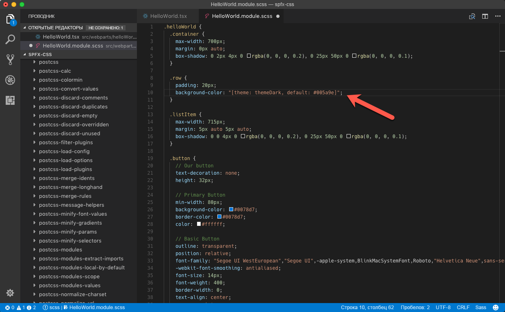

# <a name="use-theme-colors-in-your-sharepoint-framework-customizations"></a>Использование цветов темы в настройке SharePoint Framework

При создании настроек SharePoint Framework следует использовать цвета темы, чтобы настройки сочетались с дизайном сайта. Эта статья описывает, как использовать цвета темы контекстного сайта в своем решении SharePoint Framework.

> [!NOTE] 
> В этой статье в качестве примера используется клиентская веб-часть SharePoint Framework, но описанные способы применимы ко всем типам настроек SharePoint Framework.

## <a name="fixed-colors-vs-theme-colors"></a>Фиксированные цвета или цвета темы?

При формировании шаблона новой клиентской веб-части SharePoint Framework используется фиксированная синяя палитра. Если добавить такую ​​веб-часть на современный сайт с другой цветовой схемой, она будет выделяться и выглядеть неорганично.


Используя фиксированные цвета, вы заранее определяете, какие цвета вы хотите использовать для каких элементов. Это может привести к ситуации, когда, отображаясь на красном сайте группы, синяя веб-часть выделяется (а это неуместно). В большинстве случаев нужно стараться использовать цвета темы контекстного сайта, чтобы решение не выделялось, а выглядело как часть сайта.

SharePoint Framework дает возможность использовать цвета темы контекстного сайта вместо фиксированных цветов. Если веб-часть размещена на сайте с использованием красной темы, она также будет использовать красную палитру, а если она будет помещена на сайт с использованием синей темы, то автоматически настроится на использование синей палитры. Все это происходит автоматически без каких-либо изменений кода веб-части.

## <a name="using-theme-colors-in-the-sharepoint-framework"></a>Использование цветов темы в SharePoint Framework

Работая с фиксированными цветами, вы указываете их в свойствах CSS, как показано в примере ниже.

```css
.button {
    background-color: #0078d7;
}
```

Чтобы вместо этого использовать цвет темы, замените фиксированный цвет на маркер темы:

```css
.button {
    background-color: "[theme: themePrimary, default: #0078d7]";
}
```

Когда настройка SharePoint Framework загружается на страницу, пакет **@microsoft/load-themed-styles**, являющийся частью SharePoint Framework, будет искать маркеры темы в файлах CSS и пытаться заменить их соответствующим цветом из текущей темы. Если значение для указанного маркера недоступно, SharePoint Framework использует значение, указанное с помощью параметра **по умолчанию**, поэтому важно, чтобы оно всегда было включено.

Вы можете использовать маркеры темы, представленные ниже:

Маркер|Значение по умолчанию на современном сайте группы с использованием красной палитры|Комментарии
-----|--------------------------------|-----------
`backgroundImageUri`|`none`|
`themeAccent`|`#ee0410`|
`themeAccentTranslucent10`|`rgba(238, 4, 16, 0.10)`|
`themeDark`|`#b3030c`|Используется для значков действия на панели команд, а также как цвет при наведении
`themeDarkAlt`|`#b3030c`|
`themeDarker`|`#770208`|
`themeLight`|`#fd969b`|
`themeLightAlt`|`#fd969b`|
`themeLighter`|`#fecacd`|
`themeLighterAlt`|`#fecacd`|
`themePrimary`|`#ee0410`|Основной цвет темы: используется для значков и кнопок, используемых по умолчанию
`themeSecondary`|`#fc6169`|
`themeTertiary`|`#fd969b`|
`themeTertiaryAlt`|`#fd969b`|

> [!NOTE] 
> В SharePoint Framework зарегистрировано больше маркеров. Все они имеют указанные значения на классических сайтах, но только упомянутая выше часть имеет значения на современных сайтах SharePoint. Полный список доступных маркеров см. в значении свойства `window.__themeState__.theme` (используйте консоль в средствах разработчика веб-браузера).

## <a name="use-theme-colors-in-your-customizations"></a>Использование цветов темы в настройках SharePoint Framework

При формировании шаблона новой клиентской веб-части SharePoint Framework по умолчанию используется фиксированная синяя палитра. Следующие шаги описывают корректировки, которые необходимо сделать, чтобы использовать цвета темы веб-части.

> [!NOTE] 
> Указанные ниже инструкции относятся к клиентской веб-части SharePoint Framework _HelloWorld_, созданной с помощью React. Для веб-частей, созданных с помощью других библиотек и типов настроек, может потребоваться соответствующая корректировка изменений.

В редакторе кода откройте файл **./src/webparts/helloWorld/components/HelloWorld.tsx** и с div с классом **ms-Grid-row** удалите класс **ms-bgColor-themeDark**.


Затем в той же папке откройте файл **HelloWorld.module.scss** и измените `.row` селектор на указанный ниже.

```css
.row {
    padding: 20px;
    background-color: "[theme: themeDark, default: #005a9e]";
}
```



В селекторе `.button` замените свойства `background-color` и `border-color` указанными ниже:

```css
.button {
    /* ... */
    background-color: "[theme: themePrimary, default: #0078d7]";
    border-color: "[theme: themePrimary, default: #0078d7]";
    /* ... */
}
```


При добавлении веб-части на сайт цвета, используемые веб-частью, будут автоматически адаптироваться к цветам темы, используемым на текущем сайте.


## <a name="more-information"></a>Подробнее

* [Использование цветов темы в веб-частях SPFX](http://www.n8d.at/blog/how-to-use-theme-colors-in-spfx-web-parts/), Стефан Бауэр (разработка для Office, MVP)