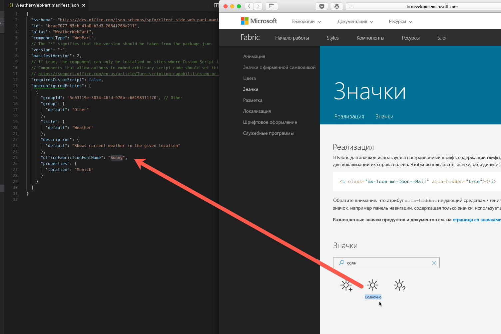
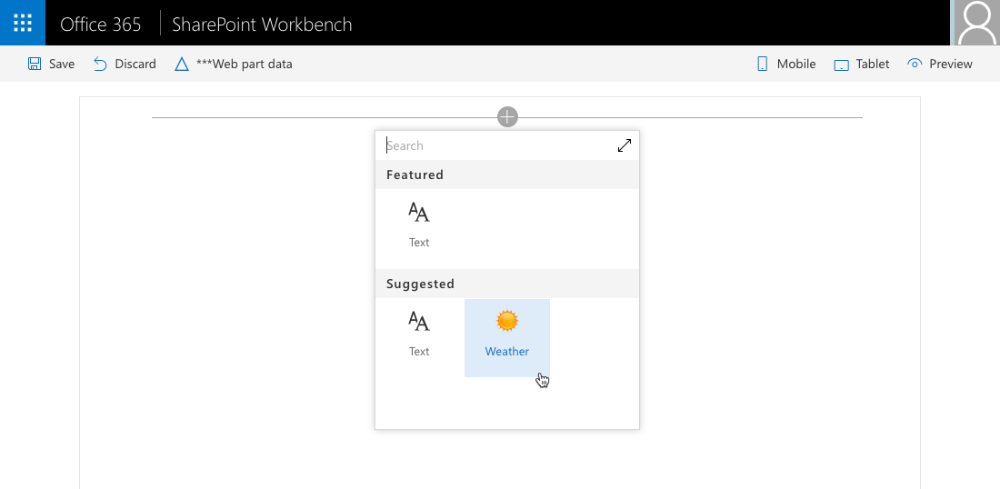

# <a name="configure-web-part-icon"></a>Настройка значка веб-части

Выбрав значок, иллюстрирующий назначение клиентской веб-части SharePoint, вы поможете пользователям находить ее среди остальных веб-частей, доступных на панели элементов. 

## <a name="preconfigure-web-parts"></a>Предварительная настройка веб-частей

Значок веб-части определяется в ее манифесте среди заранее настроенных записей. Если у вашей веб-части несколько назначений и ее можно настраивать в соответствии с потребностями пользователя, то для каждой конфигурации можно задать отдельный значок, указывающий ее назначение. 

Наглядный значок поможет пользователям находить нужную веб-часть. Дополнительные сведения о предварительной настройке веб-частей см. в [этой статье](../guidance/simplify-adding-web-parts-with-preconfigured-entries.md).

В SharePoint Framework доступен ряд способов определения значков для веб-частей.

## <a name="use-office-ui-fabric-icon-font"></a>Использование шрифта значков Office UI Fabric

Один из способов определения значка для веб-части — использование свойства **officeFabricIconFontName**. С помощью этого свойства можно выбрать один из значков, входящих в состав Office UI Fabric.

Список доступных значков Office UI Fabric см. в статье [Значки](https://developer.microsoft.com/ru-RU/fabric#/styles/icons).

### <a name="to-use-a-specific-icon"></a>Использование определенного значка

1. Скопируйте имя значка со страницы обзора значков Office UI Fabric и вставьте его в качестве значения свойства **officeFabricIconFontName** в манифесте веб-части.

  

  ```json
  {
    "$schema": "https://dev.office.com/json-schemas/spfx/client-side-web-part-manifest.schema.json",
    "id": "bcae7077-85cb-41a0-b3d3-2084f268a211",
    "alias": "WeatherWebPart",
    "componentType": "WebPart",
    // The "*" signifies that the version should be taken from the package.json
    "version": "*",
    "manifestVersion": 2,
    // If true, the component can only be installed on sites where Custom Script is allowed.
    // Components that allow authors to embed arbitrary script code should set this to true.
    // https://support.office.com/en-us/article/Turn-scripting-capabilities-on-or-off-1f2c515f-5d7e-448a-9fd7-835da935584f
    "requiresCustomScript": false,
    "preconfiguredEntries": [
      {
        "groupId": "5c03119e-3074-46fd-976b-c60198311f70", // Other
        "group": {
          "default": "Other"
        },
        "title": {
          "default": "Weather"
        },
        "description": {
          "default": "Shows current weather in the given location"
        },
        "officeFabricIconFontName": "Sunny",
        "properties": {
          "location": "Munich"
        }
      }
    ]
  }
  ```

2. При добавлении веб-части на страницу выбранный значок будет отображаться на панели элементов.

  

Главное преимущество этого подхода заключается в том, что файл изображения значка не нужно развертывать вместе с ресурсами веб-части. Кроме того, на компьютерах с другим разрешением или другими настройками специальных возможностей значок автоматически адаптируется без потери качества.

## <a name="use-an-external-icon-image"></a>Использование внешнего изображения

Несмотря на то что Office UI Fabric предоставляет множество изображений, при создании веб-частей вам может потребоваться использовать значок, относящийся к вашей организации, чтобы четко отделить свои веб-части от других веб-частей (как собственных, так и сторонних) на панели элементов.

Помимо значков Office UI Fabric, на платформе SharePoint Framework также можно использовать изображения. 

### <a name="to-use-an-image-as-a-web-part-icon"></a>Использование изображения в качестве значка веб-части

1. Укажите абсолютный URL-адрес изображения в свойстве **iconImageUrl** в манифесте веб-части.

  ```json
  {
    "$schema": "https://dev.office.com/json-schemas/spfx/client-side-web-part-manifest.schema.json",
    "id": "bcae7077-85cb-41a0-b3d3-2084f268a211",
    "alias": "WeatherWebPart",
    "componentType": "WebPart",
    // The "*" signifies that the version should be taken from the package.json
    "version": "*",
    "manifestVersion": 2,
    // If true, the component can only be installed on sites where Custom Script is allowed.
    // Components that allow authors to embed arbitrary script code should set this to true.
    // https://support.office.com/en-us/article/Turn-scripting-capabilities-on-or-off-1f2c515f-5d7e-448a-9fd7-835da935584f
    "requiresCustomScript": false,
    "preconfiguredEntries": [
      {
        "groupId": "5c03119e-3074-46fd-976b-c60198311f70", // Other
        "group": {
          "default": "Other"
        },
        "title": {
          "default": "Weather"
        },
        "description": {
          "default": "Shows current weather in the given location"
        },
        "iconImageUrl": "https://assets.contoso.com/weather.png",
        "properties": {
          "location": "Munich"
        }
      }
    ]
  }
  ```

2. Размер значка веб-части, отображаемого на панели элементов, составляет 40 x 28 пикселей. Если указано изображение большего размера, оно будет уменьшено с сохранением пропорций.

  

Использование пользовательских изображений обеспечивает более широкие возможности выбора значка для веб-части, но при этом их требуется развертывать вместе с другими ресурсами веб-части. Кроме того, качество изображения может снизиться при использовании высокого разрешения или некоторых специальных возможностей. Во избежание снижения качества можно использовать векторные изображения в формате SVG, которые также поддерживаются на платформе SharePoint Framework.

## <a name="use-a-base64-encoded-image"></a>Использование изображения в кодировке Base64

При использовании собственного изображения можно не указывать абсолютный URL-адрес файла изображения, размещенного вместе с другими ресурсами веб-части, а закодировать изображение в формате Base64 и использовать строку Base64 вместо URL-адреса.

В Интернете есть ряд служб, позволяющих закодировать изображение в формате Base64, например [эта](https://www.base64-image.de).

### <a name="to-use-a-base64-encoded-image"></a>Использование изображения в кодировке Base64

1. Закодируйте изображение.

2. Скопируйте строку Base64 и используйте ее в качестве значения свойства **iconImageUrl** в манифесте веб-части.

  ```json
  {
    "$schema": "https://dev.office.com/json-schemas/spfx/client-side-web-part-manifest.schema.json",
    "id": "bcae7077-85cb-41a0-b3d3-2084f268a211",
    "alias": "WeatherWebPart",
    "componentType": "WebPart",
    // The "*" signifies that the version should be taken from the package.json
    "version": "*",
    "manifestVersion": 2,
    // If true, the component can only be installed on sites where Custom Script is allowed.
    // Components that allow authors to embed arbitrary script code should set this to true.
    // https://support.office.com/en-us/article/Turn-scripting-capabilities-on-or-off-1f2c515f-5d7e-448a-9fd7-835da935584f
    "requiresCustomScript": false,
    "preconfiguredEntries": [
      {
        "groupId": "5c03119e-3074-46fd-976b-c60198311f70", // Other
        "group": {
          "default": "Other"
        },
        "title": {
          "default": "Weather"
        },
        "description": {
          "default": "Shows current weather in the given location"
        },
        "iconImageUrl": "data:image/svg+xml;base64,PD94bWwgdmVyc2lvbj0iMS4wIiBlbmNvZGluZz0iVVRGLTgiPz4KPHN2ZyB3aWR0aD0iMTAyMiIgaGVpZ2h0PSI5NzgiIHhtbG5zPSJodHRwOi8vd3d3LnczLm9yZy8yMDAwL3N2ZyIgeG1sbnM6c3ZnPSJodHRwOi8vd3d3LnczLm9yZy8yMDAwL3N2ZyI+CiA8Zz4KICA8dGl0bGU+TGF5ZXIgMTwvdGl...",
        "properties": {
          "location": "Munich"
        }
      }
    ]
  }
  ```

<br/>

Кодировка Base64 подходит как для растровых изображений (например, PNG-файлов), так и для векторных изображений в формате SVG. Главное преимущество использования изображений в кодировке Base64 заключается в том, что значок веб-части не нужно развертывать отдельно.


## <a name="additional-considerations"></a>Дополнительные рекомендации

У каждой веб-части должен быть значок. Если вы укажете значок веб-части, используя оба свойства (**officeFabricIconFontName** и **iconImageUrl**), будет использоваться значок, указанный в свойстве **officeFabricIconFontName**. 

Если вы не используете значок Office UI Fabric, URL-адрес необходимо указать в свойстве **iconImageUrl**.