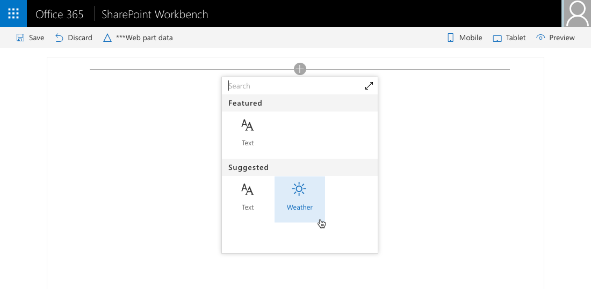

# <a name="configure-web-part-icon"></a><span data-ttu-id="aee6c-103">Настройка значка веб-части</span><span class="sxs-lookup"><span data-stu-id="aee6c-103">Configure web part icon</span></span>

<span data-ttu-id="aee6c-104">Выбрав значок, иллюстрирующий назначение клиентской веб-части SharePoint, вы поможете пользователям находить ее среди остальных веб-частей, доступных на панели элементов.</span><span class="sxs-lookup"><span data-stu-id="aee6c-104">Selecting an icon that illustrates the purpose of your web part, makes it easier for users to find your web part among other all web parts available in the toolbox.</span></span> 

## <a name="preconfigure-web-parts"></a><span data-ttu-id="aee6c-105">Предварительная настройка веб-частей</span><span class="sxs-lookup"><span data-stu-id="aee6c-105">Preconfigure web parts</span></span>

<span data-ttu-id="aee6c-106">Значок веб-части определяется в ее манифесте среди заранее настроенных записей.</span><span class="sxs-lookup"><span data-stu-id="aee6c-106">Web part icon is defined in the web part manifest as a part of preconfigured entries.</span></span> <span data-ttu-id="aee6c-107">Если у вашей веб-части несколько назначений и ее можно настраивать в соответствии с потребностями пользователя, то для каждой конфигурации можно задать отдельный значок, указывающий ее назначение.</span><span class="sxs-lookup"><span data-stu-id="aee6c-107">If you have a multipurpose web part, that can be configured to meet different needs, each configuration can have a different icon indicating its purpose.</span></span> 

<span data-ttu-id="aee6c-108">Наглядный значок поможет пользователям находить нужную веб-часть.</span><span class="sxs-lookup"><span data-stu-id="aee6c-108">Using a representative icon helps users find the web part they are looking for.</span></span> <span data-ttu-id="aee6c-109">Дополнительные сведения о предварительной настройке веб-частей см. в [этой статье](../guidance/simplify-adding-web-parts-with-preconfigured-entries.md).</span><span class="sxs-lookup"><span data-stu-id="aee6c-109">For more information about preconfiguring your web parts, see [Simplify adding web parts with preconfigured entries](../guidance/simplify-adding-web-parts-with-preconfigured-entries.md).</span></span>

<span data-ttu-id="aee6c-110">В SharePoint Framework доступен ряд способов определения значков для веб-частей.</span><span class="sxs-lookup"><span data-stu-id="aee6c-110">SharePoint Framework offers you a number of ways to define the icon for your web part.</span></span>

## <a name="use-office-ui-fabric-icon-font"></a><span data-ttu-id="aee6c-111">Использование шрифта значков Office UI Fabric</span><span class="sxs-lookup"><span data-stu-id="aee6c-111">Using Office UI Fabric icon font</span></span>

<span data-ttu-id="aee6c-112">Один из способов определения значка для веб-части — использование свойства **officeFabricIconFontName**.</span><span class="sxs-lookup"><span data-stu-id="aee6c-112">One way to define the icon for your web part is by using the **officeFabricIconFontName** property.</span></span> <span data-ttu-id="aee6c-113">С помощью этого свойства можно выбрать один из значков, входящих в состав Office UI Fabric.</span><span class="sxs-lookup"><span data-stu-id="aee6c-113">This property allows you to choose one of the icons offered as a part of Office UI Fabric.</span></span>

<span data-ttu-id="aee6c-114">Список доступных значков Office UI Fabric см. в статье [Значки](https://developer.microsoft.com/ru-RU/fabric#/styles/icons).</span><span class="sxs-lookup"><span data-stu-id="aee6c-114">For a list of available Office UI Fabric icons, see [Icons](https://developer.microsoft.com/ru-RU/fabric#/styles/icons).</span></span>

### <a name="to-use-a-specific-icon"></a><span data-ttu-id="aee6c-115">Использование определенного значка</span><span class="sxs-lookup"><span data-stu-id="aee6c-115">To use a specific icon</span></span>

1. <span data-ttu-id="aee6c-116">Скопируйте имя значка со страницы обзора значков Office UI Fabric и вставьте его в качестве значения свойства **officeFabricIconFontName** в манифесте веб-части.</span><span class="sxs-lookup"><span data-stu-id="aee6c-116">To use the specific icon, from the Office UI Fabric icons overview page, copy its name, and paste as the value of the **officeFabricIconFontName** property in the manifest of your web part.</span></span>

  

  ```json
  {
    "$schema": "https://dev.office.com/json-schemas/spfx/client-side-web-part-manifest.schema.json",
    "id": "bcae7077-85cb-41a0-b3d3-2084f268a211",
    "alias": "WeatherWebPart",
    "componentType": "WebPart",
    // The "*" signifies that the version should be taken from the package.json
    "version": "*",
    "manifestVersion": 2,
    // If true, the component can only be installed on sites where Custom Script is allowed.
    // Components that allow authors to embed arbitrary script code should set this to true.
    // https://support.office.com/en-us/article/Turn-scripting-capabilities-on-or-off-1f2c515f-5d7e-448a-9fd7-835da935584f
    "requiresCustomScript": false,
    "preconfiguredEntries": [
      {
        "groupId": "5c03119e-3074-46fd-976b-c60198311f70", // Other
        "group": {
          "default": "Other"
        },
        "title": {
          "default": "Weather"
        },
        "description": {
          "default": "Shows current weather in the given location"
        },
        "officeFabricIconFontName": "Sunny",
        "properties": {
          "location": "Munich"
        }
      }
    ]
  }
  ```

2. <span data-ttu-id="aee6c-118">При добавлении веб-части на страницу выбранный значок будет отображаться на панели элементов.</span><span class="sxs-lookup"><span data-stu-id="aee6c-118">When adding your web part to the page, the selected icon will be displayed in the toolbox.</span></span>

  

<span data-ttu-id="aee6c-120">Главное преимущество этого подхода заключается в том, что файл изображения значка не нужно развертывать вместе с ресурсами веб-части.</span><span class="sxs-lookup"><span data-stu-id="aee6c-120">The big benefit of this approach is, that you don't need to deploy the icon image file along with your web part assets.</span></span> <span data-ttu-id="aee6c-121">Кроме того, на компьютерах с другим разрешением или другими настройками специальных возможностей значок автоматически адаптируется без потери качества.</span><span class="sxs-lookup"><span data-stu-id="aee6c-121">Additionally, on computers using different DPI or other accessibility settings, the icon will automatically adapt to these settings without losing quality.</span></span>

## <a name="use-an-external-icon-image"></a><span data-ttu-id="aee6c-122">Использование внешнего изображения</span><span class="sxs-lookup"><span data-stu-id="aee6c-122">Using an external icon image</span></span>

<span data-ttu-id="aee6c-123">Несмотря на то что Office UI Fabric предоставляет множество изображений, при создании веб-частей вам может потребоваться использовать значок, относящийся к вашей организации, чтобы четко отделить свои веб-части от других веб-частей (как собственных, так и сторонних) на панели элементов.</span><span class="sxs-lookup"><span data-stu-id="aee6c-123">Although Office UI Fabric offers many images, when building web parts, you might want to use something specific to your organization to clearly separate your web parts from other first and third party web parts visible in the toolbox.</span></span>

<span data-ttu-id="aee6c-124">Помимо значков Office UI Fabric, на платформе SharePoint Framework также можно использовать изображения.</span><span class="sxs-lookup"><span data-stu-id="aee6c-124">Next to using Office UI Fabric icons, SharePoint Framework also allows you to use images.</span></span> 

### <a name="to-use-an-image-as-a-web-part-icon"></a><span data-ttu-id="aee6c-125">Использование изображения в качестве значка веб-части</span><span class="sxs-lookup"><span data-stu-id="aee6c-125">To use an image as a web part icon</span></span>

1. <span data-ttu-id="aee6c-126">Укажите абсолютный URL-адрес изображения в свойстве **iconImageUrl** в манифесте веб-части.</span><span class="sxs-lookup"><span data-stu-id="aee6c-126">Specify the image's absolute URL in the **iconImageUrl** property in the web part manifest.</span></span>

  ```json
  {
    "$schema": "https://dev.office.com/json-schemas/spfx/client-side-web-part-manifest.schema.json",
    "id": "bcae7077-85cb-41a0-b3d3-2084f268a211",
    "alias": "WeatherWebPart",
    "componentType": "WebPart",
    // The "*" signifies that the version should be taken from the package.json
    "version": "*",
    "manifestVersion": 2,
    // If true, the component can only be installed on sites where Custom Script is allowed.
    // Components that allow authors to embed arbitrary script code should set this to true.
    // https://support.office.com/en-us/article/Turn-scripting-capabilities-on-or-off-1f2c515f-5d7e-448a-9fd7-835da935584f
    "requiresCustomScript": false,
    "preconfiguredEntries": [
      {
        "groupId": "5c03119e-3074-46fd-976b-c60198311f70", // Other
        "group": {
          "default": "Other"
        },
        "title": {
          "default": "Weather"
        },
        "description": {
          "default": "Shows current weather in the given location"
        },
        "iconImageUrl": "https://assets.contoso.com/weather.png",
        "properties": {
          "location": "Munich"
        }
      }
    ]
  }
  ```

2. <span data-ttu-id="aee6c-127">Размер значка веб-части, отображаемого на панели элементов, составляет 40 x 28 пикселей.</span><span class="sxs-lookup"><span data-stu-id="aee6c-127">The web part icon image displayed in the toolbox is 40x28px.</span></span> <span data-ttu-id="aee6c-128">Если указано изображение большего размера, оно будет уменьшено с сохранением пропорций.</span><span class="sxs-lookup"><span data-stu-id="aee6c-128">If your image is bigger, it will be sized proportionally to match these dimensions.</span></span>

  

<span data-ttu-id="aee6c-130">Использование пользовательских изображений обеспечивает более широкие возможности выбора значка для веб-части, но при этом их требуется развертывать вместе с другими ресурсами веб-части.</span><span class="sxs-lookup"><span data-stu-id="aee6c-130">While using custom images gives you more flexibility to choose an icon for your web part, it requires you to deploy them along with your other web part assets.</span></span> <span data-ttu-id="aee6c-131">Кроме того, качество изображения может снизиться при использовании высокого разрешения или некоторых специальных возможностей.</span><span class="sxs-lookup"><span data-stu-id="aee6c-131">Additionally, your image might lose quality when displayed in higher DPI or specific accessibility settings.</span></span> <span data-ttu-id="aee6c-132">Во избежание снижения качества можно использовать векторные изображения в формате SVG, которые также поддерживаются на платформе SharePoint Framework.</span><span class="sxs-lookup"><span data-stu-id="aee6c-132">To avoid quality loss, you can use vector-based SVG images which are also supported by the SharePoint Framework.</span></span>

## <a name="use-a-base64-encoded-image"></a><span data-ttu-id="aee6c-133">Использование изображения в кодировке Base64</span><span class="sxs-lookup"><span data-stu-id="aee6c-133">Use a base64-encoded image</span></span>

<span data-ttu-id="aee6c-134">При использовании собственного изображения можно не указывать абсолютный URL-адрес файла изображения, размещенного вместе с другими ресурсами веб-части, а закодировать изображение в формате Base64 и использовать строку Base64 вместо URL-адреса.</span><span class="sxs-lookup"><span data-stu-id="aee6c-134">When using a custom image, rather than specifying an absolute URL to the image file hosted together with other web part assets, you can have your image base64 encoded and use the base64 string instead of the URL.</span></span>

<span data-ttu-id="aee6c-135">В Интернете есть ряд служб, позволяющих закодировать изображение в формате Base64, например [эта](https://www.base64-image.de).</span><span class="sxs-lookup"><span data-stu-id="aee6c-135">A number of services are available online that you can use to base64-encode your image; for more information, see [Convert your images to Base64](https://www.base64-image.de).</span></span>

### <a name="to-use-a-base64-encoded-image"></a><span data-ttu-id="aee6c-136">Использование изображения в кодировке Base64</span><span class="sxs-lookup"><span data-stu-id="aee6c-136">To use a base64-encoded image</span></span>

1. <span data-ttu-id="aee6c-137">Закодируйте изображение.</span><span class="sxs-lookup"><span data-stu-id="aee6c-137">Encode the image.</span></span>

2. <span data-ttu-id="aee6c-138">Скопируйте строку Base64 и используйте ее в качестве значения свойства **iconImageUrl** в манифесте веб-части.</span><span class="sxs-lookup"><span data-stu-id="aee6c-138">After encoding the image, copy the base64 string and use it as the value for the **iconImageUrl** property in the web part manifest.</span></span>

  ```json
  {
    "$schema": "https://dev.office.com/json-schemas/spfx/client-side-web-part-manifest.schema.json",
    "id": "bcae7077-85cb-41a0-b3d3-2084f268a211",
    "alias": "WeatherWebPart",
    "componentType": "WebPart",
    // The "*" signifies that the version should be taken from the package.json
    "version": "*",
    "manifestVersion": 2,
    // If true, the component can only be installed on sites where Custom Script is allowed.
    // Components that allow authors to embed arbitrary script code should set this to true.
    // https://support.office.com/en-us/article/Turn-scripting-capabilities-on-or-off-1f2c515f-5d7e-448a-9fd7-835da935584f
    "requiresCustomScript": false,
    "preconfiguredEntries": [
      {
        "groupId": "5c03119e-3074-46fd-976b-c60198311f70", // Other
        "group": {
          "default": "Other"
        },
        "title": {
          "default": "Weather"
        },
        "description": {
          "default": "Shows current weather in the given location"
        },
        "iconImageUrl": "data:image/svg+xml;base64,PD94bWwgdmVyc2lvbj0iMS4wIiBlbmNvZGluZz0iVVRGLTgiPz4KPHN2ZyB3aWR0aD0iMTAyMiIgaGVpZ2h0PSI5NzgiIHhtbG5zPSJodHRwOi8vd3d3LnczLm9yZy8yMDAwL3N2ZyIgeG1sbnM6c3ZnPSJodHRwOi8vd3d3LnczLm9yZy8yMDAwL3N2ZyI+CiA8Zz4KICA8dGl0bGU+TGF5ZXIgMTwvdGl...",
        "properties": {
          "location": "Munich"
        }
      }
    ]
  }
  ```

<br/>

<span data-ttu-id="aee6c-139">Кодировка Base64 подходит как для растровых изображений (например, PNG-файлов), так и для векторных изображений в формате SVG.</span><span class="sxs-lookup"><span data-stu-id="aee6c-139">Base64 encoding works both for bitmap images such as PNG as well as vector SVG images.</span></span> <span data-ttu-id="aee6c-140">Главное преимущество использования изображений в кодировке Base64 заключается в том, что значок веб-части не нужно развертывать отдельно.</span><span class="sxs-lookup"><span data-stu-id="aee6c-140">The big benefit of using base64 encoded images is, that you don't need to deploy the web part icon image separately.</span></span>


## <a name="additional-considerations"></a><span data-ttu-id="aee6c-142">Дополнительные рекомендации</span><span class="sxs-lookup"><span data-stu-id="aee6c-142">Additional considerations</span></span>

<span data-ttu-id="aee6c-143">У каждой веб-части должен быть значок.</span><span class="sxs-lookup"><span data-stu-id="aee6c-143">Each web part must have an icon.</span></span> <span data-ttu-id="aee6c-144">Если вы укажете значок веб-части, используя оба свойства (**officeFabricIconFontName** и **iconImageUrl**), будет использоваться значок, указанный в свойстве **officeFabricIconFontName**.</span><span class="sxs-lookup"><span data-stu-id="aee6c-144">If you specify the web part icon using both the **officeFabricIconFontName** and the **iconImageUrl** properties, the icon specified in the **officeFabricIconFontName** will be used.</span></span> 

<span data-ttu-id="aee6c-145">Если вы не используете значок Office UI Fabric, URL-адрес необходимо указать в свойстве **iconImageUrl**.</span><span class="sxs-lookup"><span data-stu-id="aee6c-145">If you choose not to use an Office UI Fabric icon, then you have to specify a URL in the **iconImageUrl** property.</span></span>