# Особенности проектирования клиентских веб-частей SharePoint

Для разработки веб-частей необходимо понимание [Office UI Fabric](http://dev.office.com/fabric). Все стили из [Fabric Core](https://github.com/OfficeDev/office-ui-fabric-core) (включая значки, оформление, использование цветов, анимация и адаптируемая сетка) загружаются по умолчанию и доступны веб-части. Не импортируйте копию Fabric для веб-части, так как может возникнуть конфликт с глобальной копией. Эти классы формируют основу стиля веб-части, от которой можно отклоняться, если требуется другое оформление, соответствующее фирменной символике компании.

## Компоненты Office UI Fabric React

Наряду с Office UI Fabric для создания веб-частей можно использовать компоненты Office UI Fabric React. Fabric React — это адаптируемая, рассчитанная на мобильные устройства коллекция компонентов, призванных ускорить и упростить создание веб-интерфейсов с помощью языка разработки Office.

В приведенном ниже примере со списком дел компоненты Fabric используются в области свойств, с помощью которой автор страницы может настраивать веб-часть.

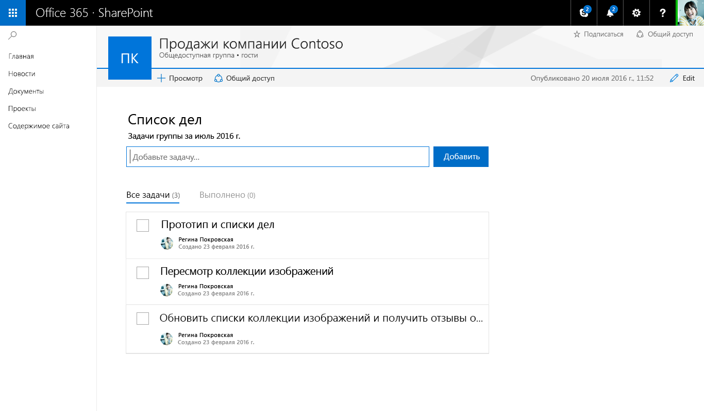

Полный список стилей, вариантов оформления, цветов, значков и анимаций Office UI Fabric представлен на странице [Стили Office UI Fabric](http://dev.office.com/fabric/styles).

## Адаптируемое поведение

На страницах нового интерфейса разработки SharePoint используется адаптируемая сетка Office UI Fabric, обеспечивающая приятный внешний вид каждой страницы. 

### Максимальная ширина

Рекомендуем использовать во всех веб-частях максимальную ширину 100 %, чтобы обеспечить их правильное расплавление и корректную работу на любой странице. Ширина страниц и столбцов определяется шаблоном страницы, но разработчик может менять ее. Если для веб-части задано максимальное количество пикселей, это может непредсказуемым образом повлиять на функции и макет страницы при ее просмотре на экранах разной ширины.

### Минимальная ширина

Все веб-части должны поддерживать расплавление, так как ширина страниц и столбцов может уменьшаться до 320 пикселей.

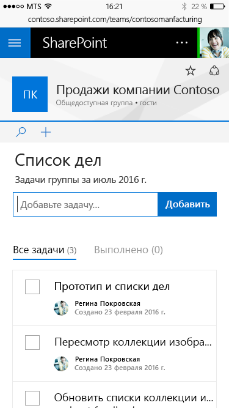

## Сравнение режимов публикации и правки веб-частей

У нового интерфейса создания страниц SharePoint есть два режима:

* **Режим публикации**, в котором группа или аудитория может просматривать содержимое и работать с веб-частями.
* **Режим правки**, в котором авторы страницы могут добавлять и настраивать веб-части, чтобы добавлять содержимое на страницу.

### Режим правки

#### Подсказка о добавлении и панель элементов

Подсказка о добавлении — это горизонтальная линия со значком "плюс", которая отображается при выделении веб-части или наведении указателя мыши на нее и указывает, что авторы могут добавлять веб-части на свою страницу. Когда пользователь нажимает значок "плюс", открывается панель элементов. Панель элементов содержит все веб-части, которые можно добавить на страницу.

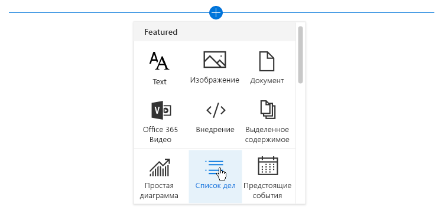

#### Панель инструментов

Вертикальная панель инструментов и ограничивающий прямоугольник входят в состав платформы для каждой веб-части и предоставляются страницей. Для каждой веб-части на панели инструментов есть действия редактирования и удаления.

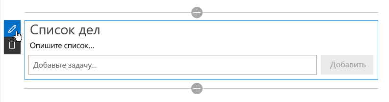

#### Контекстная правка

Для веб-частей следует разработать интерфейс в режиме WYSIWYG, где можно вводить данные и добавлять содержимое, которое увидит пользователь после публикации. Добавлять содержимое следует на странице, чтобы пользователь понимал, как оно будет выглядеть. Например, заголовки и описания следует вводить там, где будет отображаться текст, а новые задачи следует добавлять и редактировать в контексте страницы.

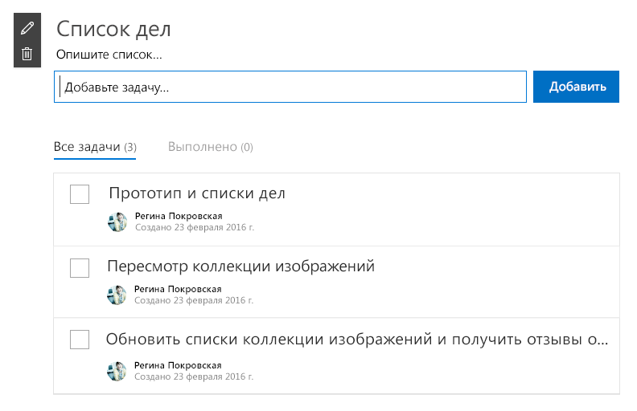

#### Правка на уровне элементов

Пользовательский интерфейс веб-части может меняться. Например, текст может превращаться в текстовое поле для ввода ссылок, а при отображении интерфейса можно менять порядок элементов и отмечать задачи в веб-части.

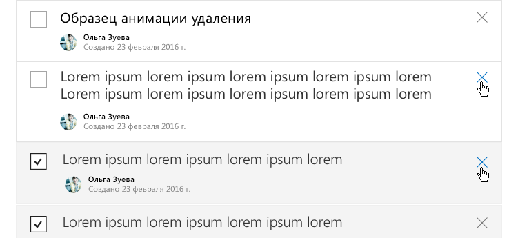

## Области свойств

Области свойств вызываются с помощью значка редактирования на панели инструментов. Области в первую очередь должны содержать параметры конфигурации для включения и отключения компонентов, которые либо отображаются на странице, либо вызывают службу для отображения содержимого.

Существует три типа областей свойств, позволяющих создавать и оформлять веб-части в соответствии с потребностями бизнеса или клиентов.

### Одиночная область

Одиночная область используется для простых веб-частей с небольшим количеством настраиваемых свойств.

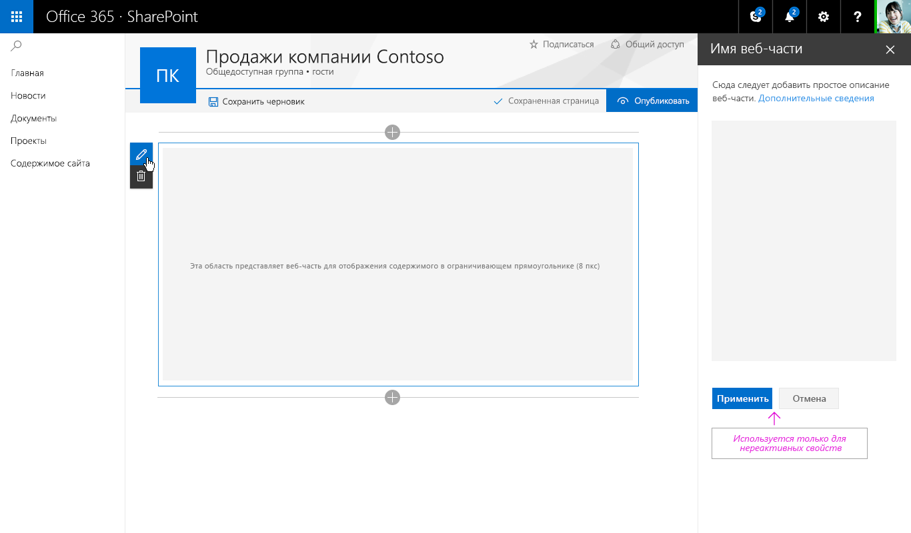

### Область-гармошка

Область-гармошка используется для размещения групп свойств с большим количеством вариантов, образующих длинный прокручивающийся список. Например, у вас может быть три группы с названиями "Свойства", "Внешний вид" и "Макет", по десять компонентов в каждой.

#### Гармошка с одной открытой группой

#### Гармошка с двумя открытыми прокручивающимися группами

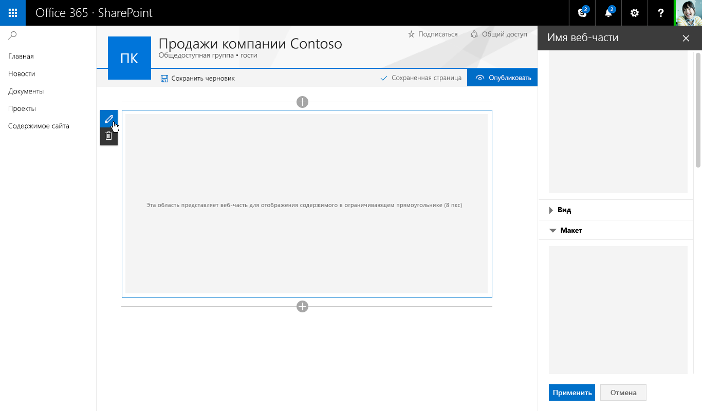

### Ступенчатые и страничные области свойств

Ступенчатая область используется для группирования свойств на нескольких шагах или страницах, если веб-часть требуется настраивать в линейном порядке или параметры, выбранные на первом шаге, влияют на то, какие параметры отображаются на втором.

**Шаг 1 из 3**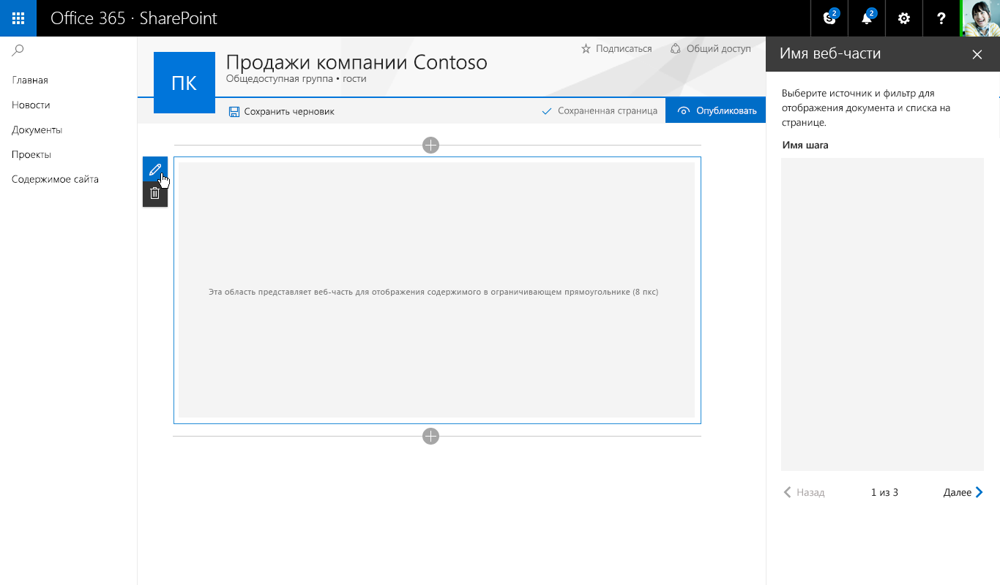

**Шаг 2 из 3**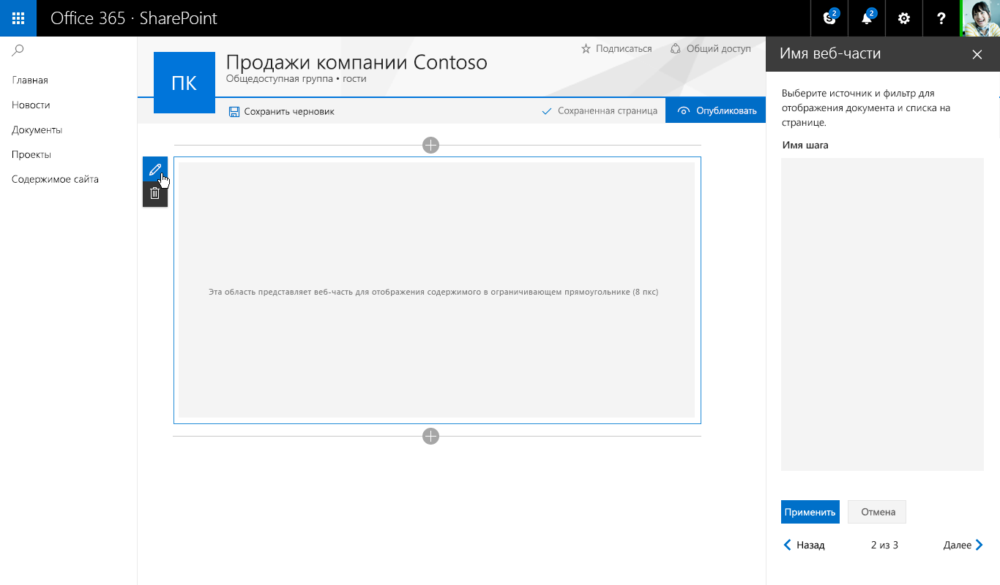

**Шаг 3 из 3**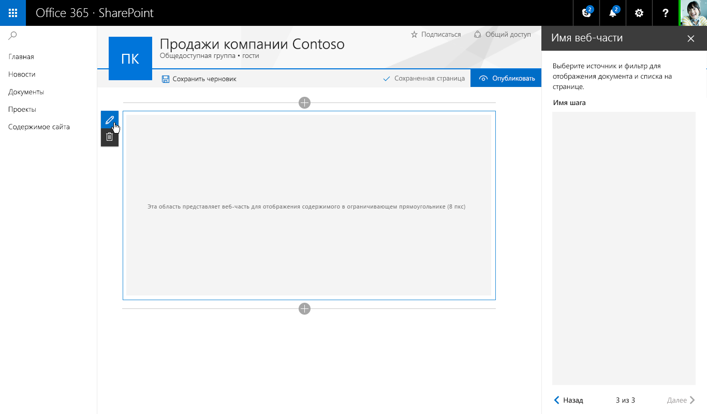

## Сравнение реактивных и нереактивных веб-частей

Реактивные веб-части разрабатываются как полноценные клиентские веб-части, то есть каждый компонент, настроенный в свойствах, отражает изменения в веб-части на странице. В веб-части "Список дел" при снятии флажка "Выполненные задачи" скрывается соответствующее представление в веб-части.

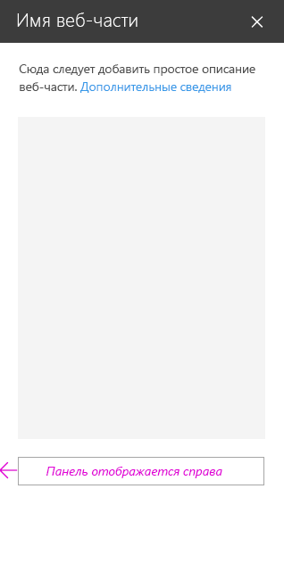

Нереактивные веб-части работают не только на стороне клиента. Как правило, одному или нескольким свойствам требуется совершить вызов, чтобы задать, получить или сохранить данные на сервере. В этом случае следует включить кнопки "Применить" и "Отмена" в нижней части области свойств.

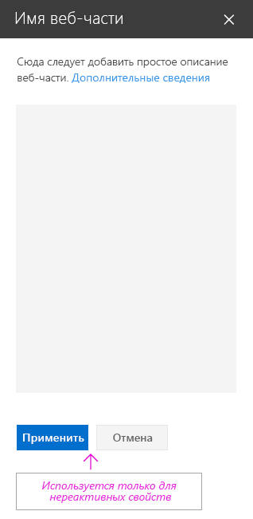

## Создание области свойств для списка дел

В примере со списком дел используются одиночная область и реактивная веб-часть. Ниже показаны все компоненты Fabric React и соответствующее оформление.

Добавление описания списка дел 

Раскрывающийся список для выбора задач из имеющегося списка 

Флажок, с помощью которого авторы могут показывать и скрывать различные представления 

Ползунок для выбора количества отображаемых задач 

После выбора элемента в раскрывающемся списке в веб-части отображается индикатор загрузки элементов на странице 

После загрузки новые задачи плавно появляются с использованием стилей анимации из Office UI Fabric 
