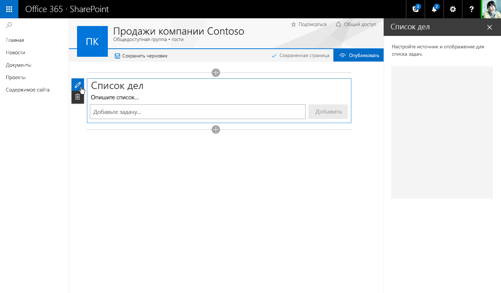
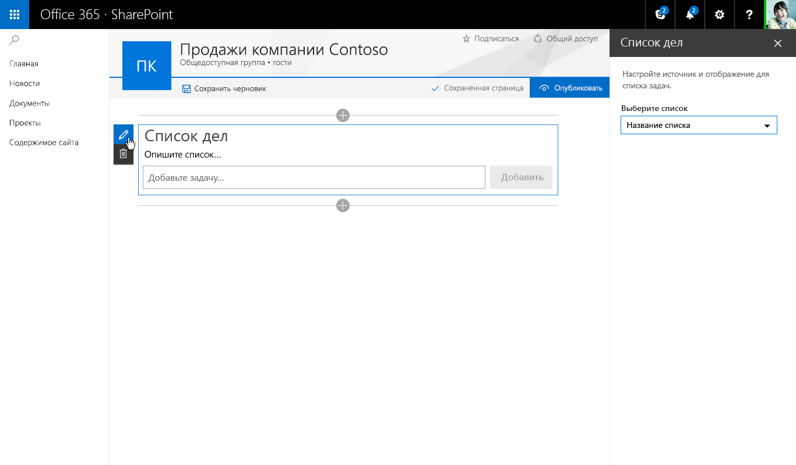
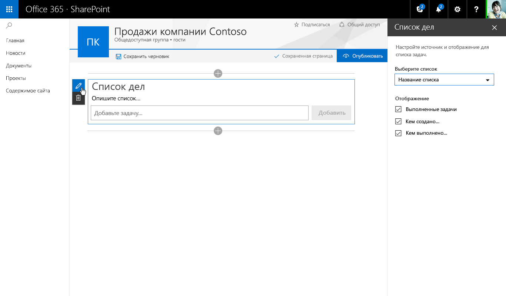
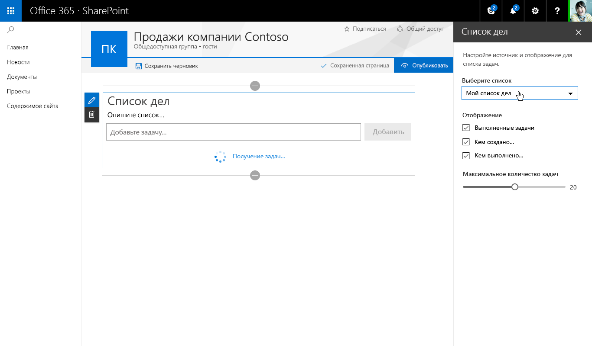
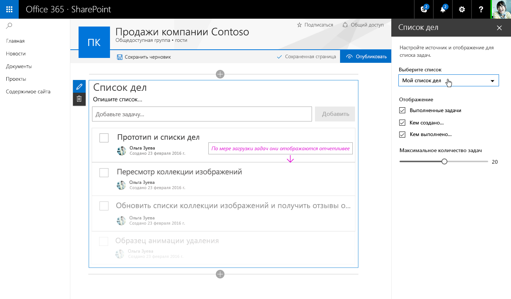

В примере со списком дел используются одиночная область и реактивная веб-часть. Ниже показаны все компоненты Fabric React и соответствующее оформление.The To-Do List example uses the single pane and is a reactive web part. The following shows each Fabric React component and the resulting design.

В примере со списком дел используются одиночная область и реактивная веб-часть. Ниже показаны все компоненты Fabric React и соответствующее оформление.

Добавление описания списка дел Adding a description for To-Do List 

Раскрывающийся список для выбора задач из имеющегося списка Drop down – to select tasks from an existing list 

Флажок, с помощью которого авторы могут показывать и скрывать различные представления Checkbox– to allow authors to show or hide different views 

Ползунок для выбора количества отображаемых задач Slider – to set the number of tasks visible 

После выбора элемента в раскрывающемся списке в веб-части отображается индикатор загрузки элементов на странице After selecting a list from the drop down the web part shows and indicator of items loading onto the page 

После загрузки новые задачи плавно появляются с использованием стилей анимации из Office UI Fabric When the new tasks are loaded the fade into view using animation styles from Office UI Fabric 
