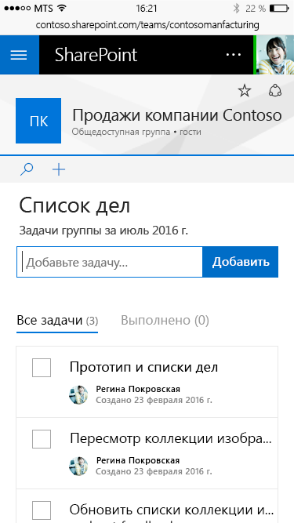
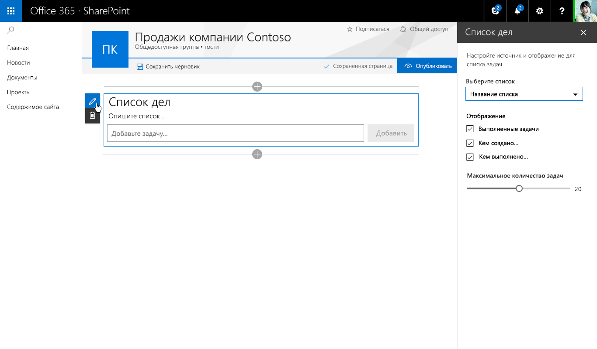
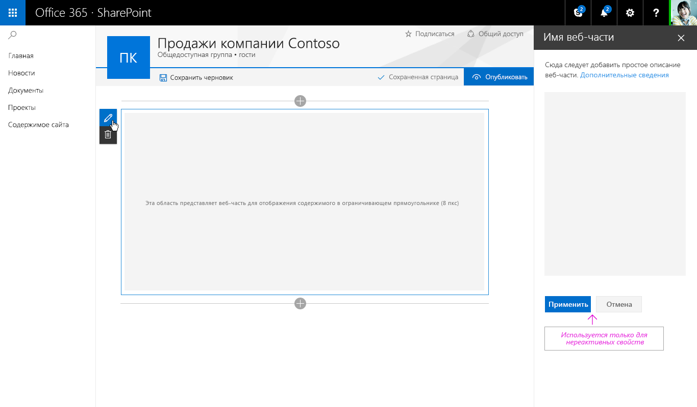
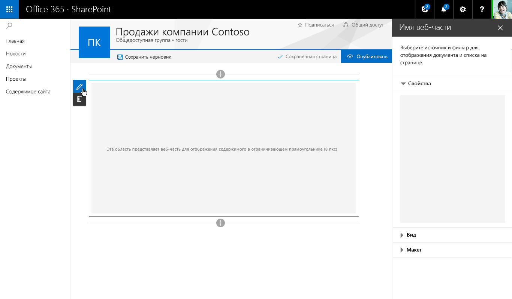
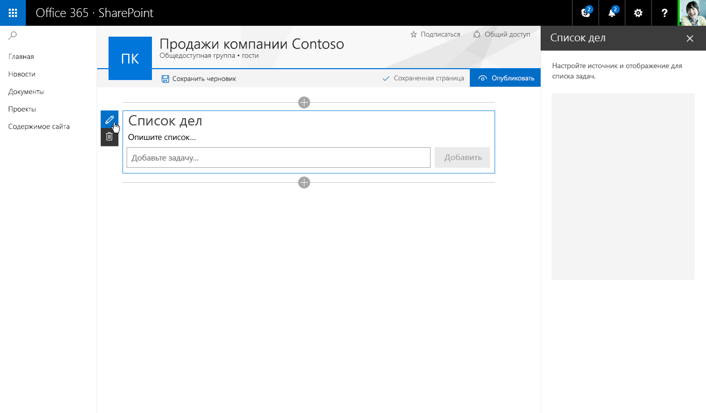
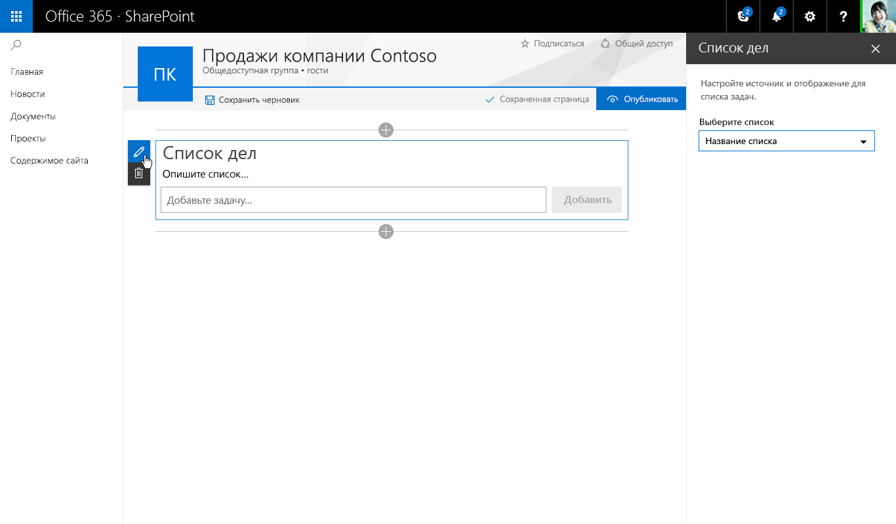
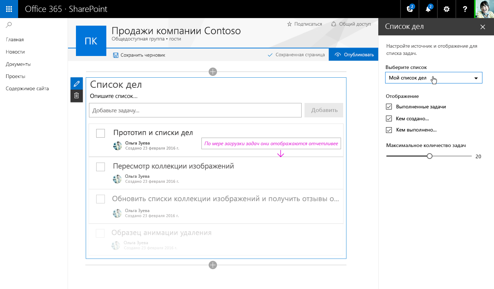

# Особенности разработки клиентских веб-частей SharePointDesign considerations for SharePoint client-side web parts

Для разработки веб-частей необходимо понимание работы с [Office UI Fabric](https://developer.microsoft.com/ru-RU/fabric).To get started designing web parts, you need to be familiar with [Office UI Fabric](https://developer.microsoft.com/ru-RU/fabric). Все стили из [Fabric Core](https://github.com/OfficeDev/office-ui-fabric-core) (включая значки, оформление, использование цветов, анимацию и адаптируемую сетку) загружаются по умолчанию и доступны веб-части.All of the styles from [Fabric Core](https://github.com/OfficeDev/office-ui-fabric-core), including icons, typography, color usage, animation, and the responsive grid, are loaded by default and available to your web part. 

Не импортируйте копию Fabric для веб-части, так как может возникнуть конфликт с глобальной копией.Do not import a copy of Fabric for your web part because this may conflict with the global copy. Эти классы формируют основу стиля веб-части, от которой можно отклоняться, если требуется другое оформление, соответствующее фирменной символике компании.These classes provide a foundation to your web part's styling, which you can always depart from if you require different visuals to match your company's brand.

## Компоненты Office UI Fabric ReactOffice UI Fabric React Components

Наряду с Office UI Fabric для создания веб-частей можно использовать компоненты Office UI Fabric React.Along with Office UI Fabric, you can use Office UI Fabric React components to build your web parts. Fabric React — это адаптируемая, рассчитанная на мобильные устройства коллекция компонентов, призванных ускорить и упростить создание веб-интерфейсов с помощью языка дизайна Office.Along with Office UI Fabric, you can use Office UI Fabric React components to build your web parts. Fabric React is a responsive, mobile-first collection of  components designed to make it quick and simple for you to create web experiences using the Office Design Language.

В приведенном ниже примере со списком дел компоненты Fabric используются в области свойств, с помощью которой автор страницы может настраивать веб-часть.The following To Do list example uses Fabric components in the property pane that lets the page author configure a web part.

Полный список стилей, вариантов оформления, цветов, значков и анимаций Office UI Fabric представлен на странице [Стили Office UI Fabric](https://developer.microsoft.com/ru-RU/fabric#/styles).You can find a complete list of the Office UI Fabric styles, typography, color, icons, and animations at [Office UI Fabric styles](https://developer.microsoft.com/ru-RU/fabric#/styles).

## Адаптируемое поведениеResponsive behavior

На страницах нового интерфейса разработки SharePoint используется адаптируемая сетка Office UI Fabric, обеспечивающая приятный внешний вид каждой страницы.Pages in the new SharePoint authoring experience use the Office UI Fabric responsive grid to help ensure that each page will look great. 

### Максимальная ширинаMaximum width

Рекомендуем использовать во всех веб-частях максимальную ширину 100 %, чтобы обеспечить их правильное расплавление и корректную работу на любой странице.We recommend that all web parts use a 100% maximum width to ensure that they re-flow and function properly on any page. Ширина страниц и столбцов определяется шаблоном страницы, но разработчик может менять ее.The page and column widths are defined by the page template but can be modified by the author. Если для веб-части задано максимальное количество пикселей, это может непредсказуемым образом повлиять на функции и макет страницы при ее просмотре на экранах разной ширины.If a maximum pixel value is set in the web part, there could be unexpected results in both functionality and layout when the page is seen at different widths.

### Минимальная ширинаMinimum width

Все веб-части должны поддерживать расплавление, так как ширина страниц и столбцов может уменьшаться до минимального значения в 320 пикселей.All web parts should be designed to reflow as the page/column width gets smaller down to a min width of 320 px.

 

## Режим правки веб-частиWeb part Edit mode

У нового интерфейса создания страниц SharePoint есть два режима:The new SharePoint page authoring experience has two modes:

* **режим публикации**, в котором группа или аудитория может просматривать содержимое и работать с веб-частями;**Published mode** which allows your team or audience to view content and interact with web parts.
* **режим правки**, в котором авторы страницы могут добавлять и настраивать веб-части, чтобы добавлять содержимое на страницу.**Edit mode** which allows page author(s) to add and configure web parts to add content to a page.

В разделах ниже описывается режим правки.The following sections describe Edit mode.

### Подсказка о добавлении и панель элементовAdd hint and Toolbox

Подсказка о добавлении — это горизонтальная линия со значком "плюс", которая отображается при выделении веб-части или наведении указателя мыши на нее и указывает, что авторы могут добавлять веб-части на свою страницу.The add hint is a horizontal line with a plus icon that is visible when a web part is selected and on hover to indicate where page authors can add new web parts to their page. Когда пользователь нажимает значок "плюс", открывается панель элементов.The Toolbox opens when a user selects the plus icon. Панель элементов содержит все веб-части, которые можно добавить на страницу.The Toolbox contains all the web parts that can be added to a page.

### Панель инструментовToolbar

Вертикальная панель инструментов и ограничивающий прямоугольник входят в состав платформы для каждой веб-части и предоставляются страницей. Для каждой веб-части на панели инструментов есть действия редактирования и удаления.A vertical toolbar and bounding box is part of the framework for every web part and provided by the page. Each web part has an edit and delete action in the toolbar.

### Контекстная правкаContextual edits

Для веб-частей следует разработать интерфейс в режиме WYSIWYG, где можно вводить данные и добавлять содержимое, которое отображается для пользователя после публикации.A WYSIWYG experience should be designed for web parts to fill in information or add content that is displayed to the user when published. Вводить это содержимое следует на странице, чтобы пользователь понимал, как оно будет выглядеть.Entering this content should be done on the page so that the user understands how the viewer sees the content. Например, заголовки и описания следует вводить там, где будет отображаться текст, а новые задачи следует добавлять и редактировать в контексте страницы.For example, titles and descriptions should be filled out where the text displays; new tasks should be added and modified in the context of the page.

### Правка на уровне элементовItem-level edits

Пользовательский интерфейс веб-части может меняться. Например, текст может превращаться в текстовое поле для ввода ссылок, а при отображении интерфейса можно менять порядок элементов и отмечать задачи в веб-части.UI can change within the web part; for example, turning text into a text field to fill out links or when displaying UI to reorder items or to check of tasks in a web part

## Области свойствProperty panes

Области свойств вызываются с помощью значка редактирования на панели инструментов.Property panes are invoked via the Edit icon on the toolbar. Области в первую очередь должны содержать параметры конфигурации для включения и отключения компонентов, которые либо отображаются на странице, либо вызывают службу для отображения содержимого.Property panes are invoked via the edit action icon on the toolbar. Panes should primarily contain configuration settings that enable/disable features that either show on page or that make a call to a service to display content.

Существует три типа областей свойств, позволяющих создавать и оформлять веб-части в соответствии с потребностями бизнеса или клиентов.There are three types of property panes to enable you to design and develop web parts that fit your business or customer needs.

### Одиночная областьSingle pane

Одиночная область используется для простых веб-частей с небольшим количеством настраиваемых свойств.A single pane is used for simple web parts that only have a small number of properties to configure.

### Область-гармошкаAccordion pane

Область-гармошка используется для размещения групп свойств с большим количеством вариантов, образующих длинный прокручивающийся список.A accordion pane is used for containing a group or groups of properties with many options and where the groups would result in a long scrolling list of options. For example, you might have three groups named Properties, Appearance, and Layout, each with ten components. Например, у вас может быть три группы с названиями "Свойства", "Внешний вид" и "Макет", по десять компонентов в каждой.For example, you might have three groups named Properties, Appearance, and Layout, each with ten components.

#### Гармошка с одной открытой группойAccordion - One group open

#### Гармошка с двумя открытыми прокручивающимися группамиAccordion- Two groups open and scrolled

### Ступенчатые и страничные области свойствProperty pane steps/pages

Ступенчатая область используется для группирования свойств на нескольких шагах или страницах, если веб-часть требуется настраивать в линейном порядке или параметры, выбранные на первом шаге, влияют на то, какие параметры отображаются на втором.A steps pane is used for grouping properties in multiple steps or pages when you need the web part to be configured in a linear order or when choices made on the first step affect options that display on the second step.

#### Шаг 1 из 3Step 1 of 3

#### Шаг 2 из 3Step 2 of 3

#### Шаг 3 из 3Step 3 of 3

## Сравнение реактивных и нереактивных веб-частейReactive vs non-reactive web parts

**Реактивные веб-части** разрабатываются как полноценные клиентские веб-части, то есть каждый компонент, настроенный в области свойств, отражает изменения в веб-части на странице.Reactive web parts are designed to be full client-side web parts, which mean that each component that is configured in the properties pane will reflect as the change is made within the web part on the page. For the To-Do List web part, unchecking “Completed Tasks” will hide this view in the web part. Так, снятие флажка "Выполненные задачи" скрывает это представление в веб-части "Список дел".For example, for the To-Do List web part, unchecking “Completed Tasks” hides this view in the web part.

**Нереактивные веб-части** работают не только на стороне клиента. Как правило, одному или нескольким свойствам требуется совершить вызов, чтобы задать, получить или сохранить данные на сервере.Nonreactive web parts are not fully client-side; generally, one or more properties need to make a call to set/pull or store data on a server. В этом случае следует включить кнопки "Применить" и "Отмена" в нижней части области свойств.In this case, you should enable the Apply and Cancel buttons at the bottom of the properties pane.

## Создание области свойств для списка делConstructing the To-Do List property pane

В примере со списком дел используются одиночная область и реактивная веб-часть.The To-Do List example uses the single pane and is a reactive web part. The following shows each Fabric React component and the resulting design. На схемах ниже показаны все компоненты Fabric React и соответствующее оформление.The following diagrams show each Fabric React component and the resulting design.

#### Добавление описания для списка делAdding a description for To-Do List Adding a description for To-Do List

#### Раскрывающийся список — для выбора задач из имеющегося спискаDropdown – to select tasks from an existing list

#### Флажок — с его помощью которого авторы могут показывать и скрывать различные представленияCheck box – to allow authors to show or hide different views

#### Ползунок — для выбора количества отображаемых задачSlider – to set the number of tasks visible Slider to set the number of tasks visible

#### После выбора элемента в раскрывающемся списке в веб-части отображается индикатор загрузки элементов на странице.After selecting a list from the drop down the web part shows and indicator of items loading onto the page Web part showing loading indicator to load items

#### После загрузки новые задачи плавно появляются на экране. Для этого используются стили анимации из Office UI Fabric.When the new tasks are loaded, they fade into view by using animation components from Office UI Fabric.

## См. такжеSee also

- [Разработка веб-части SharePointDesigning a SharePoint web part](../../../design/design-a-web-part.md)
- [Принципы дизайна SharePointDesigning great SharePoint experiences](../../../design/design-guidance-overview.md)
