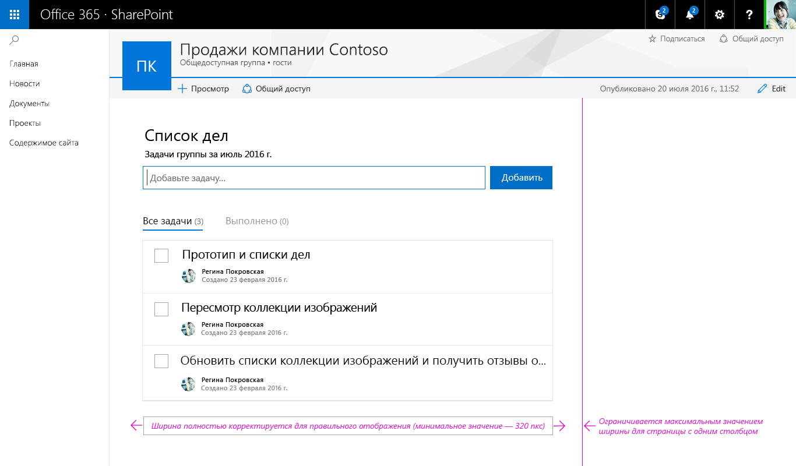

# Особенности разработки клиентских веб-частей SharePointDesign considerations for SharePoint client-side web parts

Для разработки веб-частей необходимо понимание [Office UI Fabric](http://dev.office.com/fabric). Все стили из [Fabric Core](https://github.com/OfficeDev/office-ui-fabric-core) (включая значки, оформление, использование цветов, анимация и адаптируемая сетка) загружаются по умолчанию и доступны веб-части. Не импортируйте копию Fabric для веб-части, так как может возникнуть конфликт с глобальной копией. Эти классы формируют основу стиля веб-части, от которой можно отклоняться, если требуется другое оформление, соответствующее фирменной символике компании.To get started designing web parts, you will want to be familiar with [Office UI Fabric](http://dev.office.com/fabric). All of the styles from [Fabric Core](https://github.com/OfficeDev/office-ui-fabric-core) – including icons, typography, color usage, animation, and the responsive grid – are loaded by default and available to your web part. Do not import a copy of Fabric for your web part, as this may conflict with the global copy. These classes provide a foundation to your web part's styling, which you can always depart from if you require different visuals to match your company's brand.

## Компоненты Office UI Fabric ReactOffice UI Fabric React Components

Наряду с Office UI Fabric для создания веб-частей можно использовать компоненты Office UI Fabric React. Fabric React — это адаптируемая, рассчитанная на мобильные устройства коллекция компонентов, призванных ускорить и упростить создание веб-интерфейсов с помощью языка разработки Office.Along with Office UI Fabric, you can use Office UI Fabric React components to build your web parts. Fabric React is a responsive, mobile-first collection of  components designed to make it quick and simple for you to create web experiences using the Office Design Language.

В приведенном ниже примере со списком дел компоненты Fabric используются в области свойств, с помощью которой автор страницы может настраивать веб-часть.The following To Do list example uses Fabric components in the property pane that lets the page author configure a web part.

Полный список стилей, вариантов оформления, цветов, значков и анимаций Office UI Fabric представлен на странице [Стили Office UI Fabric](http://dev.office.com/fabric/styles).You can find a complete list of the Office UI Fabric styles, typography, color, icons, and animations at [Office UI Fabric styles](http://dev.office.com/fabric/styles).

## Адаптируемое поведениеResponsive behavior

На страницах нового интерфейса разработки SharePoint используется адаптируемая сетка Office UI Fabric, обеспечивающая приятный внешний вид каждой страницы.Pages in the new SharePoint authoring experience use the Office UI Fabric responsive grid to help ensure that each page will look great. 

### Максимальная ширинаMax width

Рекомендуем использовать во всех веб-частях максимальную ширину 100 %, чтобы обеспечить их правильное расплавление и корректную работу на любой странице. Ширина страниц и столбцов определяется шаблоном страницы, но разработчик может менять ее. Если для веб-части задано максимальное количество пикселей, это может непредсказуемым образом повлиять на функции и макет страницы при ее просмотре на экранах разной ширины.We recommend that all web parts use a 100% maximum width to ensure that they will re-flow and function properly on any page. The page and column widths are defined by the page template but can be modified by the author. If a max pixel value is set in the web part, there could be unexpected results in both functionality and layout when the page is seen at different widths.

### Минимальная ширинаMin width

Все веб-части должны поддерживать расплавление, так как ширина страниц и столбцов может уменьшаться до 320 пикселей.All web parts should be designed to reflow as the page/column width gets smaller down to a min width of 320 px.

## Сравнение режимов публикации и правки веб-частейWeb part published mode vs edit mode

У нового интерфейса создания страниц SharePoint есть два режима:The new SharePoint page authoring experience has two modes:

* **Режим публикации**, в котором группа или аудитория может просматривать содержимое и работать с веб-частями.**Published mode** which allows your team or audience to view content and interact with web parts.
* **Режим правки**, в котором авторы страницы могут добавлять и настраивать веб-части, чтобы добавлять содержимое на страницу.**Edit mode** which allows page author(s) to add and configure web parts to add content to a page.

### Режим правкиEdit mode

#### Подсказка о добавлении и панель элементовAdd hint and Toolbox

Подсказка о добавлении — это горизонтальная линия со значком "плюс", которая отображается при выделении веб-части или наведении указателя мыши на нее и указывает, что авторы могут добавлять веб-части на свою страницу. Когда пользователь нажимает значок "плюс", открывается панель элементов. Панель элементов содержит все веб-части, которые можно добавить на страницу.The add hint is a horizontal line with a plus icon that is visible when a web part is selected and on hover to indicate where page authors can add new web parts to their page. The toolbox opens when a user clicks/taps the plus icon. The toolbox contains all the web parts that can be added to a page.

#### Панель инструментовToolbar

Вертикальная панель инструментов и ограничивающий прямоугольник входят в состав платформы для каждой веб-части и предоставляются страницей. Для каждой веб-части на панели инструментов есть действия редактирования и удаления.A vertical toolbar and bounding box is part of the framework for every web part and provided by the page. Each web part has an edit and delete action in the toolbar.

#### Контекстная правкаContextual edits

Для веб-частей следует разработать интерфейс в режиме WYSIWYG, где можно вводить данные и добавлять содержимое, которое увидит пользователь после публикации. Добавлять содержимое следует на странице, чтобы пользователь понимал, как оно будет выглядеть. Например, заголовки и описания следует вводить там, где будет отображаться текст, а новые задачи следует добавлять и редактировать в контексте страницы.A WYSIWYG experience should be designed for web parts to fill in information or add content that will be displayed to the user when published. Entering this content should be done in page so the user understands how the viewer will see the content. For example, titles and descriptions should be filled out where the text displays or new tasks should be added and modified in context of the page.

#### Правка на уровне элементовItem-level edits

Пользовательский интерфейс веб-части может меняться. Например, текст может превращаться в текстовое поле для ввода ссылок, а при отображении интерфейса можно менять порядок элементов и отмечать задачи в веб-части.UI can change within the web part; for example, turning text into a text field to fill out links or when displaying UI to reorder items or to check of tasks in a web part

## Области свойствProperty panes

Области свойств вызываются с помощью значка редактирования на панели инструментов. Области в первую очередь должны содержать параметры конфигурации для включения и отключения компонентов, которые либо отображаются на странице, либо вызывают службу для отображения содержимого.Property panes are invoked via the edit action icon on the toolbar. Panes should primarily contain configuration settings that enable/disable features that either show on page or that make a call to a service to display content.

Существует три типа областей свойств, позволяющих создавать и оформлять веб-части в соответствии с потребностями бизнеса или клиентов.There are three types of property panes to enable you to design and develop web parts that fit your business or customer needs.

### Одиночная областьSingle pane

Одиночная область используется для простых веб-частей с небольшим количеством настраиваемых свойств.A single pane is used for simple web parts that only have a small number of properties to configure.

### Область-гармошкаAccordion pane

Область-гармошка используется для размещения групп свойств с большим количеством вариантов, образующих длинный прокручивающийся список. Например, у вас может быть три группы с названиями "Свойства", "Внешний вид" и "Макет", по десять компонентов в каждой.A accordion pane is used for containing a group or groups of properties with many options and where the groups would result in a long scrolling list of options. For example, you might have three groups named Properties, Appearance, and Layout, each with ten components.

#### Гармошка с одной открытой группойAccordion - One group open

#### Гармошка с двумя открытыми прокручивающимися группамиAccordion- Two groups open and scrolled

### Ступенчатые и страничные области свойствProperty pane steps/pages

Ступенчатая область используется для группирования свойств на нескольких шагах или страницах, если веб-часть требуется настраивать в линейном порядке или параметры, выбранные на первом шаге, влияют на то, какие параметры отображаются на втором.A steps pane is used for grouping properties in multiple steps or pages when you need the web part to be configured in a linear order or when choices made on the first step affect options that display on the second step.

**Шаг 1 из 3****Step 1 of 3**

**Шаг 2 из 3****Step 2 of 3**

**Шаг 3 из 3****Step 3 of 3**

## Сравнение реактивных и нереактивных веб-частейReactive vs non-reactive web parts

Реактивные веб-части разрабатываются как полноценные клиентские веб-части, то есть каждый компонент, настроенный в свойствах, отражает изменения в веб-части на странице. В веб-части "Список дел" при снятии флажка "Выполненные задачи" скрывается соответствующее представление в веб-части.Reactive web parts are designed to be full client-side web parts, which mean that each component that is configured in the properties pane will reflect as the change is made within the web part on the page. For the To-Do List web part, unchecking “Completed Tasks” will hide this view in the web part.

Нереактивные веб-части работают не только на стороне клиента. Как правило, одному или нескольким свойствам требуется совершить вызов, чтобы задать, получить или сохранить данные на сервере. В этом случае следует включить кнопки "Применить" и "Отмена" в нижней части области свойств.Non-reactive web parts are not fully client side and generally one or more properties need to make a call to set/pull or store data on a server. In this case, you should enable the Apply and Cancel buttons at the bottom of the properties pane.

## Создание области свойств для списка делConstructing the To-Do List property pane

В примере со списком дел используются одиночная область и реактивная веб-часть. Ниже показаны все компоненты Fabric React и соответствующее оформление.The To-Do List example uses the single pane and is a reactive web part. The following shows each Fabric React component and the resulting design.

Добавление описания списка дел Adding a description for To-Do List 

Раскрывающийся список для выбора задач из имеющегося списка Drop down – to select tasks from an existing list 

Флажок, с помощью которого авторы могут показывать и скрывать различные представления Checkbox– to allow authors to show or hide different views 

Ползунок для выбора количества отображаемых задач Slider – to set the number of tasks visible 

После выбора элемента в раскрывающемся списке в веб-части отображается индикатор загрузки элементов на странице After selecting a list from the drop down the web part shows and indicator of items loading onto the page 

После загрузки новые задачи плавно появляются с использованием стилей анимации из Office UI Fabric When the new tasks are loaded the fade into view using animation styles from Office UI Fabric 
