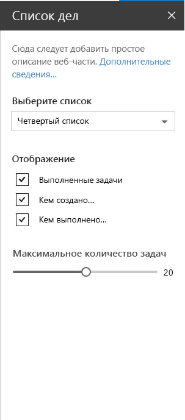

# <a name="integrate-your-sharepoint-client-side-web-part-with-the-property-pane"></a>Интеграция клиентской веб-части SharePoint с областью задач

С помощью области свойств пользователи могут настраивать различные свойства веб-части. В статье [Создание первой веб-части](../get-started/build-a-hello-world-web-part) рассказывается, как определить область свойств в классе **HelloWorldWebPart**. Свойства для области свойств определяются в параметре **propertyPaneSettings**.

На представленном ниже рисунке показан пример области свойств в SharePoint.



Область свойств содержит метаданные трех основных типов:

* Страницы
* Заголовок
* Группы

Вы можете разделять сложные взаимодействия на страницы. Страницы содержат заголовки и группы.

С помощью заголовка можно определить название области свойств, а с помощью групп — различные разделы области свойств для группирования наборов полей. 

Область свойств должна содержать страницу, необязательный заголовок и как минимум одну группу.

Затем поля свойств определяются в группе. 

## <a name="using-the-property-pane"></a>Использование области свойств

В приведенном ниже примере кода инициализируется и настраивается область свойств для веб-части. Создается метод типа **IPropertyPaneSettings** и возвращается коллекция страниц области свойств.

```ts
protected get propertyPaneSettings(): IPropertyPaneSettings {
  return {
    pages: [
      {
        header: {
          description: strings.PropertyPaneDescription
        },
        groups: [
          {
            groupName: strings.BasicGroupName,
            groupFields: [
              PropertyPaneTextField('description', {
                label: strings.DescriptionFieldLabel
              })
            ]
          }
        ]
      }
    ]
  };
}
```

### <a name="property-pane-fields"></a>Поля области свойств

Поддерживаются следующие типы полей:

* Подпись
* Текстовое поле
* Многострочное текстовое поле
* Флажок
* Раскрывающийся список
* Ссылка
* Ползунок
* Переключатель
* Пользовательский сервер

Типы полей доступны в виде модулей в **sp-client-platform**. Прежде чем использовать их в коде, их необходимо импортировать:

```ts
import {
  PropertyPaneTextField,
  PropertyPaneCheckbox,
  PropertyPaneLabel,
  PropertyPaneLink,
  PropertyPaneSlider,
  PropertyPaneToggle,
  PropertyPaneDropdown
} from '@microsoft/sp-client-preview';
```

Конструктор каждого типа поля определяется следующим образом (для примера используется тип **PropertyPaneTextField**):

```ts
PropertyPaneTextField('targetProperty',{
  //field properties are defined here
})
```

**targetProperty** определяет объект, связанный с этим типом поля, а также определяется в интерфейсе свойств веб-части.

Чтобы назначить типы этим свойствам, определите в классе веб-части интерфейс, включающий одно или несколько целевых свойств.

```ts
export interface IHelloWorldWebPartProps {
    targetProperty: string
}
```

В веб-части можно получить к нему доступ с помощью свойства **this.properties.targetProperty**.

```ts
<p class="ms-font-l ms-fontColor-white">${this.properties.description}</p>
```

Если свойства определены, к ним можно обращаться из веб-части с помощью переменной **this.properties.<значение_свойства>**. Дополнительные сведения см. в описании метода [**render** веб-части **HelloWorldWebPart**](../get-started/build-a-hello-world-web-part#web-part-render-method):

## <a name="handling-field-changes"></a>Обработка изменения полей

У области свойств есть два режима взаимодействия:

* Реактивный
* Нереактивный

В реактивном режиме при каждом изменении вызывается соответствующее событие. В этом режиме веб-часть автоматически обновляется в соответствии с новыми значениями.

Хотя реактивного режима достаточно для многих сценариев, иногда требуется нереактивное поведение. В нереактивном режиме веб-часть не обновляется автоматически, если пользователь не подтвердит изменения.

## <a name="custom-field-example"></a>Пример настраиваемого поля

Добавьте следующее определение поля в массив **groupFields**:

```ts
{
  type: IPropertyPaneFieldType.Custom,
  targetProperty: 'custom',
  properties: {
    onRender: this._customFieldRender.bind(this),
    value: undefined,
    context: undefined
  }
}
```

Добавьте следующие типы в импортированные элементы **@microsoft/sp-webpart-base**:

```ts
IPropertyPaneFieldType
```

Добавьте следующий частный метод для отрисовки настраиваемого поля:

```ts
private _customFieldRender(elem: HTMLElement, context: any, onChanged?: IOnCustomPropertyFieldChanged): void {
    elem.innerHTML = '<input id="password" type="password" name="password" class="ms-TextField-field">';
}
```
