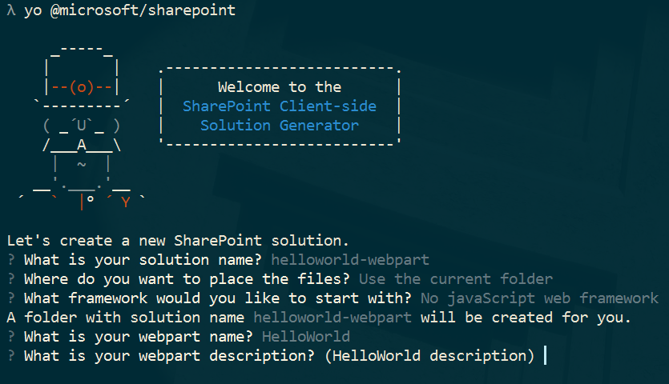
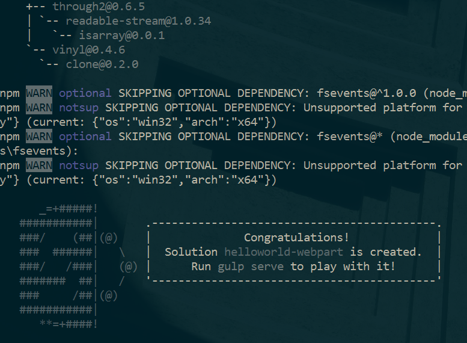
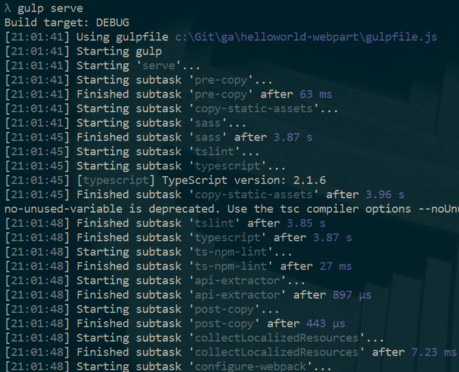
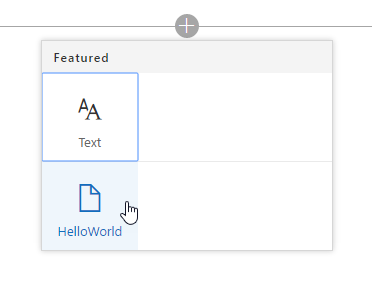
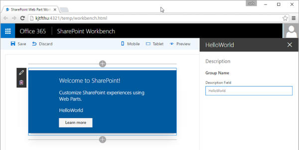
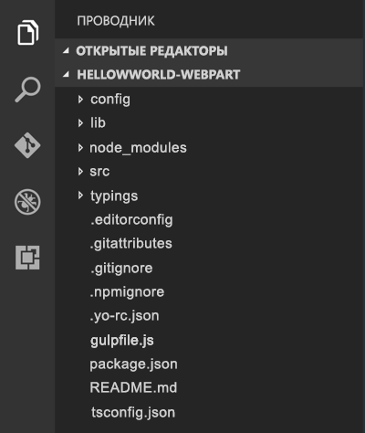
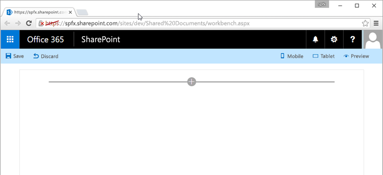
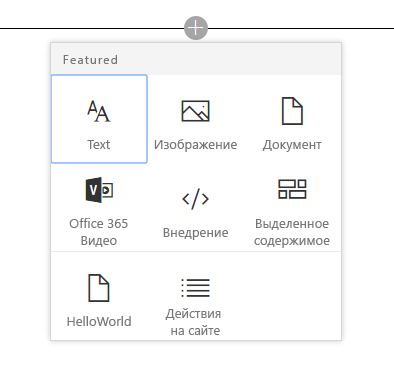
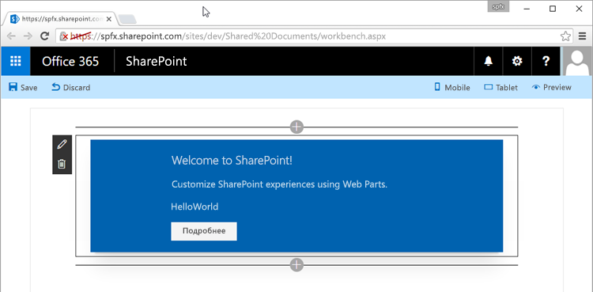

# <a name="build-your-first-sharepoint-client-side-web-part-hello-world-part-1"></a>Создание первой клиентской веб-части SharePoint (Hello World, часть 1)

Клиентские веб-части — это клиентские компоненты, которые запускаются в контексте страницы SharePoint. Клиентские веб-части можно развертывать в SharePoint Online, а для их создания также можно использовать современные инструменты и библиотеки JavaScript.

Поддержка клиентских веб-частей:

* Создание при помощи HTML и JavaScript.
* Как SharePoint Online, так и локальные среды.

>**Примечание.** Прежде чем выполнять действия, описанные в этой статье, обязательно [настройте среду разработки](../../set-up-your-development-environment).

Эти действия также показаны в видео на [канале SharePoint PnP в YouTube](https://www.youtube.com/watch?v=QbDtsMg88Js&list=PLR9nK3mnD-OXvSWvS2zglCzz4iplhVrKq). 

<a href="https://www.youtube.com/watch?v=QbDtsMg88Js&list=PLR9nK3mnD-OXvSWvS2zglCzz4iplhVrKq">

</a>


## <a name="create-a-new-web-part-project"></a>Создание проекта веб-части
Создайте каталог проекта в любом расположении.
    
```
md helloworld-webpart
```

Перейдите к каталогу проекта.

```
cd helloworld-webpart
```

Создайте веб-часть HelloWorld, запустив генератор Yeoman для SharePoint.

```
yo @microsoft/sharepoint
```
    
Когда появится запрос:

* Оставьте имя по умолчанию (**helloworld-webpart**) для своего решения и нажмите клавишу **ВВОД**.
* Выберите вариант **Use the current folder** (Использовать текущую папку) для размещения файлов.

Далее вам потребуется указать определенные сведения о веб-части:

* Оставьте выбранным параметр **No javascript web framework** (Не использовать платформу веб-решений на базе JavaScript) по умолчанию и нажмите клавишу **ВВОД**.
* Оставьте имя по умолчанию (**HelloWorld**) для своей веб-части и нажмите клавишу **ВВОД**.
* Оставьте **описание HelloWorld** по умолчанию для своей веб-части и нажмите клавишу **ВВОД**.



После этого Yeoman установит необходимые зависимости и выполнит скаффолдинг файлов решения, а также веб-части **HelloWorld**. Это может занять несколько минут. 

Когда скаффолдинг успешно закончится, появится следующее сообщение:



Сведения об устранении неполадок см. в статье [Известные проблемы](../basics/known-issues).

### <a name="using-your-favorite-code-editor"></a>Использование удобного редактора кода
Так как клиентские решения SharePoint созданы с помощью HTML и TypeScript, для разработки веб-части можно использовать любой редактор кода, который поддерживает клиентское программирование, например:

* [Visual Studio Code](https://code.visualstudio.com/);
* [Atom](https://atom.io);
* [Webstorm](https://www.jetbrains.com/webstorm).

В примерах и инструкциях, приведенных в документации по SharePoint Framework, указывается Visual Studio Code. Visual Studio Code — мощный редактор исходного кода, предложенный корпорацией Майкрософт, который занимает мало места на диске и работает на компьютерах с Windows, Mac OS или Linux. Он изначально поддерживает JavaScript, TypeScript и Node.js, а также предусматривает использование богатой экосистемы расширений для других языков (например, C++, C#, Python, PHP) и сред выполнения. 
   
## <a name="preview-the-web-part"></a>Просмотр веб-части
Чтобы просмотреть веб-часть, выполните сборку и запустите ее на локальном веб-сервере. В клиентской цепочке инструментов по умолчанию используется конечная точка HTTPS. Но так как сертификат по умолчанию не настроен для локальной среды разработки, браузер сообщит об ошибке сертификата. Цепочка инструментов SPFx включает сертификат разработчика, который можно установить для создания веб-частей.

Чтобы установить сертификат разработчика для использования SPFx, перейдите в консоль, откройте каталог **helloworld-webpart** и введите следующую команду:

> Обратите внимание: если вы используете браузер Chrome 58 или более новой версии, указанная ниже команда не создаст действительный сертификат для вашей среды, поэтому в локальной рабочей области отобразится сообщение о соответствующем исключении.

```
gulp trust-dev-cert
```

Теперь, когда вы установили сертификат разработчика, введите в консоли следующую команду для сборки и просмотра веб-части:

```
gulp serve
```

Эта команда выполнит ряд задач Gulp, чтобы создать локальный HTTPS-сервер на основе Node по адресу localhost:4321, и запустит браузер по умолчанию для просмотра веб-частей в локальной среде разработки.



Инструменты клиентской разработки SharePoint используют [Gulp](http://gulpjs.com/) как средство запуска задач для таких задач по сборке, как:

* добавление в пакет и минификация файлов JavaScript и CSS;
* запуск инструментов для вызова задач по добавлению в пакет и минификации перед каждой сборкой;
* компиляция файлов SASS в CSS;
* компиляция файлов TypeScript в JavaScript.

Если вы только начали работу с Gulp, прочтите статью [Использование Gulp](http://docs.asp.net/en/latest/client-side/using-gulp.html), в которой описывается, как использовать этот набор средств в Visual Studio при создании проектов на базе ASP.NET 5.

Visual Studio Code поддерживает Gulp и другие средства запуска задач. Нажмите клавиши **CTRL+SHIFT+B** в Windows или **CMD+SHIFT+B** в Mac OS для отладки и просмотра веб-части. 

### <a name="sharepoint-workbench"></a>SharePoint Workbench
SharePoint Workbench — это рабочая область конструирования для разработчиков, которая позволяет быстро просматривать и проверять веб-части, не развертывая их в SharePoint. SharePoint Workbench включает клиентскую страницу и клиентский холст, на которых можно добавлять, удалять и проверять веб-части, которые находятся в разработке.


Чтобы добавить веб-часть HelloWorld, нажмите кнопку **Добавить**. Эта кнопка открывает панель элементов со списком веб-частей, которые можно добавить. Список будет включать веб-часть **HelloWorld**, а также другие веб-части, доступные локально в среде разработки.
   

   
Выберите пункт **HelloWorld**, чтобы добавить эту веб-часть на страницу:
   


Поздравляем! Вы только что добавили свою первую клиентскую веб-часть на клиентскую страницу.
   
Теперь выберите значок карандаша в крайнем левом углу веб-части, чтобы открыть панель свойств веб-части.
   


На панели свойств можно задавать свойства для настройки веб-части. Панель свойств запускается на стороне клиента и имеет одинаковый дизайн для всех веб-частей SharePoint. 
   
Измените текст в поле **Описание** на текст **Клиентские веб-части — это великолепно!**

Обратите внимание, что при вводе текст в веб-части также меняется. 

Теперь вы можете настроить режим обновления для панели свойств, выбрав реактивный или нереактивный вариант. В режиме по умолчанию (реактивном) изменения становятся видны по мере редактирования свойств и сохраняются мгновенно.  

## <a name="web-part-project-structure"></a>Структура проекта веб-части
С помощью Visual Studio Code можно просмотреть структуру проекта веб-части. 

* В консоли перейдите к каталогу **src\webparts\helloWorld**. 
* Введите указанную ниже команду, чтобы открыть проект веб-части в Visual Studio Code (или используйте другой редактор).

```
code .
```



Если возникла ошибка, [задайте команду code в PATH](https://code.visualstudio.com/docs/editor/setup).

TypeScript — это основной язык для создания клиентских веб-частей SharePoint. TypeScript — это типизированная расширенная версия языка JavaScript. Код TypeScript компилируется в обычный JavaScript. Клиентские средства разработки SharePoint основаны на классах, модулях и интерфейсах TypeScript, что позволяет разработчикам создавать надежные клиентские веб-части. 

Ниже приведены некоторые ключевые файлы в проекте.

### <a name="web-part-class"></a>Класс веб-части
**HelloWorldWebPart.ts** определяет основную точку входа для веб-части. Класс веб-части **HelloWorldWebPart** расширяет класс **BaseClientSideWebPart**. Чтобы клиентская веб-часть была допустимой, она должна расширять класс **BaseClientSideWebPart**.

Этот класс обеспечивает минимальную функциональность, необходимую для создания веб-части. Он также предоставляет много параметров для проверки и доступа к свойствам только для чтения, например **displayMode**, другим свойствам веб-частей, контексту веб-частей, а также **instanceId** и **domElement**.

Обратите внимание, что класс веб-части определяется как принимающий тип свойства **IHelloWorldWebPartProps**.

Тип свойства определяется как интерфейс в отдельном файле **IHelloWorldWebPartProps.ts**.

```ts
export interface IHelloWorldWebPartProps {
    description: string;
}
```

Это определение свойства используется для определения пользовательских типов свойств для веб-части. Дополнительные сведения см. в разделе, посвященном панели свойств, ниже. 

#### <a name="web-part-render-method"></a>Метод отрисовки веб-части
Элемент DOM, в котором должна отрисовываться веб-часть, доступен в методе **render**. Этот метод используется для отрисовки веб-части в этом элементе DOM. В веб-части **HelloWorld** элемент DOM присвоен переменной DIV. Параметры метода включают режим отображения (чтение или редактирование) и настроенные свойства веб-части, если они есть: 

```ts
  public render(): void {
    this.domElement.innerHTML = `
      <div class="${styles.helloWorld}">
        <div class="${styles.container}">
          <div class="ms-Grid-row ms-bgColor-themeDark ms-fontColor-white ${styles.row}">
            <div class="ms-Grid-col ms-u-lg10 ms-u-xl8 ms-u-xlPush2 ms-u-lgPush1">
              <span class="ms-font-xl ms-fontColor-white">Welcome to SharePoint!</span>
              <p class="ms-font-l ms-fontColor-white">Customize SharePoint experiences using Web Parts.</p>
              <p class="ms-font-l ms-fontColor-white">${escape(this.properties.description)}</p>
              <a href="https://aka.ms/spfx" class="${styles.button}">
                <span class="${styles.label}">Learn more</span>
              </a>
            </div>
          </div>
        </div>
      </div>`;
  }
```

Эта модель достаточно гибкая — в элемент DOM можно загружать веб-части, созданные на любой платформе JavaScript. 

#### <a name="configure-the-web-part-property-pane"></a>Настройка области свойств веб-части
Область свойств определяется в классе **HelloWorldWebPart**. Панель свойств нужно настраивать в свойстве **propertyPaneSettings**.

Когда свойства заданы, вы можете получить к ним доступ в веб-части, используя `this.properties.<property-value>`, как показано в примере с методом **render**:

```ts
<p class="${styles.description}">${escape(this.properties.description)}</p>
```

Обратите внимание, что мы выполняем управляющий код HTML для значения свойства, чтобы убедиться, что строка является допустимой.

Просмотрите статью об [интеграции панели свойств с веб-частью](../basics/integrate-with-property-pane), чтобы узнать больше о работе с панелью свойств и типами полей в ней.

Давайте добавим в область свойств еще флажок, раскрывающийся список и переключатель. Для этого сначала импортируйте из платформы соответствующие поля области свойств.

Перейдите к верхней части файла и добавьте приведенный ниже код в раздел импорта из `@microsoft/sp-webpart-base`.

```ts
PropertyPaneCheckbox,
PropertyPaneDropdown,
PropertyPaneToggle
```

Полный раздел импорта будет выглядеть так:

```ts
import {
  BaseClientSideWebPart,
  IPropertyPaneConfiguration,
  PropertyPaneTextField,
  PropertyPaneCheckbox,
  PropertyPaneDropdown,
  PropertyPaneToggle
} from '@microsoft/sp-webpart-base';
```

Сохраните файл.

Далее обновите свойства веб-части, включив новые. При этом будут сопоставлены соответствующие поля и типизированные объекты.

Откройте **IHelloWorldWebPartProps.ts** и замените существующий код указанным ниже. 

```ts
export interface IHelloWorldWebPartProps {
    description: string;
    test: string;
    test1: boolean;
    test2: string;
    test3: boolean;
}
```

Сохраните файл.

Вернитесь к файлу **HelloWorldWebPart.ts**.

Замените метод **getPropertyPaneConfiguration** приведенным ниже кодом, который добавляет новые поля области свойств и сопоставляет их с соответствующими типизированными объектами.

```ts
protected getPropertyPaneConfiguration(): IPropertyPaneConfiguration {
  return {
    pages: [
      {
        header: {
          description: strings.PropertyPaneDescription
        },
        groups: [
          {
            groupName: strings.BasicGroupName,
            groupFields: [
            PropertyPaneTextField('description', {
              label: 'Description'
            }),
            PropertyPaneTextField('test', {
              label: 'Multi-line Text Field',
              multiline: true
            }),
            PropertyPaneCheckbox('test1', {
              text: 'Checkbox'
            }),
            PropertyPaneDropdown('test2', {
              label: 'Dropdown',
              options: [
                { key: '1', text: 'One' },
                { key: '2', text: 'Two' },
                { key: '3', text: 'Three' },
                { key: '4', text: 'Four' }
              ]}),
            PropertyPaneToggle('test3', {
              label: 'Toggle',
              onText: 'On',
              offText: 'Off'
            })
          ]
          }
        ]
      }
    ]
  };
}
```


После добавления свойств веб-части к ним можно получить доступ так же, как к свойству **description**:

```ts
<p class="ms-font-l ms-fontColor-white">${escape(this.properties.test)}</p>
```

Чтобы задать значение по умолчанию для этих свойств, необходимо обновить контейнер свойств **properties** манифеста веб-части.

Откройте `HelloWorldWebPart.manifest.json` и измените `properties` так:

```ts
"properties": {
  "description": "HelloWorld",
  "test": "Multi-line text field",
  "test1": true,
  "test2": "2",
  "test3": true
}
```

Область свойств веб-части будет содержать данные значения по умолчанию для указанных свойств.

### <a name="web-part-manifest"></a>Манифест веб-части
Файл **HelloWorldWebPart.manifest.json** определяет метаданные веб-части, такие как версия, идентификатор, отображаемое имя, значок и описание. Все веб-части должны содержать этот манифест.

```json
{
  "$schema": "../../../node_modules/@microsoft/sp-module-interfaces/lib/manifestSchemas/jsonSchemas/clientSideComponentManifestSchema.json",

  "id": "922a9623-f92f-4971-8574-185b31554e44",
  "alias": "HelloWorldWebPart",
  "componentType": "WebPart",
  "version": "0.0.1",
  "manifestVersion": 2,

  "preconfiguredEntries": [{
    "groupId": "922a9623-f92f-4971-8574-185b31554e44",
    "group": { "default": "Under Development" },
    "title": { "default": "HelloWorld" },
    "description": { "default": "HelloWorld description" },
    "officeFabricIconFontName": "Page",
    "properties": {
      "description": "HelloWorld",
      "test": "Multi-line text field",
      "test1": true,
      "test2": "2",
      "test3": true
    }
  }]
}
```

Теперь, когда мы добавили новые свойства, убедитесь, что веб-часть размещена в локальной среде разработки, выполнив команду ниже. Это также позволит убедиться, что указанные выше изменения применены правильно.

```
gulp serve
```

### <a name="preview-the-web-part-in-sharepoint"></a>Просмотр веб-части в SharePoint

В SharePoint размещается рабочая область SharePoint Workbench, чтобы вы могли просматривать и проверять локальные веб-части, которые находятся в разработке. Ее основное преимущество состоит в том, что веб-части запускаются в контексте SharePoint, и вы можете работать с данными SharePoint.

Перейдите по такому URL-адресу: https://your-sharepoint-site/_layouts/workbench.aspx.

>**Примечание.** Если у вас не установлен сертификат разработчика SPFx, рабочая область сообщит вам, что она не загружает сценарии из localhost. Выполните команду `gulp trust-dev-cert` в консоли каталога проекта, чтобы установить сертификат разработчика.



Обратите внимание, что рабочая область SharePoint теперь включает панель навигации Office 365.

Выберите **значок добавления** на холсте, чтобы открыть панель элементов. В панели элементов теперь отображаются веб-части, доступные на сайте с рабочей областью SharePoint, а также веб-часть **HelloWorldWebPart**.



Добавьте **HelloWorldWebPart** на панели элементов. Теперь ваша веб-часть работает на странице в SharePoint.



Так как ваша веб-часть по-прежнему находится на этапе разработки и тестирования, ее не нужно упаковывать и развертывать в SharePoint. 

## <a name="next-steps"></a>Дальнейшие действия
Поздравляем с запуском вашей первой веб-части Hello World! Теперь стоит ознакомиться со статьей [Подключение к SharePoint](./connect-to-sharepoint). В ней описано, как расширить возможности Hello World, обеспечив взаимодействие с REST API списков SharePoint. Обратите внимание, что команда `gulp serve` по-прежнему запущена в окне консоли (или в Visual Studio Code, если вы используете этот редактор). Можете переходить к следующей статье, не останавливая ее.
