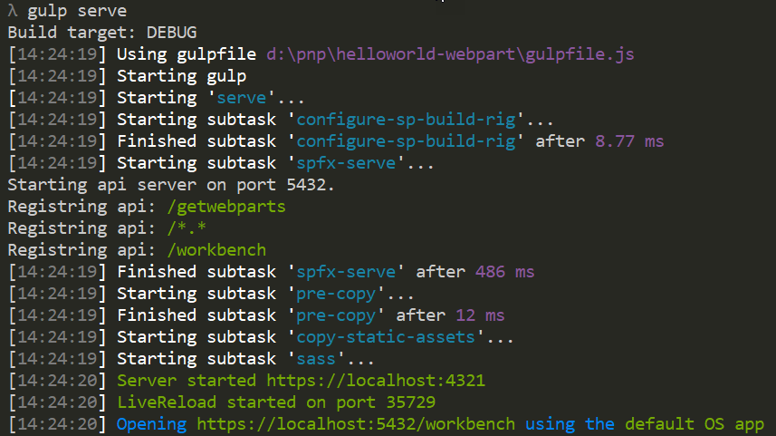
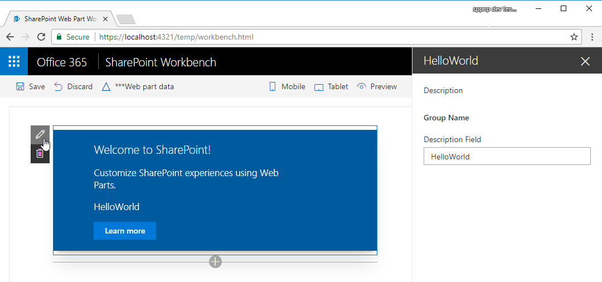
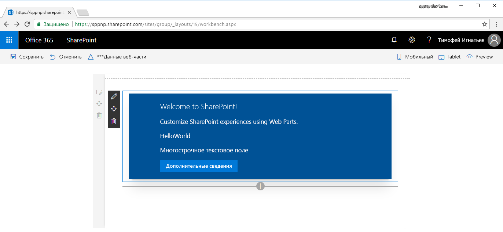

# <a name="build-your-first-sharepoint-client-side-web-part-hello-world-part-1"></a><span data-ttu-id="1b6df-103">Создание первой клиентской веб-части SharePoint (Hello World, часть 1)</span><span class="sxs-lookup"><span data-stu-id="1b6df-103">Build your first SharePoint client-side web part (Hello World part 1)</span></span>

<span data-ttu-id="1b6df-p101">Клиентские веб-части — это клиентские компоненты, которые запускаются в контексте страницы SharePoint. Клиентские веб-части можно развертывать в SharePoint Online, а для их создания также можно использовать современные инструменты и библиотеки JavaScript.</span><span class="sxs-lookup"><span data-stu-id="1b6df-p101">Client-side web parts are client-side components that run inside the context of a SharePoint page. Client-side web parts can be deployed to SharePoint Online, and you can also use modern JavaScript tools and libraries to build them.</span></span>

<span data-ttu-id="1b6df-106">Поддержка клиентских веб-частей:</span><span class="sxs-lookup"><span data-stu-id="1b6df-106">Client-side web parts support:</span></span>

* <span data-ttu-id="1b6df-107">Создание при помощи HTML и JavaScript.</span><span class="sxs-lookup"><span data-stu-id="1b6df-107">Building with HTML and JavaScript.</span></span>
* <span data-ttu-id="1b6df-108">Как SharePoint Online, так и локальные среды.</span><span class="sxs-lookup"><span data-stu-id="1b6df-108">Both SharePoint online and on-premises environments.</span></span>

> [!NOTE]
> <span data-ttu-id="1b6df-109">Прежде чем выполнять действия, описанные в этой статье, обязательно [настройте среду разработки](../../set-up-your-development-environment.md).</span><span class="sxs-lookup"><span data-stu-id="1b6df-109">Before following the steps in this article, be sure to [Set up your development environment](../../set-up-your-development-environment.md).</span></span>

<span data-ttu-id="1b6df-110">Эти действия также показаны в видео на [канале SharePoint PnP в YouTube](https://www.youtube.com/watch?v=YqUIX2pMUzg&list=PLR9nK3mnD-OXvSWvS2zglCzz4iplhVrKq&index=2).</span><span class="sxs-lookup"><span data-stu-id="1b6df-110">You can also follow these steps by watching this video on the [SharePoint PnP YouTube Channel](https://www.youtube.com/watch?v=YqUIX2pMUzg&list=PLR9nK3mnD-OXvSWvS2zglCzz4iplhVrKq&index=2).</span></span> 

<a href="https://www.youtube.com/watch?v=YqUIX2pMUzg&list=PLR9nK3mnD-OXvSWvS2zglCzz4iplhVrKq&index=2">

</a>


## <a name="create-a-new-web-part-project"></a><span data-ttu-id="1b6df-111">Создание проекта веб-части</span><span class="sxs-lookup"><span data-stu-id="1b6df-111">Create a new web part project</span></span>

### <a name="to-create-a-new-web-part-project"></a><span data-ttu-id="1b6df-112">Создание проекта веб-части</span><span class="sxs-lookup"><span data-stu-id="1b6df-112">To create a new web part project</span></span>

1. <span data-ttu-id="1b6df-113">Создайте каталог проекта в любом расположении.</span><span class="sxs-lookup"><span data-stu-id="1b6df-113">Create a new project directory in your favorite location.</span></span>
    
  ```
  md helloworld-webpart
  ```

2. <span data-ttu-id="1b6df-114">Перейдите к каталогу проекта.</span><span class="sxs-lookup"><span data-stu-id="1b6df-114">Go to the project directory.</span></span>

  ```
  cd helloworld-webpart
  ```

3. <span data-ttu-id="1b6df-115">Создайте веб-часть HelloWorld, запустив генератор Yeoman для SharePoint.</span><span class="sxs-lookup"><span data-stu-id="1b6df-115">Create a new HelloWorld web part by running the Yeoman SharePoint Generator.</span></span>

  ```
  yo @microsoft/sharepoint
  ```
    
4. <span data-ttu-id="1b6df-116">Когда появится запрос, сделайте следующее:</span><span class="sxs-lookup"><span data-stu-id="1b6df-116">When prompted:</span></span>

  - <span data-ttu-id="1b6df-117">Оставьте имя по умолчанию (**helloworld-webpart**) для своего решения и нажмите клавишу ВВОД.</span><span class="sxs-lookup"><span data-stu-id="1b6df-117">Accept the default **helloworld-webpart** as your solution name, and then select Enter.</span></span>
  - <span data-ttu-id="1b6df-118">Выберите **SharePoint Online only (latest)** (Только SharePoint Online, последняя версия) и нажмите клавишу ВВОД.</span><span class="sxs-lookup"><span data-stu-id="1b6df-118">Select **SharePoint Online only (latest)**, and select Enter.</span></span>
  - <span data-ttu-id="1b6df-119">Выберите вариант **Use the current folder** (Использовать текущую папку) для размещения файлов.</span><span class="sxs-lookup"><span data-stu-id="1b6df-119">Select **Use the current folder** for where to place the files.</span></span>
  - <span data-ttu-id="1b6df-120">Выберите **N**, чтобы сделать установку расширения, выполняемую напрямую, обязательной на каждом сайте при его использовании.</span><span class="sxs-lookup"><span data-stu-id="1b6df-120">Select **N** to require the extension to be installed on each site explicitly when it's being used.</span></span> 
  - <span data-ttu-id="1b6df-121">Выберите **WebPart** в качестве типа создаваемого клиентского компонента.</span><span class="sxs-lookup"><span data-stu-id="1b6df-121">Select **WebPart** as the client-side component type to be created.</span></span> 

5. <span data-ttu-id="1b6df-122">Ниже требуется указать информацию о веб-части:</span><span class="sxs-lookup"><span data-stu-id="1b6df-122">The next set of prompts ask for specific information about your web part:</span></span>

  - <span data-ttu-id="1b6df-123">Оставьте имя по умолчанию (**HelloWorld**) для своей веб-части и нажмите клавишу ВВОД.</span><span class="sxs-lookup"><span data-stu-id="1b6df-123">Accept the default **HelloWorld** as your web part name, and then select Enter.</span></span>
  - <span data-ttu-id="1b6df-124">Оставьте **описание HelloWorld** по умолчанию для своей веб-части и нажмите клавишу ВВОД.</span><span class="sxs-lookup"><span data-stu-id="1b6df-124">Accept the default **HelloWorld description** as your web part description, and then select Enter.</span></span>
  - <span data-ttu-id="1b6df-125">Оставьте выбранным параметр **No javascript web framework** (Не использовать платформу веб-решений на базе JavaScript) и нажмите клавишу ВВОД.</span><span class="sxs-lookup"><span data-stu-id="1b6df-125">Accept the default **No javascript web framework** as the framework you would like to use, and then select Enter.</span></span>

  

<span data-ttu-id="1b6df-127">После этого Yeoman установит необходимые зависимости и сформирует шаблоны файлов решения, а также веб-части **HelloWorld**.</span><span class="sxs-lookup"><span data-stu-id="1b6df-127">At this point, Yeoman installs the required dependencies and scaffolds the solution files along with the **HelloWorld** web part.</span></span> <span data-ttu-id="1b6df-128">Это может занять несколько минут.</span><span class="sxs-lookup"><span data-stu-id="1b6df-128">This might take a few minutes.</span></span>

<span data-ttu-id="1b6df-129">После успешного формирования шаблона должно появиться следующее сообщение:</span><span class="sxs-lookup"><span data-stu-id="1b6df-129">When the scaffold is complete, you should see the following message indicating a successful scaffold.</span></span>


<span data-ttu-id="1b6df-131">Сведения об устранении неполадок см. в статье [Известные проблемы](../../known-issues-and-common-questions.md).</span><span class="sxs-lookup"><span data-stu-id="1b6df-131">For information about troubleshooting any errors, see [Known issues](../../known-issues-and-common-questions.md).</span></span>

### <a name="using-your-favorite-code-editor"></a><span data-ttu-id="1b6df-132">Использование удобного редактора кода</span><span class="sxs-lookup"><span data-stu-id="1b6df-132">Using your favorite Code Editor</span></span>
<span data-ttu-id="1b6df-133">Так как клиентские решения SharePoint созданы с помощью HTML и TypeScript, для разработки веб-части можно использовать любой редактор кода, который поддерживает клиентское программирование, например:</span><span class="sxs-lookup"><span data-stu-id="1b6df-133">Because the SharePoint client-side solution is HTML/TypeScript based, you can use any code editor that supports client-side development to build your web part, such as:</span></span>

- <span data-ttu-id="1b6df-134">[Visual Studio Code](https://code.visualstudio.com/);</span><span class="sxs-lookup"><span data-stu-id="1b6df-134">[Visual Studio Code](https://code.visualstudio.com/)</span></span>
- <span data-ttu-id="1b6df-135">[Atom](https://atom.io);</span><span class="sxs-lookup"><span data-stu-id="1b6df-135">[Atom](https://atom.io)</span></span>
- <span data-ttu-id="1b6df-136">[Webstorm](https://www.jetbrains.com/webstorm).</span><span class="sxs-lookup"><span data-stu-id="1b6df-136">[Webstorm](https://www.jetbrains.com/webstorm)</span></span>

<span data-ttu-id="1b6df-137">В примерах и инструкциях, приведенных в документации по SharePoint Framework, используется Visual Studio Code.</span><span class="sxs-lookup"><span data-stu-id="1b6df-137">SharePoint Framework documentation uses Visual Studio code in the steps and examples.</span></span> <span data-ttu-id="1b6df-138">Visual Studio Code — мощный редактор исходного кода от корпорации Майкрософт, который занимает мало места на диске и работает на компьютерах с Windows, Mac OS и Linux.</span><span class="sxs-lookup"><span data-stu-id="1b6df-138">Visual Studio Code is a lightweight but powerful source code editor from Microsoft that runs on your desktop and is available for Windows, Mac, and Linux.</span></span> <span data-ttu-id="1b6df-139">Он изначально поддерживает JavaScript, TypeScript и Node.js, а также предусматривает использование богатой экосистемы расширений для других языков (например, C++, C#, Python, PHP) и сред выполнения.</span><span class="sxs-lookup"><span data-stu-id="1b6df-139">It comes with built-in support for JavaScript, TypeScript, and Node.js, and has a rich ecosystem of extensions for other languages (such as C++, C#, Python, PHP) and runtimes.</span></span>
   
## <a name="preview-the-web-part"></a><span data-ttu-id="1b6df-140">Предварительный просмотр веб-части</span><span class="sxs-lookup"><span data-stu-id="1b6df-140">Preview the web part</span></span>

<span data-ttu-id="1b6df-141">Чтобы просмотреть веб-часть, выполните сборку и запустите ее на локальном веб-сервере.</span><span class="sxs-lookup"><span data-stu-id="1b6df-141">To preview your web part, build and run it on a local web server.</span></span> <span data-ttu-id="1b6df-142">В клиентской цепочке инструментов по умолчанию используется конечная точка HTTPS.</span><span class="sxs-lookup"><span data-stu-id="1b6df-142">The client-side toolchain uses HTTPS endpoint by default.</span></span> <span data-ttu-id="1b6df-143">Но так как сертификат по умолчанию не настроен для локальной среды разработки, браузер сообщит об ошибке сертификата.</span><span class="sxs-lookup"><span data-stu-id="1b6df-143">However, because a default certificate is not configured for the local dev environment, your browser reports a certificate error.</span></span> <span data-ttu-id="1b6df-144">Цепочка инструментов SPFx включает сертификат разработчика, который можно установить для создания веб-частей.</span><span class="sxs-lookup"><span data-stu-id="1b6df-144">The SPFx toolchain comes with a developer certificate that you can install for building web parts.</span></span>

### <a name="to-install-the-developer-certificate-and-preview-your-web-part"></a><span data-ttu-id="1b6df-145">Установка сертификата разработчика и предварительный просмотр веб-части</span><span class="sxs-lookup"><span data-stu-id="1b6df-145">To install the developer certificate and preview your web part</span></span>

1. <span data-ttu-id="1b6df-146">Перейдите в консоль, убедитесь, что по-прежнему выбран каталог **helloworld-webpart**, и введите следующую команду:</span><span class="sxs-lookup"><span data-stu-id="1b6df-146">Switch to your console, ensure that you are still in the **helloworld-webpart** directory, and then enter the following command:</span></span>

  ```
  gulp trust-dev-cert
  ```

2. <span data-ttu-id="1b6df-147">Теперь, когда вы установили сертификат разработчика, введите в консоли следующую команду для сборки и предварительного просмотра веб-части:</span><span class="sxs-lookup"><span data-stu-id="1b6df-147">Now that we have installed the developer certificate, enter the following command in the console to build and preview your web part:</span></span>

  ```
  gulp serve
  ```

<span data-ttu-id="1b6df-148">Эта команда выполняет ряд задач Gulp, чтобы создать локальный HTTPS-сервер на основе узлов по адресу `localhost:4321`, и запускает браузер по умолчанию для просмотра веб-частей в локальной среде разработки.</span><span class="sxs-lookup"><span data-stu-id="1b6df-148">This command executes a series of gulp tasks to create a local, node-based HTTPS server on `localhost:4321` and launches your default browser to preview web parts from your local dev environment.</span></span>



<span data-ttu-id="1b6df-150">Инструменты клиентской разработки SharePoint используют [Gulp](http://gulpjs.com/) как средство запуска таких задач по сборке, как:</span><span class="sxs-lookup"><span data-stu-id="1b6df-150">SharePoint client-side development tools use [gulp](http://gulpjs.com/) as the task runner to handle build process tasks such as:</span></span>

- <span data-ttu-id="1b6df-151">объединение и минификация файлов JavaScript и CSS;</span><span class="sxs-lookup"><span data-stu-id="1b6df-151">Bundling and minifying JavaScript and CSS files.</span></span>
- <span data-ttu-id="1b6df-152">запуск инструментов для вызова задач по объединению и минификации перед каждой сборкой;</span><span class="sxs-lookup"><span data-stu-id="1b6df-152">Running tools to call the bundling and minification tasks before each build.</span></span>
- <span data-ttu-id="1b6df-153">компиляция файлов SASS в CSS;</span><span class="sxs-lookup"><span data-stu-id="1b6df-153">Compiling SASS files to CSS.</span></span>
- <span data-ttu-id="1b6df-154">компиляция файлов TypeScript в JavaScript.</span><span class="sxs-lookup"><span data-stu-id="1b6df-154">Compiling TypeScript files to JavaScript.</span></span>

<span data-ttu-id="1b6df-155">Visual Studio Code поддерживает Gulp и другие средства запуска задач.</span><span class="sxs-lookup"><span data-stu-id="1b6df-155">Visual Studio Code provides built-in support for gulp and other task runners.</span></span> <span data-ttu-id="1b6df-156">Нажмите клавиши CTRL+SHIFT+B в Windows или CMD+SHIFT+B в Mac OS для отладки и просмотра веб-части.</span><span class="sxs-lookup"><span data-stu-id="1b6df-156">Select Ctrl+Shift+B on Windows or Cmd+Shift+B on Mac to debug and preview your web part.</span></span> 

<span data-ttu-id="1b6df-157">SharePoint Workbench — это рабочая область конструирования для разработчиков, которая позволяет быстро просматривать и проверять веб-части, не развертывая их в SharePoint.</span><span class="sxs-lookup"><span data-stu-id="1b6df-157">SharePoint Workbench is a developer design surface that enables you to quickly preview and test web parts without deploying them in SharePoint.</span></span> <span data-ttu-id="1b6df-158">SharePoint Workbench включает клиентскую страницу и клиентский холст, на которых можно добавлять, удалять и проверять веб-части, которые находятся в разработке.</span><span class="sxs-lookup"><span data-stu-id="1b6df-158">SharePoint Workbench includes the client-side page and the client-side canvas in which you can add, delete, and test your web parts in development.</span></span>


### <a name="to-use-sharepoint-workbench-to-preview-and-test-your-web-part"></a><span data-ttu-id="1b6df-160">Предварительный просмотр и тестирование веб-части с помощью SharePoint Workbench</span><span class="sxs-lookup"><span data-stu-id="1b6df-160">To use SharePoint Workbench to preview and test your web part</span></span>

1. <span data-ttu-id="1b6df-161">Чтобы добавить веб-часть HelloWorld, нажмите значок **Добавить**.</span><span class="sxs-lookup"><span data-stu-id="1b6df-161">To add the HelloWorld web part, select the **add** icon.</span></span> <span data-ttu-id="1b6df-162">Откроется панель элементов со списком веб-частей, которые можно добавить.</span><span class="sxs-lookup"><span data-stu-id="1b6df-162">This opens the toolbox where you can see a list of web parts available for you to add.</span></span> <span data-ttu-id="1b6df-163">Список включает веб-часть **HelloWorld**, а также другие веб-части, доступные локально в среде разработки.</span><span class="sxs-lookup"><span data-stu-id="1b6df-163">The list includes the **HelloWorld** web part as well other web parts available locally in your development environment.</span></span>
   
  
   
2. <span data-ttu-id="1b6df-165">Выберите пункт **HelloWorld**, чтобы добавить эту веб-часть на страницу.</span><span class="sxs-lookup"><span data-stu-id="1b6df-165">Select **HelloWorld** to add the web part to the page.</span></span>
   
  

  <span data-ttu-id="1b6df-p108">Поздравляем! Вы только что добавили свою первую клиентскую веб-часть на клиентскую страницу.</span><span class="sxs-lookup"><span data-stu-id="1b6df-p108">Congratulations! You have just added your first client-side web part to a client-side page.</span></span>
   
3. <span data-ttu-id="1b6df-169">Выберите значок карандаша в крайнем левом углу веб-части, чтобы открыть панель свойств веб-части.</span><span class="sxs-lookup"><span data-stu-id="1b6df-169">Select the pencil icon on the far left of the web part to reveal the web part property pane.</span></span>
   
  

  <span data-ttu-id="1b6df-p109">На панели свойств можно задавать свойства для настройки веб-части. Панель свойств запускается на стороне клиента и имеет одинаковый дизайн для всех веб-частей SharePoint.</span><span class="sxs-lookup"><span data-stu-id="1b6df-p109">The property pane is where you can define properties to customize your web part. The property pane is client-side driven and provides a consistent design across SharePoint.</span></span>
   
4. <span data-ttu-id="1b6df-173">Измените текст в поле **Описание** на текст **Клиентские веб-части — это великолепно!**</span><span class="sxs-lookup"><span data-stu-id="1b6df-173">Modify the text in the **Description** text box to **Client-side web parts are awesome!**</span></span>

  <span data-ttu-id="1b6df-174">Обратите внимание, что при вводе текст в веб-части также меняется.</span><span class="sxs-lookup"><span data-stu-id="1b6df-174">Notice how the text in the web part also changes as you type.</span></span> 

<span data-ttu-id="1b6df-175">Теперь вы можете настроить режим обновления для панели свойств, выбрав реактивный или нереактивный вариант.</span><span class="sxs-lookup"><span data-stu-id="1b6df-175">One of the new capabilities available to the property pane is to configure its update behavior, which can be set to reactive or non-reactive.</span></span> <span data-ttu-id="1b6df-176">В режиме по умолчанию (реактивном) изменения становятся видны по мере редактирования свойств и</span><span class="sxs-lookup"><span data-stu-id="1b6df-176">By default, the update behavior is reactive and enables you to see the changes as you edit the properties.</span></span> <span data-ttu-id="1b6df-177">сохраняются мгновенно.</span><span class="sxs-lookup"><span data-stu-id="1b6df-177">The changes are saved instantly when the behavior is reactive.</span></span>  

## <a name="web-part-project-structure"></a><span data-ttu-id="1b6df-178">Структура проекта веб-части</span><span class="sxs-lookup"><span data-stu-id="1b6df-178">Web part project structure</span></span>

### <a name="to-use-visual-studio-code-to-explore-the-web-part-project-structure"></a><span data-ttu-id="1b6df-179">Анализ структуры проекта веб-части с помощью Visual Studio Code</span><span class="sxs-lookup"><span data-stu-id="1b6df-179">To use Visual Studio Code to explore the web part project structure</span></span> 

1. <span data-ttu-id="1b6df-180">Откройте консоль и остановите обработку, нажав клавиши CTRL+C (в Windows).</span><span class="sxs-lookup"><span data-stu-id="1b6df-180">In the console, break the processing by selecting Ctrl+C (in Windows).</span></span>

2. <span data-ttu-id="1b6df-181">Введите следующую команду, чтобы открыть проект веб-части в Visual Studio Code (или используйте другой редактор):</span><span class="sxs-lookup"><span data-stu-id="1b6df-181">Enter the following command to open the web part project in Visual Studio Code (or use your favorite editor):</span></span>

  ```
  code .
  ```

  

<span data-ttu-id="1b6df-183">Если возникла ошибка, [задайте команду code в PATH](https://code.visualstudio.com/docs/editor/setup).</span><span class="sxs-lookup"><span data-stu-id="1b6df-183">If you get an error, you might need to [install the code command in PATH](https://code.visualstudio.com/docs/editor/setup).</span></span>

<span data-ttu-id="1b6df-p111">TypeScript — это основной язык для создания клиентских веб-частей SharePoint. TypeScript — это типизированная расширенная версия языка JavaScript. Код TypeScript компилируется в обычный JavaScript. Клиентские средства разработки SharePoint основаны на классах, модулях и интерфейсах TypeScript, что позволяет разработчикам создавать надежные клиентские веб-части.</span><span class="sxs-lookup"><span data-stu-id="1b6df-p111">TypeScript is the primary language for building SharePoint client-side web parts. TypeScript is a typed superset of JavaScript that compiles to plain JavaScript. SharePoint client-side development tools are built using TypeScript classes, modules, and interfaces to help developers build robust client-side web parts.</span></span> 

<span data-ttu-id="1b6df-187">Ниже приведены некоторые ключевые файлы в проекте.</span><span class="sxs-lookup"><span data-stu-id="1b6df-187">The following are some key files in the project.</span></span>

### <a name="web-part-class"></a><span data-ttu-id="1b6df-188">Класс веб-части</span><span class="sxs-lookup"><span data-stu-id="1b6df-188">Web part class</span></span>

<span data-ttu-id="1b6df-189">**HelloWorldWebPart.ts** в папке **src\webparts\helloworld** определяет основную точку входа для веб-части.</span><span class="sxs-lookup"><span data-stu-id="1b6df-189">**HelloWorldWebPart.ts** in the **src\webparts\helloworld** folder defines the main entry point for the web part.</span></span> <span data-ttu-id="1b6df-190">Класс веб-части **HelloWorldWebPart** расширяет класс **BaseClientSideWebPart**.</span><span class="sxs-lookup"><span data-stu-id="1b6df-190">The web part class **HelloWorldWebPart** extends the **BaseClientSideWebPart**.</span></span> <span data-ttu-id="1b6df-191">Чтобы клиентская веб-часть была допустимой, она должна расширять класс **BaseClientSideWebPart**.</span><span class="sxs-lookup"><span data-stu-id="1b6df-191">Any client-side web part should extend the **BaseClientSideWebPart** class to be defined as a valid web part.</span></span>

<span data-ttu-id="1b6df-192">Класс **BaseClientSideWebPart** обеспечивает минимальную функциональность, необходимую для создания веб-части.</span><span class="sxs-lookup"><span data-stu-id="1b6df-192">**BaseClientSideWebPart** implements the minimal functionality that is required to build a web part.</span></span> <span data-ttu-id="1b6df-193">Он также предоставляет много параметров для проверки и доступа к свойствам, доступным только для чтения (например, **displayMode**), другим свойствам веб-частей, контексту веб-частей, а также свойствам **instanceId** и **domElement**.</span><span class="sxs-lookup"><span data-stu-id="1b6df-193">This class also provides many parameters to validate and access read-only properties such as **displayMode**, web part properties, web part context, web part **instanceId**, the web part **domElement**, and much more.</span></span>

<span data-ttu-id="1b6df-194">Обратите внимание, что класс веб-части определяется как принимающий свойство типа **IHelloWorldWebPartProps**.</span><span class="sxs-lookup"><span data-stu-id="1b6df-194">Notice that the web part class is defined to accept a property type **IHelloWorldWebPartProps**.</span></span>

<span data-ttu-id="1b6df-195">Тип свойства определяется как интерфейс перед классом **HelloWorldWebPart** в файле **HelloWorldWebPart.ts**.</span><span class="sxs-lookup"><span data-stu-id="1b6df-195">The property type is defined as an interface before the **HelloWorldWebPart** class in the **HelloWorldWebPart.ts** file.</span></span>

```typescript
export interface IHelloWorldWebPartProps {
    description: string;
}
```

<span data-ttu-id="1b6df-196">С помощью этого определения свойства задаются типы настраиваемых свойств для веб-части. Дополнительные сведения см. в разделе, посвященном области свойств, ниже.</span><span class="sxs-lookup"><span data-stu-id="1b6df-196">This property definition is used to define custom property types for your web part, which is described in the property pane section later.</span></span> 

#### <a name="web-part-render-method"></a><span data-ttu-id="1b6df-197">Метод отрисовки веб-части</span><span class="sxs-lookup"><span data-stu-id="1b6df-197">Web part render method</span></span>
<span data-ttu-id="1b6df-p114">Элемент DOM, в котором должна отрисовываться веб-часть, доступен в методе **render**. Этот метод используется для отрисовки веб-части в этом элементе DOM. В веб-части **HelloWorld** элемент DOM присвоен переменной DIV. Параметры метода включают режим отображения (чтение или редактирование) и настроенные свойства веб-части, если они есть:</span><span class="sxs-lookup"><span data-stu-id="1b6df-p114">The DOM element where the web part should be rendered is available in the **render** method. This method is used to render the web part inside that DOM element. In the **HelloWorld** web part, the DOM element is set to a DIV. The method parameters include the display mode (either Read or Edit) and the configured web part properties if any:</span></span> 

```typescript
  public render(): void {
    this.domElement.innerHTML = `
      <div class="${ styles.helloWorld }">
        <div class="${ styles.container }">
          <div class="${ styles.row }">
            <div class="${ styles.column }">
              <span class="${ styles.title }">Welcome to SharePoint!</span>
              <p class="${ styles.subTitle }">Customize SharePoint experiences using Web Parts.</p>
              <p class="${ styles.description }">${escape(this.properties.description)}</p>
              <a href="https://aka.ms/spfx" class="${ styles.button }">
                <span class="${ styles.label }">Learn more</span>
              </a>
            </div>
          </div>
        </div>
      </div>`;
  }
```

<span data-ttu-id="1b6df-202">Эта модель достаточно гибкая — в элемент DOM можно загружать веб-части, созданные на любой платформе JavaScript.</span><span class="sxs-lookup"><span data-stu-id="1b6df-202">This model is flexible enough so that web parts can be built in any JavaScript framework and loaded into the DOM element.</span></span> 

#### <a name="configure-the-web-part-property-pane"></a><span data-ttu-id="1b6df-203">Настройка области свойств веб-части</span><span class="sxs-lookup"><span data-stu-id="1b6df-203">Configure the Web part property pane</span></span>

<span data-ttu-id="1b6df-p115">Область свойств определяется в классе **HelloWorldWebPart**. Панель свойств нужно настраивать в свойстве **propertyPaneSettings**.</span><span class="sxs-lookup"><span data-stu-id="1b6df-p115">The property pane is defined in the **HelloWorldWebPart** class. The **propertyPaneSettings** property is where you need to define the property pane.</span></span>

<span data-ttu-id="1b6df-206">Когда свойства заданы, вы можете получить к ним доступ в веб-части, используя строку `this.properties.<property-value>`, как показано в примере с методом **render**:</span><span class="sxs-lookup"><span data-stu-id="1b6df-206">When the properties are defined, you can access them in your web part by using `this.properties.<property-value>`, as shown in the **render** method:</span></span>

```typescript
<p class="${styles.description}">${escape(this.properties.description)}</p>
```

<span data-ttu-id="1b6df-207">Обратите внимание, что мы выполняем управляющий код HTML для значения свойства, чтобы убедиться, что строка является допустимой.</span><span class="sxs-lookup"><span data-stu-id="1b6df-207">Notice that we are performing an HTML escape on the property's value to ensure a valid string.</span></span> <span data-ttu-id="1b6df-208">Дополнительные сведения о работе с областью свойств и типами ее полей см. в статье [Сделайте клиентскую веб-часть SharePoint настраиваемой](../basics/integrate-with-property-pane.md).</span><span class="sxs-lookup"><span data-stu-id="1b6df-208">To learn more about how to work with the property pane and property pane field types, see [Make your SharePoint client-side web part configurable](../basics/integrate-with-property-pane.md).</span></span> 

<span data-ttu-id="1b6df-209">Теперь добавим в область еще несколько свойств: флажок, раскрывающийся список и переключатель.</span><span class="sxs-lookup"><span data-stu-id="1b6df-209">Let's now add a few more properties to the property pane: a check box, a drop-down list, and a toggle.</span></span> <span data-ttu-id="1b6df-210">Для этого сначала импортируйте из платформы соответствующие поля области свойств.</span><span class="sxs-lookup"><span data-stu-id="1b6df-210">We first start by importing the respective property pane fields from the framework.</span></span>

1. <span data-ttu-id="1b6df-211">Перейдите к верхней части файла и добавьте приведенный ниже код в раздел импорта из `@microsoft/sp-webpart-base`.</span><span class="sxs-lookup"><span data-stu-id="1b6df-211">Scroll to the top of the file and add the following to the import section from `@microsoft/sp-webpart-base`:</span></span>

  ```typescript
  PropertyPaneCheckbox,
  PropertyPaneDropdown,
  PropertyPaneToggle
  ```

  <span data-ttu-id="1b6df-212">Полный раздел импорта выглядит следующим образом:</span><span class="sxs-lookup"><span data-stu-id="1b6df-212">The complete import section looks like the following:</span></span>

  ```typescript
  import {
    BaseClientSideWebPart,
    IPropertyPaneConfiguration,
    PropertyPaneTextField,
    PropertyPaneCheckbox,
    PropertyPaneDropdown,
    PropertyPaneToggle
  } from '@microsoft/sp-webpart-base';
  ```

2. <span data-ttu-id="1b6df-213">Обновите свойства веб-части, включив новые.</span><span class="sxs-lookup"><span data-stu-id="1b6df-213">Update the web part properties to include the new properties.</span></span> <span data-ttu-id="1b6df-214">При этом будут сопоставлены соответствующие поля и типизированные объекты.</span><span class="sxs-lookup"><span data-stu-id="1b6df-214">This maps the fields to typed objects.</span></span>

3. <span data-ttu-id="1b6df-215">Замените интерфейс **IHelloWorldWebPartProps** на приведенный ниже код.</span><span class="sxs-lookup"><span data-stu-id="1b6df-215">Replace the **IHelloWorldWebPartProps** interface with the following code.</span></span>

  ```typescript
  export interface IHelloWorldWebPartProps {
      description: string;
      test: string;
      test1: boolean;
      test2: string;
      test3: boolean;
  }
  ```

4. <span data-ttu-id="1b6df-216">Сохраните файл.</span><span class="sxs-lookup"><span data-stu-id="1b6df-216">Save the file.</span></span>

5. <span data-ttu-id="1b6df-217">Замените метод **getPropertyPaneConfiguration** указанным ниже кодом, который добавляет новые поля области свойств и сопоставляет их с соответствующими типизированными объектами.</span><span class="sxs-lookup"><span data-stu-id="1b6df-217">Replace the **getPropertyPaneConfiguration** method with the following code, which adds the new property pane fields and maps them to their respective typed objects.</span></span>

  ```typescript
  protected getPropertyPaneConfiguration(): IPropertyPaneConfiguration {
    return {
      pages: [
        {
          header: {
            description: strings.PropertyPaneDescription
          },
          groups: [
            {
              groupName: strings.BasicGroupName,
              groupFields: [
              PropertyPaneTextField('description', {
                label: 'Description'
              }),
              PropertyPaneTextField('test', {
                label: 'Multi-line Text Field',
                multiline: true
              }),
              PropertyPaneCheckbox('test1', {
                text: 'Checkbox'
              }),
              PropertyPaneDropdown('test2', {
                label: 'Dropdown',
                options: [
                  { key: '1', text: 'One' },
                  { key: '2', text: 'Two' },
                  { key: '3', text: 'Three' },
                  { key: '4', text: 'Four' }
                ]}),
              PropertyPaneToggle('test3', {
                label: 'Toggle',
                onText: 'On',
                offText: 'Off'
              })
            ]
            }
          ]
        }
      ]
    };
  }
  ```

6. <span data-ttu-id="1b6df-218">После добавления свойств веб-части к ним можно получить доступ так же, как к свойству **description**:</span><span class="sxs-lookup"><span data-stu-id="1b6df-218">After you add your properties to the web part properties, you can now access the properties in the same way you accessed the **description** property earlier:</span></span>

  ```typescript
  <p class="${ styles.description }">${escape(this.properties.test)}</p>
  ```

  <span data-ttu-id="1b6df-219">Чтобы задать значение по умолчанию для этих свойств, необходимо обновить контейнер свойств **properties** манифеста веб-части.</span><span class="sxs-lookup"><span data-stu-id="1b6df-219">To set the default value for the properties, you need to update the web part manifest's **properties** property bag.</span></span>

7. <span data-ttu-id="1b6df-220">Откройте файл `HelloWorldWebPart.manifest.json` и замените `properties` следующим кодом:</span><span class="sxs-lookup"><span data-stu-id="1b6df-220">Open `HelloWorldWebPart.manifest.json` and modify the `properties` to:</span></span>

  ```typescript
  "properties": {
    "description": "HelloWorld",
    "test": "Multi-line text field",
    "test1": true,
    "test2": "2",
    "test3": true
  }
  ```

<span data-ttu-id="1b6df-221">Теперь для указанных свойств области свойств веб-части заданы эти значения по умолчанию.</span><span class="sxs-lookup"><span data-stu-id="1b6df-221">The web part property pane now has these default values for those properties.</span></span>

### <a name="web-part-manifest"></a><span data-ttu-id="1b6df-222">Манифест веб-части</span><span class="sxs-lookup"><span data-stu-id="1b6df-222">Web part manifest</span></span>

<span data-ttu-id="1b6df-223">Файл **HelloWorldWebPart.manifest.json** определяет метаданные веб-части, такие как версия, идентификатор, отображаемое имя, значок и описание.</span><span class="sxs-lookup"><span data-stu-id="1b6df-223">The **HelloWorldWebPart.manifest.json** file defines the web part metadata such as version, id, display name, icon, and description.</span></span> <span data-ttu-id="1b6df-224">Все веб-части должны содержать этот манифест.</span><span class="sxs-lookup"><span data-stu-id="1b6df-224">Every web part must contain this manifest.</span></span>

```json
{
  "$schema": "https://dev.office.com/json-schemas/spfx/client-side-web-part-manifest.schema.json",
  "id": "7d5437ee-afc2-4e66-914b-80be5ace4056",
  "alias": "HelloWorldWebPart",
  "componentType": "WebPart",

  // The "*" signifies that the version should be taken from the package.json
  "version": "*",
  "manifestVersion": 2,

  // If true, the component can only be installed on sites where Custom Script is allowed.
  // Components that allow authors to embed arbitrary script code should set this to true.
  // https://support.office.com/en-us/article/Turn-scripting-capabilities-on-or-off-1f2c515f-5d7e-448a-9fd7-835da935584f
  "requiresCustomScript": false,

  "preconfiguredEntries": [{
    "groupId": "5c03119e-3074-46fd-976b-c60198311f70", // Other
    "group": { "default": "Other" },
    "title": { "default": "HelloWorld" },
    "description": { "default": "HelloWorld description" },
    "officeFabricIconFontName": "Page",
    "properties": {
      "description": "HelloWorld",
      "test": "Multi-line text field",
      "test1": true,
      "test2": "2",
      "test3": true
    }
  }]
}

```

<br/>

<span data-ttu-id="1b6df-225">Теперь, когда мы добавили новые свойства, убедитесь, что веб-часть размещена в локальной среде разработки, выполнив приведенную ниже команду.</span><span class="sxs-lookup"><span data-stu-id="1b6df-225">Now that we have introduced new properties, ensure that you are again hosting the web part from the local development environment by executing the following command.</span></span> <span data-ttu-id="1b6df-226">Она также проверяет, правильно ли применены указанные выше изменения.</span><span class="sxs-lookup"><span data-stu-id="1b6df-226">This also ensures that the previous changes were correctly applied.</span></span>

```
gulp serve
```

### <a name="preview-the-web-part-in-sharepoint"></a><span data-ttu-id="1b6df-227">Просмотр веб-части в SharePoint</span><span class="sxs-lookup"><span data-stu-id="1b6df-227">Preview the web part in SharePoint</span></span>

<span data-ttu-id="1b6df-228">В SharePoint размещается рабочая область SharePoint Workbench, чтобы вы могли просматривать и проверять локальные веб-части, которые находятся в разработке.</span><span class="sxs-lookup"><span data-stu-id="1b6df-228">SharePoint Workbench is also hosted in SharePoint to preview and test your local web parts in development.</span></span> <span data-ttu-id="1b6df-229">Ее основное преимущество состоит в том, что веб-части запускаются в контексте SharePoint, и вы можете работать с данными SharePoint.</span><span class="sxs-lookup"><span data-stu-id="1b6df-229">The key advantage is that now you are running in SharePoint context and you are able to interact with SharePoint data.</span></span>

1. <span data-ttu-id="1b6df-230">Перейдите по следующему URL-адресу: `https://your-sharepoint-tenant.sharepoint.com/_layouts/workbench.aspx`</span><span class="sxs-lookup"><span data-stu-id="1b6df-230">Go to the following URL: `https://your-sharepoint-tenant.sharepoint.com/_layouts/workbench.aspx`</span></span>

  > [!NOTE]
  > <span data-ttu-id="1b6df-231">Если у вас не установлен сертификат разработчика SPFx, Workbench сообщит вам, что он не загружает сценарии из localhost.</span><span class="sxs-lookup"><span data-stu-id="1b6df-231">If you do not have the SPFx developer certificate installed, Workbench notifies you that it is configured not to load scripts from localhost.</span></span> <span data-ttu-id="1b6df-232">Остановите процесс, выполняющийся в данный момент в окне консоли, выполните команду `gulp trust-dev-cert` в консоли каталога проекта, чтобы установить сертификат разработчика, а затем выполните команду `gulp serve` еще раз.</span><span class="sxs-lookup"><span data-stu-id="1b6df-232">Stop the currently running process in the console window, and execute the `gulp trust-dev-cert` command in your project directory console to install the developer certificate before running the `gulp serve`command again.</span></span>

  

2. <span data-ttu-id="1b6df-234">Обратите внимание, что SharePoint Workbench теперь включает панель навигации Office 365.</span><span class="sxs-lookup"><span data-stu-id="1b6df-234">Notice that the SharePoint Workbench now has the Office 365 Suite navigation bar.</span></span> 

3. <span data-ttu-id="1b6df-235">Нажмите **значок добавления** на холсте, чтобы открыть панель элементов.</span><span class="sxs-lookup"><span data-stu-id="1b6df-235">Select the **add** icon in the canvas to reveal the toolbox.</span></span> <span data-ttu-id="1b6df-236">В панели элементов теперь отображаются веб-части, доступные на сайте с SharePoint Workbench, а также веб-часть **HelloWorldWebPart**.</span><span class="sxs-lookup"><span data-stu-id="1b6df-236">The toolbox now shows the web parts available on the site where the SharePoint Workbench is hosted along with your **HelloWorldWebPart**.</span></span>

  

4. <span data-ttu-id="1b6df-238">Добавьте **HelloWorld** из панели элементов.</span><span class="sxs-lookup"><span data-stu-id="1b6df-238">Add **HelloWorld** from the toolbox.</span></span> <span data-ttu-id="1b6df-239">Теперь ваша веб-часть работает на странице в SharePoint.</span><span class="sxs-lookup"><span data-stu-id="1b6df-239">Now you're running your web part in a page hosted in SharePoint!</span></span>

  

> [!NOTE]
> <span data-ttu-id="1b6df-241">Цвет веб-части зависит от цвета сайта.</span><span class="sxs-lookup"><span data-stu-id="1b6df-241">The color of the web part depends on the colors of the site.</span></span> <span data-ttu-id="1b6df-242">По умолчанию веб-часть наследует основные цвета с сайта, на котором она размещена, с помощью динамических ссылок на используемые там стили Office UI Fabric Core.</span><span class="sxs-lookup"><span data-stu-id="1b6df-242">By default, web parts inherit the core colors from the site by dynamically referencing Office UI Fabric Core styles used in the site where the web part is hosted.</span></span>

<span data-ttu-id="1b6df-243">Так как ваша веб-часть по-прежнему находится на этапе разработки и тестирования, ее не нужно упаковывать и развертывать в SharePoint.</span><span class="sxs-lookup"><span data-stu-id="1b6df-243">Because you are still developing and testing your web part, there is no need to package and deploy your web part to SharePoint.</span></span> 

## <a name="next-steps"></a><span data-ttu-id="1b6df-244">Дальнейшие действия</span><span class="sxs-lookup"><span data-stu-id="1b6df-244">Next steps</span></span>

<span data-ttu-id="1b6df-245">Поздравляем с запуском вашей первой веб-части Hello World!</span><span class="sxs-lookup"><span data-stu-id="1b6df-245">Congratulations on getting your first Hello World web part running!</span></span> 

<span data-ttu-id="1b6df-246">Теперь, когда веб-часть работает, вы можете продолжить ее разработку, ознакомившись со статьей [Подключение веб-части к SharePoint](./connect-to-sharepoint.md).</span><span class="sxs-lookup"><span data-stu-id="1b6df-246">Now that your web part is running, you can continue building out your Hello World web part in the next topic, [Connect your web part to SharePoint](./connect-to-sharepoint.md).</span></span> <span data-ttu-id="1b6df-247">В ней рассказывается, как добавить в веб-часть Hello World возможность взаимодействия с REST API для списков SharePoint.</span><span class="sxs-lookup"><span data-stu-id="1b6df-247">You will use the same Hello World web part project and add the ability to interact with SharePoint List REST APIs.</span></span> <span data-ttu-id="1b6df-248">Обратите внимание, что команда `gulp serve` по-прежнему запущена в окне консоли (или в Visual Studio Code, если вы используете этот редактор).</span><span class="sxs-lookup"><span data-stu-id="1b6df-248">Notice that the `gulp serve` command is still running in your console window (or in Visual Studio Code if you are using that as editor).</span></span> <span data-ttu-id="1b6df-249">Можете переходить к следующей статье, не останавливая ее.</span><span class="sxs-lookup"><span data-stu-id="1b6df-249">You can continue to let it run while you go to the next article.</span></span>

> [!NOTE]
> <span data-ttu-id="1b6df-250">Если вы обнаружили ошибку в документации или SharePoint Framework, сообщите о ней разработчикам SharePoint, указав в [списке проблем для репозитория sp-dev-docs](https://github.com/SharePoint/sp-dev-docs/issues).</span><span class="sxs-lookup"><span data-stu-id="1b6df-250">If you find an issue in the documentation or in the SharePoint Framework, please report that to SharePoint engineering by using the [issue list at the sp-dev-docs repository](https://github.com/SharePoint/sp-dev-docs/issues).</span></span> <span data-ttu-id="1b6df-251">Заранее спасибо!</span><span class="sxs-lookup"><span data-stu-id="1b6df-251">Thanks for your input in advance.</span></span>