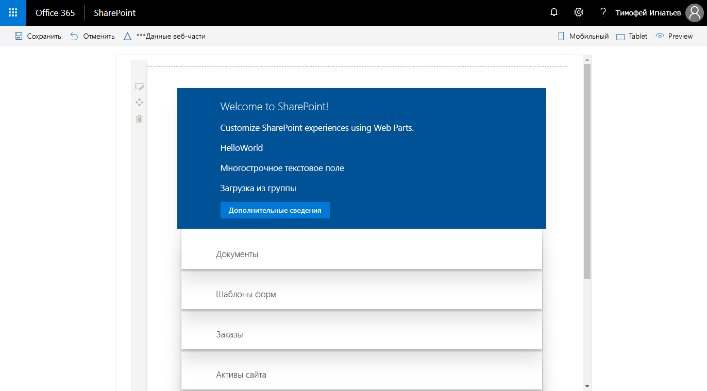

# <a name="connect-your-client-side-web-part-to-sharepoint-hello-world-part-2"></a><span data-ttu-id="46e04-103">Подключение клиентской веб-части к SharePoint (Hello World, часть 2)</span><span class="sxs-lookup"><span data-stu-id="46e04-103">Connect your client-side web part to SharePoint (Hello World part 2)</span></span>

<span data-ttu-id="46e04-104">Подключите веб-часть к SharePoint, чтобы получить доступ к функциям и данным SharePoint и предоставить больше интегрированных возможностей для пользователей.</span><span class="sxs-lookup"><span data-stu-id="46e04-104">Connect your web part to SharePoint to access functionality and data in SharePoint and provide a more integrated experience for end users.</span></span> <span data-ttu-id="46e04-105">В этой статье мы продолжим работу с веб-частью Hello World, создание которой показано в предыдущей статье, [Создание первой веб-части](./build-a-hello-world-web-part.md).</span><span class="sxs-lookup"><span data-stu-id="46e04-105">This article continues building the Hello World web part built in the previous article [Build your first web part](./build-a-hello-world-web-part.md).</span></span>

<span data-ttu-id="46e04-106">Эти действия также показаны в видео на [канале SharePoint PnP в YouTube](https://www.youtube.com/watch?v=hYrP6D4FaaU&list=PLR9nK3mnD-OXvSWvS2zglCzz4iplhVrKq&index=3).</span><span class="sxs-lookup"><span data-stu-id="46e04-106">You can also follow these steps by watching this video on the [SharePoint PnP YouTube Channel](https://www.youtube.com/watch?v=hYrP6D4FaaU&list=PLR9nK3mnD-OXvSWvS2zglCzz4iplhVrKq&index=3).</span></span> 

<a href="https://www.youtube.com/watch?v=hYrP6D4FaaU&list=PLR9nK3mnD-OXvSWvS2zglCzz4iplhVrKq&index=3">

</a>


## <a name="run-gulp-serve"></a><span data-ttu-id="46e04-107">Запуск команды gulp serve</span><span class="sxs-lookup"><span data-stu-id="46e04-107">Run gulp serve</span></span>

<span data-ttu-id="46e04-108">Убедитесь, что команда `gulp serve` запущена.</span><span class="sxs-lookup"><span data-stu-id="46e04-108">Ensure that you have the `gulp serve` command running.</span></span> <span data-ttu-id="46e04-109">В противном случае перейдите в каталог проекта **helloworld-webpart** и запустите ее, используя указанные ниже команды.</span><span class="sxs-lookup"><span data-stu-id="46e04-109">If it is not already running, go to the **helloworld-webpart** project directory and run it by using the following commands.</span></span>

```
cd helloworld-webpart
gulp serve
```

## <a name="get-access-to-page-context"></a><span data-ttu-id="46e04-110">Получение доступа к контексту страницы</span><span class="sxs-lookup"><span data-stu-id="46e04-110">Get access to page context</span></span>

<span data-ttu-id="46e04-111">Когда Workbench размещается на локальном компьютере, вам не доступен контекст страницы SharePoint.</span><span class="sxs-lookup"><span data-stu-id="46e04-111">When the Workbench is hosted locally, you do not have the SharePoint page context.</span></span> <span data-ttu-id="46e04-112">И все же веб-часть можно проверить различными способами.</span><span class="sxs-lookup"><span data-stu-id="46e04-112">You can still test your web part in many different ways.</span></span> <span data-ttu-id="46e04-113">Например, вы можете сосредоточиться на создании удобной веб-части и использовать фиктивные данные для имитации взаимодействия с SharePoint.</span><span class="sxs-lookup"><span data-stu-id="46e04-113">For example, you can concentrate on building the web part's UX and use mock data to simulate SharePoint interaction when you don't have the SharePoint context.</span></span>

<span data-ttu-id="46e04-114">Однако когда Workbench размещается в SharePoint, вы получаете доступ к контексту страницы с различными ключевыми свойствами, такими как:</span><span class="sxs-lookup"><span data-stu-id="46e04-114">However, when the Workbench is hosted in SharePoint, you get access to the page context, which provides various key properties such as:</span></span>

* <span data-ttu-id="46e04-115">название сайта;</span><span class="sxs-lookup"><span data-stu-id="46e04-115">Web title</span></span>
* <span data-ttu-id="46e04-116">абсолютный URL-адрес сайта;</span><span class="sxs-lookup"><span data-stu-id="46e04-116">Web absolute URL</span></span>
* <span data-ttu-id="46e04-117">URL-адрес относительно веб-сервера;</span><span class="sxs-lookup"><span data-stu-id="46e04-117">Web server-relative URL</span></span>
* <span data-ttu-id="46e04-118">имя пользователя для входа.</span><span class="sxs-lookup"><span data-stu-id="46e04-118">User sign-in name</span></span>

### <a name="to-get-access-to-the-page-context"></a><span data-ttu-id="46e04-119">Получение доступа к контексту страницы</span><span class="sxs-lookup"><span data-stu-id="46e04-119">To get access to the page context</span></span>

1. <span data-ttu-id="46e04-120">Используйте следующую переменную в своем классе веб-частей:</span><span class="sxs-lookup"><span data-stu-id="46e04-120">Use the following variable in your web part class:</span></span>

  ```typescript
  this.context.pageContext
  ```

2. <span data-ttu-id="46e04-121">Перейдите в Visual Studio Code (или другую интегрированную среду разработки) и откройте файл **src\webparts\helloWorld\HelloWorldWebPart.ts**.</span><span class="sxs-lookup"><span data-stu-id="46e04-121">Switch to Visual Studio code (or your preferred IDE) and open **src\webparts\helloWorld\HelloWorldWebPart.ts**.</span></span>

3. <span data-ttu-id="46e04-122">Замените блок кода **innerHTML** в методе **render** на следующий код:</span><span class="sxs-lookup"><span data-stu-id="46e04-122">Inside the **render** method, replace the **innerHTML** code block with the following code:</span></span>

  ```HTML
      this.domElement.innerHTML = `
        <div class="${ styles.helloWorld }">
          <div class="${ styles.container }">
            <div class="${ styles.row }">
              <div class="${ styles.column }">
                <span class="${ styles.title }">Welcome to SharePoint!</span>
                <p class="${ styles.subTitle }">Customize SharePoint experiences using Web Parts.</p>
                <p class="${ styles.description }">${escape(this.properties.description)}</p>
                <p class="${ styles.description }">${escape(this.properties.test)}</p>
                <p class="${ styles.description }">Loading from ${escape(this.context.pageContext.web.title)}</p>
                <a href="https://aka.ms/spfx" class="${ styles.button }">
                  <span class="${ styles.label }">Learn more</span>
                </a>
              </div>
            </div>
          </div>
        </div>`;
  ```

4. <span data-ttu-id="46e04-123">Обратите внимание, что для вывода значения переменной в блоке HTML используется `${ }`.</span><span class="sxs-lookup"><span data-stu-id="46e04-123">Notice how `${ }` is used to output the variable's value in the HTML block.</span></span> <span data-ttu-id="46e04-124">Дополнительный HTML `p` используется для отображения `this.context.pageContext.web.title`.</span><span class="sxs-lookup"><span data-stu-id="46e04-124">An extra HTML `p` is used to display `this.context.pageContext.web.title`.</span></span> <span data-ttu-id="46e04-125">Так как эта веб-часть загружается из локальной среды, в заголовке будет указано **Local Workbench**.</span><span class="sxs-lookup"><span data-stu-id="46e04-125">Because this web part loads from the local environment, the title is **Local Workbench**.</span></span>

5. <span data-ttu-id="46e04-126">Сохраните файл.</span><span class="sxs-lookup"><span data-stu-id="46e04-126">Save the file.</span></span> <span data-ttu-id="46e04-127">Команда `gulp serve`, запущенная в консоли, определит эту операцию и сделает следующее:</span><span class="sxs-lookup"><span data-stu-id="46e04-127">The `gulp serve` running in your console detects this save operation and:</span></span>

  - <span data-ttu-id="46e04-128">выполнит сборку обновленного кода и объединит его в пакет автоматически;</span><span class="sxs-lookup"><span data-stu-id="46e04-128">Builds and bundles the updated code automatically.</span></span>
  - <span data-ttu-id="46e04-129">обновит страницу локальной версии Workbench (так как код веб-части необходимо перезагрузить).</span><span class="sxs-lookup"><span data-stu-id="46e04-129">Refreshes your local Workbench page (as the web part code needs to be reloaded).</span></span>

  > [!NOTE]
  > <span data-ttu-id="46e04-130">Поместите окно консоли рядом с окном Visual Studio Code, чтобы видеть, как gulp автоматически выполняет компиляцию при сохранении изменений в Visual Studio Code.</span><span class="sxs-lookup"><span data-stu-id="46e04-130">Keep the console window and Visual Studio Code side-by-side to see gulp automatically compile as you save changes in Visual Studio Code.</span></span>

6. <span data-ttu-id="46e04-131">В браузере откройте вкладку локальной версии **SharePoint Workbench**. URL-адрес этой вкладки: `https://localhost:4321/temp/workbench.html` (на случай, если вы ее закрыли).</span><span class="sxs-lookup"><span data-stu-id="46e04-131">In your browser, switch to the local **SharePoint Workbench** tab. If you have already closed the tab, the URL is `https://localhost:4321/temp/workbench.html`.</span></span>

  <span data-ttu-id="46e04-132">Веб-часть должна выглядеть следующим образом:</span><span class="sxs-lookup"><span data-stu-id="46e04-132">You should see the following in the web part:</span></span>

  

7. <span data-ttu-id="46e04-134">Перейдите к версии SharePoint Workbench, размещенной в SharePoint.</span><span class="sxs-lookup"><span data-stu-id="46e04-134">Navigate to the SharePoint Workbench hosted in SharePoint.</span></span> <span data-ttu-id="46e04-135">Полный URL-адрес: `https://your-sharepoint-site-url/_layouts/workbench.aspx`.</span><span class="sxs-lookup"><span data-stu-id="46e04-135">The full URL is `https://your-sharepoint-site-url/_layouts/workbench.aspx`.</span></span> <span data-ttu-id="46e04-136">Обратите внимание на то, что на стороне SharePoint Online необходимо обновить страницу, чтобы увидеть внесенные изменения.</span><span class="sxs-lookup"><span data-stu-id="46e04-136">Notice that on the SharePoint Online side, you need to refresh the page to see the changes.</span></span>

  > [!NOTE]
  > <span data-ttu-id="46e04-137">Если у вас не установлен сертификат разработчика SPFx, Workbench сообщит вам, что он не загружает скрипты из localhost.</span><span class="sxs-lookup"><span data-stu-id="46e04-137">If you do not have the SPFx developer certificate installed, Workbench notifies you that it is configured not to load scripts from localhost.</span></span> <span data-ttu-id="46e04-138">Выполните команду `gulp trust-dev-cert` в консоли каталога проекта, чтобы установить сертификат разработчика.</span><span class="sxs-lookup"><span data-stu-id="46e04-138">Execute `gulp trust-dev-cert` command in your project directory console to install the developer certificate.</span></span>

  <span data-ttu-id="46e04-139">Теперь, когда веб-части доступен контекст страницы, в ней появится название сайта SharePoint.</span><span class="sxs-lookup"><span data-stu-id="46e04-139">You should now see your SharePoint site title in the web part now that page context is available to the web part.</span></span>

  

## <a name="define-list-model"></a><span data-ttu-id="46e04-141">Определение модели списка</span><span class="sxs-lookup"><span data-stu-id="46e04-141">Define list model</span></span>

<span data-ttu-id="46e04-p108">Чтобы начать работу с данными списка SharePoint, нужна модель списка. Для получения списков нужны две модели.</span><span class="sxs-lookup"><span data-stu-id="46e04-p108">You need a list model to start working with SharePoint list data. To retrieve the lists, you need two models.</span></span> 

1. <span data-ttu-id="46e04-144">Откройте Visual Studio Code и перейдите к файлу **src\webparts\helloWorld\HelloWorldWebPart.ts**.</span><span class="sxs-lookup"><span data-stu-id="46e04-144">Switch to Visual Studio Code and go to **src\webparts\helloWorld\HelloWorldWebPart.ts**.</span></span>

2. <span data-ttu-id="46e04-145">Определите следующие модели `interface` над классом **HelloWorldWebPart**:</span><span class="sxs-lookup"><span data-stu-id="46e04-145">Define the following `interface` models just above the **HelloWorldWebPart** class:</span></span>

  ```typescript
  export interface ISPLists {
    value: ISPList[];
  }

  export interface ISPList {
    Title: string;
    Id: string;
  }
  ```

  <span data-ttu-id="46e04-146">Интерфейс **ISPList** содержит данные списков SharePoint, к которым мы подключаемся.</span><span class="sxs-lookup"><span data-stu-id="46e04-146">The **ISPList** interface holds the SharePoint list information that we are connecting to.</span></span> 

## <a name="retrieve-lists-from-mock-store"></a><span data-ttu-id="46e04-147">Получение списков из фиктивного магазина</span><span class="sxs-lookup"><span data-stu-id="46e04-147">Retrieve lists from mock store</span></span>

<span data-ttu-id="46e04-148">Для проверки веб-части в локальной версии Workbench нужен фиктивный магазин, который возвращает фиктивные данные.</span><span class="sxs-lookup"><span data-stu-id="46e04-148">To test in the local Workbench, you need a mock store that returns mock data.</span></span>

### <a name="to-create-a-mock-store"></a><span data-ttu-id="46e04-149">Создание фиктивного магазина</span><span class="sxs-lookup"><span data-stu-id="46e04-149">To create a mock store</span></span>

1. <span data-ttu-id="46e04-150">Создайте файл **MockHttpClient.ts** в папке **src\webparts\helloWorld**.</span><span class="sxs-lookup"><span data-stu-id="46e04-150">Create a new file inside the **src\webparts\helloWorld** folder named **MockHttpClient.ts**.</span></span>

2. <span data-ttu-id="46e04-151">Скопируйте следующий код в файл **MockHttpClient.ts**:</span><span class="sxs-lookup"><span data-stu-id="46e04-151">Copy the following code into **MockHttpClient.ts**:</span></span>

  ```typescript
  import { ISPList } from './HelloWorldWebPart';

  export default class MockHttpClient  {

      private static _items: ISPList[] = [{ Title: 'Mock List', Id: '1' },
                                          { Title: 'Mock List 2', Id: '2' },
                                          { Title: 'Mock List 3', Id: '3' }];
      
      public static get(): Promise<ISPList[]> {
      return new Promise<ISPList[]>((resolve) => {
              resolve(MockHttpClient._items);
          });
      }
  }
  ```

  <span data-ttu-id="46e04-152">Вот что нужно знать о коде:</span><span class="sxs-lookup"><span data-stu-id="46e04-152">Things to note about the code:</span></span>

  - <span data-ttu-id="46e04-153">Так как в файле **HelloWorldWebPart.ts** несколько операций экспорта, операция импорта указана с помощью скобок `{ }`.</span><span class="sxs-lookup"><span data-stu-id="46e04-153">Because there are multiple exports in **HelloWorldWebPart.ts**, the specific one to import is specified by using `{ }`.</span></span> <span data-ttu-id="46e04-154">В этом случае требуется только модель данных `ISPList`.</span><span class="sxs-lookup"><span data-stu-id="46e04-154">In this case, only the data model `ISPList` is required.</span></span>
  - <span data-ttu-id="46e04-155">При импорте из модуля по умолчанию (в данном случае — **HelloWorldWebPart**) не нужно вводить расширение файла.</span><span class="sxs-lookup"><span data-stu-id="46e04-155">You do not need to type the file extension when importing from the default module, which in this case is **HelloWorldWebPart**.</span></span> 
  - <span data-ttu-id="46e04-156">Класс **MockHttpClient** экспортируется как модуль по умолчанию, чтобы его можно было импортировать в другие файлы.</span><span class="sxs-lookup"><span data-stu-id="46e04-156">It exports the **MockHttpClient** class as a default module so that it can be imported in other files.</span></span>
  - <span data-ttu-id="46e04-157">Он создает исходный фиктивный массив `ISPList` и выходные данные.</span><span class="sxs-lookup"><span data-stu-id="46e04-157">It builds the initial `ISPList` mock array and returns.</span></span>

3. <span data-ttu-id="46e04-158">Сохраните файл.</span><span class="sxs-lookup"><span data-stu-id="46e04-158">Save the file.</span></span>

<span data-ttu-id="46e04-159">Теперь вы можете использовать класс **MockHttpClient** в классе **HelloWorldWebPart**.</span><span class="sxs-lookup"><span data-stu-id="46e04-159">You can now use the **MockHttpClient** class in the **HelloWorldWebPart** class.</span></span> <span data-ttu-id="46e04-160">Сначала нужно импортировать модуль **MockHttpClient**.</span><span class="sxs-lookup"><span data-stu-id="46e04-160">You first need to import the **MockHttpClient** module.</span></span>

### <a name="to-import-the-mockhttpclient-module"></a><span data-ttu-id="46e04-161">Импорт модуля **MockHttpClient**</span><span class="sxs-lookup"><span data-stu-id="46e04-161">To import the **MockHttpClient** module</span></span>

1. <span data-ttu-id="46e04-162">Откройте файл **HelloWorldWebPart.ts**.</span><span class="sxs-lookup"><span data-stu-id="46e04-162">Open the **HelloWorldWebPart.ts** file.</span></span>

2. <span data-ttu-id="46e04-163">Скопируйте приведенный ниже код и вставьте его под оператором `import * as strings from 'HelloWorldWebPartStrings';`.</span><span class="sxs-lookup"><span data-stu-id="46e04-163">Copy and paste the following code just under `import * as strings from 'HelloWorldWebPartStrings';`.</span></span>

  ```typescript
  import MockHttpClient from './MockHttpClient';
  ```
 
3. <span data-ttu-id="46e04-164">Добавьте приведенный ниже частный метод, имитирующий извлечение списков, в класс **HelloWorldWebPart**.</span><span class="sxs-lookup"><span data-stu-id="46e04-164">Add the following private method that mocks the list retrieval inside the **HelloWorldWebPart** class.</span></span>

  ```typescript
    private _getMockListData(): Promise<ISPLists> {
      return MockHttpClient.get()
        .then((data: ISPList[]) => {
          var listData: ISPLists = { value: data };
          return listData;
        }) as Promise<ISPLists>;
    }
  ```

4. <span data-ttu-id="46e04-165">Сохраните файл.</span><span class="sxs-lookup"><span data-stu-id="46e04-165">Save the file.</span></span>

## <a name="retrieve-lists-from-sharepoint-site"></a><span data-ttu-id="46e04-166">Получение списков с сайта SharePoint</span><span class="sxs-lookup"><span data-stu-id="46e04-166">Retrieve lists from SharePoint site</span></span>

<span data-ttu-id="46e04-167">Далее нужно получить списки с текущего сайта.</span><span class="sxs-lookup"><span data-stu-id="46e04-167">Next you need to retrieve lists from the current site.</span></span> <span data-ttu-id="46e04-168">Чтобы получить списки с сайта `https://yourtenantprefix.sharepoint.com/_api/web/lists`, нужно использовать REST API SharePoint.</span><span class="sxs-lookup"><span data-stu-id="46e04-168">You will use SharePoint REST APIs to retrieve the lists from the site, which are located at `https://yourtenantprefix.sharepoint.com/_api/web/lists`.</span></span>

<span data-ttu-id="46e04-169">Платформа SharePoint Framework включает вспомогательный класс **spHttpClient** для выполнения запросов REST API к SharePoint.</span><span class="sxs-lookup"><span data-stu-id="46e04-169">SharePoint Framework includes a helper class **spHttpClient** to execute REST API requests against SharePoint.</span></span> <span data-ttu-id="46e04-170">Он добавляет заголовки, управляет дайджестом, необходимым для записи, и собирает данные телеметрии, которые помогают службе отслеживать производительность приложения.</span><span class="sxs-lookup"><span data-stu-id="46e04-170">It adds default headers, manages the digest needed for writes, and collects telemetry that helps the service to monitor the performance of an application.</span></span>

### <a name="to-use-this-helper-class-import-them-from-the-microsoftsp-http-module"></a><span data-ttu-id="46e04-171">Чтобы использовать этот вспомогательный класс, импортируйте его из модуля @microsoft/sp-http</span><span class="sxs-lookup"><span data-stu-id="46e04-171">To use this helper class, import them from the @microsoft/sp-http module</span></span>

1. <span data-ttu-id="46e04-172">Прокрутите к началу файла **HelloWorldWebPart.ts**.</span><span class="sxs-lookup"><span data-stu-id="46e04-172">Scroll to the top of the **HelloWorldWebPart.ts** file.</span></span> 

2. <span data-ttu-id="46e04-173">Скопируйте приведенный ниже код и вставьте его под оператором `import MockHttpClient from './MockHttpClient';`.</span><span class="sxs-lookup"><span data-stu-id="46e04-173">Copy and paste the following code just under `import MockHttpClient from './MockHttpClient';`:</span></span>

  ```typescript
  import {
    SPHttpClient,
    SPHttpClientResponse   
  } from '@microsoft/sp-http';
  ```

3. <span data-ttu-id="46e04-174">Добавьте приведенный ниже частный метод для получения списков из SharePoint в класс **HelloWorldWebPart**.</span><span class="sxs-lookup"><span data-stu-id="46e04-174">Add the following private method to retrieve lists from SharePoint inside the **HelloWorldWebPart** class.</span></span>

  ```typescript
  private _getListData(): Promise<ISPLists> {
    return this.context.spHttpClient.get(this.context.pageContext.web.absoluteUrl + `/_api/web/lists?$filter=Hidden eq false`, SPHttpClient.configurations.v1)
      .then((response: SPHttpClientResponse) => {
        return response.json();
      });
  }
  ```

  <span data-ttu-id="46e04-175">Этот метод использует вспомогательный класс **spHttpClient** и отправляет запрос `get`.</span><span class="sxs-lookup"><span data-stu-id="46e04-175">The method uses the **spHttpClient** helper class and issues a `get` request.</span></span> <span data-ttu-id="46e04-176">Он использует модель **ISPLists**, а также применяет фильтр, чтобы не получать скрытые списки.</span><span class="sxs-lookup"><span data-stu-id="46e04-176">It uses the **ISPLists** model and also applies a filter to not retrieve hidden lists.</span></span>

4. <span data-ttu-id="46e04-177">Сохраните файл.</span><span class="sxs-lookup"><span data-stu-id="46e04-177">Save the file.</span></span> 

5. <span data-ttu-id="46e04-178">Перейдите в окно консоли, в котором запущена команда `gulp serve`, и проверьте наличие ошибок.</span><span class="sxs-lookup"><span data-stu-id="46e04-178">Switch to the console window that is running `gulp serve` and check if there are any errors.</span></span> <span data-ttu-id="46e04-179">Если gulp сообщит об ошибках, их нужно исправить.</span><span class="sxs-lookup"><span data-stu-id="46e04-179">If there are errors, gulp reports them in the console, and you need to fix them before proceeding.</span></span>

## <a name="add-new-styles"></a><span data-ttu-id="46e04-180">Добавление новых стилей</span><span class="sxs-lookup"><span data-stu-id="46e04-180">Add new styles</span></span>

<span data-ttu-id="46e04-181">Платформа SharePoint Framework использует [Sass](http://sass-lang.com/) в качестве препроцессора CSS и [синтаксис SCSS](http://sass-lang.com/documentation/file.SCSS_FOR_SASS_USERS.html), который полностью совместим со стандартным синтаксисом CSS.</span><span class="sxs-lookup"><span data-stu-id="46e04-181">The SharePoint Framework uses [Sass](http://sass-lang.com/) as the CSS pre-processor, and specifically uses the [SCSS syntax](http://sass-lang.com/documentation/file.SCSS_FOR_SASS_USERS.html), which is fully compliant with normal CSS syntax.</span></span> <span data-ttu-id="46e04-182">Sass расширяет язык CSS и позволяет использовать такие возможности, как переменные, вложенные правила и встроенные операции импорта, для упорядочения и создания эффективных таблиц стилей для веб-частей.</span><span class="sxs-lookup"><span data-stu-id="46e04-182">Sass extends the CSS language and allows you to use features such as variables, nested rules, and inline imports to organize and create efficient style sheets for your web parts.</span></span> <span data-ttu-id="46e04-183">Платформа SharePoint Framework предусматривает наличие компилятора SCSS, который преобразует файлы Sass в обычные CSS-файлы, а также типизированной версии для использования во время разработки.</span><span class="sxs-lookup"><span data-stu-id="46e04-183">The SharePoint Framework already comes with a SCSS compiler that converts your Sass files to normal CSS files, and also provides a typed version to use during development.</span></span>

### <a name="to-add-new-styles"></a><span data-ttu-id="46e04-184">Добавление новых стилей</span><span class="sxs-lookup"><span data-stu-id="46e04-184">To add new styles</span></span>

1. <span data-ttu-id="46e04-185">Откройте **HelloWorld.module.scss**.</span><span class="sxs-lookup"><span data-stu-id="46e04-185">Open **HelloWorld.module.scss**.</span></span> <span data-ttu-id="46e04-186">В этом SCSS-файле можно задавать стили.</span><span class="sxs-lookup"><span data-stu-id="46e04-186">This is the SCSS file where you define your styles.</span></span>

  <span data-ttu-id="46e04-187">По умолчанию стили действуют на уровне веб-части.</span><span class="sxs-lookup"><span data-stu-id="46e04-187">By default, the styles are scoped to your web part.</span></span> <span data-ttu-id="46e04-188">Это видно, так как стили задаются в разделе **.helloWorld**.</span><span class="sxs-lookup"><span data-stu-id="46e04-188">You can see that as the styles are defined under **.helloWorld**.</span></span>

2. <span data-ttu-id="46e04-189">Добавьте следующие стили после стиля `.button` в главном разделе стилей `.helloWorld`:</span><span class="sxs-lookup"><span data-stu-id="46e04-189">Add the following styles after the `.button` style, but still inside the main `.helloWorld` style section:</span></span>

  ```css
  .list {
    color: #333333;
    font-family: 'Segoe UI Regular WestEuropean', 'Segoe UI', Tahoma, Arial, sans-serif;
    font-size: 14px;
    font-weight: normal;
    box-sizing: border-box;
    margin: 10;
    padding: 10;
    line-height: 50px;
    list-style-type: none;
    box-shadow: 0 4px 4px 0 rgba(0, 0, 0, 0.2), 0 25px 50px 0 rgba(0, 0, 0, 0.1);
  }

  .listItem {
    color: #333333;
    vertical-align: center;
    font-family: 'Segoe UI Regular WestEuropean', 'Segoe UI', Tahoma, Arial, sans-serif;
    font-size: 14px;
    font-weight: normal;
    box-sizing: border-box;
    margin: 0;
    padding: 0;
    box-shadow: none;
    *zoom: 1;
    padding: 9px 28px 3px;
    position: relative;
  }
  ``` 

3. <span data-ttu-id="46e04-190">Сохраните файл.</span><span class="sxs-lookup"><span data-stu-id="46e04-190">Save the file.</span></span>

  <span data-ttu-id="46e04-191">Средство gulp перестраивает код в консоли, как только вы сохраняете файл.</span><span class="sxs-lookup"><span data-stu-id="46e04-191">Gulp rebuilds the code in the console as soon as you save the file.</span></span> <span data-ttu-id="46e04-192">При этом создаются соответствующие определения типов в файле **HelloWorld.module.scss.ts**.</span><span class="sxs-lookup"><span data-stu-id="46e04-192">This generates the corresponding typings in the **HelloWorld.module.scss.ts** file.</span></span> <span data-ttu-id="46e04-193">После компиляции для TypeScript вы можете импортировать эти стили и ссылаться на них в коде веб-части.</span><span class="sxs-lookup"><span data-stu-id="46e04-193">After compiled to TypeScript, you can then import and reference these styles in your web part code.</span></span>

  <span data-ttu-id="46e04-194">Это видно в методе **render** веб-части:</span><span class="sxs-lookup"><span data-stu-id="46e04-194">You can see that in the **render** method of the web part:</span></span>

  ```html
  <div class="${styles.row}">
  ```

## <a name="render-lists-information"></a><span data-ttu-id="46e04-195">Отрисовка данных списков</span><span class="sxs-lookup"><span data-stu-id="46e04-195">Render lists information</span></span>

<span data-ttu-id="46e04-196">Перейдите к классу **HelloWorldWebPart**.</span><span class="sxs-lookup"><span data-stu-id="46e04-196">Open the **HelloWorldWebPart** class.</span></span>

<span data-ttu-id="46e04-197">SharePoint Workbench можно использовать для проверки веб-частей в локальной среде и на сайте SharePoint.</span><span class="sxs-lookup"><span data-stu-id="46e04-197">SharePoint Workbench gives you the flexibility to test web parts in your local environment and from a SharePoint site.</span></span> <span data-ttu-id="46e04-198">Платформа SharePoint Framework показывает, в какой среде запущена веб-часть, с помощью модуля **EnvironmentType**.</span><span class="sxs-lookup"><span data-stu-id="46e04-198">SharePoint Framework aids this capability by helping you understand which environment your web part is running from by using the **EnvironmentType** module.</span></span> 

### <a name="to-use-the-environmenttype-module"></a><span data-ttu-id="46e04-199">Использование модуля EnvironmentType</span><span class="sxs-lookup"><span data-stu-id="46e04-199">To use the EnvironmentType module</span></span>

1. <span data-ttu-id="46e04-200">Импортируйте модули **Environment** и **EnvironmentType** из пакета **@microsoft/sp-core-library**.</span><span class="sxs-lookup"><span data-stu-id="46e04-200">Import the **Environment** and the **EnvironmentType** modules from the **@microsoft/sp-core-library** bundle.</span></span> <span data-ttu-id="46e04-201">Добавьте в раздел **import** вверху, как показано в следующем фрагменте кода:</span><span class="sxs-lookup"><span data-stu-id="46e04-201">Add it to the **import** section at the top as shown in the following code:</span></span>

  ```typescript
  import {
    Environment,
    EnvironmentType
  } from '@microsoft/sp-core-library';
  ```

2. <span data-ttu-id="46e04-202">Добавьте следующий частный метод в класс **HelloWorldWebPart** для вызова соответствующих методов и получения данных списков:</span><span class="sxs-lookup"><span data-stu-id="46e04-202">Add the following private method inside the **HelloWorldWebPart** class to call the respective methods to retrieve list data:</span></span>

  ```typescript
    private _renderListAsync(): void {
      // Local environment
      if (Environment.type === EnvironmentType.Local) {
        this._getMockListData().then((response) => {
          this._renderList(response.value);
        });
      }
      else if (Environment.type == EnvironmentType.SharePoint || 
                Environment.type == EnvironmentType.ClassicSharePoint) {
        this._getListData()
          .then((response) => {
            this._renderList(response.value);
          });
      }
    }
  ```

  <span data-ttu-id="46e04-203">Вот что нужно знать о hostType в методе **_renderListAsync**:</span><span class="sxs-lookup"><span data-stu-id="46e04-203">Things to note about hostType in the **_renderListAsync** method:</span></span>

  - <span data-ttu-id="46e04-204">Свойство `Environment.type` поможет вам проверить, в какой среде вы находитесь (локальной или SharePoint).</span><span class="sxs-lookup"><span data-stu-id="46e04-204">The `Environment.type` property helps you check if you are in a local or SharePoint environment.</span></span>
  - <span data-ttu-id="46e04-205">В зависимости от того, где размещается Workbench, вызывается нужный метод.</span><span class="sxs-lookup"><span data-stu-id="46e04-205">The correct method is called depending on where your Workbench is hosted.</span></span>

3. <span data-ttu-id="46e04-206">Сохраните файл.</span><span class="sxs-lookup"><span data-stu-id="46e04-206">Save the file.</span></span>

  <span data-ttu-id="46e04-207">Теперь данные списков нужно отрисовать при помощи значения, полученного из REST API.</span><span class="sxs-lookup"><span data-stu-id="46e04-207">Now you need to render the list data with the value fetched from the REST API.</span></span>

4. <span data-ttu-id="46e04-208">Добавьте следующий метод private в класс **HelloWorldWebPart**:</span><span class="sxs-lookup"><span data-stu-id="46e04-208">Add the following private method inside the **HelloWorldWebPart** class:</span></span>

  ```typescript
    private _renderList(items: ISPList[]): void {
      let html: string = '';
      items.forEach((item: ISPList) => {
        html += `
      <ul class="${styles.list}">
        <li class="${styles.listItem}">
          <span class="ms-font-l">${item.Title}</span>
        </li>
      </ul>`;
      });

      const listContainer: Element = this.domElement.querySelector('#spListContainer');
      listContainer.innerHTML = html;
    }
  ```

  <span data-ttu-id="46e04-209">Предыдущий метод ссылается на новые стили CSS, добавленные с помощью переменной **styles**.</span><span class="sxs-lookup"><span data-stu-id="46e04-209">The previous method references the new CSS styles added earlier by using the **styles** variable.</span></span> 

5. <span data-ttu-id="46e04-210">Сохраните файл.</span><span class="sxs-lookup"><span data-stu-id="46e04-210">Save the file.</span></span>


## <a name="retrieve-list-data"></a><span data-ttu-id="46e04-211">Получение данных списков</span><span class="sxs-lookup"><span data-stu-id="46e04-211">Retrieve list data</span></span>

1. <span data-ttu-id="46e04-212">Замените код в методе **render** следующим кодом:</span><span class="sxs-lookup"><span data-stu-id="46e04-212">Navigate to the **render** method, and replace the code inside the method with the following code:</span></span>

  ```typescript
      this.domElement.innerHTML = `
        <div class="${ styles.helloWorld }">
          <div class="${ styles.container }">
            <div class="${ styles.row }">
              <div class="${ styles.column }">
                <span class="${ styles.title }">Welcome to SharePoint!</span>
                <p class="${ styles.subTitle }">Customize SharePoint experiences using Web Parts.</p>
                <p class="${ styles.description }">${escape(this.properties.description)}</p>
                <p class="${ styles.description }">${escape(this.properties.test)}</p>
                <p class="${ styles.description }">Loading from ${escape(this.context.pageContext.web.title)}</p>
                <a href="https://aka.ms/spfx" class="${ styles.button }">
                  <span class="${ styles.label }">Learn more</span>
                </a>
              </div>
            </div>
            <div id="spListContainer" />
          </div>
        </div>`;

        this._renderListAsync();
  ```

2. <span data-ttu-id="46e04-213">Сохраните файл.</span><span class="sxs-lookup"><span data-stu-id="46e04-213">Save the file.</span></span>

  <span data-ttu-id="46e04-214">В окне консоли вы заметите, что `gulp serve` перестраивает код.</span><span class="sxs-lookup"><span data-stu-id="46e04-214">Notice in the `gulp serve` console window that it rebuilds the code.</span></span> <span data-ttu-id="46e04-215">Убедитесь, что нет ошибок.</span><span class="sxs-lookup"><span data-stu-id="46e04-215">Make sure you don't see any errors.</span></span>

3. <span data-ttu-id="46e04-216">Перейдите в локальную версию Workbench и добавьте веб-часть HelloWorld.</span><span class="sxs-lookup"><span data-stu-id="46e04-216">Switch to your local Workbench and add the HelloWorld web part.</span></span>

  <span data-ttu-id="46e04-217">Должны появиться фиктивные данные.</span><span class="sxs-lookup"><span data-stu-id="46e04-217">You should see the mock data returned.</span></span>

  

4. <span data-ttu-id="46e04-219">Перейдите в версию Workbench, размещенную в SharePoint.</span><span class="sxs-lookup"><span data-stu-id="46e04-219">Switch to the Workbench hosted in SharePoint.</span></span> <span data-ttu-id="46e04-220">Обновите страницу и добавьте веб-часть HelloWorld.</span><span class="sxs-lookup"><span data-stu-id="46e04-220">Refresh the page and add the HelloWorld web part.</span></span>

  <span data-ttu-id="46e04-221">Должны появиться списки с текущего сайта.</span><span class="sxs-lookup"><span data-stu-id="46e04-221">You should see lists returned from the current site.</span></span>

  

5. <span data-ttu-id="46e04-223">Теперь вы можете остановить работу сервера.</span><span class="sxs-lookup"><span data-stu-id="46e04-223">Now you can stop the server from running.</span></span> <span data-ttu-id="46e04-224">Перейдите в консоль и остановите команду `gulp serve`.</span><span class="sxs-lookup"><span data-stu-id="46e04-224">Switch to the console and stop `gulp serve`.</span></span> <span data-ttu-id="46e04-225">Нажмите клавиши Ctrl+C, чтобы завершить задачу gulp.</span><span class="sxs-lookup"><span data-stu-id="46e04-225">Select Ctrl+C to terminate the gulp task.</span></span>

## <a name="next-steps"></a><span data-ttu-id="46e04-226">Дальнейшие действия</span><span class="sxs-lookup"><span data-stu-id="46e04-226">Next steps</span></span>

<span data-ttu-id="46e04-227">Поздравляем: вы подключили веб-часть к данным списков SharePoint!</span><span class="sxs-lookup"><span data-stu-id="46e04-227">Congratulations on connecting your web part to SharePoint list data!</span></span> 

<span data-ttu-id="46e04-228">Из следующей статьи, которая называется [Развертывание веб-части на странице SharePoint](./serve-your-web-part-in-a-sharepoint-page.md),</span><span class="sxs-lookup"><span data-stu-id="46e04-228">You can continue building out your Hello World web part in the next topic [Deploy your web part to a SharePoint page](./serve-your-web-part-in-a-sharepoint-page.md).</span></span> <span data-ttu-id="46e04-229">вы узнаете, как развернуть и просмотреть веб-часть Hello World на странице SharePoint.</span><span class="sxs-lookup"><span data-stu-id="46e04-229">You will learn how to deploy and preview the Hello World web part in a SharePoint page.</span></span>

> [!NOTE]
> <span data-ttu-id="46e04-230">Если вы обнаружили ошибку в документации или SharePoint Framework, сообщите о ней разработчикам SharePoint, указав в [списке проблем для репозитория sp-dev-docs](https://github.com/SharePoint/sp-dev-docs/issues).</span><span class="sxs-lookup"><span data-stu-id="46e04-230">If you find an issue in the documentation or in the SharePoint Framework, report that to SharePoint engineering by using the [issue list at the sp-dev-docs repository](https://github.com/SharePoint/sp-dev-docs/issues).</span></span> <span data-ttu-id="46e04-231">Заранее спасибо!</span><span class="sxs-lookup"><span data-stu-id="46e04-231">Thanks for your input in advance.</span></span>