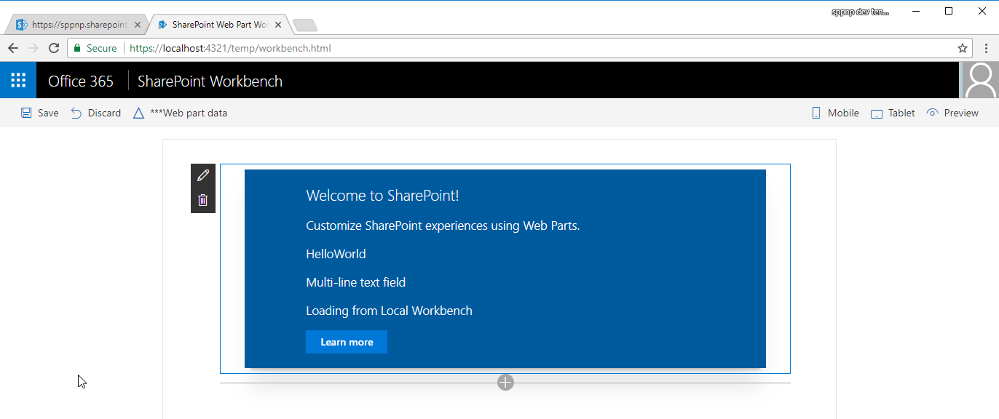

# <a name="connect-your-client-side-web-part-to-sharepoint-hello-world-part-2"></a>Подключение клиентской веб-части к SharePoint (Hello world, часть 2)

Подключите веб-часть к SharePoint для доступа к функциям и данным SharePoint, а также более интегрированного процесса работы для конечных пользователей. В этой статье мы продолжим работу с веб-частью Hello world, созданной в предыдущей статье [Создание первой веб-части](./build-a-hello-world-web-part.md).

Указанные ниже действия также показаны в видео на [канале SharePoint PnP в YouTube](https://www.youtube.com/watch?v=9VMwjb2pbQ8&list=PLR9nK3mnD-OXvSWvS2zglCzz4iplhVrKq). 

<a href="https://www.youtube.com/watch?v=9VMwjb2pbQ8&list=PLR9nK3mnD-OXvSWvS2zglCzz4iplhVrKq">

</a>


## <a name="run-gulp-serve"></a>Запуск команды gulp serve

Убедитесь, что команда `gulp serve` запущена. В противном случае перейдите в каталог проекта **helloworld-webpart** и запустите ее с помощью указанных ниже команд.

```
cd helloworld-webpart
gulp serve
```

## <a name="get-access-to-page-context"></a>Доступ к контексту страницы

Когда рабочая область размещается на локальном компьютере, вам не доступен контекст страницы SharePoint. И все же веб-часть можно проверить различными способами. Например, вы можете сосредоточиться на пользовательском интерфейсе веб-части и использовать фиктивные данные для имитации взаимодействия с SharePoint.

Но когда рабочая область размещается в SharePoint, вы получаете доступ к контексту страницы с различными ключевыми свойствами, такими как:

* название сайта;
* абсолютный URL-адрес сайта;
* относительный URL-адрес веб-сервера;
* имя пользователя для входа.

Доступ к контексту страницы можно получить с помощью следующей переменной в классе веб-части:

```ts
this.context.pageContext
```

Перейдите в Visual Studio Code (или другую интегрированную среду разработки) и откройте файл **src\webparts\helloWorld\HelloWorldWebPart.ts**.

Замените блок кода **innerHTML** в методе **render** на следующий код:

```ts
    this.domElement.innerHTML = `
      <div class="${ styles.helloWorld }">
        <div class="${ styles.container }">
          <div class="${ styles.row }">
            <div class="${ styles.column }">
              <span class="${ styles.title }">Welcome to SharePoint!</span>
              <p class="${ styles.subTitle }">Customize SharePoint experiences using Web Parts.</p>
              <p class="${ styles.description }">${escape(this.properties.description)}</p>
              <p class="${ styles.description }">${escape(this.properties.test)}</p>
              <p class="${ styles.description }">Loading from ${escape(this.context.pageContext.web.title)}</p>
              <a href="https://aka.ms/spfx" class="${ styles.button }">
                <span class="${ styles.label }">Learn more</span>
              </a>
            </div>
          </div>
        </div>
      </div>`;
```

Обратите внимание, что для вывода значения переменной в блоке HTML используется `${ }`. Дополнительный HTML `p` используется для отображения `this.context.pageContext.web.title`. Так как эта веб-часть загружается из локальной среды, в заголовке будет указано **Локальная рабочая область**.

Сохраните файл. Команда `gulp serve`, запущенная в консоли, определит эту операцию и:

* выполнит сборку обновленного кода и объединит его в пакет автоматически;
* Обновите страницу локальной рабочей области (так как код веб-части необходимо перезагрузить).

> [!NOTE]
> Поместите окно консоли рядом с окном VS Code, чтобы видеть, как gulp автоматически выполняет компиляцию при сохранении изменений в VS Code.

В браузере откройте вкладку локальной рабочей области SharePoint Workbench. URL-адрес этой вкладки: `https://localhost:4321/temp/workbench.html` (на случай, если вы ее закрыли).

Веб-часть должна выглядеть следующим образом:



Теперь перейдите к рабочей области SharePoint Workbench, размещенной в SharePoint. Полный URL-адрес: `https://your-sharepoint-site-url/_layouts/workbench.aspx`. Обратите внимание, что на стороне SharePoint Online необходимо обновить страницу, чтобы увидеть внесенные изменения.

> [!NOTE]
> Если у вас не установлен сертификат разработчика SPFx, рабочая область сообщит вам, что она не загружает сценарии из localhost. Выполните команду `gulp trust-dev-cert` в консоли каталога проекта, чтобы установить сертификат разработчика.

Теперь, когда веб-части доступен контекст страницы, в ней появится название сайта SharePoint.


## <a name="define-list-model"></a>Определение модели списка
Чтобы начать работу с данными списка SharePoint, нужна модель списка. Для получения списков нужны две модели. 

Откройте Visual Studio Code и перейдите к файлу **src\webparts\helloWorld\HelloWorldWebPart.ts**.

Определите следующие модели `interface` над классом **HelloWorldWebPart**:

```ts
export interface ISPLists {
    value: ISPList[];
}

export interface ISPList {
    Title: string;
    Id: string;
}
```

Интерфейс **ISPList** содержит данные списков SharePoint, к которым мы подключаемся. 

## <a name="retrieve-lists-from-mock-store"></a>Получение списков из фиктивного магазина

Для проверки веб-части в локальной рабочей области нужен фиктивный магазин, который возвращает фиктивные данные.

Создайте файл **MockHttpClient.ts** в папке **src\webparts\helloWorld**.

Скопируйте следующий код в файл **MockHttpClient.ts**:

```ts
import { ISPList } from './HelloWorldWebPart';

export default class MockHttpClient  {

    private static _items: ISPList[] = [{ Title: 'Mock List', Id: '1' },
                                        { Title: 'Mock List 2', Id: '2' },
                                        { Title: 'Mock List 3', Id: '3' }];
    
    public static get(): Promise<ISPList[]> {
    return new Promise<ISPList[]>((resolve) => {
            resolve(MockHttpClient._items);
        });
    }
}
```

Вот что нужно знать о коде:

* Так как в файле **HelloWorldWebPart.ts** несколько операций экспорта, операция импорта указана с помощью скобок `{ }`. В этом случае требуется только модель данных `ISPList`.
* При импорте из модуля по умолчанию (в данном случае — **HelloWorldWebPart**) не нужно вводить расширение файла. 
* Он экспортирует класс **MockHttpClient** как модуль по умолчанию, чтобы его можно было импортировать в другие файлы.
* Он создает исходный фиктивный массив `ISPList` и выходные данные.

Сохраните файл.

Теперь вы можете использовать класс **MockHttpClient** в классе **HelloWorldWebPart**. Сначала нужно импортировать модуль **MockHttpClient**.

Откройте файл **HelloWorldWebPart.ts**.

Скопируйте следующий код и вставьте его под разделом `import * as strings from 'HelloWorldWebPartStrings';`.

```ts
import MockHttpClient from './MockHttpClient';
```
 
Добавьте приведенный ниже частный метод, имитирующий извлечение списков, в класс **HelloWorldWebPart**.

```ts
  private _getMockListData(): Promise<ISPLists> {
    return MockHttpClient.get()
      .then((data: ISPList[]) => {
        var listData: ISPLists = { value: data };
        return listData;
      }) as Promise<ISPLists>;
  }
```

Сохраните файл.

## <a name="retrieve-lists-from-sharepoint-site"></a>Получение списков с сайта SharePoint

Далее нужно получить списки с текущего сайта. Чтобы получить списки с сайта https://yourtenantprefix.sharepoint.com/_api/web/lists, нужно использовать REST API SharePoint.

Платформа SharePoint Framework включает вспомогательный класс **spHttpClient** для выполнения запросов REST API к SharePoint. Он добавляет заголовки, управляет дайджестом, необходимым для записи, и собирает данные телеметрии, которые помогают службе отслеживать производительность приложения.

Чтобы использовать этот вспомогательный класс, необходимо сначала импортировать его из модуля **@microsoft/sp-http**.

Прокрутите к началу файла **HelloWorldWebPart.ts**. 

Скопируйте следующий код и вставьте его под разделом `import MockHttpClient from './MockHttpClient';`:

```ts
import {
  SPHttpClient,
  SPHttpClientResponse   
} from '@microsoft/sp-http';
```

Добавьте приведенный ниже частный метод для получения списков из SharePoint в класс **HelloWorldWebPart**.

```ts
private _getListData(): Promise<ISPLists> {
  return this.context.spHttpClient.get(this.context.pageContext.web.absoluteUrl + `/_api/web/lists?$filter=Hidden eq false`, SPHttpClient.configurations.v1)
    .then((response: SPHttpClientResponse) => {
      return response.json();
    });
}
```

Этот метод использует вспомогательный класс **spHttpClient** и отправляет запрос `get`. Он использует модель **ISPLists**, а также применяет фильтр, чтобы не получать скрытые списки.

Сохраните файл. 

Перейдите в окно консоли, в котором запущена команда `gulp serve`, и проверьте наличие ошибок. Если gulp сообщил об ошибках, их нужно исправить.

## <a name="add-new-styles"></a>Добавление новых стилей

Платформа SharePoint Framework использует [Sass](http://sass-lang.com/) в качестве препроцессора CSS и, в частности, использует [синтаксис SCSS](http://sass-lang.com/documentation/file.SCSS_FOR_SASS_USERS.html), который полностью совместим со стандартным синтаксисом CSS. Sass расширяет язык CSS и позволяет использовать такие функции, как переменные, вложенные правила и встроенные операции импорта, для упорядочения и создания эффективных таблиц стилей для веб-частей. Платформа SharePoint Framework включает компилятор SCSS, который преобразует файлы Sass в обычные CSS-файлы, а также типизированную версию для использования во время разработки.

Чтобы добавить новые стили, откройте файл **HelloWorld.module.scss**. В этом SCSS-файле можно задавать стили.

По умолчанию стили действуют на уровне веб-части. Это видно, так как стили задаются в разделе **.helloWorld**.

Добавьте следующие стили после стиля `.button` в главном разделе стилей `.helloWorld`:

```css
.list {
    color: #333333;
    font-family: 'Segoe UI Regular WestEuropean', 'Segoe UI', Tahoma, Arial, sans-serif;
    font-size: 14px;
    font-weight: normal;
    box-sizing: border-box;
    margin: 10;
    padding: 10;
    line-height: 50px;
    list-style-type: none;
    box-shadow: 0 4px 4px 0 rgba(0, 0, 0, 0.2), 0 25px 50px 0 rgba(0, 0, 0, 0.1);
}

.listItem {
    color: #333333;
    vertical-align: center;
    font-family: 'Segoe UI Regular WestEuropean', 'Segoe UI', Tahoma, Arial, sans-serif;
    font-size: 14px;
    font-weight: normal;
    box-sizing: border-box;
    margin: 0;
    padding: 0;
    box-shadow: none;
    *zoom: 1;
    padding: 9px 28px 3px;
    position: relative;
}
``` 

Сохраните файл.

gulp перестраивает код в консоли, как только вы сохраняете файл. При этом создаются соответствующие определения типов в файле **HelloWorld.module.scss.ts**. После компиляции для typescript вы можете импортировать эти стили и ссылаться на них в коде веб-части.

Это видно в методе **render** веб-части:

```html
<div class="${styles.row}">
```

## <a name="method-to-render-lists-information"></a>Метод отрисовки данных списков

Перейдите к классу **HelloWorldWebPart**.

SharePoint Workbench можно использовать для проверки веб-частей в локальной среде и на сайте SharePoint. Платформа SharePoint Framework показывает, в какой среде запущена веб-часть, с помощью модуля **EnvironmentType**. 

Чтобы использовать модуль, сначала необходимо импортировать модули **Environment** и ***EnvironmentType** из пакета **@microsoft/sp-core-library**. Добавьте его в раздел **import** вверху, как показано в следующем фрагменте кода:

```ts
import {
  Environment,
  EnvironmentType
} from '@microsoft/sp-core-library';
```

Добавьте следующий частный метод в класс **HelloWorldWebPart** для вызова соответствующих методов и получения данных списков:

```ts
  private _renderListAsync(): void {
    // Local environment
    if (Environment.type === EnvironmentType.Local) {
      this._getMockListData().then((response) => {
        this._renderList(response.value);
      });
    }
    else if (Environment.type == EnvironmentType.SharePoint || 
              Environment.type == EnvironmentType.ClassicSharePoint) {
      this._getListData()
        .then((response) => {
          this._renderList(response.value);
        });
    }
  }
```

Вот что нужно знать о hostType в методе **_renderListAsync**:

* Свойство `Environment.type` поможет вам проверить, в какой среде вы находитесь (локальной или SharePoint).
* В зависимости от того, где размещается рабочая область, вызывается нужный метод.

Сохраните файл.

Теперь данные списков нужно отрисовать при помощи значения, полученного из REST API.

Добавьте следующий метод private в класс **HelloWorldWebPart**:

```ts
  private _renderList(items: ISPList[]): void {
    let html: string = '';
    items.forEach((item: ISPList) => {
      html += `
        <ul class="${styles.list}">
            <li class="${styles.listItem}">
                <span class="ms-font-l">${item.Title}</span>
            </li>
        </ul>`;
    });

    const listContainer: Element = this.domElement.querySelector('#spListContainer');
    listContainer.innerHTML = html;
  }
```

Предыдущий метод ссылается на новые стили CSS, добавленные с помощью переменной **styles**. 

Сохраните файл.

## <a name="retrieve-list-data"></a>Получение данных списков

Замените код в методе **render** следующим кодом:

```ts
    this.domElement.innerHTML = `
      <div class="${ styles.helloWorld }">
        <div class="${ styles.container }">
          <div class="${ styles.row }">
            <div class="${ styles.column }">
              <span class="${ styles.title }">Welcome to SharePoint!</span>
              <p class="${ styles.subTitle }">Customize SharePoint experiences using Web Parts.</p>
              <p class="${ styles.description }">${escape(this.properties.description)}</p>
              <p class="${ styles.description }">${escape(this.properties.test)}</p>
              <p class="${ styles.description }">Loading from ${escape(this.context.pageContext.web.title)}</p>
              <a href="https://aka.ms/spfx" class="${ styles.button }">
                <span class="${ styles.label }">Learn more</span>
              </a>
            </div>
          </div>
          <div id="spListContainer" />
        </div>
      </div>`;

      this._renderListAsync();
```

Сохраните файл.

В окне консоли вы заметите, что `gulp serve` перестраивает код. Убедитесь, что нет ошибок.

Перейдите в локальную рабочую область и добавьте веб-часть HelloWorld.

Должны появиться фиктивные данные.


Перейдите в рабочую область, размещенную в SharePoint. Обновите страницу и добавьте веб-часть HelloWorld.

Должны появиться списки с текущего сайта.


Теперь вы можете остановить работу сервера. Перейдите в консоль и остановите команду `gulp serve`. Нажмите клавиши `Ctrl+C`, чтобы завершить задачу gulp.

## <a name="next-steps"></a>Дальнейшие действия

Поздравляем: вы подключили веб-часть к данным списков SharePoint! Из следующей статьи, которая называется [Развертывание веб-части на странице SharePoint](./serve-your-web-part-in-a-sharepoint-page.md), вы узнаете, как развернуть и просмотреть веб-часть Hello World на классической серверной странице SharePoint.
