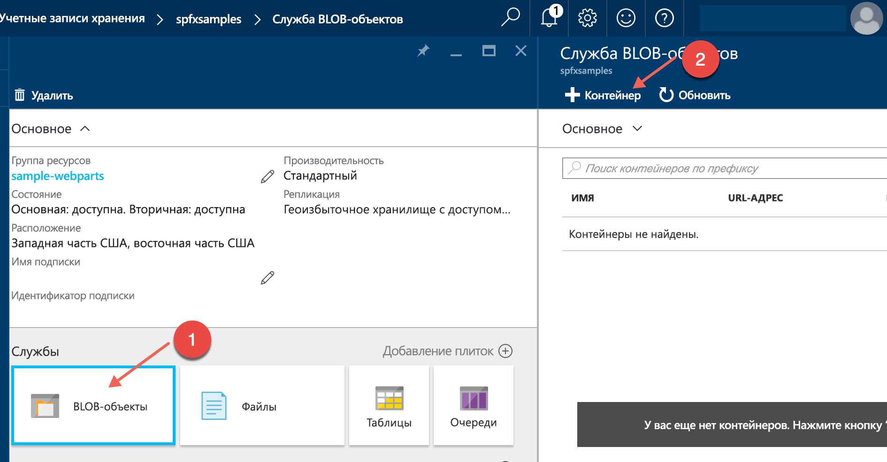
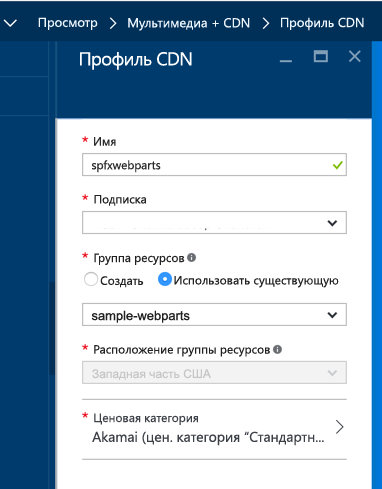
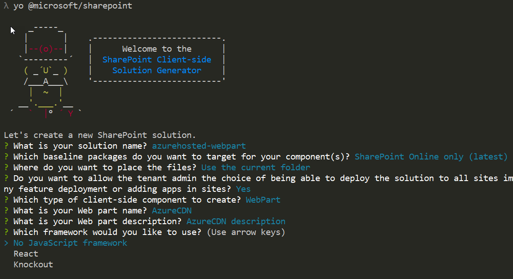
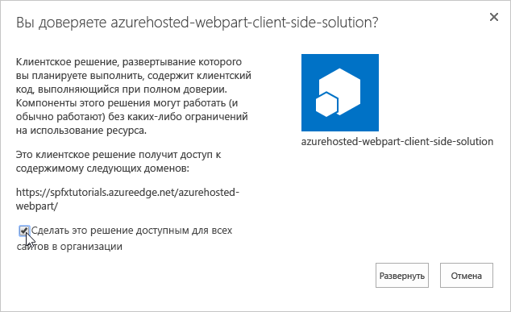
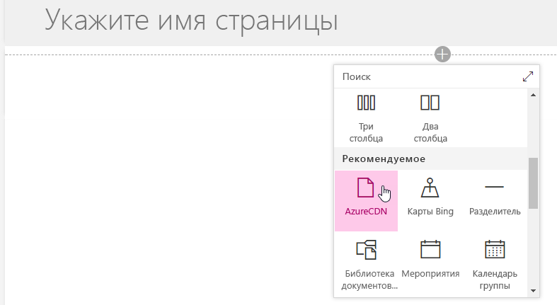
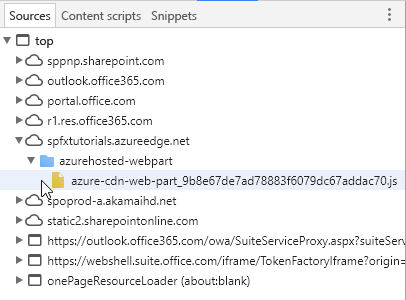

# <a name="deploy-your-sharepoint-client-side-web-part-to-azure-cdn"></a><span data-ttu-id="c1ca2-102">Развертывание клиентской веб-части SharePoint в CDN Azure</span><span class="sxs-lookup"><span data-stu-id="c1ca2-102">Deploy your SharePoint client-side web part to a CDN</span></span>

<span data-ttu-id="c1ca2-103">В этой статье вы можете создать образец веб-части и развернуть ее ресурсы в сети доставки содержимого Azure, а не использовать заданную по умолчанию сеть CDN Office 365 в качестве решения для размещения.</span><span class="sxs-lookup"><span data-stu-id="c1ca2-103">In this article, you will create a new sample web part and deploy it's assets to a Azure CDN instead of using the default Office 365 CDN as the hosting solution.</span></span> <span data-ttu-id="c1ca2-104">Для развертывания ресурсов мы будем использовать учетную запись службы хранилища Azure, интегрированную с CDN.</span><span class="sxs-lookup"><span data-stu-id="c1ca2-104">You'll use an Azure Storage account integrated with a CDN to deploy your assets.</span></span> <span data-ttu-id="c1ca2-105">Инструменты сборки SharePoint Framework по умолчанию поддерживают развертывание в учетной записи службы хранилища Azure. Однако вы также можете вручную отправить файлы предпочитаемому поставщику CDN или в SharePoint.</span><span class="sxs-lookup"><span data-stu-id="c1ca2-105">SharePoint Framework build tools provide out-of-the-box support for deploying to an Azure Storage account; however, you can also manually upload the files to your favorite CDN provider or to SharePoint.</span></span>

> [!NOTE]
> <span data-ttu-id="c1ca2-106">Разместить ресурсы веб-части можно несколькими способами.</span><span class="sxs-lookup"><span data-stu-id="c1ca2-106">There are multiple different hosting options for your web part assets.</span></span> <span data-ttu-id="c1ca2-107">Этот учебник описывает CDN Azure, но можно также использовать [сеть доставки содержимого Office 365](./hosting-webpart-from-office-365-cdn.md) или просто разместить активы в библиотеке SharePoint со своего клиента.</span><span class="sxs-lookup"><span data-stu-id="c1ca2-107">This tutorial concentrates on showing the Azure CDN option, but you could also use the [Office 365 CDN](./hosting-webpart-from-office-365-cdn.md) or simply host your assets from SharePoint library from your tenant.</span></span> <span data-ttu-id="c1ca2-108">Последний вариант тоже рабочий, но уступает в производительности сети доставки содержимого.</span><span class="sxs-lookup"><span data-stu-id="c1ca2-108">In the latter case, you would not benefit from the CDN performance improvements, but that would also work from the functionality perspective.</span></span> <span data-ttu-id="c1ca2-109">Ресурсы можно разместить в любом расположении, к которому пользователи могут получить доступ с помощью протокола HTTP.</span><span class="sxs-lookup"><span data-stu-id="c1ca2-109">Any location which end users can access using HTTP would be technically suitable for hosting the assets for end users.</span></span>

## <a name="configure-azure-storage-account"></a><span data-ttu-id="c1ca2-110">Как настроить учетную запись службы хранилища Azure</span><span class="sxs-lookup"><span data-stu-id="c1ca2-110">Configure Azure storage account</span></span>

<span data-ttu-id="c1ca2-111">Настройте учетную запись хранения Azure и интегрируйте ее с CDN.</span><span class="sxs-lookup"><span data-stu-id="c1ca2-111">Configure an Azure storage account and integrate it with the CDN.</span></span>

<span data-ttu-id="c1ca2-112">Вы можете выполнить действия, описанные в статье [Интеграция учетной записи хранения с CDN](https://azure.microsoft.com/ru-RU/documentation/articles/cdn-create-a-storage-account-with-cdn/), а также подробные указания из этой статьи, чтобы создать учетную запись хранения Azure и интегрировать ее с CDN.</span><span class="sxs-lookup"><span data-stu-id="c1ca2-112">You can follow the instructions in the article [Integrate a Storage Account with CDN](https://azure.microsoft.com/ru-RU/documentation/articles/cdn-create-a-storage-account-with-cdn/) along with the detailed steps in this article to create an Azure storage account and integrate it with the CDN.</span></span> <span data-ttu-id="c1ca2-113">Вам потребуются следующие сведения:</span><span class="sxs-lookup"><span data-stu-id="c1ca2-113">You will need the following information.</span></span>

### <a name="storage-account-name"></a><span data-ttu-id="c1ca2-114">Имя учетной записи хранения</span><span class="sxs-lookup"><span data-stu-id="c1ca2-114">Storage account name</span></span>

<span data-ttu-id="c1ca2-115">Это имя, используемое для создания учетной записи хранения, как описано в разделе [Шаг 1. Создание учетной записи хранения](https://azure.microsoft.com/ru-RU/documentation/articles/cdn-create-a-storage-account-with-cdn/#step-1-create-a-storage-account).</span><span class="sxs-lookup"><span data-stu-id="c1ca2-115">This is the name you used to create your storage account, as described in [Step 1: Create a storage account](https://azure.microsoft.com/ru-RU/documentation/articles/cdn-create-a-storage-account-with-cdn/#step-1-create-a-storage-account).</span></span>

<span data-ttu-id="c1ca2-116">Например, на приведенном ниже снимке экрана **spfxsamples** — это имя учетной записи хранения.</span><span class="sxs-lookup"><span data-stu-id="c1ca2-116">For example, in the following screenshot, **spfxsamples** is the storage account name.</span></span>


<span data-ttu-id="c1ca2-118">При этом будет создана конечная точка **spfxsamples.blob.core.windows.net** для учетной записи хранения.</span><span class="sxs-lookup"><span data-stu-id="c1ca2-118">This will create a new storage account endpoint **spfxsamples.blob.core.windows.net**.</span></span> 

> [!NOTE]
> <span data-ttu-id="c1ca2-119">Потребуется указать уникальное имя учетной записи хранения для своих проектов SharePoint Framework.</span><span class="sxs-lookup"><span data-stu-id="c1ca2-119">You will need to create a unique storage name for your SharePoint Framework project.</span></span>

### <a name="blob-container-name"></a><span data-ttu-id="c1ca2-120">Имя контейнера больших двоичных объектов</span><span class="sxs-lookup"><span data-stu-id="c1ca2-120">BLOB container name</span></span>

<span data-ttu-id="c1ca2-p104">Создайте контейнер службы BLOB-объектов. Он будет доступен на панели мониторинга вашей учетной записи хранения.</span><span class="sxs-lookup"><span data-stu-id="c1ca2-p104">Create a new Blob service container. This will be available in your storage account dashboard.</span></span>

<span data-ttu-id="c1ca2-123">Нажмите **+ Контейнер** и создайте контейнер со следующими параметрами:</span><span class="sxs-lookup"><span data-stu-id="c1ca2-123">Select the **+ Container** and create a new container with the following:</span></span>

* <span data-ttu-id="c1ca2-124">Имя: **azurehosted-webpart**</span><span class="sxs-lookup"><span data-stu-id="c1ca2-124">Name: **azurehosted-webpart**</span></span>
* <span data-ttu-id="c1ca2-125">Тип доступа: "Контейнер"</span><span class="sxs-lookup"><span data-stu-id="c1ca2-125">Access type: Container</span></span>



### <a name="storage-account-access-key"></a><span data-ttu-id="c1ca2-127">Ключ доступа к учетной записи хранения</span><span class="sxs-lookup"><span data-stu-id="c1ca2-127">Storage account access key</span></span>

<span data-ttu-id="c1ca2-128">На панели мониторинга учетной записи хранения нажмите **Ключ доступа** и скопируйте один из ключей доступа.</span><span class="sxs-lookup"><span data-stu-id="c1ca2-128">In the storage account dashboard, choose **Access Key** in the dashboard and copy one of the access keys.</span></span>


### <a name="cdn-profile-and-endpoint"></a><span data-ttu-id="c1ca2-130">Профиль и конечная точка CDN</span><span class="sxs-lookup"><span data-stu-id="c1ca2-130">CDN profile and endpoint</span></span>

<span data-ttu-id="c1ca2-131">Создайте профиль CDN и свяжите конечную точку CDN с этим контейнером BLOB-объектов.</span><span class="sxs-lookup"><span data-stu-id="c1ca2-131">Create a new CDN profile and associate the CDN endpoint with this BLOB container.</span></span>

<span data-ttu-id="c1ca2-132">Создание профиля CDN описывается в разделе [Шаг 2. Создание нового профиля сети CDN](https://azure.microsoft.com/ru-RU/documentation/articles/cdn-create-a-storage-account-with-cdn/#step-2-create-a-new-cdn-profile).</span><span class="sxs-lookup"><span data-stu-id="c1ca2-132">Create a new CDN profile as described in [Step 2: Create a new CDN profile](https://azure.microsoft.com/ru-RU/documentation/articles/cdn-create-a-storage-account-with-cdn/#step-2-create-a-new-cdn-profile).</span></span>

<span data-ttu-id="c1ca2-133">Например, на следующем снимке экрана **spfxwebparts** — это имя профиля CDN.</span><span class="sxs-lookup"><span data-stu-id="c1ca2-133">For example, in the following screenshot, **spfxwebparts** is the CDN profile name.</span></span>



<span data-ttu-id="c1ca2-135">Создание конечной точки CDN описывается в разделе [Шаг 3. Создание новой конечной точки сети CDN](https://azure.microsoft.com/ru-RU/documentation/articles/cdn-create-a-storage-account-with-cdn/#step-3-create-a-new-cdn-endpoint).</span><span class="sxs-lookup"><span data-stu-id="c1ca2-135">Create a CDN endpoint as described in [Step 3: Create a new CDN endpoint](https://azure.microsoft.com/ru-RU/documentation/articles/cdn-create-a-storage-account-with-cdn/#step-3-create-a-new-cdn-endpoint).</span></span>

<span data-ttu-id="c1ca2-136">Например, на следующем снимке экрана **spfxsamples** — это имя конечной точки, **Storage** — это тип источника, а **spfxsamples.blob.core.windows.net** — это учетная запись хранения.</span><span class="sxs-lookup"><span data-stu-id="c1ca2-136">For example, in the following screenshot, **spfxsamples** is the endpoint name, **Storage** is the origin type, and **spfxsamples.blob.core.windows.net** is the storage account.</span></span>


<span data-ttu-id="c1ca2-138">Конечная точка CDN будет создана со следующим URL-адресом: http://spfxsamples.azureedge.net</span><span class="sxs-lookup"><span data-stu-id="c1ca2-138">The CDN endpoint will be created with the following URL: http://spfxsamples.azureedge.net</span></span>

<span data-ttu-id="c1ca2-139">Так как конечная точка CDN связана с учетной записью хранения, вы также можете получить доступ к контейнеру больших двоичных объектов по следующему URL-адресу: http://spfxsamples.azureedge.net/azurehosted-webpart/</span><span class="sxs-lookup"><span data-stu-id="c1ca2-139">Because you associated the CDN endpoint with your storage account, you can also access the BLOB container at the following URL:http://spfxsamples.azureedge.net/helloworld-webpart/</span></span>

<span data-ttu-id="c1ca2-140">Но обратите внимание, что вы еще не развернули файлы.</span><span class="sxs-lookup"><span data-stu-id="c1ca2-140">Note, however that you have not yet deployed the files.</span></span>

## <a name="creating-a-new-web-part-project"></a><span data-ttu-id="c1ca2-141">Создание проекта веб-части</span><span class="sxs-lookup"><span data-stu-id="c1ca2-141">Creating a new Web Part project</span></span>

<span data-ttu-id="c1ca2-142">Создайте каталог проекта в удобном для вас расположении:</span><span class="sxs-lookup"><span data-stu-id="c1ca2-142">Create a new project directory in your preferred location:</span></span>

```
md azurehosted-webpart
```

<span data-ttu-id="c1ca2-143">Перейдите к каталогу проекта:</span><span class="sxs-lookup"><span data-stu-id="c1ca2-143">Go to the project directory:</span></span>

```
cd azurehosted-webpart
```

<span data-ttu-id="c1ca2-144">Создайте решение SharePoint Framework, запустив генератор Yeoman для SharePoint:</span><span class="sxs-lookup"><span data-stu-id="c1ca2-144">Create a new SharePoint Framework solution by running Yeoman SharePoint Generator:</span></span>

```
yo @microsoft/sharepoint
```
    
<span data-ttu-id="c1ca2-145">Когда появится запрос:</span><span class="sxs-lookup"><span data-stu-id="c1ca2-145">When prompted:</span></span>

* <span data-ttu-id="c1ca2-146">Оставьте имя по умолчанию (**azurehosted-webpart**) для решения и нажмите клавишу **ВВОД**.</span><span class="sxs-lookup"><span data-stu-id="c1ca2-146">Accept the default **helloworld-webpart** as your solution name and choose **Enter**.</span></span>
* <span data-ttu-id="c1ca2-147">Выберите **SharePoint Online only (latest)** (Только SharePoint Online, последняя версия) и нажмите клавишу **ВВОД**.</span><span class="sxs-lookup"><span data-stu-id="c1ca2-147">Choose **SharePoint Online only (latest)**, and press **Enter**.</span></span>
* <span data-ttu-id="c1ca2-148">Выберите вариант **Use the current folder** (Использовать текущую папку) для размещения файлов.</span><span class="sxs-lookup"><span data-stu-id="c1ca2-148">Select **Use the current folder** for where to place the files.</span></span>
* <span data-ttu-id="c1ca2-149">Введите **y**, чтобы выполнить развертывание на уровне клиента. При этом веб-часть станет доступна на всех сайтах сразу после развертывания.</span><span class="sxs-lookup"><span data-stu-id="c1ca2-149">Choose **y** to use the tenant-scoped deployment option, which makes web part available across sites immediately when it's deployed.</span></span> 
* <span data-ttu-id="c1ca2-150">Выберите **WebPart** в качестве типа создаваемого клиентского компонента.</span><span class="sxs-lookup"><span data-stu-id="c1ca2-150">Choose **WebPart** as the client-side component type to be created.</span></span> 

<span data-ttu-id="c1ca2-151">Далее вам потребуется указать определенные сведения о веб-части:</span><span class="sxs-lookup"><span data-stu-id="c1ca2-151">The next set of prompts will ask for specific information about your web part:</span></span>

* <span data-ttu-id="c1ca2-152">Укажите **AzureCDN** в качестве имени веб-части и нажмите клавишу **ВВОД**.</span><span class="sxs-lookup"><span data-stu-id="c1ca2-152">Use **DocumentCardExample** for your web part name and choose **Enter**.</span></span>
* <span data-ttu-id="c1ca2-153">Оставьте в качестве описания веб-части вариант по умолчанию (**AzureCDN description**) и нажмите клавишу **ВВОД**.</span><span class="sxs-lookup"><span data-stu-id="c1ca2-153">Accept the default **HelloWorld description** as your web part description and choose **Enter**.</span></span>
* <span data-ttu-id="c1ca2-154">Оставьте выбранным параметр **No javascript web framework** (Не использовать платформу веб-решений на базе JavaScript) и нажмите клавишу **ВВОД**.</span><span class="sxs-lookup"><span data-stu-id="c1ca2-154">Accept the default **No javascript web framework** as the framework you would like to use and choose **Enter**.</span></span>



<span data-ttu-id="c1ca2-p105">После этого Yeoman выполнит скаффолдинг файлов решения и установит требуемые зависимости. Это может занять несколько минут. При этом Yeoman также включит в проект вашу веб-часть.</span><span class="sxs-lookup"><span data-stu-id="c1ca2-p105">At this point, Yeoman will scaffold the solution files and install the required dependencies. This might take a few minutes. Yeoman will scaffold the project to include your custom web part as well.</span></span>

<span data-ttu-id="c1ca2-159">После скаффолдинга заблокируйте версию зависимостей проекта, выполнив следующую команду:</span><span class="sxs-lookup"><span data-stu-id="c1ca2-159">Once the scaffolding completes, lock down the version of the project dependencies by running the following command:</span></span>

```sh
npm shrinkwrap
```

<span data-ttu-id="c1ca2-160">Затем введите следующую команду, чтобы открыть проект веб-части в Visual Studio Code:</span><span class="sxs-lookup"><span data-stu-id="c1ca2-160">Next, type the following to open the web part project in Visual Studio Code:</span></span>

```
code .
```

## <a name="configure-solution-not-to-use-default-settings"></a><span data-ttu-id="c1ca2-161">Изменение параметров решения, заданных по умолчанию</span><span class="sxs-lookup"><span data-stu-id="c1ca2-161">Configure solution not to use default settings</span></span>

<span data-ttu-id="c1ca2-162">Откройте файл **deploy-azure-storage.json** в папке **config**.</span><span class="sxs-lookup"><span data-stu-id="c1ca2-162">Open **deploy-azure-storage.json** in the **config** folder.</span></span>

<span data-ttu-id="c1ca2-163">Он используется для управления упаковкой решения.</span><span class="sxs-lookup"><span data-stu-id="c1ca2-163">This is where we control the solution packaging.</span></span>

<span data-ttu-id="c1ca2-164">Замените значение параметра `includeClientSideAssets` на **false**, чтобы клиентские ресурсы НЕ упаковывались в SPPKG-файл (это действие выполняется по умолчанию).</span><span class="sxs-lookup"><span data-stu-id="c1ca2-164">Update `includeClientSideAssets` value as **false** so that client-side assets are NOT packaged inside of the sppkg file, which is the default behavior.</span></span> <span data-ttu-id="c1ca2-165">Так как мы размещаем ресурсы из внешней сети доставки содержимого, нам не нужно включать их в пакет решения.</span><span class="sxs-lookup"><span data-stu-id="c1ca2-165">Since we are hosting assets from external CDN, we do not want them to be included in the solution package.</span></span> <span data-ttu-id="c1ca2-166">Конфигурация должна выглядеть примерно так, как показано ниже.</span><span class="sxs-lookup"><span data-stu-id="c1ca2-166">Your configuration should look somewhat following.</span></span>

``` json
{
  "$schema": "https://dev.office.com/json-schemas/spfx-build/package-solution.schema.json",
  "solution": {
    "name": "azurehosted-webpart-client-side-solution",
    "id": "a4e95ed1-d096-4573-8a57-d0cc3b52da6a",
    "version": "1.0.0.0",
    "includeClientSideAssets": false,
    "skipFeatureDeployment": true
  },
  "paths": {
    "zippedPackage": "solution/azurehosted-webpart.sppkg"
  }
}
```

> [!NOTE]
> <span data-ttu-id="c1ca2-167">Для параметра `skipFeatureDeployment` задано значение **true**, так как в ответ на предложение Yeoman выполнить развертывание на уровне клиента был выбран параметр "Y".</span><span class="sxs-lookup"><span data-stu-id="c1ca2-167">`skipFeatureDeployment` setting is here **true** since answer for the tenant-scope deployment option was said to be 'y' in the Yeoman flow.</span></span> <span data-ttu-id="c1ca2-168">Это означает, что вам НЕ требуется явно устанавливать решение на сайте, прежде чем веб-часть станет доступна.</span><span class="sxs-lookup"><span data-stu-id="c1ca2-168">This means that you do NOT need to explicitly install solution to the site before web part is available.</span></span> <span data-ttu-id="c1ca2-169">Чтобы веб-часть была доступна на всех сайтах в определенном клиенте, достаточно развернуть и утвердить пакет решения в каталоге приложений клиента.</span><span class="sxs-lookup"><span data-stu-id="c1ca2-169">Deploying and approving solution package in tenant app catalog is sufficient to make web part available cross all the sites in the given tenant.</span></span>


## <a name="configure-azure-storage-account-details"></a><span data-ttu-id="c1ca2-170">Настройка сведений об учетной записи службы хранилища Azure</span><span class="sxs-lookup"><span data-stu-id="c1ca2-170">Configure Azure Storage account details</span></span>

<span data-ttu-id="c1ca2-171">Откройте файл **deploy-azure-storage.json** в папке **config**.</span><span class="sxs-lookup"><span data-stu-id="c1ca2-171">Open **deploy-azure-storage.json** in the **config** folder.</span></span>

<span data-ttu-id="c1ca2-172">Этот файл содержит сведения об учетной записи службы хранилища Azure.</span><span class="sxs-lookup"><span data-stu-id="c1ca2-172">This is the file that contains your Azure Storage account details.</span></span>

```json
{
  "$schema": "https://dev.office.com/json-schemas/spfx-build/deploy-azure-storage.schema.json",
  "workingDir": "./temp/deploy/",
  "account": "<!-- STORAGE ACCOUNT NAME -->",
  "container": "azurehosted-webpart",
  "accessKey": "<!-- ACCESS KEY -->"
}
```

<span data-ttu-id="c1ca2-173">Замените значения **account**, **container** и **accessKey** именем учетной записи хранения, именем контейнера BLOB-объектов и ключом доступа к учетной записи хранения соответственно.</span><span class="sxs-lookup"><span data-stu-id="c1ca2-173">Replace the **account**, **container**, **accessKey** with your storage account name, BLOB container and storage account access key respectively.</span></span>

<span data-ttu-id="c1ca2-174">**workingDir** — это каталог, в котором располагаются активы веб-части.</span><span class="sxs-lookup"><span data-stu-id="c1ca2-174">**workingDir** is the directory where the web part assets will be located.</span></span>

<span data-ttu-id="c1ca2-175">В нашем примере для созданной ранее учетной записи хранения этот файл будет выглядеть следующим образом:</span><span class="sxs-lookup"><span data-stu-id="c1ca2-175">In this example, with the storage account created earlier, this file will look like:</span></span>

```json
{
  "workingDir": "./temp/deploy/",
  "account": "spfxsamples",
  "container": "azurehosted-webpart",
  "accessKey": "q1UsGWocj+CnlLuv9ZpriOCj46ikgBbDBCaQ0FfE8+qKVbDTVSbRGj41avlG73rynbvKizZpIKK9XpnpA=="
}
```

<span data-ttu-id="c1ca2-176">Сохраните файл.</span><span class="sxs-lookup"><span data-stu-id="c1ca2-176">Save the file.</span></span>

## <a name="configuring-web-part-to-load-from-cdn"></a><span data-ttu-id="c1ca2-177">Настройка веб-части для загрузки из сети CDN</span><span class="sxs-lookup"><span data-stu-id="c1ca2-177">Configuring web part to load from CDN</span></span>

<span data-ttu-id="c1ca2-178">Чтобы веб-часть загружалась из сети CDN, необходимо сообщить ей путь к этой сети.</span><span class="sxs-lookup"><span data-stu-id="c1ca2-178">In order for the web part to load from your CDN, you will need to tell it your CDN path.</span></span>

<span data-ttu-id="c1ca2-179">Переключитесь на Visual Studio Code и откройте файл **write-manifests.json** в папке **config**.</span><span class="sxs-lookup"><span data-stu-id="c1ca2-179">Switch to Visual Studio Code and open the **write-manifests.json** from the **config** folder.</span></span>

<span data-ttu-id="c1ca2-180">Введите базовый путь к сети CDN в свойстве **cdnBasePath**.</span><span class="sxs-lookup"><span data-stu-id="c1ca2-180">Enter your CDN base path for the **cdnBasePath** property.</span></span>

```json
{
  "cdnBasePath": "<!-- PATH TO CDN -->"
}
```

<span data-ttu-id="c1ca2-181">В нашем примере для созданного ранее профиля CDN этот файл будет выглядеть следующим образом:</span><span class="sxs-lookup"><span data-stu-id="c1ca2-181">In this example, with the CDN profile created earlier, this file will look like:</span></span>

```json
{
  "cdnBasePath": "https://spfxsamples.azureedge.net/azurehosted-webpart/"
}
```

> [!NOTE]
> <span data-ttu-id="c1ca2-182">Базовый путь к сети CDN — это конечная точка CDN с контейнером BLOB-объектов.</span><span class="sxs-lookup"><span data-stu-id="c1ca2-182">The CDN base path is the CDN endpoint with the BLOB container.</span></span>

<span data-ttu-id="c1ca2-183">Сохраните файл.</span><span class="sxs-lookup"><span data-stu-id="c1ca2-183">Save the file.</span></span>


## <a name="prepare-web-part-assets-to-deploy"></a><span data-ttu-id="c1ca2-184">Подготовка активов веб-части к развертыванию</span><span class="sxs-lookup"><span data-stu-id="c1ca2-184">Prepare web part assets to deploy</span></span>

<span data-ttu-id="c1ca2-185">Прежде чем отправлять активы в сеть CDN, их необходимо собрать.</span><span class="sxs-lookup"><span data-stu-id="c1ca2-185">Before uploading the assets to CDN, you need to build them.</span></span>

<span data-ttu-id="c1ca2-186">Переключитесь на консоль и выполните следующую задачу `gulp`:</span><span class="sxs-lookup"><span data-stu-id="c1ca2-186">Switch to the console and execute the following `gulp` task:</span></span>

```
gulp bundle --ship
```

<span data-ttu-id="c1ca2-187">При этом будут созданы сжатые активы, необходимые для отправки поставщику CDN.</span><span class="sxs-lookup"><span data-stu-id="c1ca2-187">This will build the minified assets required to upload to the CDN provider.</span></span> <span data-ttu-id="c1ca2-188">Параметр `--ship` указывает инструменту сборки, что выполняется сборка для распространения.</span><span class="sxs-lookup"><span data-stu-id="c1ca2-188">The `--ship` indicates the build tool to build for distribution.</span></span> <span data-ttu-id="c1ca2-189">Вы также можете заметить, что в выходных данных инструментов сборки указан целевой объект сборки SHIP.</span><span class="sxs-lookup"><span data-stu-id="c1ca2-189">You should also notice the output of the build tools indicate the Build Target is SHIP.</span></span>

```
Build target: SHIP
[21:23:01] Using gulpfile ~/apps/azurehosted-webpart/gulpfile.js
[21:23:01] Starting gulp
[21:23:01] Starting 'default'...
```

<span data-ttu-id="c1ca2-190">Сжатые активы хранятся в каталоге `temp\deploy`.</span><span class="sxs-lookup"><span data-stu-id="c1ca2-190">The minified assets can be found under the `temp\deploy` directory.</span></span>

## <a name="deploy-assets-to-azure-storage"></a><span data-ttu-id="c1ca2-191">Развертывание ресурсов в службе хранилища Azure</span><span class="sxs-lookup"><span data-stu-id="c1ca2-191">Deploy assets to Azure Storage</span></span>

<span data-ttu-id="c1ca2-192">Переключитесь на консоль для каталога проекта **azurehosted-webpart**.</span><span class="sxs-lookup"><span data-stu-id="c1ca2-192">Switch to the console of the **HelloWorld** project directory.</span></span>

<span data-ttu-id="c1ca2-193">Введите задачу gulp для развертывания ресурсов в учетной записи хранения:</span><span class="sxs-lookup"><span data-stu-id="c1ca2-193">Enter the gulp task to deploy the assets to your storage account:</span></span>

```
gulp deploy-azure-storage
```

<span data-ttu-id="c1ca2-194">При этом пакет веб-части и другие ресурсы, например файлы JavaScript и CSS, будут развернуты в сети CDN.</span><span class="sxs-lookup"><span data-stu-id="c1ca2-194">This will deploy the web part bundle along with other assets like JavaScript and CSS files to the CDN.</span></span>

## <a name="deploy-the-updated-package"></a><span data-ttu-id="c1ca2-195">Развертывание обновленного пакета</span><span class="sxs-lookup"><span data-stu-id="c1ca2-195">Deploy the updated package</span></span>

### <a name="package-the-solution"></a><span data-ttu-id="c1ca2-196">Упаковка решения</span><span class="sxs-lookup"><span data-stu-id="c1ca2-196">Package the solution</span></span>

<span data-ttu-id="c1ca2-197">Так как вы изменили пакет веб-части, его потребуется заново развернуть к каталоге приложений.</span><span class="sxs-lookup"><span data-stu-id="c1ca2-197">Because you changed the web part bundle, you will need to re-deploy the package to the App Catalog.</span></span> <span data-ttu-id="c1ca2-198">Вы использовали **--ship**, чтобы создать минифицированные ресурсы для распространения.</span><span class="sxs-lookup"><span data-stu-id="c1ca2-198">You used **--ship** to generate minified assets for distribution.</span></span>

<span data-ttu-id="c1ca2-199">Переключитесь на консоль для каталога проекта **azurehosted-webpart**.</span><span class="sxs-lookup"><span data-stu-id="c1ca2-199">Switch to the console of the **HelloWorld** project directory.</span></span>

<span data-ttu-id="c1ca2-200">Выполните задачу gulp, чтобы упаковать клиентское решение (на этот раз с флагом `--ship`).</span><span class="sxs-lookup"><span data-stu-id="c1ca2-200">Enter the gulp task to package the client-side solution, this time with the `--ship` flag set.</span></span> <span data-ttu-id="c1ca2-201">При этом задача использует базовый путь к сети CDN, настроенный на предыдущем шаге:</span><span class="sxs-lookup"><span data-stu-id="c1ca2-201">This forces the task to pick up the CDN base path configured in the previous step:</span></span>

```
gulp package-solution --ship
```

<span data-ttu-id="c1ca2-202">При этом будет создан обновленный пакет клиентского решения в папке **sharepoint\solution**.</span><span class="sxs-lookup"><span data-stu-id="c1ca2-202">This will create the updated client-side solution package in the **sharepoint\solution** folder.</span></span>

### <a name="upload-to-your-app-catalog"></a><span data-ttu-id="c1ca2-203">Отправка в каталог приложений</span><span class="sxs-lookup"><span data-stu-id="c1ca2-203">Upload to your App Catalog</span></span>

<span data-ttu-id="c1ca2-204">Отправьте или перетащите пакет клиентского решения в каталог приложений.</span><span class="sxs-lookup"><span data-stu-id="c1ca2-204">Upload or drag & drop the client-side solution package to the App Catalog.</span></span> <span data-ttu-id="c1ca2-205">Обратите внимание на то, что указан URL-адрес CDN Azure, заданный на предыдущих этапах.</span><span class="sxs-lookup"><span data-stu-id="c1ca2-205">Notice how the URL is pointing to the Azure CDN URL configured in the previous steps.</span></span> 

<span data-ttu-id="c1ca2-206">**Установите флажок**, чтобы это решение можно было развертывать автоматически доступным на всех сайтах в организации.</span><span class="sxs-lookup"><span data-stu-id="c1ca2-206">**Click checkbox** on indicating that solution can be deployed automatically available cross all sites in the organization.</span></span>



<span data-ttu-id="c1ca2-208">Нажмите кнопку **Развернуть**.</span><span class="sxs-lookup"><span data-stu-id="c1ca2-208">Choose **Deploy**</span></span>

<span data-ttu-id="c1ca2-209">Теперь в каталоге приложений хранится пакет клиентского решения, в который был загружен пакет веб-части из сети CDN.</span><span class="sxs-lookup"><span data-stu-id="c1ca2-209">The App Catalog will now have the latest client-side solution package where the web part bundle is loaded from the CDN.</span></span>

## <a name="test-the-helloworld-web-part"></a><span data-ttu-id="c1ca2-210">Тестирование веб-части HelloWorld</span><span class="sxs-lookup"><span data-stu-id="c1ca2-210">Test the HelloWorld web part</span></span>

<span data-ttu-id="c1ca2-211">Перейдите на любой сайт SharePoint в клиенте и выберите пункт **Добавить страницу** в меню со значком *шестеренки*.</span><span class="sxs-lookup"><span data-stu-id="c1ca2-211">Go to any SharePoint site in your tenant and choose **Add a page** from the *gears* menu.</span></span>

<span data-ttu-id="c1ca2-212">**Отредактируйте** страницу и выберите веб-часть **AzureCDN** в средстве выбора веб-части, чтобы убедиться, что развертывание успешно выполнено.</span><span class="sxs-lookup"><span data-stu-id="c1ca2-212">**Edit** the page and select **AzureCDN** web part from the web part picker to confirm that your deployment has been successful.</span></span>



<span data-ttu-id="c1ca2-214">Обратите внимание на то, что команда **gulp serve** не выполняется, поэтому никакие ресурсы не предоставляются из **localhost**.</span><span class="sxs-lookup"><span data-stu-id="c1ca2-214">Notice that you are no longer running **gulp serve**, and therefore nothing is served from **localhost**.</span></span> <span data-ttu-id="c1ca2-215">Контент предоставляется из CDN Azure.</span><span class="sxs-lookup"><span data-stu-id="c1ca2-215">Content is served from the Azure CDN.</span></span> <span data-ttu-id="c1ca2-216">Вы также можете нажать клавишу F12 в браузере и убедиться, что CDN Azure отображается как один из источников ресурсов страницы.</span><span class="sxs-lookup"><span data-stu-id="c1ca2-216">You can also double check this by pressing F12 in your browser and confirm that you can see the Azure CDN as one of the sources for the page assets.</span></span>



## <a name="deploying-to-other-cdns"></a><span data-ttu-id="c1ca2-218">Развертывание в других сетях CDN</span><span class="sxs-lookup"><span data-stu-id="c1ca2-218">Deploying to other CDNs</span></span>

<span data-ttu-id="c1ca2-219">Чтобы развернуть ресурсы у предпочитаемого поставщика CDN, вы можете скопировать файлы из папки **temp\deploy**.</span><span class="sxs-lookup"><span data-stu-id="c1ca2-219">In order to deploy the assets to your favorite CDN provider, you can copy the files from **temp\deploy** folder.</span></span> <span data-ttu-id="c1ca2-220">Чтобы создать ресурсы для распространения, выполните команду gulp так же, как и ранее, указав параметр **--ship**:</span><span class="sxs-lookup"><span data-stu-id="c1ca2-220">To generate assets for distribution you will run the following gulp command as we did before with the **--ship** parameter:</span></span>

```
gulp bundle --ship
```

<span data-ttu-id="c1ca2-221">Если вы обновляете **cdnBasePath** соответствующим образом, файлы загружаются правильно.</span><span class="sxs-lookup"><span data-stu-id="c1ca2-221">As long as you are updating the **cdnBasePath** accordingly, your files are being properly loaded.</span></span>

> [!NOTE]
> <span data-ttu-id="c1ca2-222">Если вы обнаружили ошибку в документации или SharePoint Framework, сообщите о ней разработчикам SharePoint, указав в [списке проблем для репозитория sp-dev-docs](https://github.com/SharePoint/sp-dev-docs/issues).</span><span class="sxs-lookup"><span data-stu-id="c1ca2-222">If you find an issue in the documentation or in the SharePoint Framework, please report that to SharePoint engineering using the [issue list at sp-dev-docs repository](https://github.com/SharePoint/sp-dev-docs/issues).</span></span> <span data-ttu-id="c1ca2-223">Заранее спасибо!</span><span class="sxs-lookup"><span data-stu-id="c1ca2-223">Thanks for your input advance.</span></span>