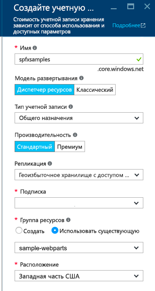
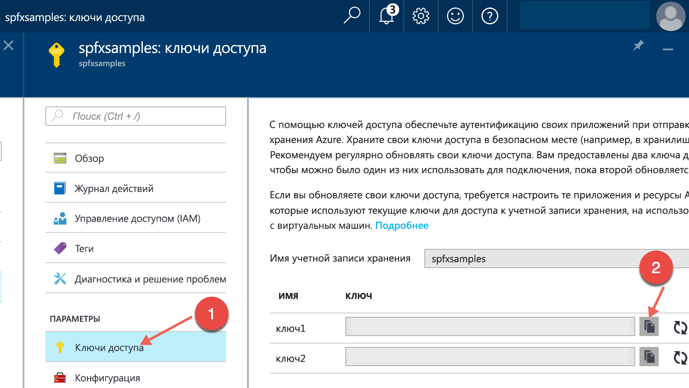

# <a name="deploy-your-sharepoint-client-side-web-part-to-a-cdn"></a>Развертывание клиентской веб-части SharePoint в CDN

В этой статье описывается развертывание активов **HelloWorld** в удаленной сети доставки содержимого, а не в локальной среде. Для развертывания активов мы будем использовать учетную запись службы хранилища Azure, интегрированную с CDN. Инструменты сборки SharePoint Framework по умолчанию поддерживают развертывание в учетной записи службы хранилища Azure. Однако вы также можете вручную отправить файлы предпочитаемому поставщику CDN или в SharePoint.

Эти действия также показаны в видео на [канале SharePoint PnP в YouTube](https://www.youtube.com/watch?v=FDGatKnjNeM&list=PLR9nK3mnD-OXvSWvS2zglCzz4iplhVrKq). 

<a href="https://www.youtube.com/watch?v=FDGatKnjNeM&list=PLR9nK3mnD-OXvSWvS2zglCzz4iplhVrKq">

</a>

> [!NOTE]
> Существует несколько вариантов разместить активы веб-части. Этот учебник описывает CDN Azure, но можно также использовать [сеть доставки содержимого Office 365](./hosting-webpart-from-office-365-cdn.md) или просто разместить активы в библиотеке SharePoint со своего клиента. Последний вариант тоже рабочий, но уступает в производительности сети доставки содержимого. Активы можно разместить для конечных пользователей в любом расположении, доступном по протоколу HTTP.

## <a name="prerequisites"></a>Предварительные условия

Прежде чем приступать к работе, убедитесь, что выполнены следующие задачи:

* [Создание первой клиентской веб-части](./build-a-hello-world-web-part.md)
* [Подключение клиентской веб-части к SharePoint](./connect-to-sharepoint.md)
* [Развертывание клиентской веб-части на классической странице SharePoint](./serve-your-web-part-in-a-sharepoint-page.md)

## <a name="configure-azure-storage-account"></a>Настройка учетной записи хранения Azure

Настройте учетную запись хранения Azure и интегрируйте ее с CDN.

Вы можете выполнить действия, описанные в статье [Интеграция учетной записи хранения с CDN](https://azure.microsoft.com/ru-RU/documentation/articles/cdn-create-a-storage-account-with-cdn/), а также подробные указания из этой статьи, чтобы создать учетную запись хранения Azure и интегрировать ее с CDN. Вам потребуются следующие сведения:

### <a name="storage-account-name"></a>Имя учетной записи хранения

Это имя, используемое для создания учетной записи хранения, как описано в разделе [Шаг 1. Создание учетной записи хранения](https://azure.microsoft.com/ru-RU/documentation/articles/cdn-create-a-storage-account-with-cdn/#step-1-create-a-storage-account).

Например, на приведенном ниже снимке экрана **spfxsamples** — это имя учетной записи хранения.



При этом будет создана конечная точка **spfxsamples.blob.core.windows.net** для учетной записи хранения. 

> [!NOTE]
> Потребуется указать уникальное имя учетной записи хранения для проекта SharePoint Framework.


### <a name="blob-container-name"></a>Имя контейнера BLOB-объектов

Создайте контейнер службы BLOB-объектов. Он будет доступен на панели мониторинга вашей учетной записи хранения.

Нажмите **+ Контейнер** и создайте контейнер со следующими параметрами:

* Имя: **helloworld-webpart**
* Тип доступа: Контейнер


### <a name="storage-account-access-key"></a>Ключ доступа к учетной записи хранения

На панели мониторинга учетной записи хранения нажмите **Ключ доступа** и скопируйте один из ключей доступа.



### <a name="cdn-profile-and-endpoint"></a>Профиль и конечная точка CDN

Создайте профиль CDN и свяжите конечную точку CDN с этим контейнером BLOB-объектов.

Создание профиля CDN описывается в разделе [Шаг 2. Создание нового профиля сети CDN](https://azure.microsoft.com/ru-RU/documentation/articles/cdn-create-a-storage-account-with-cdn/#step-2-create-a-new-cdn-profile).

Например, на следующем снимке экрана **spfxwebparts** — это имя профиля CDN.


Создание конечной точки CDN описывается в разделе [Шаг 3. Создание новой конечной точки сети CDN](https://azure.microsoft.com/ru-RU/documentation/articles/cdn-create-a-storage-account-with-cdn/#step-3-create-a-new-cdn-endpoint).

Например, на следующем снимке экрана **spfxsamples** — это имя конечной точки, **Storage** — это тип источника, а **spfxsamples.blob.core.windows.net** — это учетная запись хранения.


Конечная точка CDN будет создана со следующим URL-адресом: http://spfxsamples.azureedge.net

Так как конечная точка CDN связана с учетной записью хранения, вы также можете получить доступ к контейнеру BLOB-объектов по следующему URL-адресу: http://spfxsamples.azureedge.net/helloworld-webpart/

Однако обратите внимание, что вы еще не развернули файлы.

## <a name="project-directory"></a>Каталог проекта

Переключитесь на консоль и убедитесь, что по-прежнему выбран каталог проекта, который использовался для настройки проекта веб-части.

Завершите задачу **gulp serve** с помощью клавиш **CTRL+C** и перейдите к каталогу проекта:

```
cd helloworld-webpart
```

## <a name="configure-azure-storage-account-details"></a>Настройка сведений об учетной записи хранения Azure

Переключитесь на Visual Studio Code и выберите проект веб-части **HelloWorld**.

Откройте файл **deploy-azure-storage.json** в папке **config**.

Этот файл содержит сведения об учетной записи службы хранилища Azure.

```json
{
  "workingDir": "./temp/deploy/",
  "account": "<!-- STORAGE ACCOUNT NAME -->",
  "container": "helloworld-webpart",
  "accessKey": "<!-- ACCESS KEY -->"
}
```

Замените значения **account**, **container** и **accessKey** именем учетной записи хранения, именем контейнера BLOB-объектов и ключом доступа к учетной записи хранения соответственно.

**workingDir** — это каталог, в котором располагаются активы веб-части.

В нашем примере для созданной ранее учетной записи хранения этот файл будет выглядеть следующим образом:

```json
{
  "workingDir": "./temp/deploy/",
  "account": "spfxsamples",
  "container": "helloworld-webpart",
  "accessKey": "q1UsGWocj+CnlLuv9ZpriOCj46ikgBvDBCaQ0FfE8+qKVbDTVSbRGj41avlG73rynbvKizZpIKK9XpnpA=="
}
```

Сохраните файл.

## <a name="configuring-web-part-to-load-from-cdn"></a>Настройка веб-части для загрузки из сети CDN

Чтобы веб-часть загружалась из сети CDN, необходимо сообщить ей путь к этой сети.

Переключитесь на Visual Studio Code и откройте файл **write-manifests.json** в папке **config**.

Введите базовый путь к сети CDN в свойстве **cdnBasePath**.

```json
{
  "cdnBasePath": "<!-- PATH TO CDN -->"
}
```

В нашем примере для созданного ранее профиля CDN этот файл будет выглядеть следующим образом:

```json
{
  "cdnBasePath": "https://spfxsamples.azureedge.net/helloworld-webpart/"
}
```

> [!NOTE]
> Базовый путь к сети CDN — это конечная точка CDN с контейнером BLOB-объектов.

Сохраните файл.


## <a name="prepare-web-part-assets-to-deploy"></a>Подготовка активов веб-части к развертыванию

Прежде чем отправлять активы в сеть CDN, их необходимо собрать.

Переключитесь на консоль и выполните следующую задачу `gulp`:

```
gulp --ship
```

При этом будут созданы сжатые активы, необходимые для отправки поставщику CDN. Параметр `--ship` указывает инструменту сборки, что выполняется сборка для распространения. Вы также можете заметить, что в выходных данных инструментов сборки указан целевой объект сборки SHIP.

```
Build target: SHIP
[21:23:01] Using gulpfile ~/apps/helloworld-webpart/gulpfile.js
[21:23:01] Starting gulp
[21:23:01] Starting 'default'...
```

Сжатые активы хранятся в каталоге `temp\deploy`.

## <a name="deploy-assets-to-azure-storage"></a>Развертывание активов в службе хранилища Azure

Переключитесь на консоль для каталога проекта **HelloWorld**.

Введите задачу gulp для развертывания активов в учетной записи хранения:

```
gulp deploy-azure-storage
```

При этом пакет веб-части и другие ресурсы, например файлы JavaScript и CSS, будут развернуты в сети CDN.

## <a name="deploy-the-updated-package"></a>Развертывание обновленного пакета

### <a name="package-the-solution"></a>Упаковка решения

Так как вы изменили пакет веб-части, его потребуется заново развернуть к каталоге приложений. Вы использовали параметры **--ship**, чтобы создать сжатые активы для распространения.

Переключитесь на консоль для каталога проекта **HelloWorld**.

Введите задачу gulp для упаковки клиентского решения, на этот раз с флагом `--ship`. При этом задача использует базовый путь к сети CDN, настроенный на предыдущем шаге:

```
gulp package-solution --ship
```

При этом будет создан обновленный пакет клиентского решения в папке **sharepoint\solution**.

### <a name="upload-to-your-app-catalog"></a>Отправка в каталог приложений

Отправьте или перетащите пакет клиентского решения в каталог приложений.

Так как вы уже развернули пакет, вам будет предложено заменить существующий пакет.


Нажмите **Заменить**.

Теперь в каталоге приложений хранится пакет клиентского решения, в который был загружен пакет веб-части из сети CDN.

При этом все экземпляры веб-части **HelloWorld** в SharePoint начнут получать ресурсы из сети CDN.

## <a name="test-the-helloworld-web-part"></a>Тестирование веб-части HelloWorld

### <a name="classic-sharepoint-page"></a>Классическая страница SharePoint

Перейдите на созданную вами страницу веб-части **HelloWorld**. Теперь веб-часть **HelloWorld** загружает пакет веб-части и другие активы из сети CDN.

Обратите внимание, что задача **gulp serve** больше не выполняется, поэтому ничего не обслуживается из **localhost**.

## <a name="deploying-to-other-cdns"></a>Развертывание в других сетях CDN

Чтобы развернуть ресурсы у предпочитаемого поставщика CDN, вы можете скопировать файлы из папки **temp\deploy**. Чтобы создать ресурсы для распространения, выполните команду gulp так же, как и ранее, указав параметр **--ship**:

```
gulp --ship
```

Если вы обновляете **cdnBasePath** соответствующим образом, файлы загружаются правильно.

## <a name="next-steps"></a>Дальнейшие действия

Вы можете загрузить jQuery и jQuery UI, а затем собрать веб-часть jQuery Accordion. Дальнейшие указания см. в статье [Добавление jQueryUI Accordion в клиентскую веб-часть](./add-jqueryui-accordion-to-web-part.md).
